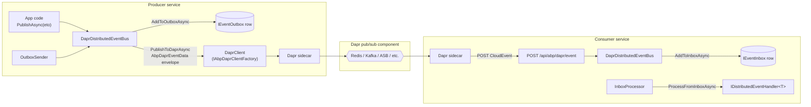

`Volo.Abp.EventBus.Dapr` plugs ABP's distributed event bus into a Dapr **pub/sub** building block. The sidecar handles the actual broker — Redis, Kafka, Service Bus, NATS, GCP Pub/Sub, etc. — and your service speaks HTTP to its sidecar. ABP wraps every event in an `AbpDaprEventData` envelope so MessageId, correlation id and the original payload all survive the round-trip, even though Dapr's CloudEvents protocol does not preserve them natively.

This page covers two packages: `Volo.Abp.EventBus.Dapr` (the bus implementation) and `Volo.Abp.AspNetCore.Mvc.Dapr.EventBus` (the ASP.NET Core endpoint that receives delivered messages).

## Package layout

```text
framework/src/Volo.Abp.EventBus.Dapr/Volo/Abp/EventBus/Dapr/
├── AbpDaprEventBusOptions.cs
├── AbpDaprEventData.cs
├── AbpEventBusDaprModule.cs
└── DaprDistributedEventBus.cs

framework/src/Volo.Abp.AspNetCore.Mvc.Dapr.EventBus/Volo/Abp/AspNetCore/Mvc/Dapr/EventBus/
└── AbpAspNetCoreMvcDaprEventBusModule.cs
```

## `DaprDistributedEventBus`

```csharp
// framework/src/Volo.Abp.EventBus.Dapr/Volo/Abp/EventBus/Dapr/DaprDistributedEventBus.cs
[Dependency(ReplaceServices = true)]
[ExposeServices(typeof(IDistributedEventBus), typeof(DaprDistributedEventBus))]
public class DaprDistributedEventBus : DistributedEventBusBase, ISingletonDependency
{
    protected IDaprSerializer Serializer { get; }
    protected AbpDaprEventBusOptions DaprEventBusOptions { get; }
    protected IAbpDaprClientFactory DaprClientFactory { get; }

    protected ConcurrentDictionary<Type, List<IEventHandlerFactory>> HandlerFactories { get; }
    protected ConcurrentDictionary<string, Type> EventTypes { get; }
}
```

Dependencies:

- `IDaprSerializer` is the JSON serializer from `Volo.Abp.Dapr`. See [Dapr integration](/distributed/dapr-integration).
- `AbpDaprEventBusOptions` provides the configured pub/sub component name.
- `IAbpDaprClientFactory` returns a properly-authenticated `DaprClient`.

## `AbpDaprEventBusOptions`

```csharp
// framework/src/Volo.Abp.EventBus.Dapr/Volo/Abp/EventBus/Dapr/AbpDaprEventBusOptions.cs
public class AbpDaprEventBusOptions
{
    public string PubSubName { get; set; }

    public AbpDaprEventBusOptions()
    {
        PubSubName = "pubsub";
    }
}
```

The single property is the name of your Dapr pub/sub component (`pubsub.yaml`). Every published event uses this name; switching backends is a sidecar configuration change.

## `AbpDaprEventData` envelope

Dapr publishes CloudEvents on the wire. ABP wraps each event in an envelope so identity headers survive:

```csharp
// framework/src/Volo.Abp.EventBus.Dapr/Volo/Abp/EventBus/Dapr/AbpDaprEventData.cs
public class AbpDaprEventData
{
    public string PubSubName { get; set; }
    public string Topic { get; set; }
    public string MessageId { get; set; }
    public string JsonData { get; set; }
    public string? CorrelationId { get; set; }

    public AbpDaprEventData(string pubSubName, string topic, string messageId,
        string jsonData, string? correlationId)
    {
        PubSubName = pubSubName;
        Topic = topic;
        MessageId = messageId;
        JsonData = jsonData;
        CorrelationId = correlationId;
    }
}
```

The CloudEvents `data` field contains this envelope (as JSON); inside it, `JsonData` is the actual serialized event body. The receiver auto-detects the envelope and unwraps it.

## Publishing

```csharp
// framework/src/Volo.Abp.EventBus.Dapr/Volo/Abp/EventBus/Dapr/DaprDistributedEventBus.cs
protected async override Task PublishToEventBusAsync(Type eventType, object eventData)
{
    await PublishToDaprAsync(eventType, eventData, null, CorrelationIdProvider.Get());
}

protected virtual async Task PublishToDaprAsync(
    string eventName,
    object eventData,
    Guid? messageId = null,
    string? correlationId = null)
{
    var client = await DaprClientFactory.CreateAsync();
    var data = new AbpDaprEventData(
        DaprEventBusOptions.PubSubName,
        eventName,
        (messageId ?? GuidGenerator.Create()).ToString("N"),
        Serializer.SerializeToString(eventData),
        correlationId);

    await client.PublishEventAsync(
        pubsubName: DaprEventBusOptions.PubSubName,
        topicName: eventName,
        data: data);
}
```

`client.PublishEventAsync(pubsub, topic, data)` calls the Dapr sidecar's `POST /v1.0/publish/{pubsubname}/{topic}`. The sidecar serializes `data` as a CloudEvent and dispatches it through the configured broker.

### Outbox publication

`PublishFromOutboxAsync` reuses the same envelope path, preserving the outgoing event's id and correlation id:

```csharp
public async override Task PublishFromOutboxAsync(
    OutgoingEventInfo outgoingEvent, OutboxConfig outboxConfig)
{
    var eventType = GetEventType(outgoingEvent.EventName);
    if (eventType == null) return;

    await PublishToDaprAsync(
        outgoingEvent.EventName,
        Serializer.Deserialize(outgoingEvent.EventData, eventType),
        outgoingEvent.Id,
        outgoingEvent.GetCorrelationId());
}
```

`PublishManyFromOutboxAsync` loops the same call per event — Dapr does not expose a batch publish for arbitrary brokers.

## Receiving: the MVC module

Dapr delivers subscribed messages by **POST**-ing to your service. `Volo.Abp.AspNetCore.Mvc.Dapr.EventBus` registers two things:

1. The HTTP endpoint `POST /api/abp/dapr/event` that receives every event.
2. A topic-discovery hook that tells Dapr (via `MapSubscribeHandler`) which `(pubsub, topic)` pairs this service wants.

```csharp
// framework/src/Volo.Abp.AspNetCore.Mvc.Dapr.EventBus/.../AbpAspNetCoreMvcDaprEventBusModule.cs
[DependsOn(typeof(AbpAspNetCoreMvcDaprModule), typeof(AbpEventBusDaprModule))]
public class AbpAspNetCoreMvcDaprEventBusModule : AbpModule
{
    public override void ConfigureServices(ServiceConfigurationContext context)
    {
        PostConfigure<AbpEndpointRouterOptions>(options =>
        {
            options.EndpointConfigureActions.Add(endpointContext =>
            {
                var topicMetadatas = /* … existing TopicAttribute endpoints … */;

                var endpointConventionBuilder = endpointContext.Endpoints.MapPost(
                    "/api/abp/dapr/event",
                    async httpContext => { await HandleEventAsync(httpContext); });

                var abpEvents = GetAbpEvents(endpointContext);
                foreach (var @event in abpEvents
                    .Where(x => !topicMetadatas.Any(t =>
                        t.PubsubName == x.PubsubName && t.Name == x.Name)))
                {
                    endpointConventionBuilder.WithMetadata(
                        new TopicAttribute(@event.PubsubName, @event.Name, true));
                }

                endpointContext.Endpoints.MapSubscribeHandler();
            });
        });
    }
}
```

The module walks `AbpDistributedEventBusOptions.Handlers`, finds every `IDistributedEventHandler<TEvent>`, computes the event name with `EventNameAttribute.GetNameOrDefault`, and registers a `TopicAttribute(pubsubName, eventName)` for it. Dapr scrapes the subscribe handler endpoint at startup and configures the sidecar accordingly.

### Handling a delivery

```csharp
private async static Task HandleEventAsync(HttpContext httpContext)
{
    var logger = httpContext.RequestServices
        .GetRequiredService<ILogger<AbpAspNetCoreMvcDaprEventBusModule>>();

    httpContext.ValidateDaprAppApiToken();

    var daprSerializer = httpContext.RequestServices.GetRequiredService<IDaprSerializer>();
    var body = await JsonDocument.ParseAsync(httpContext.Request.Body);

    var pubSubName = body.RootElement.GetProperty("pubsubname").GetString();
    var topic      = body.RootElement.GetProperty("topic").GetString();
    var data       = body.RootElement.GetProperty("data").GetRawText();

    if (pubSubName.IsNullOrWhiteSpace() || topic.IsNullOrWhiteSpace() || data.IsNullOrWhiteSpace())
    {
        logger.LogError("Invalid Dapr event request.");
        httpContext.Response.StatusCode = 400;
        return;
    }

    var distributedEventBus = httpContext.RequestServices
        .GetRequiredService<DaprDistributedEventBus>();

    if (IsAbpDaprEventData(data))
    {
        var daprEventData = daprSerializer
            .Deserialize(data, typeof(AbpDaprEventData))
            .As<AbpDaprEventData>();
        var eventType = distributedEventBus.GetEventType(daprEventData.Topic);
        if (eventType != null)
        {
            var eventData = daprSerializer.Deserialize(daprEventData.JsonData, eventType);
            await distributedEventBus.TriggerHandlersAsync(
                eventType, eventData,
                daprEventData.MessageId, daprEventData.CorrelationId);
        }
    }
    else
    {
        var eventType = distributedEventBus.GetEventType(topic);
        if (eventType != null)
        {
            var eventData = daprSerializer.Deserialize(data, eventType);
            await distributedEventBus.TriggerHandlersAsync(eventType, eventData);
        }
    }

    httpContext.Response.StatusCode = 200;
}
```

Three things happen here:

1. **Dapr API token validation.** `ValidateDaprAppApiToken` rejects spoofed POSTs.
2. **Envelope detection.** `IsAbpDaprEventData` recognises ABP-wrapped events by their five-field shape and routes them through the unwrap path so `MessageId` reaches the inbox dedup. Foreign messages (events from non-ABP producers on the same pub/sub) take the plain CloudEvents path.
3. **`TriggerHandlersAsync`** runs `AddToInboxAsync` first; if the inbox accepted the row the handler runs later from the inbox processor, otherwise it runs immediately:

```csharp
// DaprDistributedEventBus.cs
public virtual async Task TriggerHandlersAsync(
    Type eventType, object eventData,
    string? messageId = null, string? correlationId = null)
{
    if (await AddToInboxAsync(messageId,
            EventNameAttribute.GetNameOrDefault(eventType),
            eventType, eventData, correlationId))
    {
        return;
    }

    using (CorrelationIdProvider.Change(correlationId))
    {
        await TriggerHandlersDirectAsync(eventType, eventData);
    }
}
```

## End-to-end flow



## Configuration

```csharp
[DependsOn(
    typeof(AbpAspNetCoreMvcDaprEventBusModule),
    typeof(AbpEventBusDaprModule))]
public class OrdersApiModule : AbpModule
{
    public override void ConfigureServices(ServiceConfigurationContext context)
    {
        Configure<AbpDaprEventBusOptions>(o => o.PubSubName = "pubsub");

        Configure<AbpDistributedEventBusOptions>(o =>
        {
            o.Outboxes.Configure(c => c.UseDbContext<OrdersDbContext>());
            o.Inboxes.Configure(c => c.UseDbContext<OrdersDbContext>());
        });
    }
}
```

And a Dapr component file:

```yaml
apiVersion: dapr.io/v1alpha1
kind: Component
metadata:
  name: pubsub
spec:
  type: pubsub.redis
  version: v1
  metadata:
    - name: redisHost
      value: localhost:6379
```

## Cross-references

<CardGroup cols={2}>
  <Card title="Dapr integration" icon="circle-nodes" href="/distributed/dapr-integration">
    `Volo.Abp.Dapr` — `IDaprSerializer`, `IAbpDaprClientFactory`, `ValidateDaprAppApiToken`.
  </Card>
  <Card title="Distributed Event Bus" icon="network-wired" href="/eventbus/distributed-event-bus">
    Outbox/inbox, background workers, `DistributedEventBusBase`.
  </Card>
  <Card title="Background workers" icon="gears" href="/background/overview">
    Where `OutboxSenderManager` and `InboxProcessManager` are hosted.
  </Card>
  <Card title="Publication flow" icon="diagram-project" href="/flows/distributed-event-publish-consume">
    The end-to-end sequence diagram.
  </Card>
</CardGroup>
