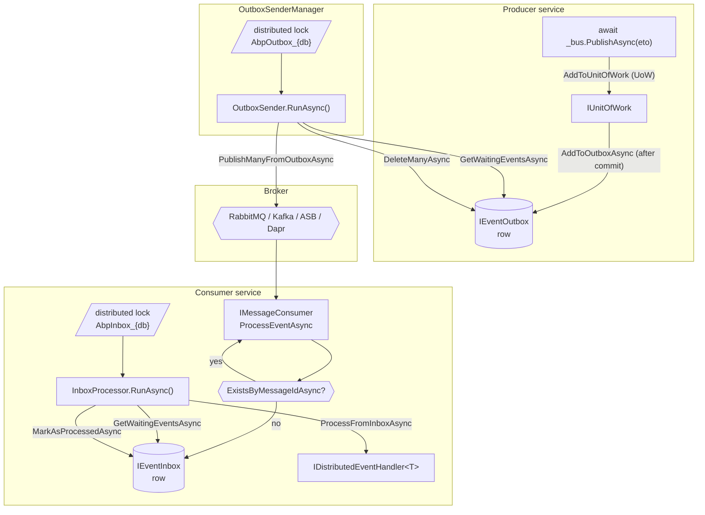

The distributed event bus is the broker-facing implementation of `IDistributedEventBus`. It lets your code publish events the same way as the local bus — `await _bus.PublishAsync(@event)` — while ABP handles serialization, the transactional outbox, broker delivery, the inbox deduplication table, and the background workers that move messages between them.

This page is the implementation tour: `DistributedEventBusBase`, the default in-process `LocalDistributedEventBus`, the inbox/outbox contracts, the `OutboxSenderManager` and `InboxProcessManager` workers, and the `AbpDistributedEventBusOptions` / `AbpEventBusBoxesOptions` knobs that tune them.

## Package layout

```text
framework/src/Volo.Abp.EventBus/Volo/Abp/EventBus/Distributed/
├── AbpDistributedEventBusExtensions.cs
├── AbpDistributedEventBusOptions.cs
├── AbpEventBusBoxesOptions.cs
├── DistributedEventBusBase.cs
├── InboxProcessManager.cs
├── InboxProcessor.cs
├── InboxProcessorFailurePolicy.cs
├── LocalDistributedEventBus.cs
├── NullDistributedEventBus.cs
├── OutboxSender.cs
└── OutboxSenderManager.cs
```

## `DistributedEventBusBase`

Every broker adapter (`RabbitMqDistributedEventBus`, `KafkaDistributedEventBus`, `AzureDistributedEventBus`, `DaprDistributedEventBus`, `RebusDistributedEventBus`) derives from this class. It implements the publish path — UoW buffering and outbox enqueue — and forces subclasses to fill in the broker-specific publish/consume hooks.

```csharp
// framework/src/Volo.Abp.EventBus/Volo/Abp/EventBus/Distributed/DistributedEventBusBase.cs
public abstract class DistributedEventBusBase : EventBusBase, IDistributedEventBus, ISupportsEventBoxes
{
    protected IGuidGenerator GuidGenerator { get; }
    protected IClock Clock { get; }
    protected AbpDistributedEventBusOptions AbpDistributedEventBusOptions { get; }
    protected ILocalEventBus LocalEventBus { get; }
    protected ICorrelationIdProvider CorrelationIdProvider { get; }

    protected DistributedEventBusBase(
        IServiceScopeFactory serviceScopeFactory,
        ICurrentTenant currentTenant,
        IUnitOfWorkManager unitOfWorkManager,
        IOptions<AbpDistributedEventBusOptions> abpDistributedEventBusOptions,
        IGuidGenerator guidGenerator,
        IClock clock,
        IEventHandlerInvoker eventHandlerInvoker,
        ILocalEventBus localEventBus,
        ICorrelationIdProvider correlationIdProvider)
        : base(serviceScopeFactory, currentTenant, unitOfWorkManager, eventHandlerInvoker)
    {
        GuidGenerator = guidGenerator;
        Clock = clock;
        AbpDistributedEventBusOptions = abpDistributedEventBusOptions.Value;
        LocalEventBus = localEventBus;
        CorrelationIdProvider = correlationIdProvider;
    }
}
```

### The publish path

```csharp
// framework/src/Volo.Abp.EventBus/Volo/Abp/EventBus/Distributed/DistributedEventBusBase.cs
public virtual async Task PublishAsync(
    Type eventType,
    object eventData,
    bool onUnitOfWorkComplete = true,
    bool useOutbox = true)
{
    if (onUnitOfWorkComplete && UnitOfWorkManager.Current != null)
    {
        AddToUnitOfWork(
            UnitOfWorkManager.Current,
            new UnitOfWorkEventRecord(eventType, eventData, EventOrderGenerator.GetNext(), useOutbox));
        return;
    }

    if (useOutbox)
    {
        if (await AddToOutboxAsync(eventType, eventData))
        {
            return;
        }
    }

    await PublishToEventBusAsync(eventType, eventData);

    await TriggerDistributedEventSentAsync(new DistributedEventSent()
    {
        Source = DistributedEventSource.Direct,
        EventName = EventNameAttribute.GetNameOrDefault(eventType),
        EventData = eventData
    });
}
```

Three branches:

1. **Ambient UoW + `onUnitOfWorkComplete: true`.** The event is buffered through `AddToUnitOfWork` and replayed by `UnitOfWorkEventPublisher` after commit.
2. **`useOutbox: true` and an outbox is configured.** `AddToOutboxAsync` enqueues into one or more configured `IEventOutbox` stores and returns. The background `OutboxSender` will pick it up.
3. **Direct publish.** The bus calls `PublishToEventBusAsync` (broker-specific), then raises a local `DistributedEventSent` event so any observer can record the dispatch.

### `EventOrderGenerator`

Outside this assembly, in `framework/src/Volo.Abp.Uow/`, `EventOrderGenerator` is a thread-safe `Interlocked` counter that produces monotonically increasing `long` values. Each buffered `UnitOfWorkEventRecord` is stamped with one so the UoW can replay events in publish order even if they came from multiple call sites.

## Outbox enqueue

```csharp
// framework/src/Volo.Abp.EventBus/Volo/Abp/EventBus/Distributed/DistributedEventBusBase.cs
protected virtual async Task<bool> AddToOutboxAsync(Type eventType, object eventData)
{
    var unitOfWork = UnitOfWorkManager.Current;
    if (unitOfWork == null) return false;

    var addedToOutbox = false;

    foreach (var outboxConfig in AbpDistributedEventBusOptions.Outboxes.Values
                 .OrderBy(x => x.Selector is null))
    {
        if (outboxConfig.Selector == null || outboxConfig.Selector(eventType))
        {
            var eventOutbox = (IEventOutbox)unitOfWork.ServiceProvider
                .GetRequiredService(outboxConfig.ImplementationType);
            var eventName = EventNameAttribute.GetNameOrDefault(eventType);

            await OnAddToOutboxAsync(eventName, eventType, eventData);

            var outgoingEventInfo = new OutgoingEventInfo(
                GuidGenerator.Create(),
                eventName,
                Serialize(eventData),
                Clock.Now);

            var correlationId = CorrelationIdProvider.Get();
            if (correlationId != null)
            {
                outgoingEventInfo.SetCorrelationId(correlationId);
            }

            await eventOutbox.EnqueueAsync(outgoingEventInfo);
            addedToOutbox = true;
        }
    }

    return addedToOutbox;
}
```

Notes:

- Outboxes are sorted so the one without a selector — the catch-all — is evaluated last.
- The `IEventOutbox` implementation is resolved from the UoW's `ServiceProvider`, which means the row is inserted on the same DbContext / Mongo client as the rest of the UoW. The outbox row commits with the business state in a single transaction.
- If no outbox matches the event type, `AddToOutboxAsync` returns `false` and the bus falls through to a direct publish.

## Abstract publish/consume hooks

Subclasses must implement these:

```csharp
// framework/src/Volo.Abp.EventBus/Volo/Abp/EventBus/Distributed/DistributedEventBusBase.cs
public abstract Task PublishFromOutboxAsync(OutgoingEventInfo outgoingEvent, OutboxConfig outboxConfig);
public abstract Task PublishManyFromOutboxAsync(IEnumerable<OutgoingEventInfo> outgoingEvents, OutboxConfig outboxConfig);
public abstract Task ProcessFromInboxAsync(IncomingEventInfo incomingEvent, InboxConfig inboxConfig);
```

`PublishFromOutboxAsync` / `PublishManyFromOutboxAsync` are called by the `OutboxSender` background worker. `ProcessFromInboxAsync` is called by the `InboxProcessor`.

## `LocalDistributedEventBus`

When no broker is configured, ABP registers `LocalDistributedEventBus` as the `IDistributedEventBus`. It re-uses `LocalEventBus` for delivery, so distributed events behave exactly like local ones — handy for tests and single-process applications that just want to write code against the future-broker API.

```csharp
// framework/src/Volo.Abp.EventBus/Volo/Abp/EventBus/Distributed/LocalDistributedEventBus.cs
[Dependency(TryRegister = true)]
[ExposeServices(typeof(IDistributedEventBus), typeof(LocalDistributedEventBus))]
public class LocalDistributedEventBus : DistributedEventBusBase, ISingletonDependency
{
    protected ConcurrentDictionary<string, Type> EventTypes { get; }

    public LocalDistributedEventBus(/* … */) : base(/* … */)
    {
        EventTypes = new ConcurrentDictionary<string, Type>();
        Subscribe(abpDistributedEventBusOptions.Value.Handlers);
    }

    public override IDisposable Subscribe(Type eventType, IEventHandlerFactory factory)
    {
        var eventName = EventNameAttribute.GetNameOrDefault(eventType);
        EventTypes.GetOrAdd(eventName, eventType);
        return LocalEventBus.Subscribe(eventType, factory);
    }

    protected async override Task PublishToEventBusAsync(Type eventType, object eventData)
    {
        if (await AddToInboxAsync(Guid.NewGuid().ToString(),
                EventNameAttribute.GetNameOrDefault(eventType), eventType, eventData, null))
        {
            return;
        }

        await LocalEventBus.PublishAsync(eventType, eventData, false);
    }

    protected override void AddToUnitOfWork(IUnitOfWork unitOfWork, UnitOfWorkEventRecord eventRecord)
    {
        unitOfWork.AddOrReplaceDistributedEvent(eventRecord);
    }
}
```

`[Dependency(TryRegister = true)]` means broker modules can replace it — `RabbitMqDistributedEventBus` registers itself with `[Dependency(ReplaceServices = true)]` and wins.

## The inbox

The inbox is a database table (or Mongo collection) keyed by `MessageId` plus `Name` of the configured inbox. Every distributed bus calls `AddToInboxAsync(messageId, eventName, eventType, eventData, correlationId)` when a message arrives from the broker.

```csharp
// framework/src/Volo.Abp.EventBus/Volo/Abp/EventBus/Distributed/DistributedEventBusBase.cs (excerpt)
protected virtual async Task<bool> AddToInboxAsync(
    string messageId,
    string eventName,
    Type eventType,
    object eventData,
    string? correlationId)
{
    var addedToInbox = false;

    foreach (var inboxConfig in AbpDistributedEventBusOptions.Inboxes.Values)
    {
        if (inboxConfig.EventSelector == null || inboxConfig.EventSelector(eventType))
        {
            var eventInbox = (IEventInbox)ServiceProvider
                .GetRequiredService(inboxConfig.ImplementationType);

            if (await eventInbox.ExistsByMessageIdAsync(messageId))
            {
                continue;
            }

            var incomingEventInfo = new IncomingEventInfo(
                GuidGenerator.Create(),
                messageId,
                eventName,
                Serialize(eventData),
                Clock.Now);

            if (correlationId != null) incomingEventInfo.SetCorrelationId(correlationId);

            await eventInbox.EnqueueAsync(incomingEventInfo);
            addedToInbox = true;
        }
    }

    return addedToInbox;
}
```

Once the row is stored, `AddToInboxAsync` returns `true` and the broker callback exits. The `InboxProcessor` background worker is responsible for actually invoking handlers.

## `IEventInbox` / `IEventOutbox`

Refer to [Abstractions → Distributed contracts](/eventbus/abstractions#distributed-contracts) for the full interfaces. The EF Core implementations live in `Volo.Abp.EntityFrameworkCore` as `EventInbox` and `EventOutbox` against `IncomingEventInfo` / `OutgoingEventInfo` entities; the MongoDB ones live in `Volo.Abp.MongoDB`. Both implement:

- `EnqueueAsync` — append a new row.
- `GetWaitingEventsAsync(maxCount, filter, ct)` — page through pending events.
- `MarkAsProcessedAsync` / `RetryLaterAsync` / `MarkAsDiscardAsync` — inbox status transitions.
- `DeleteAsync` / `DeleteManyAsync` — outbox cleanup after publication.
- `ExistsByMessageIdAsync` — inbox dedup probe.

## Background workers

Two long-running workers move events between the boxes and the broker. They are hosted by ABP's background-worker subsystem ([Background workers](/background/overview)).

### `OutboxSenderManager`

```csharp
// framework/src/Volo.Abp.EventBus/Volo/Abp/EventBus/Distributed/OutboxSenderManager.cs
public class OutboxSenderManager : IBackgroundWorker
{
    protected AbpDistributedEventBusOptions Options { get; }
    protected IServiceProvider ServiceProvider { get; }
    protected List<IOutboxSender> Senders { get; }

    public OutboxSenderManager(
        IOptions<AbpDistributedEventBusOptions> options,
        IServiceProvider serviceProvider)
    {
        ServiceProvider = serviceProvider;
        Options = options.Value;
        Senders = new List<IOutboxSender>();
    }

    public async Task StartAsync(CancellationToken cancellationToken = default)
    {
        foreach (var outboxConfig in Options.Outboxes.Values)
        {
            if (outboxConfig.IsSendingEnabled)
            {
                var sender = ServiceProvider.GetRequiredService<IOutboxSender>();
                await sender.StartAsync(outboxConfig, cancellationToken);
                Senders.Add(sender);
            }
        }
    }

    public async Task StopAsync(CancellationToken cancellationToken = default)
    {
        foreach (var sender in Senders)
        {
            await sender.StopAsync(cancellationToken);
        }
    }
}
```

Each configured outbox gets its own `IOutboxSender` (default: `OutboxSender`), which runs an `AbpAsyncTimer` on `AbpEventBusBoxesOptions.PeriodTimeSpan` (2s by default). On every tick, the sender:

1. Acquires a distributed lock named `AbpOutbox_{DatabaseName}`. If it cannot, it sleeps for `DistributedLockWaitDuration` (15s) and retries.
2. Calls `IEventOutbox.GetWaitingEventsAsync(OutboxWaitingEventMaxCount)` (default 1000).
3. If `BatchPublishOutboxEvents` is true (default), invokes `PublishManyFromOutboxAsync`; otherwise loops `PublishFromOutboxAsync` per event.
4. Deletes the published rows via `DeleteManyAsync` / `DeleteAsync`.

### `InboxProcessManager`

```csharp
// framework/src/Volo.Abp.EventBus/Volo/Abp/EventBus/Distributed/InboxProcessManager.cs
public class InboxProcessManager : IBackgroundWorker
{
    protected AbpDistributedEventBusOptions Options { get; }
    protected IServiceProvider ServiceProvider { get; }
    protected List<IInboxProcessor> Processors { get; }

    public InboxProcessManager(
        IOptions<AbpDistributedEventBusOptions> options,
        IServiceProvider serviceProvider) { /* … */ }

    public async Task StartAsync(CancellationToken cancellationToken = default)
    {
        foreach (var inboxConfig in Options.Inboxes.Values)
        {
            if (inboxConfig.IsProcessingEnabled)
            {
                var processor = ServiceProvider.GetRequiredService<IInboxProcessor>();
                await processor.StartAsync(inboxConfig, cancellationToken);
                Processors.Add(processor);
            }
        }
    }
}
```

Each inbox gets an `IInboxProcessor` (default: `InboxProcessor`) that:

1. Acquires `AbpInbox_{DatabaseName}` distributed lock.
2. Periodically calls `IEventInbox.DeleteOldEventsAsync()` to prune processed rows older than `WaitTimeToDeleteProcessedInboxEvents` (default 2h).
3. Loops `GetWaitingEventsAsync(InboxWaitingEventMaxCount)` (default 1000) and calls `DistributedEventBus.AsSupportsEventBoxes().ProcessFromInboxAsync(waitingEvent, inboxConfig)` for each row inside a transactional UoW.
4. On success calls `MarkAsProcessedAsync`. On failure, applies the configured `InboxProcessorFailurePolicy`.

## `AbpDistributedEventBusOptions`

The container for handler list, outbox configurations, inbox configurations.

```csharp
// framework/src/Volo.Abp.EventBus/Volo/Abp/EventBus/Distributed/AbpDistributedEventBusOptions.cs
public class AbpDistributedEventBusOptions
{
    public ITypeList<IEventHandler> Handlers { get; }
    public OutboxConfigDictionary Outboxes { get; }
    public InboxConfigDictionary Inboxes { get; }

    public AbpDistributedEventBusOptions()
    {
        Handlers = new TypeList<IEventHandler>();
        Outboxes = new OutboxConfigDictionary();
        Inboxes = new InboxConfigDictionary();
    }
}
```

Configure in your module:

```csharp
public override void ConfigureServices(ServiceConfigurationContext context)
{
    Configure<AbpDistributedEventBusOptions>(options =>
    {
        options.Outboxes.Configure(config =>
        {
            config.UseDbContext<MyAppDbContext>();
        });

        options.Inboxes.Configure(config =>
        {
            config.UseDbContext<MyAppDbContext>();
        });
    });
}
```

`UseDbContext<T>` is an EF Core helper that sets `DatabaseName` to the connection-string name and `ImplementationType` to the EF Core inbox/outbox class.

## `AbpEventBusBoxesOptions`

Tunes the workers.

```csharp
// framework/src/Volo.Abp.EventBus/Volo/Abp/EventBus/Distributed/AbpEventBusBoxesOptions.cs
public class AbpEventBusBoxesOptions
{
    public TimeSpan CleanOldEventTimeIntervalSpan { get; set; }   // default 6h
    public int InboxWaitingEventMaxCount { get; set; }            // default 1000
    public Expression<Func<IIncomingEventInfo, bool>>? InboxProcessorFilter { get; set; }
    public int OutboxWaitingEventMaxCount { get; set; }           // default 1000
    public Expression<Func<IOutgoingEventInfo, bool>>? OutboxProcessorFilter { get; set; }
    public TimeSpan PeriodTimeSpan { get; set; }                  // default 2s
    public InboxProcessorFailurePolicy InboxProcessorFailurePolicy { get; set; }
        = InboxProcessorFailurePolicy.Retry;
    public int InboxProcessorMaxRetryCount { get; set; } = 10;
    public double InboxProcessorRetryBackoffFactor { get; set; } = 10;
    public TimeSpan DistributedLockWaitDuration { get; set; }     // default 15s
    public TimeSpan WaitTimeToDeleteProcessedInboxEvents { get; set; } // default 2h
    public bool BatchPublishOutboxEvents { get; set; }            // default true
}
```

| Setting | Effect |
| --- | --- |
| `PeriodTimeSpan` | How often the sender/processor wakes up. |
| `OutboxWaitingEventMaxCount` / `InboxWaitingEventMaxCount` | Page size per tick. |
| `BatchPublishOutboxEvents` | If true, calls `PublishManyFromOutboxAsync` once per page; otherwise loops single publishes. |
| `InboxProcessorFailurePolicy` | `Retry` keeps re-queueing forever; `RetryLater` uses exponential back-off until `InboxProcessorMaxRetryCount`; `ThrowException` rolls back. |
| `InboxProcessorRetryBackoffFactor` | `delay = factor × 2^retryCount` seconds. |
| `DistributedLockWaitDuration` | Sleep when the lock is already held by a peer. |
| `WaitTimeToDeleteProcessedInboxEvents` | Retention window for the inbox dedup table. |

## End-to-end picture



## Failure semantics

<AccordionGroup>
  <Accordion title="Outbox guarantees at-least-once delivery">
    The outbox row commits with the business write in the same database transaction. If the application crashes between commit and broker publication, the sender picks the row up on the next tick. If the broker accepts the publish but the row deletion fails, the same event is published again — handlers must be idempotent.
  </Accordion>
  <Accordion title="Inbox guarantees at-most-once handler execution per MessageId">
    `ExistsByMessageIdAsync(messageId)` short-circuits duplicates. The inbox processor wraps `ProcessFromInboxAsync` and `MarkAsProcessedAsync` in the same transactional UoW; if the handler throws, the mark-as-processed step rolls back along with the handler's writes.
  </Accordion>
  <Accordion title="InboxProcessorFailurePolicy.Retry">
    On exception, the row stays in `Waiting` status and is retried on the next tick forever. Good for transient failures but produces an unbounded poison-message problem if the handler is broken.
  </Accordion>
  <Accordion title="InboxProcessorFailurePolicy.RetryLater">
    On exception, `RetryLaterAsync(id, retryCount, nextRetryTime)` schedules the row past the back-off window. After `InboxProcessorMaxRetryCount` attempts the row is discarded via `MarkAsDiscardAsync`. Recommended for production.
  </Accordion>
  <Accordion title="InboxProcessorFailurePolicy.ThrowException">
    The processor rolls back its UoW and throws. Use only when you have an outer dead-letter mechanism.
  </Accordion>
</AccordionGroup>

## Multi-outbox configuration

You can configure multiple outboxes — for example one per DbContext — and route events with `Selector`:

```csharp
Configure<AbpDistributedEventBusOptions>(options =>
{
    options.Outboxes.Configure("Identity", config =>
    {
        config.UseDbContext<IdentityDbContext>();
        config.Selector = type => type.Namespace?.StartsWith("MyApp.Identity") == true;
    });

    options.Outboxes.Configure("Billing", config =>
    {
        config.UseDbContext<BillingDbContext>();
        config.Selector = type => type.Namespace?.StartsWith("MyApp.Billing") == true;
    });
});
```

`DistributedEventBusBase.AddToOutboxAsync` evaluates outboxes whose `Selector` matches the event type first; outboxes without a selector run last as the catch-all. A single event can land in multiple outboxes if the selectors overlap — useful for fan-out patterns.

## Cross-references

<CardGroup cols={2}>
  <Card title="Local Event Bus" icon="bolt" href="/eventbus/local-event-bus">
    `LocalDistributedEventBus` re-uses `LocalEventBus` for delivery.
  </Card>
  <Card title="Unit of Work" icon="rotate" href="/data/unit-of-work">
    `AddOrReplaceDistributedEvent`, `UseOutbox` flag, drain order.
  </Card>
  <Card title="Background workers" icon="gears" href="/background/overview">
    `OutboxSenderManager` and `InboxProcessManager` are background workers.
  </Card>
  <Card title="Publication flow" icon="diagram-project" href="/flows/distributed-event-publish-consume">
    The full end-to-end sequence with broker delivery.
  </Card>
  <Card title="RabbitMQ" icon="rabbit" href="/eventbus/rabbitmq">
    Broker adapter: `RabbitMqDistributedEventBus`.
  </Card>
  <Card title="Kafka" icon="stream" href="/eventbus/kafka">
    Broker adapter: `KafkaDistributedEventBus`.
  </Card>
</CardGroup>
