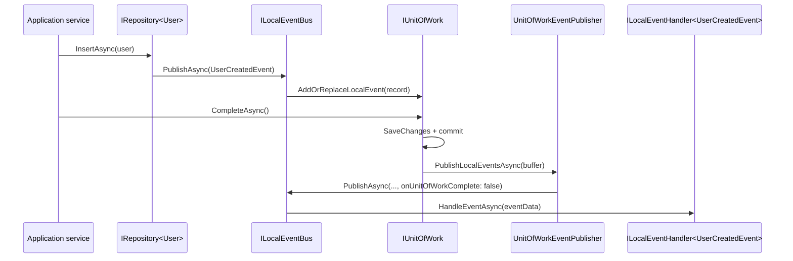

The local event bus is the in-process implementation of `ILocalEventBus`. It is a singleton that owns a thread-safe handler registry, dispatches events through a cached `IEventHandlerInvoker`, and integrates with the ambient Unit of Work so handlers fire after the surrounding transaction commits. It is the default `IEventBus` your application services get from DI when you do not configure a distributed bus.

All sources for this page live under `framework/src/Volo.Abp.EventBus/Volo/Abp/EventBus/Local/` and the shared base in `framework/src/Volo.Abp.EventBus/Volo/Abp/EventBus/`.

## Package layout

```text
framework/src/Volo.Abp.EventBus/Volo/Abp/EventBus/
├── Local/
│   ├── AbpLocalEventBusOptions.cs
│   ├── LocalEventBus.cs
│   ├── LocalEventMessage.cs
│   └── NullLocalEventBus.cs
├── ActionEventHandler.cs
├── EventBusBase.cs
├── EventHandlerFactoryUnregistrar.cs
├── EventHandlerInvoker.cs
├── EventHandlerInvokerCacheItem.cs
├── EventHandlerMethodExecutor.cs
├── IocEventHandlerFactory.cs
├── SingleInstanceHandlerFactory.cs
├── TransientEventHandlerFactory.cs
└── UnitOfWorkEventPublisher.cs
```

## `LocalEventBus`

A singleton, registered through `[ExposeServices(typeof(ILocalEventBus), typeof(LocalEventBus))]`. It keeps a `ConcurrentDictionary<Type, List<IEventHandlerFactory>>` keyed by event type.

```csharp
// framework/src/Volo.Abp.EventBus/Volo/Abp/EventBus/Local/LocalEventBus.cs
[ExposeServices(typeof(ILocalEventBus), typeof(LocalEventBus))]
public class LocalEventBus : EventBusBase, ILocalEventBus, ISingletonDependency
{
    public ILogger<LocalEventBus> Logger { get; set; }
    protected AbpLocalEventBusOptions Options { get; }
    protected ConcurrentDictionary<Type, List<IEventHandlerFactory>> HandlerFactories { get; }

    public LocalEventBus(
        IOptions<AbpLocalEventBusOptions> options,
        IServiceScopeFactory serviceScopeFactory,
        ICurrentTenant currentTenant,
        IUnitOfWorkManager unitOfWorkManager,
        IEventHandlerInvoker eventHandlerInvoker)
        : base(serviceScopeFactory, currentTenant, unitOfWorkManager, eventHandlerInvoker)
    {
        Options = options.Value;
        Logger = NullLogger<LocalEventBus>.Instance;

        HandlerFactories = new ConcurrentDictionary<Type, List<IEventHandlerFactory>>();
        SubscribeHandlers(Options.Handlers);
    }
}
```

The constructor pulls `AbpLocalEventBusOptions.Handlers` — the type list populated at module configuration time — and feeds every handler into `SubscribeHandlers`, which inspects implemented interfaces and adds an `IocEventHandlerFactory` per `ILocalEventHandler<TEvent>` closure.

### `AbpLocalEventBusOptions`

```csharp
// framework/src/Volo.Abp.EventBus/Volo/Abp/EventBus/Local/AbpLocalEventBusOptions.cs
public class AbpLocalEventBusOptions
{
    public ITypeList<IEventHandler> Handlers { get; }

    public AbpLocalEventBusOptions()
    {
        Handlers = new TypeList<IEventHandler>();
    }
}
```

ABP auto-populates `Handlers` from your assemblies during module load. You almost never touch it directly.

## Subscribing

`EventBusBase` exposes the friendly overloads (lambda, type, instance) and forwards to the abstract one your bus implements. The local bus's implementation appends the factory to the per-type list under a lock.

```csharp
// framework/src/Volo.Abp.EventBus/Volo/Abp/EventBus/Local/LocalEventBus.cs
public override IDisposable Subscribe(Type eventType, IEventHandlerFactory factory)
{
    GetOrCreateHandlerFactories(eventType)
        .Locking(factories =>
        {
            if (!factory.IsInFactories(factories))
            {
                factories.Add(factory);
            }
        });

    return new EventHandlerFactoryUnregistrar(this, eventType, factory);
}
```

The returned `IDisposable` removes the registration when disposed — useful for short-lived dynamic subscriptions.

## Handler factories

A factory abstracts handler lifetime. ABP ships three:

| Factory | Source | Lifetime |
| --- | --- | --- |
| `SingleInstanceHandlerFactory` | `EventBusBase.Subscribe(eventType, IEventHandler handler)` | One handler instance, reused. |
| `TransientEventHandlerFactory<THandler>` | `EventBusBase.Subscribe<TEvent, THandler>()` | `new THandler()` per event. |
| `IocEventHandlerFactory` | Convention-discovered handlers in `Options.Handlers` | Resolved per event from `IServiceScopeFactory`. |

`IocEventHandlerFactory` is the one that runs in production: it opens a DI scope per event, resolves the handler, runs `HandleEventAsync`, then disposes the scope. That gives each handler invocation a fresh `IUnitOfWork`, `ICurrentTenant`, and any other scoped dependency.

## Event handler invoker

`LocalEventBus` does not call `handler.HandleEventAsync(data)` directly. It delegates to `IEventHandlerInvoker`, which caches a compiled accessor per `(handler type, event type)` pair.

```csharp
// framework/src/Volo.Abp.EventBus/Volo/Abp/EventBus/EventHandlerInvoker.cs
public class EventHandlerInvoker : IEventHandlerInvoker, ISingletonDependency
{
    private readonly ConcurrentDictionary<string, EventHandlerInvokerCacheItem> _cache;

    public EventHandlerInvoker() { _cache = new ConcurrentDictionary<string, EventHandlerInvokerCacheItem>(); }

    public async Task InvokeAsync(IEventHandler eventHandler, object eventData, Type eventType)
    {
        var cacheItem = _cache.GetOrAdd($"{eventHandler.GetType().FullName}-{eventType.FullName}", _ =>
        {
            var item = new EventHandlerInvokerCacheItem();

            if (typeof(ILocalEventHandler<>).MakeGenericType(eventType).IsInstanceOfType(eventHandler))
            {
                item.Local = (IEventHandlerMethodExecutor?)Activator.CreateInstance(
                    typeof(LocalEventHandlerMethodExecutor<>).MakeGenericType(eventType));
            }

            if (typeof(IDistributedEventHandler<>).MakeGenericType(eventType).IsInstanceOfType(eventHandler))
            {
                item.Distributed = (IEventHandlerMethodExecutor?)Activator.CreateInstance(
                    typeof(DistributedEventHandlerMethodExecutor<>).MakeGenericType(eventType));
            }

            return item;
        });

        if (cacheItem.Local != null)
            await cacheItem.Local.ExecutorAsync(eventHandler, eventData);

        if (cacheItem.Distributed != null)
            await cacheItem.Distributed.ExecutorAsync(eventHandler, eventData);

        if (cacheItem.Local == null && cacheItem.Distributed == null)
            throw new AbpException("The object instance is not an event handler. Object type: "
                + eventHandler.GetType().AssemblyQualifiedName);
    }
}
```

Notes:

- A class that implements both `ILocalEventHandler<T>` and `IDistributedEventHandler<T>` for the same `T` has both executors filled and is called twice — once per role.
- The cache is keyed by full type name strings; new entries are amortized so steady-state dispatch is one dictionary lookup plus one delegate call.
- A handler that implements neither interface for the dispatched event throws — this is how mis-registered types fail loudly.

## Event type list

`LocalEventBus.GetHandlerFactories` walks the handler dictionary, computes the local order, and returns one `EventTypeWithEventHandlerFactories` per (subscribed type, factory) pair so the dispatcher can flatten inherited handlers.

```csharp
// framework/src/Volo.Abp.EventBus/Volo/Abp/EventBus/Local/LocalEventBus.cs
protected override IEnumerable<EventTypeWithEventHandlerFactories> GetHandlerFactories(Type eventType)
{
    var handlerFactoryList = new List<Tuple<IEventHandlerFactory, Type, int>>();
    foreach (var handlerFactory in HandlerFactories
                 .Where(hf => ShouldTriggerEventForHandler(eventType, hf.Key)))
    {
        foreach (var factory in handlerFactory.Value)
        {
            handlerFactoryList.Add(new Tuple<IEventHandlerFactory, Type, int>(
                factory,
                handlerFactory.Key,
                ReflectionHelper
                    .GetAttributesOfMemberOrDeclaringType<LocalEventHandlerOrderAttribute>(
                        factory.GetHandler().EventHandler.GetType())
                    .FirstOrDefault()?.Order ?? 0));
        }
    }

    return handlerFactoryList
        .OrderBy(x => x.Item3)
        .Select(x => new EventTypeWithEventHandlerFactories(
            x.Item2, new List<IEventHandlerFactory> { x.Item1 }))
        .ToArray();
}

private static bool ShouldTriggerEventForHandler(Type targetEventType, Type handlerEventType)
{
    if (handlerEventType == targetEventType) return true;
    if (handlerEventType.IsAssignableFrom(targetEventType)) return true;
    return false;
}
```

Two things to notice:

1. **Inheritance dispatch.** A handler bound to `ILocalEventHandler<BaseEvent>` runs when you publish a `DerivedEvent`. `IsAssignableFrom(targetEventType)` does the polymorphic match.
2. **`LocalEventHandlerOrderAttribute` ordering.** Handlers with smaller `Order` run first; handlers without the attribute default to `0`.

```csharp
[LocalEventHandlerOrder(10)]
public class WarmCacheHandler : ILocalEventHandler<UserCreatedEvent> { /* … */ }

[LocalEventHandlerOrder(20)]
public class SendWelcomeMailHandler : ILocalEventHandler<UserCreatedEvent> { /* … */ }
```

`WarmCacheHandler` runs before `SendWelcomeMailHandler` even though both are registered through DI.

## Unit-of-Work integration: publish after commit

The single most important piece of behavior in `LocalEventBus` is that publishes inside an active UoW are deferred until the UoW commits successfully.

### Buffering

`EventBusBase.PublishAsync` checks the ambient UoW first:

```csharp
// framework/src/Volo.Abp.EventBus/Volo/Abp/EventBus/EventBusBase.cs
public virtual async Task PublishAsync(
    Type eventType,
    object eventData,
    bool onUnitOfWorkComplete = true)
{
    if (onUnitOfWorkComplete && UnitOfWorkManager.Current != null)
    {
        AddToUnitOfWork(
            UnitOfWorkManager.Current,
            new UnitOfWorkEventRecord(eventType, eventData, EventOrderGenerator.GetNext()));
        return;
    }

    await PublishToEventBusAsync(eventType, eventData);
}
```

The local bus's `AddToUnitOfWork` overrides hands the record to the UoW:

```csharp
// framework/src/Volo.Abp.EventBus/Volo/Abp/EventBus/Local/LocalEventBus.cs
protected override void AddToUnitOfWork(IUnitOfWork unitOfWork, UnitOfWorkEventRecord eventRecord)
{
    unitOfWork.AddOrReplaceLocalEvent(eventRecord);
}
```

`AddOrReplaceLocalEvent` either appends the record or replaces an existing one with the same identity — useful for "entity updated" events that should only fire once even if the same entity changes multiple times in the same UoW.

### Draining

When `UoW.CompleteAsync()` succeeds, the UoW invokes `IUnitOfWorkEventPublisher.PublishLocalEventsAsync` with the buffered records. ABP's default implementation funnels them straight back into the bus, this time with `onUnitOfWorkComplete: false` so we do not recurse.

```csharp
// framework/src/Volo.Abp.EventBus/Volo/Abp/EventBus/UnitOfWorkEventPublisher.cs
[Dependency(ReplaceServices = true)]
public class UnitOfWorkEventPublisher : IUnitOfWorkEventPublisher, ITransientDependency
{
    private readonly ILocalEventBus _localEventBus;
    private readonly IDistributedEventBus _distributedEventBus;

    public UnitOfWorkEventPublisher(
        ILocalEventBus localEventBus,
        IDistributedEventBus distributedEventBus)
    {
        _localEventBus = localEventBus;
        _distributedEventBus = distributedEventBus;
    }

    public async Task PublishLocalEventsAsync(IEnumerable<UnitOfWorkEventRecord> localEvents)
    {
        foreach (var localEvent in localEvents)
        {
            await _localEventBus.PublishAsync(
                localEvent.EventType,
                localEvent.EventData,
                onUnitOfWorkComplete: false);
        }
    }

    public async Task PublishDistributedEventsAsync(IEnumerable<UnitOfWorkEventRecord> distributedEvents)
    {
        foreach (var distributedEvent in distributedEvents)
        {
            await _distributedEventBus.PublishAsync(
                distributedEvent.EventType,
                distributedEvent.EventData,
                onUnitOfWorkComplete: false,
                useOutbox: distributedEvent.UseOutbox);
        }
    }
}
```

### Why this matters

A repository that saves a `User` and publishes `UserCreatedEvent` does both inside one UoW. If the database commit fails, the buffer is discarded and no handler runs. If the commit succeeds, every handler observes the persisted entity. There is no race where a handler reads the database before the entity is visible.



See [Unit of Work](/data/unit-of-work) for the UoW lifecycle and [Publication flow](/flows/distributed-event-publish-consume) for the end-to-end sequence.

## Publishing without buffering

Pass `onUnitOfWorkComplete: false` to dispatch immediately:

```csharp
await _localEventBus.PublishAsync(new TelemetryHeartbeat(), onUnitOfWorkComplete: false);
```

This is the right choice for fire-and-forget signals that should run regardless of the surrounding transaction outcome.

## Triggering and dispatching

Once the buffer is drained or `onUnitOfWorkComplete: false` is set, the bus produces a `LocalEventMessage` and runs the handlers.

```csharp
// framework/src/Volo.Abp.EventBus/Volo/Abp/EventBus/Local/LocalEventBus.cs
protected override async Task PublishToEventBusAsync(Type eventType, object eventData)
{
    await PublishAsync(new LocalEventMessage(Guid.NewGuid(), eventData, eventType));
}

public virtual async Task PublishAsync(LocalEventMessage localEventMessage)
{
    await TriggerHandlersAsync(localEventMessage.EventType, localEventMessage.EventData);
}
```

`TriggerHandlersAsync` is on `EventBusBase`. It iterates every `EventTypeWithEventHandlerFactories`, opens a DI scope per factory, resolves the handler, calls `EventHandlerInvoker.InvokeAsync(handler, eventData, eventType)`, and catches errors.

## Error handling

`EventBusBase.TriggerHandlersAsync` wraps each handler invocation in its own try/catch and aggregates failures into an `AggregateException` it throws after the loop. The publisher gets exactly one exception per `PublishAsync` call regardless of how many handlers blew up.

What that means in practice:

<AccordionGroup>
  <Accordion title="One faulty handler does not stop the others">
    Each handler runs in its own DI scope and its own try block. If `HandlerA` throws, `HandlerB` still runs. The exception from `HandlerA` is collected.
  </Accordion>
  <Accordion title="Publish from inside a UoW: errors are reported as the UoW completes">
    Because draining happens during `UoW.CompleteAsync()`, an `AggregateException` from a handler propagates to the caller of `CompleteAsync`. The UoW itself has already committed by then — the database state stands.
  </Accordion>
  <Accordion title="Publish with onUnitOfWorkComplete: false">
    Errors propagate directly to your `await PublishAsync(...)` call site. Catch them locally if you want to keep going.
  </Accordion>
  <Accordion title="Inheritance can multiply errors">
    If `HandlerA<Base>` and `HandlerB<Derived>` both subscribe and `HandlerA` throws, you still get `HandlerB`'s outcome in the aggregate. Order with `[LocalEventHandlerOrder]` if you need a specific sequence.
  </Accordion>
</AccordionGroup>

## Worked example

```csharp
[EventName("identity.user_created")]
public class UserCreatedEvent
{
    public Guid UserId { get; set; }
    public string Email { get; set; } = default!;
}

[LocalEventHandlerOrder(10)]
public class WarmUserCacheHandler : ILocalEventHandler<UserCreatedEvent>, ITransientDependency
{
    private readonly IUserCache _cache;
    public WarmUserCacheHandler(IUserCache cache) => _cache = cache;

    public Task HandleEventAsync(UserCreatedEvent eventData)
        => _cache.PrimeAsync(eventData.UserId);
}

[LocalEventHandlerOrder(20)]
public class SendWelcomeEmailHandler : ILocalEventHandler<UserCreatedEvent>, ITransientDependency
{
    private readonly IEmailSender _email;
    public SendWelcomeEmailHandler(IEmailSender email) => _email = email;

    public Task HandleEventAsync(UserCreatedEvent eventData)
        => _email.SendAsync(eventData.Email, "Welcome!", "…");
}

public class UserAppService : ApplicationService, IUserAppService
{
    private readonly IRepository<User, Guid> _users;
    private readonly ILocalEventBus _bus;

    public UserAppService(IRepository<User, Guid> users, ILocalEventBus bus)
    {
        _users = users;
        _bus = bus;
    }

    [UnitOfWork]
    public async Task CreateAsync(CreateUserDto input)
    {
        var user = new User(GuidGenerator.Create(), input.Email);
        await _users.InsertAsync(user);

        await _bus.PublishAsync(new UserCreatedEvent
        {
            UserId = user.Id,
            Email = user.Email
        });
    }
}
```

Step by step:

<Steps>
  <Step title="UoW opens">
    `[UnitOfWork]` opens an ambient UoW for the application-service call.
  </Step>
  <Step title="Repository writes are tracked">
    `_users.InsertAsync(user)` queues an EF Core insert.
  </Step>
  <Step title="Event is buffered, not fired">
    `_bus.PublishAsync(...)` finds `UnitOfWorkManager.Current` and calls `unitOfWork.AddOrReplaceLocalEvent(record)`.
  </Step>
  <Step title="UoW commits">
    `[UnitOfWork]` calls `CompleteAsync()`. The EF Core save succeeds.
  </Step>
  <Step title="Handlers run after commit">
    The UoW invokes `UnitOfWorkEventPublisher.PublishLocalEventsAsync(buffer)`. `WarmUserCacheHandler` (Order 10) runs, then `SendWelcomeEmailHandler` (Order 20) runs.
  </Step>
</Steps>

## `NullLocalEventBus`

`Volo.Abp.EventBus` also ships a `NullLocalEventBus` for tests and for modules that need an `ILocalEventBus` reference but should not actually dispatch. It discards every publish and returns `null`/empty values from the subscription overloads.

## Cross-references

<CardGroup cols={2}>
  <Card title="Abstractions" icon="cube" href="/eventbus/abstractions">
    `ILocalEventBus`, `ILocalEventHandler<T>`, `LocalEventHandlerOrderAttribute`.
  </Card>
  <Card title="Unit of Work" icon="rotate" href="/data/unit-of-work">
    Buffering, draining, and how `CompleteAsync()` triggers `UnitOfWorkEventPublisher`.
  </Card>
  <Card title="Distributed Event Bus" icon="network-wired" href="/eventbus/distributed-event-bus">
    The next layer up: same publish API, broker-backed delivery, outbox/inbox.
  </Card>
  <Card title="Publication flow" icon="diagram-project" href="/flows/distributed-event-publish-consume">
    End-to-end sequence: code → UoW → bus → handler.
  </Card>
</CardGroup>
