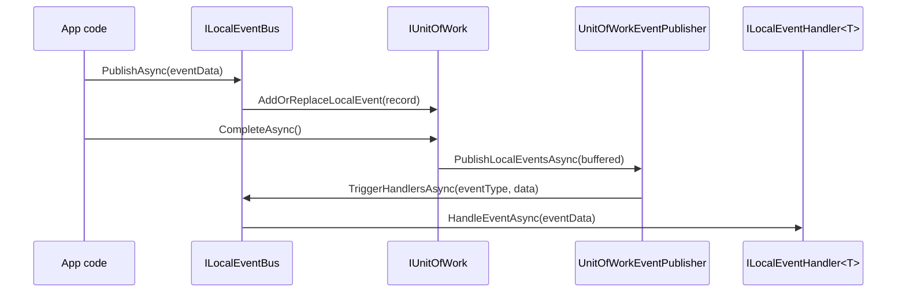
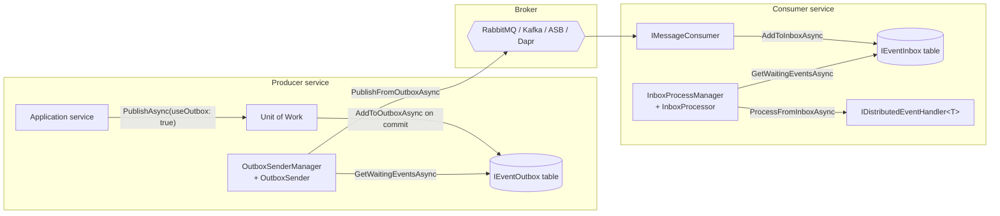

ABP ships a layered event bus that lets your domain raise events without taking a hard dependency on any broker. The abstractions in `framework/src/Volo.Abp.EventBus.Abstractions/` define what an event, a handler, and a bus look like. The default in-process implementation in `framework/src/Volo.Abp.EventBus/` wires those abstractions to your Unit of Work so events are buffered until the surrounding transaction commits. Broker adapters — RabbitMQ, Kafka, Azure Service Bus, Dapr, Rebus — replace the default `IDistributedEventBus` and add inbox/outbox tables for at-least-once delivery.

This page is the landing pad for that whole subsystem. Use the cards to dive into a specific layer or broker. The diagrams below show the two flows you need to picture: a local event handled in-process and a distributed event traveling through the outbox, broker, and inbox before reaching subscribers.

## Where it lives

| Package | Folder | Purpose |
| --- | --- | --- |
| `Volo.Abp.EventBus.Abstractions` | `framework/src/Volo.Abp.EventBus.Abstractions/` | `IEventBus`, `ILocalEventBus`, `IDistributedEventBus`, handler interfaces, inbox/outbox contracts. |
| `Volo.Abp.EventBus` | `framework/src/Volo.Abp.EventBus/` | `LocalEventBus`, `LocalDistributedEventBus`, UoW integration, `OutboxSender`, `InboxProcessor`. |
| `Volo.Abp.EventBus.RabbitMQ` | `framework/src/Volo.Abp.EventBus.RabbitMQ/` | `RabbitMqDistributedEventBus` over a topic/direct exchange. |
| `Volo.Abp.EventBus.Kafka` | `framework/src/Volo.Abp.EventBus.Kafka/` | `KafkaDistributedEventBus` over a Kafka topic. |
| `Volo.Abp.EventBus.Azure` | `framework/src/Volo.Abp.EventBus.Azure/` | `AzureDistributedEventBus` over an Azure Service Bus topic. |
| `Volo.Abp.EventBus.Dapr` | `framework/src/Volo.Abp.EventBus.Dapr/` | `DaprDistributedEventBus` over a Dapr pub/sub component. |
| `Volo.Abp.EventBus.Rebus` | `framework/src/Volo.Abp.EventBus.Rebus/` | `RebusDistributedEventBus` for Rebus-supported transports. |

## Explore the stack

<CardGroup cols={2}>
  <Card title="Abstractions" icon="cube" href="/eventbus/abstractions">
    `IEventHandler`, `ILocalEventHandler<T>`, `IDistributedEventHandler<T>`, `IEventBus`, `EventNameAttribute`.
  </Card>
  <Card title="Local Event Bus" icon="bolt" href="/eventbus/local-event-bus">
    `LocalEventBus`, `EventHandlerInvoker`, ordering, and UoW-buffered publication after commit.
  </Card>
  <Card title="Distributed Event Bus" icon="network-wired" href="/eventbus/distributed-event-bus">
    `DistributedEventBusBase`, `LocalDistributedEventBus`, `IEventOutbox`, `IEventInbox`, processor workers.
  </Card>
  <Card title="RabbitMQ" icon="rabbit" href="/eventbus/rabbitmq">
    `RabbitMqDistributedEventBus`, exchanges, queues, routing keys and `AbpRabbitMqEventBusOptions`.
  </Card>
  <Card title="Kafka" icon="stream" href="/eventbus/kafka">
    `KafkaDistributedEventBus`, topic and group settings, headers, `IKafkaMessageConsumerFactory`.
  </Card>
  <Card title="Azure Service Bus" icon="cloud" href="/eventbus/azure-service-bus">
    `AzureDistributedEventBus`, topic/subscription model, `AbpAzureEventBusOptions`.
  </Card>
  <Card title="Dapr Event Bus" icon="circle-nodes" href="/eventbus/dapr-event-bus">
    `DaprDistributedEventBus`, `AbpDaprEventBusOptions`, ASP.NET Core subscribe endpoint.
  </Card>
  <Card title="Rebus" icon="recycle" href="/eventbus/rebus">
    `RebusDistributedEventBus`, `AbpRebusEventBusOptions`, transport configurer.
  </Card>
</CardGroup>

## Two flows you need to know

### Local event flow

Local events stay in the same process. `ILocalEventBus.PublishAsync` checks for an ambient Unit of Work and, if one exists, parks the event on `IUnitOfWork.AddOrReplaceLocalEvent`. After `UoW.CompleteAsync()` succeeds, the `UnitOfWorkEventPublisher` drains the buffer and `LocalEventBus.TriggerHandlersAsync` invokes each `ILocalEventHandler<TEvent>` through the registered `IEventHandlerInvoker`.



### Distributed flow with outbox/inbox

Distributed events leave the process via a broker. With `useOutbox: true` (the default), `DistributedEventBusBase.PublishAsync` serializes the event into the configured `IEventOutbox` while still inside the UoW transaction. The `OutboxSenderManager` background worker polls the outbox under a distributed lock and calls `PublishFromOutboxAsync` on the broker-specific bus. On the consumer side, `AddToInboxAsync` deduplicates incoming messages into `IEventInbox`, and the `InboxProcessManager` worker drains them through `ProcessFromInboxAsync` into local handlers.



## Reading order

<Steps>
  <Step title="Start with the contracts">
    Read [Abstractions](/eventbus/abstractions) to learn what every bus, handler and event name looks like.
  </Step>
  <Step title="Understand local publication">
    Read [Local Event Bus](/eventbus/local-event-bus) to see how in-process events flow through the Unit of Work.
  </Step>
  <Step title="Move to distributed">
    Read [Distributed Event Bus](/eventbus/distributed-event-bus) to learn the outbox/inbox pattern, processor workers and `DistributedEventOptions`.
  </Step>
  <Step title="Pick a broker">
    Pick the [RabbitMQ](/eventbus/rabbitmq), [Kafka](/eventbus/kafka), [Azure Service Bus](/eventbus/azure-service-bus), [Dapr](/eventbus/dapr-event-bus) or [Rebus](/eventbus/rebus) page for runtime details.
  </Step>
</Steps>

## When to publish what

<AccordionGroup>
  <Accordion title="Use local events for in-process side effects">
    Decoupling between two services that live in the same process — for example raising `EntityChangedEventData<T>` from a repository so an application service can refresh a cache — is what `ILocalEventBus` is for. There is no serialization, no broker, no inbox; handlers run after the UoW commits so they observe the committed state.
  </Accordion>
  <Accordion title="Use distributed events to cross processes">
    Anything that crosses a service boundary — `IdentityUserCreatedEto`, `OrderPlacedEto` — should be published through `IDistributedEventBus`. The outbox guarantees the event is sent at-least-once after the producer's transaction commits, and the inbox guarantees the handler runs at-most-once per unique `MessageId`.
  </Accordion>
  <Accordion title="Opt out of the UoW buffer for fire-and-forget">
    Pass `onUnitOfWorkComplete: false` to publish immediately, bypassing the ambient UoW. The event will be dispatched (or written to the outbox) before `PublishAsync` returns. Use this for telemetry or audit events that should be observable regardless of whether the surrounding work succeeds.
  </Accordion>
  <Accordion title="Opt out of the outbox for ephemeral signals">
    Pass `useOutbox: false` to `IDistributedEventBus.PublishAsync` to skip outbox enqueueing. The bus publishes directly to the broker. You lose the at-least-once guarantee but avoid an extra database write.
  </Accordion>
</AccordionGroup>

## What stays constant across brokers

Regardless of which adapter you pick, the surface is the same. Every distributed bus derives from `DistributedEventBusBase`, which lives in `framework/src/Volo.Abp.EventBus/Volo/Abp/EventBus/Distributed/DistributedEventBusBase.cs`. That class owns:

- The UoW buffering hook (`AddToUnitOfWork` + `AddOrReplaceDistributedEvent`).
- The outbox enqueue hook (`AddToOutboxAsync`) — a row per event in the configured `IEventOutbox`.
- The inbox dedup hook (`AddToInboxAsync`) — `ExistsByMessageIdAsync` short-circuits duplicates.
- The `DistributedEventSent` / `DistributedEventReceived` notifications fired to the local bus for observability.

The broker-specific subclass only implements three abstract methods:

```csharp
public abstract Task PublishFromOutboxAsync(OutgoingEventInfo outgoingEvent, OutboxConfig outboxConfig);
public abstract Task PublishManyFromOutboxAsync(IEnumerable<OutgoingEventInfo> outgoingEvents, OutboxConfig outboxConfig);
public abstract Task ProcessFromInboxAsync(IncomingEventInfo incomingEvent, InboxConfig inboxConfig);
```

That is the contract every adapter on this page satisfies.

## Picking an adapter

| Adapter | Best for | Throughput | Notes |
| --- | --- | --- | --- |
| [Local distributed](/eventbus/distributed-event-bus) | Tests, single-process apps | In-memory | Uses `LocalEventBus` for delivery; lets you write distributed-flavored code before a broker exists. |
| [RabbitMQ](/eventbus/rabbitmq) | Most service-to-service messaging | High | Direct or topic exchange, queue per service, routing-key per event. |
| [Kafka](/eventbus/kafka) | Event streaming, partition ordering | Very high | Single topic, event name = key, group per service. |
| [Azure Service Bus](/eventbus/azure-service-bus) | Azure-hosted services | High | Topic + subscription per service, batched outbox. |
| [Dapr](/eventbus/dapr-event-bus) | Cloud-agnostic via sidecar | Depends on backing component | `pubsub.yaml` decides the actual broker. |
| [Rebus](/eventbus/rebus) | Existing Rebus stack | Depends on transport | Any Rebus-supported transport behind one configurer. |

## Configuration defaults to know

- `AbpEventBusBoxesOptions.PeriodTimeSpan` is **2 seconds**. The outbox sender and inbox processor wake up that often.
- `AbpEventBusBoxesOptions.OutboxWaitingEventMaxCount` / `InboxWaitingEventMaxCount` are **1000** — page size per tick.
- `AbpEventBusBoxesOptions.BatchPublishOutboxEvents` is **true** — `OutboxSender` calls `PublishManyFromOutboxAsync` once per page.
- `AbpEventBusBoxesOptions.InboxProcessorFailurePolicy` is **`Retry`** by default. Switch to `RetryLater` for production back-off.
- `AbpEventBusBoxesOptions.DistributedLockWaitDuration` is **15 seconds** — that is how long a peer sleeps before retrying a held lock.
- `AbpEventBusBoxesOptions.WaitTimeToDeleteProcessedInboxEvents` is **2 hours** — the inbox dedup retention window.

All of these knobs live on `framework/src/Volo.Abp.EventBus/Volo/Abp/EventBus/Distributed/AbpEventBusBoxesOptions.cs`.

## A minimal end-to-end example

The smallest useful integration looks like this: one event type with an `EventName`, one application service that publishes through `IDistributedEventBus`, one consumer-side handler implementing `IDistributedEventHandler<TEvent>`. ABP discovers the handler via DI conventions; you do not write any subscription glue.

```csharp
// Shared contract package
[EventName("orders.order_placed.v1")]
public class OrderPlacedEto
{
    public Guid OrderId { get; set; }
    public Guid CustomerId { get; set; }
    public decimal Total { get; set; }
}

// Producer
public class OrderAppService : ApplicationService, IOrderAppService
{
    private readonly IRepository<Order, Guid> _orders;
    private readonly IDistributedEventBus _bus;

    public OrderAppService(IRepository<Order, Guid> orders, IDistributedEventBus bus)
    {
        _orders = orders;
        _bus    = bus;
    }

    [UnitOfWork]
    public async Task PlaceAsync(PlaceOrderDto input)
    {
        var order = new Order(GuidGenerator.Create(), input.CustomerId, input.Total);
        await _orders.InsertAsync(order);

        await _bus.PublishAsync(new OrderPlacedEto
        {
            OrderId    = order.Id,
            CustomerId = order.CustomerId,
            Total      = order.Total
        });
        // 1. Buffered on the UoW.
        // 2. After CompleteAsync(): row inserted into IEventOutbox in the same transaction.
        // 3. OutboxSender picks it up within PeriodTimeSpan (default 2s) and publishes to the broker.
    }
}

// Consumer (different service)
public class ChargeCustomerHandler
    : IDistributedEventHandler<OrderPlacedEto>, ITransientDependency
{
    private readonly IPaymentService _payments;
    public ChargeCustomerHandler(IPaymentService payments) => _payments = payments;

    public Task HandleEventAsync(OrderPlacedEto eventData)
    {
        // 1. Broker delivers the message to the bus.
        // 2. AddToInboxAsync stores it; the consumer immediately acks the broker.
        // 3. InboxProcessor wakes up, opens a transactional UoW, calls this method.
        // 4. On success: MarkAsProcessedAsync. On failure: RetryLater per the failure policy.
        return _payments.ChargeAsync(eventData.CustomerId, eventData.Total);
    }
}
```

That single example exercises every system on this page: `EventNameAttribute`, the UoW buffer, the outbox, the `OutboxSender`, the broker adapter, the consumer-side inbox, the `InboxProcessor`, `IEventHandlerInvoker`, and the at-least-once delivery guarantees.

## Common patterns

### Domain entity changed → integration event

A repository raises a local `EntityCreatedEventData<User>` from `[UnitOfWork]`-decorated code. A handler in the same application listens for that, projects an `OrderPlacedEto`, and publishes it on `IDistributedEventBus`. Both publishes are buffered on the same UoW; both fire after commit; the integration event is enqueued into the outbox atomically with the database write. Consumers of `OrderPlacedEto` deduplicate via the inbox.

```csharp
public class ProjectOrderPlacedEtoHandler
    : ILocalEventHandler<EntityCreatedEventData<Order>>, ITransientDependency
{
    private readonly IDistributedEventBus _distributed;
    public ProjectOrderPlacedEtoHandler(IDistributedEventBus distributed) => _distributed = distributed;

    public Task HandleEventAsync(EntityCreatedEventData<Order> eventData)
        => _distributed.PublishAsync(new OrderPlacedEto
        {
            OrderId = eventData.Entity.Id,
            Total   = eventData.Entity.Total
        });
}
```

### Outbox-only producer, inbox-only consumer

In a fan-out where the producer guarantees delivery but consumers are idempotent without their own state, configure the outbox on the producer and skip the inbox on the consumer. The broker keeps redelivering until the consumer acks. Idempotency in the handler is mandatory.

### Multi-database routing

Two DbContexts each get their own outbox with a `Selector` so events from each bounded context commit transactionally with their own writes. See [Distributed Event Bus → Multi-outbox configuration](/eventbus/distributed-event-bus#multi-outbox-configuration).

## Frequently asked questions

<AccordionGroup>
  <Accordion title="Do I need a database to use distributed events?">
    Only if you enable the outbox or inbox. `IDistributedEventBus.PublishAsync(useOutbox: false)` skips the outbox entirely and publishes straight to the broker. Likewise, leaving `AbpDistributedEventBusOptions.Inboxes` empty disables inbox dedup on the consuming side and handlers run inline from the broker callback. Both are fine for fire-and-forget telemetry; for business events that must commit with the database state, configure both.
  </Accordion>
  <Accordion title="What guarantees does the outbox give me?">
    At-least-once delivery from the producer. The outbox row commits in the same database transaction as your business write — see [Unit of Work](/data/unit-of-work) — so the event is either persisted with the business state or not persisted at all. The `OutboxSender` background worker republishes any row it finds; on the consumer side, the inbox provides dedup via `MessageId` so handlers run at-most-once per event id.
  </Accordion>
  <Accordion title="Where do MessageId and CorrelationId come from?">
    Every adapter publishes a `MessageId` (the outgoing event row's GUID, or a freshly generated one for direct publishes) and a `CorrelationId` (from `ICorrelationIdProvider`). They travel as broker-native headers — RabbitMQ `BasicProperties`, Kafka headers, Service Bus `MessageId` / `CorrelationId`, Dapr envelope fields — and are recovered on the consumer side for inbox dedup and request tracing.
  </Accordion>
  <Accordion title="Can the same handler run for both local and distributed events?">
    Yes. A class can implement `ILocalEventHandler<T>` and `IDistributedEventHandler<T>` for the same `T`. `EventHandlerInvoker` (see [Local Event Bus](/eventbus/local-event-bus#event-handler-invoker)) caches one executor per interface and invokes both when the bus dispatches.
  </Accordion>
  <Accordion title="How are events serialized?">
    Each broker module supplies its own `IXxxSerializer` — `IRabbitMqSerializer`, `IKafkaSerializer`, `IAzureServiceBusSerializer`, `IDaprSerializer`, `IRebusSerializer`. Defaults are UTF-8 `System.Text.Json`. Swap them via DI for `Newtonsoft.Json`, `MessagePack`, etc.
  </Accordion>
  <Accordion title="What about schema evolution?">
    Implement `IEventDataMigrator<TEvent>` for each version transition; the inbox processor runs every migrator in order before dispatching to handlers. See [Abstractions → Event data migration](/eventbus/abstractions#event-data-migration).
  </Accordion>
</AccordionGroup>

## Cross-references

<CardGroup cols={2}>
  <Card title="Background workers" icon="gears" href="/background/overview">
    `OutboxSenderManager` and `InboxProcessManager` are `IBackgroundWorker` instances managed by the background worker host.
  </Card>
  <Card title="Unit of Work" icon="rotate" href="/data/unit-of-work">
    The UoW buffer (`AddOrReplaceLocalEvent`, `AddOrReplaceDistributedEvent`) is the hand-off between publishers and the bus.
  </Card>
  <Card title="Dapr integration" icon="circle-nodes" href="/distributed/dapr-integration">
    `Volo.Abp.Dapr` provides the `DaprClient` and `IDaprSerializer` consumed by the Dapr event bus.
  </Card>
  <Card title="Publication flow" icon="diagram-project" href="/flows/distributed-event-publish-consume">
    End-to-end sequence diagram of a publish call from application code to broker delivery.
  </Card>
</CardGroup>
