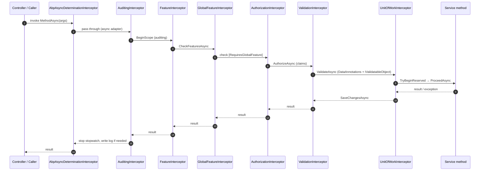

When ASP.NET Core dispatches a controller action that targets an application service, the call does **not** land directly on your implementation. ABP registers application services through Castle Windsor / Castle.Core DynamicProxy and wraps every public method with an ordered chain of `IAbpInterceptor` instances. This page walks the wrap-around order, names every interceptor, points to its source file, and shows what each one decides.

The same proxy stack is used by:

- `IApplicationService` derivatives invoked by the synthesized REST controllers (`flows/http-request-pipeline`).
- `IDomainService` calls when an aggregate operation needs auditing or UoW participation.
- Any `ITransientDependency` / `IScopedDependency` / `ISingletonDependency` that opts in via `[UnitOfWork]`, `[Authorize]`, `[RequiresFeature]`, or by being matched by `IClassInterceptorsSelectorList`.

## The Castle adapter

ABP integrates with Castle through a thin adapter at `framework/src/Volo.Abp.Castle.Core/Volo/Abp/Castle/DynamicProxy/`:

```csharp
// AbpAsyncDeterminationInterceptor.cs
public class AbpAsyncDeterminationInterceptor<TInterceptor> : AsyncDeterminationInterceptor
    where TInterceptor : IAbpInterceptor
{
    public AbpAsyncDeterminationInterceptor(TInterceptor abpInterceptor)
        : base(new CastleAsyncAbpInterceptorAdapter<TInterceptor>(abpInterceptor))
    {
    }
}
```

`AsyncDeterminationInterceptor` (from `Castle.Core.AsyncInterceptor`) inspects the intercepted method's return type and dispatches to one of `InterceptSynchronous`, `InterceptAsynchronous` or `InterceptAsynchronous<TResult>`. `CastleAsyncAbpInterceptorAdapter<T>` then forwards to the ABP-shaped `IAbpInterceptor.InterceptAsync(IAbpMethodInvocation invocation)`. That's the only surface area each ABP interceptor sees, regardless of whether the original method was `Task<T>`, `Task` or synchronous.

The list of interceptors that wrap a given service is built by `IClassInterceptorsSelectorList` at `framework/src/Volo.Abp.Core/Volo/Abp/DependencyInjection/ClassInterceptorsSelectorList.cs`. Each subsystem contributes a *registrar* (see `AuditingInterceptorRegistrar.cs`, `UnitOfWorkInterceptorRegistrar.cs`, etc.) that decides whether the target type/method warrants its interceptor — usually based on attributes or interface markers.

## Interceptor order

Castle wraps interceptors in the **registration order**. The outermost interceptor sees the call first; the innermost is closest to your code. The default ABP order is:



Read top-to-bottom on the call path, bottom-to-top on the return. The wrap-around shape matters: auditing sees the *complete* duration including authorization checks, but the UoW only wraps the actual service method — keeping the transaction window tight.

## The contract: `IAbpInterceptor`

All ABP interceptors inherit `AbpInterceptor` (`framework/src/Volo.Abp.Core/Volo/Abp/DynamicProxy/AbpInterceptor.cs`):

```csharp
public abstract class AbpInterceptor : IAbpInterceptor
{
    public abstract Task InterceptAsync(IAbpMethodInvocation invocation);
}
```

`IAbpMethodInvocation` exposes `Method`, `Arguments`, `TargetObject`, `ReturnValue` and the crucial `ProceedAsync()` — call it to continue down the chain, swallow it to short-circuit. Every interceptor below has the same shape: do work, optionally call `ProceedAsync`, optionally do post-work.

## 1. `AbpAsyncDeterminationInterceptor`

Source: `framework/src/Volo.Abp.Castle.Core/Volo/Abp/Castle/DynamicProxy/AbpAsyncDeterminationInterceptor.cs`.

The outermost wrapper. Its only job is to figure out whether the intercepted method is sync, `Task` or `Task<T>` and unwrap the result accordingly. It does no domain work and never short-circuits.

<Note>
  Every other ABP interceptor in this stack is registered as the generic parameter of `AbpAsyncDeterminationInterceptor<TInterceptor>` — Castle sees the determination interceptor; it sees the ABP one through the adapter. That's why this entry doesn't appear in the registrars: it is implicit for every interceptor.
</Note>

## 2. `AuditingInterceptor`

Source: `framework/src/Volo.Abp.Auditing/Volo/Abp/Auditing/AuditingInterceptor.cs`.

```csharp
public override async Task InterceptAsync(IAbpMethodInvocation invocation)
{
    using (var serviceScope = _serviceScopeFactory.CreateScope())
    {
        var auditingHelper = serviceScope.ServiceProvider.GetRequiredService<IAuditingHelper>();
        var auditingOptions = serviceScope.ServiceProvider.GetRequiredService<IOptions<AbpAuditingOptions>>().Value;

        if (!ShouldIntercept(invocation, auditingOptions, auditingHelper))
        {
            await invocation.ProceedAsync();
            return;
        }

        var auditingManager = serviceScope.ServiceProvider.GetRequiredService<IAuditingManager>();
        if (auditingManager.Current != null)
        {
            await ProceedByLoggingAsync(invocation, auditingOptions, auditingHelper, auditingManager.Current);
        }
        else
        {
            // open a new scope
            await ProcessWithNewAuditingScopeAsync(...);
        }
    }
}
```

Key behaviours:

- `ShouldIntercept` honours `[DisableAuditing]`, the `AbpAuditingOptions.IsEnabled` flag and `AbpCrossCuttingConcerns.IsApplied(invocation.TargetObject, AbpCrossCuttingConcerns.Auditing)`.
- If an outer audit log scope already exists (typical for HTTP — `AbpAuditingMiddleware` opens one per request), this interceptor just appends an `AuditLogAction` with method name, arguments, duration and any exception.
- Otherwise it opens a fresh scope via `IAuditingManager.BeginScope()` (used for background jobs, event handlers, gRPC).
- On exception, the exception is added to `AuditLog.Exceptions` and re-thrown — the audit log is still written.

Registrar: `AuditingInterceptorRegistrar.cs` opts in based on `[Audited]` / `[DisableAuditing]` attributes and the type being an application service.

## 3. `FeatureInterceptor`

Source: `framework/src/Volo.Abp.Features/Volo/Abp/Features/FeatureInterceptor.cs`.

```csharp
public override async Task InterceptAsync(IAbpMethodInvocation invocation)
{
    if (AbpCrossCuttingConcerns.IsApplied(invocation.TargetObject, AbpCrossCuttingConcerns.FeatureChecking))
    {
        await invocation.ProceedAsync();
        return;
    }
    await CheckFeaturesAsync(invocation);
    await invocation.ProceedAsync();
}
```

`CheckFeaturesAsync` delegates to `IMethodInvocationFeatureCheckerService` which reads `[RequiresFeature("MyFeature")]` from the method or declaring type, and asks `IFeatureChecker` whether the current tenant has it enabled. Throws `AbpAuthorizationException` (with feature-specific message) if not.

This runs *before* authorization so unauthenticated callers still get the "feature not enabled" message, never the "not authorized" message — which matters for the hosted tenant feature paywall.

## 4. `GlobalFeatureInterceptor`

Source: `framework/src/Volo.Abp.GlobalFeatures/Volo/Abp/GlobalFeatures/GlobalFeatureInterceptor.cs`.

```csharp
if (invocation.TargetObject != null &&
    !GlobalFeatureHelper.IsGlobalFeatureEnabled(invocation.TargetObject.GetType(), out var attribute))
{
    throw new AbpGlobalFeatureNotEnabledException(code: AbpGlobalFeatureErrorCodes.GlobalFeatureIsNotEnabled)
        .WithData("ServiceName", invocation.TargetObject.GetType().FullName!)
        .WithData("GlobalFeatureName", attribute!.Name!);
}
await invocation.ProceedAsync();
```

Global features are static, deployment-time switches that turn off entire vertical slices of a module (think "we don't ship the loyalty programme in the basic edition"). Unlike tenant features, they do not consult `ICurrentTenant`. The interceptor reads `[RequiresGlobalFeature]` from the target type.

## 5. `AuthorizationInterceptor`

Source: `framework/src/Volo.Abp.Authorization/Volo/Abp/Authorization/AuthorizationInterceptor.cs`.

```csharp
public override async Task InterceptAsync(IAbpMethodInvocation invocation)
{
    await AuthorizeAsync(invocation);
    await invocation.ProceedAsync();
}

protected virtual async Task AuthorizeAsync(IAbpMethodInvocation invocation)
{
    await _methodInvocationAuthorizationService.CheckAsync(
        new MethodInvocationAuthorizationContext(invocation.Method));
}
```

`IMethodInvocationAuthorizationService` reads `[Authorize]`, `[AllowAnonymous]` and `[RequirePermission]` attributes from the method (and type), then calls into ASP.NET Core's `IAuthorizationService` — which routes ABP permission policies through `PermissionChecker`. See [`flows/permission-check`](/flows/permission-check) for the full call graph.

<Warning>
  This interceptor runs even outside the HTTP pipeline — background jobs and integration tests still get authorization checks. Inside the HTTP pipeline, this is the **second** gate; the first one is the `UseAuthorization` middleware. They use the same `PermissionChecker`, so a permission denied by one is denied by the other.
</Warning>

## 6. `ValidationInterceptor`

Source: `framework/src/Volo.Abp.Validation/Volo/Abp/Validation/ValidationInterceptor.cs`.

```csharp
public override async Task InterceptAsync(IAbpMethodInvocation invocation)
{
    await ValidateAsync(invocation);
    await invocation.ProceedAsync();
}
```

`IMethodInvocationValidator` walks the argument graph and applies:

- DataAnnotations (`[Required]`, `[MaxLength]`, etc.).
- `IValidatableObject` contributions.
- ABP-specific `IShouldNormalize`, `IObjectExtender` validation.

If validation fails, an `AbpValidationException` is thrown — which `AbpExceptionFilter` later turns into a 400 with field-level errors.

Why *after* authorization? Because validating user input before authorizing the caller would leak the parameter shape to anonymous probes. ABP intentionally lets authz reject first.

## 7. `UnitOfWorkInterceptor`

Source: `framework/src/Volo.Abp.Uow/Volo/Abp/Uow/UnitOfWorkInterceptor.cs`.

```csharp
public override async Task InterceptAsync(IAbpMethodInvocation invocation)
{
    if (!UnitOfWorkHelper.IsUnitOfWorkMethod(invocation.Method, out var unitOfWorkAttribute))
    {
        await invocation.ProceedAsync();
        return;
    }

    using (var scope = _serviceScopeFactory.CreateScope())
    {
        var options = CreateOptions(scope.ServiceProvider, invocation, unitOfWorkAttribute);
        var unitOfWorkManager = scope.ServiceProvider.GetRequiredService<IUnitOfWorkManager>();

        if (unitOfWorkManager.TryBeginReserved(UnitOfWork.UnitOfWorkReservationName, options))
        {
            await invocation.ProceedAsync();
            if (unitOfWorkManager.Current != null)
            {
                await unitOfWorkManager.Current.SaveChangesAsync();
            }
            return;
        }

        using (var uow = unitOfWorkManager.Begin(options))
        {
            await invocation.ProceedAsync();
            await uow.CompleteAsync();
        }
    }
}
```

Two paths:

1. **Reserved UoW path** — used inside an HTTP request. `AbpUnitOfWorkMiddleware` already reserved a UoW named `_AbpActionUnitOfWork`. The interceptor calls `TryBeginReserved` to upgrade that reservation into an active UoW using options derived from the method. The middleware commits later.
2. **Owned UoW path** — used in background jobs, message handlers, console hosts, anywhere outside the HTTP request. The interceptor opens a fresh UoW and commits it via `uow.CompleteAsync()` before returning.

The `CreateOptions` heuristic deserves a callout:

```csharp
options.IsTransactional = defaultOptions.CalculateIsTransactional(
    autoValue: serviceProvider.GetRequiredService<IUnitOfWorkTransactionBehaviourProvider>().IsTransactional
               ?? !invocation.Method.Name.StartsWith("Get", StringComparison.InvariantCultureIgnoreCase));
```

If you don't set `[UnitOfWork(IsTransactional = ...)]`, methods named `GetX` are non-transactional (faster reads), all others are transactional.

## What about `ChangeTrackingInterceptor`?

A bonus interceptor lives at `framework/src/Volo.Abp.Ddd.Domain/Volo/Abp/Domain/ChangeTracking/ChangeTrackingInterceptor.cs`. It is registered on entities, not on services, and toggles `IsChangeTrackingEnabled` in the domain context. It does **not** sit on the application service call path.

## Registrars

Each interceptor has a *registrar* that decides which classes it attaches to. Pointers:

| Interceptor | Registrar |
| --- | --- |
| `AuditingInterceptor` | `framework/src/Volo.Abp.Auditing/Volo/Abp/Auditing/AuditingInterceptorRegistrar.cs` |
| `FeatureInterceptor` | `framework/src/Volo.Abp.Features/Volo/Abp/Features/FeatureInterceptorRegistrar.cs` |
| `GlobalFeatureInterceptor` | `framework/src/Volo.Abp.GlobalFeatures/Volo/Abp/GlobalFeatures/GlobalFeatureInterceptorRegistrar.cs` |
| `AuthorizationInterceptor` | `framework/src/Volo.Abp.Authorization/Volo/Abp/Authorization/AuthorizationInterceptorRegistrar.cs` |
| `ValidationInterceptor` | `framework/src/Volo.Abp.Validation/Volo/Abp/Validation/ValidationInterceptorRegistrar.cs` |
| `UnitOfWorkInterceptor` | `framework/src/Volo.Abp.Uow/Volo/Abp/Uow/UnitOfWorkInterceptorRegistrar.cs` |

All registrars implement `IOnServiceRegistredContext` and are invoked from `AbpAutofacServiceProviderFactory` / `AbpServiceCollectionExtensions` during DI build.

## Worked example: `CreateBookAsync`

```csharp
[Authorize(BookStorePermissions.Books.Create)]
[UnitOfWork(IsTransactional = true, Timeout = 30)]
public class BookAppService : ApplicationService, IBookAppService
{
    public async Task<BookDto> CreateAsync(CreateBookDto input)
    {
        var book = new Book(GuidGenerator.Create(), input.Name, input.Price);
        await _bookRepository.InsertAsync(book);
        return ObjectMapper.Map<Book, BookDto>(book);
    }
}
```

What happens when an HTTP request reaches the synthesized controller and it calls `_bookAppService.CreateAsync(...)`:

<Steps>
  <Step title="AbpAsyncDeterminationInterceptor">
    Sees `Task<BookDto>`, dispatches to the async branch of the Castle adapter.
  </Step>
  <Step title="AuditingInterceptor">
    `AbpAuditingMiddleware` already opened the audit scope. Appends an `AuditLogAction` placeholder, starts a stopwatch.
  </Step>
  <Step title="FeatureInterceptor">
    `CreateBookDto.Books` has no `[RequiresFeature]`. Pass-through.
  </Step>
  <Step title="GlobalFeatureInterceptor">
    `BookStore.Books` is not gated by a global feature. Pass-through.
  </Step>
  <Step title="AuthorizationInterceptor">
    `[Authorize(BookStorePermissions.Books.Create)]` → `PermissionChecker.IsGrantedAsync("BookStore.Books.Create")` returns `true`.
  </Step>
  <Step title="ValidationInterceptor">
    `CreateBookDto` has `[Required] Name` and `[Range(...)] Price`. Validates; throws `AbpValidationException` on failure.
  </Step>
  <Step title="UnitOfWorkInterceptor">
    Reads `[UnitOfWork(IsTransactional=true, Timeout=30)]`; `TryBeginReserved` succeeds (middleware reserved one earlier).
  </Step>
  <Step title="Service body">
    Executes the actual logic — `InsertAsync` calls `DbContext.Books.Add(book)`.
  </Step>
  <Step title="Unwind">
    `uow.SaveChangesAsync` flushes the change tracker (commit happens later in `AbpUnitOfWorkMiddleware`); audit log records 17ms.
  </Step>
</Steps>

## Cross-references

<CardGroup cols={2}>
  <Card title="Dynamic proxy & aspects" icon="puzzle-piece" href="/core/dynamic-proxy-and-aspects">
    Module-level overview of how interceptors are wired into DI.
  </Card>
  <Card title="Application Services" icon="cube" href="/ddd/application">
    Programming model for the methods invoked at the bottom of the stack.
  </Card>
  <Card title="Auditing" icon="clipboard-list" href="/auditing/auditing-module">
    What `AuditingInterceptor` writes to the audit log.
  </Card>
  <Card title="Authorization" icon="lock" href="/security/authorization">
    Attributes consulted by `AuthorizationInterceptor`.
  </Card>
</CardGroup>

## Related flows

- [HTTP request pipeline](/flows/http-request-pipeline) — what reaches the controller before the call to the service.
- [Unit of work lifecycle](/flows/unit-of-work-lifecycle) — what `TryBeginReserved` and `CompleteAsync` actually do.
- [Permission check](/flows/permission-check) — `AuthorizationInterceptor` internals.
- [Multi-tenancy resolution](/flows/multi-tenancy-resolution) — `FeatureInterceptor` consults `ICurrentTenant`.

## FAQ

<Accordion title="Can I change the order?">
  The order is fixed in the registrar contributions. You can add your own interceptor *outside* the stack by implementing `IInterceptorRegistrar`. Putting an interceptor between, say, `AuthorizationInterceptor` and `ValidationInterceptor` requires modifying the framework — it's not a supported extension point.
</Accordion>

<Accordion title="Why does AuditingInterceptor use its own service scope?">
  Because the interceptor may be invoked from a context where no scope exists (e.g. a singleton component). Creating a transient scope ensures `IAuditingManager`, `ICurrentUser` and friends resolve correctly without leaking lifetime.
</Accordion>

<Accordion title="What about background jobs?">
  The same interceptor stack runs on services resolved inside `BackgroundJobExecuter` — see [`flows/background-job-execution`](/flows/background-job-execution). The big difference: there's no reserved UoW, so the `UnitOfWorkInterceptor` takes the "owned UoW" branch and commits itself.
</Accordion>
