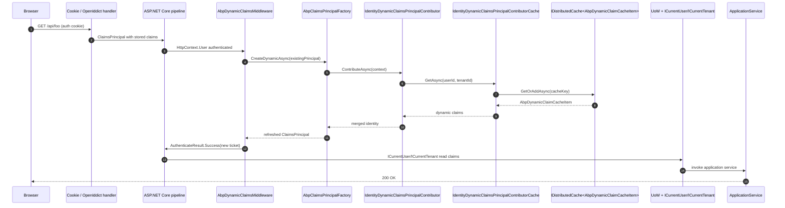

This page follows a single authenticated request through ABP's security pipeline — from the moment ASP.NET Core's cookie or OpenIddict authentication handler builds the initial `ClaimsPrincipal` to the point where `ICurrentUser` and `ICurrentTenant` are populated and consumed by application services. ABP layers a *dynamic claims* mechanism on top of the standard ASP.NET Core authentication system so that role and permission changes take effect on the next request without forcing the user to sign in again. The moving parts live in `framework/src/Volo.Abp.Security/Volo/Abp/Security/Claims/`, `framework/src/Volo.Abp.AspNetCore/Volo/Abp/AspNetCore/Security/Claims/`, and the Identity module under `modules/identity/src/Volo.Abp.Identity.Domain/Volo/Abp/Identity/`.

<Note>
  The "dynamic" half of the flow is **opt-in**: it is only triggered when `AbpClaimsPrincipalFactoryOptions.IsDynamicClaimsEnabled` is true, which the Identity module switches on as soon as it is added to the host. Without that, the dynamic claim middleware is a no-op.
</Note>

## Pipeline at a glance



The rest of the page walks the same steps at code level, citing every source file.

## 1. Initial authentication

Before ABP does anything claims-specific, ASP.NET Core needs an authenticated `ClaimsPrincipal`. In a typical ABP solution two handlers do that:

- **Cookie authentication** — used by the MVC/Razor UI host. The login page calls `SignInManager.PasswordSignInAsync(...)`, which uses `IUserClaimsPrincipalFactory<IdentityUser>` from the Identity module (`modules/identity/src/Volo.Abp.Identity.Domain/Volo/Abp/Identity/AbpUserClaimsPrincipalFactory.cs`) to build the initial principal, then the standard cookie handler persists it in `.AspNetCore.Cookies`.
- **OpenIddict / JWT bearer** — used by API hosts. The OpenIddict server (`modules/openiddict/src/Volo.Abp.OpenIddict.AspNetCore/`) issues a token whose subject is `AbpClaimTypes.UserId` and whose `scope` includes the user's roles; the JWT bearer handler at `framework/src/Volo.Abp.AspNetCore.Authentication.JwtBearer/` validates incoming tokens.

Both paths end at the same place: `HttpContext.User` is an authenticated `ClaimsPrincipal` whose identity carries the *static* snapshot of claims that were valid at sign-in time. ABP's claim type constants are defined in `framework/src/Volo.Abp.Security/Volo/Abp/Security/Claims/AbpClaimTypes.cs`:

<Tabs>
  <Tab title="Cookie sign-in">
    The MVC UI host calls `UseAuthentication()` before `UseAbpClaimsMap()` and `UseAuthorization()`. See `aspnetcore/auth-oauth` and the `app` template at `templates/app/aspnet-core/src/MyCompanyName.MyProjectName.HttpApi.Host/MyProjectNameHttpApiHostModule.cs`.
  </Tab>
  <Tab title="OpenIddict">
    The OpenIddict-issued JWT carries `sub`, `role`, `client_id`, plus any `DynamicClaims` opted into via `AbpClaimsPrincipalFactoryOptions.DynamicClaims`. See `/modules/openiddict/overview` for token shape.
  </Tab>
  <Tab title="JWT bearer">
    JWT bearer ships the same `RemoteDynamicClaimsPrincipalContributor` flow (`framework/src/Volo.Abp.AspNetCore.Authentication.JwtBearer/Volo/Abp/AspNetCore/Authentication/JwtBearer/DynamicClaims/`) so a remote API host can refresh dynamic claims from the auth server.
  </Tab>
</Tabs>

## 2. The claims principal factory

ABP centralises principal construction behind `IAbpClaimsPrincipalFactory` (interface at `framework/src/Volo.Abp.Security/Volo/Abp/Security/Claims/IAbpClaimsPrincipalFactory.cs`). The default implementation is `AbpClaimsPrincipalFactory` in `framework/src/Volo.Abp.Security/Volo/Abp/Security/Claims/AbpClaimsPrincipalFactory.cs`:

```csharp
public class AbpClaimsPrincipalFactory : IAbpClaimsPrincipalFactory, ITransientDependency
{
    public static string AuthenticationType => "Abp.Application";

    public virtual async Task<ClaimsPrincipal> CreateAsync(ClaimsPrincipal? existsClaimsPrincipal = null)
    {
        return await InternalCreateAsync(Options, existsClaimsPrincipal, false);
    }

    public virtual async Task<ClaimsPrincipal> CreateDynamicAsync(ClaimsPrincipal? existsClaimsPrincipal = null)
    {
        return await InternalCreateAsync(Options, existsClaimsPrincipal, true);
    }

    public virtual async Task<ClaimsPrincipal> InternalCreateAsync(
        AbpClaimsPrincipalFactoryOptions options,
        ClaimsPrincipal? existsClaimsPrincipal = null,
        bool isDynamic = false)
    {
        var claimsPrincipal = existsClaimsPrincipal ?? new ClaimsPrincipal(new ClaimsIdentity(
            AuthenticationType,
            AbpClaimTypes.UserName,
            AbpClaimTypes.Role));

        var context = new AbpClaimsPrincipalContributorContext(claimsPrincipal, ServiceProvider);

        if (!isDynamic)
        {
            foreach (var contributorType in options.Contributors)
            {
                var contributor = (IAbpClaimsPrincipalContributor)ServiceProvider.GetRequiredService(contributorType);
                await contributor.ContributeAsync(context);
            }
        }
        else
        {
            foreach (var contributorType in options.DynamicContributors)
            {
                var contributor = (IAbpDynamicClaimsPrincipalContributor)ServiceProvider.GetRequiredService(contributorType);
                await contributor.ContributeAsync(context);
            }
        }

        return context.ClaimsPrincipal;
    }
}
```

Two interesting properties of this factory: it has two contributor *lists* (`Contributors` and `DynamicContributors`), and it always returns the same `ClaimsPrincipal` instance the caller passed in — contributors mutate identities by adding claims to the principal, not by replacing it. The contributor abstraction is defined in `framework/src/Volo.Abp.Security/Volo/Abp/Security/Claims/IAbpClaimsPrincipalContributor.cs`:

```csharp
public interface IAbpClaimsPrincipalContributor
{
    Task ContributeAsync(AbpClaimsPrincipalContributorContext context);
}
```

A second interface, `IAbpDynamicClaimsPrincipalContributor` in `framework/src/Volo.Abp.Security/Volo/Abp/Security/Claims/IAbpDynamicClaimsPrincipalContributor.cs`, marks contributors that should only run on the dynamic path. The shared base `AbpDynamicClaimsPrincipalContributorBase` at `framework/src/Volo.Abp.Security/Volo/Abp/Security/Claims/AbpDynamicClaimsPrincipalContributorBase.cs` exposes a helper `AddDynamicClaimsAsync` that replaces same-typed claims rather than appending duplicates.

<Card title="Static vs dynamic contributors" icon="layer-group">
  *Static* contributors run when the principal is **created** (sign-in, token issuance). *Dynamic* contributors run on **every request** that hits `AbpDynamicClaimsMiddleware`. The split lets you avoid hitting the database on every API call while still picking up changes to a small whitelist of claims.
</Card>

## 3. The dynamic claims middleware

The middleware that drives step 4 of the diagram is `AbpDynamicClaimsMiddleware` at `framework/src/Volo.Abp.AspNetCore/Volo/Abp/AspNetCore/Security/Claims/AbpDynamicClaimsMiddleware.cs`. It is registered automatically by the host module (the `app` template calls `UseAuthentication()` immediately followed by the middleware via `MapAbpClaims` / `UseDynamicClaims` — see `/aspnetcore/auth-oauth` for the registration order). The body is small:

```csharp
public class AbpDynamicClaimsMiddleware : AbpMiddlewareBase, ITransientDependency
{
    public async override Task InvokeAsync(HttpContext context, RequestDelegate next)
    {
        if (context.User.Identity?.IsAuthenticated == true)
        {
            if (context.RequestServices.GetRequiredService<IOptions<AbpClaimsPrincipalFactoryOptions>>()
                    .Value.IsDynamicClaimsEnabled)
            {
                var authenticateResultFeature = context.Features.Get<IAuthenticateResultFeature>();
                var authenticationType = authenticateResultFeature?.AuthenticateResult?.Ticket?.AuthenticationScheme
                                         ?? context.User.Identity.AuthenticationType;

                if (authenticateResultFeature != null && !authenticationType.IsNullOrWhiteSpace())
                {
                    var abpClaimsPrincipalFactory = context.RequestServices
                        .GetRequiredService<IAbpClaimsPrincipalFactory>();
                    var user = await abpClaimsPrincipalFactory.CreateDynamicAsync(context.User);

                    authenticateResultFeature.AuthenticateResult = AuthenticateResult.Success(
                        new AuthenticationTicket(user,
                            authenticateResultFeature?.AuthenticateResult?.Properties,
                            authenticationType));
                }

                if (context.User.Identity?.IsAuthenticated == false)
                {
                    var authenticationSchemeProvider = context.RequestServices
                        .GetRequiredService<IAuthenticationSchemeProvider>();
                    if (!authenticationType.IsNullOrWhiteSpace())
                    {
                        var authenticationScheme = await authenticationSchemeProvider.GetSchemeAsync(authenticationType);
                        if (authenticationScheme != null &&
                            typeof(IAuthenticationSignOutHandler).IsAssignableFrom(authenticationScheme.HandlerType))
                        {
                            await context.SignOutAsync(authenticationScheme.Name);
                        }
                    }
                }
            }
        }

        await next(context);
    }
}
```

Three behaviours worth highlighting:

<Steps>
  <Step title="Skip anonymous">
    The middleware exits immediately if `context.User.Identity?.IsAuthenticated` is false — anonymous requests pay zero cost.
  </Step>
  <Step title="Rewrite the auth ticket">
    On success it does not just mutate `HttpContext.User`; it rewrites `IAuthenticateResultFeature.AuthenticateResult` so any later `await context.AuthenticateAsync(scheme)` call returns the merged principal. This is what makes the dynamic claims visible to `[Authorize]`, MVC filters, and minimal APIs.
  </Step>
  <Step title="Sign out broken users">
    If a contributor clears the principal (for example `IdentityDynamicClaimsPrincipalContributor` does this when the user was deleted), the middleware calls `SignOutAsync` on the appropriate scheme so the stale cookie or token is invalidated.
  </Step>
</Steps>

A companion middleware, `AbpClaimsMapMiddleware` at `framework/src/Volo.Abp.AspNetCore/Volo/Abp/AspNetCore/Security/Claims/AbpClaimsMapMiddleware.cs`, used to rewrite well-known claim types (for example mapping the ASP.NET Core `nameidentifier` to `AbpClaimTypes.UserId`). It is now marked `[Obsolete]` in favour of the `TransformAbpClaims` extension method on `IServiceCollection`; the comment in the source tells you so directly. See `/aspnetcore/multi-tenancy-middleware` for the broader middleware ordering.

## 4. The identity contributor

The Identity module ships `IdentityDynamicClaimsPrincipalContributor` at `modules/identity/src/Volo.Abp.Identity.Domain/Volo/Abp/Identity/IdentityDynamicClaimsPrincipalContributor.cs`. It is the contributor that runs inside `AbpClaimsPrincipalFactory.CreateDynamicAsync` for cookie-based hosts:

```csharp
public class IdentityDynamicClaimsPrincipalContributor : AbpDynamicClaimsPrincipalContributorBase
{
    public async override Task ContributeAsync(AbpClaimsPrincipalContributorContext context)
    {
        var identity = context.ClaimsPrincipal.Identities.FirstOrDefault();
        var userId = identity?.FindUserId();
        if (userId == null)
        {
            return;
        }

        var dynamicClaimsCache = context.GetRequiredService<IdentityDynamicClaimsPrincipalContributorCache>();
        AbpDynamicClaimCacheItem dynamicClaims;
        try
        {
            dynamicClaims = await dynamicClaimsCache.GetAsync(userId.Value, identity.FindTenantId());
        }
        catch (EntityNotFoundException e)
        {
            // In case if user not found, We force to clear the claims principal.
            context.ClaimsPrincipal = new ClaimsPrincipal(new ClaimsIdentity());
            var logger = context.GetRequiredService<ILogger<IdentityDynamicClaimsPrincipalContributor>>();
            logger.LogWarning(e, $"User not found: {userId.Value}");
            return;
        }

        if (dynamicClaims.Claims.IsNullOrEmpty())
        {
            return;
        }

        await AddDynamicClaimsAsync(context, identity, dynamicClaims.Claims);
    }
}
```

Notice the `EntityNotFoundException` branch: if the cached `userId` no longer exists in the database (deleted user) the contributor wipes the principal, which trips the sign-out path in the middleware shown above. This is how a deleted user is logged out on their *next* request.

## 5. The cache

The contributor delegates expensive work to `IdentityDynamicClaimsPrincipalContributorCache` at `modules/identity/src/Volo.Abp.Identity.Domain/Volo/Abp/Identity/IdentityDynamicClaimsPrincipalContributorCache.cs`. The cache wraps an `IDistributedCache<AbpDynamicClaimCacheItem>`:

```csharp
public class IdentityDynamicClaimsPrincipalContributorCache : ITransientDependency
{
    protected IDistributedCache<AbpDynamicClaimCacheItem> DynamicClaimCache { get; }
    protected ICurrentTenant CurrentTenant { get; }
    protected IdentityUserManager UserManager { get; }
    protected IUserClaimsPrincipalFactory<IdentityUser> UserClaimsPrincipalFactory { get; }
    protected IOptions<AbpClaimsPrincipalFactoryOptions> AbpClaimsPrincipalFactoryOptions { get; }
    protected IOptions<IdentityDynamicClaimsPrincipalContributorCacheOptions> CacheOptions { get; }

    public virtual async Task<AbpDynamicClaimCacheItem> GetAsync(Guid userId, Guid? tenantId = null)
    {
        if (AbpClaimsPrincipalFactoryOptions.Value.DynamicClaims.IsNullOrEmpty())
        {
            var emptyCacheItem = new AbpDynamicClaimCacheItem();
            await DynamicClaimCache.SetAsync(
                AbpDynamicClaimCacheItem.CalculateCacheKey(userId, tenantId),
                emptyCacheItem,
                new DistributedCacheEntryOptions
                {
                    AbsoluteExpirationRelativeToNow = CacheOptions.Value.CacheAbsoluteExpiration
                });

            return emptyCacheItem;
        }

        using (CurrentTenant.Change(tenantId))
        {
            return await DynamicClaimCache.GetOrAddAsync(
                AbpDynamicClaimCacheItem.CalculateCacheKey(userId, tenantId),
                async () =>
                {
                    var user = await UserManager.GetByIdAsync(userId);
                    var principal = await UserClaimsPrincipalFactory.CreateAsync(user);

                    var dynamicClaims = new AbpDynamicClaimCacheItem();
                    foreach (var claimType in AbpClaimsPrincipalFactoryOptions.Value.DynamicClaims)
                    {
                        var claims = principal.Claims.Where(x => x.Type == claimType).ToList();
                        if (claims.Any())
                        {
                            dynamicClaims.Claims.AddRange(
                                claims.Select(c => new AbpDynamicClaim(claimType, c.Value)));
                        }
                        else
                        {
                            dynamicClaims.Claims.Add(new AbpDynamicClaim(claimType, null));
                        }
                    }

                    return dynamicClaims;
                },
                () => new DistributedCacheEntryOptions
                {
                    AbsoluteExpirationRelativeToNow = CacheOptions.Value.CacheAbsoluteExpiration
                });
        }
    }

    public virtual async Task ClearAsync(Guid userId, Guid? tenantId = null)
    {
        await DynamicClaimCache.RemoveAsync(AbpDynamicClaimCacheItem.CalculateCacheKey(userId, tenantId));
    }
}
```

The cache key is computed by `AbpDynamicClaimCacheItem.CalculateCacheKey` in `framework/src/Volo.Abp.Security/Volo/Abp/Security/Claims/AbpDynamicClaimCacheItem.cs`:

```csharp
public static string CalculateCacheKey(Guid userId, Guid? tenantId)
{
    return $"{tenantId}-{userId}";
}
```

So every tenant gets its own claim cache entry — important because the same `userId` can belong to a different host/tenant boundary when the dynamic claims include host-only attributes.

<Warning>
  The cache is populated using `IUserClaimsPrincipalFactory<IdentityUser>` — the **ASP.NET Core Identity** factory, not ABP's `IAbpClaimsPrincipalFactory`. This is intentional: it gives you the canonical, freshly hydrated user claim set straight from the data store, free of stale dynamic data.
</Warning>

### Refreshing on user changes

Whenever Identity changes the user's roles, permissions, or other dynamic-claim fields, it must call `ClearAsync` so the next request rebuilds the cache entry. The Identity domain calls this from `IdentityUserManager` (`modules/identity/src/Volo.Abp.Identity.Domain/Volo/Abp/Identity/IdentityUserManager.cs`) after role assignments, and the Permission Management module (`modules/permission-management`) hooks the same cache when grants change. The contract is straightforward: anyone modifying a user's dynamic state must invalidate the cache entry for `(userId, tenantId)`. See `/modules/identity/overview` and `/modules/permission-management/overview` for the integration points.

## 6. Populating ICurrentUser and ICurrentTenant

Once `HttpContext.User` carries the up-to-date principal, two ABP services pull the values back out for the rest of the application:

- `ICurrentUser` — implemented by `CurrentUser` at `framework/src/Volo.Abp.Security/Volo/Abp/Security/CurrentUser.cs`. It reads `AbpClaimTypes.UserId`, `UserName`, `Role`, `Email`, etc. from `ICurrentPrincipalAccessor.Principal`.
- `ICurrentTenant` — implemented by `CurrentTenant` at `framework/src/Volo.Abp.MultiTenancy/Volo/Abp/MultiTenancy/CurrentTenant.cs`. Its `Id` comes from an `AsyncLocal`-backed `ICurrentTenantAccessor`, but the value is *seeded* by `MultiTenancyMiddleware` (see [Multi-Tenancy Resolution Flow](/flows/multi-tenancy-resolution)).

`ICurrentPrincipalAccessor` is implemented by `HttpContextCurrentPrincipalAccessor` in ASP.NET Core hosts, falling back to `ThreadCurrentPrincipalAccessor` at `framework/src/Volo.Abp.Security/Volo/Abp/Security/Claims/ThreadCurrentPrincipalAccessor.cs` for background work. Together they answer the question "who is making the current call?" in both web and non-web contexts.

```csharp
public class CurrentTenant : ICurrentTenant, ITransientDependency
{
    public virtual bool IsAvailable => Id.HasValue;
    public virtual Guid? Id => _currentTenantAccessor.Current?.TenantId;
    public string? Name => _currentTenantAccessor.Current?.Name;

    public IDisposable Change(Guid? id, string? name = null)
    {
        return SetCurrent(id, name);
    }
}
```

The `Change` method opens an `AsyncLocal` scope that the host can use to override tenant-id for nested calls — see the multi-tenancy flow for how `MultiTenancyMiddleware` calls it.

## 7. Authorisation handlers

With `ICurrentUser` populated and dynamic claims merged, ASP.NET Core's `UseAuthorization()` middleware runs next. ABP's policy provider, `AbpAuthorizationPolicyProvider` at `framework/src/Volo.Abp.Authorization/Volo/Abp/Authorization/AbpAuthorizationPolicyProvider.cs`, lazily maps every `[Authorize(Policy = "...")]` whose policy name matches a `PermissionDefinition` to a `PermissionRequirement`, which is then evaluated by `PermissionRequirementHandler` and `PermissionChecker`. The whole permission half is described in detail in the [Permission Check Flow](/flows/permission-check).

<Card title="Why this matters" icon="shield-check" href="/security/permissions">
  Because the dynamic-claims middleware runs *before* `UseAuthorization()`, a role grant made one second ago is honoured on the next request without re-login. Without dynamic claims, the user would need to sign out and back in to refresh the cookie.
</Card>

## 8. Where each piece is registered

The plumbing is wired up by `AbpSecurityModule` at `framework/src/Volo.Abp.Security/Volo/Abp/Security/AbpSecurityModule.cs` (which registers `AbpClaimsPrincipalFactory` and the contributor options) and by the Identity domain module at `modules/identity/src/Volo.Abp.Identity.Domain/Volo/Abp/Identity/AbpIdentityDomainModule.cs` (which adds `IdentityDynamicClaimsPrincipalContributor` to `AbpClaimsPrincipalFactoryOptions.DynamicContributors` and flips `IsDynamicClaimsEnabled`).

<Accordion title="AbpClaimsPrincipalFactoryOptions in detail">
  Look at `framework/src/Volo.Abp.Security/Volo/Abp/Security/Claims/AbpClaimsPrincipalFactoryOptions.cs`. The options expose:
  - `Contributors` — ordered list of `IAbpClaimsPrincipalContributor` types run by `CreateAsync`.
  - `DynamicContributors` — ordered list of `IAbpDynamicClaimsPrincipalContributor` types run by `CreateDynamicAsync`.
  - `DynamicClaims` — a list of claim types that participate in the cache-and-replace path; you opt a claim in by adding its name to this collection.
  - `IsDynamicClaimsEnabled` — the master switch consumed by `AbpDynamicClaimsMiddleware`.

  Custom contributors register themselves transiently and add their type to `DynamicContributors` from your module's `ConfigureServices`. They have full access to the request scope via `AbpClaimsPrincipalContributorContext.GetRequiredService<T>()`.
</Accordion>

<Accordion title="Remote contributors for distributed scenarios">
  For separated identity-server / application-server architectures, `framework/src/Volo.Abp.AspNetCore.Mvc.Client.Common/Volo/Abp/AspNetCore/Mvc/Client/RemoteDynamicClaimsPrincipalContributor.cs` and `framework/src/Volo.Abp.AspNetCore.Authentication.JwtBearer/Volo/Abp/AspNetCore/Authentication/JwtBearer/DynamicClaims/WebRemoteDynamicClaimsPrincipalContributor.cs` ship contributors that call the auth server's `/connect/userinfo`-like endpoint instead of hitting the local database. They use `RemoteDynamicClaimsPrincipalContributorCacheBase` (at `framework/src/Volo.Abp.Security/Volo/Abp/Security/Claims/RemoteDynamicClaimsPrincipalContributorCacheBase.cs`) so the API host caches per-user-per-tenant just like the Identity contributor does.
</Accordion>

## 9. End-to-end timeline

Putting everything together, a single authenticated request looks like this (assume an MVC host with cookie auth and dynamic claims enabled):

<Steps>
  <Step title="Cookie handler reads .AspNetCore.Cookies">
    `AuthenticationMiddleware` (vanilla ASP.NET Core) populates `HttpContext.User` from the cookie. See `aspnetcore/auth-oauth` for the registration.
  </Step>
  <Step title="AbpDynamicClaimsMiddleware checks the flag">
    The middleware at `framework/src/Volo.Abp.AspNetCore/Volo/Abp/AspNetCore/Security/Claims/AbpDynamicClaimsMiddleware.cs` inspects `AbpClaimsPrincipalFactoryOptions.IsDynamicClaimsEnabled` and calls `IAbpClaimsPrincipalFactory.CreateDynamicAsync(HttpContext.User)`.
  </Step>
  <Step title="Factory runs dynamic contributors">
    `AbpClaimsPrincipalFactory.InternalCreateAsync` iterates `Options.DynamicContributors`. For the Identity module that means `IdentityDynamicClaimsPrincipalContributor`.
  </Step>
  <Step title="Contributor consults the cache">
    `IdentityDynamicClaimsPrincipalContributorCache.GetAsync` either returns a hot cache entry from Redis (or `IMemoryCache` in tests) or rebuilds it by calling `IdentityUserManager.GetByIdAsync` + `IUserClaimsPrincipalFactory<IdentityUser>.CreateAsync`.
  </Step>
  <Step title="Merged principal returned">
    The contributor calls `AddDynamicClaimsAsync` on the base class, which removes existing claims of the same types and inserts the fresh ones. The factory hands back the same `ClaimsPrincipal` instance to the middleware.
  </Step>
  <Step title="Auth ticket rewritten">
    The middleware writes the refreshed ticket back into `IAuthenticateResultFeature` so later code paths see the new claims.
  </Step>
  <Step title="MultiTenancyMiddleware seeds ICurrentTenant">
    See [Multi-Tenancy Resolution Flow](/flows/multi-tenancy-resolution) for the next step.
  </Step>
  <Step title="UseAuthorization runs">
    `PermissionRequirementHandler` calls `PermissionChecker.IsGrantedAsync`, which finally reads the merged claims via `ICurrentPrincipalAccessor`. See [Permission Check Flow](/flows/permission-check).
  </Step>
  <Step title="Application service runs">
    Controller invokes an application service inside a UoW scope; the service reads `ICurrentUser.Id`, `ICurrentTenant.Id`, etc. See [Application Service Call Flow](/flows/application-service-call).
  </Step>
</Steps>

<CardGroup cols={2}>
  <Card title="Multi-Tenancy Resolution" icon="building" href="/flows/multi-tenancy-resolution">
    How `MultiTenancyMiddleware` turns the host or token into a `Guid?` tenant id and opens the `ICurrentTenant.Change` scope.
  </Card>
  <Card title="Permission Check" icon="key" href="/flows/permission-check">
    How the merged `ClaimsPrincipal` is consumed by `PermissionChecker` and the `IPermissionValueProvider` chain.
  </Card>
  <Card title="HTTP Request Pipeline" icon="route" href="/flows/http-request-pipeline">
    Wider view of where the dynamic claims middleware sits in the full ASP.NET Core pipeline.
  </Card>
  <Card title="Application Service Call" icon="server" href="/flows/application-service-call">
    How the populated `ICurrentUser` propagates into the application layer.
  </Card>
</CardGroup>

## Related subsystem pages

<CardGroup cols={2}>
  <Card title="Multi-tenancy middleware" icon="layer-group" href="/aspnetcore/multi-tenancy-middleware">
    Middleware ordering for `UseAuthentication` → `UseMultiTenancy` → dynamic claims.
  </Card>
  <Card title="Security overview" icon="lock" href="/security/overview">
    The wider security stack the claims pipeline plugs into.
  </Card>
  <Card title="Authorization" icon="user-check" href="/security/authorization">
    Where `AbpAuthorizationPolicyProvider` maps permission names onto MVC policies.
  </Card>
  <Card title="Permissions" icon="key" href="/security/permissions">
    Configuration of `PermissionDefinitionManager` and value providers.
  </Card>
  <Card title="Identity module" icon="user" href="/modules/identity/overview">
    Where `IdentityDynamicClaimsPrincipalContributor` and the cache live.
  </Card>
  <Card title="OpenIddict module" icon="id-card" href="/modules/openiddict/overview">
    Token issuance side of the same flow.
  </Card>
</CardGroup>
