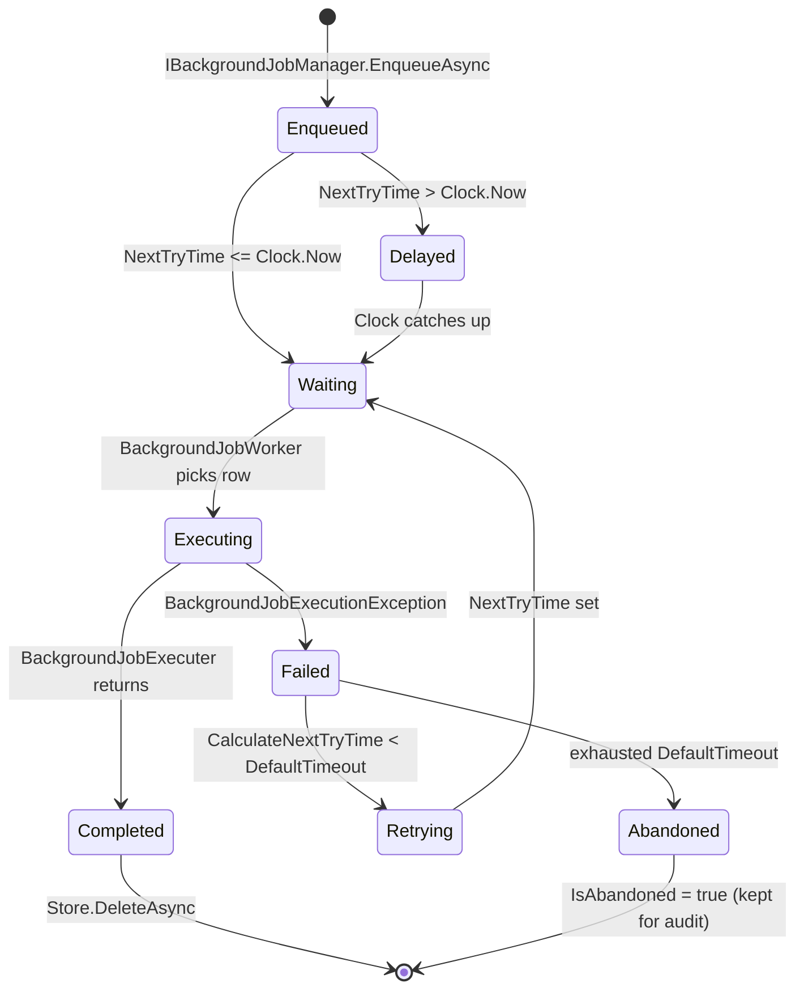
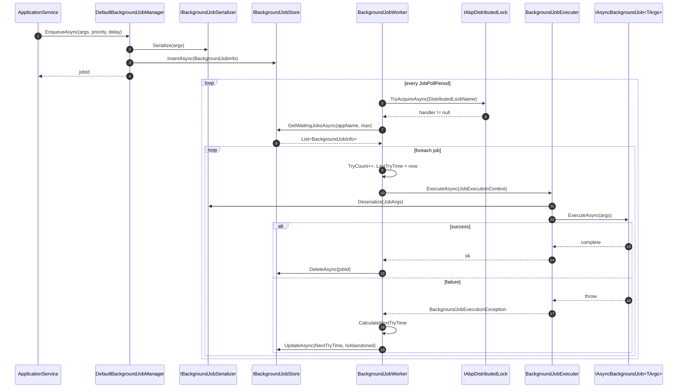

This page traces a single background job through ABP's default in-process job system — from the call to `IBackgroundJobManager.EnqueueAsync<TArgs>(args)` in an application service to the polling worker that picks the row up, executes the job, and either deletes the record or schedules an exponential-backoff retry. The default implementation lives in `framework/src/Volo.Abp.BackgroundJobs/Volo/Abp/BackgroundJobs/`; the abstractions (consumed by Hangfire, Quartz, and RabbitMQ adapters) live in `framework/src/Volo.Abp.BackgroundJobs.Abstractions/Volo/Abp/BackgroundJobs/`. Everything below describes the *default* implementation — see `/background/jobs-default` for configuration and `/background/jobs-abstractions` for swapping in a different store.

<Note>
  The default store is database-backed (`BackgroundJobStore` in the EF Core module, `InMemoryBackgroundJobStore` for tests). When you want a distributed broker, you swap the manager for Hangfire/Quartz/RabbitMQ — the contracts are unchanged. See `/background/jobs-hangfire`, `/background/jobs-quartz`, `/background/jobs-rabbitmq`.
</Note>

## Lifecycle at a glance



## Sequence at a glance



## 1. Enqueueing

Application code talks to `IBackgroundJobManager` (interface at `framework/src/Volo.Abp.BackgroundJobs.Abstractions/Volo/Abp/BackgroundJobs/IBackgroundJobManager.cs`):

```csharp
public interface IBackgroundJobManager
{
    Task<string> EnqueueAsync<TArgs>(
        TArgs args,
        BackgroundJobPriority priority = BackgroundJobPriority.Normal,
        TimeSpan? delay = null
    );
}
```

The default implementation is `DefaultBackgroundJobManager` at `framework/src/Volo.Abp.BackgroundJobs/Volo/Abp/BackgroundJobs/DefaultBackgroundJobManager.cs`:

```csharp
[Dependency(ReplaceServices = true)]
public class DefaultBackgroundJobManager : IBackgroundJobManager, ITransientDependency
{
    protected IClock Clock { get; }
    protected IBackgroundJobSerializer Serializer { get; }
    protected IGuidGenerator GuidGenerator { get; }
    protected IBackgroundJobStore Store { get; }
    protected IOptions<AbpBackgroundJobOptions> BackgroundJobOptions { get; }
    protected IOptions<AbpBackgroundJobWorkerOptions> BackgroundJobWorkerOptions { get; }

    public virtual async Task<string> EnqueueAsync<TArgs>(
        TArgs args,
        BackgroundJobPriority priority = BackgroundJobPriority.Normal,
        TimeSpan? delay = null)
    {
        var jobName = BackgroundJobOptions.Value.GetBackgroundJobName(typeof(TArgs));
        var jobId = await EnqueueAsync(jobName, args!, priority, delay);
        return jobId.ToString();
    }

    protected virtual async Task<Guid> EnqueueAsync(
        string jobName,
        object args,
        BackgroundJobPriority priority = BackgroundJobPriority.Normal,
        TimeSpan? delay = null)
    {
        var jobInfo = new BackgroundJobInfo
        {
            Id = GuidGenerator.Create(),
            ApplicationName = BackgroundJobWorkerOptions.Value.ApplicationName,
            JobName = jobName,
            JobArgs = Serializer.Serialize(args),
            Priority = priority,
            CreationTime = Clock.Now,
            NextTryTime = Clock.Now
        };

        if (delay.HasValue)
        {
            jobInfo.NextTryTime = Clock.Now.Add(delay.Value);
        }

        await Store.InsertAsync(jobInfo);

        return jobInfo.Id;
    }
}
```

Five things to notice:

<Steps>
  <Step title="Type-keyed job lookup">
    `AbpBackgroundJobOptions.GetBackgroundJobName(typeof(TArgs))` resolves the registered job by *args type*. The default implementation reads `BackgroundJobNameAttribute` (at `framework/src/Volo.Abp.BackgroundJobs.Abstractions/Volo/Abp/BackgroundJobs/BackgroundJobNameAttribute.cs`) or the type's full name.
  </Step>
  <Step title="Sortable Guid id">
    The job id is generated by `IGuidGenerator`, which produces COMB-style sortable GUIDs in the default `SequentialGuidGenerator` (see `framework/src/Volo.Abp.Guids/Volo/Abp/Guids/SequentialGuidGenerator.cs`). This keeps the database index hot.
  </Step>
  <Step title="App-name isolation">
    `ApplicationName` is read from `AbpBackgroundJobWorkerOptions` — multiple ABP hosts can share the same job table while only picking up *their own* rows. The worker's `GetWaitingJobsAsync` filter respects this.
  </Step>
  <Step title="JSON-serialised args">
    `IBackgroundJobSerializer` (default `JsonBackgroundJobSerializer` at `framework/src/Volo.Abp.BackgroundJobs/Volo/Abp/BackgroundJobs/JsonBackgroundJobSerializer.cs`) stores `JobArgs` as a string. Pick value-type DTOs for args; large or mutable types should go through entity references instead.
  </Step>
  <Step title="Delay = NextTryTime">
    `delay` doesn't queue anywhere magical — it just bumps `NextTryTime` forward. The worker's poll naturally filters until then.
  </Step>
</Steps>

The persisted shape is `BackgroundJobInfo` at `framework/src/Volo.Abp.BackgroundJobs/Volo/Abp/BackgroundJobs/BackgroundJobInfo.cs`:

```csharp
public class BackgroundJobInfo
{
    public Guid Id { get; set; }
    public virtual string? ApplicationName { get; set; }
    public virtual string JobName { get; set; } = default!;
    public virtual string JobArgs { get; set; } = default!;
    public virtual short TryCount { get; set; }
    public virtual DateTime CreationTime { get; set; }
    public virtual DateTime NextTryTime { get; set; }
    public virtual DateTime? LastTryTime { get; set; }
    public virtual bool IsAbandoned { get; set; }
    public virtual BackgroundJobPriority Priority { get; set; }
}
```

The fields map directly onto the columns the EF Core module creates. See `/background/jobs-default` for the migration.

## 2. The job class

A job is a class implementing `IAsyncBackgroundJob<TArgs>` (or its sync sibling `IBackgroundJob<TArgs>`) at `framework/src/Volo.Abp.BackgroundJobs.Abstractions/Volo/Abp/BackgroundJobs/IAsyncBackgroundJob.cs`:

```csharp
public interface IAsyncBackgroundJob<in TArgs>
{
    Task ExecuteAsync(TArgs args);
}
```

Most jobs derive from the convenience base `AsyncBackgroundJob<TArgs>` at `framework/src/Volo.Abp.BackgroundJobs.Abstractions/Volo/Abp/BackgroundJobs/AsyncBackgroundJob.cs`:

```csharp
public abstract class AsyncBackgroundJob<TArgs> : IAsyncBackgroundJob<TArgs>
{
    public ILogger<AsyncBackgroundJob<TArgs>> Logger { get; set; }

    protected AsyncBackgroundJob()
    {
        Logger = NullLogger<AsyncBackgroundJob<TArgs>>.Instance;
    }

    public abstract Task ExecuteAsync(TArgs args);
}
```

It registers itself with the DI container — adding a class derived from `AsyncBackgroundJob<TArgs>` is enough; ABP's conventional registration picks it up. To register the *type/name binding*, declare a `BackgroundJobConfiguration` in your module:

```csharp
Configure<AbpBackgroundJobOptions>(options =>
{
    options.AddJob<SendWelcomeEmailJob>();
});
```

`AddJob` lives at `framework/src/Volo.Abp.BackgroundJobs.Abstractions/Volo/Abp/BackgroundJobs/AbpBackgroundJobOptions.cs`. It records the `(argsType, jobType)` pair in two dictionaries the worker consults at execution time.

<Card title="Convention: nest args inside the job class" icon="lightbulb" href="/background/jobs-abstractions">
  ABP's docs recommend declaring the `TArgs` DTO as a nested class of the job. This keeps the type contract obvious at the call site and avoids accidental reuse of an unrelated DTO.
</Card>

## 3. The worker

`BackgroundJobWorker` (at `framework/src/Volo.Abp.BackgroundJobs/Volo/Abp/BackgroundJobs/BackgroundJobWorker.cs`) is a long-running periodic worker built on top of ABP's `AsyncPeriodicBackgroundWorkerBase`. It is registered with the host's `IBackgroundWorkerManager` when `AbpBackgroundJobsModule` is loaded (see `framework/src/Volo.Abp.BackgroundJobs/Volo/Abp/BackgroundJobs/AbpBackgroundJobsModule.cs`):

```csharp
public class BackgroundJobWorker : AsyncPeriodicBackgroundWorkerBase, IBackgroundJobWorker
{
    protected AbpBackgroundJobOptions JobOptions { get; }
    protected AbpBackgroundJobWorkerOptions WorkerOptions { get; }
    protected IAbpDistributedLock DistributedLock { get; }

    public BackgroundJobWorker(
        AbpAsyncTimer timer,
        IOptions<AbpBackgroundJobOptions> jobOptions,
        IOptions<AbpBackgroundJobWorkerOptions> workerOptions,
        IServiceScopeFactory serviceScopeFactory,
        IAbpDistributedLock distributedLock)
        : base(timer, serviceScopeFactory)
    {
        DistributedLock = distributedLock;
        WorkerOptions = workerOptions.Value;
        JobOptions = jobOptions.Value;
        Timer.Period = WorkerOptions.JobPollPeriod;
    }

    protected override async Task DoWorkAsync(PeriodicBackgroundWorkerContext workerContext)
    {
        await using (var handler = await DistributedLock.TryAcquireAsync(
            WorkerOptions.DistributedLockName, cancellationToken: StoppingToken))
        {
            if (handler != null)
            {
                var store = workerContext.ServiceProvider.GetRequiredService<IBackgroundJobStore>();

                var waitingJobs = await store.GetWaitingJobsAsync(
                    WorkerOptions.ApplicationName, WorkerOptions.MaxJobFetchCount);

                if (!waitingJobs.Any())
                {
                    return;
                }

                var jobExecuter = workerContext.ServiceProvider.GetRequiredService<IBackgroundJobExecuter>();
                var clock = workerContext.ServiceProvider.GetRequiredService<IClock>();
                var serializer = workerContext.ServiceProvider.GetRequiredService<IBackgroundJobSerializer>();

                foreach (var jobInfo in waitingJobs)
                {
                    jobInfo.TryCount++;
                    jobInfo.LastTryTime = clock.Now;

                    try
                    {
                        var jobConfiguration = JobOptions.GetJob(jobInfo.JobName);
                        var jobArgs = serializer.Deserialize(jobInfo.JobArgs, jobConfiguration.ArgsType);
                        var context = new JobExecutionContext(
                            workerContext.ServiceProvider,
                            jobConfiguration.JobType,
                            jobArgs,
                            workerContext.CancellationToken);

                        try
                        {
                            await jobExecuter.ExecuteAsync(context);

                            await store.DeleteAsync(jobInfo.Id);
                        }
                        catch (BackgroundJobExecutionException)
                        {
                            var nextTryTime = CalculateNextTryTime(jobInfo, clock);

                            if (nextTryTime.HasValue)
                            {
                                jobInfo.NextTryTime = nextTryTime.Value;
                            }
                            else
                            {
                                jobInfo.IsAbandoned = true;
                            }

                            await TryUpdateAsync(store, jobInfo);
                        }
                    }
                    catch (Exception ex)
                    {
                        Logger.LogException(ex);
                        jobInfo.IsAbandoned = true;
                        await TryUpdateAsync(store, jobInfo);
                    }
                }
            }
            else
            {
                try
                {
                    await Task.Delay(WorkerOptions.JobPollPeriod * 12, StoppingToken);
                }
                catch (TaskCanceledException) { }
            }
        }
    }
}
```

Three behaviours worth highlighting:

<Steps>
  <Step title="Distributed lock per worker">
    `IAbpDistributedLock.TryAcquireAsync(WorkerOptions.DistributedLockName)` ensures only one host instance processes the queue at a time. The default lock name is `"AbpBackgroundJobWorker"` (see `AbpBackgroundJobWorkerOptions`). Without a real distributed lock provider, this falls back to a local lock and you can run only a single replica.
  </Step>
  <Step title="Long back-off when contended">
    If the lock can't be acquired, the worker sleeps `JobPollPeriod * 12` (default 60 seconds) before re-checking. This keeps idle replicas cheap.
  </Step>
  <Step title="Outer try/catch protects the loop">
    Any *non*-`BackgroundJobExecutionException` (deserialisation error, missing job type, etc.) immediately marks the job abandoned — the system never enters an infinite retry on a malformed row.
  </Step>
</Steps>

### `AbpBackgroundJobWorkerOptions`

The worker behaviour is tuned via the options at `framework/src/Volo.Abp.BackgroundJobs/Volo/Abp/BackgroundJobs/AbpBackgroundJobWorkerOptions.cs`:

```csharp
public class AbpBackgroundJobWorkerOptions
{
    public string? ApplicationName { get; set; }
    public int JobPollPeriod { get; set; }           // default 5000ms
    public int MaxJobFetchCount { get; set; }        // default 1000
    public int DefaultFirstWaitDuration { get; set; } // default 60s
    public int DefaultTimeout { get; set; }           // default 172800s (2 days)
    public double DefaultWaitFactor { get; set; }     // default 2.0
    public string DistributedLockName { get; set; }   // default "AbpBackgroundJobWorker"

    public AbpBackgroundJobWorkerOptions()
    {
        MaxJobFetchCount = 1000;
        JobPollPeriod = 5000;
        DefaultFirstWaitDuration = 60;
        DefaultTimeout = 172800;
        DefaultWaitFactor = 2.0;
        DistributedLockName = "AbpBackgroundJobWorker";
    }
}
```

These map onto the state diagram above: `JobPollPeriod` drives the poll loop, `DefaultFirstWaitDuration × DefaultWaitFactor^(TryCount-1)` produces the exponential retry interval, and `DefaultTimeout` is the absolute deadline measured from `CreationTime`.

## 4. The store

`IBackgroundJobStore` (at `framework/src/Volo.Abp.BackgroundJobs/Volo/Abp/BackgroundJobs/IBackgroundJobStore.cs`) is intentionally tiny:

```csharp
public interface IBackgroundJobStore
{
    Task<BackgroundJobInfo> FindAsync(Guid jobId);
    Task InsertAsync(BackgroundJobInfo jobInfo);

    /// <summary>
    /// Conditions: ApplicationName is applicationName And !IsAbandoned And NextTryTime <= Clock.Now.
    /// Order by: Priority DESC, TryCount ASC, NextTryTime ASC.
    /// </summary>
    Task<List<BackgroundJobInfo>> GetWaitingJobsAsync(string? applicationName, int maxResultCount);

    Task DeleteAsync(Guid jobId);
    Task UpdateAsync(BackgroundJobInfo jobInfo);
}
```

The query contract is the load-bearing part: high-priority jobs jump the queue, ties are broken by fewest tries first, then by `NextTryTime` ascending. Implementations are expected to make this an index. The default `InMemoryBackgroundJobStore` at `framework/src/Volo.Abp.BackgroundJobs/Volo/Abp/BackgroundJobs/InMemoryBackgroundJobStore.cs` demonstrates the LINQ form:

```csharp
public virtual Task<List<BackgroundJobInfo>> GetWaitingJobsAsync(string? applicationName, int maxResultCount)
{
    var waitingJobs = _jobs.Values
        .Where(t => t.ApplicationName == applicationName)
        .Where(t => !t.IsAbandoned && t.NextTryTime <= Clock.Now)
        .OrderByDescending(t => t.Priority)
        .ThenBy(t => t.TryCount)
        .ThenBy(t => t.NextTryTime)
        .Take(maxResultCount)
        .ToList();

    return Task.FromResult(waitingJobs);
}
```

The EF Core, MongoDB, and Hangfire/Quartz/RabbitMQ adapters all implement the same shape — see `/background/jobs-default`, `/background/jobs-hangfire`, `/background/jobs-quartz`, `/background/jobs-rabbitmq`.

## 5. The executer

The worker hands off each row to `IBackgroundJobExecuter` (at `framework/src/Volo.Abp.BackgroundJobs.Abstractions/Volo/Abp/BackgroundJobs/IBackgroundJobExecuter.cs`):

```csharp
public interface IBackgroundJobExecuter
{
    Task ExecuteAsync(JobExecutionContext context);
}
```

The default `BackgroundJobExecuter` (at `framework/src/Volo.Abp.BackgroundJobs.Abstractions/Volo/Abp/BackgroundJobs/BackgroundJobExecuter.cs`) does the reflective dispatch *and* opens the right tenant scope:

```csharp
public class BackgroundJobExecuter : IBackgroundJobExecuter, ITransientDependency
{
    protected AbpBackgroundJobOptions Options { get; }
    protected ICurrentTenant CurrentTenant { get; }

    public virtual async Task ExecuteAsync(JobExecutionContext context)
    {
        var job = context.ServiceProvider.GetService(context.JobType);
        if (job == null)
        {
            throw new AbpException("The job type is not registered to DI: " + context.JobType);
        }

        var jobExecuteMethod = context.JobType.GetMethod(nameof(IBackgroundJob<object>.Execute)) ??
                               context.JobType.GetMethod(nameof(IAsyncBackgroundJob<object>.ExecuteAsync));
        if (jobExecuteMethod == null)
        {
            throw new AbpException($"Given job type does not implement {typeof(IBackgroundJob<>).Name} or {typeof(IAsyncBackgroundJob<>).Name}. " +
                                   "The job type was: " + context.JobType);
        }

        try
        {
            using(CurrentTenant.Change(GetJobArgsTenantId(context.JobArgs)))
            {
                var cancellationTokenProvider =
                    context.ServiceProvider.GetRequiredService<ICancellationTokenProvider>();

                using (cancellationTokenProvider.Use(context.CancellationToken))
                {
                    if (jobExecuteMethod.Name == nameof(IAsyncBackgroundJob<object>.ExecuteAsync))
                    {
                        await ((Task)jobExecuteMethod.Invoke(job, new[] { context.JobArgs })!);
                    }
                    else
                    {
                        jobExecuteMethod.Invoke(job, new[] { context.JobArgs });
                    }
                }
            }
        }
        catch (Exception ex)
        {
            Logger.LogException(ex);

            await context.ServiceProvider
                .GetRequiredService<IExceptionNotifier>()
                .NotifyAsync(new ExceptionNotificationContext(ex));

            throw new BackgroundJobExecutionException(
                "A background job execution is failed. See inner exception for details.", ex)
            {
                JobType = context.JobType.AssemblyQualifiedName!,
                JobArgs = context.JobArgs
            };
        }
    }

    protected virtual Guid? GetJobArgsTenantId(object jobArgs)
    {
        return jobArgs switch
        {
            IMultiTenant multiTenantJobArgs => multiTenantJobArgs.TenantId,
            _ => CurrentTenant.Id
        };
    }
}
```

Four invariants:

<Steps>
  <Step title="Tenant scope honoured from args">
    If `TArgs` implements `IMultiTenant`, the executer opens `CurrentTenant.Change(args.TenantId)` for you. This is why background jobs Just Work for tenant-scoped sends — see [Multi-Tenancy Resolution Flow](/flows/multi-tenancy-resolution).
  </Step>
  <Step title="Cancellation token threading">
    `ICancellationTokenProvider` is set so any service grabbed inside `ExecuteAsync` sees the worker's stop token via the AsyncLocal accessor.
  </Step>
  <Step title="Wrap and re-throw as BackgroundJobExecutionException">
    Whatever the job throws is wrapped in `BackgroundJobExecutionException` so the worker can distinguish "job failed, retry me" from "deserialisation/setup blew up, abandon".
  </Step>
  <Step title="IExceptionNotifier fired">
    Every failure also goes to `IExceptionNotifier`, which the host can route to Sentry, Application Insights, etc. — see `/background/jobs-default` for the hookup.
  </Step>
</Steps>

## 6. Retries

Back inside the worker, retries are computed by `CalculateNextTryTime`:

```csharp
protected virtual DateTime? CalculateNextTryTime(BackgroundJobInfo jobInfo, IClock clock)
{
    var nextWaitDuration = WorkerOptions.DefaultFirstWaitDuration *
                           (Math.Pow(WorkerOptions.DefaultWaitFactor, jobInfo.TryCount - 1));
    var nextTryDate = jobInfo.LastTryTime?.AddSeconds(nextWaitDuration) ??
                      clock.Now.AddSeconds(nextWaitDuration);

    if (nextTryDate.Subtract(jobInfo.CreationTime).TotalSeconds > WorkerOptions.DefaultTimeout)
    {
        return null;
    }

    return nextTryDate;
}
```

With default options, retry intervals are:

| Try | Wait (s) | Cumulative (s) |
|-----|----------|----------------|
| 1 (initial) | 0 | 0 |
| 2 | 60 | 60 |
| 3 | 120 | 180 |
| 4 | 240 | 420 |
| 5 | 480 | 900 |
| 6 | 960 | 1,860 |
| … | … | … |
| Stop | when cumulative > 172,800 (2 days) | — |

Once the projected next try would exceed `DefaultTimeout` since `CreationTime`, the worker sets `IsAbandoned = true` and leaves the row in place for audit.

<Warning>
  `DefaultTimeout` is measured from **creation time**, not from the last try. A long-delayed job that fails on first try has less retry budget than a job that ran immediately. Long-running flaky jobs should bump `DefaultTimeout` rather than fiddle with `DefaultFirstWaitDuration`.
</Warning>

## 7. End-to-end timeline

Putting everything together, a single tenant-scoped welcome email job looks like this:

<Steps>
  <Step title="Service enqueues">
    `AccountAppService.CreateAsync` finishes its UoW, then calls `_backgroundJobManager.EnqueueAsync(new SendWelcomeEmailArgs { UserId = newUser.Id, TenantId = CurrentTenant.Id })`. The persisted `BackgroundJobInfo` has `Priority = Normal`, `NextTryTime = now`, and a `JobArgs` JSON payload.
  </Step>
  <Step title="Worker polls">
    On the next tick of `BackgroundJobWorker` (default every 5 seconds), `IBackgroundJobStore.GetWaitingJobsAsync` returns the new row. Other workers wait on the distributed lock.
  </Step>
  <Step title="Executer resolves">
    `BackgroundJobExecuter` finds `SendWelcomeEmailJob` via `IServiceProvider.GetService(jobType)` and opens `CurrentTenant.Change(args.TenantId)` because `SendWelcomeEmailArgs` implements `IMultiTenant`.
  </Step>
  <Step title="Job runs">
    Inside `SendWelcomeEmailJob.ExecuteAsync`, the job reads `IUserRepository`, composes the email via `IEmailSender`, and returns. The worker calls `Store.DeleteAsync(jobInfo.Id)`.
  </Step>
  <Step title="Retry on transient failure">
    If SMTP times out, the job throws; the executer wraps it in `BackgroundJobExecutionException`. The worker computes `NextTryTime` and writes the updated `BackgroundJobInfo`. On retry 6, after 31 minutes have passed in total, the next attempt happens.
  </Step>
  <Step title="Abandon if hopeless">
    After 2 days of failure (default `DefaultTimeout`), the row is marked `IsAbandoned = true` and left for the admin UI / `IExceptionNotifier` subscribers to surface.
  </Step>
</Steps>

## 8. Custom recipes

<Accordion title="Per-job configuration overrides">
  `AbpBackgroundJobOptions.AddJob<TJob>(config => { ... })` lets you change the job name and even point a single `TArgs` at multiple job types. See `framework/src/Volo.Abp.BackgroundJobs.Abstractions/Volo/Abp/BackgroundJobs/BackgroundJobConfiguration.cs` for the shape.
</Accordion>

<Accordion title="Disable the worker on web hosts">
  Set `AbpBackgroundJobOptions.IsJobExecutionEnabled = false` in the *web* host modules so only the dedicated worker host runs `BackgroundJobWorker`. The same enqueue path still writes to the store; only the polling loop is gated.
</Accordion>

<Accordion title="Swap to Hangfire / Quartz / RabbitMQ">
  Replace `IBackgroundJobManager` (and skip the default worker) by depending on `AbpBackgroundJobsHangfireModule`, `AbpBackgroundJobsQuartzModule`, or `AbpBackgroundJobsRabbitMqModule`. Each ships its own manager (for example `HangfireBackgroundJobManager` at `framework/src/Volo.Abp.BackgroundJobs.HangFire/Volo/Abp/BackgroundJobs/Hangfire/HangfireBackgroundJobManager.cs`) but keeps the same `IAsyncBackgroundJob<TArgs>` contract for the job class itself. See `/background/jobs-hangfire`, `/background/jobs-quartz`, `/background/jobs-rabbitmq`.
</Accordion>

<Accordion title="Run jobs in a distributed UoW">
  Background jobs don't open a UoW automatically. If you want transactional behaviour, derive your job from `AsyncBackgroundJob<TArgs>` and decorate the method with `[UnitOfWork]`. See [Unit-of-Work Lifecycle Flow](/flows/unit-of-work-lifecycle) for the interaction with `IUnitOfWorkManager`.
</Accordion>

## Cross-links

<CardGroup cols={2}>
  <Card title="Authentication & Claims Flow" icon="user-shield" href="/flows/authentication-and-claims">
    A job's executer can read `ICurrentUser` only if the args carry the user id; the tenant scope is opened automatically when args implement `IMultiTenant`.
  </Card>
  <Card title="Multi-Tenancy Resolution" icon="building" href="/flows/multi-tenancy-resolution">
    Where `ICurrentTenant.Change(...)` semantics come from, and how queries inside the job inherit `IDataFilter<IMultiTenant>`.
  </Card>
  <Card title="Permission Check Flow" icon="key" href="/flows/permission-check">
    `PermissionChecker` in a job needs an explicit `ClaimsPrincipal` since `HttpContext` is absent.
  </Card>
  <Card title="Unit-of-Work Lifecycle" icon="layer-group" href="/flows/unit-of-work-lifecycle">
    How to wrap job logic in a UoW for transactional writes.
  </Card>
</CardGroup>

<CardGroup cols={2}>
  <Card title="Background jobs default" icon="rotate" href="/background/jobs-default">
    EF Core store, configuration, and admin UI.
  </Card>
  <Card title="Background jobs abstractions" icon="puzzle-piece" href="/background/jobs-abstractions">
    The contracts shared by every adapter.
  </Card>
  <Card title="Hangfire integration" icon="server" href="/background/jobs-hangfire">
    Swap manager + store for the Hangfire pipeline.
  </Card>
  <Card title="Quartz integration" icon="clock" href="/background/jobs-quartz">
    Same for Quartz.
  </Card>
  <Card title="RabbitMQ integration" icon="rabbit" href="/background/jobs-rabbitmq">
    Distributed queue alternative.
  </Card>
  <Card title="Workers overview" icon="conveyor-belt" href="/background/workers">
    `BackgroundJobWorker` is one of many `IBackgroundWorker` instances run by the host.
  </Card>
</CardGroup>
