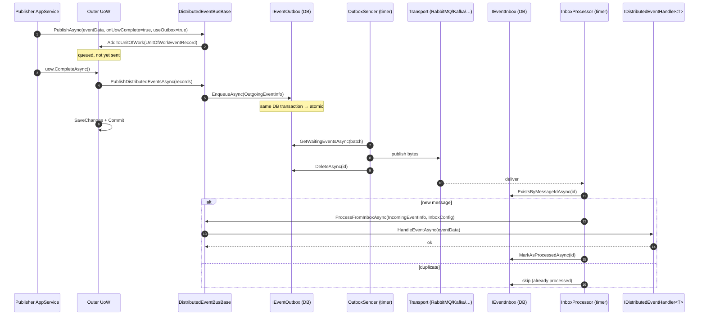

ABP's distributed event bus (`Volo.Abp.EventBus.Distributed`) is the integration-event channel between modules and microservices. This page traces a single event from `IDistributedEventBus.PublishAsync` — through the unit-of-work queue, the outbox sender, a transport (RabbitMQ / Kafka / Azure Service Bus / Redis / Dapr), the inbox dedup table, and finally `IDistributedEventHandler<T>.HandleEventAsync` on the consumer side.

All sources cited live in `framework/src/Volo.Abp.EventBus/Volo/Abp/EventBus/Distributed/` unless noted otherwise.

## End-to-end sequence



## 1. Contract: `IDistributedEventBus.PublishAsync`

Source: `framework/src/Volo.Abp.EventBus/Volo/Abp/EventBus/Distributed/DistributedEventBusBase.cs`.

```csharp
public Task PublishAsync<TEvent>(
    TEvent eventData,
    bool onUnitOfWorkComplete = true,
    bool useOutbox = true)
    where TEvent : class
{
    return PublishAsync(typeof(TEvent), eventData, onUnitOfWorkComplete, useOutbox);
}

public virtual async Task PublishAsync(
    Type eventType,
    object eventData,
    bool onUnitOfWorkComplete = true,
    bool useOutbox = true)
{
    if (onUnitOfWorkComplete && UnitOfWorkManager.Current != null)
    {
        AddToUnitOfWork(
            UnitOfWorkManager.Current,
            new UnitOfWorkEventRecord(eventType, eventData, EventOrderGenerator.GetNext(), useOutbox)
        );
        return;
    }

    if (useOutbox)
    {
        if (await AddToOutboxAsync(eventType, eventData))
        {
            return;
        }
    }

    await PublishToEventBusAsync(eventType, eventData);
    await TriggerDistributedEventSentAsync(...);
}
```

Three decision points:

<CardGroup cols={3}>
  <Card title="onUnitOfWorkComplete" icon="hourglass">
    If true (default) and a UoW is active, the event is queued on the UoW. It is only published if the UoW commits — guaranteeing exactly-the-domain-events-you-committed.
  </Card>
  <Card title="useOutbox" icon="box-archive">
    If true (default) and an outbox is configured, the event is written to the local outbox table inside the request transaction. The broker call happens asynchronously.
  </Card>
  <Card title="Both false" icon="bolt">
    Publish straight to the broker (fire-and-forget integration events from a console host).
  </Card>
</CardGroup>

## 2. UoW queueing

When a UoW is active and `onUnitOfWorkComplete = true`, the event becomes a `UnitOfWorkEventRecord` and is appended to the UoW's `DistributedEvents` list. The complete flow of the loop that drains those records is documented in [`flows/unit-of-work-lifecycle`](/flows/unit-of-work-lifecycle#5-completeasync-the-commit-sequence). The key invariant: events are sequenced with `EventOrderGenerator.GetNext()` so subsequent publishers can rely on FIFO ordering per UoW.

`UnitOfWorkEventPublisher.PublishDistributedEventsAsync` calls back into `DistributedEventBusBase`, but this time `UnitOfWorkManager.Current` is `null` (we're inside the commit path), so `AddToUnitOfWork` is skipped and the code falls through to outbox / direct publish.

## 3. Outbox

`AddToOutboxAsync` (in `DistributedEventBusBase`) iterates the configured `AbpEventBusBoxesOptions.Outboxes` and writes the serialized event into the matching `IEventOutbox` implementation (EF Core or MongoDB) **inside the same database transaction as the business changes**:

```csharp
protected virtual async Task<bool> AddToOutboxAsync(Type eventType, object eventData)
{
    var unitOfWork = UnitOfWorkManager.Current;
    if (unitOfWork == null) return false;

    var addedToOutbox = false;
    foreach (var outboxConfig in AbpDistributedEventBusOptions.Outboxes.Values)
    {
        if (outboxConfig.Selector?.Invoke(eventType) ?? true)
        {
            var eventOutbox = (IEventOutbox)unitOfWork.ServiceProvider.GetRequiredService(outboxConfig.ImplementationType);
            // serialise + EnqueueAsync(OutgoingEventInfo)
            addedToOutbox = true;
        }
    }
    return addedToOutbox;
}
```

That atomicity is the whole point of the outbox pattern: either the business write commits and the outbox row commits, or neither does. There is no window in which a domain change is durable but its event is lost.

<Note>
  The `Selector` predicate lets you route specific event types to specific outboxes (e.g. one outbox per bounded context). If no selector matches, the event falls through to direct publish.
</Note>

## 4. `OutboxSender` — async drain to transport

Source: `framework/src/Volo.Abp.EventBus/Volo/Abp/EventBus/Distributed/OutboxSender.cs`.

A periodic background worker holds a distributed lock for the outbox name and drains rows in batches:

```csharp
protected virtual async Task RunAsync()
{
    await using (var handle = await DistributedLock.TryAcquireAsync(DistributedLockName, cancellationToken: StoppingToken))
    {
        if (handle != null)
        {
            while (true)
            {
                var waitingEvents = await GetWaitingEventsAsync();
                if (waitingEvents.Count <= 0) break;

                Logger.LogInformation($"Found {waitingEvents.Count} events in the outbox.");

                if (EventBusBoxesOptions.BatchPublishOutboxEvents)
                    await PublishOutgoingMessagesInBatchAsync(waitingEvents);
                else
                    await PublishOutgoingMessagesAsync(waitingEvents);
            }
        }
        else
        {
            await Task.Delay(EventBusBoxesOptions.DistributedLockWaitDuration, StoppingToken);
        }
    }
}
```

Each waiting event is handed to the concrete distributed event bus (`IDistributedEventBus.AsSupportsEventBoxes().PublishFromOutboxAsync`), which knows how to talk to its transport:

- `Volo.Abp.EventBus.RabbitMq` — basic publish to the configured exchange.
- `Volo.Abp.EventBus.Kafka` — produce to the topic named via `EventNameAttribute`.
- `Volo.Abp.AzureServiceBus` — send to the queue or topic.
- `Volo.Abp.EventBus.Dapr` — POST to the Dapr sidecar.
- `Volo.Abp.EventBus.RedisStreams` — XADD into the stream.

After the broker acknowledges, `OutboxSender` deletes the row.

<Warning>
  The distributed lock is critical: every host instance of your service runs `OutboxSender` (it's a singleton hosted service), but only one node at a time may drain. `IAbpDistributedLock` ships with implementations on top of `Microsoft.Extensions.Caching.StackExchangeRedis`, MongoDB and the in-memory dev provider.
</Warning>

## 5. Transport hop

Each event carries:

- `MessageId` (Guid) — used by the inbox to dedup.
- `EventName` — resolved via `EventNameAttribute` (defaults to the event type's `FullName`).
- `EventData` — JSON-serialised payload.
- `Headers` — including `X-Correlation-Id` (see [`flows/http-request-pipeline`](/flows/http-request-pipeline#step-2-abpcorrelationidmiddleware)) and the tenant id.

The exact wire format is transport-specific but every adapter preserves these four fields.

## 6. Inbox — `InboxProcessor`

Source: `framework/src/Volo.Abp.EventBus/Volo/Abp/EventBus/Distributed/InboxProcessor.cs`.

A second periodic worker on the consumer side. Its job is identical in shape to the outbox sender — acquire a distributed lock, drain rows, mark processed — but its source is the local `IEventInbox` table that the transport adapter populated:

```csharp
while (true)
{
    var waitingEvents = await GetWaitingEventsAsync();
    if (waitingEvents.Count <= 0) break;

    Logger.LogInformation($"Found {waitingEvents.Count} events in the inbox.");

    foreach (var waitingEvent in waitingEvents)
    {
        try
        {
            using (var uow = UnitOfWorkManager.Begin(isTransactional: true, requiresNew: true))
            {
                await DistributedEventBus
                    .AsSupportsEventBoxes()
                    .ProcessFromInboxAsync(waitingEvent, InboxConfig);

                await Inbox.MarkAsProcessedAsync(waitingEvent.Id);

                await uow.CompleteAsync(StoppingToken);
            }
        }
        catch (Exception ex)
        {
            // failure policy: retry / dead-letter
        }
    }
}
```

Key invariants:

- A **fresh transactional UoW** wraps both the handler call and the `MarkAsProcessedAsync` write. The handler's database changes and the inbox dedup mark commit together — at-least-once delivery becomes effectively-once.
- `requiresNew: true` ensures the inbox UoW is independent of whatever ambient UoW the host worker might have opened.
- If the handler throws, the UoW disposes without commit → inbox row stays unprocessed → next poll retries. The retry budget is controlled by `InboxProcessorFailurePolicy.cs`.

## 7. `IDistributedEventHandler<T>.HandleEventAsync`

Inside `ProcessFromInboxAsync`, `DistributedEventBusBase` resolves all `IDistributedEventHandler<T>` implementations registered for the event type and invokes them through `IEventHandlerInvoker`. Each handler is a regular DI service — usually an `ITransientDependency`:

```csharp
public class OrderPlacedHandler : IDistributedEventHandler<OrderPlacedEto>, ITransientDependency
{
    private readonly IRepository<Shipment, Guid> _shipments;
    private readonly IGuidGenerator _guidGenerator;

    public async Task HandleEventAsync(OrderPlacedEto eventData)
    {
        await _shipments.InsertAsync(new Shipment(_guidGenerator.Create(), eventData.OrderId));
    }
}
```

Because the handler runs inside the inbox UoW, any further `IDistributedEventBus.PublishAsync` calls from the handler land back in step 2 — they queue on the inbox UoW and only ship to the broker once that UoW commits. This is what makes choreographed sagas tolerant to partial failures.

## 8. Configuration

The boxes are turned on through `AbpEventBusBoxesOptions` (`framework/src/Volo.Abp.EventBus/Volo/Abp/EventBus/Distributed/AbpEventBusBoxesOptions.cs`) and module-level configuration:

```csharp
Configure<AbpDistributedEventBusOptions>(options =>
{
    options.Outboxes.Configure(config =>
    {
        config.UseDbContext<MyAppDbContext>();
    });
    options.Inboxes.Configure(config =>
    {
        config.UseDbContext<MyAppDbContext>();
    });
});
```

`AbpEventBusBoxesOptions` controls polling cadence:

- `PeriodTimeSpan` — how often the sender / processor wakes up (default ~2s).
- `OutboxWaitingEventMaxCount` — batch size.
- `BatchPublishOutboxEvents` — true to call `PublishManyFromOutboxAsync`, false to send one at a time.
- `DistributedLockWaitDuration` — how long to wait before retry when another node holds the lock.
- `OutboxProcessorFilter`, `InboxProcessorFilter` — predicates to scope which rows this worker handles (multi-app scenarios).

## 9. Direct mode (no outbox)

Calling `PublishAsync(eventData, onUnitOfWorkComplete: false, useOutbox: false)` bypasses both queues and calls `PublishToEventBusAsync` immediately. Use only when:

- The publisher does not have a database write to coordinate (e.g. heartbeat events).
- You can tolerate event loss if the host crashes between domain commit and broker ack.

## Cross-references

<CardGroup cols={2}>
  <Card title="Distributed event bus overview" icon="tower-broadcast" href="/eventbus/distributed-event-bus">
    Concepts, supported transports, registration model.
  </Card>
  <Card title="Inbox / Outbox" icon="boxes-stacked" href="/eventbus/distributed-event-bus">
    Schema, retention, multi-database configuration.
  </Card>
  <Card title="Unit of Work" icon="database" href="/data/unit-of-work">
    Why publishing inside a UoW makes the outbox row atomic with business writes.
  </Card>
  <Card title="Local event bus" icon="bolt" href="/eventbus/local-event-bus">
    In-process variant — same wire shape, different scope.
  </Card>
</CardGroup>

## Related flows

- [Unit of work lifecycle](/flows/unit-of-work-lifecycle) — where `PublishDistributedEventsAsync` is called from.
- [HTTP request pipeline](/flows/http-request-pipeline) — the request that opens the UoW and emits the event.
- [Background job execution](/flows/background-job-execution) — another producer of distributed events outside the HTTP path.
- [Multi-tenancy resolution](/flows/multi-tenancy-resolution) — tenant id is preserved across the transport hop.

## FAQ

<Accordion title="What is the difference between the outbox sender and the inbox processor?">
  Both are periodic workers with the same shape (acquire distributed lock → batch fetch → process → mark/delete). The outbox lives on the **publisher** side and pushes to the broker. The inbox lives on the **consumer** side and feeds handlers. A single service running both ends has two timers running.
</Accordion>

<Accordion title="What if the transport adapter doesn't support batching?">
  `BatchPublishOutboxEvents = false` falls back to per-event publishing. The adapter contract (`PublishFromOutboxAsync`) is single-event; `PublishManyFromOutboxAsync` is optional.
</Accordion>

<Accordion title="How is exactly-once achieved?">
  Two pieces. Producer side: the outbox row commits with the domain write, so no event is lost when the broker is down. Consumer side: the inbox UoW commits the handler's writes together with `MarkAsProcessedAsync`, so a redelivery of the same `MessageId` is skipped. Together this is *effectively-once* — duplicates can still arrive but are absorbed.
</Accordion>

<Accordion title="Can I bypass the UoW queue for a single event?">
  Yes — pass `onUnitOfWorkComplete: false`. The event will be published (to outbox or directly) at the call site, without waiting for the UoW. You lose the atomic guarantee but gain immediacy. Don't use this for domain events.
</Accordion>
