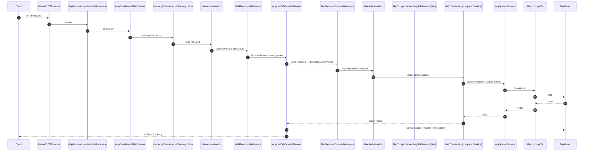

This page traces a single HTTP request through an ABP ASP.NET Core host — from the first line in `OnApplicationInitialization` all the way to a repository write and the unit-of-work commit. ABP layers a small stack of middleware on top of the standard ASP.NET Core pipeline (`Volo.Abp.AspNetCore`), then leans on `Volo.Abp.AspNetCore.Mvc` conventions to turn application services into REST controllers. Understanding the order of operations is essential when debugging culture, correlation, authentication, multi-tenancy, exception wrapping or transactional boundaries.

<Note>
  The exact line-by-line middleware order shown here is the order used by the official `app` solution template at `templates/app/aspnet-core/src/MyCompanyName.MyProjectName.HttpApi.Host/MyProjectNameHttpApiHostModule.cs`. Custom hosts can re-order or remove pieces, but the trade-offs documented below still apply.
</Note>

## Pipeline at a glance



The rest of this page walks the same flow at code level, citing the middleware sources and their job inside the request.

## The host module pipeline

In a default ABP host, the pipeline is wired up in `OnApplicationInitialization`. Below is the order copied from the `app` template (`templates/app/aspnet-core/src/MyCompanyName.MyProjectName.HttpApi.Host/MyProjectNameHttpApiHostModule.cs`):

```csharp
public override void OnApplicationInitialization(ApplicationInitializationContext context)
{
    var app = context.GetApplicationBuilder();
    var env = context.GetEnvironment();

    if (env.IsDevelopment())
    {
        app.UseDeveloperExceptionPage();
    }

    app.UseAbpRequestLocalization();   // 1. culture
    app.UseCorrelationId();            // 2. X-Correlation-Id
    app.MapAbpStaticAssets();          // 3. static files
    app.UseRouting();                  // 4. endpoint resolution
    app.UseCors();                     // 5. CORS
    app.UseAuthentication();           // 6. cookie / JWT / OIDC
    if (MultiTenancyConsts.IsEnabled)
    {
        app.UseMultiTenancy();         // 7. tenant resolution
    }
    app.UseUnitOfWork();               // 8. reserve UoW
    app.UseDynamicClaims();            // 9. merge dynamic claims
    app.UseAuthorization();            // 10. ASP.NET Core policy gate
    app.UseAuditing();                 // 11. audit log scope
    app.UseAbpSerilogEnrichers();
    app.UseConfiguredEndpoints();      // 12. dispatch to controller
}
```

<Warning>
  Re-ordering these calls breaks subtle invariants. Putting `UseUnitOfWork` before `UseAuthentication` means the UoW is reserved before `ICurrentUser` is populated, so audit logs and `CreatorId` will be blank. Putting `UseMultiTenancy` after `UseUnitOfWork` means EF Core opens the connection on the host tenant, then `ICurrentTenant.Change` runs too late to pick up the tenant connection string.
</Warning>

## Step 1 — `AbpRequestLocalizationMiddleware`

Source: `framework/src/Volo.Abp.AspNetCore/Microsoft/AspNetCore/RequestLocalization/AbpRequestLocalizationMiddleware.cs`.

Resolves `CultureInfo.CurrentCulture` and `CultureInfo.CurrentUICulture` from the cookie, query string and `Accept-Language` header through ASP.NET Core's `RequestLocalizationMiddleware`, but layers in ABP's `ISettingProvider` so the default language can come from `LocalizationSettingNames.DefaultLanguage`. Multi-tenancy can override the language further down — see [`flows/multi-tenancy-resolution`](/flows/multi-tenancy-resolution).

<Card title="Why first?" icon="globe">
  Culture must be set before any localized string is resolved — that includes error messages thrown by validation, authorization and the unit of work later in the pipeline.
</Card>

## Step 2 — `AbpCorrelationIdMiddleware`

Source: `framework/src/Volo.Abp.AspNetCore/Volo/Abp/AspNetCore/Tracing/AbpCorrelationIdMiddleware.cs`.

```csharp
public async override Task InvokeAsync(HttpContext context, RequestDelegate next)
{
    var correlationId = GetCorrelationIdFromRequest(context);
    using (_correlationIdProvider.Change(correlationId))
    {
        CheckAndSetCorrelationIdOnResponse(context, _options, correlationId);
        await next(context);
    }
}
```

- Reads `X-Correlation-Id` from the incoming request (header name configurable via `AbpCorrelationIdOptions`).
- Generates a new `Guid.NewGuid().ToString("N")` if the header is missing.
- Pushes the value into `ICorrelationIdProvider` (`AsyncLocal`) so Serilog, audit logs, the outbox publisher and `DistributedEventBusBase` can stamp it on every record.
- Sets the same header on the response via `context.Response.OnStarting`.

The correlation id flows into [`flows/distributed-event-publish-consume`](/flows/distributed-event-publish-consume) — outbox rows carry it forward across service boundaries.

## Step 3 — Static assets, routing, CORS

`MapAbpStaticAssets()` registers the bundled-asset endpoints (see `aspnetcore/mvc-ui-bundling.mdx`). `UseRouting()` then evaluates endpoints so that `HttpContext.GetEndpoint()` is non-null for the remaining middleware — `AbpUnitOfWorkMiddleware` uses this to skip Blazor component endpoints (see source below).

## Step 4 — `UseAuthentication`

Standard ASP.NET Core authentication. ABP plugs in handlers via `Volo.Abp.AspNetCore.Authentication.JwtBearer`, `Volo.Abp.AspNetCore.Authentication.OAuth`, `Volo.Abp.AspNetCore.Authentication.OpenIdConnect` or cookies. After this middleware, `HttpContext.User` is a `ClaimsPrincipal` and `ICurrentUser` reflects the caller. See [`flows/authentication-and-claims`](/flows/authentication-and-claims) for the claims pipeline.

## Step 5 — `MultiTenancyMiddleware`

Source: `framework/src/Volo.Abp.AspNetCore.MultiTenancy/Volo/Abp/AspNetCore/MultiTenancy/MultiTenancyMiddleware.cs`.

```csharp
public async override Task InvokeAsync(HttpContext context, RequestDelegate next)
{
    TenantConfiguration? tenant = null;
    try
    {
        tenant = await _tenantConfigurationProvider.GetAsync(saveResolveResult: true);
    }
    catch (Exception e)
    {
        Logger.LogException(e);
        if (await _options.MultiTenancyMiddlewareErrorPageBuilder(context, e)) return;
    }

    if (tenant?.Id != _currentTenant.Id)
    {
        using (_currentTenant.Change(tenant?.Id, tenant?.Name))
        {
            // … culture override for the resolved tenant
            await next(context);
        }
    }
    else
    {
        await next(context);
    }
}
```

The resolver chain (`QueryString` → `Route` → `Header` → `Cookie` → custom contributors) is documented in [`flows/multi-tenancy-resolution`](/flows/multi-tenancy-resolution). `ICurrentTenant.Change` is scoped — when the middleware unwinds the tenant scope is popped.

## Step 6 — `AbpUnitOfWorkMiddleware`

Source: `framework/src/Volo.Abp.AspNetCore/Volo/Abp/AspNetCore/Uow/AbpUnitOfWorkMiddleware.cs`.

```csharp
public async override Task InvokeAsync(HttpContext context, RequestDelegate next)
{
    if (await ShouldSkipAsync(context, next) || IsIgnoredUrl(context))
    {
        await next(context);
        return;
    }

    using (var uow = _unitOfWorkManager.Reserve(UnitOfWork.UnitOfWorkReservationName))
    {
        await next(context);
        await uow.CompleteAsync(_cancellationTokenProvider.Token);
    }
}
```

Two important details:

1. The UoW is **reserved**, not yet begun. The reservation name is the constant `UnitOfWork.UnitOfWorkReservationName = "_AbpActionUnitOfWork"`. The `UnitOfWorkInterceptor` on the application service will call `TryBeginReserved(...)` to claim it once the actual transactional decision (read vs. write, attribute overrides) is known.
2. Blazor component endpoints are skipped, because they render concurrently and would deadlock a shared `DbContext`. The check uses `context.GetEndpoint()?.Metadata?.GetMetadata<RootComponentMetadata>()`.

See [`flows/unit-of-work-lifecycle`](/flows/unit-of-work-lifecycle) for the full lifecycle once the interceptor begins the reserved UoW.

## Step 7 — `AbpDynamicClaimsMiddleware`

Source: `framework/src/Volo.Abp.AspNetCore/Volo/Abp/AspNetCore/Security/Claims/AbpDynamicClaimsMiddleware.cs`.

```csharp
if (context.User.Identity?.IsAuthenticated == true)
{
    if (context.RequestServices.GetRequiredService<IOptions<AbpClaimsPrincipalFactoryOptions>>().Value.IsDynamicClaimsEnabled)
    {
        var factory = context.RequestServices.GetRequiredService<IAbpClaimsPrincipalFactory>();
        var user = await factory.CreateDynamicAsync(context.User);
        authenticateResultFeature.AuthenticateResult = AuthenticateResult.Success(
            new AuthenticationTicket(user, authenticateResultFeature?.AuthenticateResult?.Properties, authenticationType));
    }
}
```

This is what lets a permission change made in the admin UI take effect for an already-issued JWT without a full re-login — see [`flows/authentication-and-claims`](/flows/authentication-and-claims).

## Step 8 — `UseAuthorization`

The ASP.NET Core authorization middleware now evaluates `[Authorize]` attributes on the matched endpoint. Policy-based permissions (`[Authorize(Policy = "MyPermission")]`) resolve through ABP's `PermissionRequirement` and `PermissionChecker`. The full flow is in [`flows/permission-check`](/flows/permission-check).

## Step 9 — `AbpExceptionHandlingMiddleware`

Source: `framework/src/Volo.Abp.AspNetCore/Volo/Abp/AspNetCore/ExceptionHandling/AbpExceptionHandlingMiddleware.cs`.

```csharp
public async override Task InvokeAsync(HttpContext context, RequestDelegate next)
{
    try
    {
        await next(context);
    }
    catch (Exception ex)
    {
        if (context.Response.HasStarted) { /* abort */ throw; }
        if (context.Items["_AbpActionInfo"] is AbpActionInfoInHttpContext actionInfo
            && actionInfo.IsObjectResult)
        {
            await HandleAndWrapException(context, ex);
            return;
        }
        throw;
    }
}
```

In ABP this middleware is paired with the MVC `AbpExceptionFilter` and `IAbpAuthorizationExceptionHandler`. The middleware version is the safety net for object-returning endpoints that escape the MVC filter pipeline (e.g. minimal APIs that opt in). It converts any `Exception` into a `RemoteServiceErrorResponse` JSON payload via `IExceptionToErrorInfoConverter`.

<Note>
  Exception handling is deliberately *inside* the unit of work scope, not around it. When the middleware catches an exception, the using-block on `AbpUnitOfWorkMiddleware` unwinds without calling `CompleteAsync` — the UoW is disposed without commit, triggering rollback. See [`flows/unit-of-work-lifecycle`](/flows/unit-of-work-lifecycle#exception-rollback).
</Note>

## Step 10 — MVC routing and conventions

The endpoint that `UseAuthorization` matched was produced by ABP's MVC conventions during startup. Sources:

- `framework/src/Volo.Abp.AspNetCore.Mvc/Volo/Abp/AspNetCore/Mvc/Conventions/AbpServiceConvention.cs` — applies the `IApplicationModelConvention` that promotes `IApplicationService` types to controllers, fixes up `ApiExplorer` settings, sets routes.
- `framework/src/Volo.Abp.AspNetCore.Mvc/Volo/Abp/AspNetCore/Mvc/Conventions/ConventionalRouteBuilder.cs` — builds `api/{moduleName}/{controller}/{action}` routes for app services.
- `framework/src/Volo.Abp.AspNetCore.Mvc/Volo/Abp/AspNetCore/Mvc/Conventions/AbpConventionalControllerFeatureProvider.cs` — registers the synthesized controllers with the MVC feature system.
- `framework/src/Volo.Abp.AspNetCore.Mvc/Volo/Abp/AspNetCore/Mvc/Conventions/AbpConventionalApiControllerSpecification.cs` — predicate that decides which types become controllers.

See `aspnetcore/mvc-controllers-and-conventions.mdx` for a deeper dive.

## Step 11 — Controller invocation

The MVC action method on the synthesized controller delegates to an injected `IApplicationService` instance. Because that instance is registered through `IConventionalRegistrar` with interceptors enabled, what is actually injected is a **Castle DynamicProxy** of the service. Every method call goes through the interceptor stack documented in [`flows/application-service-call`](/flows/application-service-call):

1. `AbpAsyncDeterminationInterceptor` — adapts sync/async
2. `AuditingInterceptor`
3. `FeatureInterceptor`
4. `GlobalFeatureInterceptor`
5. `AuthorizationInterceptor`
6. `ValidationInterceptor`
7. `UnitOfWorkInterceptor` (innermost — begins the reserved UoW)

## Step 12 — `UnitOfWorkInterceptor` takes ownership

Source: `framework/src/Volo.Abp.Uow/Volo/Abp/Uow/UnitOfWorkInterceptor.cs`. The interceptor finds the reserved UoW the middleware created and begins it with options derived from the `[UnitOfWork]` attribute (or the default `isTransactional = !method.Name.StartsWith("Get")` heuristic):

```csharp
if (unitOfWorkManager.TryBeginReserved(UnitOfWork.UnitOfWorkReservationName, options))
{
    await invocation.ProceedAsync();
    if (unitOfWorkManager.Current != null)
    {
        await unitOfWorkManager.Current.SaveChangesAsync();
    }
    return;
}
```

## Step 13 — Application service → repository → DB

Inside the service method:

```csharp
public async Task<BookDto> CreateAsync(CreateBookDto input)
{
    var book = new Book(GuidGenerator.Create(), input.Name, input.Price);
    await _bookRepository.InsertAsync(book);   // EF Core change tracker
    return ObjectMapper.Map<Book, BookDto>(book);
}
```

`IRepository<Book, Guid>` is a `Volo.Abp.Domain.Repositories.IRepository` implementation. With EF Core it resolves through `EfCoreRepository<TDbContext, TEntity>` (see `data/entityframeworkcore`), which uses the same `DbContext` instance held in the active `IDatabaseApi` of the current UoW.

The `DbContext` connection string is resolved through `MultiTenantConnectionStringResolver` (see `framework/src/Volo.Abp.MultiTenancy/Volo/Abp/MultiTenancy/MultiTenantConnectionStringResolver.cs`) — that's why `UseMultiTenancy` has to run before the UoW middleware: the resolver reads `ICurrentTenant.Id` to pick the right tenant database.

## Step 14 — UoW commit

When the application service method returns, control unwinds back through the interceptor stack. The `UnitOfWorkInterceptor` falls out of its `try` block, the action result is written by MVC, and finally `AbpUnitOfWorkMiddleware` calls `uow.CompleteAsync(...)`. That triggers:

1. `SaveChangesAsync` on every active `IDatabaseApi` (EF Core flushes the change tracker).
2. Local and distributed event publishing loop (`UnitOfWorkEventPublisher`) — see [`flows/distributed-event-publish-consume`](/flows/distributed-event-publish-consume).
3. Transaction commit on every active `ITransactionApi`.
4. `OnCompleted` handlers — used by the outbox, the audit log persistence and any user-supplied callback.

If anything throws, the UoW is disposed without commit and `Failed`/`Disposed` events fire — see [`flows/unit-of-work-lifecycle#exception-rollback`](/flows/unit-of-work-lifecycle).

## Putting it together: a `POST /api/app/book` request

<Steps>
  <Step title="Kestrel accepts the connection">
    The HTTP server hands an `HttpContext` to the middleware pipeline.
  </Step>
  <Step title="Localization & correlation">
    `AbpRequestLocalizationMiddleware` sets the culture; `AbpCorrelationIdMiddleware` ensures `X-Correlation-Id` is present.
  </Step>
  <Step title="Routing & auth">
    `UseRouting` matches the `BookAppService.CreateAsync` endpoint; `UseAuthentication` validates the bearer token and populates `HttpContext.User`.
  </Step>
  <Step title="Tenant & UoW reservation">
    `MultiTenancyMiddleware` resolves the tenant; `AbpUnitOfWorkMiddleware` reserves `_AbpActionUnitOfWork`.
  </Step>
  <Step title="Dynamic claims & authorization">
    `AbpDynamicClaimsMiddleware` merges fresh permission/role claims; `UseAuthorization` checks the `[Authorize(Policy = BookStorePermissions.Books.Create)]` requirement using `PermissionChecker`.
  </Step>
  <Step title="Controller → AppService proxy">
    The action method calls the proxied `IBookAppService.CreateAsync`, which walks the interceptor stack and ends in `UnitOfWorkInterceptor.TryBeginReserved`.
  </Step>
  <Step title="Domain work">
    `BookAppService.CreateAsync` creates the entity, inserts via `IRepository`, EF Core stages the SQL inside the open transaction.
  </Step>
  <Step title="Commit">
    Middleware unwinds; `uow.CompleteAsync` runs `SaveChangesAsync`, fires `OnCompleted` handlers (outbox row written), commits the transaction. ASP.NET Core serializes the DTO and flushes the response.
  </Step>
</Steps>

## Related subsystems

<CardGroup cols={2}>
  <Card title="ASP.NET Core middleware" icon="layer-group" href="/aspnetcore/host-module">
    Full reference of every middleware ABP ships, including non-default ones like `AbpSecurityHeadersMiddleware` and `AbpTimeZoneMiddleware`.
  </Card>
  <Card title="Application Services" icon="cube" href="/ddd/application">
    The DDD building block that hosts the methods invoked at the end of the pipeline.
  </Card>
  <Card title="Unit of Work" icon="database" href="/data/unit-of-work">
    Programming model — `[UnitOfWork]` attribute, manual `Begin`/`Complete`, `IUnitOfWorkManager`.
  </Card>
  <Card title="Tenant resolution" icon="building" href="/flows/multi-tenancy-resolution">
    Contributor chain reference for `MultiTenancyMiddleware`.
  </Card>
</CardGroup>

## Related flows

- [Application service call](/flows/application-service-call) — Castle interceptor stack invoked by the controller.
- [Unit of work lifecycle](/flows/unit-of-work-lifecycle) — what `uow.CompleteAsync` actually does.
- [Authentication & claims](/flows/authentication-and-claims) — how `HttpContext.User` is built.
- [Multi-tenancy resolution](/flows/multi-tenancy-resolution) — the contributor chain that resolves the tenant in step 5.
- [Permission check](/flows/permission-check) — how `UseAuthorization` evaluates ABP permissions.

## Common questions

<Accordion title="Why is UseAuditing called after UseAuthorization?">
  Because the audit log scope should record `CurrentUser.Id` and authorization failures — both require an authenticated principal and an evaluated authorization decision. The `AbpAuditingMiddleware` opens a scope that the `AuditingInterceptor` later writes into.
</Accordion>

<Accordion title="What if I forget to call UseUnitOfWork?">
  The reservation never gets created, so when `UnitOfWorkInterceptor.TryBeginReserved` runs it falls through and opens a *new* UoW around just the application service call. Reads still work, but events declared with `onUnitOfWorkComplete: true` will be published synchronously without participating in the request transaction, and you lose request-level transactional consistency across multiple aggregate writes.
</Accordion>

<Accordion title="Where do filters fit?">
  MVC action filters (`AbpExceptionFilter`, `AbpAuditActionFilter`, `AbpValidationActionFilter`, `AbpUowActionFilter`) execute inside `UseAuthorization` → controller dispatch. They are complementary to the middleware in this page — the middleware draws the request scope, the filters draw the *action* scope.
</Accordion>
