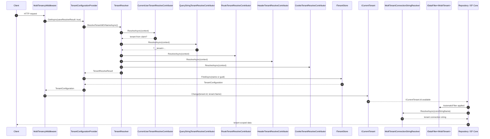
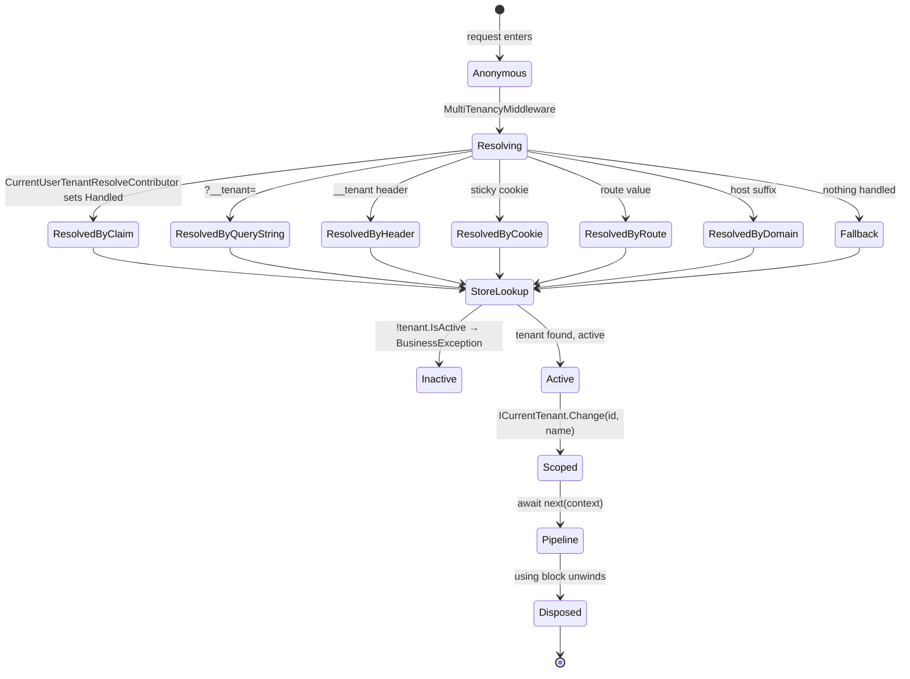

This page walks the ABP multi-tenancy pipeline for a single HTTP request, from the moment `UseMultiTenancy()` is hit in the ASP.NET Core middleware list to the data layer's automatic filtering of cross-tenant rows. ABP's multi-tenancy is built around three small abstractions — `ITenantResolveContributor`, `ITenantResolver`, and `ITenantStore` — sitting under `framework/src/Volo.Abp.MultiTenancy/Volo/Abp/MultiTenancy/` and their ASP.NET Core hooks under `framework/src/Volo.Abp.AspNetCore.MultiTenancy/Volo/Abp/AspNetCore/MultiTenancy/`. Together they decide the value of `ICurrentTenant.Id`, which then drives the `IDataFilter<IMultiTenant>` for queries and `MultiTenantConnectionStringResolver` for tenant-specific databases.

<Note>
  Tenant resolution is **opt-in** at the middleware level — if `UseMultiTenancy()` is never called, the host always runs as the host-side tenant (null id). The `app` template guards the call with `MultiTenancyConsts.IsEnabled`. See `/aspnetcore/multi-tenancy-middleware` for placement.
</Note>

## Pipeline at a glance



The remainder of the page walks each step at code level, citing the file paths.

## 1. The middleware entry point

The HTTP entry point is `MultiTenancyMiddleware` at `framework/src/Volo.Abp.AspNetCore.MultiTenancy/Volo/Abp/AspNetCore/MultiTenancy/MultiTenancyMiddleware.cs`. It is wired into the pipeline by `UseMultiTenancy()` (extension in `framework/src/Volo.Abp.AspNetCore.MultiTenancy/Microsoft/AspNetCore/Builder/`) and should run **after** `UseAuthentication()` so that `CurrentUserTenantResolveContributor` can read claims:

```csharp
public class MultiTenancyMiddleware : AbpMiddlewareBase, ITransientDependency
{
    private readonly ITenantConfigurationProvider _tenantConfigurationProvider;
    private readonly ICurrentTenant _currentTenant;
    private readonly AbpAspNetCoreMultiTenancyOptions _options;
    private readonly ITenantResolveResultAccessor _tenantResolveResultAccessor;

    public async override Task InvokeAsync(HttpContext context, RequestDelegate next)
    {
        TenantConfiguration? tenant = null;
        try
        {
            tenant = await _tenantConfigurationProvider.GetAsync(saveResolveResult: true);
        }
        catch (Exception e)
        {
            Logger.LogException(e);

            if (await _options.MultiTenancyMiddlewareErrorPageBuilder(context, e))
            {
                return;
            }
        }

        if (tenant?.Id != _currentTenant.Id)
        {
            using (_currentTenant.Change(tenant?.Id, tenant?.Name))
            {
                if (_tenantResolveResultAccessor.Result != null &&
                    _tenantResolveResultAccessor.Result.AppliedResolvers.Contains(
                        QueryStringTenantResolveContributor.ContributorName))
                {
                    AbpMultiTenancyCookieHelper.SetTenantCookie(context, _currentTenant.Id, _options.TenantKey);
                }

                // ... culture handling ...

                await next(context);
            }
        }
        else
        {
            await next(context);
        }
    }
}
```

Three things happen here:

<Steps>
  <Step title="Resolve">
    `ITenantConfigurationProvider.GetAsync(saveResolveResult: true)` runs the resolver chain and looks the tenant up by id/name. The flag stores `TenantResolveResult` in an accessor for later middleware (and the `[__tenant]` query → cookie sticky behaviour below).
  </Step>
  <Step title="Change scope">
    `ICurrentTenant.Change(tenant?.Id, tenant?.Name)` opens an `AsyncLocal` scope (see [Authentication & Claims Flow](/flows/authentication-and-claims) for the analogous principal accessor pattern). The using block guarantees the scope unwinds even if downstream middleware throws.
  </Step>
  <Step title="Sticky cookie">
    If the tenant came from `?__tenant=...`, the middleware drops an `__tenant` cookie via `AbpMultiTenancyCookieHelper` (at `framework/src/Volo.Abp.AspNetCore.MultiTenancy/Volo/Abp/AspNetCore/MultiTenancy/AbpMultiTenancyCookieHelper.cs`) so subsequent navigations keep the same tenant without the explicit query string.
  </Step>
</Steps>

The `MultiTenancyMiddlewareErrorPageBuilder` lets you intercept resolution failures (invalid tenant, inactive tenant). The default builder renders the Razor view under `framework/src/Volo.Abp.AspNetCore.MultiTenancy/Volo/Abp/AspNetCore/MultiTenancy/Views/`.

## 2. ITenantConfigurationProvider

The provider couples resolution with lookup. It lives at `framework/src/Volo.Abp.MultiTenancy/Volo/Abp/MultiTenancy/TenantConfigurationProvider.cs`:

```csharp
public class TenantConfigurationProvider : ITenantConfigurationProvider, ITransientDependency
{
    protected virtual ITenantResolver TenantResolver { get; }
    protected virtual ITenantStore TenantStore { get; }
    protected virtual ITenantNormalizer TenantNormalizer { get; }
    protected virtual ITenantResolveResultAccessor TenantResolveResultAccessor { get; }
    protected virtual IStringLocalizer<AbpMultiTenancyResource> StringLocalizer { get; }

    public virtual async Task<TenantConfiguration?> GetAsync(bool saveResolveResult = false)
    {
        var resolveResult = await TenantResolver.ResolveTenantIdOrNameAsync();

        if (saveResolveResult)
        {
            TenantResolveResultAccessor.Result = resolveResult;
        }

        TenantConfiguration? tenant = null;
        if (resolveResult.TenantIdOrName != null)
        {
            tenant = await FindTenantAsync(resolveResult.TenantIdOrName);

            if (tenant == null)
            {
                throw new BusinessException(
                    code: "Volo.AbpIo.MultiTenancy:010001",
                    message: StringLocalizer["TenantNotFoundMessage"],
                    details: StringLocalizer["TenantNotFoundDetails", resolveResult.TenantIdOrName]);
            }

            if (!tenant.IsActive)
            {
                throw new BusinessException(
                    code: "Volo.AbpIo.MultiTenancy:010002",
                    message: StringLocalizer["TenantNotActiveMessage"],
                    details: StringLocalizer["TenantNotActiveDetails", resolveResult.TenantIdOrName]);
            }
        }

        return tenant;
    }

    protected virtual async Task<TenantConfiguration?> FindTenantAsync(string tenantIdOrName)
    {
        if (Guid.TryParse(tenantIdOrName, out var parsedTenantId))
        {
            return await TenantStore.FindAsync(parsedTenantId);
        }
        else
        {
            return await TenantStore.FindAsync(TenantNormalizer.NormalizeName(tenantIdOrName)!);
        }
    }
}
```

The provider hands the *string* coming out of the resolver chain to `ITenantStore`, deciding whether it's a `Guid` (id) or a name. Inactive tenants are rejected with a `BusinessException` whose code lets the host map it to a friendly 4xx response — see `/tenancy/multi-tenancy-aspnetcore` for the response shape.

## 3. The resolver chain

The resolver itself is `TenantResolver` at `framework/src/Volo.Abp.MultiTenancy/Volo/Abp/MultiTenancy/TenantResolver.cs`:

```csharp
public class TenantResolver : ITenantResolver, ITransientDependency
{
    private readonly IServiceProvider _serviceProvider;
    private readonly AbpTenantResolveOptions _options;

    public virtual async Task<TenantResolveResult> ResolveTenantIdOrNameAsync()
    {
        var result = new TenantResolveResult();

        using (var serviceScope = _serviceProvider.CreateScope())
        {
            var context = new TenantResolveContext(serviceScope.ServiceProvider);

            foreach (var tenantResolver in _options.TenantResolvers)
            {
                await tenantResolver.ResolveAsync(context);

                result.AppliedResolvers.Add(tenantResolver.Name);

                if (context.HasResolvedTenantOrHost())
                {
                    result.TenantIdOrName = context.TenantIdOrName;
                    break;
                }
            }
        }

        if (result.TenantIdOrName.IsNullOrEmpty() && !string.IsNullOrWhiteSpace(_options.FallbackTenant))
        {
            result.TenantIdOrName = _options.FallbackTenant;
            result.AppliedResolvers.Add(TenantResolverNames.FallbackTenant);
        }

        return result;
    }
}
```

Two key invariants:

- **Order matters.** Contributors run in the order registered in `AbpTenantResolveOptions.TenantResolvers` (defined at `framework/src/Volo.Abp.MultiTenancy.Abstractions/Volo/Abp/MultiTenancy/AbpTenantResolveOptions.cs`). The first contributor that calls `context.Handled = true` or sets `context.TenantIdOrName` wins.
- **Fallback.** If nothing handled the request, `AbpTenantResolveOptions.FallbackTenant` is used. Setting it to a tenant name is how you make a host run as a single named tenant by default.

### Contributor interface

The contributor abstraction is small. The base class `TenantResolveContributorBase` at `framework/src/Volo.Abp.MultiTenancy/Volo/Abp/MultiTenancy/TenantResolveContributorBase.cs` requires only a `Name` and a `ResolveAsync` that mutates the `ITenantResolveContext`. The HTTP-specific base `HttpTenantResolveContributorBase` (at `framework/src/Volo.Abp.AspNetCore.MultiTenancy/Volo/Abp/AspNetCore/MultiTenancy/HttpTenantResolveContributorBase.cs`) layers in `HttpContext` access.

### Default ordering

`AbpMultiTenancyModule.ConfigureServices` (at `framework/src/Volo.Abp.MultiTenancy/Volo/Abp/MultiTenancy/AbpMultiTenancyModule.cs`) inserts `CurrentUserTenantResolveContributor` at index 0:

```csharp
Configure<AbpTenantResolveOptions>(options =>
{
    options.TenantResolvers.Insert(0, new CurrentUserTenantResolveContributor());
});
```

Then `AbpAspNetCoreMultiTenancyModule` (at `framework/src/Volo.Abp.AspNetCore.MultiTenancy/Volo/Abp/AspNetCore/MultiTenancy/AbpAspNetCoreMultiTenancyModule.cs`) appends the four HTTP contributors:

```csharp
Configure<AbpTenantResolveOptions>(options =>
{
    options.TenantResolvers.Add(new QueryStringTenantResolveContributor());
    options.TenantResolvers.Add(new RouteTenantResolveContributor());
    options.TenantResolvers.Add(new HeaderTenantResolveContributor());
    options.TenantResolvers.Add(new CookieTenantResolveContributor());
});
```

So the resolution order in an ASP.NET Core host is:

| # | Contributor | Source | Wins when |
|---|---|---|---|
| 1 | `CurrentUserTenantResolveContributor` | `AbpClaimTypes.TenantId` on `ICurrentUser` | User is authenticated and the JWT/cookie carries `tenantid` |
| 2 | `QueryStringTenantResolveContributor` | `?__tenant=foo` | Query string `?__tenant=` is present (drops a cookie afterwards) |
| 3 | `RouteTenantResolveContributor` | `httpContext.GetRouteValue(TenantKey)` | Routing template includes `{__tenant}` |
| 4 | `HeaderTenantResolveContributor` | HTTP header `__tenant: foo` | API client sends the header |
| 5 | `CookieTenantResolveContributor` | `Request.Cookies[TenantKey]` | Previous query string set the sticky cookie |
| — | `DomainTenantResolveContributor` | `{0}.mycorp.com` host name | Only when registered manually via `AddDomainTenantResolver(...)` |

<Note>
  `DomainTenantResolveContributor` is **not** in the default list — you have to plug it in explicitly (typically by replacing `Add` with `Insert` to put it ahead of the cookie). The constructor accepts a `domainFormat` like `"{0}.mycorp.com"`. See its source at `framework/src/Volo.Abp.AspNetCore.MultiTenancy/Volo/Abp/AspNetCore/MultiTenancy/DomainTenantResolveContributor.cs`.
</Note>

### Contributor sources

<Tabs>
  <Tab title="QueryString">
    From `framework/src/Volo.Abp.AspNetCore.MultiTenancy/Volo/Abp/AspNetCore/MultiTenancy/QueryStringTenantResolveContributor.cs`:

    ```csharp
    public class QueryStringTenantResolveContributor : HttpTenantResolveContributorBase
    {
        public const string ContributorName = "QueryString";
        public override string Name => ContributorName;

        protected override Task<string?> GetTenantIdOrNameFromHttpContextOrNullAsync(
            ITenantResolveContext context, HttpContext httpContext)
        {
            if (httpContext.Request.QueryString.HasValue)
            {
                var tenantKey = context.GetAbpAspNetCoreMultiTenancyOptions().TenantKey;
                if (httpContext.Request.Query.ContainsKey(tenantKey))
                {
                    var tenantValue = httpContext.Request.Query[tenantKey].ToString();
                    if (tenantValue.IsNullOrWhiteSpace())
                    {
                        context.Handled = true;
                        return Task.FromResult<string?>(null);
                    }
                    return Task.FromResult(tenantValue)!;
                }
            }
            return Task.FromResult<string?>(null);
        }
    }
    ```

    An *empty* `__tenant` value sets `Handled = true` with no id — this is the "explicit host" override switch.
  </Tab>
  <Tab title="Header">
    From `framework/src/Volo.Abp.AspNetCore.MultiTenancy/Volo/Abp/AspNetCore/MultiTenancy/HeaderTenantResolveContributor.cs`:

    ```csharp
    public class HeaderTenantResolveContributor : HttpTenantResolveContributorBase
    {
        public const string ContributorName = "Header";
        public override string Name => ContributorName;

        protected override Task<string?> GetTenantIdOrNameFromHttpContextOrNullAsync(
            ITenantResolveContext context, HttpContext httpContext)
        {
            if (httpContext.Request.Headers.IsNullOrEmpty())
                return Task.FromResult((string?)null);

            var tenantIdKey = context.GetAbpAspNetCoreMultiTenancyOptions().TenantKey;
            var tenantIdHeader = httpContext.Request.Headers[tenantIdKey];
            if (tenantIdHeader == string.Empty || tenantIdHeader.Count < 1)
                return Task.FromResult((string?)null);

            if (tenantIdHeader.Count > 1)
            {
                Log(context, $"HTTP request includes more than one {tenantIdKey} header value...");
            }

            return Task.FromResult(tenantIdHeader.First());
        }
    }
    ```

    Multiple `__tenant` header values are tolerated — only the first is used, with a warning logged.
  </Tab>
  <Tab title="Cookie">
    From `framework/src/Volo.Abp.AspNetCore.MultiTenancy/Volo/Abp/AspNetCore/MultiTenancy/CookieTenantResolveContributor.cs`:

    ```csharp
    public class CookieTenantResolveContributor : HttpTenantResolveContributorBase
    {
        public const string ContributorName = "Cookie";
        public override string Name => ContributorName;

        protected override Task<string?> GetTenantIdOrNameFromHttpContextOrNullAsync(
            ITenantResolveContext context, HttpContext httpContext)
        {
            return Task.FromResult(
                httpContext.Request.Cookies[context.GetAbpAspNetCoreMultiTenancyOptions().TenantKey]);
        }
    }
    ```

    The cookie is set by `MultiTenancyMiddleware` after a successful `?__tenant=` resolution, making the tenant sticky for the rest of the browser session.
  </Tab>
  <Tab title="Route">
    From `framework/src/Volo.Abp.AspNetCore.MultiTenancy/Volo/Abp/AspNetCore/MultiTenancy/RouteTenantResolveContributor.cs`:

    ```csharp
    public class RouteTenantResolveContributor : HttpTenantResolveContributorBase
    {
        public const string ContributorName = "Route";
        public override string Name => ContributorName;

        protected override Task<string?> GetTenantIdOrNameFromHttpContextOrNullAsync(
            ITenantResolveContext context, HttpContext httpContext)
        {
            var tenantId = httpContext.GetRouteValue(context.GetAbpAspNetCoreMultiTenancyOptions().TenantKey);
            return Task.FromResult(tenantId != null ? Convert.ToString(tenantId) : null);
        }
    }
    ```
  </Tab>
  <Tab title="Domain">
    From `framework/src/Volo.Abp.AspNetCore.MultiTenancy/Volo/Abp/AspNetCore/MultiTenancy/DomainTenantResolveContributor.cs`:

    ```csharp
    public class DomainTenantResolveContributor : HttpTenantResolveContributorBase
    {
        public const string ContributorName = "Domain";
        public override string Name => ContributorName;

        private static readonly string[] ProtocolPrefixes = { "http://", "https://" };
        private readonly string _domainFormat;

        public DomainTenantResolveContributor(string domainFormat)
        {
            _domainFormat = domainFormat.RemovePreFix(ProtocolPrefixes);
        }

        protected override Task<string?> GetTenantIdOrNameFromHttpContextOrNullAsync(
            ITenantResolveContext context, HttpContext httpContext)
        {
            if (!httpContext.Request.Host.HasValue)
                return Task.FromResult<string?>(null);

            var hostName = httpContext.Request.Host.Value.RemovePreFix(ProtocolPrefixes);
            var extractResult = FormattedStringValueExtracter.Extract(hostName, _domainFormat, ignoreCase: true);

            context.Handled = true;
            return Task.FromResult(extractResult.IsMatch ? extractResult.Matches[0].Value : null);
        }
    }
    ```

    Notice `context.Handled = true` is set even on a non-match — this prevents subsequent contributors from running when domain mode is configured, forcing host requests through a known "host domain" rather than falling back to header/cookie.
  </Tab>
  <Tab title="CurrentUser">
    From `framework/src/Volo.Abp.MultiTenancy/Volo/Abp/MultiTenancy/CurrentUserTenantResolveContributor.cs`:

    ```csharp
    public class CurrentUserTenantResolveContributor : TenantResolveContributorBase
    {
        public const string ContributorName = "CurrentUser";
        public override string Name => ContributorName;

        public override Task ResolveAsync(ITenantResolveContext context)
        {
            var currentUser = context.ServiceProvider.GetRequiredService<ICurrentUser>();
            if (currentUser.IsAuthenticated)
            {
                context.Handled = true;
                context.TenantIdOrName = currentUser.TenantId?.ToString();
            }
            return Task.CompletedTask;
        }
    }
    ```

    The authenticated user's claim is the highest-priority signal — once a user has signed in, no header/cookie can override their tenant.
  </Tab>
</Tabs>

<Warning>
  Because `CurrentUserTenantResolveContributor` runs first and sets `Handled = true` for any authenticated user, an `__tenant` header **cannot** override the tenant of a logged-in user. This is by design — clients must sign in as the impersonating tenant rather than spoofing one mid-session.
</Warning>

## 4. ITenantStore

The resolved string ID or name is looked up via `ITenantStore` (interface at `framework/src/Volo.Abp.MultiTenancy.Abstractions/Volo/Abp/MultiTenancy/ITenantStore.cs`):

```csharp
public interface ITenantStore
{
    Task<TenantConfiguration?> FindAsync(string normalizedName);
    Task<TenantConfiguration?> FindAsync(Guid id);
    Task<IReadOnlyList<TenantConfiguration>> GetListAsync(bool includeDetails = false);
}
```

Two implementations ship out of the box:

- **`DefaultTenantStore`** at `framework/src/Volo.Abp.MultiTenancy/Volo/Abp/MultiTenancy/ConfigurationStore/DefaultTenantStore.cs`. Reads a static list from `AbpDefaultTenantStoreOptions`, which is populated from `IConfiguration` — perfect for tests or small fixed-tenant deployments.
- **`TenantStore`** from the Tenant Management module (`modules/tenant-management/src/Volo.Abp.TenantManagement.Domain/Volo/Abp/TenantManagement/TenantStore.cs`). Uses `ITenantRepository`, EF Core, and a distributed cache so resolution stays fast even with thousands of tenants. See `/tenancy/tenant-management-module`.

`TenantConfiguration` (at `framework/src/Volo.Abp.MultiTenancy.Abstractions/Volo/Abp/MultiTenancy/TenantConfiguration.cs`) carries the four values consumed by the rest of the stack:

```csharp
[Serializable]
public class TenantConfiguration
{
    public Guid Id { get; set; }
    public string Name { get; set; } = default!;
    public string NormalizedName { get; set; } = default!;
    public ConnectionStrings? ConnectionStrings { get; set; }
    public bool IsActive { get; set; }
    public Guid? EditionId { get; set; }
}
```

`ConnectionStrings` is what feeds `MultiTenantConnectionStringResolver` in step 6; `IsActive` is the inactive-tenant check that throws the BusinessException; `EditionId` is consumed by the Feature Management module to pick a feature set.

## 5. ICurrentTenant and the Change scope

Once the middleware has a `TenantConfiguration`, it opens a scope via `ICurrentTenant.Change` (implementation at `framework/src/Volo.Abp.MultiTenancy/Volo/Abp/MultiTenancy/CurrentTenant.cs`):

```csharp
public class CurrentTenant : ICurrentTenant, ITransientDependency
{
    public virtual bool IsAvailable => Id.HasValue;
    public virtual Guid? Id => _currentTenantAccessor.Current?.TenantId;
    public string? Name => _currentTenantAccessor.Current?.Name;

    private readonly ICurrentTenantAccessor _currentTenantAccessor;

    public IDisposable Change(Guid? id, string? name = null)
    {
        return SetCurrent(id, name);
    }

    private IDisposable SetCurrent(Guid? tenantId, string? name = null)
    {
        var parentScope = _currentTenantAccessor.Current;
        _currentTenantAccessor.Current = new BasicTenantInfo(tenantId, name);

        return new DisposeAction<ValueTuple<ICurrentTenantAccessor, BasicTenantInfo?>>(static (state) =>
        {
            var (currentTenantAccessor, parentScope) = state;
            currentTenantAccessor.Current = parentScope;
        }, (_currentTenantAccessor, parentScope));
    }
}
```

The accessor is `AsyncLocalCurrentTenantAccessor` (at `framework/src/Volo.Abp.MultiTenancy/Volo/Abp/MultiTenancy/AsyncLocalCurrentTenantAccessor.cs`), registered as a singleton in `AbpMultiTenancyModule.ConfigureServices`. Two important properties:

<Steps>
  <Step title="Nestable">
    `Change` saves the previous value and restores it on dispose, so application code can temporarily run as another tenant (or as host) with `using (CurrentTenant.Change(null)) { ... }`.
  </Step>
  <Step title="AsyncLocal-bound">
    The scope follows the logical async call chain, so a `Task.Run` *inside* the `using` block still observes the new tenant id without an explicit propagation.
  </Step>
</Steps>

See `/tenancy/multi-tenancy-core` for the wider API surface of `ICurrentTenant`.

## 6. The connection string resolver

The next user of `ICurrentTenant` is the connection-string resolver. `MultiTenantConnectionStringResolver` (at `framework/src/Volo.Abp.MultiTenancy/Volo/Abp/MultiTenancy/MultiTenantConnectionStringResolver.cs`) decorates the default `DefaultConnectionStringResolver` and asks the tenant store for a tenant-specific connection string:

```csharp
[Dependency(ReplaceServices = true)]
public class MultiTenantConnectionStringResolver : DefaultConnectionStringResolver
{
    private readonly ICurrentTenant _currentTenant;
    private readonly IServiceProvider _serviceProvider;

    public override async Task<string> ResolveAsync(string? connectionStringName = null)
    {
        if (_currentTenant.Id == null)
        {
            // No current tenant, fallback to default logic
            return await base.ResolveAsync(connectionStringName);
        }

        var tenant = await FindTenantConfigurationAsync(_currentTenant.Id.Value);

        if (tenant == null || tenant.ConnectionStrings.IsNullOrEmpty())
        {
            return await base.ResolveAsync(connectionStringName);
        }

        var tenantDefaultConnectionString = tenant.ConnectionStrings?.Default;

        if (connectionStringName == null ||
            connectionStringName == ConnectionStrings.DefaultConnectionStringName)
        {
            return !tenantDefaultConnectionString.IsNullOrWhiteSpace()
                ? tenantDefaultConnectionString!
                : Options.ConnectionStrings.Default!;
        }
        // ... look up named connection string ...
    }
}
```

The `[Dependency(ReplaceServices = true)]` attribute makes ABP register this in place of the host's `DefaultConnectionStringResolver` whenever `AbpMultiTenancyModule` is referenced. Every `DbContext` factory and Mongo client built via ABP's data layer goes through `IConnectionStringResolver`, so multi-database tenancy is transparent. The exact extension points are documented at `/tenancy/multi-tenancy-core`.

## 7. The data filter

Finally, queries against `IMultiTenant` entities get automatic filtering through `IDataFilter<IMultiTenant>` (interface at `framework/src/Volo.Abp.Data/Volo/Abp/Data/IDataFilter.cs`):

```csharp
public interface IDataFilter<TFilter> where TFilter : class
{
    IDisposable Enable();
    IDisposable Disable();
    bool IsEnabled { get; }
}
```

EF Core wires this up via the `AbpDbContext` global query filter. The filter expression checks `IDataFilter<IMultiTenant>.IsEnabled` and `ICurrentTenant.Id`, so as long as the data filter is *enabled* (the default), queries are restricted to rows whose `TenantId` matches `ICurrentTenant.Id`. The same logic appears for Mongo via `AbpMongoDbContext`. The implementation details, including how to escape the filter for cross-tenant admin operations, live at `/tenancy/data-filtering`.

<Card title="Cross-tenant operations" icon="layer-group" href="/tenancy/data-filtering">
  When you must read or write across tenants (background jobs, host admin tools), wrap the section in `using (_dataFilter.Disable<IMultiTenant>()) { using (_currentTenant.Change(null)) { ... } }`. Both scopes are AsyncLocal-bound.
</Card>

## 8. Putting it together



## 9. Custom resolver recipes

<Accordion title="Add a JWT token resolver before everything">
  In your module's `ConfigureServices`:
  ```csharp
  Configure<AbpTenantResolveOptions>(options =>
  {
      options.TenantResolvers.Insert(0, new JwtClaimTenantResolveContributor());
  });
  ```
  Implement by inheriting `HttpTenantResolveContributorBase` and reading the bearer token from `httpContext.Request.Headers["Authorization"]`, validating it, and returning the embedded `tenantid` claim. The pattern mirrors what `WebRemoteDynamicClaimsPrincipalContributor` does in the auth flow — see [Authentication & Claims Flow](/flows/authentication-and-claims).
</Accordion>

<Accordion title="Replace the tenant store with EF Core">
  Reference the Tenant Management module and `TenantStore` will replace `DefaultTenantStore` automatically — the EF/Mongo implementations are registered with `[Dependency(ReplaceServices = true)]`. See `/tenancy/tenant-management-module` and `/modules/identity/overview` for the analogous pattern.
</Accordion>

<Accordion title="Add a custom domain format">
  In an HTTP host module:
  ```csharp
  Configure<AbpTenantResolveOptions>(options =>
  {
      options.TenantResolvers.Insert(0,
          new DomainTenantResolveContributor("{0}.mycorp.com"));
  });
  ```
  The placeholder `{0}` becomes the tenant name or id. `DomainTenantResolveContributor` sets `Handled = true`, so subsequent contributors are skipped — be sure the host domain is also covered, or you'll always resolve to "no tenant" on the host.
</Accordion>

## Cross-links

<CardGroup cols={2}>
  <Card title="Authentication & Claims Flow" icon="user-shield" href="/flows/authentication-and-claims">
    `CurrentUserTenantResolveContributor` depends on the principal populated by the dynamic claims middleware.
  </Card>
  <Card title="Permission Check Flow" icon="key" href="/flows/permission-check">
    `PermissionChecker` consults `ICurrentTenant.GetMultiTenancySide()` to gate host-only permissions.
  </Card>
  <Card title="HTTP Request Pipeline" icon="route" href="/flows/http-request-pipeline">
    Where `UseMultiTenancy()` sits relative to authentication, UoW, and dynamic claims.
  </Card>
  <Card title="Application Service Call" icon="server" href="/flows/application-service-call">
    Application services read `ICurrentTenant.Id` inside the UoW scope opened above.
  </Card>
</CardGroup>

<CardGroup cols={2}>
  <Card title="Multi-tenancy middleware" icon="layer-group" href="/aspnetcore/multi-tenancy-middleware">
    Middleware registration details.
  </Card>
  <Card title="Multi-tenancy core" icon="building" href="/tenancy/multi-tenancy-core">
    `ICurrentTenant`, `ITenantStore`, and connection string resolver APIs.
  </Card>
  <Card title="ASP.NET Core multi-tenancy" icon="server" href="/tenancy/multi-tenancy-aspnetcore">
    HTTP contributor configuration.
  </Card>
  <Card title="Data filtering" icon="filter" href="/tenancy/data-filtering">
    `IDataFilter<IMultiTenant>` and escape hatches for cross-tenant work.
  </Card>
  <Card title="Tenant management module" icon="database" href="/tenancy/tenant-management-module">
    Production `ITenantStore` backed by EF Core.
  </Card>
  <Card title="Identity module" icon="user" href="/modules/identity/overview">
    Where `ICurrentUser.TenantId` originates as a claim.
  </Card>
</CardGroup>
