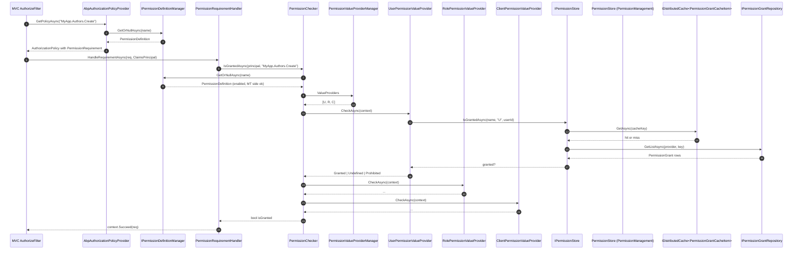

This page traces a single authorization decision through ABP — from the moment ASP.NET Core's authorization middleware looks up a policy named after a permission to the moment `PermissionStore` decides whether a particular `(user, role, client)` triple holds a grant in the database. ABP layers a small set of types on top of ASP.NET Core's `IAuthorizationPolicyProvider` so that every permission name automatically becomes a usable policy without you registering one. The contracts live in `framework/src/Volo.Abp.Authorization.Abstractions/Volo/Abp/Authorization/`; the default implementations under `framework/src/Volo.Abp.Authorization/Volo/Abp/Authorization/Permissions/`; the persistence-backed `IPermissionStore` ships in the Permission Management module at `modules/permission-management/src/Volo.Abp.PermissionManagement.Domain/Volo/Abp/PermissionManagement/`.

<Note>
  Permissions are *always* evaluated through `IPermissionChecker` — whether the call comes from MVC's `[Authorize]` filter, an `IAuthorizationService.AuthorizeAsync` invocation, the `<AbpAuthorize>` Blazor component, or a manual `IAuthorizationService` call. The same `PermissionChecker` runs everywhere, which is why the value provider chain is the single source of truth.
</Note>

## Pipeline at a glance



The rest of the page walks each step at code level.

## 1. The MVC entry point

In MVC, `[Authorize(Policy = "MyApp.Authors.Create")]` is processed by ASP.NET Core's `AuthorizationFilter`, which asks `IAuthorizationPolicyProvider.GetPolicyAsync(name)` for the policy. ABP replaces the default provider with `AbpAuthorizationPolicyProvider` at `framework/src/Volo.Abp.Authorization/Volo/Abp/Authorization/AbpAuthorizationPolicyProvider.cs`:

```csharp
public class AbpAuthorizationPolicyProvider :
    DefaultAuthorizationPolicyProvider,
    IAbpAuthorizationPolicyProvider,
    ITransientDependency
{
    private readonly AuthorizationOptions _options;
    private readonly IPermissionDefinitionManager _permissionDefinitionManager;

    public AbpAuthorizationPolicyProvider(
        IOptions<AuthorizationOptions> options,
        IPermissionDefinitionManager permissionDefinitionManager)
        : base(options)
    {
        _permissionDefinitionManager = permissionDefinitionManager;
        _options = options.Value;
    }

    public override async Task<AuthorizationPolicy?> GetPolicyAsync(string policyName)
    {
        var policy = await base.GetPolicyAsync(policyName);
        if (policy != null)
        {
            return policy;
        }

        var permission = await _permissionDefinitionManager.GetOrNullAsync(policyName);
        if (permission != null)
        {
            //TODO: Optimize & Cache!
            var policyBuilder = new AuthorizationPolicyBuilder(Array.Empty<string>());
            policyBuilder.Requirements.Add(new PermissionRequirement(policyName));
            return policyBuilder.Build();
        }

        return null;
    }
}
```

Two important properties:

<Steps>
  <Step title="Real policies still win">
    `base.GetPolicyAsync(policyName)` runs first, so if you registered an explicit policy with the same name via `AddAuthorization(o => o.AddPolicy(...))`, ABP doesn't shadow it.
  </Step>
  <Step title="Permission name becomes a policy on demand">
    Otherwise the provider asks `IPermissionDefinitionManager` whether the name is a *known permission*; if yes it returns a fresh `AuthorizationPolicy` whose only requirement is a `PermissionRequirement(policyName)`. No need to register every permission as a policy.
  </Step>
</Steps>

`PermissionRequirement` at `framework/src/Volo.Abp.Authorization.Abstractions/Volo/Abp/Authorization/PermissionRequirement.cs` is a one-liner:

```csharp
public class PermissionRequirement : IAuthorizationRequirement
{
    public string PermissionName { get; }

    public PermissionRequirement([NotNull] string permissionName)
    {
        Check.NotNull(permissionName, nameof(permissionName));
        PermissionName = permissionName;
    }

    public override string ToString()
    {
        return $"PermissionRequirement: {PermissionName}";
    }
}
```

The matching handler `PermissionRequirementHandler` at `framework/src/Volo.Abp.Authorization.Abstractions/Volo/Abp/Authorization/PermissionRequirementHandler.cs` just calls into `IPermissionChecker`:

```csharp
public class PermissionRequirementHandler : AuthorizationHandler<PermissionRequirement>
{
    private readonly IPermissionChecker _permissionChecker;

    public PermissionRequirementHandler(IPermissionChecker permissionChecker)
    {
        _permissionChecker = permissionChecker;
    }

    protected override async Task HandleRequirementAsync(
        AuthorizationHandlerContext context,
        PermissionRequirement requirement)
    {
        if (await _permissionChecker.IsGrantedAsync(context.User, requirement.PermissionName))
        {
            context.Succeed(requirement);
        }
    }
}
```

Both `PermissionRequirementHandler` and its multi-permission sibling `PermissionsRequirementHandler` are registered as `IAuthorizationHandler` singletons in `framework/src/Volo.Abp.Authorization/Volo/Abp/Authorization/AbpAuthorizationModule.cs`. The handler does not consult the multi-tenancy side, `IPermissionDefinitionManager`, or the value providers directly — all of that happens inside `PermissionChecker`.

## 2. The permission checker

`PermissionChecker` (at `framework/src/Volo.Abp.Authorization/Volo/Abp/Authorization/Permissions/PermissionChecker.cs`) is where the heavy lifting starts:

```csharp
public class PermissionChecker : IPermissionChecker, ITransientDependency
{
    protected IPermissionDefinitionManager PermissionDefinitionManager { get; }
    protected ICurrentPrincipalAccessor PrincipalAccessor { get; }
    protected ICurrentTenant CurrentTenant { get; }
    protected IPermissionValueProviderManager PermissionValueProviderManager { get; }
    protected ISimpleStateCheckerManager<PermissionDefinition> StateCheckerManager { get; }

    public virtual async Task<bool> IsGrantedAsync(
        ClaimsPrincipal? claimsPrincipal,
        string name)
    {
        Check.NotNull(name, nameof(name));

        var permission = await PermissionDefinitionManager.GetOrNullAsync(name);
        if (permission == null)
        {
            return false;
        }

        if (!permission.IsEnabled)
        {
            return false;
        }

        if (!await StateCheckerManager.IsEnabledAsync(permission))
        {
            return false;
        }

        var multiTenancySide = claimsPrincipal?.GetMultiTenancySide()
                               ?? CurrentTenant.GetMultiTenancySide();

        if (!permission.MultiTenancySide.HasFlag(multiTenancySide))
        {
            return false;
        }

        var isGranted = false;
        var context = new PermissionValueCheckContext(permission, claimsPrincipal);
        foreach (var provider in PermissionValueProviderManager.ValueProviders)
        {
            if (context.Permission.Providers.Any() &&
                !context.Permission.Providers.Contains(provider.Name))
            {
                continue;
            }

            var result = await provider.CheckAsync(context);

            if (result == PermissionGrantResult.Granted)
            {
                isGranted = true;
            }
            else if (result == PermissionGrantResult.Prohibited)
            {
                return false;
            }
        }

        return isGranted;
    }
}
```

The decision is essentially a *short-circuit OR* over the value providers, with one critical asymmetry:

<Card title="Prohibition trumps everything" icon="ban">
  As soon as *any* provider returns `PermissionGrantResult.Prohibited`, the check returns `false`. A `Granted` result only "wins" if no later provider prohibits. This lets you build deny-lists (e.g. a "RemoveDuringIncident" provider) that override otherwise-granted permissions.
</Card>

Other invariants:

<Steps>
  <Step title="Unknown permission = denied">
    `GetOrNullAsync` returning null → false. No accidental open access.
  </Step>
  <Step title="Disabled = denied">
    `permission.IsEnabled` and `StateCheckerManager` (the simple state checker that powers feature gates) both short-circuit the check.
  </Step>
  <Step title="Multi-tenancy side must match">
    `permission.MultiTenancySide.HasFlag(...)` rejects host-only permissions when called inside a tenant scope and vice versa. The flag value comes from the `PermissionDefinition` declaration. See [Multi-Tenancy Resolution Flow](/flows/multi-tenancy-resolution) for where `CurrentTenant.GetMultiTenancySide()` is populated.
  </Step>
  <Step title="Per-permission provider filter">
    A `PermissionDefinition.Providers` list narrows which value providers are eligible. By default the list is empty → all providers run.
  </Step>
</Steps>

The bulk method `IsGrantedAsync(string[] names)` follows the same algorithm using `PermissionValuesCheckContext` and `MultiplePermissionGrantResult`, and short-circuits once `AllProhibited` is true. This is the path the Blazor UI uses to batch-check menu entries.

## 3. The definition manager

`IPermissionDefinitionManager` (at `framework/src/Volo.Abp.Authorization/Volo/Abp/Authorization/Permissions/PermissionDefinitionManager.cs`) merges two sources:

```csharp
public class PermissionDefinitionManager : IPermissionDefinitionManager, ITransientDependency
{
    private readonly IStaticPermissionDefinitionStore _staticStore;
    private readonly IDynamicPermissionDefinitionStore _dynamicStore;

    public virtual async Task<PermissionDefinition?> GetOrNullAsync(string name)
    {
        Check.NotNull(name, nameof(name));

        return await _staticStore.GetOrNullAsync(name) ??
               await _dynamicStore.GetOrNullAsync(name);
    }

    public virtual async Task<IReadOnlyList<PermissionDefinition>> GetPermissionsAsync()
    {
        var staticPermissions = await _staticStore.GetPermissionsAsync();
        var staticPermissionNames = staticPermissions
            .Select(p => p.Name)
            .ToImmutableHashSet();

        var dynamicPermissions = await _dynamicStore.GetPermissionsAsync();

        /* We prefer static permissions over dynamics */
        // ... merges, deduping by name ...
    }
}
```

- **Static store** — `StaticPermissionDefinitionStore` at `framework/src/Volo.Abp.Authorization/Volo/Abp/Authorization/Permissions/StaticPermissionDefinitionStore.cs` collects everything declared by `PermissionDefinitionProvider` subclasses across loaded modules.
- **Dynamic store** — `IDynamicPermissionDefinitionStore`, default `NullDynamicPermissionDefinitionStore` at `framework/src/Volo.Abp.Authorization/Volo/Abp/Authorization/Permissions/NullDynamicPermissionDefinitionStore.cs`; the Permission Management module replaces it with `DynamicPermissionDefinitionStore` at `modules/permission-management/src/Volo.Abp.PermissionManagement.Domain/Volo/Abp/PermissionManagement/DynamicPermissionDefinitionStore.cs`, which reads from the database so SaaS admin UIs can add permissions at runtime.

See `/security/permissions` for the `PermissionDefinitionProvider` declaration model and `/modules/permission-management/overview` for the dynamic flow.

## 4. The value provider chain

`PermissionValueProviderManager` (at `framework/src/Volo.Abp.Authorization/Volo/Abp/Authorization/Permissions/PermissionValueProviderManager.cs`) lazily materialises the ordered list of providers declared in `AbpPermissionOptions`:

```csharp
public class PermissionValueProviderManager : IPermissionValueProviderManager, ISingletonDependency
{
    public IReadOnlyList<IPermissionValueProvider> ValueProviders => _lazyProviders.Value;
    private readonly Lazy<List<IPermissionValueProvider>> _lazyProviders;

    protected virtual List<IPermissionValueProvider> GetProviders()
    {
        var providers = Options
            .ValueProviders
            .Select(type => (ServiceProvider.GetRequiredService(type) as IPermissionValueProvider)!)
            .ToList();

        var multipleProviders = providers.GroupBy(p => p.Name)
            .FirstOrDefault(x => x.Count() > 1);
        if (multipleProviders != null)
        {
            throw new AbpException(
                $"Duplicate permission value provider name detected: {multipleProviders.Key}. ...");
        }

        return providers;
    }
}
```

The default list is built by `AbpAuthorizationModule.ConfigureServices` at `framework/src/Volo.Abp.Authorization/Volo/Abp/Authorization/AbpAuthorizationModule.cs`:

```csharp
Configure<AbpPermissionOptions>(options =>
{
    options.ValueProviders.Add<UserPermissionValueProvider>();
    options.ValueProviders.Add<RolePermissionValueProvider>();
    options.ValueProviders.Add<ClientPermissionValueProvider>();
});
```

Every provider is a `PermissionValueProvider` subclass (base at `framework/src/Volo.Abp.Authorization.Abstractions/Volo/Abp/Authorization/Permissions/PermissionValueProvider.cs`):

```csharp
public abstract class PermissionValueProvider : IPermissionValueProvider, ITransientDependency
{
    public abstract string Name { get; }
    protected IPermissionStore PermissionStore { get; }

    protected PermissionValueProvider(IPermissionStore permissionStore)
    {
        PermissionStore = permissionStore;
    }

    public abstract Task<PermissionGrantResult> CheckAsync(PermissionValueCheckContext context);
    public abstract Task<MultiplePermissionGrantResult> CheckAsync(PermissionValuesCheckContext context);
}
```

The three shipped providers each translate a *claim* into a `(providerName, providerKey)` pair handed to `IPermissionStore`:

<Tabs>
  <Tab title="UserPermissionValueProvider">
    From `framework/src/Volo.Abp.Authorization/Volo/Abp/Authorization/Permissions/UserPermissionValueProvider.cs`:

    ```csharp
    public class UserPermissionValueProvider : PermissionValueProvider
    {
        public const string ProviderName = "U";
        public override string Name => ProviderName;

        public override async Task<PermissionGrantResult> CheckAsync(PermissionValueCheckContext context)
        {
            var userId = context.Principal?.FindFirst(AbpClaimTypes.UserId)?.Value;

            if (userId == null)
            {
                return PermissionGrantResult.Undefined;
            }

            return await PermissionStore.IsGrantedAsync(context.Permission.Name, Name, userId)
                ? PermissionGrantResult.Granted
                : PermissionGrantResult.Undefined;
        }
    }
    ```

    - Returns `Undefined` (not `Prohibited`) when there's no `userId` — anonymous calls fall through to other providers.
    - Looks up grants keyed on the *user id*. The `U` provider name is what the Permission Management UI uses when an admin grants a permission to one specific user.
  </Tab>
  <Tab title="RolePermissionValueProvider">
    From `framework/src/Volo.Abp.Authorization/Volo/Abp/Authorization/Permissions/RolePermissionValueProvider.cs`:

    ```csharp
    public class RolePermissionValueProvider : PermissionValueProvider
    {
        public const string ProviderName = "R";
        public override string Name => ProviderName;

        public override async Task<PermissionGrantResult> CheckAsync(PermissionValueCheckContext context)
        {
            var roles = context.Principal?.FindAll(AbpClaimTypes.Role)
                                        .Select(c => c.Value).ToArray();

            if (roles == null || !roles.Any())
            {
                return PermissionGrantResult.Undefined;
            }

            foreach (var role in roles.Distinct())
            {
                if (await PermissionStore.IsGrantedAsync(context.Permission.Name, Name, role))
                {
                    return PermissionGrantResult.Granted;
                }
            }

            return PermissionGrantResult.Undefined;
        }
    }
    ```

    Iterates every `AbpClaimTypes.Role` claim until one is granted. Roles are deduped, but the loop is still O(roles). For users in many roles, the cached store keeps this cheap. The bulk method's behaviour is more nuanced — it stops walking remaining roles for a permission once a grant is found.
  </Tab>
  <Tab title="ClientPermissionValueProvider">
    From `framework/src/Volo.Abp.Authorization/Volo/Abp/Authorization/Permissions/ClientPermissionValueProvider.cs`:

    ```csharp
    public class ClientPermissionValueProvider : PermissionValueProvider
    {
        public const string ProviderName = "C";
        public override string Name => ProviderName;

        protected ICurrentTenant CurrentTenant { get; }

        public override async Task<PermissionGrantResult> CheckAsync(PermissionValueCheckContext context)
        {
            var clientId = context.Principal?.FindFirst(AbpClaimTypes.ClientId)?.Value;

            if (clientId == null)
            {
                return PermissionGrantResult.Undefined;
            }

            using (CurrentTenant.Change(null))
            {
                return await PermissionStore.IsGrantedAsync(context.Permission.Name, Name, clientId)
                    ? PermissionGrantResult.Granted
                    : PermissionGrantResult.Undefined;
            }
        }
    }
    ```

    Two notable details: (1) the provider reads `AbpClaimTypes.ClientId`, which is populated by OpenIddict's `client_id` claim, so machine-to-machine tokens get their own grant set; (2) it temporarily switches to the *host* tenant via `CurrentTenant.Change(null)` because OpenIddict clients are host-scoped resources. See [Multi-Tenancy Resolution Flow](/flows/multi-tenancy-resolution) for the `Change` scope and `/modules/openiddict/overview` for how `client_id` gets onto the principal.
  </Tab>
</Tabs>

<Card title="Provider order matters" icon="list-ol">
  The default order is `U`, `R`, `C`. Because *Prohibited* short-circuits but *Granted* is sticky-but-overridable, putting a custom prohibition provider **last** lets it veto otherwise-granted permissions. Putting it first prevents subsequent providers from running once the row is granted by other means.
</Card>

## 5. The store

The store contract `IPermissionStore` (at `framework/src/Volo.Abp.Authorization.Abstractions/Volo/Abp/Authorization/Permissions/IPermissionStore.cs`) is intentionally tiny:

```csharp
public interface IPermissionStore
{
    Task<bool> IsGrantedAsync(
        [NotNull] string name,
        [CanBeNull] string providerName,
        [CanBeNull] string providerKey
    );

    Task<MultiplePermissionGrantResult> IsGrantedAsync(
        [NotNull] string[] names,
        [CanBeNull] string providerName,
        [CanBeNull] string providerKey
    );
}
```

The shipping implementation lives in the Permission Management module: `PermissionStore` at `modules/permission-management/src/Volo.Abp.PermissionManagement.Domain/Volo/Abp/PermissionManagement/PermissionStore.cs`:

```csharp
public class PermissionStore : IPermissionStore, ITransientDependency
{
    public ILogger<PermissionStore> Logger { get; set; }
    protected IPermissionGrantRepository PermissionGrantRepository { get; }
    protected IPermissionDefinitionManager PermissionDefinitionManager { get; }
    protected IDistributedCache<PermissionGrantCacheItem> Cache { get; }

    public PermissionStore(
        IPermissionGrantRepository permissionGrantRepository,
        IDistributedCache<PermissionGrantCacheItem> cache,
        IPermissionDefinitionManager permissionDefinitionManager)
    {
        PermissionGrantRepository = permissionGrantRepository;
        Cache = cache;
        PermissionDefinitionManager = permissionDefinitionManager;
        Logger = NullLogger<PermissionStore>.Instance;
    }

    public virtual async Task<bool> IsGrantedAsync(string name, string providerName, string providerKey)
    {
        return (await GetCacheItemAsync(name, providerName, providerKey)).IsGranted;
    }
}
```

`GetCacheItemAsync` hits an `IDistributedCache<PermissionGrantCacheItem>` first, only falling through to `IPermissionGrantRepository.GetListAsync(providerName, providerKey)` on a cache miss. The fetch path is interesting: on miss it loads *every* permission for the `(provider, key)` pair and pre-populates the cache for all of them in one round trip:

```csharp
protected virtual async Task SetCacheItemsAsync(
    string providerName,
    string providerKey,
    string currentName,
    PermissionGrantCacheItem currentCacheItem)
{
    using (PermissionGrantRepository.DisableTracking())
    {
        var permissions = await PermissionDefinitionManager.GetPermissionsAsync();

        var grantedPermissionsHashSet = new HashSet<string>(
            (await PermissionGrantRepository.GetListAsync(providerName, providerKey))
                .Select(p => p.Name));

        var cacheItems = new List<KeyValuePair<string, PermissionGrantCacheItem>>();

        foreach (var permission in permissions)
        {
            var isGranted = grantedPermissionsHashSet.Contains(permission.Name);

            cacheItems.Add(new KeyValuePair<string, PermissionGrantCacheItem>(
                CalculateCacheKey(permission.Name, providerName, providerKey),
                new PermissionGrantCacheItem(isGranted)));

            if (permission.Name == currentName)
            {
                currentCacheItem.IsGranted = isGranted;
            }
        }

        await Cache.SetManyAsync(cacheItems);
    }
}
```

This is why a fresh user's first permission check takes one DB round trip but the next thousand calls (for any permission, by that user/role/client) are pure cache reads.

<Warning>
  Because the cache is *bulk-filled* per `(provider, providerKey)`, grants must be invalidated *for the whole key* when the admin UI changes anything. The Permission Management module does this for you via `IPermissionGrantRepository` events; if you call `PermissionGrantRepository.DeleteAsync(...)` from custom code, also call `Cache.RemoveManyAsync` for the affected keys.
</Warning>

## 6. End-to-end timeline

Putting everything together, a single permission check looks like this:

<Steps>
  <Step title="Filter runs">
    `[Authorize(Policy = "MyApp.Authors.Create")]` reaches `AuthorizationFilter.OnAuthorizationAsync`. The filter asks `IAuthorizationPolicyProvider.GetPolicyAsync("MyApp.Authors.Create")`.
  </Step>
  <Step title="Policy materialised on demand">
    `AbpAuthorizationPolicyProvider` finds the matching `PermissionDefinition` via `IPermissionDefinitionManager.GetOrNullAsync` and returns an `AuthorizationPolicy` containing a single `PermissionRequirement`.
  </Step>
  <Step title="Requirement handed to ASP.NET Core">
    `DefaultAuthorizationService` invokes every registered `AuthorizationHandler<T>` for `PermissionRequirement`. `PermissionRequirementHandler.HandleRequirementAsync` runs.
  </Step>
  <Step title="Checker runs">
    The handler calls `IPermissionChecker.IsGrantedAsync(context.User, "MyApp.Authors.Create")`. The checker fetches the definition again, checks `IsEnabled`, the `StateCheckerManager` flag, and the multi-tenancy side.
  </Step>
  <Step title="Providers walked">
    The checker calls each `IPermissionValueProvider` in order: `UserPermissionValueProvider` reads `AbpClaimTypes.UserId`, `RolePermissionValueProvider` reads `AbpClaimTypes.Role`, `ClientPermissionValueProvider` reads `AbpClaimTypes.ClientId` and switches to the host tenant.
  </Step>
  <Step title="Store consulted">
    Each provider asks `IPermissionStore.IsGrantedAsync(name, providerName, providerKey)`. `PermissionStore` reads the distributed cache; on miss, it loads every grant for `(provider, key)` and populates the cache for all known permissions at once.
  </Step>
  <Step title="Result aggregated">
    The checker combines `Granted | Undefined | Prohibited`. Any `Prohibited` returns false immediately; otherwise the value of `isGranted` is returned. The handler calls `context.Succeed(requirement)` or leaves it failed.
  </Step>
  <Step title="Filter decides">
    If the requirement is not satisfied, the filter sets a `ForbidResult`; the host's cookie scheme typically redirects to `/Account/Login`, and the JWT scheme returns 403. See [Authentication & Claims Flow](/flows/authentication-and-claims) for where the principal came from.
  </Step>
</Steps>

## 7. Method-level checks

Beyond `[Authorize]`, the same `PermissionChecker` is used directly:

```csharp
public class AuthorAppService : ApplicationService
{
    private readonly IPermissionChecker _permissionChecker;

    public async Task DoSomethingAsync()
    {
        if (!await _permissionChecker.IsGrantedAsync("MyApp.Authors.Create"))
        {
            throw new AbpAuthorizationException();
        }
    }
}
```

The `ApplicationService` base also exposes the more convenient `await CheckAsync(name)` and the `[Authorize]` attribute, both of which funnel into the same chain. The unit-of-work interceptor also runs *outside* the authorization check, so the database session opens after authorization completes — see [Unit-of-Work Lifecycle Flow](/flows/unit-of-work-lifecycle).

## 8. Custom recipes

<Accordion title="Add a feature-flag value provider">
  Implement a `FeatureFlagPermissionValueProvider : PermissionValueProvider` that returns `Prohibited` when a flag is off. Register it last in `AbpPermissionOptions.ValueProviders`:

  ```csharp
  Configure<AbpPermissionOptions>(options =>
  {
      options.ValueProviders.Add<FeatureFlagPermissionValueProvider>();
  });
  ```

  Because `Prohibited` short-circuits, the flag wins over any user/role/client grant.
</Accordion>

<Accordion title="Restrict a permission to one provider">
  In your `PermissionDefinitionProvider`, set `Providers` on the permission:

  ```csharp
  var perm = group.AddPermission("MyApp.Authors.Create");
  perm.Providers.Add(UserPermissionValueProvider.ProviderName);
  ```

  Only the named providers are consulted. This is how the OpenIddict module marks "client-only" scopes.
</Accordion>

<Accordion title="Reuse the checker from a Razor Page">
  Inject `IAuthorizationService` and call `await AuthorizationService.AuthorizeAsync(User, "MyApp.Authors.Create")`. The call ends up in the same `PermissionRequirementHandler` → `PermissionChecker` path described above. See `/security/authorization` for the Razor Page convention helpers.
</Accordion>

<Accordion title="Disable the cache during tests">
  Override `IDistributedCache<PermissionGrantCacheItem>` with a no-op in your test module to force a DB hit per check; the contract for `PermissionStore` is unchanged.
</Accordion>

## Cross-links

<CardGroup cols={2}>
  <Card title="Authentication & Claims Flow" icon="user-shield" href="/flows/authentication-and-claims">
    The `ClaimsPrincipal` that all three value providers consume is built and refreshed there.
  </Card>
  <Card title="Multi-Tenancy Resolution" icon="building" href="/flows/multi-tenancy-resolution">
    `permission.MultiTenancySide` is matched against `ICurrentTenant.GetMultiTenancySide()`; `ClientPermissionValueProvider` swaps tenant inside the check.
  </Card>
  <Card title="HTTP Request Pipeline" icon="route" href="/flows/http-request-pipeline">
    Shows where `UseAuthorization()` sits relative to the dynamic claims and multi-tenancy middleware.
  </Card>
  <Card title="Application Service Call" icon="server" href="/flows/application-service-call">
    Application services call `IPermissionChecker` directly through the `CheckAsync` helper.
  </Card>
</CardGroup>

<CardGroup cols={2}>
  <Card title="Permissions" icon="key" href="/security/permissions">
    `PermissionDefinitionProvider`, naming conventions, multi-tenancy side flags.
  </Card>
  <Card title="Authorization" icon="user-check" href="/security/authorization">
    The wider authorization surface including `[Authorize]`, `AbpAuthorize` Blazor component, and `IAuthorizationService`.
  </Card>
  <Card title="Security overview" icon="lock" href="/security/overview">
    Where authorization sits in the broader security stack.
  </Card>
  <Card title="Permission Management module" icon="database" href="/modules/permission-management/overview">
    The persistence side that ships `PermissionStore` and the admin UI.
  </Card>
  <Card title="Identity module" icon="user" href="/modules/identity/overview">
    Source of the user/role claims the value providers read.
  </Card>
  <Card title="OpenIddict module" icon="id-card" href="/modules/openiddict/overview">
    Source of the `client_id` claim `ClientPermissionValueProvider` consumes.
  </Card>
</CardGroup>
