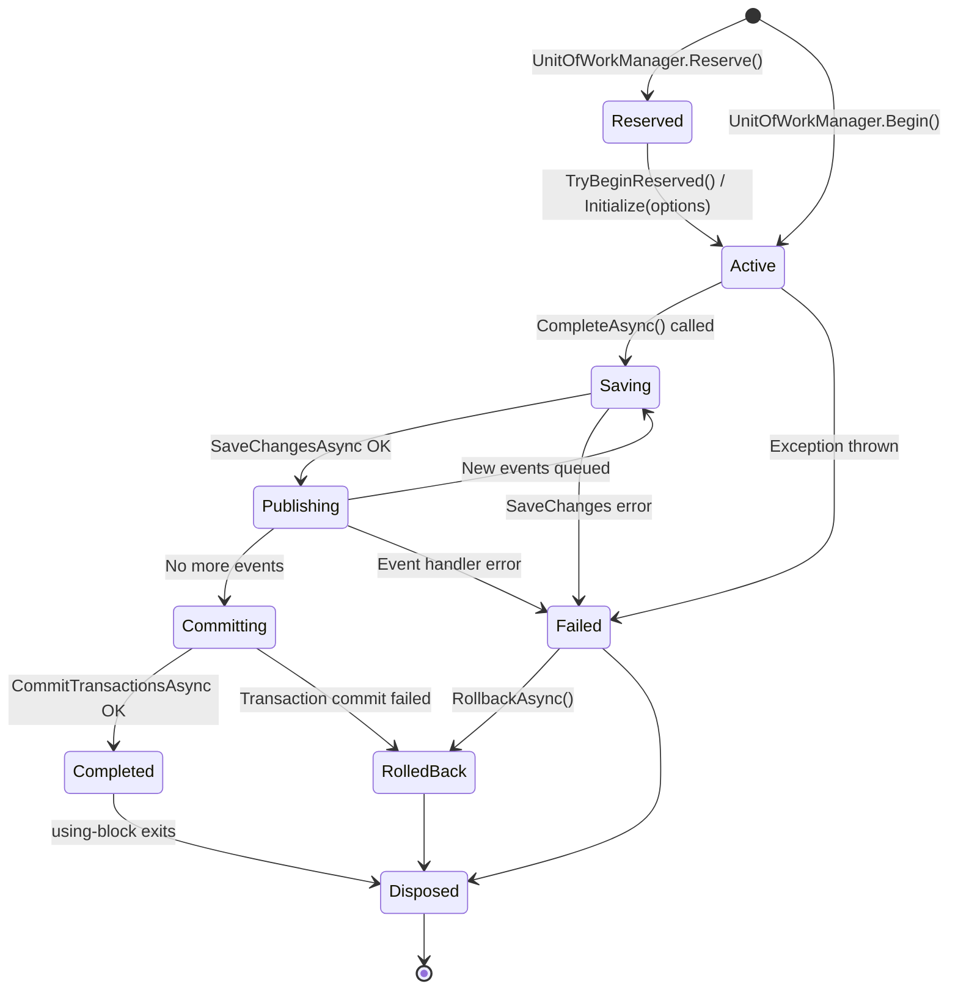
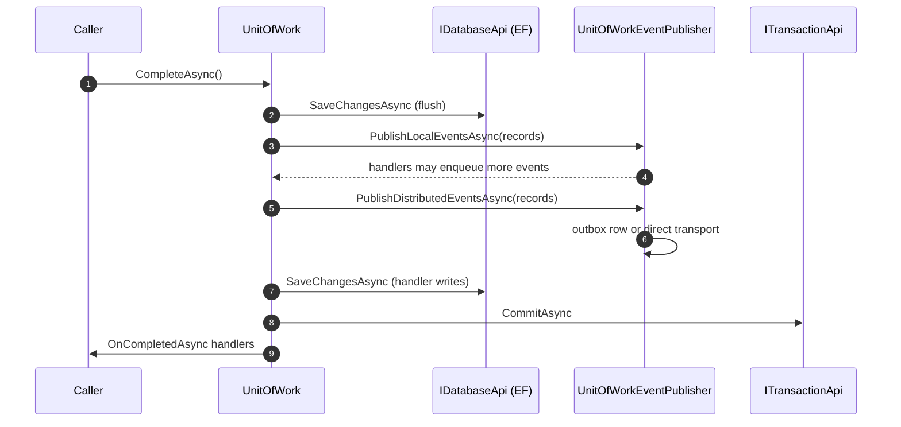

The Unit of Work (UoW) is the heart of ABP's transactional model. It groups a set of database operations into one logical transaction, defers event publication until commit, and gives every consumer — repositories, audit logs, outbox, distributed cache invalidation — a single hook (`OnCompleted`, `Failed`, `Disposed`) to participate. This page walks the full lifecycle of an `IUnitOfWork` instance, from `IUnitOfWorkManager.Begin` to the final transaction commit, and shows how reservation, nesting and the event publishing loop interact.

Sources cited below live in:

- `framework/src/Volo.Abp.Uow/Volo/Abp/Uow/`
- `framework/src/Volo.Abp.EntityFrameworkCore/Volo/Abp/EntityFrameworkCore/` (DB-API wiring)

## State diagram



The state machine is implemented inside `framework/src/Volo.Abp.Uow/Volo/Abp/Uow/UnitOfWork.cs`. Key fields:

```csharp
public bool IsReserved { get; set; }
public bool IsDisposed { get; private set; }
public bool IsCompleted { get; private set; }
public string? ReservationName { get; set; }
private Exception? _exception;
private bool _isCompleting;
private bool _isRolledback;
```

## 1. Acquisition: `Begin`, `Reserve`, child UoW

Source: `framework/src/Volo.Abp.Uow/Volo/Abp/Uow/UnitOfWorkManager.cs`.

```csharp
public IUnitOfWork Begin(AbpUnitOfWorkOptions options, bool requiresNew = false)
{
    var currentUow = Current;
    if (currentUow != null && !requiresNew)
    {
        return new ChildUnitOfWork(currentUow);
    }

    var unitOfWork = CreateNewUnitOfWork();
    unitOfWork.Initialize(options);
    return unitOfWork;
}
```

Three acquisition modes:

<CardGroup cols={3}>
  <Card title="Begin" icon="play">
    Creates a new top-level UoW if none is active, otherwise returns a `ChildUnitOfWork` wrapper that shares the parent's database APIs and transactions.
  </Card>
  <Card title="Begin(requiresNew: true)" icon="forward">
    Forces a fresh outer UoW even if one is ambient. Used by `InboxProcessor` for idempotent event handling and by background jobs to isolate from the outer scope.
  </Card>
  <Card title="Reserve" icon="bookmark">
    Allocates a UoW slot but does *not* initialize options. Used by `AbpUnitOfWorkMiddleware` so the `UnitOfWorkInterceptor` can later upgrade it with attribute-driven options.
  </Card>
</CardGroup>

### Reserve / TryBeginReserved

The middleware-interceptor handshake (see [`flows/http-request-pipeline`](/flows/http-request-pipeline) step 6 and [`flows/application-service-call`](/flows/application-service-call) step 7):

```csharp
// AbpUnitOfWorkMiddleware
using (var uow = _unitOfWorkManager.Reserve(UnitOfWork.UnitOfWorkReservationName))
{
    await next(context);
    await uow.CompleteAsync(_cancellationTokenProvider.Token);
}
```

```csharp
// UnitOfWorkInterceptor
if (unitOfWorkManager.TryBeginReserved(UnitOfWork.UnitOfWorkReservationName, options))
{
    await invocation.ProceedAsync();
    if (unitOfWorkManager.Current != null)
        await unitOfWorkManager.Current.SaveChangesAsync();
    return;
}
```

`TryBeginReserved` walks the outer chain looking for a UoW whose `ReservationName` matches and calls `Initialize(options)` on it. The application service decides the options (transactional, timeout, isolation level) based on `[UnitOfWork]` and the `Get*` heuristic; the middleware just commits later.

### Child UoW

`ChildUnitOfWork` (`framework/src/Volo.Abp.Uow/Volo/Abp/Uow/ChildUnitOfWork.cs`) is a thin wrapper that delegates everything to the parent — `CompleteAsync` on a child is a no-op so the outer scope retains control. This is what makes nested `using (uowManager.Begin())` calls safe: only the outermost block actually commits.

## 2. Initialization

`Initialize(options)` records the options, picks the transaction behaviour and clears the reserved flag:

```csharp
public virtual void Initialize(AbpUnitOfWorkOptions options)
{
    Check.NotNull(options, nameof(options));
    if (Options != null)
        throw new AbpException("This unit of work has already been initialized.");

    Options = _defaultOptions.Normalize(options.Clone());
    IsReserved = false;
}
```

`_defaultOptions.Normalize` (`AbpUnitOfWorkDefaultOptions.cs`) applies framework defaults: if `IsolationLevel` is null, ReadCommitted; if `Timeout` is null, no timeout; if `IsTransactional` is null, the heuristic from the interceptor.

## 3. Active phase — database APIs accumulate

While the UoW is active, every repository call lazily registers an `IDatabaseApi` keyed by the connection-string name. For EF Core, the API instance contains the `DbContext` and its open transaction. ABP serves the connection string through `MultiTenantConnectionStringResolver` (`framework/src/Volo.Abp.MultiTenancy/Volo/Abp/MultiTenancy/MultiTenantConnectionStringResolver.cs`) and the EF-specific resolver layer.

<Note>
  In older versions there was a dedicated `EfCoreUnitOfWorkConnectionStringResolver`; in the current source the resolution path runs through `DefaultConnectionStringResolver` / `MultiTenantConnectionStringResolver`. The lookup is per-UoW because the same UoW must use the same physical connection for every database API key, or transactions across multiple `DbContext`s won't enroll.
</Note>

The UoW also tracks events:

```csharp
protected List<UnitOfWorkEventRecord> LocalEvents { get; }
protected List<UnitOfWorkEventRecord> DistributedEvents { get; }
protected List<KeyValuePair<UnitOfWorkEventRecord, Predicate<UnitOfWorkEventRecord>?>> LocalEventWithPredicates { get; }
protected List<KeyValuePair<UnitOfWorkEventRecord, Predicate<UnitOfWorkEventRecord>?>> DistributedEventWithPredicates { get; }
```

Predicated events let aggregates publish "if and only if state X is still true at commit time" — useful for the outbox pattern.

## 4. `SaveChangesAsync`

```csharp
public virtual async Task SaveChangesAsync(CancellationToken cancellationToken = default)
{
    if (_isRolledback) return;

    foreach (var databaseApi in GetAllActiveDatabaseApis())
    {
        if (databaseApi is ISupportsSavingChanges supportsSavingChangesDatabaseApi)
        {
            await supportsSavingChangesDatabaseApi.SaveChangesAsync(cancellationToken);
        }
    }
}
```

Each database API decides what `SaveChanges` means — for EF Core it flushes the change tracker, for MongoDB it's a no-op (writes are immediate), for Dapper it's also a no-op (no tracking).

`SaveChangesAsync` is called:

- Once on the inner `UnitOfWorkInterceptor` exit (for the reserved-UoW path).
- Repeatedly by `CompleteAsync` between event-publishing rounds.
- Explicitly by application code that needs an in-flight `Id` to participate in a follow-up event.

## 5. `CompleteAsync` — the commit sequence

```csharp
public virtual async Task CompleteAsync(CancellationToken cancellationToken = default)
{
    if (_isRolledback) return;
    PreventMultipleComplete();

    try
    {
        _isCompleting = true;
        await SaveChangesAsync(cancellationToken);

        LocalEvents.AddRange(GetEventsRecords(LocalEventWithPredicates));
        LocalEventWithPredicates.Clear();
        DistributedEvents.AddRange(GetEventsRecords(DistributedEventWithPredicates));
        DistributedEventWithPredicates.Clear();

        while (LocalEvents.Any() || DistributedEvents.Any())
        {
            if (LocalEvents.Any())
            {
                var localEventsToBePublished = LocalEvents.OrderBy(e => e.EventOrder).ToArray();
                LocalEvents.Clear();
                await UnitOfWorkEventPublisher.PublishLocalEventsAsync(localEventsToBePublished);
            }

            if (DistributedEvents.Any())
            {
                var distributedEventsToBePublished = DistributedEvents.OrderBy(e => e.EventOrder).ToArray();
                DistributedEvents.Clear();
                await UnitOfWorkEventPublisher.PublishDistributedEventsAsync(distributedEventsToBePublished);
            }

            await SaveChangesAsync(cancellationToken);

            // accumulate events that handlers themselves produced
            LocalEvents.AddRange(GetEventsRecords(LocalEventWithPredicates));
            LocalEventWithPredicates.Clear();
            DistributedEvents.AddRange(GetEventsRecords(DistributedEventWithPredicates));
            DistributedEventWithPredicates.Clear();
        }

        await CommitTransactionsAsync(cancellationToken);
        IsCompleted = true;
        await OnCompletedAsync();
    }
    catch (Exception ex)
    {
        _exception = ex;
        throw;
    }
}
```

The control flow:



### Why the loop?

Local event handlers can publish more events, queue more entity changes, or trigger more aggregate methods. The loop keeps draining until the change tracker is empty and the event queues are empty *in the same pass*. This is the canonical "transactional outbox + domain events" pattern adapted to ABP's event ordering (`EventOrderGenerator.GetNext()` from `framework/src/Volo.Abp.Uow/Volo/Abp/Uow/EventOrderGenerator.cs`).

### Distributed events and the outbox

`UnitOfWorkEventPublisher.PublishDistributedEventsAsync` does **not** call the broker directly. It calls back into `DistributedEventBusBase.PublishToEventBusAsync` (or writes to the outbox if configured). See [`flows/distributed-event-publish-consume`](/flows/distributed-event-publish-consume) for the next hop.

### Commit transactions

`CommitTransactionsAsync` walks every `ITransactionApi` (one per database key) and calls its `Commit`. For EF Core this is the `IDbContextTransaction.Commit`. For Mongo, a `IClientSessionHandle.CommitTransactionAsync`.

### `OnCompleted` handlers

```csharp
public void OnCompleted(Func<Task> handler) => CompletedHandlers.Add(handler);

protected virtual async Task OnCompletedAsync()
{
    foreach (var handler in CompletedHandlers)
    {
        await handler.Invoke();
    }
}
```

`OnCompleted` runs **after** the transaction commits. Used by:

- The outbox sender's "publish immediately if no batch is pending" optimisation.
- `IDistributedCache` invalidation.
- Test fixtures that need to assert post-commit state.

Anything thrown in an `OnCompleted` handler is logged but does not roll back the transaction (which has already committed). Plan accordingly.

## 6. Rollback

```csharp
public virtual async Task RollbackAsync(CancellationToken cancellationToken = default)
{
    if (_isRolledback) return;
    _isRolledback = true;
    await RollbackAllAsync(cancellationToken);
}
```

`RollbackAllAsync` walks every `ITransactionApi` that implements `ISupportsRollback` and invokes the rollback. After this, `SaveChangesAsync` becomes a no-op.

### Exception path

When the application service throws:

1. `UnitOfWorkInterceptor` lets the exception bubble out of `ProceedAsync` — it does **not** explicitly roll back.
2. `using (var uow = unitOfWorkManager.Begin(...))` (or the middleware's `Reserve`) goes through `Dispose` without `CompleteAsync` being called.
3. In `Dispose`, the UoW checks `IsCompleted`. If not completed, it raises the `Failed` event and rolls back any pending transactions.

```csharp
public event EventHandler<UnitOfWorkFailedEventArgs> Failed;
public event EventHandler<UnitOfWorkEventArgs> Disposed;
```

<Warning>
  Anything you publish with `IDistributedEventBus.PublishAsync(..., onUnitOfWorkComplete: true)` (the default) **does not get published** on the failure path — the records sit in the UoW's queue and are dropped on dispose. That's the whole point of the integration: domain events must never escape a failed transaction.
</Warning>

## 7. Disposal

`UnitOfWork.Dispose` (final state in the diagram) does:

1. Raise `Disposed` so subscribers can release resources.
2. Dispose every accumulated `IDatabaseApi` (which closes the DbContext / Mongo session).
3. Drop the ambient UoW from `AsyncLocal` via `IAmbientUnitOfWork`.

The using-block in `AbpUnitOfWorkMiddleware` and `UnitOfWorkInterceptor` guarantees this even on exceptions.

## 8. Connection-string resolution

While the UoW is active, every repository ask is routed to:

1. `MultiTenantConnectionStringResolver.ResolveAsync(connectionStringName)` in `framework/src/Volo.Abp.MultiTenancy/Volo/Abp/MultiTenancy/MultiTenantConnectionStringResolver.cs`.
2. The tenant-aware resolver checks `ICurrentTenant.Id`; if non-null, calls `ITenantStore.FindAsync` and returns the tenant's connection string, falling back to global defaults.
3. For EF Core, the resolved string is used to construct the `DbContext` (cached in the UoW so a second resolve hits the same instance).

This is why a `using (CurrentTenant.Change(...))` block opened **before** any repository call works correctly — the first resolve happens lazily on demand, with the tenant scope still active.

See [`flows/multi-tenancy-resolution`](/flows/multi-tenancy-resolution) for the resolver chain that populates `ICurrentTenant`.

## Worked example

```csharp
using (var uow = _unitOfWorkManager.Begin(requiresNew: true, isTransactional: true))
{
    var order = new Order(GuidGenerator.Create(), customerId);
    order.AddItem(productId, qty);

    await _orderRepository.InsertAsync(order);
    await _distributedEventBus.PublishAsync(new OrderPlacedEto { OrderId = order.Id });

    uow.OnCompleted(async () =>
    {
        await _cache.RemoveAsync($"orders:customer:{customerId}");
    });

    await uow.CompleteAsync();
}
```

<Steps>
  <Step title="Begin(requiresNew: true)">
    A fresh outer UoW is created and `Initialize` records `IsTransactional = true`.
  </Step>
  <Step title="InsertAsync">
    EF Core opens a `DbContext`, the change tracker records the `Order` aggregate. An `IDatabaseApi` is registered against the current UoW.
  </Step>
  <Step title="PublishAsync (onUnitOfWorkComplete=true default)">
    The event is queued in `DistributedEvents`, not sent yet.
  </Step>
  <Step title="OnCompleted">
    The cache-invalidation lambda is added to `CompletedHandlers`.
  </Step>
  <Step title="CompleteAsync → SaveChanges">
    EF Core writes the INSERTs to the open transaction.
  </Step>
  <Step title="Event loop">
    The distributed event is handed to `UnitOfWorkEventPublisher`, which routes it through `DistributedEventBusBase` to the outbox (if configured) or directly to the broker.
  </Step>
  <Step title="CommitTransactionsAsync">
    The EF Core transaction commits. Order is now persisted.
  </Step>
  <Step title="OnCompletedAsync">
    The cache key is removed. If this throws, the order is still committed.
  </Step>
  <Step title="Dispose">
    `DbContext` disposed, ambient UoW cleared.
  </Step>
</Steps>

## Related subsystems

<CardGroup cols={2}>
  <Card title="Unit of Work" icon="database" href="/data/unit-of-work">
    Programming model: `[UnitOfWork]`, `IUnitOfWorkManager`, manual `Begin`/`Complete`.
  </Card>
  <Card title="EF Core integration" icon="layer-group" href="/data/entityframeworkcore">
    How `IDatabaseApi` wraps `DbContext` and `ITransactionApi` wraps `IDbContextTransaction`.
  </Card>
  <Card title="Distributed event bus" icon="tower-broadcast" href="/eventbus/distributed-event-bus">
    Where events queued during the UoW end up.
  </Card>
  <Card title="Inbox/Outbox" icon="boxes-stacked" href="/eventbus/distributed-event-bus">
    How `OnCompletedAsync` integrates with the outbox sender.
  </Card>
</CardGroup>

## Related flows

- [HTTP request pipeline](/flows/http-request-pipeline) — where the reservation comes from.
- [Application service call](/flows/application-service-call) — the interceptor that owns / upgrades the UoW.
- [Distributed event publish/consume](/flows/distributed-event-publish-consume) — what happens to events drained in step 5.
- [Background job execution](/flows/background-job-execution) — UoW lifecycle outside the HTTP pipeline.

## FAQ

<Accordion title="When are domain events vs distributed events published?">
  Both run inside the event loop in `CompleteAsync`. Local events go through `PublishLocalEventsAsync` (in-process handlers) and distributed events through `PublishDistributedEventsAsync` (which may write to the outbox or call the broker directly). They are interleaved — every round publishes all queued local events, then all queued distributed events, then re-checks for new ones.
</Accordion>

<Accordion title="Can I disable the transactional behaviour for a single read?">
  Yes — use `[UnitOfWork(IsTransactional = false)]` on the method, or rely on the `GetX` naming heuristic. Non-transactional UoWs still flush via `SaveChanges` but skip `BeginTransaction`.
</Accordion>

<Accordion title="Why does the inbox processor pass requiresNew: true?">
  Because it processes incoming events one at a time inside its own UoW (see `InboxProcessor.RunAsync`). It must not be tangled with a possibly-active outer UoW from the worker host.
</Accordion>
