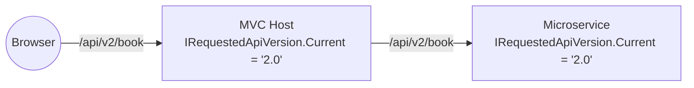

`Volo.Abp.ApiVersioning.Abstractions` is the smallest module in the framework — one interface, one null implementation, one module class. Its job is to give *non-MVC* layers (the client proxy, the audit log, the local event bus, custom telemetry) a way to ask "what API version is currently being served?" without taking a hard dependency on `Asp.Versioning`. When the host opts in to API versioning by calling `services.AddAbpApiVersioning(...)` (an extension shipped in `Volo.Abp.AspNetCore.Mvc`), the null registration is replaced with `HttpContextRequestedApiVersion`, which reads the active version from the current `HttpContext`. Without that call, callers see `null` and proceed unversioned.

Module path: `framework/src/Volo.Abp.ApiVersioning.Abstractions/Volo/Abp/ApiVersioning/`.

## `IRequestedApiVersion`

```csharp
namespace Volo.Abp.ApiVersioning;

public interface IRequestedApiVersion
{
    string? Current { get; }
}
```

A single read-only `Current` property — when the request is unversioned (or there's no HTTP request at all, e.g. inside a background worker), it returns `null`.

The interface is intentionally framework-agnostic: it returns `string?` rather than `ApiVersion` so that the abstractions package doesn't have to reference `Asp.Versioning`. Callers that need a richer model can attempt a `ApiVersion.TryParse` themselves.

## `NullRequestedApiVersion`

```csharp
namespace Volo.Abp.ApiVersioning;

public class NullRequestedApiVersion : IRequestedApiVersion
{
    public static NullRequestedApiVersion Instance = new NullRequestedApiVersion();

    public string? Current => null;

    private NullRequestedApiVersion()
    {
    }
}
```

A classic singleton-null pattern. Always returns `null` for `Current`. Lives in DI as a singleton so callers can resolve `IRequestedApiVersion` even when the full versioning package isn't loaded.

## `AbpApiVersioningAbstractionsModule`

```csharp
using Microsoft.Extensions.DependencyInjection;
using Volo.Abp.Modularity;

namespace Volo.Abp.ApiVersioning;

public class AbpApiVersioningAbstractionsModule : AbpModule
{
    public override void ConfigureServices(ServiceConfigurationContext context)
    {
        context.Services.AddSingleton<IRequestedApiVersion>(NullRequestedApiVersion.Instance);
    }
}
```

A single DI registration. When the host calls `services.AddAbpApiVersioning(...)` (from `Volo.Abp.AspNetCore.Mvc`'s `AbpApiVersioningExtensions`), the registration is replaced with a transient `HttpContextRequestedApiVersion` that reads the active version from the current `HttpContext`.

## Why the indirection?

ABP services frequently need to know "which API version was requested?" without being able to take an MVC dependency:

- **Client proxies** (`ClientProxyBase<TService>`) need to *forward* the version they were called with — `CurrentApiVersionInfo` in `Volo.Abp.Http.Client` pulls from this interface to populate the `api-version` query string or `Asp-Version` header on the outbound call.
- **Audit logs** record the API version so an "increment-version + repro" investigation can replay the exact behaviour.
- **Local event handlers** can branch on the version (e.g. emit v1 vs v2 of an outbound integration event).
- **Background workers** that pick up jobs scheduled by a versioned API can read the recorded version from the job payload, but their own `IRequestedApiVersion` resolves to the null instance — exactly the right behaviour.

## Interplay with `ActionApiDescriptionModel`

`Volo.Abp.Http.Modeling.ActionApiDescriptionModel.SupportedVersions` records *the versions a server-side action supports*. The client side resolves the action against the model:

```csharp
public class ClientProxyBase<TService>
{
    protected ICurrentApiVersionInfo CurrentApiVersionInfo
        => LazyServiceProvider.LazyGetRequiredService<ICurrentApiVersionInfo>();

    protected virtual ClientProxyRequestContext BuildHttpProxyClientProxyContext(
        string methodName, ClientProxyRequestTypeValue? arguments = null)
    {
        // ...
        if (action.SupportedVersions != null && action.SupportedVersions.Any())
        {
            //TODO: make names configurable
            actionArguments.RemoveAll(x => x.Key == "api-version" || x.Key == "apiVersion");
        }
        // ...
    }
}
```

So if a server-side action has `SupportedVersions = ["1.0", "2.0"]`, the client proxy *removes* any explicit `api-version` argument from the method's parameter list — and lets the version routing be handled by URL or header instead.

## The shipped replacement: `HttpContextRequestedApiVersion`

`Volo.Abp.AspNetCore.Mvc` ships the production implementation (in `Volo.Abp.AspNetCore.Mvc.Versioning`):

```csharp
namespace Volo.Abp.AspNetCore.Mvc.Versioning;

public class HttpContextRequestedApiVersion : IRequestedApiVersion
{
    public string? Current => _httpContextAccessor.HttpContext?.GetRequestedApiVersion()?.ToString();

    private readonly IHttpContextAccessor _httpContextAccessor;

    public HttpContextRequestedApiVersion(IHttpContextAccessor httpContextAccessor)
    {
        _httpContextAccessor = httpContextAccessor;
    }
}
```

It is wired in by `AbpApiVersioningExtensions.AddAbpApiVersioning`:

```csharp
public static IApiVersioningBuilder AddAbpApiVersioning(
    this IServiceCollection services,
    Action<ApiVersioningOptions>? apiVersioningOptionsSetupAction = null,
    Action<MvcApiVersioningOptions>? mvcApiVersioningOptionsSetupAction = null)
{
    services.AddTransient<IRequestedApiVersion, HttpContextRequestedApiVersion>();
    services.AddTransient<IApiControllerSpecification, AbpConventionalApiControllerSpecification>();
    // ...
    return services.AddApiVersioning(apiVersioningOptionsSetupAction).AddMvc(mvcApiVersioningOptionsSetupAction);
}
```

Call this from your MVC host module's `ConfigureServices` to opt in to API versioning — every existing caller (client proxies, audit log, custom code) instantly reads the request-scoped value instead of `null`.

## Edge cases

<AccordionGroup>
  <Accordion title="`IRequestedApiVersion.Current` is null inside a controller action">
    The `Asp.Versioning` middleware runs after routing — if your code reads the value too early (e.g. inside a `ResourceFilter`), the value is still `null`. Move the read into the action or `IAsyncActionFilter.OnActionExecutionAsync`.
  </Accordion>
  <Accordion title="Different version per controller in the same request">
    Only the *routed* version is exposed; if your endpoint accepts multiple versions and an action attribute pins it to one, `IRequestedApiVersion.Current` still reflects what the client asked for, not what the server selected. Read `ActionContext.HttpContext.GetRequestedApiVersion()` directly for the resolved value.
  </Accordion>
  <Accordion title="Background work scheduled by a versioned API">
    Capture `IRequestedApiVersion.Current` at scheduling time and round-trip it in the job payload — the worker resolves to `NullRequestedApiVersion` inside its own scope.
  </Accordion>
</AccordionGroup>

## Layered split

The abstractions package follows the same pattern as `Volo.Abp.Localization.Abstractions`, `Volo.Abp.Authorization.Abstractions`, etc. — keep the **contract** small and dependency-free, ship a **null** implementation as the default, let a heavier module replace the registration when it's loaded.

The benefit shows up in three places:

1. **NuGet diamond dependencies** — your `Domain.Shared` project can reference `Volo.Abp.ApiVersioning.Abstractions` without dragging in MVC.
2. **AOT/trimming** — Blazor WebAssembly hosts that don't version their API don't pay the size cost of the full versioning package.
3. **Test isolation** — unit tests resolve the null instance by default; integration tests can plug in a hand-crafted implementation.

## Why a `string?` instead of a typed `ApiVersion`?

A typed `ApiVersion` from `Asp.Versioning` would pull the abstractions package into the MVC dependency graph — defeating the whole point of a tiny dependency-free contract.

`string?` is also the lowest common denominator for non-MVC consumers: serializers, log enrichers, message-queue payload builders, audit log contributors.

## Pattern: a versioned facade in front of legacy services

A common use case: the new `v2` adds a field, but the existing `v1` callers must keep seeing the original shape. Implement two adjacent application services and let `IRequestedApiVersion` decide which one runs:

```csharp
public class BookFacade : IBookAppService, ITransientDependency
{
    private readonly IRequestedApiVersion _version;
    private readonly BookAppServiceV1 _v1;
    private readonly BookAppServiceV2 _v2;

    public BookFacade(IRequestedApiVersion version,
        BookAppServiceV1 v1, BookAppServiceV2 v2)
    {
        _version = version;
        _v1 = v1;
        _v2 = v2;
    }

    public Task<BookDto> GetAsync(Guid id)
    {
        return _version.Current == "2.0"
            ? _v2.GetAsync(id)
            : _v1.GetAsync(id);
    }
}
```

This pattern avoids cross-cutting `if (version == "2.0")` checks deep inside each method and concentrates version awareness at the controller edge — exactly where the abstraction belongs.

## Migration from `AspNet.WebApi.Versioning` v2

ABP historically used the `Microsoft.AspNetCore.Mvc.Versioning` namespace; the modern dependency is `Asp.Versioning.Mvc`. The abstractions package documented here is intentionally insulated from that change — it speaks `string?` and nothing else. When you upgrade the implementing package:

- `IRequestedApiVersion` resolution flips from reading `HttpContext.GetRequestedApiVersion()` to `HttpContext.Features.Get<IApiVersioningFeature>()`.
- Your application code that consumes `IRequestedApiVersion.Current` doesn't change at all.

## Versioning vs. multi-tenancy

The two concerns are independent — both flow through DI scopes, both surface as a `string?` accessor, both can be replaced by null implementations when not in use. The pattern is general: ABP prefers many small, single-purpose accessors over one fat `IRequestContext` for everything.

```csharp
public class FeatureGate
{
    private readonly IRequestedApiVersion _version;
    private readonly ICurrentTenant       _tenant;

    public bool IsEnabled()
    {
        return _version.Current == "2.0" && _tenant.Id == _earlyAdopterTenant;
    }
}
```

## Files

```text
framework/src/Volo.Abp.ApiVersioning.Abstractions/Volo/Abp/ApiVersioning/
├── AbpApiVersioningAbstractionsModule.cs
├── IRequestedApiVersion.cs
└── NullRequestedApiVersion.cs
```

## Lifetime and resolution

The interface is registered as a **singleton** in the abstractions module. When `services.AddAbpApiVersioning(...)` runs, the registration is replaced with a **transient** `HttpContextRequestedApiVersion` that depends on `IHttpContextAccessor`. Two consequences:

- A `IRequestedApiVersion` resolved from a singleton consumer captured before the replacement ran always returns the null instance — resolve it per call (or inject a scoped/transient wrapper) so the swap takes effect.
- Inside a request, the resolved value reflects the current `HttpContext` — practically cached per request because `HttpContext.GetRequestedApiVersion()` is set once by the versioning middleware.

```csharp
public class AuditPropertyContributor : ITransientDependency
{
    private readonly IRequestedApiVersion _version;
    public AuditPropertyContributor(IRequestedApiVersion version) => _version = version;

    public void Contribute(AuditLogInfo audit)
    {
        audit.ExtraProperties["apiVersion"] = _version.Current;
    }
}
```

That single line is enough to put the active API version on every audit log — without taking a hard dependency on MVC versioning.

## Where versioning surfaces in the description model

`ActionApiDescriptionModel` carries two version-related properties:

| Property | Meaning |
| --- | --- |
| `SupportedVersions` | Versions the action *declares* it can serve (from `[ApiVersion("1.0", "2.0")]`). |
| `DeprecatedVersions` | Versions where the action is still routable but marked deprecated. |

The C# proxy reads these properties to decide whether to drop the `api-version` argument from the method parameter list — see the excerpt of `ClientProxyBase<TService>.BuildHttpProxyClientProxyContext` above.

## Forwarding the version through a proxy

When a versioned MVC frontend forwards calls to a microservice (the pattern documented in [Http.Client.Web](/http/http-client-web)), each leg keeps its own copy of `IRequestedApiVersion`:



The version isn't forwarded "by magic" — `CurrentApiVersionInfo` in `Volo.Abp.Http.Client` injects it into the outbound URL or query string at the proxy boundary. On the microservice side, the inbound request goes through *its own* `Asp.Versioning` middleware which sets the feature on its `HttpContext`. By the time your application service runs on the microservice, `IRequestedApiVersion.Current` is `"2.0"` again — but via a totally independent code path.

This is the reason the abstraction has to be tiny: each microservice can choose its own concrete versioning strategy independently.

## Routing strategies

ASP.NET API versioning supports four route-selection strategies; all four work transparently with the abstraction here because `IRequestedApiVersion.Current` is normalized to a string:

<AccordionGroup>
  <Accordion title="URL segment — `/api/app/book/v1/...`">
    The most explicit; works without query/header inspection. The client proxy embeds the version directly into the URL template.
  </Accordion>
  <Accordion title="Query string — `?api-version=1.0`">
    Useful for browser-driven tests; the dynamic proxy adds the query parameter from `ICurrentApiVersionInfo.Current.Version`.
  </Accordion>
  <Accordion title="Header — `Asp-Version: 1.0`">
    Useful when you don't want versioning to pollute the URL.
  </Accordion>
  <Accordion title="Media type — `Accept: application/json;v=1.0`">
    Useful for hypermedia APIs; supported but rare in practice.
  </Accordion>
</AccordionGroup>

## Testing tip

Inside an integration test you can pin the active version by replacing `IRequestedApiVersion` in DI:

```csharp
public class FixedApiVersion : IRequestedApiVersion
{
    public string? Current { get; set; } = "2.0";
}

services.Replace(ServiceDescriptor.Scoped<IRequestedApiVersion>(_ => new FixedApiVersion()));
```

Now every client proxy invocation behaves as if the request came in with `api-version=2.0`, regardless of whether there's an actual HTTP request in scope.

## Related

- [Http.Client](/http/http-client) — `CurrentApiVersionInfo` / `ICurrentApiVersionInfo` use this abstraction to forward the active version.
- [Http module](/http/http-module) — `ActionApiDescriptionModel.SupportedVersions` lists the versions an action implements.
- [MVC Controllers and Conventions](/aspnetcore/mvc-controllers-and-conventions) — the convention that attaches `[ApiVersion]` attributes to auto-generated controllers.
- [Dynamic HTTP API and Proxy Generation](/aspnetcore/mvc-controllers-and-conventions) — the end-to-end flow this snippet feeds into.
