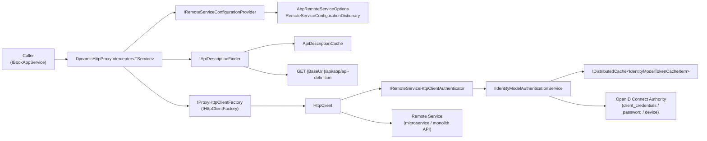
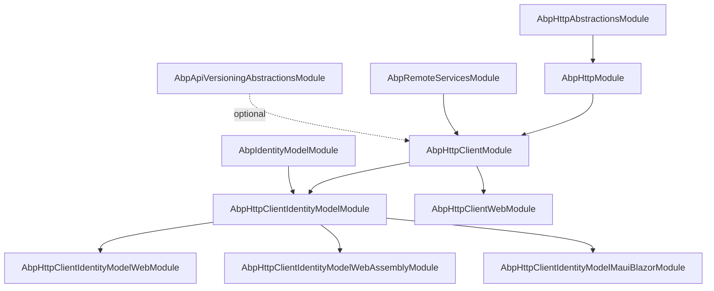
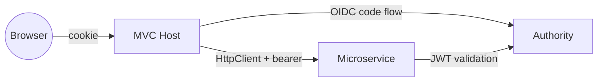
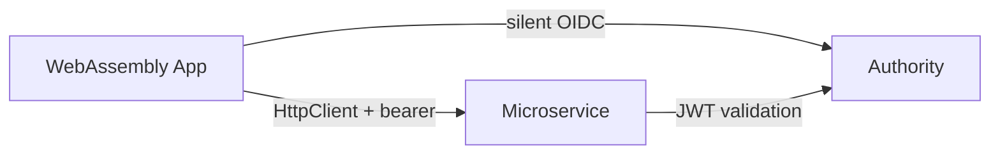
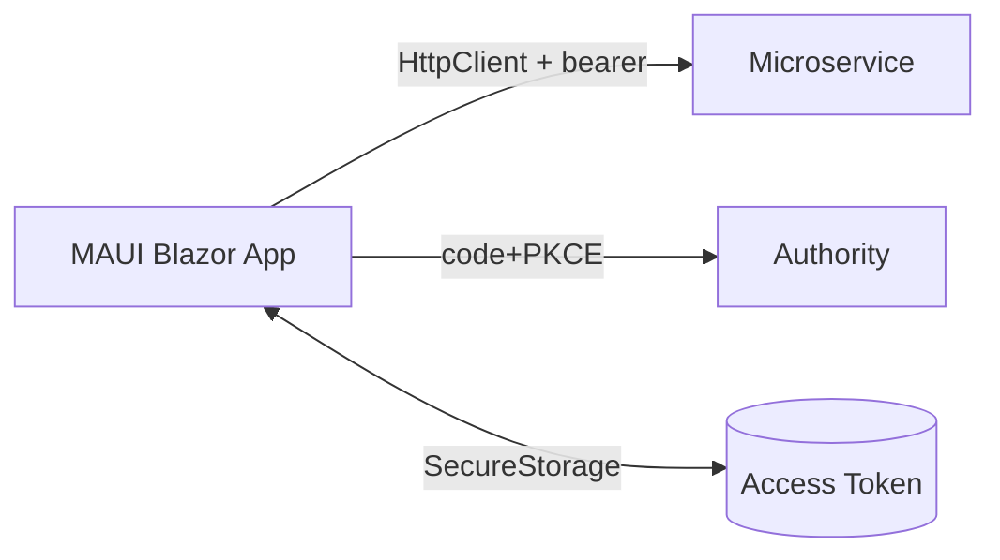
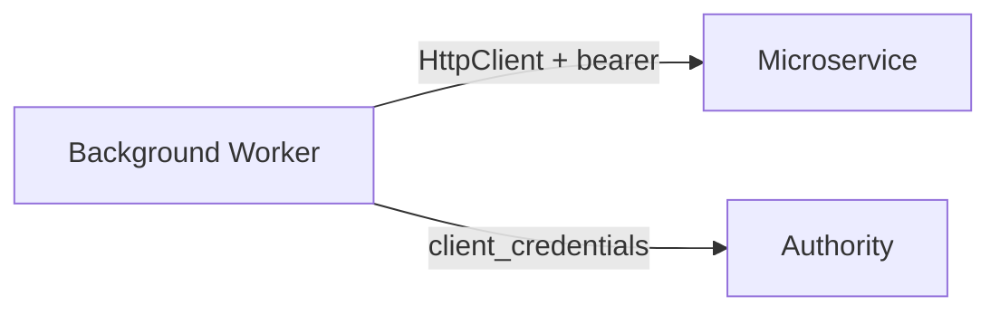

ABP ships a layered HTTP client stack so that calling a remote application service from C# looks like calling a local interface. Underneath, the framework resolves which microservice owns the call, fetches an `ApplicationApiDescriptionModel` to map the method onto an HTTP route, attaches a bearer token (obtained via Duende `IdentityModel` from your OpenID Connect authority), and dispatches the request through `IHttpClientFactory`. This section documents the packages that make that chain work.

The packages split along three axes — *abstractions* (DTOs and module markers), *runtime* (configuration providers, options, ApiDescription model), and *client* (interception, proxying, authentication, hosting-environment specific token providers).

## Architecture



The same diagram applies whether the caller is an MVC backend (`Volo.Abp.Http.Client.IdentityModel.Web`), a Blazor WebAssembly app (`.WebAssembly`), or a MAUI Blazor app (`.MauiBlazor`) — only the `IAbpAccessTokenProvider` implementation changes.

## Packages on this page

<CardGroup cols={2}>
  <Card title="Http.Abstractions" icon="cube" href="/http/http-abstractions">
    `AbpHttpAbstractionsModule`, `RemoteServiceErrorInfo`, `RemoteServiceValidationErrorInfo`, `IRemoteStreamContent`, `IHttpExceptionStatusCodeFinder`, ProxyScripting attributes, `RemoteServiceErrorResponse`.
  </Card>
  <Card title="Http" icon="globe" href="/http/http-module">
    `AbpHttpModule`, `AbpHttpClientOptions`, `IRemoteServiceConfigurationProvider`, `AbpRemoteServiceOptions`, `RemoteServiceConfiguration`, `IHttpClientProxy<T>`.
  </Card>
  <Card title="Http.Client" icon="bolt" href="/http/http-client">
    `DynamicHttpProxyInterceptor<TService>`, `ApiDescriptionFinder`, `ApiDescriptionCache`, `ClientProxyBase<TService>`, `AddHttpClientProxies()`.
  </Card>
  <Card title="Http.Client.IdentityModel" icon="key" href="/http/http-client-identitymodel">
    `IdentityModelRemoteServiceHttpClientAuthenticator` + Web / WebAssembly / MauiBlazor token providers.
  </Card>
  <Card title="Http.Client.Web" icon="browser" href="/http/http-client-web">
    Cookie/header passthrough for an MVC frontend that delegates to a microservice backend.
  </Card>
  <Card title="RemoteServices" icon="diagram-project" href="/http/remote-services">
    Marker module + options types shared by every HTTP client package.
  </Card>
  <Card title="IdentityModel" icon="lock" href="/http/identitymodel">
    `IIdentityModelAuthenticationService`, `AbpIdentityClientOptions`, distributed token cache, client_credentials / password / device flows.
  </Card>
  <Card title="ApiVersioning.Abstractions" icon="code-branch" href="/http/api-versioning">
    `IRequestedApiVersion` + null implementation used by the client proxy to forward the active API version.
  </Card>
</CardGroup>

## Request lifecycle

<Steps>
  <Step title="Caller invokes a typed interface">
    Your code calls `IBookAppService.GetListAsync(input)`. The DI container resolved that interface to a Castle dynamic proxy wired by `AddHttpClientProxies(typeof(BookHttpApiClientModule).Assembly)`.
  </Step>
  <Step title="DynamicHttpProxyInterceptor takes over">
    The Castle interceptor pulls `HttpClientProxyConfig` from `AbpHttpClientOptions.HttpClientProxies`, asks `IRemoteServiceConfigurationProvider` for the `RemoteServiceConfiguration` (BaseUrl, Version, IdentityClient name).
  </Step>
  <Step title="ApiDescription resolved">
    `ApiDescriptionFinder` calls `GET {BaseUrl}/api/abp/api-definition` (cached by `ApiDescriptionCache`) to retrieve the `ApplicationApiDescriptionModel` and matches the C# `MethodInfo` to an `ActionApiDescriptionModel`.
  </Step>
  <Step title="HttpClient built and authenticated">
    `IProxyHttpClientFactory.Create(remoteServiceName)` resolves a named `HttpClient`. `IRemoteServiceHttpClientAuthenticator` attaches an `Authorization: Bearer <token>` header — either the current user's access token (Web) or a service-to-service token from the `IIdentityModelAuthenticationService` cache.
  </Step>
  <Step title="Request dispatched, response deserialized">
    `ClientProxyRequestPayloadBuilder` shapes the body; `ClientProxyUrlBuilder` templates the URL. On non-2xx, the response is parsed as a `RemoteServiceErrorResponse` so the caller sees the original `BusinessException` / `AbpValidationException`.
  </Step>
</Steps>

## Testing the client stack

Because every proxy is just an interface registered in DI, testing the client side from an integration test is straightforward — replace the `HttpClient` (via `IHttpClientFactory`) with a fake handler, then drive your code as usual:

```csharp
[Fact]
public async Task GetListAsync_uses_proxy()
{
    var handler = new TestHttpMessageHandler();
    handler.RespondTo("GET", "/api/app/book")
           .WithJson(new PagedResultDto<BookDto> { /* ... */ });

    using var app = await CreateAppAsync(s =>
    {
        s.AddSingleton<IProxyHttpClientFactory>(new FakeProxyHttpClientFactory(handler));
    });

    var books = await app.ServiceProvider
        .GetRequiredService<IBookAppService>()
        .GetListAsync(new GetBookListInput());

    books.TotalCount.ShouldBe(1);
}
```

For *unit* tests of `ClientProxyBase<TService>` subclasses, build a `ClientProxyRequestContext` directly and call `RequestAsync<T>` — the base class only depends on the `IAbpLazyServiceProvider` you wire in.

## Related pages

- [Auth — JWT Bearer](/aspnetcore/auth-jwt-bearer) for the resource server side that validates the tokens these clients send.
- [Auth — OpenID Connect](/aspnetcore/auth-openidconnect) for the interactive sign-in path that produces the cookie used by `HttpContextAbpAccessTokenProvider`.
- [MVC Controllers and Conventions](/aspnetcore/mvc-controllers-and-conventions) for how server-side auto-controllers expose the routes the client proxies discover.
- [Dynamic HTTP API and Proxy Generation](/aspnetcore/mvc-controllers-and-conventions) for the end-to-end flow this section documents.

## Anatomy of a typed call

The simplest possible "call a remote IBookAppService" looks like this on the caller side:

```csharp
public class BooksPage
{
    private readonly IBookAppService _books;
    public BooksPage(IBookAppService books) => _books = books;

    public async Task<PagedResultDto<BookDto>> ListAsync()
    {
        return await _books.GetListAsync(new GetBookListInput { MaxResultCount = 50 });
    }
}
```

Behind that line, ABP performs roughly:

1. Castle proxy invokes `DynamicHttpProxyInterceptor<IBookAppService>.InterceptAsync`.
2. The interceptor builds a `ClientProxyRequestContext` from `(MethodInfo, args, TService)`.
3. `IRemoteServiceConfigurationProvider` resolves the `RemoteServiceConfiguration` named `"Default"`.
4. `ApiDescriptionFinder` consults `ApiDescriptionCache` for `{BaseUrl}/api/abp/api-definition`.
5. The matching `ActionApiDescriptionModel` is found by method name + parameter shape.
6. `ClientProxyUrlBuilder` produces the URL `/api/app/book?MaxResultCount=50`.
7. `IProxyHttpClientFactory.Create("Default")` returns a named `HttpClient`.
8. `IRemoteServiceHttpClientAuthenticator.Authenticate` attaches `Authorization: Bearer …`.
9. The HTTP call goes out, response is parsed, `PagedResultDto<BookDto>` is returned.

## Source layout

| Package | Path |
| --- | --- |
| `Volo.Abp.Http.Abstractions` | `framework/src/Volo.Abp.Http.Abstractions/` |
| `Volo.Abp.Http` | `framework/src/Volo.Abp.Http/` |
| `Volo.Abp.Http.Client` | `framework/src/Volo.Abp.Http.Client/` |
| `Volo.Abp.Http.Client.IdentityModel` | `framework/src/Volo.Abp.Http.Client.IdentityModel/` |
| `Volo.Abp.Http.Client.IdentityModel.Web` | `framework/src/Volo.Abp.Http.Client.IdentityModel.Web/` |
| `Volo.Abp.Http.Client.IdentityModel.WebAssembly` | `framework/src/Volo.Abp.Http.Client.IdentityModel.WebAssembly/` |
| `Volo.Abp.Http.Client.IdentityModel.MauiBlazor` | `framework/src/Volo.Abp.Http.Client.IdentityModel.MauiBlazor/` |
| `Volo.Abp.Http.Client.Web` | `framework/src/Volo.Abp.Http.Client.Web/` |
| `Volo.Abp.RemoteServices` | `framework/src/Volo.Abp.RemoteServices/` |
| `Volo.Abp.IdentityModel` | `framework/src/Volo.Abp.IdentityModel/` |
| `Volo.Abp.ApiVersioning.Abstractions` | `framework/src/Volo.Abp.ApiVersioning.Abstractions/` |

## Module dependency graph

The transitive `DependsOn` edges between the modules documented here form a layered DAG. Each higher layer can be loaded independently — you wire the variant that matches the host (MVC, WASM, MAUI, daemon) and inherit everything underneath.



## Configuration cheat-sheet

A single `appsettings.json` typically wires every package on this page:

```json
{
  "RemoteServices": {
    "Default":  { "BaseUrl": "https://api.acme.com/" },
    "Identity": { "BaseUrl": "https://identity.acme.com/" },
    "Saas":     { "BaseUrl": "https://saas.acme.com/", "IdentityClient": "Saas" }
  },
  "IdentityClients": {
    "Default": {
      "GrantType":    "client_credentials",
      "ClientId":     "web-service",
      "ClientSecret": "1q2w3e*",
      "Authority":    "https://identity.acme.com",
      "Scope":        "BookService SaasService"
    },
    "Saas": {
      "GrantType":    "client_credentials",
      "ClientId":     "saas-gateway",
      "ClientSecret": "1q2w3e*",
      "Authority":    "https://identity.acme.com",
      "Scope":        "SaasService"
    }
  }
}
```

- `RemoteServices` populates `AbpRemoteServiceOptions` (see [RemoteServices](/http/remote-services)).
- `IdentityClients` populates `AbpIdentityClientOptions` (see [IdentityModel](/http/identitymodel)).
- The `IdentityClient` key on a `RemoteServices` entry tells the [Client IdentityModel](/http/http-client-identitymodel) authenticator which identity client to use for that service.

## Registering proxies

Once configuration is in place, expose the proxies by depending on the matching `*HttpApiClientModule`:

```csharp
[DependsOn(
    typeof(AbpHttpClientIdentityModelWebModule),
    typeof(BookContractsModule))]
public class BookHttpApiClientModule : AbpModule
{
    public const string RemoteServiceName = "Default";

    public override void ConfigureServices(ServiceConfigurationContext context)
    {
        context.Services.AddHttpClientProxies(
            typeof(BookContractsModule).Assembly,
            RemoteServiceName);
    }
}
```

After that, every interface in `BookContractsModule.dll` that extends `IRemoteService` is resolvable from DI — the Castle proxy backed by `DynamicHttpProxyInterceptor<T>` does the rest.

## Error handling

Non-2xx responses from an ABP server are deserialized into a `RemoteServiceErrorResponse` and rethrown as the closest matching ABP exception:

| Server-side exception | HTTP status | Client-side exception |
| --- | --- | --- |
| `AbpAuthorizationException` (anonymous) | 401 | `AbpAuthorizationException` |
| `AbpAuthorizationException` (authenticated) | 403 | `AbpAuthorizationException` |
| `AbpValidationException` | 400 | `AbpValidationException` |
| `EntityNotFoundException` | 404 | `EntityNotFoundException` |
| `BusinessException(code, message)` | mapped via `IHttpExceptionStatusCodeFinder` | `AbpRemoteCallException` with `Code`/`Message`/`Details` populated |
| Anything else | 500 | `AbpRemoteCallException` |

A `ClientProxyExceptionEventData` local event is also published per failure so global observers (a 401 → re-sign-in handler, a 500 → toast notification) can react centrally.

## Glossary

| Term | Meaning |
| --- | --- |
| **Remote service name** | The key in `AbpRemoteServiceOptions.RemoteServices` (`"Default"`, `"Identity"`, …) that selects a `RemoteServiceConfiguration`. |
| **Identity client name** | The key in `AbpIdentityClientOptions.IdentityClients` that selects credentials for token acquisition. |
| **API description** | The `ApplicationApiDescriptionModel` returned by `GET /api/abp/api-definition` — the wire-level inventory used by both Swagger and the dynamic client proxy. |
| **Dynamic proxy** | Castle-generated runtime implementation of an `IRemoteService` interface, backed by `DynamicHttpProxyInterceptor<T>`. |
| **Static proxy** | Compile-time generated `*ClientProxy : ClientProxyBase<T>` class — preferred for AOT / trimming. |
| **Authenticator** | The `IRemoteServiceHttpClientAuthenticator` registered for the host — decides which token (user vs machine) goes on the outbound request. |
| **Access token provider** | `IAbpAccessTokenProvider` — host-specific source for the currently signed-in user's token (cookie / WASM / Maui). |

## Per-host topology

The same proxy infrastructure powers very different runtime topologies. The choice of *which* `IRemoteServiceHttpClientAuthenticator` and *which* `IAbpAccessTokenProvider` is registered is what makes each topology behave correctly.

### Server-rendered MVC frontend



The MVC host uses a sign-in cookie to authenticate the user, and `HttpContextAbpAccessTokenProvider` (from `Volo.Abp.Http.Client.IdentityModel.Web`) lifts the `access_token` claim out of the cookie to forward on outbound calls.

### Blazor WebAssembly



The browser talks directly to the microservice. `WebAssemblyAbpAccessTokenProvider` resolves the token from the Blazor `IAccessTokenProvider`, which keeps it in `sessionStorage`.

### MAUI Blazor hybrid



The MAUI app stores tokens in OS-level secure storage (Keychain on iOS, KeyStore on Android) — replace `MauiBlazorAbpAccessTokenProvider` with one that reads from `SecureStorage`.

### Headless service / background worker



There is no current user, so `IAbpAccessTokenProvider.GetTokenAsync()` returns `null` and the authenticator falls back to a machine token issued via `client_credentials`.

## Common pitfalls

<AccordionGroup>
  <Accordion title="`Could not get DynamicHttpClientProxyConfig for IBookAppService`">
    The interface was never registered with `AddHttpClientProxies(assembly, name)`. Check that the assembly really contains the interface and that the calling module `DependsOn` your `*HttpApiClientModule`.
  </Accordion>
  <Accordion title="Calls go out but the server returns 401">
    Either no `IdentityClient` is configured for the matching remote service name, or the configured client's scope doesn't include the resource API. Run with `LogLevel.Debug` on `Volo.Abp.IdentityModel.*` to see the discovery + token request.
  </Accordion>
  <Accordion title="Action description not found at runtime">
    The server-side controller doesn't declare `: IBookAppService`. `ApiDescriptionFinder` only inspects controllers that implement the requested service type (`ControllerInterfaceApiDescriptionModel.Implements`).
  </Accordion>
  <Accordion title="Multi-tenant URL rewriting doesn't fire">
    `RemoteServiceConfigurationProvider` is `IScopedDependency` — make sure the call originates inside a scope where `ICurrentTenant` is set. Background workers should `using (_currentTenant.Change(tenantId)) { ... }` before invoking the proxy.
  </Accordion>
</AccordionGroup>
