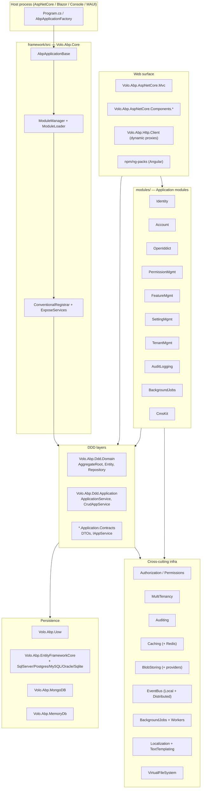

ABP is a modular, opinionated application framework for ASP.NET Core that sits between raw `Microsoft.AspNetCore.*` and a business application. This wiki is the internal map of the `abpframework/abp` monorepo: every framework package, every application module, every CLI command, every theme, and every solution template — grounded in concrete file paths so an engineer or coding agent can locate, read, or modify code without grepping blind.

## What lives in this repository

The repo is one logical product split across five top-level source trees:

- **`framework/src`** — 166 NuGet packages that make up the framework runtime (`Volo.Abp.*`). Everything from the module system in `Volo.Abp.Core` to ASP.NET Core MVC integration, Blazor support, EF Core, MongoDB, event buses, BLOB storing, caching, auditing, localization, multi-tenancy, and the ABP CLI.
- **`modules/`** — 18 first-party application modules with full DDD layering (Domain.Shared, Domain, Application.Contracts, Application, HttpApi, HttpApi.Client, Web, Blazor, EntityFrameworkCore, MongoDB, Installer). Identity, Account, OpenIddict, IdentityServer, Permission/Feature/Setting/Tenant management, Audit Logging, Background Jobs, CMS Kit, Blogging, Docs, BLOB Storing Database, Basic Theme, Users, Virtual File Explorer, Client Simulation.
- **`templates/`** — Solution templates the CLI's `abp new` materializes (`app`, `app-nolayers`, `module`, `console`, `maui`, `wpf`), each with `aspnet-core` and (where applicable) `angular` variants.
- **`npm/ng-packs`** — Angular UI workspace (Nx + Lerna) with 14 packages: `core`, `components`, `theme-shared`, `theme-basic`, `account`, `identity`, `permission-management`, `feature-management`, `setting-management`, `tenant-management`, `oauth`, `generators`, `schematics`.
- **`npm/packs`** — JavaScript/CSS distribution packs (Bootstrap, jQuery, DataTables, FontAwesome, CmsKit assets, ABP theme assets) consumed by MVC views and Blazor Server via `abp install-libs`.

Build orchestration (`build/*.ps1`, `deploy/*.ps1`), per-module test trees (`framework/test/`, `modules/*/test/`), source-code distributions for ABP Studio (`source-code/`, `studio/source-codes/`), and CLI tooling (`tools/`) round out the tree.

## Architecture at a glance

## Repository map

| Path | What lives there | Wiki page |
|---|---|---|
| `framework/src/Volo.Abp.Core` | Module system, DI, AbpApplicationBase, exceptions, threading primitives | [Volo.Abp.Core](/core/volo-abp-core) |
| `framework/src/Volo.Abp.Ddd.Domain` | `AggregateRoot`, `Entity`, `IRepository`, domain events | [DDD: Domain](/ddd/domain) |
| `framework/src/Volo.Abp.Ddd.Application` | `ApplicationService`, `CrudAppService`, object mapping | [DDD: Application](/ddd/application) |
| `framework/src/Volo.Abp.Data` | `IDataFilter`, `IDataSeeder`, connection strings | [Data overview](/data/overview) |
| `framework/src/Volo.Abp.Uow` | Unit of Work, `[UnitOfWork]` attribute, transactions | [Unit of Work](/data/unit-of-work) |
| `framework/src/Volo.Abp.EntityFrameworkCore*` | EF Core integration + per-provider packages | [EFCore](/data/entityframeworkcore) |
| `framework/src/Volo.Abp.MongoDB` | MongoDB repository implementation | [MongoDB](/data/mongodb) |
| `framework/src/Volo.Abp.AspNetCore.Mvc` | `AbpController`, dynamic controllers, conventions | [MVC module](/aspnetcore/mvc-module) |
| `framework/src/Volo.Abp.AspNetCore.Components.*` | Blazor Web / Server / WebAssembly / MauiBlazor | [Blazor overview](/blazor/overview) |
| `framework/src/Volo.Abp.MultiTenancy` + `AspNetCore.MultiTenancy` | Tenant resolution, middleware | [Multi-Tenancy](/tenancy/overview) |
| `framework/src/Volo.Abp.Authorization` | Permission checker, policy provider | [Authorization](/security/authorization) |
| `framework/src/Volo.Abp.EventBus*` | Local + distributed event buses (RabbitMQ/Kafka/Azure/Dapr/Rebus) | [Event Bus](/eventbus/overview) |
| `framework/src/Volo.Abp.BackgroundJobs*` + `BackgroundWorkers*` | Job manager, Hangfire/Quartz providers | [Background Work](/background/overview) |
| `framework/src/Volo.Abp.BlobStoring*` | BLOB container + FileSystem/Azure/AWS/Google/Aliyun/Minio/Bunny providers | [BLOB Storing](/blob/overview) |
| `framework/src/Volo.Abp.Caching*` | Distributed cache wrapper + Redis | [Caching](/caching/overview) |
| `framework/src/Volo.Abp.Localization*` + `TextTemplating*` | Localization + Razor/Scriban templates | [Localization](/localization/overview) |
| `framework/src/Volo.Abp.Cli*` | The `abp` CLI tool and command implementations | [ABP CLI](/cli/overview) |
| `modules/identity` | Identity module (users, roles, OUs, sessions) | [Identity module](/modules/identity/overview) |
| `modules/account` | Login, register, profile, external logins | [Account module](/modules/account/overview) |
| `modules/openiddict` | OpenIddict-based auth server | [OpenIddict module](/modules/openiddict/overview) |
| `modules/permission-management` | Permission persistence + grant management | [Permission Mgmt](/modules/permission-management/overview) |
| `modules/feature-management` | Feature value persistence | [Feature Mgmt](/modules/feature-management/overview) |
| `modules/setting-management` | Setting value persistence | [Setting Mgmt](/modules/setting-management/overview) |
| `modules/tenant-management` | Tenant CRUD + connection strings | [Tenant Mgmt](/modules/tenant-management/overview) |
| `modules/audit-logging` | Audit log persistence | [Audit Logging](/modules/audit-logging/overview) |
| `modules/background-jobs` | Persistent job store | [BG Jobs module](/modules/background-jobs/overview) |
| `modules/cms-kit` | Blogs, pages, comments, tags, ratings, menus, reactions | [CMS Kit](/modules/cms-kit/overview) |
| `modules/blogging` | Standalone blogging module | [Blogging](/modules/blogging/overview) |
| `modules/docs` | In-app documentation viewer | [Docs module](/modules/docs/overview) |
| `modules/blob-storing-database` | DB-backed BLOB provider | [BLOB DB module](/modules/blob-storing-database/overview) |
| `modules/basic-theme` | Bootstrap-based MVC + Blazor theme | [Basic Theme](/modules/basic-theme/overview) |
| `modules/users` | Cross-module `IUserData` abstractions | [Users module](/modules/users/overview) |
| `modules/virtual-file-explorer` | Diagnostic UI for the virtual FS | [VFS Explorer](/modules/virtual-file-explorer/overview) |
| `modules/client-simulation` | Load/SignalR simulation module | [Client Simulation](/modules/client-simulation/overview) |
| `templates/app`, `templates/app-nolayers`, `templates/module`, `templates/console`, `templates/maui`, `templates/wpf` | Solution templates materialized by `abp new` | [Templates overview](/templates/overview) |
| `npm/ng-packs/packages/*` | Angular UI workspace (Nx) | [Angular overview](/angular/overview) |
| `npm/packs/*` | JS/CSS asset packs for MVC/Blazor Server | [Resource packs](/packs/overview) |
| `framework/test/`, `modules/*/test/` | xUnit + Shouldly per-package tests | [Testing](/testing/overview) |
| `build/`, `deploy/` | PowerShell build/test/release scripts | [Build & Deploy](/build/overview) |

## Subsystem map

<CardGroup cols={2}>
  <Card title="Overview & Architecture" icon="map" href="/overview/architecture">
    Layered architecture, solution conventions, build system entry points.
  </Card>
  <Card title="Core Runtime" icon="microchip" href="/core/overview">
    `AbpApplicationBase`, module lifecycle, conventional DI, exceptions, threading.
  </Card>
  <Card title="DDD Building Blocks" icon="cubes" href="/ddd/overview">
    Entities, aggregates, repositories, domain services, application services, mapping.
  </Card>
  <Card title="Data & Persistence" icon="database" href="/data/overview">
    Unit of Work, EF Core providers, MongoDB, MemoryDb, Dapper, data filtering & seeding.
  </Card>
  <Card title="AspNetCore & MVC" icon="server" href="/aspnetcore/overview">
    `AbpController`, dynamic API controllers, bundling, widgets, authentication.
  </Card>
  <Card title="Blazor & Components" icon="bolt" href="/blazor/overview">
    Blazor Web, Server, WebAssembly, MauiBlazor + theming + Blazorise UI.
  </Card>
  <Card title="Theming & UI" icon="palette" href="/ui/overview">
    Bootstrap theme, basic theme, navigation/menus, virtual file system, minify.
  </Card>
  <Card title="Authorization & Security" icon="shield" href="/security/overview">
    Permissions, features, settings, GDPR, anti-forgery, encryption.
  </Card>
  <Card title="Multi-Tenancy" icon="building" href="/tenancy/overview">
    `ICurrentTenant`, `ITenantStore`, resolution middleware, tenant data filter.
  </Card>
  <Card title="HTTP & Remote Services" icon="globe" href="/http/overview">
    Dynamic HTTP API clients, `IdentityModel`, API versioning, remote services.
  </Card>
  <Card title="Event Bus" icon="tower-broadcast" href="/eventbus/overview">
    Local + distributed event buses, RabbitMQ/Kafka/Azure/Dapr/Rebus transports.
  </Card>
  <Card title="Background Work" icon="clock" href="/background/overview">
    Job manager, default/Hangfire/Quartz/RabbitMQ providers, workers.
  </Card>
  <Card title="Caching" icon="layer-group" href="/caching/overview">
    `IDistributedCache<T>`, StackExchange.Redis provider.
  </Card>
  <Card title="BLOB Storing" icon="folder-tree" href="/blob/overview">
    Containers + 8 providers (FileSystem/Azure/AWS/Google/Aliyun/Minio/Bunny/Memory).
  </Card>
  <Card title="Auditing" icon="clipboard-list" href="/auditing/overview">
    `IAuditingHelper`, audit logging persistence module.
  </Card>
  <Card title="Localization" icon="language" href="/localization/overview">
    `IStringLocalizer`, multi-lingual entities, Razor/Scriban templating.
  </Card>
  <Card title="Distributed Systems" icon="network-wired" href="/distributed/overview">
    Distributed locking, Dapr integration, sidecar HTTP/event/lock primitives.
  </Card>
  <Card title="Messaging Transports" icon="diagram-project" href="/transports/overview">
    RabbitMQ, Kafka, Azure Service Bus low-level packages.
  </Card>
  <Card title="Validation & Mapping" icon="check-double" href="/validation/overview">
    Validation core, FluentValidation, AutoMapper, Mapperly integrations.
  </Card>
  <Card title="Misc Infrastructure" icon="screwdriver-wrench" href="/misc/overview">
    Emailing, SMS, imaging, JSON, AI abstractions, LDAP.
  </Card>
  <Card title="Identity Module" icon="user-shield" href="/modules/identity/overview">
    Users, roles, organization units, sessions, dynamic claims.
  </Card>
  <Card title="Account Module" icon="address-card" href="/modules/account/overview">
    Login/register, profile, external/social logins, password mgmt.
  </Card>
  <Card title="OpenIddict Module" icon="key" href="/modules/openiddict/overview">
    OpenIddict applications/scopes/tokens + ABP wiring.
  </Card>
  <Card title="IdentityServer Module" icon="lock" href="/modules/identityserver/overview">
    Legacy Duende-IdentityServer integration.
  </Card>
  <Card title="Permission Mgmt" icon="user-lock" href="/modules/permission-management/overview">
    Per-user, per-role, per-client permission grants and store.
  </Card>
  <Card title="Feature Mgmt" icon="toggle-on" href="/modules/feature-management/overview">
    Edition/tenant feature value store + management UI.
  </Card>
  <Card title="Setting Mgmt" icon="sliders" href="/modules/setting-management/overview">
    User/tenant/global setting persistence + management UI.
  </Card>
  <Card title="Tenant Mgmt" icon="buildings" href="/modules/tenant-management/overview">
    Tenant entities, connection strings, admin UI.
  </Card>
  <Card title="Audit Logging" icon="file-lines" href="/modules/audit-logging/overview">
    Persisted audit log entries with EF Core/Mongo stores.
  </Card>
  <Card title="Background Jobs" icon="hourglass-half" href="/modules/background-jobs/overview">
    Persistent job store backing the default background job manager.
  </Card>
  <Card title="CMS Kit" icon="newspaper" href="/modules/cms-kit/overview">
    Blogs, pages, comments, tags, ratings, menus, reactions, media.
  </Card>
  <Card title="Blogging" icon="blog" href="/modules/blogging/overview">
    Standalone blogging module (predecessor to CMS Kit blogs).
  </Card>
  <Card title="Docs Module" icon="book" href="/modules/docs/overview">
    Multi-version, multi-language docs viewer used by docs.abp.io.
  </Card>
  <Card title="BLOB DB Module" icon="hard-drive" href="/modules/blob-storing-database/overview">
    Database-backed BLOB storage provider with EF Core/Mongo stores.
  </Card>
  <Card title="Themes & Misc" icon="paint-roller" href="/modules/basic-theme/overview">
    Basic theme, virtual file explorer, users, client simulation.
  </Card>
  <Card title="Angular UI" icon="angular" href="/angular/overview">
    `@abp/ng.core`, `@abp/ng.identity`, theme packages, generators & schematics.
  </Card>
  <Card title="Resource Packs" icon="box-archive" href="/packs/overview">
    JS/CSS asset packages staged into wwwroot by `abp install-libs`.
  </Card>
  <Card title="ABP CLI" icon="terminal" href="/cli/overview">
    `abp new`, `build`, `bundle`, `install-libs`, `generate-proxy`, `login`, etc.
  </Card>
  <Card title="Solution Templates" icon="file-zipper" href="/templates/overview">
    `app`, `app-nolayers`, `module`, `console`, `maui`, `wpf`.
  </Card>
  <Card title="Testing" icon="vial" href="/testing/overview">
    Test base classes, per-module xUnit + Shouldly suites.
  </Card>
  <Card title="Key Flows" icon="route" href="/core/abp-application-base">
    End-to-end traces: bootstrap, request pipeline, UoW, events, jobs, proxies.
  </Card>
  <Card title="Configuration" icon="gear" href="/config/overview">
    `Directory.Build.props`, `common.props`, packaging conventions.
  </Card>
  <Card title="Build & Deploy" icon="rocket" href="/build/overview">
    `build/*.ps1`, `deploy/*.ps1`, NuGet + npm publishing.
  </Card>
</CardGroup>

## Where to start

<Note>
If you are a coding agent landing on the repo for the first time, read in this order:

1. [Architecture](/overview/architecture) — layered architecture model and how modules compose.
2. [Repository layout](/overview/repository-layout) — annotated directory map of every top-level tree.
3. [Application bootstrap flow](/core/abp-application-base) — what happens when `AbpApplicationFactory.Create` runs, step by step.
4. [Modularity](/core/modularity) — `AbpModule`, `[DependsOn]`, `ConfigureServices`, `OnApplicationInitialization`.
5. [DDD overview](/ddd/overview) — the layered project pattern every module follows.
</Note>

**Key entry points in source**:

- `framework/src/Volo.Abp.Core/Volo/Abp/AbpApplicationFactory.cs` — `Create<TStartupModule>(...)` builder used by every host.
- `framework/src/Volo.Abp.Core/Volo/Abp/AbpApplicationBase.cs` — module discovery, service registration, lifecycle.
- `framework/src/Volo.Abp.Core/Volo/Abp/Modularity/AbpModule.cs` — base class every module derives from.
- `framework/src/Volo.Abp.Core/Volo/Abp/Modularity/ModuleManager.cs` — runs `PreConfigureServices` → `ConfigureServices` → `PostConfigureServices` → `OnApplicationInitialization`.
- `framework/src/Volo.Abp.Cli/Volo/Abp/Cli/Program.cs` — `abp` CLI entry point that bootstraps `AbpCliModule`.
- `templates/app/aspnet-core/src/MyCompanyName.MyProjectName.Web/Program.cs` — canonical host wiring used by every generated solution.

Each subsystem card above expands into a tree of per-module deep-dive pages — open the card to drill in.
