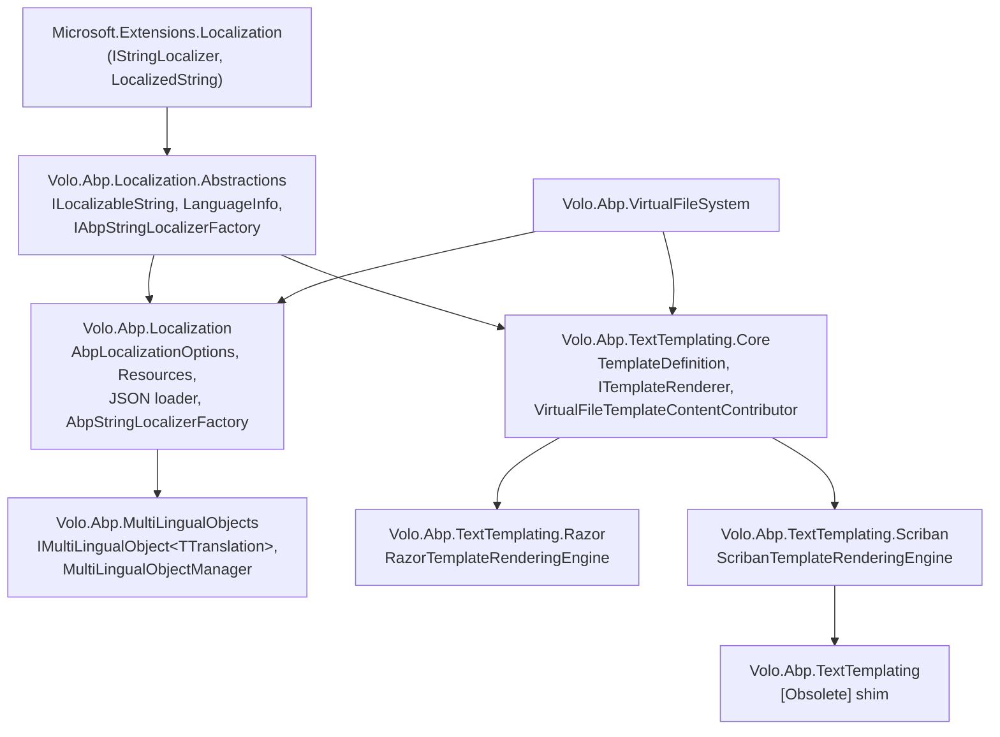

ABP's localization stack is a thin, opinionated layer over `Microsoft.Extensions.Localization`. Instead of `.resx` files, ABP organizes translations around **localization resource types** — empty C# classes that act as keys for JSON dictionaries loaded from the [virtual file system](/ui/virtual-file-system). The same `IStringLocalizer<TResource>` you would use in stock ASP.NET Core continues to work, but the factory behind it is replaced with one that understands ABP resources, base-resource inheritance, fallback culture chains, and contributors that can be added from any module.

On top of that core sit three additional concerns that share the same vocabulary of "resources" and "language info":

- **Multi-lingual objects** — a pattern for entities that carry their own translations in a related table (`IMultiLingualObject<TTranslation>`), used by [CMS Kit](/modules/cms-kit/overview) pages, blog posts, and similar content.
- **Text templating** — a runtime that turns named, virtual-file-backed templates into rendered strings (used for emails, notifications, SMS, code generation).
- **Templating engines** — pluggable renderers, with first-party packages for **Razor** and **Scriban**.

This section walks the modules in dependency order: abstractions → core localization → multi-lingual objects → text templating core → Razor → Scriban.

## Package map

The implementation lives in six adjacent projects under `framework/src/`:

```
framework/src/
├── Volo.Abp.Localization.Abstractions/    # ILocalizableString, LanguageInfo, IAbpStringLocalizerFactory
├── Volo.Abp.Localization/                 # AbpLocalizationOptions, JSON loader, AbpStringLocalizerFactory
├── Volo.Abp.MultiLingualObjects/          # IMultiLingualObject<TTranslation>, MultiLingualObjectManager
├── Volo.Abp.TextTemplating.Core/          # TemplateDefinition, ITemplateRenderer, content contributors
├── Volo.Abp.TextTemplating.Razor/         # RazorTemplateRenderingEngine
└── Volo.Abp.TextTemplating.Scriban/       # ScribanTemplateRenderingEngine
```

`Volo.Abp.TextTemplating` itself is a thin compatibility shim that depends on the Scriban module and is marked `[Obsolete]` — see [text-templating](/localization/text-templating).

<CardGroup cols={2}>
  <Card title="Abstractions" icon="cube" href="/localization/abstractions">
    `ILocalizableString`, `LocalizableString`, `FixedLocalizableString`, `IAbpStringLocalizerFactory`, `LanguageInfo`, `ILanguageProvider`.
  </Card>
  <Card title="Resources & JSON loader" icon="database" href="/localization/multi-lingual-objects">
    `AbpLocalizationOptions.Resources`, `LocalizationResource`, JSON dictionary contributors, `AbpStringLocalizerFactory`, multi-lingual entities.
  </Card>
  <Card title="Text templating core" icon="file-lines" href="/localization/text-templating">
    `TemplateDefinitionProvider`, `ITemplateDefinitionManager`, `ITemplateRenderer`, `ITemplateContentContributor`, virtual-file contributor.
  </Card>
  <Card title="Razor engine" icon="bolt" href="/localization/text-templating-razor">
    `RazorTemplateRenderingEngine` — Roslyn-compiled `IRazorTemplatePage<TModel>` with `Layout`, `Localizer`, `Model`, encoders.
  </Card>
  <Card title="Scriban engine" icon="scroll" href="/localization/text-templating-scriban">
    `ScribanTemplateRenderingEngine` — `{{ }}` syntax, `ScribanTemplateLocalizer` for `L "Key"`, the default engine.
  </Card>
  <Card title="Virtual file system" icon="folder-tree" href="/ui/virtual-file-system">
    JSON files and `.cshtml`/`.tpl` templates are all served from `IVirtualFileProvider` — see how `AddEmbedded<T>` ships them in DLLs.
  </Card>
</CardGroup>

## How a localized string is resolved

The `AbpStringLocalizerFactory` is registered as a replacement for the framework `ResourceManagerStringLocalizerFactory`. When you inject `IStringLocalizer<TResource>`, the following walk happens on the **first call per resource type** (results are cached in a `ConcurrentDictionary<string, StringLocalizerCacheItem>`):

```mermaid
flowchart TD
    A["Constructor injects<br/>IStringLocalizer&lt;BookStoreResource&gt;"] --> B["AbpStringLocalizerFactory.Create(typeof(BookStoreResource))"]
    B --> C{"Resource registered<br/>in Options.Resources?"}
    C -- "no" --> D["Fall back to<br/>ResourceManagerStringLocalizerFactory"]
    C -- "yes" --> E["Look up LocalizationResource<br/>via LocalizationResourceNameAttribute.GetName(type)"]
    E --> F["Run Contributors<br/>(JsonVirtualFileLocalizationResourceContributor, etc.)"]
    F --> G["StaticLocalizationDictionary&lt;culture&gt;<br/>built once, cached per culture"]
    G --> H["AbpDictionaryBasedStringLocalizer<br/>wraps the dictionaries"]
    H --> I["localizer[\"Welcome\"] →<br/>LocalizedString"]
    I --> J{"Found?"}
    J -- "no, has base resource" --> K["Try BaseResourceNames<br/>chain"]
    J -- "no, TryToGetFromBaseCulture" --> L["Strip region (tr-TR → tr)"]
    J -- "no, TryToGetFromDefaultCulture" --> M["DefaultCultureName"]
    J -- "yes" --> N["return LocalizedString"]
    K --> N
    L --> N
    M --> N
```

This is the same diagram you can trace by reading `AbpStringLocalizerFactory.Create(Type)` and `AbpDictionaryBasedStringLocalizer.GetAllStrings(...)` in `framework/src/Volo.Abp.Localization/Volo/Abp/Localization/`.

## Minimal end-to-end example

Configuring the localization stack in a module follows the same `Configure<TOptions>` pattern documented in [options and configuration](/core/options-and-configuration):

```csharp
[DependsOn(
    typeof(AbpLocalizationModule),
    typeof(AbpTextTemplatingScribanModule)
)]
public class BookStoreDomainModule : AbpModule
{
    public override void ConfigureServices(ServiceConfigurationContext context)
    {
        Configure<AbpVirtualFileSystemOptions>(options =>
        {
            options.FileSets.AddEmbedded<BookStoreDomainModule>();
        });

        Configure<AbpLocalizationOptions>(options =>
        {
            options.Resources
                .Add<BookStoreResource>("en")
                .AddVirtualJson("/Localization/BookStore");

            options.Languages.Add(new LanguageInfo("en", "en", "English"));
            options.Languages.Add(new LanguageInfo("tr", "tr", "Türkçe"));
        });
    }
}
```

```csharp
[LocalizationResourceName("BookStore")]
public class BookStoreResource
{
}
```

`/Localization/BookStore/en.json` (embedded resource):

```json
{
  "culture": "en",
  "texts": {
    "Welcome": "Welcome to the Book Store",
    "BookCount": "There are {0} books"
  }
}
```

Consumer:

```csharp
public class BookAppService : ApplicationService
{
    public BookAppService(IStringLocalizer<BookStoreResource> localizer)
    {
        L = localizer;
    }

    protected IStringLocalizer<BookStoreResource> L { get; }

    public string Greet(int count) => L["BookCount", count];
}
```

## Where each concern lives

<AccordionGroup>
  <Accordion title="Defining keys and looking up text">
    [`AbpLocalizationOptions`](/localization/multi-lingual-objects), `LocalizationResource`, `AbpStringLocalizerFactory`. JSON files are loaded by `JsonVirtualFileLocalizationResourceContributor` from the [virtual file system](/ui/virtual-file-system).
  </Accordion>
  <Accordion title="Deferring a string until you have a factory">
    [`ILocalizableString`](/localization/abstractions) and its concrete implementations (`LocalizableString`, `FixedLocalizableString`). The framework uses these wherever a key must be carried around without resolving it yet (menu items, permission display names, template `DisplayName`).
  </Accordion>
  <Accordion title="Entities that carry their own translations">
    [`IMultiLingualObject<TTranslation>` and `MultiLingualObjectManager`](/localization/multi-lingual-objects) — used by [CMS Kit](/modules/cms-kit/overview) pages, tags, blog posts, and any entity that has a `Translations` collection.
  </Accordion>
  <Accordion title="Rendering email, SMS, and notification bodies">
    [`ITemplateRenderer`](/localization/text-templating). Templates are named, defined by `TemplateDefinitionProvider`, and their content is loaded by `ITemplateContentContributor` implementations (the default `VirtualFileTemplateContentContributor` reads `.tpl` and `.cshtml` files from the [virtual file system](/ui/virtual-file-system)).
  </Accordion>
  <Accordion title="Choosing a template syntax">
    Pick exactly one engine module per host: [`AbpTextTemplatingScribanModule`](/localization/text-templating-scriban) (default, `{{ }}` syntax, safe for end-user templates) or [`AbpTextTemplatingRazorModule`](/localization/text-templating-razor) (full C# in `.cshtml`, model-typed, Layouts).
  </Accordion>
</AccordionGroup>

## Reading order

If this is your first encounter with the ABP localization stack, read the section pages in the order the sidebar lists them:

1. [Abstractions](/localization/abstractions) introduces `ILocalizableString` (a *deferred* string lookup), `LocalizableString`, `FixedLocalizableString`, and the `IAbpStringLocalizerFactory` extensions. These three types appear in every other page, so the rest of the section is much easier once they are familiar.
2. [Resources and entities](/localization/multi-lingual-objects) is the heaviest page — it walks `AbpLocalizationOptions`, `LocalizationResource`, the JSON dictionary loader, the `AbpStringLocalizerFactory` replacement, and then the multi-lingual-entity pattern that builds on the same `LanguageInfo` metadata.
3. [Text templating](/localization/text-templating) covers the engine-agnostic layer: how a template is **defined** (`TemplateDefinitionProvider`, `TemplateDefinition`), how its content is **loaded** (`ITemplateContentProvider`, `ITemplateContentContributor`), and how `AbpTemplateRenderer` dispatches to a rendering engine.
4. [Razor engine](/localization/text-templating-razor) and [Scriban engine](/localization/text-templating-scriban) — pick one. Each page is self-contained and assumes you've already read the core page.

## Module dependency graph

These six packages stack on top of `Microsoft.Extensions.Localization` and the [virtual file system](/ui/virtual-file-system) — read top-to-bottom as "what you must depend on to get feature X":



A host application typically depends on:

- `Volo.Abp.Localization` (which pulls in the abstractions).
- `Volo.Abp.MultiLingualObjects` if any entity is multi-lingual.
- **Exactly one** of `Volo.Abp.TextTemplating.Razor` or `Volo.Abp.TextTemplating.Scriban` (or skip text templating entirely).

The `Volo.Abp.TextTemplating` shim exists only for back-compat — its module is `[Obsolete]` and just re-exports the Scriban one. See [text-templating](/localization/text-templating).

## Where each feature lives in source

For every concept this section covers, the table below tells you the exact file in `framework/src/` so you can read the implementation directly:

| Concept                          | File                                                                                       |
| -------------------------------- | ------------------------------------------------------------------------------------------ |
| Deferred string                  | `Volo.Abp.Localization.Abstractions/Volo/Abp/Localization/ILocalizableString.cs`           |
| Typed deferred string            | `Volo.Abp.Localization.Abstractions/Volo/Abp/Localization/LocalizableString.cs`            |
| Literal pass-through             | `Volo.Abp.Localization.Abstractions/Volo/Abp/Localization/FixedLocalizableString.cs`       |
| Resource-name attribute          | `Volo.Abp.Localization.Abstractions/Volo/Abp/Localization/LocalizationResourceNameAttribute.cs` |
| ABP factory contract             | `Volo.Abp.Localization.Abstractions/Microsoft/Extensions/Localization/IAbpStringLocalizerFactory.cs` |
| Language metadata                | `Volo.Abp.Localization/Volo/Abp/Localization/LanguageInfo.cs`                              |
| Language provider                | `Volo.Abp.Localization/Volo/Abp/Localization/DefaultLanguageProvider.cs`                   |
| Options                          | `Volo.Abp.Localization/Volo/Abp/Localization/AbpLocalizationOptions.cs`                    |
| Resource type                    | `Volo.Abp.Localization/Volo/Abp/Localization/LocalizationResource.cs`                      |
| Resource dictionary              | `Volo.Abp.Localization/Volo/Abp/Localization/LocalizationResourceDictionary.cs`            |
| JSON loader                      | `Volo.Abp.Localization/Volo/Abp/Localization/Json/JsonLocalizationDictionaryBuilder.cs`    |
| Factory replacement              | `Volo.Abp.Localization/Volo/Abp/Localization/AbpStringLocalizerFactory.cs`                 |
| Multi-lingual entity contract    | `Volo.Abp.MultiLingualObjects/Volo/Abp/MultiLingualObjects/IMultiLingualObject.cs`         |
| Translation row contract         | `Volo.Abp.MultiLingualObjects/Volo/Abp/MultiLingualObjects/IObjectTranslation.cs`          |
| Translation manager              | `Volo.Abp.MultiLingualObjects/Volo/Abp/MultiLingualObjects/MultiLingualObjectManager.cs`   |
| Template definition              | `Volo.Abp.TextTemplating.Core/Volo/Abp/TextTemplating/TemplateDefinition.cs`               |
| Template renderer (entry point)  | `Volo.Abp.TextTemplating.Core/Volo/Abp/TextTemplating/AbpTemplateRenderer.cs`              |
| Content provider (culture walk)  | `Volo.Abp.TextTemplating.Core/Volo/Abp/TextTemplating/TemplateContentProvider.cs`          |
| Virtual-file content contributor | `Volo.Abp.TextTemplating.Core/Volo/Abp/TextTemplating/VirtualFiles/VirtualFileTemplateContentContributor.cs` |
| Razor engine                     | `Volo.Abp.TextTemplating.Razor/Volo/Abp/TextTemplating/Razor/RazorTemplateRenderingEngine.cs` |
| Scriban engine                   | `Volo.Abp.TextTemplating.Scriban/Volo/Abp/TextTemplating/Scriban/ScribanTemplateRenderingEngine.cs` |
| Scriban `L` function             | `Volo.Abp.TextTemplating.Scriban/Volo/Abp/TextTemplating/Scriban/ScribanTemplateLocalizer.cs` |

## Conventions used in this section

- **Resource name** — the string ABP uses internally as the resource key. Defaults to `Type.FullName`, but is normally overridden with `[LocalizationResourceName("BookStore")]` on the marker class.
- **Localizer convention** — by ABP code style the injected localizer is held in a protected property called `L` (or `_l` in a field). All framework code follows this; the property name is not enforced by the framework.
- **Culture chain** — current → base culture (strip region) → resource `DefaultCultureName` → registered base resources. Enabled by `TryToGetFromBaseCulture` and `TryToGetFromDefaultCulture` on `AbpLocalizationOptions`.
- **"Inline localized" templates** — a template flag (`TemplateDefinition.IsInlineLocalized = true`) that says the template body itself is culture-independent and uses `L "Key"` calls to localize at render time, instead of having one file per culture.

## Naming convention for keys

JSON files flatten nested keys with a `__` separator — both forms in the file below produce the same dictionary entries (`Menu__Books`, `Menu__Authors`):

```json
{
  "culture": "en",
  "texts": {
    "Menu__Books": "Books",
    "Menu": { "Authors": "Authors" }
  }
}
```

A few conventions ABP modules follow that are worth copying:

- **Display names of definitions** — keys are prefixed with the object kind: `Permission:Books.Delete`, `Setting:DefaultLanguage`, `Feature:MaxBookCount`. This keeps a single resource readable when it contains hundreds of entries.
- **Menu items** — prefix with `Menu:` (e.g. `Menu:Books`). The standard menu contributors in `Volo.Abp.UI.Navigation` look up keys in this shape.
- **Validation messages** — never hard-code message text in C#; raise `BusinessException("MyApp:010001").WithData("BookName", name)` and put the format string in the resource keyed by `MyApp:010001`. See exception localization in the core docs.
- **Plurals and counts** — pass arguments positionally (`L["BookCount", count]`), let the JSON contain `{0}` placeholders. Scriban templates pass them as `{{ L "BookCount" model.count }}`.

## When you need to override a string in another module

ABP modules ship their JSON resources embedded in DLLs. To override a string from a base module — say, change `AbpUi:WelcomeMessage` — register your own contributor **last**: contributors run in reverse registration order (latest wins), so adding `AddVirtualJson("/MyOverrides/AbpUi")` *after* depending on the module is enough:

```csharp
Configure<AbpLocalizationOptions>(options =>
{
    options.Resources
        .Get<AbpUiResource>()
        .AddVirtualJson("/MyOverrides/AbpUi");
});
```

`/MyOverrides/AbpUi/en.json` only has to contain the keys you want to override — anything else falls through to the original contributor.

## Frequently asked questions

<AccordionGroup>
  <Accordion title="Do I have to use ABP's localization runtime?">
    No. `AbpLocalizationModule` replaces `ResourceManagerStringLocalizerFactory` in DI, but for types not registered as ABP resources the original implementation is still consulted. You can keep using `.resx` files for some keys and JSON resources for others.
  </Accordion>
  <Accordion title="Can I edit JSON translations without rebuilding?">
    Yes — call `options.FileSets.ReplaceEmbeddedByPhysical<MyModule>("...")` on `AbpVirtualFileSystemOptions` while in development. The JSON loader picks up changes on the next render because `IFileProvider` watches the file. See the [virtual file system](/ui/virtual-file-system) page.
  </Accordion>
  <Accordion title="What's the difference between IsInlineLocalized and per-culture template files?">
    `IsInlineLocalized = true` means the template body is culture-independent and calls `L "Key"` or `@Localizer["Key"]` to localize inline. `IsInlineLocalized = false` means there is one file per culture (e.g. `Welcome/en.tpl`, `Welcome/tr.tpl`) and the content provider picks the right file based on `CultureInfo.CurrentUICulture`. Use inline when only the strings differ; use per-culture when the structure differs (RTL layouts, different sections).
  </Accordion>
  <Accordion title="Razor or Scriban?">
    Use **Scriban** (the default) when templates can be edited by tenants or admins — it is sandboxed. Use **Razor** when templates need a strongly-typed `Model` or full C# control flow and only developers can edit them. See [Razor engine](/localization/text-templating-razor) and [Scriban engine](/localization/text-templating-scriban) for the side-by-side trade-offs.
  </Accordion>
  <Accordion title="How do multi-lingual entities relate to localization resources?">
    They don't share runtime — `IMultiLingualObject<TTranslation>` is for **data** stored in your database (a blog post title that differs per language); localization resources are for **labels** shipped with the app (button text, error messages). They share the same `LanguageInfo` list and the same `LocalizationSettingNames.DefaultLanguage` setting for the fallback.
  </Accordion>
</AccordionGroup>

## Related sections

<CardGroup cols={3}>
  <Card title="Options & configuration" icon="sliders" href="/core/options-and-configuration">
    The `Configure<TOptions>` pattern that wires `AbpLocalizationOptions` and `AbpTextTemplatingOptions`.
  </Card>
  <Card title="Virtual file system" icon="folder-tree" href="/ui/virtual-file-system">
    Where JSON dictionaries and template files come from at runtime.
  </Card>
  <Card title="CMS Kit" icon="newspaper" href="/modules/cms-kit/overview">
    Real-world consumer of `IMultiLingualObject<TTranslation>` for pages, blog posts, and tags.
  </Card>
</CardGroup>
