`Volo.Abp.TextTemplating.Core` is the engine-agnostic half of ABP's templating system. It defines templates by name, loads their content from pluggable sources (the [virtual file system](/ui/virtual-file-system), the database, an inline string), then hands the raw text off to one of the registered rendering engines — [Razor](/localization/text-templating-razor) or [Scriban](/localization/text-templating-scriban). Pick exactly one engine module per host application; this page is what they share.

The two surfaces the rest of the framework uses are tiny:

- `ITemplateRenderer.RenderAsync(name, model, culture, globalContext)` — render a template by name.
- `ITemplateDefinitionManager.GetAsync(name)` — look up the metadata behind a template.

Everything else is plumbing.

## Source layout

```text
framework/src/Volo.Abp.TextTemplating.Core/Volo/Abp/TextTemplating/
├── AbpTextTemplatingCoreModule.cs
├── AbpTextTemplatingOptions.cs
├── AbpTemplateRenderer.cs                          # ITemplateRenderer (entry point)
├── TemplateDefinition.cs
├── TemplateDefinitionContext.cs                    # ITemplateDefinitionContext (Add/GetOrNull)
├── TemplateDefinitionProvider.cs                   # abstract base for defining templates
├── TemplateDefinitionManager.cs                    # ITemplateDefinitionManager (cached)
├── StaticTemplateDefinitionStore.cs
├── IDynamicTemplateDefinitionStore.cs
├── ITemplateRenderer.cs
├── ITemplateRenderingEngine.cs                     # implemented per-engine
├── TemplateRenderingEngineBase.cs
├── ITemplateContentProvider.cs
├── TemplateContentProvider.cs                      # culture fallback walk
├── ITemplateContentContributor.cs
├── TemplateContentContributorContext.cs
└── VirtualFiles/
    ├── VirtualFileTemplateContentContributor.cs    # default contributor (reads .tpl/.cshtml)
    ├── LocalizedTemplateContentReaderFactory.cs
    ├── FileInfoLocalizedTemplateContentReader.cs
    └── VirtualFolderLocalizedTemplateContentReader.cs

framework/src/Volo.Abp.TextTemplating/
└── AbpTextTemplatingModule.cs                      # [Obsolete] shim → AbpTextTemplatingScribanModule
```

<Note>
  The `Volo.Abp.TextTemplating` package exists only for back-compat. Its module is marked `[Obsolete]` and just depends on the Scriban module — new code should reference `Volo.Abp.TextTemplating.Core` plus either the Razor or Scriban engine module directly.
</Note>

```csharp
// framework/src/Volo.Abp.TextTemplating/Volo/Abp/TextTemplating/AbpTextTemplatingModule.cs
[Obsolete("This module will be removed in the future. Please use AbpTextTemplatingScribanModule or AbpTextTemplatingRazorModule.")]
[DependsOn(typeof(AbpTextTemplatingScribanModule))]
public class AbpTextTemplatingModule : AbpModule
{
}
```

## End-to-end flow

A render request walks the following stages:

```mermaid
flowchart LR
    A["ITemplateRenderer.RenderAsync('Welcome', model, 'tr-TR')"] --> B["AbpTemplateRenderer"]
    B --> C["ITemplateDefinitionManager.GetAsync('Welcome')"]
    C --> D["StaticTemplateDefinitionStore<br/>(runs TemplateDefinitionProviders once)"]
    D --> E["TemplateDefinition<br/>(Name, RenderEngine, Layout, LocalizationResourceName)"]
    E --> F{"templateDefinition.RenderEngine<br/>set?"}
    F -- "no" --> G["Options.DefaultRenderingEngine"]
    F -- "yes" --> H["Options.RenderingEngines[name]"]
    G --> H
    H --> I["ITemplateRenderingEngine.RenderAsync"]
    I --> J["ITemplateContentProvider.GetContentOrNullAsync"]
    J --> K["For each ITemplateContentContributor<br/>(reversed): VirtualFile → Db → ..."]
    K --> L["raw template text"]
    L --> M["RazorTemplateRenderingEngine /<br/>ScribanTemplateRenderingEngine"]
    M --> N{"Layout?"}
    N -- "yes" --> O["Render layout with body"]
    N -- "no" --> P["return rendered string"]
    O --> P
```



The remainder of this page walks each box left-to-right.

## `AbpTextTemplatingCoreModule`

```csharp
// AbpTextTemplatingCoreModule.cs
[DependsOn(
    typeof(AbpVirtualFileSystemModule),
    typeof(AbpLocalizationAbstractionsModule)
)]
public class AbpTextTemplatingCoreModule : AbpModule
{
    public override void PreConfigureServices(ServiceConfigurationContext context)
    {
        AutoAddProvidersAndContributors(context.Services);
    }

    private static void AutoAddProvidersAndContributors(IServiceCollection services)
    {
        var definitionProviders = new List<Type>();
        var contentContributors = new List<Type>();

        services.OnRegistered(context =>
        {
            if (typeof(ITemplateDefinitionProvider).IsAssignableFrom(context.ImplementationType))
                definitionProviders.Add(context.ImplementationType);
            if (typeof(ITemplateContentContributor).IsAssignableFrom(context.ImplementationType))
                contentContributors.Add(context.ImplementationType);
        });

        services.Configure<AbpTextTemplatingOptions>(options =>
        {
            options.DefinitionProviders.AddIfNotContains(definitionProviders);
            options.ContentContributors.AddIfNotContains(contentContributors);
        });
    }
}
```

The `OnRegistered` callback is how every `TemplateDefinitionProvider` derivative and every `ITemplateContentContributor` you register gets auto-discovered. You inherit, ABP registers your type, the callback adds it to `AbpTextTemplatingOptions`. No additional wiring required.

## `AbpTextTemplatingOptions`

```csharp
// AbpTextTemplatingOptions.cs
public class AbpTextTemplatingOptions
{
    public ITypeList<ITemplateDefinitionProvider> DefinitionProviders { get; }
    public ITypeList<ITemplateContentContributor> ContentContributors { get; }
    public IDictionary<string, Type> RenderingEngines { get; }

    public string? DefaultRenderingEngine { get; set; }

    public HashSet<string> DeletedTemplates { get; }

    public AbpTextTemplatingOptions()
    {
        DefinitionProviders = new TypeList<ITemplateDefinitionProvider>();
        ContentContributors = new TypeList<ITemplateContentContributor>();
        RenderingEngines = new Dictionary<string, Type>();
        DeletedTemplates = new HashSet<string>();
    }
}
```

| Member                  | Set by                                   | Read by                                       |
| ----------------------- | ---------------------------------------- | --------------------------------------------- |
| `DefinitionProviders`   | `OnRegistered` auto-discovery            | `StaticTemplateDefinitionStore` (one time)    |
| `ContentContributors`   | `OnRegistered` auto-discovery            | `TemplateContentProvider` (every render)      |
| `RenderingEngines`      | Engine modules (`Razor`/`Scriban`)       | `AbpTemplateRenderer.RenderAsync`             |
| `DefaultRenderingEngine`| Engine modules — last one wins           | `AbpTemplateRenderer.RenderAsync`             |
| `DeletedTemplates`      | The host, to hide an inherited template  | `StaticTemplateDefinitionStore`               |

`DefaultRenderingEngine` is set by the engine module's `ConfigureServices` — Scriban sets it unconditionally; Razor sets it only if no value is present. So if you depend on **both** modules and want Razor by default you must `Configure<AbpTextTemplatingOptions>` again to set it explicitly.

## `TemplateDefinition`

A template definition is the **metadata** of a template, not its body. It is what `ITemplateDefinitionManager.GetAsync` returns and what gets cached at startup.

```csharp
// TemplateDefinition.cs
public class TemplateDefinition : IHasNameWithLocalizableDisplayName
{
    public const int MaxNameLength = 128;

    [NotNull] public string Name { get; }

    [NotNull]
    public ILocalizableString DisplayName
    {
        get => _displayName;
        set { Check.NotNull(value, nameof(value)); _displayName = value; }
    }
    private ILocalizableString _displayName = default!;

    public bool IsLayout { get; }
    public string? Layout { get; set; }

    public string? LocalizationResourceName { get; set; }
    public bool IsInlineLocalized { get; set; }

    public string? DefaultCultureName { get; }

    public string? RenderEngine { get; set; }

    public object? this[string name]
    {
        get => Properties.GetOrDefault(name);
        set => Properties[name] = value;
    }

    [NotNull] public Dictionary<string, object?> Properties { get; }

    public TemplateDefinition(
        [NotNull] string name,
        [NotNull] Type localizationResource,
        ILocalizableString? displayName = null,
        bool isLayout = false,
        string? layout = null,
        string? defaultCultureName = null)
        : this(name, LocalizationResourceNameAttribute.GetName(localizationResource), displayName, isLayout, layout, defaultCultureName)
    { }

    public TemplateDefinition(
        [NotNull] string name,
        string? localizationResourceName = null,
        ILocalizableString? displayName = null,
        bool isLayout = false,
        string? layout = null,
        string? defaultCultureName = null)
    {
        Name = Check.NotNullOrWhiteSpace(name, nameof(name), MaxNameLength);
        LocalizationResourceName = localizationResourceName;
        DisplayName = displayName ?? new FixedLocalizableString(Name);
        IsLayout = isLayout;
        Layout = layout;
        DefaultCultureName = defaultCultureName;
        Properties = new Dictionary<string, object?>();
    }

    public virtual TemplateDefinition WithProperty(string key, object value)
    {
        Properties[key] = value;
        return this;
    }

    public virtual TemplateDefinition WithRenderEngine(string renderEngine)
    {
        RenderEngine = renderEngine;
        return this;
    }
}
```

Key fields:

- `Name` — unique key, max 128 chars.
- `DisplayName` — an `ILocalizableString`, default `FixedLocalizableString(Name)`. See [abstractions](/localization/abstractions).
- `LocalizationResourceName` — which [localization resource](/localization/multi-lingual-objects) `IsInlineLocalized` templates will use. Resolved by `TemplateRenderingEngineBase.GetLocalizerOrNull`.
- `IsInlineLocalized` — `true` means there is **one** template body that calls `L "Key"`; `false` means there is one file **per culture**.
- `Layout` — name of another `TemplateDefinition` (with `IsLayout = true`) to wrap the rendered body.
- `RenderEngine` — explicit engine choice; falls back to `Options.DefaultRenderingEngine` if null.
- `Properties` — the bag that `VirtualFileTemplateContentContributor` reads to find `VirtualPath`.

## `TemplateDefinitionProvider`

The way to declare templates from a module:

```csharp
// TemplateDefinitionProvider.cs
public abstract class TemplateDefinitionProvider : ITemplateDefinitionProvider, ITransientDependency
{
    public virtual void PreDefine(ITemplateDefinitionContext context) { }
    public abstract void Define(ITemplateDefinitionContext context);
    public virtual void PostDefine(ITemplateDefinitionContext context) { }
}
```

`PreDefine` runs across **all** providers before any `Define`, and `PostDefine` runs after — that's how a provider can `GetOrNull(...)` a template defined by another module and mutate it (e.g. to set its `Layout`).

A real provider:

```csharp
public class BookStoreTemplateDefinitionProvider : TemplateDefinitionProvider
{
    public override void Define(ITemplateDefinitionContext context)
    {
        context.Add(
            new TemplateDefinition("Welcome", typeof(BookStoreResource))
                .WithVirtualFilePath("/Templates/Welcome.tpl", isInlineLocalized: true)
                .WithScribanEngine()
        );

        context.Add(
            new TemplateDefinition("Layout", typeof(BookStoreResource), isLayout: true)
                .WithVirtualFilePath("/Templates/Layout.tpl", isInlineLocalized: true)
        );
    }
}
```

`.WithVirtualFilePath(...)` is an extension from `TemplateDefinitionExtensions` that sets `Properties[VirtualFileTemplateContentContributor.VirtualPathPropertyName]` and the `IsInlineLocalized` flag.

## `ITemplateDefinitionContext`

The context handed to providers:

```csharp
// TemplateDefinitionContext.cs
public class TemplateDefinitionContext : ITemplateDefinitionContext
{
    protected Dictionary<string, TemplateDefinition> Templates { get; }

    public TemplateDefinitionContext(Dictionary<string, TemplateDefinition> templates) => Templates = templates;

    public virtual IReadOnlyList<TemplateDefinition> GetAll() => Templates.Values.ToImmutableList();
    public virtual TemplateDefinition? GetOrNull(string name) => Templates.GetOrDefault(name);

    public virtual void Add(params TemplateDefinition[] definitions)
    {
        if (definitions.IsNullOrEmpty()) return;
        foreach (var definition in definitions)
            Templates[definition.Name] = definition;
    }
}
```

## `ITemplateDefinitionManager`

The cached, query-side view:

```csharp
// ITemplateDefinitionManager.cs
public interface ITemplateDefinitionManager
{
    [ItemNotNull] Task<TemplateDefinition> GetAsync([NotNull] string name);
    [ItemNotNull] Task<IReadOnlyList<TemplateDefinition>> GetAllAsync();
    Task<TemplateDefinition?> GetOrNullAsync(string name);
}
```

The default implementation merges a static store (built once from providers) with an optional dynamic store (database-backed):

```csharp
// TemplateDefinitionManager.cs
public class TemplateDefinitionManager : ITemplateDefinitionManager, ISingletonDependency
{
    protected readonly IStaticTemplateDefinitionStore StaticStore;
    protected readonly IDynamicTemplateDefinitionStore DynamicStore;

    public virtual async Task<TemplateDefinition?> GetOrNullAsync(string name)
    {
        Check.NotNull(name, nameof(name));
        return await StaticStore.GetOrNullAsync(name) ?? await DynamicStore.GetOrNullAsync(name);
    }

    public virtual async Task<IReadOnlyList<TemplateDefinition>> GetAllAsync()
    {
        var staticTemplates = await StaticStore.GetAllAsync();
        var staticTemplateNames = staticTemplates.Select(p => p.Name).ToImmutableHashSet();
        var dynamicTemplates = await DynamicStore.GetAllAsync();
        /* We prefer static Templates over dynamics */
        return staticTemplates
            .Concat(dynamicTemplates.Where(d => !staticTemplateNames.Contains(d.Name)))
            .ToImmutableList();
    }
}
```

Static wins on name collision — modules can ship a baseline template and a tenant-specific override can sit in the dynamic store.

## `ITemplateRenderer` — the public API

```csharp
// ITemplateRenderer.cs
public interface ITemplateRenderer
{
    Task<string> RenderAsync(
        [NotNull] string templateName,
        object? model = null,
        string? cultureName = null,
        Dictionary<string, object>? globalContext = null
    );
}
```

The default implementation just routes to the right engine:

```csharp
// AbpTemplateRenderer.cs
public class AbpTemplateRenderer : ITemplateRenderer, ITransientDependency
{
    protected IServiceScopeFactory ServiceScopeFactory { get; }
    protected ITemplateDefinitionManager TemplateDefinitionManager { get; }
    protected AbpTextTemplatingOptions Options { get; }

    public virtual async Task<string> RenderAsync(
        string templateName,
        object? model = null,
        string? cultureName = null,
        Dictionary<string, object>? globalContext = null)
    {
        var templateDefinition = await TemplateDefinitionManager.GetAsync(templateName);

        var renderEngine = templateDefinition.RenderEngine;
        if (renderEngine.IsNullOrWhiteSpace())
            renderEngine = Options.DefaultRenderingEngine;

        var providerType = Options.RenderingEngines.GetOrDefault(renderEngine!);

        if (providerType != null && typeof(ITemplateRenderingEngine).IsAssignableFrom(providerType))
        {
            using (var scope = ServiceScopeFactory.CreateScope())
            {
                var templateRenderingEngine = (ITemplateRenderingEngine)scope.ServiceProvider.GetRequiredService(providerType);
                return await templateRenderingEngine.RenderAsync(templateName, model, cultureName, globalContext);
            }
        }

        throw new AbpException("There is no rendering engine found with template name: " + templateName);
    }
}
```

A fresh `IServiceScope` is created per render so engines can resolve scoped services (a Razor template instance, a Scriban context) without leaking them across calls.

## `ITemplateContentProvider` — the content-loading layer

The engines do not read files themselves. They call `ITemplateContentProvider.GetContentOrNullAsync(templateDefinition)`, which walks the configured contributors and applies the culture fallback rules:

```csharp
// TemplateContentProvider.cs
public virtual async Task<string?> GetContentOrNullAsync(
    [NotNull] TemplateDefinition templateDefinition,
    string? cultureName = null,
    bool tryDefaults = true,
    bool useCurrentCultureIfCultureNameIsNull = true)
{
    Check.NotNull(templateDefinition, nameof(templateDefinition));

    if (!Options.ContentContributors.Any())
        throw new AbpException(
            $"No template content contributor was registered. Use {nameof(AbpTextTemplatingOptions)} to register contributors!");

    using (var scope = ServiceScopeFactory.CreateScope())
    {
        if (cultureName == null && useCurrentCultureIfCultureNameIsNull)
            cultureName = CultureInfo.CurrentUICulture.Name;

        var contributors = CreateTemplateContentContributors(scope.ServiceProvider);

        // 1. Try requested culture
        var templateString = await GetContentOrNullAsync(
            contributors,
            new TemplateContentContributorContext(templateDefinition, scope.ServiceProvider, cultureName));
        if (templateString != null) return templateString;
        if (!tryDefaults) return null;

        // 2. Strip region (tr-TR → tr)
        if (cultureName != null && cultureName.Contains("-"))
        {
            templateString = await GetContentOrNullAsync(
                contributors,
                new TemplateContentContributorContext(templateDefinition, scope.ServiceProvider,
                    CultureHelper.GetBaseCultureName(cultureName)));
            if (templateString != null) return templateString;
        }

        // 3. Inline-localized: try culture-independent
        if (templateDefinition.IsInlineLocalized)
        {
            templateString = await GetContentOrNullAsync(
                contributors,
                new TemplateContentContributorContext(templateDefinition, scope.ServiceProvider, null));
            if (templateString != null) return templateString;
        }
        // 3b. Per-culture: try DefaultCultureName
        else if (templateDefinition.DefaultCultureName != null)
        {
            templateString = await GetContentOrNullAsync(
                contributors,
                new TemplateContentContributorContext(templateDefinition, scope.ServiceProvider,
                    templateDefinition.DefaultCultureName));
            if (templateString != null) return templateString;
        }
    }

    return null;
}
```

The contributors run in **reverse** registration order (latest module wins), matching the same convention as `LocalizationResourceContributorList`.

## `ITemplateContentContributor`

```csharp
public interface ITemplateContentContributor
{
    Task<string?> GetOrNullAsync(TemplateContentContributorContext context);
}

public class TemplateContentContributorContext
{
    [NotNull] public TemplateDefinition TemplateDefinition { get; }
    [NotNull] public IServiceProvider ServiceProvider { get; }
    public string? Culture { get; }
    // ...
}
```

The framework ships exactly one — the virtual-file one. Database-backed and ESI-backed contributors live in the Notifications / Saas modules.

### `VirtualFileTemplateContentContributor`

```csharp
public class VirtualFileTemplateContentContributor : ITemplateContentContributor, ITransientDependency
{
    public const string VirtualPathPropertyName = "VirtualPath";

    private readonly ILocalizedTemplateContentReaderFactory _localizedTemplateContentReaderFactory;

    public virtual async Task<string?> GetOrNullAsync(TemplateContentContributorContext context)
    {
        var localizedReader = await _localizedTemplateContentReaderFactory
            .CreateAsync(context.TemplateDefinition);

        return localizedReader.GetContentOrNull(context.Culture);
    }
}
```

The reader factory dispatches on whether the template's `VirtualPath` points at a **file** (one path, the file is the template — used for `IsInlineLocalized = true`) or a **folder** (one file per culture, e.g. `Welcome/en.tpl`, `Welcome/tr.tpl`). It also turns the cache off in `IsDevelopment()`:

```csharp
public virtual async Task<ILocalizedTemplateContentReader> CreateAsync(TemplateDefinition templateDefinition)
{
    if (AbpHostEnvironment.IsDevelopment())
        return await CreateInternalAsync(templateDefinition);

    if (ReaderCache.TryGetValue(templateDefinition.Name, out var reader))
        return reader;
    // ... double-checked lock, populate cache
}
```

Use `ReplaceEmbeddedByPhysical<TModule>(...)` from the [virtual file system](/ui/virtual-file-system) to edit templates on disk and see them reload without restarting.

## `TemplateRenderingEngineBase`

Each engine inherits this and gets the localizer-resolution helper for free:

```csharp
public abstract class TemplateRenderingEngineBase : ITemplateRenderingEngine
{
    public abstract string Name { get; }

    protected readonly ITemplateDefinitionManager TemplateDefinitionManager;
    protected readonly ITemplateContentProvider TemplateContentProvider;
    protected readonly IStringLocalizerFactory StringLocalizerFactory;

    public abstract Task<string> RenderAsync(string templateName, object? model = null,
        string? cultureName = null, Dictionary<string, object>? globalContext = null);

    protected virtual async Task<string?> GetContentOrNullAsync(TemplateDefinition templateDefinition)
        => await TemplateContentProvider.GetContentOrNullAsync(templateDefinition);

    protected virtual IStringLocalizer? GetLocalizerOrNull(TemplateDefinition templateDefinition)
    {
        if (templateDefinition.LocalizationResourceName != null)
            return StringLocalizerFactory.CreateByResourceName(templateDefinition.LocalizationResourceName);

        return StringLocalizerFactory.CreateDefaultOrNull();
    }
}
```

`GetLocalizerOrNull` uses `IAbpStringLocalizerFactory.CreateByResourceName` from [abstractions](/localization/abstractions). Resolution by **name** (not type) is what lets `TemplateDefinition` reference a localization resource without taking a hard reference on the resource type.

## A complete walkthrough

Put it all together for a "welcome email" template:

```csharp
[DependsOn(
    typeof(AbpTextTemplatingScribanModule),
    typeof(AbpEmailingModule)
)]
public class BookStoreApplicationModule : AbpModule
{
    public override void ConfigureServices(ServiceConfigurationContext context)
    {
        Configure<AbpVirtualFileSystemOptions>(options =>
        {
            options.FileSets.AddEmbedded<BookStoreApplicationModule>();
        });
    }
}

public class BookStoreTemplateDefinitionProvider : TemplateDefinitionProvider
{
    public override void Define(ITemplateDefinitionContext context)
    {
        context.Add(
            new TemplateDefinition("WelcomeEmail", typeof(BookStoreResource),
                    displayName: LocalizableString.Create<BookStoreResource>("Template:WelcomeEmail"))
                .WithVirtualFilePath("/Templates/WelcomeEmail.tpl", isInlineLocalized: true)
        );
    }
}
```

`/Templates/WelcomeEmail.tpl` (embedded):

```text
{{ L "WelcomeEmailGreeting" model.UserName }}

{{ L "WelcomeEmailBody" }}
```

Rendering it from an application service:

```csharp
public class WelcomeAppService : ApplicationService
{
    private readonly ITemplateRenderer _renderer;

    public WelcomeAppService(ITemplateRenderer renderer) => _renderer = renderer;

    public Task<string> RenderForAsync(string userName, string culture)
        => _renderer.RenderAsync("WelcomeEmail", model: new { UserName = userName }, cultureName: culture);
}
```

`ITemplateRenderer` looks up the definition, picks Scriban (default), `TemplateContentProvider` finds `/Templates/WelcomeEmail.tpl` via the virtual file contributor, `ScribanTemplateRenderingEngine` parses it and substitutes `{{ L "..." }}` via the localizer pulled from `BookStoreResource`.

## Related

<CardGroup cols={3}>
  <Card title="Razor engine" icon="bolt" href="/localization/text-templating-razor">
    `RazorTemplateRenderingEngine`, `IRazorTemplatePage<TModel>`, Roslyn compilation.
  </Card>
  <Card title="Scriban engine" icon="scroll" href="/localization/text-templating-scriban">
    `ScribanTemplateRenderingEngine`, `ScribanTemplateLocalizer`, the default engine.
  </Card>
  <Card title="Virtual file system" icon="folder-tree" href="/ui/virtual-file-system">
    Where `WithVirtualFilePath("/Templates/WelcomeEmail.tpl")` actually reads from.
  </Card>
  <Card title="Resources" icon="database" href="/localization/multi-lingual-objects">
    The `LocalizationResource` referenced by `TemplateDefinition.LocalizationResourceName`.
  </Card>
  <Card title="Options & configuration" icon="sliders" href="/core/options-and-configuration">
    The `Configure<AbpTextTemplatingOptions>` pattern.
  </Card>
  <Card title="Abstractions" icon="cube" href="/localization/abstractions">
    `ILocalizableString` and the `IAbpStringLocalizerFactory.CreateByResourceName` used by the engine base.
  </Card>
</CardGroup>
