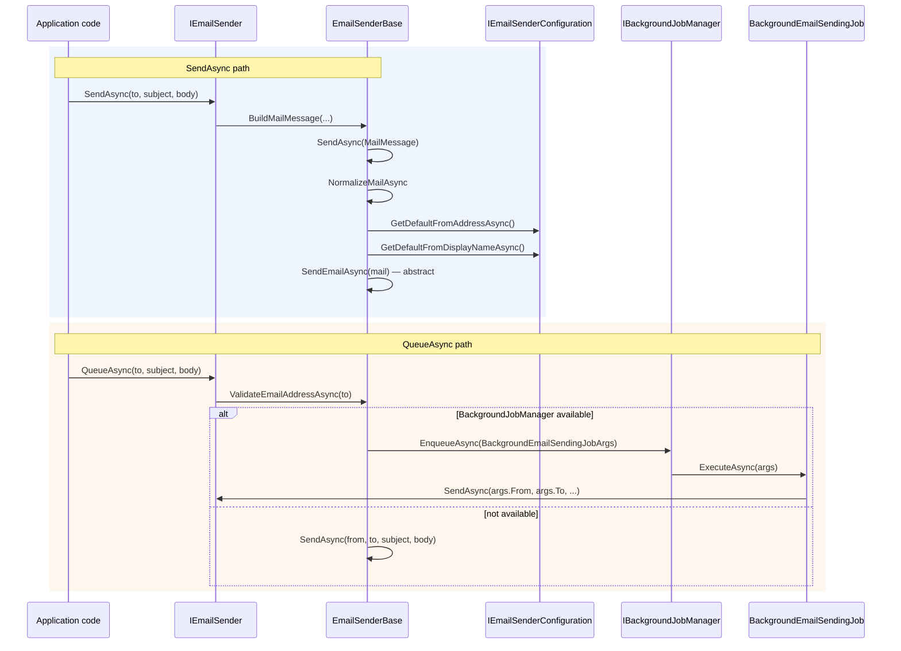

`Volo.Abp.Emailing` is the abstraction every layer reaches for when it needs to send a message — confirmation links, password reset, notifications, exports. The package itself is **transport-agnostic**: it owns the contract (`IEmailSender`), the base class (`EmailSenderBase`), a null fallback (`NullEmailSender`), and a built-in SMTP implementation. Production deployments swap the SMTP implementation for [MailKit](/misc/mailkit).

Source: `framework/src/Volo.Abp.Emailing/Volo/Abp/Emailing/`

## The contract

```csharp
// framework/src/Volo.Abp.Emailing/Volo/Abp/Emailing/IEmailSender.cs
public interface IEmailSender
{
    Task SendAsync(
        string to,
        string? subject,
        string? body,
        bool isBodyHtml = true,
        AdditionalEmailSendingArgs? additionalEmailSendingArgs = null
    );

    Task SendAsync(
        string from,
        string to,
        string? subject,
        string? body,
        bool isBodyHtml = true,
        AdditionalEmailSendingArgs? additionalEmailSendingArgs = null
    );

    Task SendAsync(MailMessage mail, bool normalize = true);

    Task QueueAsync(
        string to,
        string subject,
        string body,
        bool isBodyHtml = true,
        AdditionalEmailSendingArgs? additionalEmailSendingArgs = null
    );

    Task QueueAsync(
        string from,
        string to,
        string subject,
        string body,
        bool isBodyHtml = true,
        AdditionalEmailSendingArgs? additionalEmailSendingArgs = null
    );
}
```

There are three families of method:

1. **`SendAsync(to, subject, body)`** — the "do the easy thing" overloads. Build a `MailMessage` internally and send it immediately.
2. **`SendAsync(MailMessage mail, bool normalize = true)`** — caller-built `MailMessage`. If `normalize` is `true` (the default), `EmailSenderBase.NormalizeMailAsync` fills in `From` from settings and forces UTF-8 encoding on headers/subject/body.
3. **`QueueAsync(...)`** — enqueue a `BackgroundEmailSendingJob`. If `IBackgroundJobManager.IsAvailable()` returns `false`, falls back to direct send so the caller never has to branch.

<Info>`MailMessage` is `System.Net.Mail.MailMessage` — the `System.Net.Mail` types live on, even though `SmtpClient` itself is obsoleted. The interface stays useful because MailKit's `MimeMessage.CreateFromMailMessage(mail)` converts it.</Info>

## The pipeline



## EmailSenderBase: what the base class actually does

```csharp
// framework/src/Volo.Abp.Emailing/Volo/Abp/Emailing/EmailSenderBase.cs
public abstract class EmailSenderBase : IEmailSender
{
    public ILogger<EmailSenderBase> Logger { get; set; }
    protected ICurrentTenant CurrentTenant { get; }
    protected IEmailSenderConfiguration Configuration { get; }
    protected IBackgroundJobManager BackgroundJobManager { get; }

    protected EmailSenderBase(
        ICurrentTenant currentTenant,
        IEmailSenderConfiguration configuration,
        IBackgroundJobManager backgroundJobManager)
    {
        Logger = NullLogger<EmailSenderBase>.Instance;
        CurrentTenant = currentTenant;
        Configuration = configuration;
        BackgroundJobManager = backgroundJobManager;
    }

    public virtual async Task SendAsync(string to, string? subject, string? body,
        bool isBodyHtml = true, AdditionalEmailSendingArgs? additionalEmailSendingArgs = null)
    {
        await SendAsync(BuildMailMessage(null, to, subject, body, isBodyHtml, additionalEmailSendingArgs));
    }

    public virtual async Task SendAsync(MailMessage mail, bool normalize = true)
    {
        if (normalize)
        {
            await NormalizeMailAsync(mail);
        }

        await SendEmailAsync(mail);
    }

    protected abstract Task SendEmailAsync(MailMessage mail);
```

Three things to take from this:

1. The base class **owns the "build a `MailMessage`" logic** so providers (SMTP, MailKit, SendGrid, Mailgun) only have to implement `SendEmailAsync(MailMessage)`.
2. **`CurrentTenant` is injected** — sender implementations can read it inside `SendEmailAsync` to pick tenant-specific settings, which the SMTP settings provider already does through `ISettingProvider`.
3. The **`Logger` is property-injected** (`{ get; set; }` initialised to `NullLogger`) so a derived class can swap loggers in tests without changing the constructor signature.

### Normalisation

```csharp
protected virtual async Task NormalizeMailAsync(MailMessage mail)
{
    if (mail.From == null || mail.From.Address.IsNullOrEmpty())
    {
        mail.From = new MailAddress(
            await Configuration.GetDefaultFromAddressAsync(),
            await Configuration.GetDefaultFromDisplayNameAsync(),
            Encoding.UTF8
        );
    }

    if (mail.HeadersEncoding == null) mail.HeadersEncoding = Encoding.UTF8;
    if (mail.SubjectEncoding == null) mail.SubjectEncoding = Encoding.UTF8;
    if (mail.BodyEncoding == null)    mail.BodyEncoding    = Encoding.UTF8;
}
```

If the caller hands you a `MailMessage` with no `From`, the base reads the **`Abp.Mailing.DefaultFromAddress`** and **`Abp.Mailing.DefaultFromDisplayName`** settings and sets it. UTF-8 is forced everywhere so non-ASCII subjects and bodies work without extra ceremony.

If you really want to bypass that — say, when forwarding a fully-formed message — pass `normalize: false` to the `SendAsync(MailMessage, bool)` overload.

### `BuildMailMessage` and `AdditionalEmailSendingArgs`

```csharp
protected virtual MailMessage BuildMailMessage(string? from, string to, string? subject,
    string? body, bool isBodyHtml = true, AdditionalEmailSendingArgs? additionalEmailSendingArgs = null)
{
    var message = from == null
        ? new MailMessage { To = { to }, Subject = subject, Body = body, IsBodyHtml = isBodyHtml }
        : new MailMessage(from, to, subject, body) { IsBodyHtml = isBodyHtml };

    if (additionalEmailSendingArgs != null)
    {
        if (additionalEmailSendingArgs.Attachments != null)
        {
            foreach (var attachment in additionalEmailSendingArgs.Attachments.Where(x => x.File != null))
            {
                var fileStream = new MemoryStream(attachment.File!);
                fileStream.Seek(0, SeekOrigin.Begin);
                message.Attachments.Add(new Attachment(fileStream, attachment.Name));
            }
        }

        if (additionalEmailSendingArgs.CC != null)
        {
            foreach (var cc in additionalEmailSendingArgs.CC)
            {
                message.CC.Add(cc);
            }
        }
    }

    return message;
}
```

`AdditionalEmailSendingArgs` is the **`[Serializable]`** sidecar object that survives a trip through the background-job serializer:

```csharp
// AdditionalEmailSendingArgs.cs
[Serializable]
public class AdditionalEmailSendingArgs
{
    public List<string>? CC { get; set; }
    public List<EmailAttachment>? Attachments { get; set; }
    public ExtraPropertyDictionary? ExtraProperties { get; set; }
}

// EmailAttachment.cs
[Serializable]
public class EmailAttachment
{
    public string? Name { get; set; }
    public byte[]? File { get; set; }
}
```

Why bytes for attachments? Because the queue may serialize the args and pick them up later in a worker — a `Stream` wouldn't survive. The base reads `byte[]` into a `MemoryStream` only at the very last moment.

The `ExtraProperties` dictionary lets you carry provider-specific data (custom MIME headers, SendGrid template ids, etc.) without leaking provider types into the abstraction.

## Queueing

```csharp
public virtual async Task QueueAsync(string to, string subject, string body,
    bool isBodyHtml = true, AdditionalEmailSendingArgs? additionalEmailSendingArgs = null)
{
    await ValidateEmailAddressAsync(to);

    if (!BackgroundJobManager.IsAvailable())
    {
        await SendAsync(to, subject, body, isBodyHtml, additionalEmailSendingArgs);
        return;
    }

    await BackgroundJobManager.EnqueueAsync(
        new BackgroundEmailSendingJobArgs
        {
            TenantId = CurrentTenant.Id,
            To = to,
            Subject = subject,
            Body = body,
            IsBodyHtml = isBodyHtml,
            AdditionalEmailSendingArgs = additionalEmailSendingArgs
        }
    );
}
```

Notice **`TenantId = CurrentTenant.Id`** — the worker will re-enter that tenant scope when the job runs, so per-tenant `From` settings still apply.

The `ValidateEmailAddressAsync` check:

```csharp
protected virtual Task ValidateEmailAddressAsync(string emailAddress)
{
    try
    {
        _ = new MailAddressCollection { emailAddress };
        return Task.CompletedTask;
    }
    catch (Exception e)
    {
        throw new ArgumentException($"Email address '{emailAddress}' is not valid!");
    }
}
```

It piggybacks on `MailAddressCollection`'s parser — a cheap way to reject obviously-bogus addresses **before** they end up in the job store.

## The NullEmailSender

When no real provider is configured, `Volo.Abp.Emailing` still resolves `IEmailSender` — to this:

```csharp
// framework/src/Volo.Abp.Emailing/Volo/Abp/Emailing/NullEmailSender.cs
public class NullEmailSender : EmailSenderBase
{
    public NullEmailSender(ICurrentTenant currentTenant, IEmailSenderConfiguration configuration,
        IBackgroundJobManager backgroundJobManager)
        : base(currentTenant, configuration, backgroundJobManager) { }

    protected override Task SendEmailAsync(MailMessage mail)
    {
        Logger.LogWarning("USING NullEmailSender!");
        Logger.LogDebug("SendEmailAsync:");
        LogEmail(mail);
        return Task.FromResult(0);
    }

    private void LogEmail(MailMessage mail)
    {
        Logger.LogDebug(mail.To.ToString());
        Logger.LogDebug(mail.CC.ToString());
        Logger.LogDebug(mail.Subject);
        Logger.LogDebug(mail.Body);
    }
}
```

It dumps the email to the logger and returns. Great for unit tests, **dangerous in production** — the warning is intentional. The `SmtpEmailSender` is the actual default registered by `Volo.Abp.Emailing`; the null implementation is what you get if you wire only the abstractions module without the SMTP one.

## Settings: `EmailSettingNames`

Email config flows through ABP's setting system so it can be tenant-scoped and stored encrypted. All keys live in one place:

```csharp
// framework/src/Volo.Abp.Emailing/Volo/Abp/Emailing/EmailSettingNames.cs
public static class EmailSettingNames
{
    /// <summary>Abp.Mailing.DefaultFromAddress</summary>
    public const string DefaultFromAddress     = "Abp.Mailing.DefaultFromAddress";

    /// <summary>Abp.Mailing.DefaultFromDisplayName</summary>
    public const string DefaultFromDisplayName = "Abp.Mailing.DefaultFromDisplayName";

    public static class Smtp
    {
        public const string Host                  = "Abp.Mailing.Smtp.Host";
        public const string Port                  = "Abp.Mailing.Smtp.Port";
        public const string UserName              = "Abp.Mailing.Smtp.UserName";
        public const string Password              = "Abp.Mailing.Smtp.Password";
        public const string Domain                = "Abp.Mailing.Smtp.Domain";
        public const string EnableSsl             = "Abp.Mailing.Smtp.EnableSsl";
        public const string UseDefaultCredentials = "Abp.Mailing.Smtp.UseDefaultCredentials";
    }
}
```

These are exactly the strings you'd seed into the `Settings` table from a `DataSeedContributor`, or override in `appsettings.json` via the [setting provider chain](/core/options-and-configuration).

<Tip>The `Password` setting is encrypted at rest by the standard `SettingEncryptionService` — never put it in `appsettings.json` for production; seed it through the setting infrastructure instead.</Tip>

## `IEmailSenderConfiguration` and how settings get read

```csharp
// framework/src/Volo.Abp.Emailing/Volo/Abp/Emailing/IEmailSenderConfiguration.cs
public interface IEmailSenderConfiguration
{
    Task<string> GetDefaultFromAddressAsync();
    Task<string> GetDefaultFromDisplayNameAsync();
}

// EmailSenderConfiguration.cs
public abstract class EmailSenderConfiguration : IEmailSenderConfiguration
{
    protected ISettingProvider SettingProvider { get; }

    protected EmailSenderConfiguration(ISettingProvider settingProvider)
    {
        SettingProvider = settingProvider;
    }

    public Task<string> GetDefaultFromAddressAsync()     => GetNotEmptySettingValueAsync(EmailSettingNames.DefaultFromAddress);
    public Task<string> GetDefaultFromDisplayNameAsync() => GetNotEmptySettingValueAsync(EmailSettingNames.DefaultFromDisplayName);

    protected async Task<string> GetNotEmptySettingValueAsync(string name)
    {
        var value = await SettingProvider.GetOrNullAsync(name);
        if (value.IsNullOrEmpty())
        {
            throw new AbpException($"Setting value for '{name}' is null or empty!");
        }
        return value!;
    }
}
```

The base reads from `ISettingProvider` and **throws** if the setting is unset. The SMTP subclass (`SmtpEmailSenderConfiguration`) extends this same shape with `GetHostAsync`, `GetPortAsync`, `GetEnableSslAsync`, etc., one method per `EmailSettingNames.Smtp.*` constant.

## The built-in SMTP sender

```csharp
// framework/src/Volo.Abp.Emailing/Volo/Abp/Emailing/Smtp/SmtpEmailSender.cs
public class SmtpEmailSender : EmailSenderBase, ISmtpEmailSender, ITransientDependency
{
    public async Task<SmtpClient> BuildClientAsync()
    {
        var host = await SmtpConfiguration.GetHostAsync();
        var port = await SmtpConfiguration.GetPortAsync();
        var smtpClient = new SmtpClient(host, port);

        if (await SmtpConfiguration.GetEnableSslAsync()) smtpClient.EnableSsl = true;

        if (await SmtpConfiguration.GetUseDefaultCredentialsAsync())
        {
            smtpClient.UseDefaultCredentials = true;
        }
        else
        {
            smtpClient.UseDefaultCredentials = false;
            var userName = await SmtpConfiguration.GetUserNameAsync();
            if (!userName.IsNullOrEmpty())
            {
                var password = await SmtpConfiguration.GetPasswordAsync();
                var domain   = await SmtpConfiguration.GetDomainAsync();
                smtpClient.Credentials = !domain.IsNullOrEmpty()
                    ? new NetworkCredential(userName, password, domain)
                    : new NetworkCredential(userName, password);
            }
        }
        return smtpClient;
    }

    protected async override Task SendEmailAsync(MailMessage mail)
    {
        using var smtpClient = await BuildClientAsync();
        Logger.LogWarning(
            "We don't recommend that you use the SmtpClient class for new development because SmtpClient doesn't " +
            "support many modern protocols. Use MailKit or other libraries instead.");
        await smtpClient.SendMailAsync(mail);
    }
}
```

The warning isn't decorative — `System.Net.Mail.SmtpClient` is obsoleted by the .NET team for new development. The class is here for backward compatibility and "it just works" demos. For production, depend on `Volo.Abp.MailKit` and that DI registration silently replaces this sender. See [MailKit](/misc/mailkit).

## The module

```csharp
// framework/src/Volo.Abp.Emailing/Volo/Abp/Emailing/AbpEmailingModule.cs
[DependsOn(
    typeof(AbpSettingsModule),
    typeof(AbpVirtualFileSystemModule),
    typeof(AbpBackgroundJobsAbstractionsModule),
    typeof(AbpLocalizationModule),
    typeof(AbpTextTemplatingModule)
)]
public class AbpEmailingModule : AbpModule
{
    public override void ConfigureServices(ServiceConfigurationContext context)
    {
        Configure<AbpVirtualFileSystemOptions>(options =>
        {
            options.FileSets.AddEmbedded<AbpEmailingModule>();
        });

        Configure<AbpLocalizationOptions>(options =>
        {
            options.Resources
                .Add<EmailingResource>("en")
                .AddVirtualJson("/Volo/Abp/Emailing/Localization");
        });

        Configure<AbpBackgroundJobOptions>(options =>
        {
            options.AddJob<BackgroundEmailSendingJob>();
        });
    }
}
```

Notice the `[DependsOn]` set: settings (for `EmailSettingNames`), VFS (the embedded `Localization` and `Templates` files), background jobs (for `QueueAsync`), localization, and text templating (for the standard email templates).

The `AddJob<BackgroundEmailSendingJob>()` registration is what makes `QueueAsync` actually queue.

## Templates: a quick mention

Two standard templates ship in `Templates/Layout.tpl` and `Templates/Message.tpl`, and constants for them:

```csharp
// framework/src/Volo.Abp.Emailing/Volo/Abp/Emailing/Templates/StandardEmailTemplates.cs
public static class StandardEmailTemplates
{
    public const string Layout  = "Abp.StandardEmailTemplates.Layout";
    public const string Message = "Abp.StandardEmailTemplates.Message";
}
```

`StandardEmailTemplateDefinitionProvider` registers them through ABP's text-templating module so you can render them via `ITemplateRenderer.RenderAsync(StandardEmailTemplates.Message, new { … })` and pass the result as the body. This is what the Account/Identity modules use for password-reset and email-confirmation messages.

The convention used across ABP is to keep template name constants in a `static class` per module (the way `StandardEmailTemplates` does here) so call-sites refer to `MyModuleEmailTemplates.Welcome` instead of typing the raw string `"MyModule.Welcome"` everywhere. There's no framework-wide `EmailingTemplateConstants` registry — each module publishes its own.

## Practical usage

<CodeGroup>

```csharp Application service
public class WelcomeEmailService : ApplicationService
{
    private readonly IEmailSender _emailSender;

    public WelcomeEmailService(IEmailSender emailSender)
    {
        _emailSender = emailSender;
    }

    public async Task SendWelcomeAsync(string to, string userName)
    {
        await _emailSender.SendAsync(
            to: to,
            subject: $"Welcome, {userName}!",
            body: "<h1>Hi there 👋</h1><p>Your account is ready.</p>",
            isBodyHtml: true);
    }
}
```

```csharp With attachments + CC
await _emailSender.SendAsync(
    to: order.CustomerEmail,
    subject: $"Invoice #{order.Number}",
    body: htmlInvoice,
    additionalEmailSendingArgs: new AdditionalEmailSendingArgs
    {
        CC = new List<string> { "accounting@contoso.com" },
        Attachments = new List<EmailAttachment>
        {
            new() { Name = $"invoice-{order.Number}.pdf", File = pdfBytes }
        }
    });
```

```csharp Queue via background jobs
// Will be retried by the background-job manager on failure.
await _emailSender.QueueAsync(
    to: user.Email,
    subject: "Password changed",
    body: "Your password was changed at " + DateTime.UtcNow);
```

```csharp MailMessage already built (no normalization)
var mail = new MailMessage("noreply@contoso.com", "ops@contoso.com")
{
    Subject  = "Backup OK",
    Body     = "All good.",
    Priority = MailPriority.Low
};
await _emailSender.SendAsync(mail, normalize: false);
```

</CodeGroup>

## Test seam

In unit tests you can resolve `IEmailSender` to a fake by registering before the module list runs:

```csharp
[DependsOn(typeof(AbpEmailingModule))]
public class MyTestModule : AbpModule
{
    public override void ConfigureServices(ServiceConfigurationContext context)
    {
        context.Services.Replace(
            ServiceDescriptor.Transient<IEmailSender, FakeEmailSender>());
    }
}
```

…or simply rely on `NullEmailSender` and assert on the captured log output via `ILogger<EmailSenderBase>`.

## Related

<CardGroup cols={3}>
  <Card title="MailKit provider" icon="paper-plane" href="/misc/mailkit">
    Replace `SmtpEmailSender` with MailKit. STARTTLS / SSL / OAuth2-friendly.
  </Card>
  <Card title="Options & configuration" icon="gear" href="/core/options-and-configuration">
    Where `IEmailSenderConfiguration` reads from, and how to override settings per tenant.
  </Card>
  <Card title="BLOB storing (database)" icon="database" href="/modules/blob-storing-database">
    A natural pair if you want to persist attachments before queuing.
  </Card>
</CardGroup>
