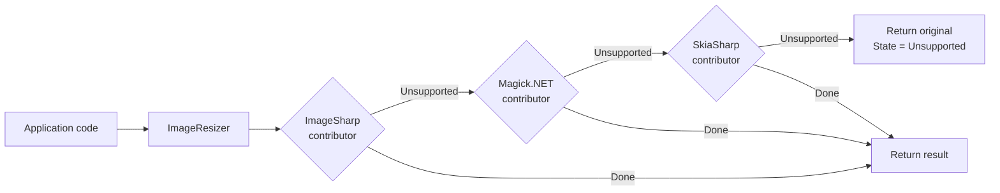

`Volo.Abp.Imaging.Abstractions` defines what every imaging backend (ImageSharp, Magick.NET, SkiaSharp) plugs into. Unlike the email/SMS abstractions where a single provider replaces the null implementation, **imaging uses a contributor list** — multiple backends can be registered and the dispatcher picks the first one that can handle the input mime type. This matters because no single library handles every format well (Magick.NET wins on GIF, ImageSharp on WebP, SkiaSharp on raw quality knobs).

Source: `framework/src/Volo.Abp.Imaging.Abstractions/Volo/Abp/Imaging/` and `framework/src/Volo.Abp.Imaging.AspNetCore/Volo/Abp/Imaging/`

## Two contracts

```csharp
// framework/src/Volo.Abp.Imaging.Abstractions/Volo/Abp/Imaging/IImageResizer.cs
public interface IImageResizer
{
    Task<ImageResizeResult<Stream>> ResizeAsync(
        Stream stream,
        ImageResizeArgs resizeArgs,
        string? mimeType = null,
        CancellationToken cancellationToken = default
    );

    Task<ImageResizeResult<byte[]>> ResizeAsync(
        byte[] bytes,
        ImageResizeArgs resizeArgs,
        string? mimeType = null,
        CancellationToken cancellationToken = default
    );
}

// framework/src/Volo.Abp.Imaging.Abstractions/Volo/Abp/Imaging/IImageCompressor.cs
public interface IImageCompressor
{
    Task<ImageCompressResult<Stream>> CompressAsync(
        Stream stream,
        string? mimeType = null,
        CancellationToken cancellationToken = default
    );

    Task<ImageCompressResult<byte[]>> CompressAsync(
        byte[] bytes,
        string? mimeType = null,
        CancellationToken cancellationToken = default
    );
}
```

Both interfaces have **`Stream` and `byte[]` overloads**. Streams are the natural shape for HTTP file uploads (`IFormFile.OpenReadStream()`), bytes are easier for in-memory pipelines and BLOB store I/O. The result type carries the **transformed data** plus an `ImageProcessState`:

```csharp
// framework/src/Volo.Abp.Imaging.Abstractions/Volo/Abp/Imaging/ImageProcessResult.cs
public abstract class ImageProcessResult<T>
{
    public T Result { get; }
    public ImageProcessState State { get; }

    protected ImageProcessResult(T result, ImageProcessState state)
    {
        Result = result;
        State  = state;
    }
}

// ImageProcessState.cs
public enum ImageProcessState : byte
{
    Done        = 1,
    Canceled    = 2,
    Unsupported = 3,
}

public class ImageCompressResult<T> : ImageProcessResult<T>
{
    public ImageCompressResult(T result, ImageProcessState state) : base(result, state) { }
}
public class ImageResizeResult<T> : ImageProcessResult<T>
{
    public ImageResizeResult(T result, ImageProcessState state) : base(result, state) { }
}
```

The three states answer three different questions:

- **`Done`** — the backend transformed the image and you should use `Result`.
- **`Canceled`** — the backend tried but decided not to keep the result (e.g. the compressed version was larger than the original). Use the *original* — `Result` may still point to it.
- **`Unsupported`** — no backend in the chain knew how to handle this mime type / format. `Result` is the unchanged original.

This three-way result lets callers code naturally: `if (result.State == ImageProcessState.Done) save(result.Result);` — no exceptions for the common "not an image" case.

## `ImageResizeArgs` and `ImageResizeMode`

```csharp
// framework/src/Volo.Abp.Imaging.Abstractions/Volo/Abp/Imaging/ImageResizeArgs.cs
public class ImageResizeArgs
{
    private uint _width;
    public uint Width
    {
        get => _width;
        set
        {
            if (value < 0) throw new ArgumentException("Width cannot be negative!", nameof(value));
            _width = value;
        }
    }

    private uint _height;
    public uint Height { /* same shape */ }

    public ImageResizeMode Mode { get; set; } = ImageResizeMode.Default;

    public ImageResizeArgs(uint? width = null, uint? height = null, ImageResizeMode? mode = null)
    {
        if (mode.HasValue) Mode = mode.Value;
        Width  = width  ?? 0;
        Height = height ?? 0;
    }
}

// ImageResizeMode.cs
public enum ImageResizeMode : byte
{
    None    = 0,
    Stretch = 1,
    BoxPad  = 2,
    Min     = 3,
    Max     = 4,
    Crop    = 5,
    Pad     = 6,
    Default = 7  // sentinel — replaced by ImageResizeOptions.DefaultResizeMode at dispatch time
}
```

The mode values map onto familiar resize semantics:

| Mode | Meaning |
|---|---|
| `Stretch` | Force exactly W×H, distort aspect if needed. |
| `BoxPad` | Centre the image in a W×H canvas, pad with background. |
| `Pad` | Like `BoxPad` but ensures image is *at most* W×H. |
| `Crop` | Fill W×H, crop edges. |
| `Min` | Shrink so neither dimension exceeds W or H. |
| `Max` | Grow so both dimensions are at least W or H. |
| `None` | Resize without explicit semantic — backend's default. |
| `Default` | Sentinel; the orchestrator replaces it with `ImageResizeOptions.DefaultResizeMode`. |

The width/height setters check for negative but the type is `uint` so the check is more documentation than logic — it's there to make the constraint explicit.

## `ImageResizeOptions`

```csharp
// framework/src/Volo.Abp.Imaging.Abstractions/Volo/Abp/Imaging/ImageResizeOptions.cs
public class ImageResizeOptions
{
    public ImageResizeMode DefaultResizeMode { get; set; } = ImageResizeMode.None;
}
```

A single configurable: what to substitute when the caller passes `ImageResizeMode.Default`. Override it in a module:

```csharp
Configure<ImageResizeOptions>(o => o.DefaultResizeMode = ImageResizeMode.Crop);
```

## Format conversion is a result of the backend, not the args

The `ImageResizeArgs` doesn't carry an output mime type. Backends preserve the input format by default (`image.SaveAsync(memoryStream, image.Metadata.DecodedImageFormat, …)` in ImageSharp). If you want to convert formats — say, JPEG → WebP — that's a backend-specific extension (subclass the contributor and override `SaveAsync`). The abstraction stays format-preserving on purpose.

<Tip>"ImageFormatConverter" is not a class in this package — it's the *intent* you implement on top of `IImageResizer` / `IImageCompressor` by overriding the contributor's encoding step. See the [ImageSharp page](/misc/imaging-imagesharp#format-conversion-pattern) for a worked example.</Tip>

## The contributor pattern

```csharp
// framework/src/Volo.Abp.Imaging.Abstractions/Volo/Abp/Imaging/IImageResizerContributor.cs
public interface IImageResizerContributor
{
    Task<ImageResizeResult<Stream>>  TryResizeAsync(Stream stream, ImageResizeArgs resizeArgs, string? mimeType = null, CancellationToken cancellationToken = default);
    Task<ImageResizeResult<byte[]>>  TryResizeAsync(byte[] bytes,  ImageResizeArgs resizeArgs, string? mimeType = null, CancellationToken cancellationToken = default);
}

// IImageCompressorContributor.cs
public interface IImageCompressorContributor
{
    Task<ImageCompressResult<Stream>> TryCompressAsync(Stream stream, string? mimeType = null, CancellationToken cancellationToken = default);
    Task<ImageCompressResult<byte[]>> TryCompressAsync(byte[] bytes,  string? mimeType = null, CancellationToken cancellationToken = default);
}
```

The convention is: every contributor returns `Unsupported` instead of throwing when it doesn't know how to handle the input. The dispatcher then **falls through to the next contributor**.



The dispatcher (`ImageResizer`) is itself a transient service:

```csharp
// framework/src/Volo.Abp.Imaging.Abstractions/Volo/Abp/Imaging/ImageResizer.cs
public class ImageResizer : IImageResizer, ITransientDependency
{
    protected IEnumerable<IImageResizerContributor> ImageResizerContributors { get; }
    protected ImageResizeOptions ImageResizeOptions { get; }
    protected ICancellationTokenProvider CancellationTokenProvider { get; }

    public ImageResizer(
        IEnumerable<IImageResizerContributor> imageResizerContributors,
        IOptions<ImageResizeOptions> imageResizeOptions,
        ICancellationTokenProvider cancellationTokenProvider)
    {
        ImageResizerContributors  = imageResizerContributors.Reverse();
        CancellationTokenProvider = cancellationTokenProvider;
        ImageResizeOptions        = imageResizeOptions.Value;
    }

    public virtual async Task<ImageResizeResult<Stream>> ResizeAsync(
        [NotNull] Stream stream, ImageResizeArgs resizeArgs,
        string? mimeType = null, CancellationToken cancellationToken = default)
    {
        Check.NotNull(stream, nameof(stream));
        ChangeDefaultResizeMode(resizeArgs);

        if (!stream.CanRead)
            return new ImageResizeResult<Stream>(stream, ImageProcessState.Unsupported);

        if (!stream.CanSeek)
        {
            var memoryStream = new MemoryStream();
            await stream.CopyToAsync(memoryStream, CancellationTokenProvider.FallbackToProvider(cancellationToken));
            SeekToBegin(memoryStream);
            stream = memoryStream;
        }

        foreach (var imageResizerContributor in ImageResizerContributors.Reverse())
        {
            var result = await imageResizerContributor.TryResizeAsync(
                stream, resizeArgs, mimeType,
                CancellationTokenProvider.FallbackToProvider(cancellationToken));

            SeekToBegin(stream);

            if (result.State == ImageProcessState.Unsupported)
                continue;

            return result;
        }

        return new ImageResizeResult<Stream>(stream, ImageProcessState.Unsupported);
    }
}
```

Notice three pragmatic touches:

1. **Streams without `CanSeek` get buffered** into a `MemoryStream` first. The contributors need to rewind between attempts.
2. **`SeekToBegin(stream)` after every contributor call** — even on `Unsupported`, the contributor may have read bytes; the next contributor must start from byte 0.
3. **`ICancellationTokenProvider.FallbackToProvider(cancellationToken)`** — if the caller didn't pass a token, the provider's ambient token (from `IUnitOfWork`, `HttpContext.RequestAborted`, etc.) is used. This is the same machinery the rest of ABP's async stack uses.

`ChangeDefaultResizeMode` is where the `Default` sentinel is replaced:

```csharp
protected virtual void ChangeDefaultResizeMode(ImageResizeArgs resizeArgs)
{
    if (resizeArgs.Mode == ImageResizeMode.Default)
    {
        resizeArgs.Mode = ImageResizeOptions.DefaultResizeMode;
    }
}
```

`ImageCompressor` follows the exact same shape (without the mode-rewriting step, since compression has no equivalent enum).

### Ordering

`ImageResizerContributors.Reverse()` is applied **twice** — once in the constructor and once in the iteration. The double-reverse means the contributor registered **last** wins first. In practice, the last `[DependsOn]` ed module is the one whose contributor takes priority — load order matters.

If you want explicit control, register your own `IImageResizerContributor` with a higher priority by reversing the dependency direction yourself, or override `ImageResizer` and reorder the list.

## The module

```csharp
// framework/src/Volo.Abp.Imaging.Abstractions/Volo/Abp/Imaging/AbpImagingAbstractionsModule.cs
[DependsOn(typeof(AbpThreadingModule))]
public class AbpImagingAbstractionsModule : AbpModule
{
}
```

Empty body — registration happens via the `ITransientDependency` markers on `ImageResizer`/`ImageCompressor`. The `[DependsOn]` is for `ICancellationTokenProvider`.

## ASP.NET Core integration

`Volo.Abp.Imaging.AspNetCore` exposes two action filters that let you compose imaging into MVC actions declaratively:

```csharp
// framework/src/Volo.Abp.Imaging.AspNetCore/Volo/Abp/Imaging/AbpImagingAspNetCoreModule.cs
[DependsOn(typeof(AbpImagingAbstractionsModule))]
public class AbpImagingAspNetCoreModule : AbpModule
{
}
```

### `ResizeImageAttribute`

```csharp
// framework/src/Volo.Abp.Imaging.AspNetCore/Volo/Abp/Imaging/ResizeImageAttribute.cs
public class ResizeImageAttribute : ActionFilterAttribute
{
    public uint? Width  { get; }
    public uint? Height { get; }
    public ImageResizeMode Mode { get; set; }
    public string[] Parameters { get; }

    public ResizeImageAttribute(uint width, uint height, params string[] parameters)
    {
        Width  = width;
        Height = height;
        Parameters = parameters;
    }

    public ResizeImageAttribute(uint size, params string[] parameters)
    {
        Width  = size;
        Height = size;
        Parameters = parameters;
    }

    public override async Task OnActionExecutionAsync(ActionExecutingContext context, ActionExecutionDelegate next)
    {
        var parameters = Parameters.Any()
            ? context.ActionArguments.Where(x => Parameters.Contains(x.Key)).ToArray()
            : context.ActionArguments.ToArray();

        var imageResizer = context.HttpContext.RequestServices.GetRequiredService<IImageResizer>();

        foreach (var (key, value) in parameters)
        {
            object? resizedValue = value switch
            {
                IFormFile file                              => await ResizeImageAsync(file, imageResizer),
                IRemoteStreamContent remoteStreamContent    => await ResizeImageAsync(remoteStreamContent, imageResizer),
                Stream stream                               => await ResizeImageAsync(stream, imageResizer),
                IEnumerable<byte> bytes                     => await ResizeImageAsync(bytes.ToArray(), imageResizer),
                _ => null
            };

            if (resizedValue != null)
            {
                context.ActionArguments[key] = resizedValue;
            }
        }

        await next();
    }
}
```

What it does, in plain English: **before your action runs**, walk through its arguments, find anything that looks like an image (an `IFormFile`, an `IRemoteStreamContent`, a `Stream`, a byte sequence), resize it through `IImageResizer`, and *replace the action argument*. Then the action itself only sees the resized image — your controller logic doesn't know imaging exists.

The `IFormFile` overload rebuilds a `FormFile` around the resized stream so model binding stays intact:

```csharp
protected virtual async Task<IFormFile> ResizeImageAsync(IFormFile file, IImageResizer imageResizer)
{
    if (file.Headers == null || file.ContentType == null || !file.ContentType.StartsWith("image/"))
    {
        return file;
    }

    var result = await imageResizer.ResizeAsync(
        file.OpenReadStream(),
        new ImageResizeArgs(Width, Height, Mode),
        file.ContentType);

    if (result.State != ImageProcessState.Done) return file;

    return new FormFile(result.Result, 0, result.Result.Length, file.Name, file.FileName)
    {
        Headers = file.Headers
    };
}
```

Two safety nets: skip if `ContentType` doesn't start with `image/`, and skip if the resize didn't produce a `Done` result (so a JPEG-incapable contributor doesn't silently mangle the upload).

### `CompressImageAttribute`

Same shape, no width/height. Drop it on an action that accepts an upload and the bytes get compressed before your action sees them.

### Practical usage

```csharp
[HttpPost("avatar")]
[ResizeImage(256, 256, Mode = ImageResizeMode.Crop)]
[CompressImage]
public async Task<IActionResult> Upload(IFormFile file)
{
    // file is now 256×256, JPEG re-encoded at the configured quality.
    await _blob.SaveAsync(file.FileName, file.OpenReadStream());
    return Ok();
}
```

Order matters: `[ResizeImage]` runs first, then `[CompressImage]` (filter order = top-to-bottom by default), so you compress *after* resizing. This is the right order — compressing a 4K original you'll immediately resize down is wasted work.

You can also scope the filter to specific parameters: `[ResizeImage(256, 256, "avatar", "banner")]` only touches the `avatar` and `banner` arguments.

## Default mime types the standard backends understand

| Mime type | ImageSharp | Magick.NET | SkiaSharp |
|---|---|---|---|
| `image/jpeg` | ✅ resize + compress | ✅ resize + compress | ✅ resize |
| `image/png`  | ✅ resize + compress | ✅ resize + compress | ✅ resize |
| `image/webp` | ✅ resize + compress | ❌ | ✅ resize |
| `image/gif`  | ✅ resize             | ✅ resize + compress | ❌ |
| `image/bmp`  | ✅ resize             | ❌ | ❌ |
| `image/tiff` | ✅ resize             | ❌ | ❌ |

So a deployment that wants WebP + GIF can pull in both the ImageSharp and Magick.NET packages; the contributor pipeline picks whichever fits per request.

## Cancellation

Every method takes `CancellationToken` and every contributor honours it (via ImageSharp's `LoadAsync(stream, ct)`, Magick.NET's internal checks, etc.). The orchestrator also calls `CancellationTokenProvider.FallbackToProvider(cancellationToken)` so an `HttpContext.RequestAborted` token gets picked up even if your caller didn't pass it explicitly.

## When does `Canceled` happen?

Only in compression — when the compressed output ends up *larger* than the input. ImageSharp's contributor:

```csharp
var memoryStream = await GetStreamFromImageAsync(image, image.Metadata.DecodedImageFormat, cancellationToken);

if (memoryStream.Length < stream.Length)
{
    return new ImageCompressResult<Stream>(memoryStream, ImageProcessState.Done);
}

await memoryStream.DisposeAsync();
return new ImageCompressResult<Stream>(stream, ImageProcessState.Canceled);
```

So `Canceled` means "we tried, but compressing this would make it worse — kept the original". Useful for tiny, already-optimized assets.

## Related

<CardGroup cols={3}>
  <Card title="ImageSharp" icon="palette" href="/misc/imaging-imagesharp">
    The pure-managed backend. Default quality 75, fully configurable encoders.
  </Card>
  <Card title="Magick.NET" icon="wand-magic-sparkles" href="/misc/imaging-magick">
    Native ImageMagick. Lossless mode, GIF, optimal compression.
  </Card>
  <Card title="SkiaSharp" icon="droplet" href="/misc/imaging-skiasharp">
    Skia-based resizer with sampling options.
  </Card>
</CardGroup>

For storing the results, see the [BLOB storing module](/modules/blob-storing-database).
