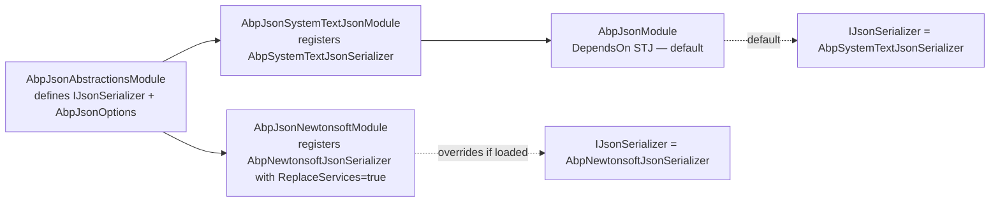

`Volo.Abp.Json.Abstractions` defines a single, deliberately small JSON interface that every ABP module uses for **internal** serialization — settings, audit logs, event bus payloads, the data dictionary, dynamic queries, et al. There are two providers ([Newtonsoft](/misc/json-newtonsoft), [System.Text.Json](/misc/json-systemtextjson)) and one orchestrator (`Volo.Abp.Json`) that picks one as the default.

This page covers the **abstraction** and the **dispatch logic** — which provider you get when you inject `IJsonSerializer`.

Source:
- `framework/src/Volo.Abp.Json.Abstractions/Volo/Abp/Json/`
- `framework/src/Volo.Abp.Json/Volo/Abp/Json/`

## The contract

```csharp
// framework/src/Volo.Abp.Json.Abstractions/Volo/Abp/Json/IJsonSerializer.cs
using System;

namespace Volo.Abp.Json;

public interface IJsonSerializer
{
    string Serialize(object obj, bool camelCase = true, bool indented = false);

    T Deserialize<T>(string jsonString, bool camelCase = true);

    object Deserialize(Type type, string jsonString, bool camelCase = true);
}
```

Three methods, three things to notice:

1. **`camelCase` defaults to `true`.** ABP serializes camelCase by default because it's the natural shape for browser-side JS and most public APIs. Pass `false` if you need PascalCase (e.g. interop with a legacy .NET service).
2. **`indented` defaults to `false`.** Saves bytes; flip to `true` for human-readable diagnostics.
3. **It's *synchronous*.** No `SerializeAsync`. JSON serialization in ABP modules is in-memory — no streams in the contract. The MVC pipeline uses Microsoft's `JsonSerializer.SerializeAsync` directly via the MVC formatter; this contract is for code paths where you already have an object and want a string (or vice versa).

There's no `Stream`-based overload, no `ReadOnlySpan<byte>` overload. The contract is the smallest possible: object ↔ string.

## `AbpJsonOptions`

```csharp
// framework/src/Volo.Abp.Json.Abstractions/Volo/Abp/Json/AbpJsonOptions.cs
using System.Collections.Generic;

namespace Volo.Abp.Json;

public class AbpJsonOptions
{
    /// <summary>
    /// Formats of input JSON date, Empty string means default format.
    /// </summary>
    public List<string> InputDateTimeFormats { get; set; }

    /// <summary>
    /// Format of output json date, Null or empty string means default format.
    /// </summary>
    public string? OutputDateTimeFormat { get; set; }

    public AbpJsonOptions()
    {
        InputDateTimeFormats = new List<string>();
    }
}
```

| Property | Default | What it controls |
|---|---|---|
| `InputDateTimeFormats` | `[]` | Accepted format strings for parsing dates. Tried in order; first match wins. Empty list = use the framework's permissive parse. |
| `OutputDateTimeFormat` | `null` | The format used when writing dates. Null = framework default (round-trip ISO 8601 for Newtonsoft, the System.Text.Json built-in for STJ). |

Both Newtonsoft and System.Text.Json date converters read this *same* options class. So setting these two values **once** affects every JSON-emitting code path in ABP:

```csharp
[DependsOn(typeof(AbpJsonModule))]
public class MyHostModule : AbpModule
{
    public override void ConfigureServices(ServiceConfigurationContext context)
    {
        Configure<AbpJsonOptions>(options =>
        {
            options.OutputDateTimeFormat = "yyyy-MM-dd HH:mm:ss"; // emit
            options.InputDateTimeFormats.Add("yyyy-MM-dd HH:mm:ss"); // accept
            options.InputDateTimeFormats.Add("yyyy/MM/dd");
        });
    }
}
```

<Info>The user-facing names in *some other framework releases* are `DefaultDateTimeFormat` and `UseHybridSerializer`. In the current source the only knobs are the two listed above; a "hybrid" serializer that dispatches between Newtonsoft and System.Text.Json is *not* in this version of the codebase. The dispatch decision is made at module-load time by which JSON provider module you depend on.</Info>

## The abstractions module

```csharp
// framework/src/Volo.Abp.Json.Abstractions/Volo/Abp/Json/AbpJsonAbstractionsModule.cs
public class AbpJsonAbstractionsModule : AbpModule
{
}
```

Empty body — the interface and options class are the entire surface area.

## The default: `AbpJsonModule` picks System.Text.Json

```csharp
// framework/src/Volo.Abp.Json/Volo/Abp/Json/AbpJsonModule.cs
[DependsOn(typeof(AbpJsonSystemTextJsonModule))]
public class AbpJsonModule : AbpModule
{
}
```

That single `[DependsOn]` is the dispatch decision. By bringing `AbpJsonModule` in, you get System.Text.Json (`AbpSystemTextJsonSerializer`) wired up as your `IJsonSerializer`. If you want Newtonsoft instead, depend on `AbpJsonNewtonsoftModule` *after* `AbpJsonModule` — its `[Dependency(ReplaceServices = true)]` registration takes over.



So in practice the rule is:

| Your module depends on | Resolved `IJsonSerializer` |
|---|---|
| `AbpJsonModule` only | `AbpSystemTextJsonSerializer` |
| `AbpJsonModule` + `AbpJsonNewtonsoftModule` | `AbpNewtonsoftJsonSerializer` (Newtonsoft wins because of `ReplaceServices = true`) |
| `AbpJsonSystemTextJsonModule` only (skipping `AbpJsonModule`) | `AbpSystemTextJsonSerializer` |
| `AbpJsonNewtonsoftModule` only | `AbpNewtonsoftJsonSerializer` |

The chain is **load-order-sensitive**: the last `[Dependency(ReplaceServices = true)]` registration to run wins.

## The provider implementations: a one-paragraph tour

Both providers wrap their respective library:

```csharp
// AbpSystemTextJsonSerializer
[Dependency] // default lifetime + no special replacement
public class AbpSystemTextJsonSerializer : IJsonSerializer, ITransientDependency
{
    public string Serialize(object obj, bool camelCase = true, bool indented = false)
        => JsonSerializer.Serialize(obj, CreateJsonSerializerOptions(camelCase, indented));
    // …
}

// AbpNewtonsoftJsonSerializer
[Dependency(ReplaceServices = true)]
public class AbpNewtonsoftJsonSerializer : IJsonSerializer, ITransientDependency
{
    public string Serialize(object obj, bool camelCase = true, bool indented = false)
        => JsonConvert.SerializeObject(obj, CreateJsonSerializerOptions(camelCase, indented));
    // …
}
```

Both maintain a `ConcurrentDictionary` of cached `JsonSerializerOptions`/`JsonSerializerSettings` keyed by `(camelCase, indented)` so repeated calls hit the cache. The deep details — converter stacks, contract resolvers, type-info modifiers — live on the per-provider pages:

- [`AbpNewtonsoftJsonSerializer`, AbpDateTimeConverter, contract resolvers](/misc/json-newtonsoft)
- [`AbpSystemTextJsonSerializer`, converter stack, type-info modifiers](/misc/json-systemtextjson)

## DateTime handling: the one cross-cutting concern

Both providers ship an `AbpDateTimeConverter` that normalises `DateTime` values through `IClock.Normalize(dateTime)`. `IClock` is the ABP timing service that turns local times into UTC (or vice versa) based on `AbpClockOptions.Kind`. The same options control output formatting:

```csharp
// Volo.Abp.Json.SystemTextJson/.../AbpDateTimeConverter.cs (excerpt)
public override void Write(Utf8JsonWriter writer, DateTime value, JsonSerializerOptions options)
{
    if (_options.OutputDateTimeFormat.IsNullOrWhiteSpace())
    {
        writer.WriteStringValue(Normalize(value));
    }
    else
    {
        writer.WriteStringValue(Normalize(value).ToString(_options.OutputDateTimeFormat, CultureInfo.CurrentUICulture));
    }
}

protected virtual DateTime Normalize(DateTime dateTime)
    => _skipDateTimeNormalization ? dateTime : _clock.Normalize(dateTime);
```

Three properties of this design:

1. **Both providers normalise.** If a tenant clock is set to UTC, dates round-trip in UTC regardless of provider.
2. **`SkipDateTimeNormalization()` is a per-instance toggle.** The non-camelCase Newtonsoft path uses a fresh contract resolver that calls `SkipDateTimeNormalization()` on the converter — useful when serializing for something *outside* the application that already has its own timezone semantics (e.g. an audit log written verbatim).
3. **`DisableDateTimeNormalizationAttribute`** decorating a property opts that field out:
    ```csharp
    public class AuditLog
    {
        public DateTime CreatedAt { get; set; }   // normalised by IClock
        [DisableDateTimeNormalization]
        public DateTime RawSourceTime { get; set; } // written as-is
    }
    ```

Both providers' contract resolvers / type-info modifiers check for this attribute.

## How parsing flows

```mermaid
sequenceDiagram
    participant App as Application
    participant IJ as IJsonSerializer
    participant Cv as AbpDateTimeConverter
    participant Opt as AbpJsonOptions
    participant Clk as IClock

    App->>IJ: Deserialize<T>(json)
    IJ->>Cv: Read(ref reader, ...) for each DateTime property
    alt InputDateTimeFormats configured
        Cv->>Opt: foreach format
        Cv->>Cv: TryParseExact(reader.GetString(), format)
        Cv-->>IJ: normalised value
    else No formats configured
        Cv->>Cv: reader.TryGetDateTime / DateTime.TryParse
        Cv->>Clk: Normalize(value)
        Cv-->>IJ: normalised value
    end
    IJ-->>App: T
```

If `InputDateTimeFormats` is non-empty, the converters **only** accept those formats and the framework default — strict mode. Empty list = lenient mode (any ISO-ish format the library can parse).

For input that genuinely uses multiple formats (e.g. a legacy upstream system), add them all:

```csharp
options.InputDateTimeFormats.Add("yyyy-MM-ddTHH:mm:ssZ");
options.InputDateTimeFormats.Add("MM/dd/yyyy");
options.InputDateTimeFormats.Add("yyyyMMdd");
```

…and the converter tries each one in turn.

## When MVC bypasses `IJsonSerializer`

MVC's input/output formatters do **not** route through `IJsonSerializer`. They use:

- `Microsoft.AspNetCore.Mvc.NewtonsoftJson` (the `services.AddNewtonsoftJson(...)` path) if you've added that package, or
- `System.Text.Json` via the default `JsonOptions` otherwise.

ABP integrates with **both** through dedicated MVC packages (the `Volo.Abp.AspNetCore.Mvc.NewtonsoftJson` and built-in System.Text.Json setup) and **applies the same converters** so a controller serializing a `DateTime` and a settings store serializing the same `DateTime` give matching strings. The point is: `IJsonSerializer` is for **internal** code paths; MVC has its own knob (the `JsonOptions`/`MvcNewtonsoftJsonOptions`) that the ABP startup wires consistently.

## Quick usage

```csharp
public class WebhookService
{
    private readonly IJsonSerializer _json;
    public WebhookService(IJsonSerializer json) => _json = json;

    public string BuildPayload(WebhookEvent ev)
        => _json.Serialize(ev);                        // camelCase, compact, dates normalised

    public WebhookEvent ParsePayload(string body)
        => _json.Deserialize<WebhookEvent>(body);       // camelCase property mapping

    public string ToHumanReadable(WebhookEvent ev)
        => _json.Serialize(ev, camelCase: true, indented: true);
}
```

## Switching providers without changing code

The biggest reason to keep this abstraction tiny is so you can swap providers without code changes:

```csharp
// Want Newtonsoft instead of S.T.J. for the *internal* IJsonSerializer:
[DependsOn(
    typeof(AbpJsonModule),                 // default (STJ)
    typeof(AbpJsonNewtonsoftModule)        // overrides with [Dependency(ReplaceServices = true)]
)]
public class MyHostModule : AbpModule { }
```

Every internal call to `IJsonSerializer` now goes through `AbpNewtonsoftJsonSerializer`. Settings, audit logs, event bus, dynamic queries — all of them.

## When to override `AbpJsonOptions`

| Symptom | Fix |
|---|---|
| API returns `"2024-08-13T09:43:12.5732147+00:00"`, the client wants `"2024-08-13 09:43:12"`. | `options.OutputDateTimeFormat = "yyyy-MM-dd HH:mm:ss";` |
| The client posts `"08/13/2024 09:43"` and ABP fails to parse. | `options.InputDateTimeFormats.Add("MM/dd/yyyy HH:mm");` |
| You need different output for one specific field. | Decorate it with `[JsonConverter(typeof(MyCustomConverter))]` — the per-property converter wins over the global one. |
| You need different output for *one tenant*. | Use ABP's [Options & Configuration](/core/options-and-configuration) pattern with `PostConfigure<AbpJsonOptions>` that consults `ICurrentTenant`. |

## Pitfalls

<Warning>**`InputDateTimeFormats` is order-sensitive.** Put the most specific format first. A loose pattern like `"yyyy"` placed before `"yyyy-MM-dd"` will match `"2024"` from `"2024-08-13"` and lose the day.</Warning>

<Warning>**Per-instance options cache.** Both providers cache a `JsonSerializerOptions` (or `Settings`) keyed by `(camelCase, indented)`. Changing options at runtime doesn't invalidate that cache. If you genuinely need runtime swap, restart the host or pin to your own `IJsonSerializer` decorator.</Warning>

<Warning>**Don't reach for `IJsonSerializer` from MVC controllers.** Return your DTO directly; MVC's pipeline already serializes it with the correct converters. `IJsonSerializer.Serialize(dto)` inside a controller turns the result into a string that MVC then double-serializes.</Warning>

## Related

<CardGroup cols={3}>
  <Card title="Newtonsoft provider" icon="brackets-curly" href="/misc/json-newtonsoft">
    `AbpNewtonsoftJsonSerializer`, contract resolvers, `AbpDateTimeConverter`.
  </Card>
  <Card title="System.Text.Json provider" icon="brackets-curly" href="/misc/json-systemtextjson">
    `AbpSystemTextJsonSerializer`, converter stack, `TypeInfoResolver` modifiers.
  </Card>
  <Card title="Options & configuration" icon="gear" href="/core/options-and-configuration">
    How `AbpJsonOptions` gets layered with `Configure` / `PostConfigure`.
  </Card>
</CardGroup>
