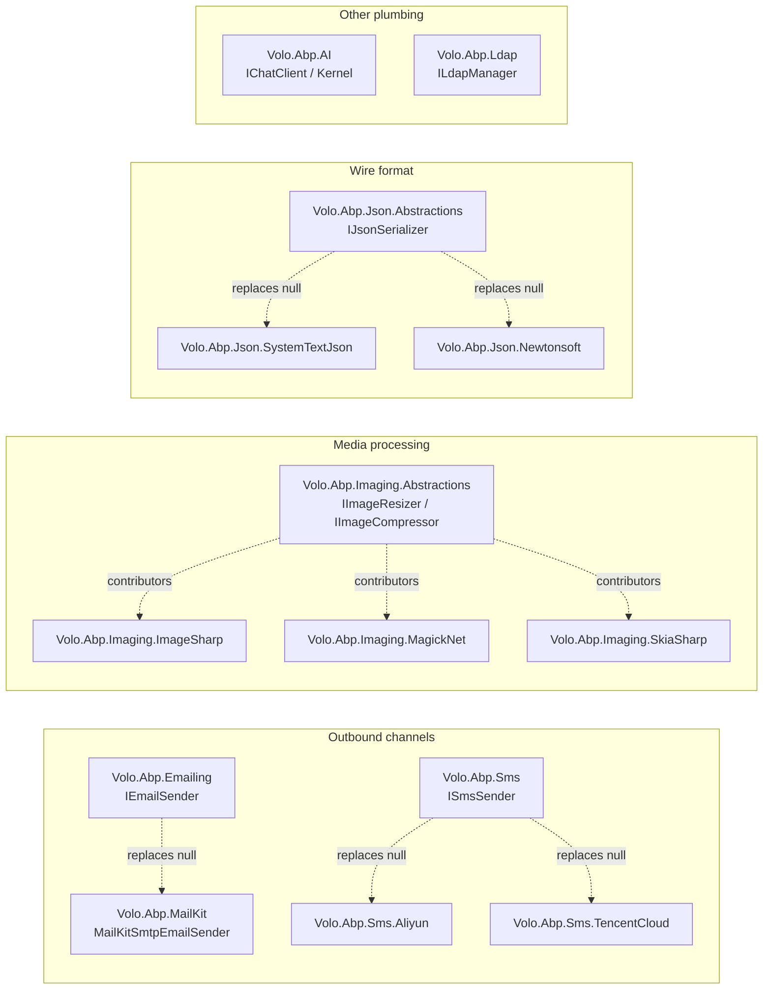
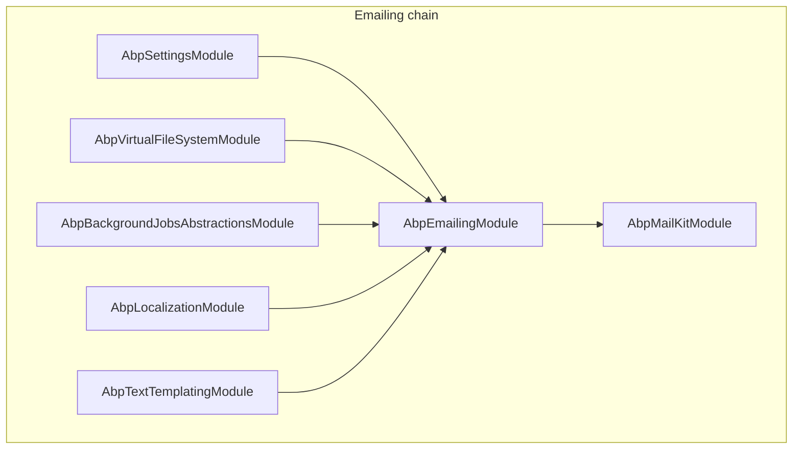
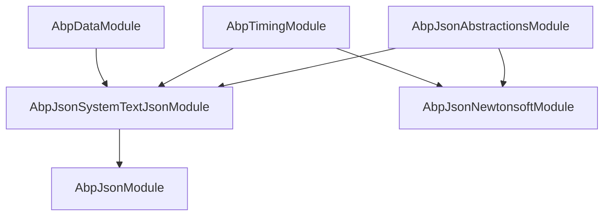
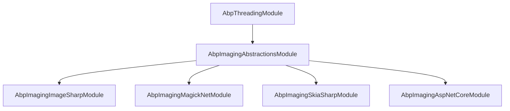
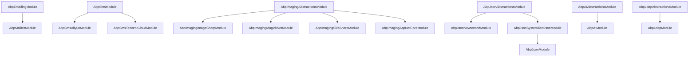

ABP is a layered framework, but a lot of real systems also need **outbound channels**, **media transforms**, **wire-format control**, **AI integration** and **directory authentication**. These don't fit cleanly under "domain", "application" or "presentation" — they're plumbing every layer reaches for at some point.

This section documents the small, focused packages under `framework/src/` that provide those capabilities. Each one follows the same ABP rhythm:

- An `*.Abstractions` package defines the contract (`IEmailSender`, `ISmsSender`, `IImageResizer`, `IJsonSerializer`, `IChatClientAccessor`, `ILdapManager`).
- A `Null*` default implementation is registered with `TryRegister = true` so consumer code can call the interface even when no provider is wired up — it logs instead of failing.
- One or more **provider packages** (`MailKit`, `Sms.Aliyun`, `Imaging.ImageSharp`, `Json.SystemTextJson`, `Json.Newtonsoft`, …) replace the null implementation via `[Dependency(ReplaceServices = true)]` or `ITransientDependency` + `[ExposeServices]`.
- Configuration flows through either the **Settings system** (per-tenant, runtime, encrypted secrets) or the **Options pattern** (compile-time, IConfiguration-bound) — see [Options & Configuration](/core/options-and-configuration) for the layering rules.

## The packages at a glance



Each provider replaces the null/default implementation registered by the abstraction module. The chain runs at module-load time via `[Dependency(ReplaceServices = true)]` (single-implementation pattern) or via a **contributor list** (imaging, which lets ImageSharp + MagickNet + SkiaSharp all be registered and the orchestrator picks the first that supports the mime type).

## How to read this section

<CardGroup cols={2}>
  <Card title="Emailing" icon="envelope" href="/misc/emailing">
    `IEmailSender`, `EmailSenderBase`, the SMTP defaults, `NullEmailSender`, `AdditionalEmailSendingArgs`, background queueing.
  </Card>
  <Card title="MailKit" icon="paper-plane" href="/misc/mailkit">
    Production-grade SMTP via MailKit/MimeKit, `AbpMailKitOptions.SecureSocketOption`, `IMailKitSmtpEmailSender.BuildClientAsync`.
  </Card>
  <Card title="SMS" icon="message-sms" href="/misc/sms">
    `ISmsSender`, `SmsMessage`, `NullSmsSender`, the `Properties` dictionary that carries provider-specific data.
  </Card>
  <Card title="Aliyun SMS" icon="cloud" href="/misc/sms-aliyun">
    `AliyunSmsSender`, `AbpAliyunSmsOptions` (AccessKeyId/Secret/Endpoint), `SignName`/`TemplateCode` property keys.
  </Card>
  <Card title="Tencent Cloud SMS" icon="cloud-arrow-up" href="/misc/sms-tencentcloud">
    `TencentCloudSmsSender`, `AbpTencentCloudSmsOptions`, region/endpoint defaults, `TencentCloudSmsProperties`.
  </Card>
  <Card title="Imaging Abstractions" icon="image" href="/misc/imaging-abstractions">
    `IImageResizer`, `IImageCompressor`, `ImageResizeArgs`, `ImageResizeMode`, `ImageProcessState`, the contributor pipeline and ASP.NET Core attributes.
  </Card>
  <Card title="Imaging — ImageSharp" icon="palette" href="/misc/imaging-imagesharp">
    Pure managed JPEG/PNG/WebP via SixLabors.ImageSharp. Default quality 75, configurable encoders.
  </Card>
  <Card title="Imaging — Magick.NET" icon="wand-magic-sparkles" href="/misc/imaging-magick">
    `ImageMagick.ImageOptimizer` integration, lossless mode, GIF support.
  </Card>
  <Card title="Imaging — SkiaSharp" icon="droplet" href="/misc/imaging-skiasharp">
    Skia-based resizer with `SKSamplingOptions`. Useful when you already use Skia in the stack.
  </Card>
  <Card title="JSON" icon="brackets-curly" href="/misc/json">
    `IJsonSerializer`, `AbpJsonOptions` (input/output date formats), the module's choice of provider, MVC integration boundary.
  </Card>
  <Card title="JSON — Newtonsoft" icon="brackets-curly" href="/misc/json-newtonsoft">
    `AbpNewtonsoftJsonSerializer`, the contract resolvers, `AbpDateTimeConverter`, `DisableDateTimeNormalizationAttribute`.
  </Card>
  <Card title="JSON — System.Text.Json" icon="brackets-curly" href="/misc/json-systemtextjson">
    `AbpSystemTextJsonSerializer`, the converter stack (`AbpStringToBooleanConverter`, `AbpStringToGuidConverter`, `AbpStringToEnumConverter`, `AbpDateTimeConverter`, `ObjectToInferredTypesConverter`) and the `TypeInfoResolver` modifiers.
  </Card>
  <Card title="AI" icon="robot" href="/misc/ai-abstractions">
    `IChatClient` / `IChatClientAccessor`, `IKernelAccessor`, `WorkspaceConfiguration`, multi-workspace keyed registration.
  </Card>
  <Card title="LDAP" icon="building" href="/misc/ldap">
    `ILdapManager`, `LdapSettingNames`, `LdapSettingProvider`, settings-driven directory authentication, integration points with the [Identity module](/modules/identity/overview).
  </Card>
</CardGroup>

## A second look at the dependency graph

The arrows in the diagram above hide a few details that matter when you wire your host module. Three sub-graphs are worth seeing again:



`AbpEmailingModule` brings the settings/VFS/background-jobs/localization/templating ensemble; `AbpMailKitModule` only depends on `AbpEmailingModule`. So `[DependsOn(typeof(AbpMailKitModule))]` is the *only* line you need in your host module — the transitive closure pulls in everything else.



`AbpJsonModule` is just an alias for "I want the default System.Text.Json provider". If you want Newtonsoft *instead*, depend on `AbpJsonNewtonsoftModule` — its `[Dependency(ReplaceServices = true)]` registration replaces the System.Text.Json `IJsonSerializer` even if the System.Text.Json module is also loaded.



Bring in **any combination** of `i1`/`i2`/`i3` — the contributor list combines them. Bring in `i4` if you want the `[ResizeImage]` / `[CompressImage]` MVC filters.

## When to reach for which

| You need to… | Package | Notes |
|---|---|---|
| Send a welcome email | `Volo.Abp.Emailing` + `Volo.Abp.MailKit` | The base ships `SmtpEmailSender`; MailKit replaces it for modern SMTP, TLS, OAuth2. |
| Queue an email via background jobs | `Volo.Abp.Emailing` | Use `IEmailSender.QueueAsync` — falls back to direct send if `IBackgroundJobManager.IsAvailable()` is false. |
| Send 2FA SMS to a Chinese phone | `Volo.Abp.Sms.Aliyun` or `Volo.Abp.Sms.TencentCloud` | Both implement `ISmsSender` and use `SmsMessage.Properties` for `SignName` / `TemplateId`. |
| Resize/compress uploaded images | `Volo.Abp.Imaging.*` | Drop `[ResizeImage(800, 600)]` or `[CompressImage]` on an MVC action. |
| Control DateTime serialization across the API surface | `Volo.Abp.Json` + `AbpJsonOptions` | Sets the `OutputDateTimeFormat` and accepted `InputDateTimeFormats` for both Newtonsoft and S.T.J. |
| Talk to OpenAI / Azure AI / a local model | `Volo.Abp.AI` | Wire `WorkspaceConfiguration.ChatClient.Builder` via `PreConfigure<AbpAIWorkspaceOptions>`. |
| Authenticate users against Active Directory | `Volo.Abp.Ldap` | `ILdapManager.AuthenticateAsync(username, password)` — settings live in `LdapSettingNames`. |

## A shared shape

Every package in this section converges on the same pattern. Here's the **emailing** version of it, just to make the rhythm concrete:

```csharp
// 1) The contract — Volo.Abp.Emailing/Volo/Abp/Emailing/IEmailSender.cs
public interface IEmailSender
{
    Task SendAsync(string to, string? subject, string? body, bool isBodyHtml = true,
        AdditionalEmailSendingArgs? additionalEmailSendingArgs = null);
    Task SendAsync(MailMessage mail, bool normalize = true);
    Task QueueAsync(string to, string subject, string body, bool isBodyHtml = true,
        AdditionalEmailSendingArgs? additionalEmailSendingArgs = null);
    // …
}

// 2) The null default — NullEmailSender.cs
public class NullEmailSender : EmailSenderBase
{
    protected override Task SendEmailAsync(MailMessage mail)
    {
        Logger.LogWarning("USING NullEmailSender!");
        // logs the email instead of sending
        return Task.CompletedTask;
    }
}

// 3) The provider replacement — Volo.Abp.MailKit/MailKitSmtpEmailSender.cs
[Dependency(ServiceLifetime.Transient, ReplaceServices = true)]
public class MailKitSmtpEmailSender : EmailSenderBase, IMailKitSmtpEmailSender
{
    protected override async Task SendEmailAsync(MailMessage mail)
    {
        using var client = await BuildClientAsync();
        var message = MimeMessage.CreateFromMailMessage(mail);
        message.MessageId = MimeUtils.GenerateMessageId();
        await client.SendAsync(message);
        await client.DisconnectAsync(true);
    }
}
```

Recognise that flow and you can navigate every other page in this section in seconds: find the interface, find the null, find the provider that replaces it, find the options class.

## Module dependency graph



Arrows are `[DependsOn]` declarations from the actual module classes — bringing `AbpMailKitModule` in transitively brings `AbpEmailingModule`, and bringing `AbpJsonModule` in transitively brings `AbpJsonSystemTextJsonModule` (which is what `AbpJsonModule` defaults to).

## Five questions that decide which page you read next

1. **"Where does the configuration live?"** Both Settings and Options come up across this section. Settings are *runtime, per-tenant, often encrypted* (`Abp.Mailing.Smtp.Password`, `Abp.Ldap.Password`). Options are *startup-time, host-wide, IConfiguration-bound* (`AbpMailKitOptions`, `AbpAliyunSmsOptions`, `ImageSharpCompressOptions`). The rules of both layered together live on [Options & Configuration](/core/options-and-configuration).

2. **"What's the registration mechanism?"** Two shapes:
   - **Single-replacement** (emailing, SMS, JSON): one provider per app. The `[Dependency(ReplaceServices = true)]` attribute swaps the implementation. Last module loaded wins.
   - **Contributor list** (imaging): multiple providers coexist. The orchestrator iterates contributors until one returns `Done`/`Canceled` (and `Unsupported` falls through to the next). Useful when *no single library* covers every input — ImageSharp wins on WebP, Magick.NET on GIF.

3. **"What does the null implementation do?"** Every abstraction ships a `Null*` default registered with `TryRegister = true`. They log a warning instead of doing the work — so a forgotten provider module is *loud* in the logs but doesn't crash. The warnings (`"USING NullEmailSender!"`, `"SMS Sending was not implemented!"`) are deliberately blunt.

4. **"Does it queue?"** Only emailing has built-in queue support via `IEmailSender.QueueAsync` — it falls back to direct send when `IBackgroundJobManager.IsAvailable()` is false. SMS, imaging, JSON, AI and LDAP are synchronous; wrap them with `IBackgroundJobManager.EnqueueAsync` yourself if you need durability.

5. **"How is multi-tenancy handled?"** Settings-backed providers (emailing SMTP, LDAP) read settings via `ISettingProvider` which is tenant-aware — the same code switches between tenant-specific values automatically. Options-backed providers (MailKit's `SecureSocketOption`, the SMS providers' SDK keys, imaging encoder quality) are host-scoped; for per-tenant overrides use `PostConfigure<TOptions>` that consults `ICurrentTenant`.

## A note on omissions

This section is intentionally narrow:

- **Email templating** sits at the seam between emailing and `Volo.Abp.TextTemplating`. The Emailing page documents `StandardEmailTemplates` enough to render the built-in messages; for authoring custom templates use the text-templating module proper.
- **AI prompt engineering** is application-domain work. The AI page documents the registration plumbing only.
- **LDAP group lookups** aren't exposed by `ILdapManager` — the contract is just "did this username/password bind?". For directory walking, use LdapForNet directly or extend `LdapManager` per the page's examples.

## Related sections

<CardGroup cols={3}>
  <Card title="Options & Configuration" icon="gear" href="/core/options-and-configuration">
    The `PreConfigure` / `Configure` / `PostConfigure` rhythm — the lever that turns every options class on this section's pages.
  </Card>
  <Card title="BLOB Storing — Database" icon="database" href="/modules/blob-storing-database">
    If you compress images and want to persist them, the BLOB storing providers are next door.
  </Card>
  <Card title="Identity module" icon="user-shield" href="/modules/identity/overview">
    LDAP plugs into the Identity sign-in flow as an external authentication source.
  </Card>
</CardGroup>

If you came here looking for *just one* of these packages, jump from the card grid above. If you're surveying ABP's surface area, read **Emailing → SMS → Imaging → JSON → AI → LDAP** in that order — each one reinforces the rhythm and the later pages reference patterns introduced earlier.

## File-path index

Every page in this section starts from a concrete folder. Quick reference:

| Concept | Folder under `framework/src/` |
|---|---|
| Emailing contract | `Volo.Abp.Emailing/Volo/Abp/Emailing/IEmailSender.cs` |
| Emailing base | `Volo.Abp.Emailing/Volo/Abp/Emailing/EmailSenderBase.cs` |
| Built-in SMTP | `Volo.Abp.Emailing/Volo/Abp/Emailing/Smtp/SmtpEmailSender.cs` |
| MailKit replacement | `Volo.Abp.MailKit/Volo/Abp/MailKit/MailKitSmtpEmailSender.cs` |
| SMS contract | `Volo.Abp.Sms/Volo/Abp/Sms/ISmsSender.cs` |
| Aliyun SMS | `Volo.Abp.Sms.Aliyun/Volo/Abp/Sms/Aliyun/AliyunSmsSender.cs` |
| Tencent SMS | `Volo.Abp.Sms.TencentCloud/Volo/Abp/Sms/TencentCloud/TencentCloudSmsSender.cs` |
| Imaging contracts | `Volo.Abp.Imaging.Abstractions/Volo/Abp/Imaging/IImageResizer.cs` |
| Imaging orchestrator | `Volo.Abp.Imaging.Abstractions/Volo/Abp/Imaging/ImageResizer.cs` |
| ImageSharp contributor | `Volo.Abp.Imaging.ImageSharp/Volo/Abp/Imaging/ImageSharpImageResizerContributor.cs` |
| Magick contributor | `Volo.Abp.Imaging.MagickNet/Volo/Abp/Imaging/MagickImageResizerContributor.cs` |
| Skia contributor | `Volo.Abp.Imaging.SkiaSharp/Volo/Abp/Imaging/SkiaSharpImageResizerContributor.cs` |
| MVC filters | `Volo.Abp.Imaging.AspNetCore/Volo/Abp/Imaging/ResizeImageAttribute.cs` |
| JSON contract | `Volo.Abp.Json.Abstractions/Volo/Abp/Json/IJsonSerializer.cs` |
| JSON options | `Volo.Abp.Json.Abstractions/Volo/Abp/Json/AbpJsonOptions.cs` |
| Newtonsoft serializer | `Volo.Abp.Json.Newtonsoft/Volo/Abp/Json/Newtonsoft/AbpNewtonsoftJsonSerializer.cs` |
| S.T.J. serializer | `Volo.Abp.Json.SystemTextJson/Volo/Abp/Json/SystemTextJson/AbpSystemTextJsonSerializer.cs` |
| AI workspaces | `Volo.Abp.AI/Volo/Abp/AI/AbpAIModule.cs` |
| LDAP manager | `Volo.Abp.Ldap/Volo/Abp/Ldap/LdapManager.cs` |
| LDAP settings | `Volo.Abp.Ldap.Abstractions/Volo/Abp/Ldap/LdapSettingNames.cs` |

Each per-package page restates the relevant paths in context, with the actual C# excerpts you'll find at them.
