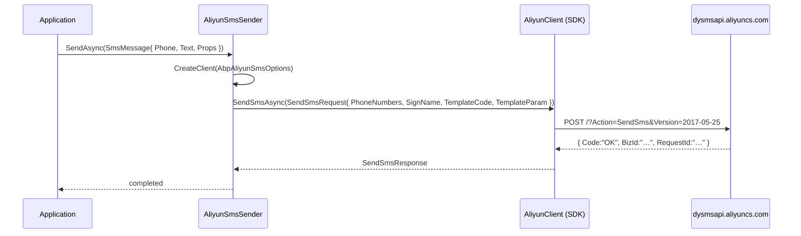

`Volo.Abp.Sms.Aliyun` is the Alibaba Cloud (Aliyun) provider for ABP's [SMS abstraction](/misc/sms). It implements `ISmsSender` against `AlibabaCloud.SDK.Dysmsapi20170525` — the official .NET SDK for the Aliyun **Dysmsapi** (Dynamic SMS API) v2017-05-25.

Source: `framework/src/Volo.Abp.Sms.Aliyun/Volo/Abp/Sms/Aliyun/`

## The sender

```csharp
// framework/src/Volo.Abp.Sms.Aliyun/Volo/Abp/Sms/Aliyun/AliyunSmsSender.cs
using AliyunClient        = AlibabaCloud.SDK.Dysmsapi20170525.Client;
using AliyunConfig        = AlibabaCloud.OpenApiClient.Models.Config;
using AliyunSendSmsRequest = AlibabaCloud.SDK.Dysmsapi20170525.Models.SendSmsRequest;

namespace Volo.Abp.Sms.Aliyun;

public class AliyunSmsSender : ISmsSender, ITransientDependency
{
    protected AbpAliyunSmsOptions Options { get; }

    public AliyunSmsSender(IOptionsMonitor<AbpAliyunSmsOptions> options)
    {
        Options = options.CurrentValue;
    }

    public async Task SendAsync(SmsMessage smsMessage)
    {
        var client = CreateClient();

        await client.SendSmsAsync(new AliyunSendSmsRequest
        {
            PhoneNumbers   = smsMessage.PhoneNumber,
            SignName       = smsMessage.Properties.GetOrDefault("SignName") as string,
            TemplateCode   = smsMessage.Properties.GetOrDefault("TemplateCode") as string,
            TemplateParam  = smsMessage.Text
        });
    }

    protected virtual AliyunClient CreateClient()
    {
        return new(new AliyunConfig
        {
            AccessKeyId     = Options.AccessKeyId,
            AccessKeySecret = Options.AccessKeySecret,
            Endpoint        = Options.EndPoint
        });
    }
}
```

Three things to register from this short file:

1. **Aliases at the `using` site.** The Alibaba SDK types have generic names (`Client`, `Config`, `SendSmsRequest`) that would collide with ABP's own. The file renames them at import time — a clean way to keep call-sites readable.
2. **`IOptionsMonitor<AbpAliyunSmsOptions>`.** Not `IOptions`. The `.CurrentValue` access in the constructor means a fresh `AccessKeyId`/`AccessKeySecret`/`EndPoint` is picked up whenever the options change at runtime — useful when secrets are reloaded by a key-vault sidecar.
3. **`Properties.GetOrDefault("SignName") as string`.** Aliyun *requires* both `SignName` (your registered sender signature) and `TemplateCode` (the pre-approved template id). The text body is passed as **`TemplateParam`**, which Aliyun expects to be a JSON string filling placeholders inside the template.

## The options

```csharp
// framework/src/Volo.Abp.Sms.Aliyun/Volo/Abp/Sms/Aliyun/AbpAliyunSmsOptions.cs
namespace Volo.Abp.Sms.Aliyun;

public class AbpAliyunSmsOptions
{
    public string AccessKeySecret { get; set; } = default!;
    public string AccessKeyId     { get; set; } = default!;
    public string EndPoint        { get; set; } = default!;
}
```

| Property | What goes here |
|---|---|
| `AccessKeyId` | RAM access-key id (a regular Aliyun IAM key — **do not** use the root account key). |
| `AccessKeySecret` | The matching secret. Store encrypted; never check into source. |
| `EndPoint` | Regional Dysmsapi endpoint, e.g. `dysmsapi.aliyuncs.com` for international, `dysmsapi-proxy.aliyun.com` for proxy, or the regional variants like `dysmsapi.ap-southeast-1.aliyuncs.com`. |

<Warning>The class uses `= default!` on the strings — the SDK constructor will throw if you leave them null. Validate during host startup (e.g. with an `IOptions<>` validator) so a misconfiguration fails fast rather than at the first SMS attempt.</Warning>

## The module

```csharp
// framework/src/Volo.Abp.Sms.Aliyun/Volo/Abp/Sms/Aliyun/AbpSmsAliyunModule.cs
[DependsOn(typeof(AbpSmsModule))]
public class AbpSmsAliyunModule : AbpModule
{
    public override void ConfigureServices(ServiceConfigurationContext context)
    {
        var configuration = context.Services.GetConfiguration();

        Configure<AbpAliyunSmsOptions>(configuration.GetSection("AbpAliyunSms"));
    }
}
```

Two important properties:

- **`[DependsOn(typeof(AbpSmsModule))]`** — pulls the abstraction in. Because `NullSmsSender` is registered with `TryRegister = true` and `AliyunSmsSender` is registered with the standard `ITransientDependency`, both end up in DI but the Aliyun one wins when you resolve `ISmsSender`.
- **`configuration.GetSection("AbpAliyunSms")`** — binds the option from the `AbpAliyunSms` block of `IConfiguration`. So your `appsettings.json` (or any config provider) looks like:

```json
{
  "AbpAliyunSms": {
    "AccessKeyId":     "LTAI5tXxxxxxxxxxxxxxxxxx",
    "AccessKeySecret": "xxxxxxxxxxxxxxxxxxxxxxxxxxxxxx",
    "EndPoint":        "dysmsapi.aliyuncs.com"
  }
}
```

You can still **`PostConfigure<AbpAliyunSmsOptions>`** in a downstream module to override the endpoint per environment, per [Options & Configuration](/core/options-and-configuration) rules.

## How a send maps to the Aliyun API



`Code` will be `"OK"` on success or a documented error code (`isv.MOBILE_NUMBER_ILLEGAL`, `isv.AMOUNT_NOT_ENOUGH`, etc.) on failure. The current sender lets the SDK propagate exceptions on non-OK responses; wrap the call yourself if you need different semantics.

## Wiring it up

```csharp
[DependsOn(
    typeof(AbpSmsAliyunModule)
)]
public class MyHostModule : AbpModule
{
}
```

That single `[DependsOn]` is enough — the module's `ConfigureServices` already binds the configuration section. If your secrets live in Key Vault or environment variables:

```csharp
// Program.cs (host)
builder.Configuration.AddEnvironmentVariables(prefix: "ABPALIYUNSMS__");
// Then ABPALIYUNSMS__ACCESSKEYID, ABPALIYUNSMS__ACCESSKEYSECRET, etc.
```

…or:

```csharp
[DependsOn(typeof(AbpSmsAliyunModule))]
public class MyHostModule : AbpModule
{
    public override void ConfigureServices(ServiceConfigurationContext context)
    {
        Configure<AbpAliyunSmsOptions>(o =>
        {
            o.AccessKeyId     = Environment.GetEnvironmentVariable("ALIYUN_AK_ID")!;
            o.AccessKeySecret = Environment.GetEnvironmentVariable("ALIYUN_AK_SECRET")!;
            o.EndPoint        = "dysmsapi.aliyuncs.com";
        });
    }
}
```

## Sending: the call shape

The `SmsMessage.Text` is **the template parameter**, not a freeform body. Aliyun templates use Mustache-style placeholders, e.g. `code` in template `SMS_123456`:

```text
Your verification code is ${code}, valid for 5 minutes.
```

So the JSON body becomes:

```csharp
await _sms.SendAsync(new SmsMessage(
    phoneNumber: "+861380013800",
    text:        "{\"code\":\"482910\"}")
{
    Properties =
    {
        ["SignName"]     = "Contoso",     // your approved signature
        ["TemplateCode"] = "SMS_123456",  // approved template id
    }
});
```

<Info>Aliyun rejects messages where `SignName` is unregistered, the `TemplateCode` is unapproved, or `TemplateParam` JSON keys don't match the template's placeholders. There's no built-in client-side validation — the SDK round-trips the rejection. Surface that to your users (rate-limit screen, support contact) rather than swallowing the exception.</Info>

### Multiple recipients

The Aliyun SDK accepts comma-separated phone numbers in `PhoneNumbers`. ABP's `SmsMessage.PhoneNumber` is a single string, so for fan-out either:

- Concatenate at the call site: `new SmsMessage("+8613800013800,+8613800013801", "{...}")`, or
- Loop and send one at a time — which is what most production deployments do, because it lets you correlate failures back to a single recipient.

The first form is cheaper but obscures per-recipient delivery failures.

## Overriding `CreateClient`

`CreateClient` is `protected virtual` — there are exactly two reasons to override it:

1. **HTTP customization** — proxies, custom timeouts, mTLS — by setting more fields on `AliyunConfig` (e.g. `Protocol = "https"`, `ReadTimeout`, `ConnectTimeout`).
2. **STS token exchange** — instead of long-lived AccessKeys, exchange a role for short-lived STS credentials and pass `SecurityToken` on the config.

```csharp
[Dependency(ServiceLifetime.Transient, ReplaceServices = true)]
[ExposeServices(typeof(ISmsSender), typeof(AliyunSmsSender))]
public class StsAliyunSmsSender : AliyunSmsSender
{
    private readonly IStsTokenSource _sts;

    public StsAliyunSmsSender(IOptionsMonitor<AbpAliyunSmsOptions> options, IStsTokenSource sts)
        : base(options)
    {
        _sts = sts;
    }

    protected override AlibabaCloud.SDK.Dysmsapi20170525.Client CreateClient()
    {
        var token = _sts.GetCurrent();
        return new(new AlibabaCloud.OpenApiClient.Models.Config
        {
            AccessKeyId     = token.AccessKeyId,
            AccessKeySecret = token.AccessKeySecret,
            SecurityToken   = token.SecurityToken,
            Endpoint        = Options.EndPoint
        });
    }
}
```

The `ReplaceServices = true` claim on top of the existing one promotes the subclass to `ISmsSender`.

## Picking an endpoint

| Region | Endpoint |
|---|---|
| Singapore (mainland-international) | `dysmsapi.ap-southeast-1.aliyuncs.com` |
| Mainland (default) | `dysmsapi.aliyuncs.com` |
| Australia | `dysmsapi.ap-southeast-2.aliyuncs.com` |

There's no `Region` property on `AbpAliyunSmsOptions` because the SDK derives region from the endpoint string. Set the endpoint correctly and you're done.

## Validating options

Because the option type uses `= default!`, missing config will only fail when you first call `SendAsync`. To fail at startup, plug into the options validator:

```csharp
public override void ConfigureServices(ServiceConfigurationContext context)
{
    context.Services.AddOptions<AbpAliyunSmsOptions>()
        .Validate(o =>
            !string.IsNullOrWhiteSpace(o.AccessKeyId) &&
            !string.IsNullOrWhiteSpace(o.AccessKeySecret) &&
            !string.IsNullOrWhiteSpace(o.EndPoint),
            "Aliyun SMS is not configured. Set AbpAliyunSms:* in configuration.")
        .ValidateOnStart();
}
```

Now a missing AccessKey is a host start-up failure, not a runtime 500.

## Pitfalls

<Warning>**Using the root account AccessKey.** Aliyun *strongly* discourages this. Provision a RAM user with the `AliyunDysmsFullAccess` policy and use that key.</Warning>

<Warning>**Wrong `Endpoint` for the wrong region.** Sending to a `+861…` number through an AP-Southeast-1 endpoint will be rejected. Match the endpoint to where your `SignName` and templates were approved.</Warning>

<Warning>**Forgetting the JSON body.** `TemplateParam` is **JSON**, not freeform text. `"482910"` will be rejected; `"{\"code\":\"482910\"}"` is what the API expects.</Warning>

## Tests

For unit tests, replace `ISmsSender` in your test module (see the [SMS abstraction page](/misc/sms#testing-without-sending)) — don't try to mock `AliyunSmsSender` or the Alibaba SDK. The dispatcher only knows the interface.

For integration tests against Aliyun's sandbox, set the endpoint to the sandbox endpoint and use a sandbox-approved `SignName` / `TemplateCode`. The same code path runs.

## A note on `using` aliases

The sender's top-of-file aliases are worth copying when you write similar wrappers:

```csharp
using AliyunClient         = AlibabaCloud.SDK.Dysmsapi20170525.Client;
using AliyunConfig         = AlibabaCloud.OpenApiClient.Models.Config;
using AliyunSendSmsRequest = AlibabaCloud.SDK.Dysmsapi20170525.Models.SendSmsRequest;
```

Two reasons it's the right pattern:

1. **No collision** with ABP's own `Client`, `Config`, or `SendSmsRequest` types — your IDE's quick-fix wouldn't accidentally import the wrong one.
2. **Searchability** — when grepping the codebase, `AliyunClient` only ever means the Aliyun SDK. The fully-qualified name appears once at the top of the file and the rest of the method bodies stay readable.

When you write your own `[Dependency(ReplaceServices = true)]` subclass to add STS or proxy support, keep the alias style. It makes the diff small and the intent obvious to the next reader.

## What this package *doesn't* do

- **No retry policy.** The Alibaba SDK propagates exceptions on non-OK responses. Wrap with Polly or a similar library if you need retries.
- **No rate limiting.** Aliyun's per-SignName throughput caps are enforced server-side; you'll see `isv.BUSINESS_LIMIT_CONTROL` if you exceed them.
- **No template registration helpers.** Templates and signatures are provisioned through the Aliyun console or terraform — the SDK only sends; it doesn't manage.

Those are deliberate omissions — they keep the ABP layer thin so you can layer your own concerns on top via decorators or background-job wrappers.

## Related

<CardGroup cols={3}>
  <Card title="SMS abstraction" icon="message-sms" href="/misc/sms">
    The `ISmsSender` contract and `SmsMessage.Properties` convention.
  </Card>
  <Card title="Tencent Cloud SMS" icon="cloud-arrow-up" href="/misc/sms-tencentcloud">
    The other in-tree Chinese-cloud provider, with the same shape but a different SDK.
  </Card>
  <Card title="Options & configuration" icon="gear" href="/core/options-and-configuration">
    `Configure` vs `PostConfigure`, `IConfiguration` binding and how to layer overrides.
  </Card>
</CardGroup>
