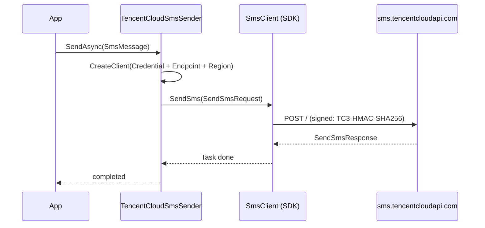

`Volo.Abp.Sms.TencentCloud` is the Tencent Cloud (TCloud) provider for ABP's [SMS abstraction](/misc/sms). It uses the official **TencentCloud.Sms.V20210111** .NET SDK and shows ABP's convention for passing provider-specific data through `SmsMessage.Properties`.

Source: `framework/src/Volo.Abp.Sms.TencentCloud/Volo/Abp/Sms/TencentCloud/`

## The sender

```csharp
// framework/src/Volo.Abp.Sms.TencentCloud/Volo/Abp/Sms/TencentCloud/TencentCloudSmsSender.cs
using TencentCloud.Common;
using TencentCloud.Common.Profile;
using TencentCloud.Sms.V20210111;
using TencentCloud.Sms.V20210111.Models;

namespace Volo.Abp.Sms.TencentCloud;

public class TencentCloudSmsSender : ISmsSender, ITransientDependency
{
    protected AbpTencentCloudSmsOptions Options { get; }

    public TencentCloudSmsSender(IOptionsMonitor<AbpTencentCloudSmsOptions> options)
    {
        Options = options.CurrentValue;
    }

    public virtual async Task SendAsync(SmsMessage smsMessage)
    {
        var client = CreateClient();

        await client.SendSms(new SendSmsRequest()
        {
            SmsSdkAppId      = Options.SmsSdkAppId,
            SignName         = smsMessage.Properties.GetOrDefault(TencentCloudSmsProperties.SignName) as string,
            TemplateId       = smsMessage.Properties.GetOrDefault(TencentCloudSmsProperties.TemplateId) as string,
            TemplateParamSet = smsMessage.Text.Split(','),
            PhoneNumberSet   = [smsMessage.PhoneNumber]
        });
    }

    protected virtual SmsClient CreateClient()
    {
        var credential = new Credential
        {
            SecretId  = Options.SecretId,
            SecretKey = Options.SecretKey
        };
        var clientProfile = new ClientProfile
        {
            HttpProfile = new HttpProfile { Endpoint = Options.Endpoint }
        };
        return new SmsClient(credential, Options.Region, clientProfile);
    }
}
```

Five things stand out compared to the Aliyun sender:

1. **`SmsSdkAppId`** is a Tencent-specific concept — it's the SMS application id you create in the Tencent Cloud SMS console. Unlike Aliyun, the app id lives in **options**, not in `Properties`, because it's per-deployment, not per-message.
2. **`TemplateParamSet = smsMessage.Text.Split(',')`** — Tencent expects an *array* of strings. The convention is "use a comma in `SmsMessage.Text` to separate placeholder values". That means your application code can't have raw commas in any placeholder. If you need that, override `SendAsync` and parse `Text` your own way (JSON, e.g.).
3. **`PhoneNumberSet = [smsMessage.PhoneNumber]`** — a collection-expression literal that wraps the single phone number into an array of one. Add to this array by overriding the method if you want fan-out per call.
4. **`virtual`** on both `SendAsync` and `CreateClient`. The sender is explicit about extensibility: you can override the wire format without re-implementing the credential plumbing.
5. **`SendSms`** (not `SendSmsAsync`) — at the time of writing, the SDK's method is named `SendSms` and returns a `Task<SendSmsResponse>`. The lack of the `Async` suffix is a quirk of the upstream SDK.

## The options

```csharp
// framework/src/Volo.Abp.Sms.TencentCloud/Volo/Abp/Sms/TencentCloud/AbpTencentCloudSmsOptions.cs
namespace Volo.Abp.Sms.TencentCloud;

public class AbpTencentCloudSmsOptions
{
    public string SmsSdkAppId { get; set; } = default!;
    public string SecretKey   { get; set; } = default!;
    public string SecretId    { get; set; } = default!;

    public string Endpoint    { get; set; } = "sms.tencentcloudapi.com";
    public string Region      { get; set; } = "ap-guangzhou";
}
```

| Property | What goes here |
|---|---|
| `SmsSdkAppId` | App id created in **Tencent Cloud Console → SMS → Applications**. Numeric, e.g. `1400000123`. |
| `SecretId` / `SecretKey` | CAM credentials for an account with `SmsFullAccess` (or the more constrained `QcloudSMSFullAccess`). |
| `Endpoint` | Defaults to the global SMS endpoint. You can pin a regional variant. |
| `Region` | Defaults to `ap-guangzhou`. Other common values: `ap-singapore` (international), `ap-hongkong`, `ap-mumbai`. |

The Endpoint/Region pair tells the SDK *where* to sign and route the request. Mismatching them produces signature-verification errors at the API.

<Tip>Use a **sub-account CAM key**, not the root account. Tencent's CAM console lets you scope the key to just `sms:SendSms`.</Tip>

## The property constants

```csharp
// framework/src/Volo.Abp.Sms.TencentCloud/Volo/Abp/Sms/TencentCloud/TencentCloudSmsProperties.cs
public static class TencentCloudSmsProperties
{
    public const string SignName   = "SignName";
    public const string TemplateId = "TemplateId";
}
```

These exist so call-sites can write `smsMessage.Properties[TencentCloudSmsProperties.TemplateId] = "1234567"` instead of leaking magic strings. The constants intentionally use the **same key names** as the Aliyun provider for `SignName`, so application code that targets either provider can share the property dictionary.

## The module

```csharp
// framework/src/Volo.Abp.Sms.TencentCloud/Volo/Abp/Sms/TencentCloud/AbpSmsTencentCloudModule.cs
[DependsOn(typeof(AbpSmsModule))]
public class AbpSmsTencentCloudModule : AbpModule
{
    public override void ConfigureServices(ServiceConfigurationContext context)
    {
        var configuration = context.Services.GetConfiguration();

        Configure<AbpTencentCloudSmsOptions>(configuration.GetSection("AbpTencentCloudSms"));
    }
}
```

Binds `AbpTencentCloudSms` from `IConfiguration`. Your `appsettings.json` looks like:

```json
{
  "AbpTencentCloudSms": {
    "SmsSdkAppId": "1400000123",
    "SecretId":    "AKIDxxxxxxxxxxxxxxxxx",
    "SecretKey":   "xxxxxxxxxxxxxxxxxxxxxxxx",
    "Endpoint":    "sms.tencentcloudapi.com",
    "Region":      "ap-guangzhou"
  }
}
```

## What a send looks like end-to-end

```csharp
[DependsOn(typeof(AbpSmsTencentCloudModule))]
public class MyHostModule : AbpModule { }

public class TwoFactorService
{
    private readonly ISmsSender _sms;
    public TwoFactorService(ISmsSender sms) => _sms = sms;

    public async Task SendCodeAsync(string phone, string code, int minutes)
    {
        await _sms.SendAsync(new SmsMessage(phone, $"{code},{minutes}")
        {
            Properties =
            {
                [TencentCloudSmsProperties.SignName]   = "Contoso",
                [TencentCloudSmsProperties.TemplateId] = "1234567",
            }
        });
    }
}
```

If the Tencent template is:

```text
Your code is {1}, valid for {2} minutes.
```

…then `Text = "482910,5"` becomes `TemplateParamSet = ["482910", "5"]` and the SMS reads as expected.

## Multiple recipients (overriding `SendAsync`)

Tencent's `PhoneNumberSet` is an array — the API supports fan-out in one call. ABP's `SmsMessage.PhoneNumber` is one string, so the default sender wraps it into a single-element array. To send to multiple numbers:

```csharp
[Dependency(ServiceLifetime.Transient, ReplaceServices = true)]
[ExposeServices(typeof(ISmsSender), typeof(TencentCloudSmsSender))]
public class BroadcastTencentCloudSmsSender : TencentCloudSmsSender
{
    public BroadcastTencentCloudSmsSender(IOptionsMonitor<AbpTencentCloudSmsOptions> options) : base(options) { }

    public override async Task SendAsync(SmsMessage smsMessage)
    {
        var client = CreateClient();
        var phones = smsMessage.PhoneNumber.Split(',', StringSplitOptions.RemoveEmptyEntries);

        await client.SendSms(new SendSmsRequest()
        {
            SmsSdkAppId      = Options.SmsSdkAppId,
            SignName         = smsMessage.Properties.GetOrDefault(TencentCloudSmsProperties.SignName) as string,
            TemplateId       = smsMessage.Properties.GetOrDefault(TencentCloudSmsProperties.TemplateId) as string,
            TemplateParamSet = smsMessage.Text.Split(','),
            PhoneNumberSet   = phones
        });
    }
}
```

Call-site:

```csharp
await _sms.SendAsync(new SmsMessage("+8613800013800,+8613900014000", "482910,5")
{
    Properties =
    {
        [TencentCloudSmsProperties.SignName]   = "Contoso",
        [TencentCloudSmsProperties.TemplateId] = "1234567",
    }
});
```

<Tip>If you find yourself doing this often, consider a **first-class** abstraction (`IBatchSmsSender` of your own) rather than overloading the single-recipient one. The current shape exists to keep the cross-provider API small.</Tip>

## Picking endpoint and region

| Region | `Region` | `Endpoint` |
|---|---|---|
| Guangzhou (default) | `ap-guangzhou` | `sms.tencentcloudapi.com` |
| Singapore | `ap-singapore` | `sms.tencentcloudapi.com` |
| Hong Kong | `ap-hongkong` | `sms.tencentcloudapi.com` |

The global endpoint `sms.tencentcloudapi.com` routes by region; for most deployments leave `Endpoint` at the default and only change `Region`.

## Pipeline overview



The SDK builds a TC3-HMAC-SHA256 signature using `SecretId`/`SecretKey` and the configured `Region`. If the response carries a non-success `Code`, the SDK raises a `TencentCloudSDKException`. Wrap your `SendAsync` call site if you want to translate that into your own exception type.

## Validating options

```csharp
[DependsOn(typeof(AbpSmsTencentCloudModule))]
public class MyHostModule : AbpModule
{
    public override void ConfigureServices(ServiceConfigurationContext context)
    {
        context.Services.AddOptions<AbpTencentCloudSmsOptions>()
            .Validate(o =>
                !string.IsNullOrWhiteSpace(o.SmsSdkAppId) &&
                !string.IsNullOrWhiteSpace(o.SecretId) &&
                !string.IsNullOrWhiteSpace(o.SecretKey),
                "Tencent Cloud SMS is not configured. Set AbpTencentCloudSms:* in configuration.")
            .ValidateOnStart();
    }
}
```

## What `IOptionsMonitor` gives you

The sender takes `IOptionsMonitor<AbpTencentCloudSmsOptions>` and reads `CurrentValue` in the constructor. Because the sender is registered with `ITransientDependency`, a new instance per scope picks up the *latest* options when it's resolved. This matters when:

- You rotate `SecretKey` without restarting the host (e.g. through a hot-reload secret store).
- You use ABP's [Options & Configuration](/core/options-and-configuration) pattern to layer a `PostConfigure` that depends on tenant context.

For a long-lived background service that holds onto a sender, prefer capturing `IOptionsMonitor` itself and reading `CurrentValue` per call.

## What `IOptionsMonitor` lets you do (a worked example)

Picture a long-running background service that periodically sends notifications:

```csharp
public class NotificationLoop : BackgroundService, ITransientDependency
{
    private readonly ISmsSender _sms;
    private readonly IOptionsMonitor<AbpTencentCloudSmsOptions> _opts;

    public NotificationLoop(ISmsSender sms, IOptionsMonitor<AbpTencentCloudSmsOptions> opts)
    {
        _sms  = sms;
        _opts = opts;
    }

    protected override async Task ExecuteAsync(CancellationToken stoppingToken)
    {
        // No need to capture _opts.CurrentValue here — the sender is transient,
        // so each iteration's resolution picks up rotated SecretId/SecretKey.
        while (!stoppingToken.IsCancellationRequested)
        {
            await TickAsync(stoppingToken);
            await Task.Delay(TimeSpan.FromMinutes(5), stoppingToken);
        }
    }

    private async Task TickAsync(CancellationToken ct)
    {
        // ...resolve a fresh ISmsSender per work item if the service was created
        // singleton; here it's transient and gets a fresh value each call site.
        await _sms.SendAsync(new SmsMessage("+86…", "ok"));
    }
}
```

Because `TencentCloudSmsSender` reads `CurrentValue` in its constructor and is registered transient, **rotating the secret in your configuration store flows into the next request automatically** — no host restart, no manual cache invalidation. If you make your wrapping service singleton, capture `IOptionsMonitor` and ask for `CurrentValue` per work item instead of caching it.

## Pitfalls

<Warning>**Commas in template values.** Because `TemplateParamSet = Text.Split(',')`, a placeholder value containing `,` will be split incorrectly. Pre-escape, or override `SendAsync`.</Warning>

<Warning>**Unapproved SignName / TemplateId.** Tencent rejects messages with code `MissingParameter.MissingSign` or `InvalidParameterValue.TemplateNotExist`. The SDK propagates the exception — surface it to the user instead of retrying.</Warning>

<Warning>**Region/Endpoint mismatch.** Setting `Region = "ap-singapore"` with a guangzhou-only template causes `AuthFailure.SecretIdNotMatch` or `FailedOperation.TemplateIncorrectOrUnapproved`.</Warning>

## Related

<CardGroup cols={3}>
  <Card title="SMS abstraction" icon="message-sms" href="/misc/sms">
    `ISmsSender`, `SmsMessage`, and the convention used by all providers.
  </Card>
  <Card title="Aliyun SMS" icon="cloud" href="/misc/sms-aliyun">
    Same shape, different SDK — useful comparison.
  </Card>
  <Card title="Options & configuration" icon="gear" href="/core/options-and-configuration">
    `IConfiguration` binding, `PostConfigure`, and per-tenant overrides.
  </Card>
</CardGroup>
