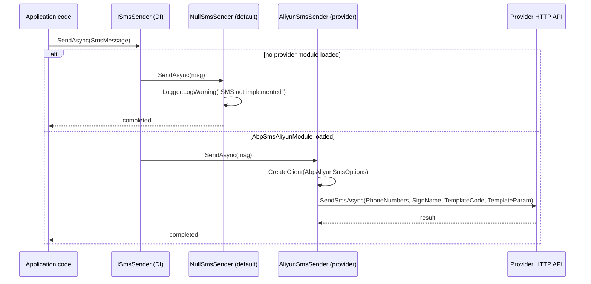

`Volo.Abp.Sms` is the smallest possible abstraction over outbound SMS — one interface, one DTO, one null fallback. The interesting work happens in the provider packages ([Aliyun](/misc/sms-aliyun), [Tencent Cloud](/misc/sms-tencentcloud)). Understanding the abstractions package is mostly about understanding **how `SmsMessage.Properties` carries provider data without leaking provider types**.

Source: `framework/src/Volo.Abp.Sms/Volo/Abp/Sms/`

## The contract

```csharp
// framework/src/Volo.Abp.Sms/Volo/Abp/Sms/ISmsSender.cs
namespace Volo.Abp.Sms;

public interface ISmsSender
{
    Task SendAsync(SmsMessage smsMessage);
}
```

One method. No overloads, no `From`, no MIME, no encoding flags — SMS just isn't that complicated at the level we care about here.

## `SmsMessage`

```csharp
// framework/src/Volo.Abp.Sms/Volo/Abp/Sms/SmsMessage.cs
public class SmsMessage
{
    public string PhoneNumber { get; }
    public string Text { get; }
    public IDictionary<string, object> Properties { get; }

    public SmsMessage([NotNull] string phoneNumber, [NotNull] string text)
    {
        PhoneNumber = Check.NotNullOrWhiteSpace(phoneNumber, nameof(phoneNumber));
        Text        = Check.NotNullOrWhiteSpace(text, nameof(text));
        Properties  = new Dictionary<string, object>();
    }
}
```

Three things worth highlighting:

- **Immutable by construction.** `PhoneNumber` and `Text` only have getters; you set them at the constructor. `Check.NotNullOrWhiteSpace` rejects empty strings at the call site rather than letting the bug propagate.
- **`Properties` is a `Dictionary<string, object>`.** This is the abstraction's escape hatch — every provider stuffs its own keys here (signature names, template ids, region overrides) and reads them back in the sender.
- **No `From` field.** SMS sender ids are provider-controlled — set them in the provider options class, not on the message.

### Why a property bag instead of subclassing?

Because callers shouldn't have to know which provider is wired up. Application code does:

```csharp
public class TwoFactorService
{
    private readonly ISmsSender _sms;
    public TwoFactorService(ISmsSender sms) => _sms = sms;

    public Task SendCodeAsync(string phone, string code)
        => _sms.SendAsync(new SmsMessage(phone, code)
        {
            Properties =
            {
                ["SignName"]   = "Contoso", // ignored by null sender, used by Aliyun/Tencent
                ["TemplateId"] = "SMS_2FA",
            }
        });
}
```

If you swap providers (Aliyun → Tencent), the same `Properties` keys are mostly compatible — both use `SignName`, both expect a `TemplateCode`/`TemplateId`. The application service doesn't change.

## The pipeline



## `NullSmsSender`: the default that's actually useful

```csharp
// framework/src/Volo.Abp.Sms/Volo/Abp/Sms/NullSmsSender.cs
[Dependency(TryRegister = true)]
public class NullSmsSender : ISmsSender, ISingletonDependency
{
    public ILogger<NullSmsSender> Logger { get; set; }

    public NullSmsSender()
    {
        Logger = NullLogger<NullSmsSender>.Instance;
    }

    public Task SendAsync(SmsMessage smsMessage)
    {
        Logger.LogWarning($"SMS Sending was not implemented! Using {nameof(NullSmsSender)}:");
        Logger.LogWarning("Phone Number : " + smsMessage.PhoneNumber);
        Logger.LogWarning("SMS Text     : " + smsMessage.Text);
        return Task.CompletedTask;
    }
}
```

A few small but important details:

- **`[Dependency(TryRegister = true)]`** — only registers if no other implementation exists. When you `[DependsOn(typeof(AbpSmsAliyunModule))]`, the Aliyun sender wins because it's *registered first* (modules load in dependency order and Aliyun is downstream of `AbpSmsModule`).
- **`ISingletonDependency`** — there's no per-request state and the warning log isn't worth allocating a new instance for.
- **The log lines deliberately omit `Properties`** so they don't accidentally print PII or auth tokens stuffed into the dictionary. If you need them in development, log them yourself.

## The module

```csharp
// framework/src/Volo.Abp.Sms/Volo/Abp/Sms/AbpSmsModule.cs
public class AbpSmsModule : AbpModule
{
}
```

That's it. The module is empty — its job is simply to be a `[DependsOn(...)]` target so provider modules can declare `[DependsOn(typeof(AbpSmsModule))]` and pull the abstraction in deterministically.

## The convenience extension

```csharp
// framework/src/Volo.Abp.Sms/Volo/Abp/Sms/SmsSenderExtensions.cs
public static class SmsSenderExtensions
{
    public static Task SendAsync([NotNull] this ISmsSender smsSender,
        [NotNull] string phoneNumber, [NotNull] string text)
    {
        Check.NotNull(smsSender, nameof(smsSender));
        return smsSender.SendAsync(new SmsMessage(phoneNumber, text));
    }
}
```

For the common "just send this text to this number" case you don't have to construct the `SmsMessage` yourself:

```csharp
await _sms.SendAsync("+15551234567", "Your code is 482910");
```

It's a tiny piece of sugar, but it keeps test code and trivial call-sites readable.

## How provider packages plug in

A provider package follows three rules:

1. **Implement `ISmsSender`** (not `EmailSenderBase`-style base class — there isn't one and it's not needed).
2. **Register as `ITransientDependency`** so a fresh sender is created per scope (lets `IOptionsMonitor` flow new option values into long-running processes).
3. **Read provider-specific data from `SmsMessage.Properties`** instead of demanding a typed argument.

Here's the Aliyun sender, condensed to make the convention explicit:

```csharp
// framework/src/Volo.Abp.Sms.Aliyun/Volo/Abp/Sms/Aliyun/AliyunSmsSender.cs
public class AliyunSmsSender : ISmsSender, ITransientDependency
{
    protected AbpAliyunSmsOptions Options { get; }

    public AliyunSmsSender(IOptionsMonitor<AbpAliyunSmsOptions> options)
    {
        Options = options.CurrentValue;
    }

    public async Task SendAsync(SmsMessage smsMessage)
    {
        var client = CreateClient();
        await client.SendSmsAsync(new AliyunSendSmsRequest
        {
            PhoneNumbers   = smsMessage.PhoneNumber,
            SignName       = smsMessage.Properties.GetOrDefault("SignName") as string,
            TemplateCode   = smsMessage.Properties.GetOrDefault("TemplateCode") as string,
            TemplateParam  = smsMessage.Text
        });
    }
}
```

…and the Tencent Cloud sender does the same dance with **`TencentCloudSmsProperties.SignName`** and `TencentCloudSmsProperties.TemplateId` constants so call sites use known keys:

```csharp
// framework/src/Volo.Abp.Sms.TencentCloud/Volo/Abp/Sms/TencentCloud/TencentCloudSmsProperties.cs
public static class TencentCloudSmsProperties
{
    public const string SignName   = "SignName";
    public const string TemplateId = "TemplateId";
}
```

The property-bag convention is what lets you write portable application code that **mostly** works against either provider.

## Practical patterns

### Building messages with provider-friendly keys

<CodeGroup>

```csharp Aliyun
await _sms.SendAsync(new SmsMessage("+8613800138000", "{\"code\":\"482910\"}")
{
    Properties =
    {
        ["SignName"]     = "Contoso",
        ["TemplateCode"] = "SMS_123456",
    }
});
```

```csharp Tencent Cloud
await _sms.SendAsync(new SmsMessage("+8613800138000", "482910,5")
{
    Properties =
    {
        [TencentCloudSmsProperties.SignName]   = "Contoso",
        [TencentCloudSmsProperties.TemplateId] = "1234567",
    }
});
```

```csharp Provider-agnostic helper
public class SmsCodeService
{
    private readonly ISmsSender _sms;
    private readonly string _signName;
    private readonly string _templateId;

    public SmsCodeService(ISmsSender sms, IConfiguration cfg)
    {
        _sms        = sms;
        _signName   = cfg["Sms:SignName"]!;
        _templateId = cfg["Sms:TemplateId"]!;
    }

    public Task SendAsync(string phone, string text)
        => _sms.SendAsync(new SmsMessage(phone, text)
        {
            Properties =
            {
                ["SignName"]     = _signName,
                ["TemplateCode"] = _templateId, // Aliyun
                ["TemplateId"]   = _templateId, // Tencent
            }
        });
}
```

</CodeGroup>

### Layering decorators

Because `ISmsSender` is registered with `TryRegister` for the null and `ITransientDependency` for providers, you can wrap with a decorator without fighting DI. ABP's `DynamicProxy` makes this even cleaner, but the manual version is:

```csharp
public class RateLimitedSmsSender : ISmsSender, ITransientDependency
{
    private readonly AliyunSmsSender _inner; // pick the concrete provider you want to wrap
    private readonly IRateLimiter _limiter;

    public RateLimitedSmsSender(AliyunSmsSender inner, IRateLimiter limiter)
    {
        _inner   = inner;
        _limiter = limiter;
    }

    public async Task SendAsync(SmsMessage smsMessage)
    {
        await _limiter.AcquireAsync(smsMessage.PhoneNumber);
        await _inner.SendAsync(smsMessage);
    }
}
```

Register with `[Dependency(ReplaceServices = true)] [ExposeServices(typeof(ISmsSender))]` if you want it to take over the `ISmsSender` slot.

### Testing without sending

The `NullSmsSender` is already a fake — for tests you can either rely on it or replace it with a capturing fake:

```csharp
public class CapturingSmsSender : ISmsSender, ISingletonDependency
{
    public List<SmsMessage> Sent { get; } = new();
    public Task SendAsync(SmsMessage smsMessage)
    {
        Sent.Add(smsMessage);
        return Task.CompletedTask;
    }
}
```

In your test module:

```csharp
context.Services.Replace(ServiceDescriptor.Singleton<ISmsSender, CapturingSmsSender>());
```

Now your unit tests can assert on `_sms.Sent.Single().PhoneNumber` etc.

## What's *not* in the abstraction (and why)

- **No `From`.** Sender IDs are provider-allocated and provisioned out-of-band. Pinning them in `SmsMessage` would be wrong half the time.
- **No template arguments DTO.** Templates are provider concepts; tucking them into `Properties` keeps the contract small.
- **No `QueueAsync`.** Unlike `IEmailSender`, there's no built-in background-job queueing here. Most SMS APIs are HTTP calls that already retry with exponential backoff; if you need queuing, wrap with `IBackgroundJobManager.EnqueueAsync` from your call-site:

```csharp
public class SmsJob : AsyncBackgroundJob<SmsJobArgs>, ITransientDependency
{
    private readonly ISmsSender _sms;
    public SmsJob(ISmsSender sms) => _sms = sms;

    public override Task ExecuteAsync(SmsJobArgs args)
        => _sms.SendAsync(new SmsMessage(args.PhoneNumber, args.Text));
}
```

- **No localization.** SMS bodies are short and template-driven on the carrier side. Localize via the provider's template ids, not via ABP's text-templating module.

## A note on the warning log

`NullSmsSender` logs at `Warning`, not `Information` — deliberately. The intent is that a deployment that forgets to add a provider module gets a noisy signal in the logs, not a quiet "everything looks fine" lie. If you genuinely want SMS to be a no-op in some environments (e.g. ephemeral preview deploys), wrap the null sender and log at `Information` instead:

```csharp
[Dependency(ServiceLifetime.Singleton, ReplaceServices = true)]
[ExposeServices(typeof(ISmsSender))]
public class SilentNullSmsSender : ISmsSender
{
    public Task SendAsync(SmsMessage smsMessage) => Task.CompletedTask;
}
```

## Related

<CardGroup cols={3}>
  <Card title="Aliyun SMS" icon="cloud" href="/misc/sms-aliyun">
    `AliyunSmsSender`, `AbpAliyunSmsOptions`, the `SendSmsRequest` mapping.
  </Card>
  <Card title="Tencent Cloud SMS" icon="cloud-arrow-up" href="/misc/sms-tencentcloud">
    `TencentCloudSmsSender`, the region/endpoint defaults, `TencentCloudSmsProperties`.
  </Card>
  <Card title="Options & configuration" icon="gear" href="/core/options-and-configuration">
    Where provider options come from and how `IOptionsMonitor` keeps long-running services current.
  </Card>
</CardGroup>
