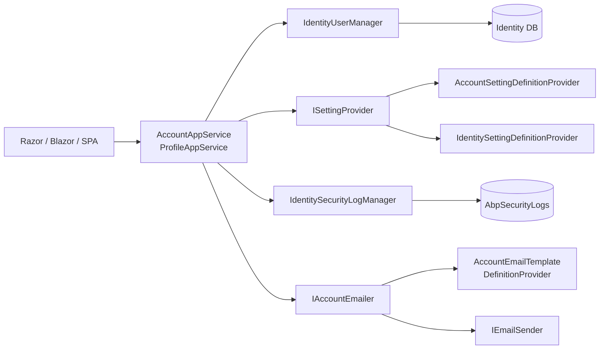

This page covers the application-layer logic of the Account module, shipped in the **`Volo.Abp.Account.Application`** project. It exposes two main services through `IAccountAppService` and `IProfileAppService`, plus the settings / email infrastructure they depend on.

```text modules/account/src/Volo.Abp.Account.Application/
Volo/Abp/Account/
├── AbpAccountApplicationMappers.cs
├── AbpAccountApplicationModule.cs
├── AccountAppService.cs
├── AccountUrlNames.cs
├── DynamicClaimsAppService.cs
├── ProfileAppService.cs
├── Emailing/
│   ├── AccountEmailer.cs
│   ├── AppUrlProviderAccountExtensions.cs
│   ├── IAccountEmailer.cs
│   └── Templates/
│       ├── AccountEmailTemplateDefinitionProvider.cs
│       └── AccountEmailTemplates.cs
└── Settings/
    └── AccountSettingDefinitionProvider.cs
```

## `AccountAppService`

`AccountAppService` is anonymous-accessible — it powers the unauthenticated flows (register, request password reset, complete password reset). It is a thin orchestrator on top of `IdentityUserManager`, the email sender, and the security log.

```csharp modules/account/src/Volo.Abp.Account.Application/Volo/Abp/Account/AccountAppService.cs
public class AccountAppService : ApplicationService, IAccountAppService
{
    protected IIdentityRoleRepository RoleRepository { get; }
    protected IdentityUserManager UserManager { get; }
    protected IAccountEmailer AccountEmailer { get; }
    protected IdentitySecurityLogManager IdentitySecurityLogManager { get; }
    protected IOptions<IdentityOptions> IdentityOptions { get; }

    public AccountAppService(
        IdentityUserManager userManager,
        IIdentityRoleRepository roleRepository,
        IAccountEmailer accountEmailer,
        IdentitySecurityLogManager identitySecurityLogManager,
        IOptions<IdentityOptions> identityOptions)
    {
        RoleRepository = roleRepository;
        AccountEmailer = accountEmailer;
        IdentitySecurityLogManager = identitySecurityLogManager;
        UserManager = userManager;
        IdentityOptions = identityOptions;

        LocalizationResource = typeof(AccountResource);
        ObjectMapperContext = typeof(AbpAccountApplicationModule);
    }
}
```

<Note>
The service inherits `ApplicationService`, so it gets `CurrentTenant`, `CurrentUser`, `SettingProvider`, `L[...]` localization, `ObjectMapper`, and `LazyServiceProvider` for free.
</Note>

### `RegisterAsync(RegisterDto)`

```csharp modules/account/src/Volo.Abp.Account.Application/Volo/Abp/Account/AccountAppService.cs
public virtual async Task<IdentityUserDto> RegisterAsync(RegisterDto input)
{
    await CheckSelfRegistrationAsync();

    await IdentityOptions.SetAsync();

    var user = new IdentityUser(
        GuidGenerator.Create(),
        input.UserName,
        input.EmailAddress,
        CurrentTenant.Id);

    input.MapExtraPropertiesTo(user);

    (await UserManager.CreateAsync(user, input.Password)).CheckErrors();

    await UserManager.SetEmailAsync(user, input.EmailAddress);
    await UserManager.AddDefaultRolesAsync(user);

    return ObjectMapper.Map<IdentityUser, IdentityUserDto>(user);
}
```

Highlights:

- **Self-registration gate.** `CheckSelfRegistrationAsync()` reads `AccountSettingNames.IsSelfRegistrationEnabled` via `SettingProvider` and throws `UserFriendlyException` if disabled. This lets multi-tenant deployments turn off open sign-up per tenant without redeploying.
- **Identity options apply per request.** `IdentityOptions.SetAsync()` is an ABP extension that re-applies password / lockout options from the dynamic settings system before the underlying ASP.NET Core Identity managers run, so tenant-specific password complexity rules take effect.
- **Extra properties pass-through.** `MapExtraPropertiesTo(user)` carries object-extension fields from `RegisterDto` onto `IdentityUser` — that is how `ExtensibleObject` extra columns survive registration.
- **Default roles.** `UserManager.AddDefaultRolesAsync(user)` adds every role flagged `IsDefault` (managed by the [Identity module](/modules/identity/overview)).

```csharp modules/account/src/Volo.Abp.Account.Application/Volo/Abp/Account/AccountAppService.cs
protected virtual async Task CheckSelfRegistrationAsync()
{
    if (!await SettingProvider.IsTrueAsync(AccountSettingNames.IsSelfRegistrationEnabled))
    {
        throw new UserFriendlyException(L["SelfRegistrationDisabledMessage"]);
    }
}
```

### `SendPasswordResetCodeAsync(SendPasswordResetCodeDto)`

```csharp modules/account/src/Volo.Abp.Account.Application/Volo/Abp/Account/AccountAppService.cs
public virtual async Task SendPasswordResetCodeAsync(SendPasswordResetCodeDto input)
{
    var user = await GetUserByEmailAsync(input.Email);
    var resetToken = await UserManager.GeneratePasswordResetTokenAsync(user);
    await AccountEmailer.SendPasswordResetLinkAsync(
        user, resetToken, input.AppName, input.ReturnUrl, input.ReturnUrlHash);
}

protected virtual async Task<IdentityUser> GetUserByEmailAsync(string email)
{
    var user = await UserManager.FindByEmailAsync(email);
    if (user == null)
    {
        throw new UserFriendlyException(L["Volo.Account:InvalidEmailAddress", email]);
    }
    return user;
}
```

- The token comes from ASP.NET Core Identity's standard password-reset token provider — it is signed and time-bound by the configured token lifespan (`DataProtectionTokenProviderOptions.TokenLifespan`).
- `AppName`, `ReturnUrl`, and `ReturnUrlHash` flow into the email template so the reset link points back at the originating SPA / MVC / Blazor app.
- `AccountEmailer` (in `Volo/Abp/Account/Emailing/AccountEmailer.cs`) builds the URL via `AppUrlProviderAccountExtensions` and renders the `AccountEmailTemplates.PasswordResetLink` template before handing off to the framework's email sender.

### `VerifyPasswordResetTokenAsync(VerifyPasswordResetTokenInput)`

```csharp modules/account/src/Volo.Abp.Account.Application/Volo/Abp/Account/AccountAppService.cs
public virtual async Task<bool> VerifyPasswordResetTokenAsync(VerifyPasswordResetTokenInput input)
{
    var user = await UserManager.GetByIdAsync(input.UserId);
    return await UserManager.VerifyUserTokenAsync(
        user,
        UserManager.Options.Tokens.PasswordResetTokenProvider,
        UserManager<IdentityUser>.ResetPasswordTokenPurpose,
        input.ResetToken);
}
```

Used by the Razor `ResetPasswordModel.OnGetAsync` (and any SPA equivalent) to decide whether to render the reset form or an "invalid / expired link" message. It performs a **read-only** verification — no state changes, no consumption of the token.

### `ResetPasswordAsync(ResetPasswordDto)`

```csharp modules/account/src/Volo.Abp.Account.Application/Volo/Abp/Account/AccountAppService.cs
public virtual async Task ResetPasswordAsync(ResetPasswordDto input)
{
    await IdentityOptions.SetAsync();

    var user = await UserManager.GetByIdAsync(input.UserId);
    (await UserManager.ResetPasswordAsync(user, input.ResetToken, input.Password)).CheckErrors();

    await IdentitySecurityLogManager.SaveAsync(new IdentitySecurityLogContext
    {
        Identity = IdentitySecurityLogIdentityConsts.Identity,
        Action = IdentitySecurityLogActionConsts.ChangePassword
    });
}
```

- `ResetPasswordAsync` rotates the security stamp inside ASP.NET Core Identity, which **invalidates every cookie/refresh token** issued before the reset — a critical security property.
- The `IdentitySecurityLogManager.SaveAsync` call writes an audit record to the `AbpSecurityLogs` table with action `ChangePassword`, identity `Identity`, and the current user's IP / browser captured by the security-log contributor pipeline.
- `CheckErrors()` is an ABP extension on `IdentityResult` that throws `AbpIdentityResultException` if `Succeeded == false`, so the caller gets a proper localized error.

## `ProfileAppService`

`ProfileAppService` is the **authenticated** counterpart: it operates on `CurrentUser.GetId()` and never accepts a user id from the client. It is decorated with `[Authorize]` so unauthenticated calls are rejected at the MVC pipeline before any code runs.

```csharp modules/account/src/Volo.Abp.Account.Application/Volo/Abp/Account/ProfileAppService.cs
[Authorize]
public class ProfileAppService : IdentityAppServiceBase, IProfileAppService
{
    protected IdentityUserManager UserManager { get; }
    protected IOptions<IdentityOptions> IdentityOptions { get; }

    public ProfileAppService(
        IdentityUserManager userManager,
        IOptions<IdentityOptions> identityOptions)
    {
        UserManager = userManager;
        IdentityOptions = identityOptions;
    }
}
```

It extends `IdentityAppServiceBase`, which is itself an `ApplicationService` configured with the `IdentityResource` localization resource and the identity-module object-mapper context — that is why `ProfileDto` mapping "just works".

### `GetAsync()`

```csharp modules/account/src/Volo.Abp.Account.Application/Volo/Abp/Account/ProfileAppService.cs
public virtual async Task<ProfileDto> GetAsync()
{
    var currentUser = await UserManager.GetByIdAsync(CurrentUser.GetId());
    return ObjectMapper.Map<IdentityUser, ProfileDto>(currentUser);
}
```

Returns the canonical projection of the authenticated user. The `ProfileDto` carries `UserName`, `Email`, `Name`, `Surname`, `PhoneNumber`, the two confirmation booleans (`EmailConfirmed`, `PhoneNumberConfirmed`), `ConcurrencyStamp`, and a `HasPassword` flag used by the change-password UI to decide whether to show the **Current Password** field (external-only users may not have one).

### `UpdateAsync(UpdateProfileDto)`

```csharp modules/account/src/Volo.Abp.Account.Application/Volo/Abp/Account/ProfileAppService.cs
public virtual async Task<ProfileDto> UpdateAsync(UpdateProfileDto input)
{
    await IdentityOptions.SetAsync();

    var user = await UserManager.GetByIdAsync(CurrentUser.GetId());

    user.SetConcurrencyStampIfNotNull(input.ConcurrencyStamp);

    if (!string.Equals(user.UserName, input.UserName, StringComparison.InvariantCultureIgnoreCase))
    {
        if (await SettingProvider.IsTrueAsync(IdentitySettingNames.User.IsUserNameUpdateEnabled))
        {
            (await UserManager.SetUserNameAsync(user, input.UserName)).CheckErrors();
        }
    }

    if (!string.Equals(user.Email, input.Email, StringComparison.InvariantCultureIgnoreCase))
    {
        if (await SettingProvider.IsTrueAsync(IdentitySettingNames.User.IsEmailUpdateEnabled))
        {
            (await UserManager.SetEmailAsync(user, input.Email)).CheckErrors();
        }
    }

    if (user.PhoneNumber.IsNullOrWhiteSpace() && input.PhoneNumber.IsNullOrWhiteSpace())
    {
        input.PhoneNumber = user.PhoneNumber;
    }

    if (!string.Equals(user.PhoneNumber, input.PhoneNumber, StringComparison.InvariantCultureIgnoreCase))
    {
        (await UserManager.SetPhoneNumberAsync(user, input.PhoneNumber)).CheckErrors();
    }

    user.Name = input.Name?.Trim();
    user.Surname = input.Surname?.Trim();

    input.MapExtraPropertiesTo(user);

    (await UserManager.UpdateAsync(user)).CheckErrors();

    await CurrentUnitOfWork.SaveChangesAsync();

    return ObjectMapper.Map<IdentityUser, ProfileDto>(user);
}
```

Three things worth flagging:

- **Optimistic concurrency.** `SetConcurrencyStampIfNotNull` writes the client-provided stamp back onto the entity so the underlying EF Core (or Mongo) provider can detect a stale edit.
- **Setting-gated mutations.** Username / email changes go through `IdentitySettingNames.User.IsUserNameUpdateEnabled` and `IsEmailUpdateEnabled`. When disabled, the field is silently ignored — the call still succeeds, but only `Name`, `Surname`, `PhoneNumber`, and extra properties are saved.
- **Phone-number quirk.** The empty-string → existing-value coalescing avoids `SetPhoneNumberAsync` being called with an empty string when the user simply does not have a number on file.

### `ChangePasswordAsync(ChangePasswordInput)`

```csharp modules/account/src/Volo.Abp.Account.Application/Volo/Abp/Account/ProfileAppService.cs
public virtual async Task ChangePasswordAsync(ChangePasswordInput input)
{
    await IdentityOptions.SetAsync();

    var currentUser = await UserManager.GetByIdAsync(CurrentUser.GetId());

    if (currentUser.IsExternal)
    {
        throw new BusinessException(code: IdentityErrorCodes.ExternalUserPasswordChange);
    }

    if (currentUser.PasswordHash == null)
    {
        (await UserManager.AddPasswordAsync(currentUser, input.NewPassword)).CheckErrors();
        return;
    }

    (await UserManager.ChangePasswordAsync(currentUser, input.CurrentPassword, input.NewPassword)).CheckErrors();
}
```

There are three branches:

| Condition | Action |
|---|---|
| `currentUser.IsExternal == true` | Throw `BusinessException("Volo.Abp.Identity:ExternalUserPasswordChange")` — externally-federated users have no local password to change. |
| `PasswordHash == null` (local user who has never set one) | `UserManager.AddPasswordAsync` — no current password required. |
| Otherwise | `UserManager.ChangePasswordAsync` — requires `input.CurrentPassword` and validates it. |

<Warning>
`ChangePasswordAsync` rotates the security stamp, which **does not** automatically sign the user out of the current session for cookie auth (the cookie validator only checks on the next 30-minute interval by default). If you need an immediate sign-out, call `SignInManager.RefreshSignInAsync(user)` after the change — exactly what the Razor `ChangePasswordModelExtensions` flow does.
</Warning>

## Settings container & dependency wiring

Settings are defined in `Settings/AccountSettingDefinitionProvider.cs` and read through the framework's `ISettingProvider`. They are deliberately limited:

```csharp modules/account/src/Volo.Abp.Account.Application.Contracts/Volo/Abp/Account/Settings/AccountSettingNames.cs
public class AccountSettingNames
{
    public const string IsSelfRegistrationEnabled = "Abp.Account.IsSelfRegistrationEnabled";
    public const string EnableLocalLogin          = "Abp.Account.EnableLocalLogin";
}
```

Everything else (password complexity, lockout policy, sign-in confirmation, two-factor requirement, username/email update toggles) belongs to the [Identity module](/modules/identity/overview)'s `IdentitySettingNames` — Account simply consumes those values via the same `ISettingProvider` chain.



The orchestration is uniform: every write goes through `IdentityUserManager` (so policy / token / event hooks fire), every audit goes through `IdentitySecurityLogManager`, and every email goes through `IAccountEmailer` so the template / from-address / app-url providers stay swappable.

## Module registration

```csharp modules/account/src/Volo.Abp.Account.Application/Volo/Abp/Account/AbpAccountApplicationModule.cs
[DependsOn(
    typeof(AbpAccountApplicationContractsModule),
    typeof(AbpIdentityDomainModule),
    typeof(AbpEmailingModule),
    typeof(AbpMapperlyModule)
)]
public class AbpAccountApplicationModule : AbpModule
{
    public override void ConfigureServices(ServiceConfigurationContext context)
    {
        context.Services.AddMapperlyObjectMapper<AbpAccountApplicationModule>();
    }
}
```

The two key dependencies are:

- **`AbpIdentityDomainModule`** — gives access to `IdentityUserManager`, `IIdentityRoleRepository`, `IdentitySecurityLogManager`, and the identity event handlers.
- **`AbpEmailingModule`** — gives access to `IEmailSender` and the `StandardEmailTemplates` machinery used by `AccountEmailer`.

## Calling the services

<CodeGroup>
```csharp Server-side
public class CustomFlowService : ITransientDependency
{
    private readonly IAccountAppService _account;
    private readonly IProfileAppService _profile;

    public CustomFlowService(IAccountAppService account, IProfileAppService profile)
    {
        _account = account;
        _profile = profile;
    }

    public Task<IdentityUserDto> SignUpAsync(string userName, string email, string password)
        => _account.RegisterAsync(new RegisterDto
        {
            UserName     = userName,
            EmailAddress = email,
            Password     = password,
            AppName      = "MVC"
        });

    public Task SendResetAsync(string email)
        => _account.SendPasswordResetCodeAsync(new SendPasswordResetCodeDto
        {
            Email     = email,
            AppName   = "MVC",
            ReturnUrl = "/"
        });
}
```

```csharp Razor PageModel
public class MyPage : AccountPageModel
{
    public async Task<IActionResult> OnPostAsync()
    {
        await AccountAppService.SendPasswordResetCodeAsync(new SendPasswordResetCodeDto
        {
            Email     = Email,
            AppName   = "MVC",
            ReturnUrl = ReturnUrl,
            ReturnUrlHash = ReturnUrlHash
        });

        return RedirectToPage("./PasswordResetLinkSent");
    }
}
```
</CodeGroup>

## Related

<CardGroup cols={2}>
  <Card title="HTTP API" icon="plug" href="/modules/account/http-api">
    The REST surface for the methods on this page.
  </Card>
  <Card title="Razor Pages UI" icon="window" href="/modules/account/web-mvc">
    How the page models orchestrate `IAccountAppService` and `IProfileAppService`.
  </Card>
  <Card title="Identity overview" icon="user-shield" href="/modules/identity/overview">
    The user/role aggregates and `IdentityUserManager` operations consumed here.
  </Card>
  <Card title="Security helpers" icon="lock" href="/security/security-helpers">
    `ICurrentUser`, `AbpClaimTypes`, and the dynamic-claims cache used by the Account flows.
  </Card>
</CardGroup>
