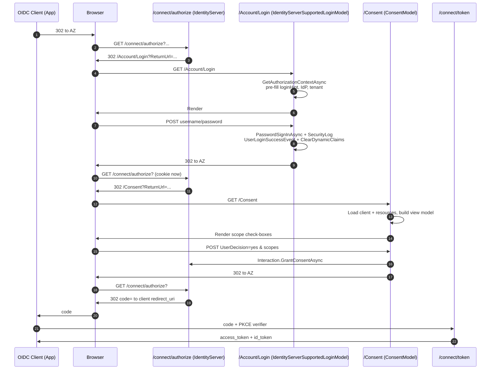

The **`Volo.Abp.Account.Web.IdentityServer`** project is the legacy companion of the [OpenIddict host](/modules/account/openiddict-host) — it bridges the Razor Pages Account UI to an [IdentityServer4-based authorization server](/modules/identityserver/overview). It ships three things that the OpenIddict project does not need:

- A **consent page** (`/Consent.cshtml`) because IdentityServer always prompts unless the client is `RequireConsent = false`.
- An **error controller** so that errors raised by IdentityServer4 (`/Account/Error?errorId=...`) render the framework's themed error page.
- Distinct **login** / **logout** model overrides that consume `IIdentityServerInteractionService`, `IClientStore`, and `IEventService` instead of OpenIddict's transaction primitives.

<Warning>
IdentityServer4 went out of free maintenance years ago and ABP recommends new applications adopt the [OpenIddict host](/modules/account/openiddict-host) instead. This page documents the existing surface for hosts that have not yet migrated.
</Warning>

```text modules/account/src/Volo.Abp.Account.Web.IdentityServer/
├── AbpAccountWebIdentityServerModule.cs
├── Areas/Account/Controllers/
│   └── ErrorController.cs
└── Pages/
    ├── _ViewImports.cshtml
    ├── Consent.cshtml(.cs)
    └── Account/
        ├── IdentityServerSupportedLoginModel.cs
        └── IdentityServerSupportedLogoutModel.cs
```

## `AbpAccountWebIdentityServerModule`

```csharp modules/account/src/Volo.Abp.Account.Web.IdentityServer/AbpAccountWebIdentityServerModule.cs
[DependsOn(
    typeof(AbpAccountWebModule),
    typeof(AbpIdentityServerDomainModule)
    )]
public class AbpAccountWebIdentityServerModule : AbpModule
{
    public override void PreConfigureServices(ServiceConfigurationContext context)
    {
        context.Services.PreConfigure<AbpIdentityAspNetCoreOptions>(options =>
        {
            options.ConfigureAuthentication = false;
        });

        PreConfigure<IMvcBuilder>(mvcBuilder =>
        {
            mvcBuilder.AddApplicationPartIfNotExists(typeof(AbpAccountWebIdentityServerModule).Assembly);
        });
    }

    public override void ConfigureServices(ServiceConfigurationContext context)
    {
        Configure<AbpVirtualFileSystemOptions>(options =>
        {
            options.FileSets.AddEmbedded<AbpAccountWebIdentityServerModule>();
        });

        Configure<IdentityServerOptions>(options =>
        {
            options.UserInteraction.ConsentUrl = "/Consent";
            options.UserInteraction.ErrorUrl   = "/Account/Error";
        });

        //TODO: Try to reuse from AbpIdentityAspNetCoreModule
        context.Services
            .AddAuthentication(o =>
            {
                o.DefaultScheme       = IdentityConstants.ApplicationScheme;
                o.DefaultSignInScheme = IdentityConstants.ExternalScheme;
            })
            .AddIdentityCookies();
    }
}
```

Three details matter:

1. **`ConfigureAuthentication = false`** prevents the base Identity ASP.NET Core module from registering its own authentication stack — this module re-does it locally to control the scheme defaults required by IdentityServer.
2. The IdentityServer `UserInteraction.ConsentUrl` and `ErrorUrl` are pointed at the views shipped here (`/Consent` and `/Account/Error`).
3. `AddIdentityCookies()` registers the standard cookie schemes (`Identity.Application`, `Identity.External`, `Identity.TwoFactorRememberMe`) — required because IdentityServer relies on `Identity.Application` for the authenticated session and `Identity.External` for the external-login round-trip.

## `IdentityServerSupportedLoginModel`

```csharp modules/account/src/Volo.Abp.Account.Web.IdentityServer/Pages/Account/IdentityServerSupportedLoginModel.cs
[ExposeServices(typeof(LoginModel))]
public class IdentityServerSupportedLoginModel : LoginModel
{
    protected IIdentityServerInteractionService Interaction       { get; }
    protected IClientStore                      ClientStore       { get; }
    protected IEventService                     IdentityServerEvents { get; }

    public IdentityServerSupportedLoginModel(
        IAuthenticationSchemeProvider schemeProvider,
        IOptions<AbpAccountOptions> accountOptions,
        IOptions<IdentityOptions> identityOptions,
        IdentityDynamicClaimsPrincipalContributorCache identityDynamicClaimsPrincipalContributorCache,
        IIdentityServerInteractionService interaction,
        IClientStore clientStore,
        IEventService identityServerEvents,
        IWebHostEnvironment webHostEnvironment)
        : base(schemeProvider, accountOptions, identityOptions,
               identityDynamicClaimsPrincipalContributorCache, webHostEnvironment)
    {
        Interaction          = interaction;
        ClientStore          = clientStore;
        IdentityServerEvents = identityServerEvents;
    }
}
```

`[ExposeServices(typeof(LoginModel))]` swaps this subclass in for the base `LoginModel` whenever Razor instantiates `/Account/Login`.

### `OnGetAsync` — IdP restrictions & login hint

```csharp modules/account/src/Volo.Abp.Account.Web.IdentityServer/Pages/Account/IdentityServerSupportedLoginModel.cs
public override async Task<IActionResult> OnGetAsync()
{
    LoginInput = new LoginInputModel();

    var context = await Interaction.GetAuthorizationContextAsync(ReturnUrl);

    if (context != null)
    {
        LoginInput.UserNameOrEmailAddress = context.LoginHint;

        var tenant = context.Parameters[TenantResolverConsts.DefaultTenantKey];
        if (!string.IsNullOrEmpty(tenant))
        {
            CurrentTenant.Change(Guid.Parse(tenant));
            Response.Cookies.Append(TenantResolverConsts.DefaultTenantKey, tenant);
        }
    }

    if (context?.IdP != null)
    {
        LoginInput.UserNameOrEmailAddress = context.LoginHint;
        ExternalProviders = new[] { new ExternalProviderModel { AuthenticationScheme = context.IdP } };
        return Page();
    }

    var providers = await GetExternalProviders();
    ExternalProviders = providers.ToList();
    EnableLocalLogin = await SettingProvider.IsTrueAsync(AccountSettingNames.EnableLocalLogin);

    if (context?.Client?.ClientId != null)
    {
        var client = await ClientStore.FindEnabledClientByIdAsync(context?.Client?.ClientId);
        if (client != null)
        {
            EnableLocalLogin = client.EnableLocalLogin;

            if (client.IdentityProviderRestrictions != null && client.IdentityProviderRestrictions.Any())
            {
                providers = providers
                    .Where(p => client.IdentityProviderRestrictions.Contains(p.AuthenticationScheme))
                    .ToList();
            }
        }
    }

    if (IsExternalLoginOnly)
    {
        return await base.OnPostExternalLogin(providers.First().AuthenticationScheme);
    }

    return Page();
}
```

What the IdentityServer host adds on top of the base login page:

- **`context.LoginHint`** pre-fills the username field (parity with OpenIddict).
- **`context.IdP`** forces the user through a specific identity provider when the client requested `acr_values=idp:google` — the form renders with only that provider and no local-login fields.
- **`Client.EnableLocalLogin`** overrides the global `Abp.Account.EnableLocalLogin` setting per client, so different applications can disable username/password locally while still permitting it elsewhere on the same host.
- **`Client.IdentityProviderRestrictions`** filters the list of external providers presented to the user — for example, a B2B tenant client might only expose Azure AD while the consumer client exposes Google + Microsoft + Apple.
- The tenant key in the IdentityServer `RequestParameters` collection is propagated into `CurrentTenant` and a cookie, just like the OpenIddict host.

### `OnPostAsync` — Cancel and event raise

```csharp modules/account/src/Volo.Abp.Account.Web.IdentityServer/Pages/Account/IdentityServerSupportedLoginModel.cs
public override async Task<IActionResult> OnPostAsync(string action)
{
    var context = await Interaction.GetAuthorizationContextAsync(ReturnUrl);
    if (action == "Cancel")
    {
        if (context == null) return Redirect("~/");

        await Interaction.GrantConsentAsync(context, new ConsentResponse()
        {
            Error = AuthorizationError.AccessDenied
        });

        return Redirect(ReturnUrl);
    }

    await CheckLocalLoginAsync();
    ValidateModel();
    await IdentityOptions.SetAsync();

    var result = await SignInManager.PasswordSignInAsync(
        LoginInput.UserNameOrEmailAddress,
        LoginInput.Password,
        LoginInput.RememberMe,
        true);

    await IdentitySecurityLogManager.SaveAsync(new IdentitySecurityLogContext()
    {
        Identity = IdentitySecurityLogIdentityConsts.Identity,
        Action   = result.ToIdentitySecurityLogAction(),
        UserName = LoginInput.UserNameOrEmailAddress,
        ClientId = context?.Client?.ClientId   // <— extra
    });

    // ... lockout / not-allowed / failure branches identical to base ...

    var user = await UserManager.FindByNameAsync(LoginInput.UserNameOrEmailAddress)
            ?? await UserManager.FindByEmailAsync(LoginInput.UserNameOrEmailAddress);

    await IdentityServerEvents.RaiseAsync(
        new UserLoginSuccessEvent(user.UserName, user.Id.ToString(), user.UserName));

    await IdentityDynamicClaimsPrincipalContributorCache.ClearAsync(user.Id, user.TenantId);

    return await RedirectSafelyAsync(ReturnUrl, ReturnUrlHash);
}
```

Two IdentityServer-only behaviours:

- **Cancel** calls `Interaction.GrantConsentAsync(context, AccessDenied)` — IdentityServer then redirects back to the client with `error=access_denied`. (OpenIddict reaches the same effect by reconstructing the server transaction.)
- **`UserLoginSuccessEvent`** is emitted to `IEventService` so any installed IdentityServer sinks (logging, analytics) get a structured event with the user id and name.
- The **`ClientId`** is added to the security log so security teams can correlate failed sign-ins with the OAuth client that initiated them.

## `IdentityServerSupportedLogoutModel`

```csharp modules/account/src/Volo.Abp.Account.Web.IdentityServer/Pages/Account/IdentityServerSupportedLogoutModel.cs
[ExposeServices(typeof(LogoutModel))]
public class IdentityServerSupportedLogoutModel : LogoutModel
{
    protected IIdentityServerInteractionService Interaction { get; }

    public IdentityServerSupportedLogoutModel(IIdentityServerInteractionService interaction)
    {
        Interaction = interaction;
    }

    public async override Task<IActionResult> OnGetAsync()
    {
        await SignInManager.SignOutAsync();

        var logoutId = Request.Query["logoutId"].ToString();

        if (!string.IsNullOrEmpty(logoutId))
        {
            var logoutContext = await Interaction.GetLogoutContextAsync(logoutId);

            await SaveSecurityLogAsync(logoutContext?.ClientId);
            await SignInManager.SignOutAsync();

            HttpContext.User = new ClaimsPrincipal(new ClaimsIdentity());

            var vm = new LoggedOutModel()
            {
                PostLogoutRedirectUri = logoutContext?.PostLogoutRedirectUri,
                ClientName            = logoutContext?.ClientName,
                SignOutIframeUrl      = logoutContext?.SignOutIFrameUrl
            };

            return RedirectToPage("./LoggedOut", vm);
        }

        await SaveSecurityLogAsync();

        if (ReturnUrl != null) return LocalRedirect(ReturnUrl);
        return RedirectToPage("/Account/Login");
    }

    protected virtual async Task SaveSecurityLogAsync(string clientId = null)
    {
        if (CurrentUser.IsAuthenticated)
        {
            await IdentitySecurityLogManager.SaveAsync(new IdentitySecurityLogContext()
            {
                Identity = IdentitySecurityLogIdentityConsts.Identity,
                Action   = IdentitySecurityLogActionConsts.Logout,
                ClientId = clientId
            });
        }
    }
}
```

The interesting parts:

- **`logoutId`** is the opaque handle IdentityServer puts on the end-session URL — when present, `GetLogoutContextAsync` returns the client name, post-logout redirect URI, and a **front-channel sign-out iframe URL**. The view `LoggedOut.cshtml` renders that iframe so other RPs participating in the same session also drop their cookies (federated single sign-out).
- After the iframe runs, the browser is redirected to `PostLogoutRedirectUri` so the user lands back on the application they came from.

## `/Consent.cshtml.cs`

```csharp modules/account/src/Volo.Abp.Account.Web.IdentityServer/Pages/Consent.cshtml.cs
public class ConsentModel : AbpPageModel
{
    [HiddenInput, BindProperty(SupportsGet = true)] public string ReturnUrl     { get; set; }
    [HiddenInput, BindProperty(SupportsGet = true)] public string ReturnUrlHash { get; set; }

    [BindProperty]
    public ConsentInputModel ConsentInput { get; set; }

    public ClientInfoModel ClientInfo { get; set; }

    private readonly IIdentityServerInteractionService _interaction;
    private readonly IClientStore                      _clientStore;
    private readonly IResourceStore                    _resourceStore;

    public ConsentModel(
        IIdentityServerInteractionService interaction,
        IClientStore clientStore,
        IResourceStore resourceStore)
    {
        _interaction   = interaction;
        _clientStore   = clientStore;
        _resourceStore = resourceStore;
    }
}
```

`OnGet` walks the interaction service to recover the in-flight authorization request, then asks the `IResourceStore` for the identity / API scopes it includes and builds a view-model:

```csharp modules/account/src/Volo.Abp.Account.Web.IdentityServer/Pages/Consent.cshtml.cs
var request = await _interaction.GetAuthorizationContextAsync(ReturnUrl);
var client  = await _clientStore.FindEnabledClientByIdAsync(request.Client.ClientId);
var resources = await _resourceStore.FindEnabledResourcesByScopeAsync(
    request.ValidatedResources.RawScopeValues);

ClientInfo = new ClientInfoModel(client);
ConsentInput = new ConsentInputModel
{
    RememberConsent  = true,
    IdentityScopes   = resources.IdentityResources.Select(x => CreateScopeViewModel(x, true)).ToList()
};

// API scopes
var apiScopes = new List<ScopeViewModel>();
foreach (var parsedScope in request.ValidatedResources.ParsedScopes)
{
    var apiScope = request.ValidatedResources.Resources.FindApiScope(parsedScope.ParsedName);
    if (apiScope != null)
        apiScopes.Add(CreateScopeViewModel(parsedScope, apiScope, true));
}
if (resources.OfflineAccess)
    apiScopes.Add(GetOfflineAccessScope(true));
ConsentInput.ApiScopes = apiScopes;
```

`OnPost` translates the form decision into an IdentityServer `ConsentResponse`:

```csharp modules/account/src/Volo.Abp.Account.Web.IdentityServer/Pages/Consent.cshtml.cs
ConsentResponse grantedConsent;

if (ConsentInput.UserDecision == "no")
{
    grantedConsent = new ConsentResponse
    {
        Error = AuthorizationError.AccessDenied
    };
}
else
{
    if (!ConsentInput.IdentityScopes.IsNullOrEmpty() || !ConsentInput.ApiScopes.IsNullOrEmpty())
    {
        grantedConsent = new ConsentResponse
        {
            RememberConsent       = ConsentInput.RememberConsent,
            ScopesValuesConsented = ConsentInput.GetAllowedScopeNames()
        };
    }
    else
    {
        throw new UserFriendlyException("You must pick at least one permission");
    }
}

var request = await _interaction.GetAuthorizationContextAsync(ReturnUrl);
await _interaction.GrantConsentAsync(request, grantedConsent);
result.RedirectUri = ReturnUrl;
```

The result drives the browser back to `/connect/authorize?...` with the user's consent decision baked in, which IdentityServer materializes into either an authorization-code response or an `error=access_denied` redirect.

## `Areas/Account/Controllers/ErrorController.cs`

```csharp modules/account/src/Volo.Abp.Account.Web.IdentityServer/Areas/Account/Controllers/ErrorController.cs
[Area("account")]
public class ErrorController : AbpController
{
    private readonly IIdentityServerInteractionService _interaction;
    private readonly IWebHostEnvironment               _environment;
    private readonly AbpErrorPageOptions               _abpErrorPageOptions;

    public virtual async Task<IActionResult> Index(string errorId)
    {
        var errorMessage = await _interaction.GetErrorContextAsync(errorId) ?? new ErrorMessage
        {
            Error = L["Error"]
        };

        if (!_environment.IsDevelopment())
        {
            errorMessage.ErrorDescription = null;
        }

        const int statusCode = (int)HttpStatusCode.InternalServerError;

        return View(GetErrorPageUrl(statusCode), new AbpErrorViewModel
        {
            ErrorInfo      = new RemoteServiceErrorInfo(errorMessage.Error, errorMessage.ErrorDescription),
            HttpStatusCode = statusCode
        });
    }
}
```

`Interaction.GetErrorContextAsync(errorId)` returns the structured error IdentityServer4 produced (invalid client id, invalid scope, missing redirect URI, etc.), and the controller forwards it into the ABP-themed error page. `ErrorDescription` is suppressed outside development so production users do not see the raw OAuth error reasons.

## End-to-end flow



## Migrating away

ABP has officially recommended OpenIddict over IdentityServer for new applications since v6. The migration is mostly module-level: swap `AbpAccountWebIdentityServerModule` for `AbpAccountWebOpenIddictModule`, replace `AbpIdentityServerDomainModule` with the OpenIddict equivalents, and re-seed clients/scopes against the OpenIddict tables. See:

<CardGroup cols={2}>
  <Card title="OpenIddict overview" icon="key" href="/modules/openiddict/overview">
    The recommended replacement.
  </Card>
  <Card title="Account + OpenIddict host" icon="key" href="/modules/account/openiddict-host">
    The mirror of this page, OpenIddict-flavoured.
  </Card>
  <Card title="IdentityServer overview" icon="building-shield" href="/modules/identityserver/overview">
    Client / scope / API resource configuration that still applies here.
  </Card>
  <Card title="Razor Pages UI" icon="window" href="/modules/account/web-mvc">
    Base `LoginModel` / `LogoutModel` overridden in this project.
  </Card>
  <Card title="Security helpers" icon="lock" href="/security/security-helpers">
    `ICurrentTenant`, dynamic claims, security log helpers used here.
  </Card>
  <Card title="OpenID Connect authentication" icon="globe" href="/aspnetcore/auth-openidconnect">
    How an ASP.NET Core relying party consumes the tokens regardless of which host issued them.
  </Card>
</CardGroup>
