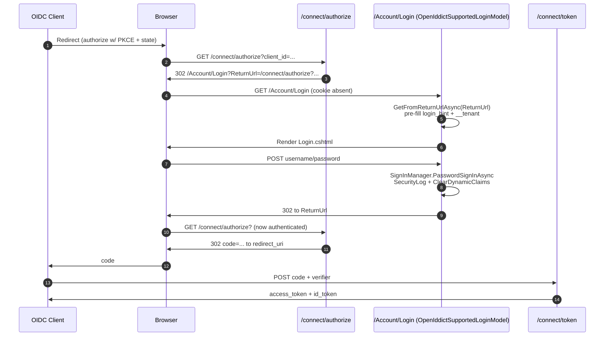

The **`Volo.Abp.Account.Web.OpenIddict`** project is the bridge that makes the Razor Pages UI of the Account module behave correctly inside an [OpenIddict authorization server](/modules/openiddict/overview). It does not introduce new endpoints — those still come from the OpenIddict module's `AuthorizationController` / `TokenController` / `UserInfoController`. What it does is **override the Razor `LoginModel`** so login understands incoming OpenIddict authorization requests (client id, login hint, tenant parameter, cancel button), and ship the module wiring that depends on `AbpOpenIddictAspNetCoreModule`.

```text modules/account/src/Volo.Abp.Account.Web.OpenIddict/
├── AbpAccountWebOpenIddictModule.cs
├── Pages/
│   ├── _ViewImports.cshtml
│   └── Account/
│       └── OpenIddictSupportedLoginModel.cs
└── Volo.Abp.Account.Web.OpenIddict.csproj
```

There are intentionally **no `.cshtml` views** in this project — it reuses the views that ship in `Volo.Abp.Account.Web` and only swaps the page model behind them via `[ExposeServices(typeof(LoginModel))]`.

## `AbpAccountWebOpenIddictModule`

```csharp modules/account/src/Volo.Abp.Account.Web.OpenIddict/AbpAccountWebOpenIddictModule.cs
[DependsOn(
    typeof(AbpAccountWebModule),
    typeof(AbpOpenIddictAspNetCoreModule)
)]
public class AbpAccountWebOpenIddictModule : AbpModule
{
    public override void PreConfigureServices(ServiceConfigurationContext context)
    {
        PreConfigure<IMvcBuilder>(mvcBuilder =>
        {
            mvcBuilder.AddApplicationPartIfNotExists(typeof(AbpAccountWebOpenIddictModule).Assembly);
        });
    }

    public override void ConfigureServices(ServiceConfigurationContext context)
    {
        Configure<AbpVirtualFileSystemOptions>(options =>
        {
            options.FileSets.AddEmbedded<AbpAccountWebOpenIddictModule>();
        });
    }
}
```

That's the whole module. It only does two things:

1. **Registers the assembly as an MVC application part** so the framework discovers `OpenIddictSupportedLoginModel` (which has `[ExposeServices(typeof(LoginModel))]`) and the DI container resolves the override.
2. **Adds the embedded file system** so the `_ViewImports.cshtml` shipped here is layered on top of the base Account.Web views.

<Note>
There is no `AbpAccountOpenIddictMvcModule` in the source tree — depend on `AbpAccountWebOpenIddictModule` instead. The naming convention is "*Web* host that adds OpenIddict support" rather than the inverse.
</Note>

## `OpenIddictSupportedLoginModel`

This is the meat of the project — a subclass of the Razor `LoginModel` from `Volo.Abp.Account.Web` that knows how to read an in-flight OpenIddict authorization request and write back a `Forbid` response when the user cancels.

```csharp modules/account/src/Volo.Abp.Account.Web.OpenIddict/Pages/Account/OpenIddictSupportedLoginModel.cs
[ExposeServices(typeof(LoginModel))]
public class OpenIddictSupportedLoginModel : LoginModel
{
    protected AbpOpenIddictRequestHelper OpenIddictRequestHelper { get; }

    public OpenIddictSupportedLoginModel(
        IAuthenticationSchemeProvider schemeProvider,
        IOptions<AbpAccountOptions> accountOptions,
        IOptions<IdentityOptions> identityOptions,
        IdentityDynamicClaimsPrincipalContributorCache identityDynamicClaimsPrincipalContributorCache,
        AbpOpenIddictRequestHelper openIddictRequestHelper,
        IWebHostEnvironment webHostEnvironment)
        : base(schemeProvider, accountOptions, identityOptions,
               identityDynamicClaimsPrincipalContributorCache, webHostEnvironment)
    {
        OpenIddictRequestHelper = openIddictRequestHelper;
    }
}
```

`[ExposeServices(typeof(LoginModel))]` is the ABP attribute that says **"register this class as the implementation of `LoginModel` in the DI container."** When MVC tries to instantiate the page model for `/Account/Login.cshtml`, it asks the container for `LoginModel` and the container returns an `OpenIddictSupportedLoginModel`. No view changes, no route changes — the override is transparent.

### `OnGetAsync` — picking up the authorization request

```csharp modules/account/src/Volo.Abp.Account.Web.OpenIddict/Pages/Account/OpenIddictSupportedLoginModel.cs
public async override Task<IActionResult> OnGetAsync()
{
    LoginInput = new LoginInputModel();

    var request = await OpenIddictRequestHelper.GetFromReturnUrlAsync(ReturnUrl);
    if (request?.ClientId != null)
    {
        // TODO: Find a proper cancel way.
        // ShowCancelButton = true;

        LoginInput.UserNameOrEmailAddress = request.LoginHint;

        //TODO: Reference AspNetCore MultiTenancy module and use options to get the tenant key!
        var tenant = request.GetParameter(TenantResolverConsts.DefaultTenantKey)?.ToString();
        if (!string.IsNullOrEmpty(tenant))
        {
            CurrentTenant.Change(Guid.Parse(tenant));
            Response.Cookies.Append(TenantResolverConsts.DefaultTenantKey, tenant);
        }
    }

    return await base.OnGetAsync();
}
```

What is happening:

- `OpenIddictRequestHelper.GetFromReturnUrlAsync(ReturnUrl)` (defined in `Volo.Abp.OpenIddict.AspNetCore/Volo/Abp/OpenIddict/AbpOpenIddictRequestHelper.cs`) parses the `ReturnUrl` query parameter to recover the original `OpenIddictRequest`. This works because OpenIddict round-trips authorization requests through `/connect/authorize?...` → cookie → return URL.
- The **login hint** (`login_hint=alice@example.com`) is pre-filled into the username field — a smoother UX for users coming from an OIDC client that has already collected an identifier.
- The **tenant parameter** (`__tenant=<guid>`) is propagated into both `ICurrentTenant` and a response cookie, so the rest of the login flow runs against the correct tenant's user store. This is how multi-tenant OpenIddict hosts route per-tenant logins from the same authorization endpoint.

After populating these, control falls through to `base.OnGetAsync()` which executes the regular Account.Web login logic (discover external providers, evaluate `EnableLocalLogin`, render the page or short-circuit to a challenge).

### `OnPostAsync` — handling Cancel

The post handler adds a single new behaviour: a **Cancel** button that returns an OpenIddict-compliant `access_denied` error.

```csharp modules/account/src/Volo.Abp.Account.Web.OpenIddict/Pages/Account/OpenIddictSupportedLoginModel.cs
public async override Task<IActionResult> OnPostAsync(string action)
{
    if (action == "Cancel")
    {
        var request = await OpenIddictRequestHelper.GetFromReturnUrlAsync(ReturnUrl);

        var transaction = HttpContext.GetOpenIddictServerTransaction();
        if (request?.ClientId != null && transaction != null)
        {
            transaction.EndpointType = OpenIddictServerEndpointType.Authorization;
            transaction.Request      = request;

            var notification = new OpenIddictServerEvents.ValidateAuthorizationRequestContext(transaction);
            transaction.SetProperty(
                typeof(OpenIddictServerEvents.ValidateAuthorizationRequestContext).FullName!,
                notification);

            return Forbid(OpenIddictServerAspNetCoreDefaults.AuthenticationScheme);
        }

        return Redirect("~/");
    }

    return await base.OnPostAsync(action);
}
```

The key idea: rather than just redirecting away (which would leave the OIDC client hanging), the cancel branch **reconstructs the OpenIddict transaction** so the server's authorization handler emits a proper `error=access_denied` redirect back to the client's `redirect_uri`. From the relying party's perspective, the user simply clicked "No" on the authorization screen.

When `action` is anything else, the base `LoginModel.OnPostAsync` runs — username/password sign-in, security log, dynamic claims cache clear, redirect-safely to `ReturnUrl`. After login the browser hits `ReturnUrl`, which is typically `/connect/authorize?...`, and OpenIddict completes the flow.

### `OnPostExternalLogin` — Windows-auth special case

```csharp modules/account/src/Volo.Abp.Account.Web.OpenIddict/Pages/Account/OpenIddictSupportedLoginModel.cs
public async override Task<IActionResult> OnPostExternalLogin(string provider)
{
    if (AccountOptions.WindowsAuthenticationSchemeName == provider)
    {
        return await ProcessWindowsLoginAsync();
    }

    return await base.OnPostExternalLogin(provider);
}

protected virtual async Task<IActionResult> ProcessWindowsLoginAsync()
{
    var result = await HttpContext.AuthenticateAsync(AccountOptions.WindowsAuthenticationSchemeName);
    if (result.Succeeded)
    {
        var props = new AuthenticationProperties()
        {
            RedirectUri = Url.Page("./Login", pageHandler: "ExternalLoginCallback",
                                   values: new { ReturnUrl, ReturnUrlHash }),
            Items = { { "LoginProvider", AccountOptions.WindowsAuthenticationSchemeName } }
        };

        var id = new ClaimsIdentity(AccountOptions.WindowsAuthenticationSchemeName);
        id.AddClaim(new Claim(ClaimTypes.NameIdentifier,
            result.Principal.FindFirstValue(ClaimTypes.PrimarySid)));
        id.AddClaim(new Claim(ClaimTypes.Name,
            result.Principal.FindFirstValue(ClaimTypes.Name)));

        await HttpContext.SignInAsync(IdentityConstants.ExternalScheme,
            new ClaimsPrincipal(id), props);

        return Redirect(props.RedirectUri!);
    }

    return Challenge(AccountOptions.WindowsAuthenticationSchemeName);
}
```

The OpenIddict host runs as a single sign-on hub, so it commonly fronts an intranet via Windows authentication. The handler signs the Windows principal into the `IdentityConstants.ExternalScheme` cookie and then redirects to `ExternalLoginCallback` on the base `LoginModel`, which links the Windows identity to the corresponding `IdentityUser` and rotates the security stamp.

## How the host actually authorizes and tokens flow

`Volo.Abp.Account.Web.OpenIddict` does **not** ship the authorization, token, userinfo, or logout endpoints — those are owned by `Volo.Abp.OpenIddict.AspNetCore` (the [OpenIddict module](/modules/openiddict/overview)). The combination is:

| Endpoint | Owner | Notes |
|---|---|---|
| `/connect/authorize` | OpenIddict module's `AuthorizationController` | Resolves the user via the cookie; if no cookie, redirects to `/Account/Login` (which is now `OpenIddictSupportedLoginModel`). |
| `/connect/token` | OpenIddict module's `TokenController` | Standard `authorization_code`, `client_credentials`, `password`, `refresh_token` grants. |
| `/connect/userinfo` | OpenIddict module's `UserInfoController` | Returns the OIDC claims for the bearer token. |
| `/connect/logout` | OpenIddict module's `AuthorizationController.LogoutAsync` | Triggers `/Account/Logout` from `Volo.Abp.Account.Web` to clear the cookie, then completes the end-session redirect. |
| `/Account/Login` | **This project** (override) | OpenIddict-aware login. |
| `/Account/Logout` | `Volo.Abp.Account.Web` (unchanged) | The OpenIddict logout handler delegates to it. |



## Application host wire-up

A minimal OpenIddict host module looks like this (from `modules/openiddict/app/OpenIddict.Demo.Server/OpenIddictServerModule.cs`):

```csharp
[DependsOn(
    typeof(AbpAutofacModule),
    typeof(AbpAspNetCoreMvcUiBasicThemeModule),
    typeof(AbpAccountWebOpenIddictModule),
    typeof(AbpOpenIddictAspNetCoreModule)
    // ... other modules: Identity, EntityFrameworkCore, etc.
)]
public class OpenIddictServerModule : AbpModule { }
```

That single `AbpAccountWebOpenIddictModule` dependency pulls in:

- `AbpAccountWebModule` (Razor Pages, profile management, user menu),
- `AbpOpenIddictAspNetCoreModule` (token / authorize / userinfo endpoints, OpenIddict server middleware),
- and registers `OpenIddictSupportedLoginModel` as the implementation of `LoginModel`.

After that, configuring **applications** (clients), **scopes**, and **authorizations** is purely an OpenIddict module concern — see [OpenIddict overview](/modules/openiddict/overview).

## Customizing the override

You can subclass `OpenIddictSupportedLoginModel` further to plug in your own behaviour (for example, capturing additional OIDC parameters as user-claims or implementing a custom 2FA scheme). Use the same `[ExposeServices(typeof(LoginModel))]` attribute so the container resolves your subclass after this one:

```csharp
[ExposeServices(typeof(LoginModel))]
public class MyLoginModel : OpenIddictSupportedLoginModel
{
    public MyLoginModel(
        IAuthenticationSchemeProvider schemeProvider,
        IOptions<AbpAccountOptions> accountOptions,
        IOptions<IdentityOptions> identityOptions,
        IdentityDynamicClaimsPrincipalContributorCache cache,
        AbpOpenIddictRequestHelper helper,
        IWebHostEnvironment webHostEnvironment)
        : base(schemeProvider, accountOptions, identityOptions, cache, helper, webHostEnvironment) { }

    protected override Task<IActionResult> TwoFactorLoginResultAsync()
    {
        return Task.FromResult<IActionResult>(RedirectToPage("./MyTwoFactor",
            new { ReturnUrl, ReturnUrlHash }));
    }
}
```

ABP's DI policy resolves the **most-recently-registered** implementation of `LoginModel`, so an extra `[ExposeServices(typeof(LoginModel))]` in a downstream module wins over the one shipped here.

## Logout — front-channel vs back-channel

OpenIddict supports both front-channel (HTML form post to the relying party) and back-channel (server-to-server) logout. The Account.Web `LogoutModel` (`Pages/Account/Logout.cshtml.cs`) simply calls `SignInManager.SignOutAsync()` and writes a security log; it does **not** need to know about OpenIddict because the OpenIddict module's `AuthorizationController.LogoutAsync` is what:

1. Resolves the `id_token_hint` to find the originating client.
2. Validates the `post_logout_redirect_uri` against the registered list on the application.
3. Issues the front-channel sign-out HTML or back-channel HTTP call as configured.
4. Redirects the browser to `/Account/Logout` to drop the cookie.
5. Finally redirects to `post_logout_redirect_uri`.

The same `/Account/Logout` URL therefore serves both interactive logouts (user clicks "Sign out" in the user-menu) and OIDC end-session requests, with the security log entries distinguishable through `ClientId` only when the request comes via OpenIddict.

## What about Authorize / Logout pages?

Unlike the [IdentityServer host](/modules/account/identityserver-host) which ships a custom `/Consent` page, the OpenIddict host **does not ship a consent page in this project**. OpenIddict's authorization handler decides whether to skip or render consent based on the application's `ConsentType` (Implicit / Explicit / External / Systematic) — when consent is needed, the OpenIddict module's own `AuthorizationController.Authorize` action renders the page from `Volo.Abp.OpenIddict.AspNetCore` directly. End-session ("logout") is handled by `AuthorizationController.LogoutAsync` which redirects to `/Account/Logout` to clear the cookie.

In other words, this project is intentionally lean: it only contains what is required to make **login** OpenIddict-aware. Everything else is reused as-is.

## Related

<CardGroup cols={2}>
  <Card title="OpenIddict overview" icon="key" href="/modules/openiddict/overview">
    Applications, scopes, authorizations, tokens, and the controllers behind `/connect/*`.
  </Card>
  <Card title="Razor Pages UI" icon="window" href="/modules/account/web-mvc">
    The base `LoginModel` overridden here.
  </Card>
  <Card title="IdentityServer host" icon="building-shield" href="/modules/account/identityserver-host">
    The same idea, but for the legacy IdentityServer4-based host.
  </Card>
  <Card title="OpenID Connect authentication" icon="globe" href="/aspnetcore/auth-openidconnect">
    How an ASP.NET Core client consumes the tokens issued by this host.
  </Card>
  <Card title="Security helpers" icon="lock" href="/security/security-helpers">
    `ICurrentTenant`, dynamic claims, and the principal-contributor cache invalidated on login.
  </Card>
</CardGroup>
