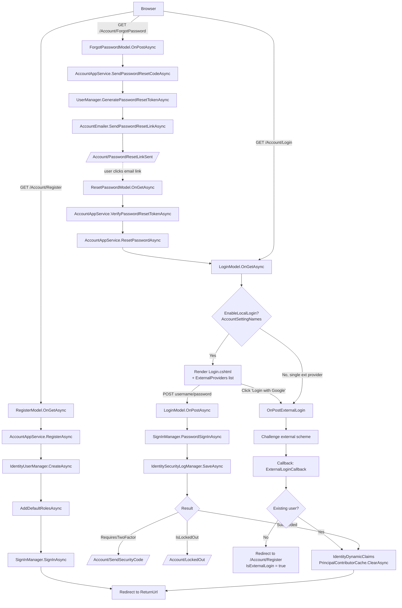
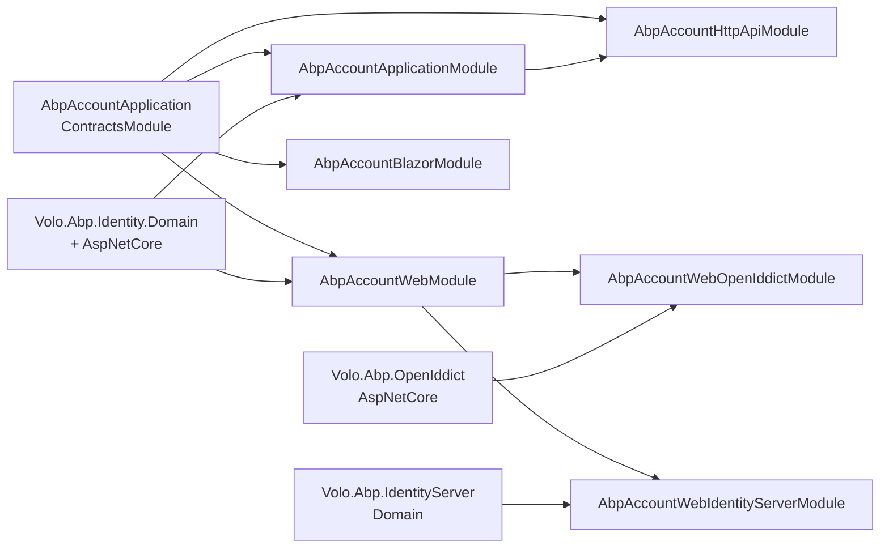

The **Account module** packages the user-facing authentication and profile UI for ABP applications. It is the layer that turns the raw [Identity module](/modules/identity/overview) primitives (`IdentityUser`, `IdentityUserManager`, security stamp, dynamic claims) into pages and APIs a real user can interact with: log in, register, forget/reset a password, change a password, manage profile information, and link external login providers (Google, Microsoft, Windows, OIDC, etc.).

It ships in three flavours that you mix and match:

- **`Volo.Abp.Account.Application`** – `AccountAppService` / `ProfileAppService` and the email + settings infrastructure.
- **`Volo.Abp.Account.HttpApi`** – `AccountController` / `ProfileController` REST endpoints.
- **`Volo.Abp.Account.Web`** – Razor Pages UI (Login, Register, ForgotPassword, ResetPassword, Manage).
- **`Volo.Abp.Account.Blazor`** – Blazor `AccountManage` page and `AbpAccountBlazorUserMenuContributor`.
- **`Volo.Abp.Account.Web.OpenIddict`** – Bridges the Razor pages to the [OpenIddict host](/modules/openiddict/overview).
- **`Volo.Abp.Account.Web.IdentityServer`** – Bridges the Razor pages to the [IdentityServer host](/modules/identityserver/overview).

<Info>
The Account module never owns user state. Persistence, password hashing, lockout, two-factor, security stamp, and external provider claim normalization all live in the [Identity module](/modules/identity/overview). Account is purely a **presentation + orchestration** layer.
</Info>

## Source layout

```text modules/account/src/
Volo.Abp.Account.Application/
  Volo/Abp/Account/AccountAppService.cs
  Volo/Abp/Account/ProfileAppService.cs
  Volo/Abp/Account/DynamicClaimsAppService.cs
  Volo/Abp/Account/Emailing/AccountEmailer.cs
  Volo/Abp/Account/Emailing/Templates/AccountEmailTemplates.cs
  Volo/Abp/Account/Settings/AccountSettingDefinitionProvider.cs
Volo.Abp.Account.Application.Contracts/
  Volo/Abp/Account/Settings/AccountSettingNames.cs
Volo.Abp.Account.HttpApi/
  Volo/Abp/Account/AccountController.cs
  Volo/Abp/Account/ProfileController.cs
Volo.Abp.Account.Web/
  Pages/Account/Login.cshtml(.cs)
  Pages/Account/Register.cshtml(.cs)
  Pages/Account/ForgotPassword.cshtml(.cs)
  Pages/Account/ResetPassword.cshtml(.cs)
  Pages/Account/Manage.cshtml(.cs)
  Pages/Account/Logout.cshtml(.cs)
  Pages/Account/Components/ProfileManagementGroup/
  AbpAccountWebModule.cs
  AbpAccountUserMenuContributor.cs
Volo.Abp.Account.Blazor/
  Pages/Account/AccountManage.razor(.cs)
  AbpAccountBlazorModule.cs
  AbpAccountBlazorUserMenuContributor.cs
Volo.Abp.Account.Web.OpenIddict/
  Pages/Account/OpenIddictSupportedLoginModel.cs
  AbpAccountWebOpenIddictModule.cs
Volo.Abp.Account.Web.IdentityServer/
  Pages/Account/IdentityServerSupportedLoginModel.cs
  Pages/Account/IdentityServerSupportedLogoutModel.cs
  Pages/Consent.cshtml(.cs)
  AbpAccountWebIdentityServerModule.cs
```

## Where to start

<CardGroup cols={2}>
  <Card title="Application services" icon="cog" href="/modules/account/application">
    `AccountAppService.RegisterAsync`, `SendPasswordResetCodeAsync`, `VerifyPasswordResetTokenAsync`, `ResetPasswordAsync` and the `ProfileAppService` triplet `GetAsync` / `UpdateAsync` / `ChangePasswordAsync`.
  </Card>
  <Card title="HTTP API" icon="plug" href="/modules/account/http-api">
    `/api/account/*` and `/api/account/my-profile` endpoints exposed through `AccountController` and `ProfileController`.
  </Card>
  <Card title="Razor Pages (MVC) UI" icon="window" href="/modules/account/web-mvc">
    `Login.cshtml`, `Register.cshtml`, `ForgotPassword.cshtml`, `ResetPassword.cshtml`, `Manage.cshtml`, plus the profile management group view components.
  </Card>
  <Card title="Blazor UI" icon="bolt" href="/modules/account/blazor">
    `AccountManage.razor`, `AbpAccountBlazorUserMenuContributor`, and the personal-info / change-password tabs.
  </Card>
  <Card title="OpenIddict host" icon="key" href="/modules/account/openiddict-host">
    Hooks the Razor pages into the OpenIddict authorization / token / logout endpoints via `OpenIddictSupportedLoginModel` and `AbpAccountWebOpenIddictModule`.
  </Card>
  <Card title="IdentityServer host" icon="shield-halved" href="/modules/account/identityserver-host">
    `Consent.cshtml`, `IdentityServerSupportedLoginModel`, `IdentityServerSupportedLogoutModel`, and the `AbpAccountWebIdentityServerModule` wiring.
  </Card>
</CardGroup>

## End-to-end flows

The diagram below traces the three flows users care about: local login, self-registration, and external (social) login. All three converge on `SignInManager` and the dynamic claims contributor cache so the cookie principal carries the same enriched claim set regardless of how the user authenticated.



## Settings

The module ships only two settings, defined in `Volo.Abp.Account.Application/Volo/Abp/Account/Settings/AccountSettingDefinitionProvider.cs`:

```csharp modules/account/src/Volo.Abp.Account.Application/Volo/Abp/Account/Settings/AccountSettingDefinitionProvider.cs
public class AccountSettingDefinitionProvider : SettingDefinitionProvider
{
    public override void Define(ISettingDefinitionContext context)
    {
        context.Add(
            new SettingDefinition(
                AccountSettingNames.IsSelfRegistrationEnabled,
                "true",
                L("DisplayName:Abp.Account.IsSelfRegistrationEnabled"),
                L("Description:Abp.Account.IsSelfRegistrationEnabled"),
                isVisibleToClients: true)
        );

        context.Add(
            new SettingDefinition(
                AccountSettingNames.EnableLocalLogin,
                "true",
                L("DisplayName:Abp.Account.EnableLocalLogin"),
                L("Description:Abp.Account.EnableLocalLogin"),
                isVisibleToClients: true)
        );
    }
}
```

The constants live in the contracts package so both the UI layer and downstream applications can reference them without pulling in the application implementation:

```csharp modules/account/src/Volo.Abp.Account.Application.Contracts/Volo/Abp/Account/Settings/AccountSettingNames.cs
namespace Volo.Abp.Account.Settings;

public class AccountSettingNames
{
    public const string IsSelfRegistrationEnabled = "Abp.Account.IsSelfRegistrationEnabled";
    public const string EnableLocalLogin          = "Abp.Account.EnableLocalLogin";
}
```

Because both settings are `isVisibleToClients: true`, the JavaScript / Blazor / Angular setting providers can read them directly to hide the **Register** button or the local-login form when the host disables them.

<Tip>
Toggle `Abp.Account.EnableLocalLogin` to **false** when you are running the application as a pure federation gateway (only external IdPs allowed). The Razor `LoginModel` detects this and, if exactly one external provider is configured, performs an automatic challenge — no login screen is rendered at all.
</Tip>

## Module dependency chain



Each module is additive: an SPA front-end with an HTTP-only backend uses `AbpAccountApplicationModule` + `AbpAccountHttpApiModule`; a server-rendered MVC app adds `AbpAccountWebModule`; an OpenIddict host adds `AbpAccountWebOpenIddictModule` on top of the web module.

## Email templates

Password reset emails are rendered through ABP's standard email-template system. The template definitions live in `Volo/Abp/Account/Emailing/Templates/AccountEmailTemplateDefinitionProvider.cs` and the names are exposed as constants:

```csharp modules/account/src/Volo.Abp.Account.Application/Volo/Abp/Account/Emailing/Templates/AccountEmailTemplates.cs
public static class AccountEmailTemplates
{
    public const string PasswordResetLink   = "Volo.Abp.Account.PasswordResetLink";
    public const string EmailConfirmationLink = "Volo.Abp.Account.EmailConfirmationLink";
}
```

`AccountEmailer` (in `Volo/Abp/Account/Emailing/AccountEmailer.cs`) computes the reset URL via `AppUrlProviderAccountExtensions.GetPasswordResetUrlAsync(...)`, expands the template through `ITemplateRenderer`, then hands off to `IEmailSender`. Hosts can override the email body by adding a higher-priority `ITemplateDefinitionProvider` that re-registers `AccountEmailTemplates.PasswordResetLink` with their own content path.

## Choosing the right packages

The Account module is a "pick what you need" toolkit. Use the matrix below to figure out which projects belong in your host:

| Scenario | Packages |
|---|---|
| API-only host that exposes REST endpoints for an external SPA | `Volo.Abp.Account.Application` + `Volo.Abp.Account.HttpApi` |
| API-only host with no anonymous self-registration / forgot-password UI | `Volo.Abp.Account.Application.Contracts` only (clients call your own custom service) |
| Server-rendered MVC app with Razor login & profile UI | + `Volo.Abp.Account.Web` |
| Blazor Server app | + `Volo.Abp.Account.Web` + `Volo.Abp.Account.Blazor` |
| Blazor WebAssembly app talking to a remote authorization server | + `Volo.Abp.Account.HttpApi.Client` + `Volo.Abp.Account.Blazor` |
| OpenIddict authorization server | + `Volo.Abp.Account.Web.OpenIddict` (which pulls in `Volo.Abp.Account.Web`) |
| IdentityServer4 authorization server (legacy) | + `Volo.Abp.Account.Web.IdentityServer` (which pulls in `Volo.Abp.Account.Web`) |

The `Volo.Abp.Account.HttpApi.Client` package ships the **client-side dynamic HTTP proxy** of `IAccountAppService` and `IProfileAppService`. Blazor WebAssembly hosts that depend on it can call `await ProfileAppService.GetAsync()` and the call is transparently translated into an HTTP request against `/api/account/my-profile`.

<Note>
The Account module never enables an authorization server on its own. To issue access tokens you must additionally depend on the **OpenIddict** or **IdentityServer** module — the Account modules merely supply the login/consent UI for those servers.
</Note>

## Object extensions

Both `IdentityUser` and the `PersonalInfoModel` used by the profile-management UI extend `ExtensibleObject`, which means custom columns flow through registration, profile update, and Blazor / Razor form rendering without code changes in the Account module. The Identity module exposes the extension consts:

```csharp
// In your custom domain module:
ObjectExtensionManager.Instance.AddOrUpdateProperty<IdentityUser, string>(
    "Department",
    o =>
    {
        o.Attributes.Add(new RequiredAttribute());
        o.Configuration[IdentityModuleExtensionConsts.ConfigurationNames.AllowUserToEdit] = true;
    });
```

After that:

- `RegisterDto.MapExtraPropertiesTo(user)` and `UpdateProfileDto.MapExtraPropertiesTo(user)` round-trip the value.
- The Blazor `AccountManage.razor` page (see [Blazor UI](/modules/account/blazor)) renders a `<TextEdit>` field for `Department` on the *Personal Info* tab.
- The Razor `Manage.cshtml` page (see [Razor Pages UI](/modules/account/web-mvc)) renders the same field through the `Pages/Account/Components/ProfileManagementGroup/PersonalInfo/Default.cshtml` view component.

This is also how the framework supports "**Pro module**" Account features such as additional consent fields or branded personal-info sections without forking the open-source `Volo.Abp.Account.*` packages.

## Extensibility surfaces

The module is built so almost every behaviour can be overridden without forking:

- **Application services** — `AccountAppService` and `ProfileAppService` mark every method `virtual`. Subclass either and register your subclass with `[ExposeServices(typeof(IAccountAppService))]` to take over.
- **Razor page models** — `LoginModel`, `RegisterModel`, `ForgotPasswordModel`, `ResetPasswordModel`, `LogoutModel` all expose `virtual` handlers. The OpenIddict and IdentityServer host projects use the same pattern (`[ExposeServices(typeof(LoginModel))]`) to layer on protocol-specific logic.
- **Email templates** — replace `Volo.Abp.Account.PasswordResetLink` via an `ITemplateDefinitionProvider`.
- **Profile-management tabs** — implement `IProfileManagementPageContributor` and add it to `ProfileManagementPageOptions.Contributors` to add new sections to `Manage.cshtml`.
- **User menu** — register a custom `IMenuContributor` after `AbpAccountUserMenuContributor` / `AbpAccountBlazorUserMenuContributor` to insert or remove items.
- **Settings** — override `AccountSettingDefinitionProvider.Define` to change defaults, or provide a custom `ISettingValueProvider` for per-tenant overrides.

## Multi-tenancy

Every flow in the Account module is **tenant-aware** because it goes through `IdentityUserManager`, which scopes its queries by `CurrentTenant.Id`. The two integration points to remember are:

| Surface | How the tenant is resolved |
|---|---|
| `AccountController` / `ProfileController` | Standard `__tenant` header / cookie / domain-resolver — anonymous endpoints rely on the request, authenticated endpoints additionally trust the `tenantid` claim. |
| Razor `LoginModel.OnGetAsync` (OpenIddict/IdentityServer overrides) | The `__tenant` parameter on the OIDC authorization request is decoded by the corresponding `*SupportedLoginModel`, applied to `CurrentTenant`, and persisted as a cookie so the rest of the login flow stays in the right scope. |
| `RegisterAsync` | Uses `CurrentTenant.Id` directly when constructing the new `IdentityUser` — there is no tenant override on `RegisterDto`. |

This means a single host can serve many tenants without static configuration: the resolver picks the tenant per request, the Account services do the right thing automatically.

## Cross-references

<CardGroup cols={2}>
  <Card title="Identity module overview" icon="user-shield" href="/modules/identity/overview">
    User store, role store, dynamic claims, lockout, security stamp, external login normalization.
  </Card>
  <Card title="OpenIddict overview" icon="key" href="/modules/openiddict/overview">
    Authorization server pieces (applications, scopes, authorizations, tokens) that the OpenIddict host plugs into.
  </Card>
  <Card title="IdentityServer overview" icon="building-shield" href="/modules/identityserver/overview">
    Legacy IdentityServer4 host wiring used by older ABP templates.
  </Card>
  <Card title="Security helpers" icon="lock" href="/security/security-helpers">
    `ICurrentUser`, `ICurrentTenant`, `AbpClaimTypes`, and the framework's auth helpers used inside the Account pages.
  </Card>
  <Card title="OpenID Connect authentication" icon="globe" href="/aspnetcore/auth-openidconnect">
    How an ASP.NET Core front-end consumes the tokens issued by the Account-backed authorization server.
  </Card>
</CardGroup>
