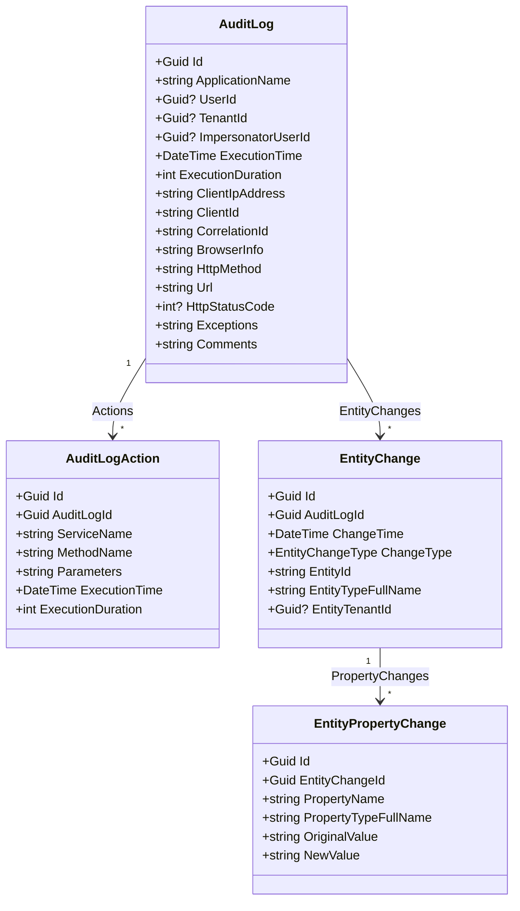

The domain project is the persistence-agnostic heart of the [audit-logging module](/modules/audit-logging/overview). It defines:

- The **`AuditLog`** aggregate root and its child entities `AuditLogAction`, `EntityChange`, `EntityPropertyChange`.
- The **`IAuditLogRepository`** contract — a rich query surface for the management UIs, an `IRepository<AuditLog, Guid>` for everything else.
- **`AuditingStore`** — the implementation of the framework's `IAuditingStore` that turns an `AuditLogInfo` into a persistent `AuditLog`.
- **`AuditLogInfoToAuditLogConverter`** — the mapping logic between the framework's in-memory DTOs and the persistent aggregate.
- Supporting types: `AuditLogEntityTypeFullNameConverter`, `EntityChangeWithUsername`, the helper `AuditLogExcelFile` aggregate, and the `[DisableAuditing]` marker that prevents recursion.

All types live in `modules/audit-logging/src/Volo.Abp.AuditLogging.Domain/Volo/Abp/AuditLogging/`.

<Info>
The string-length limits referenced throughout this page (`AuditLogConsts.MaxUrlLength`, `EntityChangeConsts.MaxEntityIdLength`, etc.) live in `Volo.Abp.AuditLogging.Domain.Shared`. See the [overview](/modules/audit-logging/overview#field-size-discipline) for the full table.
</Info>

## Domain shape



`AuditLog` is the only aggregate root. Both `AuditLogAction` and `EntityChange` are `Entity<Guid>` and carry their `AuditLogId` foreign key explicitly; `EntityPropertyChange` is `Entity<Guid>` with an `EntityChangeId` foreign key. On EF Core all four become tables (`AbpAuditLogs`, `AbpAuditLogActions`, `AbpEntityChanges`, `AbpEntityPropertyChanges`); on MongoDB the children are embedded as sub-documents inside the root collection.

## `AuditLog` — the aggregate root

The constructor is verbose because the framework's `AuditLogInfo` carries the entire request context. Most properties pass through `string.Truncate` so an oversize value never makes it to the schema:

```csharp
// modules/audit-logging/src/Volo.Abp.AuditLogging.Domain/Volo/Abp/AuditLogging/AuditLog.cs
[DisableAuditing]
public class AuditLog : AggregateRoot<Guid>, IMultiTenant
{
    public virtual string ApplicationName { get; set; }
    public virtual Guid? UserId { get; protected set; }
    public virtual string UserName { get; protected set; }
    public virtual Guid? TenantId { get; protected set; }
    public virtual string TenantName { get; protected set; }
    public virtual Guid? ImpersonatorUserId { get; protected set; }
    public virtual string ImpersonatorUserName { get; protected set; }
    public virtual Guid? ImpersonatorTenantId { get; protected set; }
    public virtual string ImpersonatorTenantName { get; protected set; }
    public virtual DateTime ExecutionTime { get; protected set; }
    public virtual int ExecutionDuration { get; protected set; }
    public virtual string ClientIpAddress { get; protected set; }
    public virtual string ClientName { get; protected set; }
    public virtual string ClientId { get; set; }
    public virtual string CorrelationId { get; set; }
    public virtual string BrowserInfo { get; protected set; }
    public virtual string HttpMethod { get; protected set; }
    public virtual string Url { get; protected set; }
    public virtual string Exceptions { get; protected set; }
    public virtual string Comments { get; protected set; }
    public virtual int? HttpStatusCode { get; set; }

    public virtual ICollection<EntityChange> EntityChanges { get; protected set; }
    public virtual ICollection<AuditLogAction> Actions { get; protected set; }

    public AuditLog(
        Guid id,
        string applicationName,
        Guid? tenantId,
        string tenantName,
        Guid? userId,
        string userName,
        DateTime executionTime,
        int executionDuration,
        string clientIpAddress,
        string clientName,
        string clientId,
        string correlationId,
        string browserInfo,
        string httpMethod,
        string url,
        int? httpStatusCode,
        Guid? impersonatorUserId,
        string impersonatorUserName,
        Guid? impersonatorTenantId,
        string impersonatorTenantName,
        ExtraPropertyDictionary extraPropertyDictionary,
        List<EntityChange> entityChanges,
        List<AuditLogAction> actions,
        string exceptions,
        string comments)
        : base(id)
    {
        ApplicationName = applicationName.Truncate(AuditLogConsts.MaxApplicationNameLength);
        TenantId = tenantId;
        TenantName = tenantName.Truncate(AuditLogConsts.MaxTenantNameLength);
        UserId = userId;
        UserName = userName.Truncate(AuditLogConsts.MaxUserNameLength);
        ExecutionTime = executionTime;
        ExecutionDuration = executionDuration;
        ClientIpAddress = clientIpAddress.Truncate(AuditLogConsts.MaxClientIpAddressLength);
        ClientName = clientName.Truncate(AuditLogConsts.MaxClientNameLength);
        ClientId = clientId.Truncate(AuditLogConsts.MaxClientIdLength);
        CorrelationId = correlationId.Truncate(AuditLogConsts.MaxCorrelationIdLength);
        BrowserInfo = browserInfo.Truncate(AuditLogConsts.MaxBrowserInfoLength);
        HttpMethod = httpMethod.Truncate(AuditLogConsts.MaxHttpMethodLength);
        Url = url.Truncate(AuditLogConsts.MaxUrlLength);
        HttpStatusCode = httpStatusCode;
        ImpersonatorUserId = impersonatorUserId;
        ImpersonatorUserName = impersonatorUserName.Truncate(AuditLogConsts.MaxUserNameLength);
        ImpersonatorTenantId = impersonatorTenantId;
        ImpersonatorTenantName = impersonatorTenantName.Truncate(AuditLogConsts.MaxTenantNameLength);
        ExtraProperties = extraPropertyDictionary;
        EntityChanges = entityChanges;
        Actions = actions;
        Exceptions = exceptions;
        Comments = comments.Truncate(AuditLogConsts.MaxCommentsLength);
    }
}
```

Notable design choices:

- **`IMultiTenant`** — every audit log is scoped to a tenant (or to `null` for host actions). Tenant filtering applies on the read path.
- **`Exceptions` is a JSON string**, not a foreign-keyed entity. `AuditLogInfoToAuditLogConverter` serializes a list of `RemoteServiceErrorInfo` into it using `IJsonSerializer`. Fine-grained per-exception queries are deliberately out of scope; if you need that, you can post-process the JSON or add an extra column via the entity-extension system.
- **`Comments` is `string`** — joined with `Environment.NewLine` from the framework's `AuditLogInfo.Comments` list. Always trimmed to `AuditLogConsts.MaxCommentsLength` (default 256).
- **`HttpStatusCode` is a settable `int?`** — `AuditingMiddleware` writes it *after* the constructor runs, because the status code isn't known until the response is on its way out.
- **`Id` is supplied by the converter**, not freshly generated inside the constructor. The same `auditLogId` is reused as the foreign-key value on every child `AuditLogAction` / `EntityChange`, so the converter has to compute it up-front (see `AuditLogInfoToAuditLogConverter` below).

## `AuditLogAction` — application-service calls

Each row corresponds to one method invocation captured by the framework's `AuditingInterceptor`:

```csharp
// modules/audit-logging/src/Volo.Abp.AuditLogging.Domain/Volo/Abp/AuditLogging/AuditLogAction.cs
[DisableAuditing]
public class AuditLogAction : Entity<Guid>, IMultiTenant, IHasExtraProperties
{
    public virtual Guid? TenantId { get; protected set; }
    public virtual Guid AuditLogId { get; protected set; }
    public virtual string ServiceName { get; protected set; }
    public virtual string MethodName { get; protected set; }
    public virtual string Parameters { get; protected set; }
    public virtual DateTime ExecutionTime { get; protected set; }
    public virtual int ExecutionDuration { get; protected set; }
    public virtual ExtraPropertyDictionary ExtraProperties { get; protected set; }

    public AuditLogAction(Guid id, Guid auditLogId, AuditLogActionInfo actionInfo, Guid? tenantId = null)
    {
        Id = id;
        TenantId = tenantId;
        AuditLogId = auditLogId;
        ExecutionTime = actionInfo.ExecutionTime;
        ExecutionDuration = actionInfo.ExecutionDuration;
        ExtraProperties = new ExtraPropertyDictionary(actionInfo.ExtraProperties);
        ServiceName = actionInfo.ServiceName.TruncateFromBeginning(AuditLogActionConsts.MaxServiceNameLength);
        MethodName = actionInfo.MethodName.TruncateFromBeginning(AuditLogActionConsts.MaxMethodNameLength);
        Parameters = actionInfo.Parameters.Length > AuditLogActionConsts.MaxParametersLength ? "" : actionInfo.Parameters;
    }
}
```

`Parameters` is a JSON dump produced by the framework's `AbpAsyncDeterminationInterceptor` — typically a serialised dictionary of `{ name => value }`. If the JSON exceeds `MaxParametersLength` the entire string is dropped to empty (not truncated mid-JSON, which would produce invalid data). `TruncateFromBeginning` keeps the tail of long service / method names so `Controllers.X.Y.Z.LongActionName` still shows the action even if the namespace is cut.

The aggregate exposes these as `AuditLog.Actions` and EF Core sets the FK as required (`HasMany(a => a.Actions).WithOne().HasForeignKey(x => x.AuditLogId).IsRequired()`).

## `EntityChange` — entity-history rows

`EntityChange` records a single tracked insert / update / delete. It is built by the framework's `EntityHistoryHelper` from EF Core's `ChangeTracker`:

```csharp
// modules/audit-logging/src/Volo.Abp.AuditLogging.Domain/Volo/Abp/AuditLogging/EntityChange.cs
[DisableAuditing]
public class EntityChange : Entity<Guid>, IMultiTenant, IHasExtraProperties
{
    public virtual Guid AuditLogId { get; protected set; }
    public virtual Guid? TenantId { get; protected set; }
    public virtual DateTime ChangeTime { get; protected set; }
    public virtual EntityChangeType ChangeType { get; protected set; }
    public virtual Guid? EntityTenantId { get; protected set; }
    public virtual string EntityId { get; protected set; }
    public virtual string EntityTypeFullName { get; protected set; }
    public virtual ICollection<EntityPropertyChange> PropertyChanges { get; protected set; }
    public virtual ExtraPropertyDictionary ExtraProperties { get; protected set; }

    public EntityChange(
        IGuidGenerator guidGenerator,
        Guid auditLogId,
        EntityChangeInfo entityChangeInfo,
        Guid? tenantId = null)
    {
        Id = guidGenerator.Create();
        AuditLogId = auditLogId;
        TenantId = tenantId;
        ChangeTime = entityChangeInfo.ChangeTime;
        ChangeType = entityChangeInfo.ChangeType;
        EntityTenantId = entityChangeInfo.EntityTenantId;
        EntityId = entityChangeInfo.EntityId.Truncate(EntityChangeConsts.MaxEntityTypeFullNameLength);
        EntityTypeFullName = entityChangeInfo.EntityTypeFullName.TruncateFromBeginning(EntityChangeConsts.MaxEntityTypeFullNameLength);

        PropertyChanges = entityChangeInfo
                              .PropertyChanges?
                              .Select(p => new EntityPropertyChange(guidGenerator, Id, p, tenantId))
                              .ToList()
                          ?? new List<EntityPropertyChange>();

        ExtraProperties = new ExtraPropertyDictionary();
        if (entityChangeInfo.ExtraProperties != null)
        {
            foreach (var pair in entityChangeInfo.ExtraProperties)
            {
                ExtraProperties.Add(pair.Key, pair.Value);
            }
        }
    }
}
```

`EntityChangeType` is the framework enum `Created` / `Updated` / `Deleted`. `EntityId` is a *string* because ABP supports composite keys and non-Guid primary keys; the framework serializes them with `JsonSerializer` before assignment.

`EntityTypeFullName` is canonicalized by `AuditLogEntityTypeFullNameConverter` *before* the entity is built — generic-type names like `Volo.MyApp.Order``1[[System.Guid, ...]]` become `Volo.MyApp.Order<System.Guid>` for readability. The same converter rewrites `EntityPropertyChange.PropertyTypeFullName`.

```csharp
// modules/audit-logging/src/Volo.Abp.AuditLogging.Domain/Volo/Abp/AuditLogging/AuditLogEntityTypeFullNameConverter.cs
public class AuditLogEntityTypeFullNameConverter : ITransientDependency
{
    public virtual string Convert(string typeFullName)
    {
        var genericType = Regex.Match(typeFullName, @"(.+?)`1\[\[");
        if (!genericType.Success)
        {
            return ReplaceGenericSymbol(typeFullName);
        }
        // ... unwrap System.Nullable, replace ` and [[ markers ...
    }
}
```

The auxiliary read-model `EntityChangeWithUsername` is what the management UI uses to render "who changed this":

```csharp
// modules/audit-logging/src/Volo.Abp.AuditLogging.Domain/Volo/Abp/AuditLogging/EntityChangeWithUsername.cs
public class EntityChangeWithUsername
{
    public EntityChange EntityChange { get; set; }
    public string UserName { get; set; }
}
```

It is produced by joining `EntityChange` with the parent `AuditLog.UserName` in the repository — see `GetEntityChangesWithUsernameAsync` below.

## `EntityPropertyChange` — diff rows

```csharp
// modules/audit-logging/src/Volo.Abp.AuditLogging.Domain/Volo/Abp/AuditLogging/EntityPropertyChange.cs
[DisableAuditing]
public class EntityPropertyChange : Entity<Guid>, IMultiTenant
{
    public virtual Guid? TenantId { get; protected set; }
    public virtual Guid EntityChangeId { get; protected set; }
    public virtual string NewValue { get; protected set; }
    public virtual string OriginalValue { get; protected set; }
    public virtual string PropertyName { get; protected set; }
    public virtual string PropertyTypeFullName { get; protected set; }

    public EntityPropertyChange(
        IGuidGenerator guidGenerator,
        Guid entityChangeId,
        EntityPropertyChangeInfo entityChangeInfo,
        Guid? tenantId = null)
    {
        Id = guidGenerator.Create();
        TenantId = tenantId;
        EntityChangeId = entityChangeId;
        NewValue = entityChangeInfo.NewValue.Truncate(EntityPropertyChangeConsts.MaxNewValueLength);
        OriginalValue = entityChangeInfo.OriginalValue.Truncate(EntityPropertyChangeConsts.MaxOriginalValueLength);
        PropertyName = entityChangeInfo.PropertyName.TruncateFromBeginning(EntityPropertyChangeConsts.MaxPropertyNameLength);
        PropertyTypeFullName = entityChangeInfo.PropertyTypeFullName.TruncateFromBeginning(EntityPropertyChangeConsts.MaxPropertyTypeFullNameLength);
    }
}
```

Both `NewValue` and `OriginalValue` are stored as strings — the framework serialises them with `JsonSerializer.Serialize(value)` before passing them in. For `Created` rows, `OriginalValue` is `null`; for `Deleted` rows, `NewValue` is `null`.

## `IAuditLogRepository` — the query surface

The repository extends the standard `IRepository<AuditLog, Guid>` (so you get `InsertAsync`, `UpdateAsync`, `DeleteAsync`, `GetAsync`, etc.) and adds the query methods used by the management UI:

```csharp
// modules/audit-logging/src/Volo.Abp.AuditLogging.Domain/Volo/Abp/AuditLogging/IAuditLogRepository.cs
public interface IAuditLogRepository : IRepository<AuditLog, Guid>
{
    Task<List<AuditLog>> GetListAsync(
        string sorting = null,
        int maxResultCount = 50,
        int skipCount = 0,
        DateTime? startTime = null,
        DateTime? endTime = null,
        string httpMethod = null,
        string url = null,
        string clientId = null,
        Guid? userId = null,
        string userName = null,
        string applicationName = null,
        string clientIpAddress = null,
        string correlationId = null,
        int? maxExecutionDuration = null,
        int? minExecutionDuration = null,
        bool? hasException = null,
        HttpStatusCode? httpStatusCode = null,
        bool includeDetails = false,
        CancellationToken cancellationToken = default);

    Task<long> GetCountAsync(
        DateTime? startTime = null,
        DateTime? endTime = null,
        string httpMethod = null,
        string url = null,
        string clientId = null,
        Guid? userId = null,
        string userName = null,
        string applicationName = null,
        string clientIpAddress = null,
        string correlationId = null,
        int? maxExecutionDuration = null,
        int? minExecutionDuration = null,
        bool? hasException = null,
        HttpStatusCode? httpStatusCode = null,
        CancellationToken cancellationToken = default);

    Task<Dictionary<DateTime, double>> GetAverageExecutionDurationPerDayAsync(
        DateTime startDate,
        DateTime endDate,
        CancellationToken cancellationToken = default);

    Task<EntityChange> GetEntityChange(Guid entityChangeId, CancellationToken cancellationToken = default);

    Task<List<EntityChange>> GetEntityChangeListAsync(
        string sorting = null,
        int maxResultCount = 50,
        int skipCount = 0,
        Guid? auditLogId = null,
        DateTime? startTime = null,
        DateTime? endTime = null,
        EntityChangeType? changeType = null,
        string entityId = null,
        string entityTypeFullName = null,
        bool includeDetails = false,
        CancellationToken cancellationToken = default);

    Task<long> GetEntityChangeCountAsync(
        Guid? auditLogId = null,
        DateTime? startTime = null,
        DateTime? endTime = null,
        EntityChangeType? changeType = null,
        string entityId = null,
        string entityTypeFullName = null,
        CancellationToken cancellationToken = default);

    Task<EntityChangeWithUsername> GetEntityChangeWithUsernameAsync(
        Guid entityChangeId,
        CancellationToken cancellationToken = default);

    Task<List<EntityChangeWithUsername>> GetEntityChangesWithUsernameAsync(
        string entityId,
        string entityTypeFullName,
        CancellationToken cancellationToken = default);
}
```

A few things stand out:

- **`GetListAsync` / `GetCountAsync` share the filter parameters.** The convention is one method for the page of rows, one for the total count, both wrapping the same `GetListQueryAsync` builder so the filters can never drift. See [the providers page](/modules/audit-logging/efcore-mongodb) for how that builder composes `WhereIf`.
- **`hasException`** maps to a SARG-friendly predicate: `Exceptions != null && Exceptions != ""`. There is no full-text search on exception payloads at the contract level.
- **`includeDetails: false` by default.** When `true`, the EF Core provider calls `IncludeDetails()` (an `Include(Actions).Include(EntityChanges.ThenInclude(PropertyChanges))` chain) so the entire aggregate loads in one round trip. Keep it off for list pages.
- **`GetAverageExecutionDurationPerDayAsync`** is the only aggregation in the contract; it returns one `(Day, AvgDuration)` pair per `ExecutionTime.Date` in the range. Useful for "average response time over the last N days" charts.
- **`GetEntityChangesWithUsernameAsync(entityId, entityTypeFullName, ...)`** is the per-record history query. The two-string discriminator makes it work for any entity in the host without coupling the module to a specific user type — the implementation joins on `AuditLog.UserId`/`UserName`.

The corresponding implementations are detailed in [`EfCoreAuditLogRepository` and `MongoAuditLogRepository`](/modules/audit-logging/efcore-mongodb).

## `AuditingStore` — the framework hook

`AuditingStore` realizes `IAuditingStore` from `framework/src/Volo.Abp.Auditing`. Read the framework page at [/auditing/auditing-module](/auditing/auditing-module) for the surrounding pipeline.

```csharp
// modules/audit-logging/src/Volo.Abp.AuditLogging.Domain/Volo/Abp/AuditLogging/AuditingStore.cs
public class AuditingStore : IAuditingStore, ITransientDependency
{
    public ILogger<AuditingStore> Logger { get; set; }
    protected IAuditLogRepository AuditLogRepository { get; }
    protected IUnitOfWorkManager UnitOfWorkManager { get; }
    protected AbpAuditingOptions Options { get; }
    protected IAuditLogInfoToAuditLogConverter Converter { get; }

    public AuditingStore(
        IAuditLogRepository auditLogRepository,
        IUnitOfWorkManager unitOfWorkManager,
        IOptions<AbpAuditingOptions> options,
        IAuditLogInfoToAuditLogConverter converter)
    {
        AuditLogRepository = auditLogRepository;
        UnitOfWorkManager = unitOfWorkManager;
        Converter = converter;
        Options = options.Value;
        Logger = NullLogger<AuditingStore>.Instance;
    }

    public virtual async Task SaveAsync(AuditLogInfo auditInfo)
    {
        if (!Options.HideErrors)
        {
            await SaveLogAsync(auditInfo);
            return;
        }

        try
        {
            await SaveLogAsync(auditInfo);
        }
        catch (Exception ex)
        {
            Logger.LogWarning("Could not save the audit log object: " + Environment.NewLine + auditInfo.ToString());
            Logger.LogException(ex, LogLevel.Error);
        }
    }

    protected virtual async Task SaveLogAsync(AuditLogInfo auditInfo)
    {
        using (var uow = UnitOfWorkManager.Begin(true))
        {
            await AuditLogRepository.InsertAsync(await Converter.ConvertAsync(auditInfo));
            await uow.CompleteAsync();
        }
    }
}
```

There is no `AuditLogManager` in this module — the entire workflow fits into the `SaveAsync` / `SaveLogAsync` pair above, which is why one isn't needed. If you need extra side effects (e.g., publish a domain event when an audit log is persisted), override `SaveLogAsync` in a subclass and replace the DI registration:

```csharp
context.Services.Replace(
    ServiceDescriptor.Transient<IAuditingStore, MyAuditingStore>());
```

Three implementation notes:

1. **Required-new UoW.** `UnitOfWorkManager.Begin(requiresNew: true)` ensures the audit log is committed in its own transaction. The ambient request UoW may have already been disposed (audit logs are typically flushed during response writing) or may have rolled back, but the audit row must still land.
2. **`HideErrors` toggle.** The default `AbpAuditingOptions.HideErrors == true` makes audit logging best-effort — a missing connection or table won't bring down the request. Hosting modules that absolutely require an audit-row guarantee should set it to `false`.
3. **Transient lifetime.** Each `SaveAsync` resolves a fresh `IUnitOfWorkManager` scope. Don't cache `AuditingStore` instances.

## `AuditLogInfoToAuditLogConverter` — the mapping

The converter owns the `Guid` for the new aggregate so that the same `auditLogId` can be threaded through every child:

```csharp
// modules/audit-logging/src/Volo.Abp.AuditLogging.Domain/Volo/Abp/AuditLogging/AuditLogInfoToAuditLogConverter.cs
public class AuditLogInfoToAuditLogConverter : IAuditLogInfoToAuditLogConverter, ITransientDependency
{
    protected IGuidGenerator GuidGenerator { get; }
    protected IExceptionToErrorInfoConverter ExceptionToErrorInfoConverter { get; }
    protected IJsonSerializer JsonSerializer { get; }
    protected AbpExceptionHandlingOptions ExceptionHandlingOptions { get; }
    protected AuditLogEntityTypeFullNameConverter AuditLogEntityTypeFullNameConverter { get; }

    public virtual Task<AuditLog> ConvertAsync(AuditLogInfo auditLogInfo)
    {
        var auditLogId = GuidGenerator.Create();

        var extraProperties = new ExtraPropertyDictionary();
        if (auditLogInfo.ExtraProperties != null)
        {
            foreach (var pair in auditLogInfo.ExtraProperties)
            {
                extraProperties.Add(pair.Key, pair.Value);
            }
        }

        foreach (var entityChange in auditLogInfo.EntityChanges ?? Enumerable.Empty<EntityChangeInfo>())
        {
            entityChange.EntityTypeFullName =
                AuditLogEntityTypeFullNameConverter.Convert(entityChange.EntityTypeFullName);

            foreach (var propertyChange in entityChange.PropertyChanges ?? Enumerable.Empty<EntityPropertyChangeInfo>())
            {
                propertyChange.PropertyTypeFullName =
                    AuditLogEntityTypeFullNameConverter.Convert(propertyChange.PropertyTypeFullName);
            }
        }

        var entityChanges = auditLogInfo.EntityChanges?
            .Select(info => new EntityChange(GuidGenerator, auditLogId, info, tenantId: auditLogInfo.TenantId))
            .ToList() ?? new List<EntityChange>();

        var actions = auditLogInfo.Actions?
            .Select(info => new AuditLogAction(GuidGenerator.Create(), auditLogId, info, tenantId: auditLogInfo.TenantId))
            .ToList() ?? new List<AuditLogAction>();

        var remoteServiceErrorInfos = auditLogInfo.Exceptions?
            .Select(ex => ExceptionToErrorInfoConverter.Convert(ex, options =>
            {
                options.SendExceptionsDetailsToClients = ExceptionHandlingOptions.SendExceptionsDetailsToClients;
                options.SendStackTraceToClients = ExceptionHandlingOptions.SendStackTraceToClients;
                options.SendExceptionDataToClientTypes = ExceptionHandlingOptions.SendExceptionDataToClientTypes;
            })) ?? new List<RemoteServiceErrorInfo>();

        var exceptions = remoteServiceErrorInfos.Any()
            ? JsonSerializer.Serialize(remoteServiceErrorInfos, indented: true)
            : null;

        var comments = auditLogInfo.Comments?.JoinAsString(Environment.NewLine);

        var auditLog = new AuditLog(
            auditLogId,
            auditLogInfo.ApplicationName,
            auditLogInfo.TenantId,
            auditLogInfo.TenantName,
            auditLogInfo.UserId,
            auditLogInfo.UserName,
            auditLogInfo.ExecutionTime,
            auditLogInfo.ExecutionDuration,
            auditLogInfo.ClientIpAddress,
            auditLogInfo.ClientName,
            auditLogInfo.ClientId,
            auditLogInfo.CorrelationId,
            auditLogInfo.BrowserInfo,
            auditLogInfo.HttpMethod,
            auditLogInfo.Url,
            auditLogInfo.HttpStatusCode,
            auditLogInfo.ImpersonatorUserId,
            auditLogInfo.ImpersonatorUserName,
            auditLogInfo.ImpersonatorTenantId,
            auditLogInfo.ImpersonatorTenantName,
            extraProperties,
            entityChanges,
            actions,
            exceptions,
            comments
        );

        return Task.FromResult(auditLog);
    }
}
```

The interface (`IAuditLogInfoToAuditLogConverter`) carries a single `Task<AuditLog> ConvertAsync(AuditLogInfo auditLogInfo)` method. Notable details:

- **`auditLogId` is generated first** and reused as the FK on every child — that's why the framework's `AuditLogInfo` doesn't carry an `Id` at all; the persistence layer owns it.
- **Generic-name canonicalisation** is applied *in-place* on `entityChangeInfo.EntityTypeFullName` and `propertyChange.PropertyTypeFullName` before the entities are built. The DTOs are mutable and the converter exploits that.
- **Exception serialization** funnels through `IExceptionToErrorInfoConverter` and `AbpExceptionHandlingOptions` so that the visibility rules used for client-facing error payloads (whether to include stack traces, exception data, etc.) are honoured for the audit log too.
- **`Comments` collection joining** mirrors the framework's pattern: many places along the request can call `IAuditingManager.Current.Log.Comments.Add(...)`, and they are all concatenated with `Environment.NewLine`.

## `AuditLogExcelFile` (supporting)

An auxiliary aggregate stored alongside the audit logs that lets the management UI persist on-demand Excel exports without polluting the main schema:

```csharp
// modules/audit-logging/src/Volo.Abp.AuditLogging.Domain/Volo/Abp/AuditLogging/AuditLogExcelFile.cs
[DisableAuditing]
public class AuditLogExcelFile : AggregateRoot<Guid>, IMultiTenant
{
    public virtual Guid? TenantId { get; protected set; }
    public virtual byte[] FileContent { get; protected set; }
    // ...
}
```

It is queried through `IAuditLogExcelFileRepository`. Like every other entity here it carries `[DisableAuditing]` and `IMultiTenant`.

## How to use the repository

Typical consumer pattern from an application service driving an audit-log dashboard:

```csharp
public class AuditLogQueryService : ApplicationService
{
    private readonly IAuditLogRepository _auditLogs;

    public AuditLogQueryService(IAuditLogRepository auditLogs)
    {
        _auditLogs = auditLogs;
    }

    public async Task<PagedResultDto<AuditLogDto>> GetListAsync(AuditLogQueryDto input)
    {
        var count = await _auditLogs.GetCountAsync(
            startTime: input.StartTime,
            endTime: input.EndTime,
            httpMethod: input.HttpMethod,
            url: input.Url,
            userId: input.UserId,
            userName: input.UserName,
            applicationName: input.ApplicationName,
            clientIpAddress: input.ClientIpAddress,
            correlationId: input.CorrelationId,
            hasException: input.HasException,
            httpStatusCode: input.HttpStatusCode);

        var rows = await _auditLogs.GetListAsync(
            sorting: input.Sorting,
            maxResultCount: input.MaxResultCount,
            skipCount: input.SkipCount,
            startTime: input.StartTime,
            endTime: input.EndTime,
            httpMethod: input.HttpMethod,
            url: input.Url,
            userId: input.UserId,
            userName: input.UserName,
            applicationName: input.ApplicationName,
            clientIpAddress: input.ClientIpAddress,
            correlationId: input.CorrelationId,
            hasException: input.HasException,
            httpStatusCode: input.HttpStatusCode,
            includeDetails: false);

        return new PagedResultDto<AuditLogDto>(
            count,
            ObjectMapper.Map<List<AuditLog>, List<AuditLogDto>>(rows));
    }
}
```

For per-entity history pages:

```csharp
var changes = await _auditLogs.GetEntityChangesWithUsernameAsync(
    entityId: order.Id.ToString(),
    entityTypeFullName: typeof(Order).FullName);

foreach (var entry in changes)
{
    // entry.EntityChange.ChangeType, entry.EntityChange.PropertyChanges, entry.UserName
}
```

<CardGroup cols={2}>
  <Card title="Provider implementations" icon="server" href="/modules/audit-logging/efcore-mongodb">
    `EfCoreAuditLogRepository` / `MongoAuditLogRepository` — how `GetListAsync`, `GetCountAsync`, `GetEntityChangesAsync`, and `WithDetailsAsync` are realised on each provider.
  </Card>
  <Card title="Framework auditing pipeline" icon="bolt" href="/auditing/auditing-module">
    `AbpAuditingOptions`, `IAuditingManager`, `AuditingInterceptor`, `AuditLogInfo`, `EntityChangeInfo`. The producer of the data persisted here.
  </Card>
  <Card title="EF Core background" icon="table" href="/data/entityframeworkcore">
    Repository base classes, `IDbContextProvider`, connection-string resolution. Relevant to `EfCoreAuditLogRepository`.
  </Card>
  <Card title="MongoDB background" icon="leaf" href="/data/mongodb">
    `MongoDbRepository<TContext, T, TKey>`, query composition. Relevant to `MongoAuditLogRepository`.
  </Card>
</CardGroup>
