The **Audit Logging module** (`Volo.Abp.AuditLogging.*`) is the persistence side of ABP's [auditing infrastructure](/auditing/auditing-module). The framework-level [`AbpAuditingModule`](/auditing/auditing-module) produces in-memory `AuditLogInfo` objects via the audit-log scopes opened by `AbpAuditingMiddleware`, `UnitOfWorkInterceptor`, and `AuditingInterceptor`. The module documented here implements **`IAuditingStore`** — the contract the framework calls to flush those logs to durable storage — together with the `AuditLog` aggregate, the `IAuditLogRepository` query surface, and EF Core / MongoDB providers.

It is intentionally **two-tier**:

1. The **framework abstractions** (`Volo.Abp.Auditing.AuditLogInfo`, `IAuditingStore`, `AuditingInterceptor`, `IAuditingHelper`) live in `framework/src/Volo.Abp.Auditing` and never depend on a database. See [/auditing/auditing-module](/auditing/auditing-module) for that pipeline.
2. The **module** (`modules/audit-logging/src/Volo.Abp.AuditLogging.*`) provides the persistent `AuditLog` aggregate, the `AuditingStore` implementation registered into the framework's DI container, and EF Core / MongoDB providers.

When both are wired together, every endpoint call, application-service invocation, and tracked entity change ends up as one row in `AbpAuditLogs` plus child rows in `AbpAuditLogActions`, `AbpEntityChanges`, and `AbpEntityPropertyChanges`.

<Info>
**Source root.** Every type referenced on these pages lives under [`modules/audit-logging/src/`](https://github.com/abpframework/abp/tree/dev/modules/audit-logging/src) in the ABP repository. The four projects (`Domain.Shared`, `Domain`, `EntityFrameworkCore`, `MongoDB`) match the layered structure below.
</Info>

## What the module gives you

<CardGroup cols={2}>
  <Card title="Domain entities" icon="database" href="/modules/audit-logging/domain">
    `AuditLog` (aggregate root), `AuditLogAction`, `EntityChange`, `EntityPropertyChange`, `AuditLogExcelFile`. All decorated with `[DisableAuditing]` to break recursion.
  </Card>
  <Card title="Repository contract" icon="magnifying-glass" href="/modules/audit-logging/domain">
    `IAuditLogRepository : IRepository<AuditLog, Guid>` with rich `GetListAsync` / `GetCountAsync` filter overloads, `GetEntityChangeListAsync`, and `GetAverageExecutionDurationPerDayAsync`.
  </Card>
  <Card title="Auditing store" icon="floppy-disk" href="/modules/audit-logging/domain">
    `AuditingStore : IAuditingStore` — the bridge that turns the framework's `AuditLogInfo` into an `AuditLog` aggregate and persists it inside a transactional unit of work.
  </Card>
  <Card title="Info-to-entity converter" icon="arrow-right-arrow-left" href="/modules/audit-logging/domain">
    `AuditLogInfoToAuditLogConverter : IAuditLogInfoToAuditLogConverter` — maps `AuditLogInfo`, `EntityChangeInfo`, `EntityPropertyChangeInfo`, `AuditLogActionInfo` and exceptions into persistent entities.
  </Card>
  <Card title="EF Core provider" icon="table" href="/modules/audit-logging/efcore-mongodb">
    `AbpAuditLoggingDbContext`, `IAuditLoggingDbContext`, `EfCoreAuditLogRepository`, `ConfigureAuditLogging()` model-builder extension.
  </Card>
  <Card title="MongoDB provider" icon="leaf" href="/modules/audit-logging/efcore-mongodb">
    `AuditLoggingMongoDbContext`, `IAuditLoggingMongoDbContext`, `MongoAuditLogRepository`, `ConfigureAuditLogging()` model-builder extension.
  </Card>
</CardGroup>

## How it fits with the framework auditing pipeline

The auditing pipeline runs in two phases. **Phase 1** runs while a request executes: interceptors and the unit-of-work hook collect data into an in-memory `AuditLogInfo` rooted in the current audit-log scope (`IAuditingManager.Current`). **Phase 2** runs at scope disposal: `AuditingManager.SaveAsync` resolves every registered `IAuditingStore` and forwards the populated `AuditLogInfo`. The **`AuditingStore`** class exported by this module is the implementation that turns step 2 into a database write.

```mermaid
flowchart LR
    subgraph FrameworkPipeline["framework — Volo.Abp.Auditing"]
        REQ[HTTP request / app-service call] --> MW[AbpAuditingMiddleware]
        MW --> SCOPE[IAuditingManager.BeginScope]
        SCOPE --> INT[AuditingInterceptor / UowInterceptor]
        INT --> INFO[AuditLogInfo<br/>+ EntityChangeInfo<br/>+ AuditLogActionInfo]
        INFO --> SAVE[AuditingManager.SaveAsync]
    end
    subgraph ModuleStore["module — Volo.Abp.AuditLogging"]
        SAVE -->|IAuditingStore.SaveAsync| STORE[AuditingStore]
        STORE --> CONV[AuditLogInfoToAuditLogConverter]
        CONV --> AGG[AuditLog aggregate<br/>+ Actions + EntityChanges]
        AGG --> UOW[IUnitOfWorkManager.Begin]
        UOW --> REPO[IAuditLogRepository.InsertAsync]
    end
    subgraph Providers["providers"]
        REPO --> EFC[EfCoreAuditLogRepository]
        REPO --> MON[MongoAuditLogRepository]
        EFC --> SQL[(AbpAuditLogs<br/>+ AbpAuditLogActions<br/>+ AbpEntityChanges<br/>+ AbpEntityPropertyChanges)]
        MON --> NOSQL[(AbpAuditLogs collection<br/>with embedded Actions and EntityChanges)]
    end
```



The dotted line between the two halves is exactly the `IAuditingStore` interface in `framework/src/Volo.Abp.Auditing/Volo/Abp/Auditing/IAuditingStore.cs`. Replace `AuditingStore` with your own implementation and you can ship audit logs to Elasticsearch, Kafka, OpenTelemetry, or a file sink without touching the rest of the pipeline. The default `SimpleLogAuditingStore` in the framework just writes to `ILogger`; this module replaces it with a database-backed one.

## Project / namespace layout

| Project | Namespace | Key types |
| ------- | --------- | --------- |
| `Volo.Abp.AuditLogging.Domain.Shared` | `Volo.Abp.AuditLogging` | `AuditLogConsts`, `AuditLogActionConsts`, `EntityChangeConsts`, `EntityPropertyChangeConsts`, `AuditLogExcelFileConsts`, localization resources |
| `Volo.Abp.AuditLogging.Domain` | `Volo.Abp.AuditLogging` | `AuditLog`, `AuditLogAction`, `EntityChange`, `EntityPropertyChange`, `EntityChangeWithUsername`, `AuditLogExcelFile`, `IAuditLogRepository`, `IAuditLogExcelFileRepository`, `AuditingStore`, `AuditLogInfoToAuditLogConverter`, `AuditLogEntityTypeFullNameConverter`, `AbpAuditLoggingDomainModule` |
| `Volo.Abp.AuditLogging.EntityFrameworkCore` | `Volo.Abp.AuditLogging.EntityFrameworkCore` | `AbpAuditLoggingDbContext`, `IAuditLoggingDbContext`, `AbpAuditLoggingDbContextModelBuilderExtensions`, `EfCoreAuditLogRepository`, `EfCoreAuditLogExcelFileRepository`, `AbpAuditLoggingEntityFrameworkCoreModule` |
| `Volo.Abp.AuditLogging.MongoDB` | `Volo.Abp.AuditLogging.MongoDB` | `AuditLoggingMongoDbContext`, `IAuditLoggingMongoDbContext`, `AbpAuditLoggingMongoDbContextExtensions`, `MongoAuditLogRepository`, `MongoAuditLogExcelFileRepository`, `AbpAuditLoggingMongoDbModule` |

The module dependency chain declared in `AbpAuditLoggingDomainModule`:

```csharp
// modules/audit-logging/src/Volo.Abp.AuditLogging.Domain/Volo/Abp/AuditLogging/AbpAuditLoggingDomainModule.cs
[DependsOn(typeof(AbpAuditingModule))]
[DependsOn(typeof(AbpDddDomainModule))]
[DependsOn(typeof(AbpAuditLoggingDomainSharedModule))]
[DependsOn(typeof(AbpExceptionHandlingModule))]
[DependsOn(typeof(AbpJsonModule))]
public class AbpAuditLoggingDomainModule : AbpModule
{
    // ...
}
```

The `[DependsOn(typeof(AbpAuditingModule))]` line is what allows the module's `AuditingStore : IAuditingStore, ITransientDependency` to *replace* the framework's default `SimpleLogAuditingStore` — both are registered, but `AbpAuditingOptions.IsEnabled` and the DI container resolve to the database-backed one because the module-level registration runs after the framework defaults.

## Database connection string

The module ships with a dedicated connection-string name so audit logs can be shipped to a different database than the host:

```csharp
// modules/audit-logging/src/Volo.Abp.AuditLogging.Domain/Volo/Abp/AuditLogging/AbpAuditLoggingDbProperties.cs
public static class AbpAuditLoggingDbProperties
{
    public static string DbTablePrefix { get; set; } = AbpCommonDbProperties.DbTablePrefix;
    public static string DbSchema { get; set; } = AbpCommonDbProperties.DbSchema;
    public const string ConnectionStringName = "AbpAuditLogging";
}
```

Both `AbpAuditLoggingDbContext` and `AuditLoggingMongoDbContext` carry `[ConnectionStringName(AbpAuditLoggingDbProperties.ConnectionStringName)]`, so adding `"AbpAuditLogging"` to `ConnectionStrings` in `appsettings.json` routes the module to a separate database without any code change. If the name is missing, the resolver falls back to `Default`.

## Field-size discipline

Every persistent property runs through `Truncate` / `TruncateFromBeginning` in the entity constructors so that surprise inputs (a 4-MB exception JSON, a 64-KB request URL) can never blow up the schema. The maximums live in `Volo.Abp.AuditLogging.Domain.Shared`:

| Constant | Default | Field |
| -------- | ------- | ----- |
| `AuditLogConsts.MaxApplicationNameLength` | 96 | `AuditLog.ApplicationName` |
| `AuditLogConsts.MaxClientIpAddressLength` | 64 | `AuditLog.ClientIpAddress` |
| `AuditLogConsts.MaxClientNameLength` | 128 | `AuditLog.ClientName` |
| `AuditLogConsts.MaxClientIdLength` | 64 | `AuditLog.ClientId` |
| `AuditLogConsts.MaxCorrelationIdLength` | 64 | `AuditLog.CorrelationId` |
| `AuditLogConsts.MaxBrowserInfoLength` | 512 | `AuditLog.BrowserInfo` |
| `AuditLogConsts.MaxUrlLength` | 256 | `AuditLog.Url` |
| `AuditLogConsts.MaxHttpMethodLength` | 16 | `AuditLog.HttpMethod` |
| `AuditLogConsts.MaxUserNameLength` | 256 | `AuditLog.UserName`, `ImpersonatorUserName` |
| `AuditLogConsts.MaxTenantNameLength` | 64 | `AuditLog.TenantName`, `ImpersonatorTenantName` |
| `AuditLogConsts.MaxCommentsLength` | 256 | `AuditLog.Comments` |
| `EntityChangeConsts.MaxEntityTypeFullNameLength` | 128 | `EntityChange.EntityTypeFullName` |
| `EntityChangeConsts.MaxEntityIdLength` | 128 | `EntityChange.EntityId` |

All `MaxXxxLength` constants are mutable `static int`s with a `set` accessor, so a hosting application can override them once during module pre-configuration before EF Core builds its model — typically inside `PreConfigureServices` of an app module.

## The disable-auditing guard

Every entity in the module — `AuditLog`, `AuditLogAction`, `EntityChange`, `EntityPropertyChange`, `AuditLogExcelFile` — is decorated with `[DisableAuditing]` from `Volo.Abp.Auditing`. Without this, persisting an `AuditLog` aggregate would itself produce an `EntityChangeInfo` and trigger a cascading audit log on the next save. The attribute tells `EntityHistoryHelper` to skip these types when computing entity changes.

```csharp
// modules/audit-logging/src/Volo.Abp.AuditLogging.Domain/Volo/Abp/AuditLogging/AuditLog.cs
[DisableAuditing]
public class AuditLog : AggregateRoot<Guid>, IMultiTenant
{
    public virtual string ApplicationName { get; set; }
    public virtual Guid? UserId { get; protected set; }
    public virtual string UserName { get; protected set; }
    public virtual Guid? TenantId { get; protected set; }
    public virtual string TenantName { get; protected set; }
    public virtual Guid? ImpersonatorUserId { get; protected set; }
    public virtual Guid? ImpersonatorTenantId { get; protected set; }
    public virtual DateTime ExecutionTime { get; protected set; }
    public virtual int ExecutionDuration { get; protected set; }
    public virtual string ClientIpAddress { get; protected set; }
    public virtual string ClientId { get; set; }
    public virtual string CorrelationId { get; set; }
    public virtual string BrowserInfo { get; protected set; }
    public virtual string HttpMethod { get; protected set; }
    public virtual string Url { get; protected set; }
    public virtual string Exceptions { get; protected set; }
    public virtual string Comments { get; protected set; }
    public virtual int? HttpStatusCode { get; set; }
    public virtual ICollection<EntityChange> EntityChanges { get; protected set; }
    public virtual ICollection<AuditLogAction> Actions { get; protected set; }
    // ...
}
```

## The `AuditingStore` save path in code

`AuditingStore` is deliberately tiny. Its only job is to open a unit of work, ask the converter for an `AuditLog` aggregate, and call the repository. Everything risky (truncation, JSON serialization, exception-info shaping, GUID assignment) happens inside the converter so this method stays trivial:

```csharp
// modules/audit-logging/src/Volo.Abp.AuditLogging.Domain/Volo/Abp/AuditLogging/AuditingStore.cs
public virtual async Task SaveAsync(AuditLogInfo auditInfo)
{
    if (!Options.HideErrors)
    {
        await SaveLogAsync(auditInfo);
        return;
    }

    try
    {
        await SaveLogAsync(auditInfo);
    }
    catch (Exception ex)
    {
        Logger.LogWarning("Could not save the audit log object: " + Environment.NewLine + auditInfo.ToString());
        Logger.LogException(ex, LogLevel.Error);
    }
}

protected virtual async Task SaveLogAsync(AuditLogInfo auditInfo)
{
    using (var uow = UnitOfWorkManager.Begin(true))
    {
        await AuditLogRepository.InsertAsync(await Converter.ConvertAsync(auditInfo));
        await uow.CompleteAsync();
    }
}
```

A few details worth knowing:

- **`UnitOfWorkManager.Begin(true)`** — the `true` argument starts a *required-new* transactional UoW. The ambient request UoW may have already been committed (audit logs are flushed in the response-pipeline tail), or may have rolled back due to an exception, so the store must own its own transaction.
- **`AbpAuditingOptions.HideErrors`** — when `true` (the default), a persistence failure is logged but not rethrown. Audit logging is a side-effect; it must never bring down the request that produced the log.
- **`ITransientDependency`** — the store is registered transient so each call resolves a fresh `IUnitOfWorkManager` scope.

## Database schema (EF Core provider)

The EF Core provider materialises the aggregate into four tables. `ConfigureAuditLogging()` (covered in detail on the [providers page](/modules/audit-logging/efcore-mongodb)) sets up the relationships and indexes:

| Table | Owner | Notable indexes |
| ----- | ----- | --------------- |
| `AbpAuditLogs` | `AuditLog` aggregate root | `(TenantId, ExecutionTime)`, `(TenantId, UserId, ExecutionTime)` |
| `AbpAuditLogActions` | `AuditLogAction` — one row per application-service call captured by `AuditingInterceptor` | `(AuditLogId)`, `(TenantId, ServiceName, MethodName, ExecutionTime)` |
| `AbpEntityChanges` | `EntityChange` — one row per tracked entity insert/update/delete | `(AuditLogId)`, `(TenantId, EntityTypeFullName, EntityId)` |
| `AbpEntityPropertyChanges` | `EntityPropertyChange` — one row per changed property on each `EntityChange` | foreign key on `EntityChangeId` |
| `AbpAuditLogExcelFiles` | `AuditLogExcelFile` — optional export blobs | — |

On MongoDB the layout is flatter: `AbpAuditLogs` is a single collection where `Actions` and `EntityChanges` are embedded sub-documents on the same root document. That is why the Mongo query helpers reach through `auditLog.EntityChanges.Any(...)` instead of joining a separate collection.

## Customizing what gets logged

The framework side owns the *selection* policy. From your hosting module you typically configure:

```csharp
Configure<AbpAuditingOptions>(options =>
{
    options.IsEnabled = true;
    options.IsEnabledForAnonymousUsers = false;
    options.AlwaysLogOnException = true;
    options.IsEnabledForGetRequests = false;
    options.HideErrors = true;          // tolerate AuditingStore failures
    options.ApplicationName = "MyApp";  // copied into AuditLog.ApplicationName

    // Track only specific aggregates' entity changes
    options.EntityHistorySelectors.AddAllEntities();
    options.IgnoredTypes.Add(typeof(AuditLog));
    options.IgnoredTypes.Add(typeof(EntityChange));
    options.IgnoredTypes.Add(typeof(EntityPropertyChange));
});
```

The `[DisableAuditing]` attribute on this module's entities already covers the `IgnoredTypes` concern, but custom storage extensions (e.g., your own `EntityHistorySelectors` predicate) must remember the same rule: **never** log changes on classes that live inside `Volo.Abp.AuditLogging.*` — you will produce an infinite write loop.

See [/auditing/auditing-module](/auditing/auditing-module) for the complete `AbpAuditingOptions` surface, the `EntityHistorySelector` predicate model, the `[Audited]` / `[DisableAuditing]` attributes, and the `IAuditingHelper.ShouldSaveAudit` decision tree.

## Replacing the store

Because everything goes through `IAuditingStore`, swapping persistence is a one-liner. A common case is to ship audit logs to an OLAP system while still keeping the relational schema for hot queries:

```csharp
context.Services.Replace(
    ServiceDescriptor.Transient<IAuditingStore, MyKafkaAuditingStore>());
```

or to fan out:

```csharp
context.Services.AddTransient<IAuditingStore, AuditingStore>();          // existing
context.Services.AddTransient<IAuditingStore, MyKafkaAuditingStore>();   // additional
```

`AuditingManager.SaveAsync` resolves `IEnumerable<IAuditingStore>` and invokes every registered store, so both run for the same `AuditLogInfo`.

## Multi-tenancy

`AuditLog`, `AuditLogAction`, `EntityChange`, and `EntityPropertyChange` all implement `IMultiTenant`. The `TenantId` is taken from `ICurrentTenant` at the moment the audit log is written, *not* from the entity being changed — that matters for host-side operations on tenant-owned data, where you want the log row attributed to the host. The separate `EntityTenantId` on `EntityChange` records the **tenant the changed entity belongs to**, which can differ.

When the framework's data-filter system is on, `AbpDataFilter.Disable<IMultiTenant>()` is briefly entered by `AuditingStore.SaveLogAsync` so that cross-tenant audit-log rows (host-impersonating-a-tenant) can be inserted without tripping the tenant filter. The repositories on the read path honour the filter — calling `GetCountAsync` from a tenant scope returns only that tenant's logs.

## What you can build on top

The module is consumed by:

- **`Volo.AuditLogging.AspNetCore`** (commercial) which mounts the module's repositories behind REST endpoints under `/api/audit-logging`.
- **`AbpAuditingOptions`** in the framework — toggle `IsEnabled`, `IsEnabledForAnonymousUsers`, `EntityHistorySelectors`, `IgnoredTypes` to control what ends up in the store. See [/auditing/auditing-module](/auditing/auditing-module) for the full options surface.
- **Custom dashboards** — query `IAuditLogRepository.GetAverageExecutionDurationPerDayAsync` to plot p50 latency, or `GetCountAsync(hasException: true, ...)` to drive an error-rate widget.
- **Entity history pages** — call `GetEntityChangesWithUsernameAsync(entityId, entityTypeFullName)` from any application service to render "who changed what" for a given record.

<CardGroup cols={2}>
  <Card title="Domain layer — entities, repository contract, AuditingStore" icon="cube" href="/modules/audit-logging/domain">
    `AuditLog`, `AuditLogAction`, `EntityChange`, `EntityPropertyChange`, `IAuditLogRepository`, `AuditingStore`, `AuditLogInfoToAuditLogConverter`.
  </Card>
  <Card title="EF Core & MongoDB providers" icon="server" href="/modules/audit-logging/efcore-mongodb">
    `AbpAuditLoggingDbContext`, `EfCoreAuditLogRepository`, `AuditLoggingMongoDbContext`, `MongoAuditLogRepository`, model-builder configuration, filter query composition.
  </Card>
  <Card title="Framework auditing pipeline" icon="bolt" href="/auditing/auditing-module">
    `AbpAuditingOptions`, `IAuditingManager`, `AuditingInterceptor`, `AuditLogInfo`, `EntityChangeInfo`, `IAuditingStore`. The producer half of the picture above.
  </Card>
  <Card title="Provider docs" icon="book" href="/data/entityframeworkcore">
    Background reading for the EF Core integration: `IDbContextProvider<T>`, `EfCoreRepository<TContext, T, TKey>`, connection-string resolution. MongoDB equivalents in [/data/mongodb](/data/mongodb).
  </Card>
</CardGroup>

## Reading checklist

When you continue from this page:

1. Start with the [domain page](/modules/audit-logging/domain) to see the full `AuditLog`, `AuditLogAction`, `EntityChange`, `EntityPropertyChange` constructors, the `IAuditLogRepository` contract (the full set of filter parameters), and the `AuditLogInfoToAuditLogConverter.ConvertAsync` mapping.
2. Then jump to the [providers page](/modules/audit-logging/efcore-mongodb) for `AbpAuditLoggingDbContext.OnModelCreating`, the `EfCoreAuditLogRepository.GetListQueryAsync` filter composition, and the parallel `MongoAuditLogRepository` implementation.
3. Cross-reference [/auditing/auditing-module](/auditing/auditing-module) for the producer side: how `AuditLogInfo` is populated, how `EntityChangeInfo` is captured from the EF Core change tracker, and the `[Audited]` / `[DisableAuditing]` attribute rules that govern whether a class produces audit data at all.
