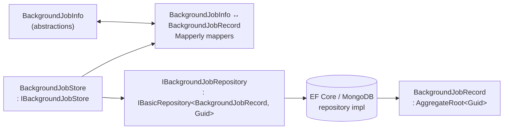

The domain layer of the Background Jobs module defines the persistent shape
of a queued job and the seam between ABP's
[`IBackgroundJobStore`](/background/jobs-abstractions) and the per-provider
repositories. It lives in two packages:

```text
modules/background-jobs/src/Volo.Abp.BackgroundJobs.Domain.Shared/
modules/background-jobs/src/Volo.Abp.BackgroundJobs.Domain/
```

`Domain.Shared` contains constants safe to reference from clients (length
limits). `Domain` contains the entity, the repository contract, the
`IBackgroundJobStore` implementation and the Mapperly mappers that bridge
the framework's `BackgroundJobInfo` and the persisted `BackgroundJobRecord`.

## Layer at a glance



## Volo.Abp.BackgroundJobs.Domain.Shared

### AbpBackgroundJobsDomainSharedModule

A marker module with no service registrations — it exists so other modules
can take a `[DependsOn]` on it and pull in the shared constants.

```csharp
// modules/background-jobs/src/Volo.Abp.BackgroundJobs.Domain.Shared/
// Volo/Abp/BackgroundJobs/AbpBackgroundJobsDomainSharedModule.cs
using Volo.Abp.Modularity;

namespace Volo.Abp.BackgroundJobs;

public class AbpBackgroundJobsDomainSharedModule : AbpModule
{

}
```

### BackgroundJobRecordConsts

Length limits used both by the EF Core column configuration and by anyone
serializing arguments before scheduling a job.

```csharp
// modules/background-jobs/src/Volo.Abp.BackgroundJobs.Domain.Shared/
// Volo/Abp/BackgroundJobs/BackgroundJobRecordConsts.cs
namespace Volo.Abp.BackgroundJobs;

public static class BackgroundJobRecordConsts
{
    /// <summary>Default value: 96</summary>
    public static int MaxApplicationNameLength { get; set; } = 96;

    /// <summary>Default value: 128</summary>
    public static int MaxJobNameLength { get; set; } = 128;

    /// <summary>Default value: 1024 * 1024</summary>
    public static int MaxJobArgsLength { get; set; } = 1024 * 1024;
}
```

The values are **`static` setters**, not `const`, so you can tweak them at
startup (for example, to fit a stricter column type) before the EF Core
model is built.

<Warning>
  Because these are mutable statics, change them from a single, well-known
  place — typically `PreConfigureServices` of your domain module — and
  never from a request handler.
</Warning>

## Volo.Abp.BackgroundJobs.Domain

### AbpBackgroundJobsDbProperties

Central place for the schema/table prefix and connection-string name. EF
Core and MongoDB both read from it so the table and collection always line
up across providers.

```csharp
// modules/background-jobs/src/Volo.Abp.BackgroundJobs.Domain/
// Volo/Abp/BackgroundJobs/AbpBackgroundJobsDbProperties.cs
using Volo.Abp.Data;

namespace Volo.Abp.BackgroundJobs;

public static class AbpBackgroundJobsDbProperties
{
    public static string DbTablePrefix { get; set; } = AbpCommonDbProperties.DbTablePrefix;

    public static string DbSchema { get; set; } = AbpCommonDbProperties.DbSchema;

    public const string ConnectionStringName = "AbpBackgroundJobs";
}
```

- `DbTablePrefix` defaults to `"Abp"`, producing the table name
  `AbpBackgroundJobs`.
- `ConnectionStringName` is the literal `"AbpBackgroundJobs"`. Register a
  matching `ConnectionStrings:AbpBackgroundJobs` to route only this
  `DbContext` to another database — see
  [Entity Framework Core integration](/data/entityframeworkcore).

### BackgroundJobRecord

`BackgroundJobRecord` is the aggregate root that mirrors the framework's
`BackgroundJobInfo`. Every property declared by the abstractions has a
corresponding column / BSON field here.

```csharp
// modules/background-jobs/src/Volo.Abp.BackgroundJobs.Domain/
// Volo/Abp/BackgroundJobs/BackgroundJobRecord.cs
using System;
using Volo.Abp.Auditing;
using Volo.Abp.Domain.Entities;

namespace Volo.Abp.BackgroundJobs;

public class BackgroundJobRecord : AggregateRoot<Guid>, IHasCreationTime
{
    /// <summary>Application name that scheduled this job.</summary>
    public virtual string ApplicationName { get; set; }

    /// <summary>
    /// Type of the job. It's AssemblyQualifiedName of job type.
    /// </summary>
    public virtual string JobName { get; set; }

    /// <summary>Job arguments as serialized string.</summary>
    public virtual string JobArgs { get; set; }

    /// <summary>
    /// Try count of this job. A job is re-tried if it fails.
    /// </summary>
    public virtual short TryCount { get; set; }

    /// <summary>Creation time of this job.</summary>
    public virtual DateTime CreationTime { get; set; }

    /// <summary>Next try time of this job.</summary>
    public virtual DateTime NextTryTime { get; set; }

    /// <summary>Last try time of this job.</summary>
    public virtual DateTime? LastTryTime { get; set; }

    /// <summary>
    /// This is true if this job is continuously failed and will not be
    /// executed again.
    /// </summary>
    public virtual bool IsAbandoned { get; set; }

    /// <summary>Priority of this job.</summary>
    public virtual BackgroundJobPriority Priority { get; set; }

    protected BackgroundJobRecord()
    {

    }

    public BackgroundJobRecord(Guid id)
        : base(id)
    {

    }
}
```

A few things worth noting:

- `AggregateRoot<Guid>` adds `ConcurrencyStamp` and `ExtraProperties` —
  both are explicitly **ignored by the mappers** (see below) because the
  framework's `BackgroundJobInfo` doesn't carry them.
- All properties are `virtual` so EF Core proxies and Mongo serialization
  both work without further attributes.
- `Priority` is the enum from the
  [abstractions](/background/jobs-abstractions); the EF Core configuration
  uses `BackgroundJobPriority.Normal` as the default value and as a
  sentinel — see the
  [EF Core / MongoDB page](/modules/background-jobs/efcore-mongodb).

### IBackgroundJobRepository

The repository surface is intentionally small: standard CRUD from
`IBasicRepository<,>` plus one specialized query for the worker to pick the
next batch of jobs.

```csharp
// modules/background-jobs/src/Volo.Abp.BackgroundJobs.Domain/
// Volo/Abp/BackgroundJobs/IBackgroundJobRepository.cs
using System;
using System.Collections.Generic;
using System.Threading;
using System.Threading.Tasks;
using JetBrains.Annotations;
using Volo.Abp.Domain.Repositories;

namespace Volo.Abp.BackgroundJobs;

public interface IBackgroundJobRepository : IBasicRepository<BackgroundJobRecord, Guid>
{
    Task<List<BackgroundJobRecord>> GetWaitingListAsync(
        [CanBeNull] string applicationName,
        int maxResultCount,
        CancellationToken cancellationToken = default);
}
```

`GetWaitingListAsync` is what the default `BackgroundJobWorker` calls on
every poll. Both provider implementations apply the same ordering:

1. Filter by `ApplicationName`.
2. Skip abandoned jobs and those whose `NextTryTime` is in the future.
3. Order by `Priority` descending, then `TryCount` ascending, then
   `NextTryTime` ascending.
4. Take `maxResultCount` jobs.

See the EF Core and MongoDB implementations on
[the next page](/modules/background-jobs/efcore-mongodb).

### BackgroundJobStore

`BackgroundJobStore` is the **`IBackgroundJobStore` implementation** that
ships with this module. It is registered as `ITransientDependency` and
exposed as `IBackgroundJobStore`, which causes ABP's DI to prefer it over
the default `InMemoryBackgroundJobStore` from
[`Volo.Abp.BackgroundJobs`](/background/jobs-abstractions) whenever the
domain package is referenced.

```csharp
// modules/background-jobs/src/Volo.Abp.BackgroundJobs.Domain/
// Volo/Abp/BackgroundJobs/BackgroundJobStore.cs
using System;
using System.Collections.Generic;
using System.Threading.Tasks;
using Volo.Abp.DependencyInjection;
using Volo.Abp.ObjectMapping;

namespace Volo.Abp.BackgroundJobs;

public class BackgroundJobStore : IBackgroundJobStore, ITransientDependency
{
    protected IBackgroundJobRepository BackgroundJobRepository { get; }

    protected IObjectMapper<AbpBackgroundJobsDomainModule> ObjectMapper { get; }

    public BackgroundJobStore(
        IBackgroundJobRepository backgroundJobRepository,
        IObjectMapper<AbpBackgroundJobsDomainModule> objectMapper)
    {
        ObjectMapper = objectMapper;
        BackgroundJobRepository = backgroundJobRepository;
    }

    public virtual async Task<BackgroundJobInfo> FindAsync(Guid jobId)
    {
        return ObjectMapper.Map<BackgroundJobRecord, BackgroundJobInfo>(
            await BackgroundJobRepository.FindAsync(jobId)
        );
    }

    public virtual async Task InsertAsync(BackgroundJobInfo jobInfo)
    {
        await BackgroundJobRepository.InsertAsync(
            ObjectMapper.Map<BackgroundJobInfo, BackgroundJobRecord>(jobInfo)
        );
    }

    public virtual async Task<List<BackgroundJobInfo>> GetWaitingJobsAsync(
        string applicationName,
        int maxResultCount)
    {
        return ObjectMapper.Map<List<BackgroundJobRecord>, List<BackgroundJobInfo>>(
            await BackgroundJobRepository.GetWaitingListAsync(applicationName, maxResultCount)
        );
    }

    public virtual async Task DeleteAsync(Guid jobId)
    {
        await BackgroundJobRepository.DeleteAsync(jobId);
    }

    public virtual async Task UpdateAsync(BackgroundJobInfo jobInfo)
    {
        var backgroundJobRecord = await BackgroundJobRepository.FindAsync(jobInfo.Id);
        if (backgroundJobRecord == null)
        {
            return;
        }

        ObjectMapper.Map(jobInfo, backgroundJobRecord);
        await BackgroundJobRepository.UpdateAsync(backgroundJobRecord);
    }
}
```

Operationally:

| `IBackgroundJobStore` method | What this implementation does |
| ---------------------------- | ----------------------------- |
| `FindAsync(jobId)` | Loads the record by id and maps to `BackgroundJobInfo`. |
| `InsertAsync(jobInfo)` | Maps to a new `BackgroundJobRecord` (constructed with `jobInfo.Id`) and inserts via the repository. |
| `GetWaitingJobsAsync(app, max)` | Delegates to `IBackgroundJobRepository.GetWaitingListAsync` and maps the batch. |
| `DeleteAsync(jobId)` | Repository delete — called after a job runs successfully. |
| `UpdateAsync(jobInfo)` | Loads the existing record, **maps onto it in place** (preserving `ConcurrencyStamp` / `ExtraProperties`), then updates. Silently no-ops if the row is gone. |

<Tip>
  The `Update` path uses load-then-map deliberately. ABP's optimistic
  concurrency relies on `ConcurrencyStamp`, which `BackgroundJobInfo`
  doesn't carry — keeping the stamp from the database row avoids spurious
  `AbpDbConcurrencyException`s when two workers race on the same job.
</Tip>

### Mapperly mappers

The mappers translate between `BackgroundJobInfo` (framework DTO) and
`BackgroundJobRecord` (persisted entity). They are generated by
[Mapperly](https://mapperly.riok.app) through ABP's `MapperBase<,>` /
`AddMapperlyObjectMapper<>` integration.

```csharp
// modules/background-jobs/src/Volo.Abp.BackgroundJobs.Domain/
// Volo/Abp/BackgroundJobs/BackgroundJobsDomainMapperlyMappers.cs
using Riok.Mapperly.Abstractions;
using Volo.Abp.Mapperly;

namespace  Volo.Abp.BackgroundJobs;

[Mapper(RequiredMappingStrategy = RequiredMappingStrategy.Target)]
public partial class BackgroundJobInfoToBackgroundJobRecordMapper
    : MapperBase<BackgroundJobInfo, BackgroundJobRecord>
{
    [MapperIgnoreTarget(nameof(BackgroundJobRecord.ConcurrencyStamp))]
    [MapperIgnoreTarget(nameof(BackgroundJobRecord.ExtraProperties))]
    public override partial BackgroundJobRecord Map(BackgroundJobInfo source);

    [MapperIgnoreTarget(nameof(BackgroundJobRecord.ConcurrencyStamp))]
    [MapperIgnoreTarget(nameof(BackgroundJobRecord.ExtraProperties))]
    public override partial void Map(BackgroundJobInfo source, BackgroundJobRecord destination);

    [ObjectFactory]
    protected BackgroundJobRecord CreateBackgroundJobRecord(BackgroundJobInfo source)
    {
        return new BackgroundJobRecord(source.Id);
    }
}

[Mapper(RequiredMappingStrategy = RequiredMappingStrategy.Target)]
public partial class BackgroundJobRecordToBackgroundJobInfoMapper
    : MapperBase<BackgroundJobRecord, BackgroundJobInfo>
{
    public override partial BackgroundJobInfo Map(BackgroundJobRecord source);

    public override partial void Map(BackgroundJobRecord source, BackgroundJobInfo destination);
}
```

Two things to call out:

- `RequiredMappingStrategy.Target` forces Mapperly to emit a compile error
  if a target property is left unmapped — a guard against accidentally
  losing fields when either type evolves.
- The `[ObjectFactory]` method ensures the entity is constructed via
  `new BackgroundJobRecord(source.Id)` rather than the parameterless
  constructor, so the `Id` is set as part of construction (and not via the
  setter that EF tracks).

### AbpBackgroundJobsDomainModule

The domain module wires Mapperly and declares its dependencies on the
abstractions module and on the shared module:

```csharp
// modules/background-jobs/src/Volo.Abp.BackgroundJobs.Domain/
// Volo/Abp/BackgroundJobs/AbpBackgroundJobsDomainModule.cs
using Volo.Abp.Mapperly;
using Volo.Abp.Modularity;

namespace Volo.Abp.BackgroundJobs;

[DependsOn(
    typeof(AbpBackgroundJobsDomainSharedModule),
    typeof(AbpBackgroundJobsModule),
    typeof(AbpMapperlyModule)
    )]
public class AbpBackgroundJobsDomainModule : AbpModule
{
    public override void ConfigureServices(ServiceConfigurationContext context)
    {
        context.Services.AddMapperlyObjectMapper<AbpBackgroundJobsDomainModule>();
    }
}
```

`AddMapperlyObjectMapper<AbpBackgroundJobsDomainModule>()` registers the
mappers above under the *context* type used by `BackgroundJobStore`:
`IObjectMapper<AbpBackgroundJobsDomainModule>`. This namespacing means the
module's mapping rules don't conflict with any other Mapperly mappers in
the host application.

<Info>
  There is **no `BackgroundJobCleanupService`** in this module: successful
  jobs are removed by `BackgroundJobStore.DeleteAsync` immediately after
  execution, and abandoned jobs are kept (with `IsAbandoned = true`) for
  inspection. If you want to purge abandoned rows on a schedule, add an
  `IPeriodicBackgroundJobWorker` of your own that calls
  `IBackgroundJobRepository.DeleteAsync` on a filtered query — the
  interfaces are public.
</Info>

## Extending the entity

Because `BackgroundJobRecord` is an `AggregateRoot<Guid>` with
`ExtraProperties`, you can attach extension properties through
[ABP's object-extension system](/data/entityframeworkcore) without forking
the module. The model-creating extension already calls
`b.ApplyObjectExtensionMappings()` and
`builder.TryConfigureObjectExtensions<BackgroundJobsDbContext>()` — see
[EF Core integration](/modules/background-jobs/efcore-mongodb).

## Where to next

<CardGroup cols={2}>
  <Card title="EF Core & MongoDB providers" icon="database" href="/modules/background-jobs/efcore-mongodb">
    Concrete `IBackgroundJobRepository` implementations, `DbContext`
    classes and model-creating extensions.
  </Card>
  <Card title="Module overview" icon="circle-info" href="/modules/background-jobs/overview">
    How the domain layer fits inside the persistent
    `IBackgroundJobStore` story.
  </Card>
  <Card title="Background Jobs (default manager)" icon="gears" href="/background/jobs-default">
    The worker that drives `BackgroundJobStore` — polling cadence, retry
    policy, abandon logic.
  </Card>
  <Card title="Background Jobs abstractions" icon="puzzle-piece" href="/background/jobs-abstractions">
    `IBackgroundJobStore`, `BackgroundJobInfo`, `BackgroundJobPriority` —
    the contract this module implements.
  </Card>
</CardGroup>
