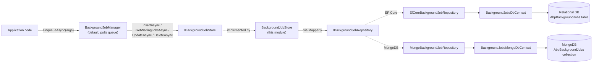
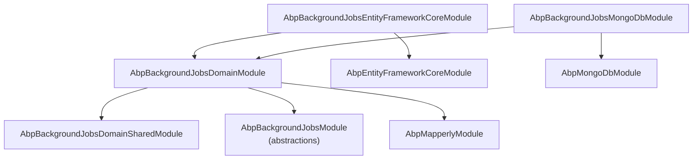

The **Volo.Abp.BackgroundJobs** module is the persistent counterpart to the
in-memory [default background job manager](/background/jobs-default). It plugs
into the same [`IBackgroundJobManager` / `IBackgroundJobStore`
abstractions](/background/jobs-abstractions) but, instead of keeping pending
jobs in a `ConcurrentQueue<T>` inside the worker process, it stores them as
rows (or documents) in your application database. This makes scheduled jobs
**survive process restarts**, allows multiple worker hosts to share the same
queue, and lets you inspect the queue with standard database tooling.

<Info>
  This page describes the **module** under
  `modules/background-jobs/src/`. The framework-level abstractions
  (`IBackgroundJobManager`, `IBackgroundJobStore`, `BackgroundJobInfo`,
  retry/priority enums) live in the
  [`Volo.Abp.BackgroundJobs.Abstractions`](/background/jobs-abstractions)
  package and are not redefined here.
</Info>

## What the module gives you

<CardGroup cols={2}>
  <Card title="Persistent IBackgroundJobStore" icon="database" href="/modules/background-jobs/domain">
    `BackgroundJobStore` replaces the default `InMemoryBackgroundJobStore`
    and persists every queued job through an `IBackgroundJobRepository`.
  </Card>
  <Card title="BackgroundJobRecord entity" icon="table" href="/modules/background-jobs/domain">
    An `AggregateRoot<Guid>` that mirrors `BackgroundJobInfo` and adds ABP
    auditing / concurrency / extra-properties columns.
  </Card>
  <Card title="EF Core repository" icon="layer-group" href="/modules/background-jobs/efcore-mongodb">
    `EfCoreBackgroundJobRepository` + `BackgroundJobsDbContext` — wired
    through `AddAbpDbContext` and `AddRepository`.
  </Card>
  <Card title="MongoDB repository" icon="leaf" href="/modules/background-jobs/efcore-mongodb">
    `MongoBackgroundJobRepository` + `BackgroundJobsMongoDbContext` —
    wired through `AddMongoDbContext` and `AddRepository`.
  </Card>
  <Card title="Shared constants" icon="ruler" href="/modules/background-jobs/domain">
    `BackgroundJobRecordConsts` exposes max-length values for
    `ApplicationName`, `JobName` and `JobArgs` so providers can configure
    column types consistently.
  </Card>
  <Card title="Mapperly object mapper" icon="arrows-left-right" href="/modules/background-jobs/domain">
    Mapperly-generated mappers convert between `BackgroundJobInfo` (used by
    the manager) and `BackgroundJobRecord` (persisted by the repository).
  </Card>
</CardGroup>

## Where it fits

The module is a thin **persistence adapter**. The default
`BackgroundJobManager` continues to enqueue, dequeue, retry and abandon jobs
exactly as described in
[Background Jobs (default manager)](/background/jobs-default); only the
storage seam — `IBackgroundJobStore` — is replaced.



Compared to the in-memory default, the moving parts you add are everything
below `IBackgroundJobStore` — the rest of the manager (worker, scheduler,
retry policy) is unchanged.

## Project layout

```text
modules/background-jobs/src/
├── Volo.Abp.BackgroundJobs.Domain.Shared/
│   └── Volo/Abp/BackgroundJobs/
│       ├── AbpBackgroundJobsDomainSharedModule.cs
│       └── BackgroundJobRecordConsts.cs
├── Volo.Abp.BackgroundJobs.Domain/
│   └── Volo/Abp/BackgroundJobs/
│       ├── AbpBackgroundJobsDbProperties.cs
│       ├── AbpBackgroundJobsDomainModule.cs
│       ├── BackgroundJobRecord.cs
│       ├── BackgroundJobStore.cs
│       ├── BackgroundJobsDomainMapperlyMappers.cs
│       └── IBackgroundJobRepository.cs
├── Volo.Abp.BackgroundJobs.EntityFrameworkCore/
│   └── Volo/Abp/BackgroundJobs/EntityFrameworkCore/
│       ├── AbpBackgroundJobsEntityFrameworkCoreModule.cs
│       ├── BackgroundJobsDbContext.cs
│       ├── BackgroundJobsDbContextModelCreatingExtensions.cs
│       ├── EfCoreBackgroundJobRepository.cs
│       └── IBackgroundJobsDbContext.cs
├── Volo.Abp.BackgroundJobs.MongoDB/
│   └── Volo/Abp/BackgroundJobs/MongoDB/
│       ├── AbpBackgroundJobsMongoDbModule.cs
│       ├── BackgroundJobsMongoDbContext.cs
│       ├── BackgroundJobsMongoDbContextExtensions.cs
│       ├── IBackgroundJobsMongoDbContext.cs
│       └── MongoBackgroundJobRepository.cs
└── Volo.Abp.BackgroundJobs.Installer/
    └── Volo/Abp/BackgroundJobs/AbpBackgroundJobsInstallerModule.cs
```

Each package has a single responsibility:

| Package | Role |
| ------- | ---- |
| `Volo.Abp.BackgroundJobs.Domain.Shared` | Constants shared with clients (length limits). |
| `Volo.Abp.BackgroundJobs.Domain` | `BackgroundJobRecord`, `IBackgroundJobRepository`, `BackgroundJobStore`, Mapperly mappers. |
| `Volo.Abp.BackgroundJobs.EntityFrameworkCore` | EF Core `DbContext` and repository implementation. |
| `Volo.Abp.BackgroundJobs.MongoDB` | MongoDB `DbContext` and repository implementation. |
| `Volo.Abp.BackgroundJobs.Installer` | NuGet/installer helper (not covered here). |

## Installation

You depend on the persistence package that matches your data layer; it
transitively brings in the Domain and Domain.Shared packages.

<Tabs>
  <Tab title="Entity Framework Core">
    ```csharp
    [DependsOn(
        typeof(AbpBackgroundJobsEntityFrameworkCoreModule)
    )]
    public class MyProjectEntityFrameworkCoreModule : AbpModule
    {
        public override void ConfigureServices(ServiceConfigurationContext context)
        {
            context.Services.AddAbpDbContext<MyProjectDbContext>(options =>
            {
                /* ... */
            });
        }
    }
    ```

    See [Entity Framework Core integration](/data/entityframeworkcore) for
    how to share a single physical database with the `BackgroundJobs`
    `DbContext`.
  </Tab>
  <Tab title="MongoDB">
    ```csharp
    [DependsOn(
        typeof(AbpBackgroundJobsMongoDbModule)
    )]
    public class MyProjectMongoDbModule : AbpModule
    {
        public override void ConfigureServices(ServiceConfigurationContext context)
        {
            context.Services.AddMongoDbContext<MyProjectMongoDbContext>(options =>
            {
                /* ... */
            });
        }
    }
    ```

    See [MongoDB integration](/data/mongodb) for how the `AbpMongoDbContext`
    base and `IMongoDbContextProvider<T>` work.
  </Tab>
</Tabs>

<Info>
  The connection-string name is
  `AbpBackgroundJobsDbProperties.ConnectionStringName` (the literal
  `"AbpBackgroundJobs"`). You can route this connection to a different
  database than your main one through the standard
  [`ConnectionStrings` configuration](/data/entityframeworkcore).
</Info>

## How it replaces the in-memory store

The default `IBackgroundJobStore` registered by
[`Volo.Abp.BackgroundJobs`](/background/jobs-abstractions) is
`InMemoryBackgroundJobStore`. When you reference this module, ABP's
dependency-injection conventions resolve `IBackgroundJobStore` to
`BackgroundJobStore` from `Volo.Abp.BackgroundJobs.Domain` (it is registered
as `ITransientDependency` and exposes `IBackgroundJobStore`). The default
manager keeps using the same interface, so:

- `BackgroundJobManager.EnqueueAsync(...)` → `IBackgroundJobStore.InsertAsync(...)` → `BackgroundJobStore.InsertAsync(...)` → `IBackgroundJobRepository.InsertAsync(...)`.
- Worker poll → `IBackgroundJobStore.GetWaitingJobsAsync(...)` → `IBackgroundJobRepository.GetWaitingListAsync(...)` (filtered by `ApplicationName`, `IsAbandoned`, `NextTryTime`).
- Successful execution → `IBackgroundJobStore.DeleteAsync(id)`.
- Failed execution → `IBackgroundJobStore.UpdateAsync(info)` (next retry / abandon).

The semantic contract of those methods (priority ordering, retry counter,
abandon flag) is defined by the
[abstractions](/background/jobs-abstractions); this module is responsible
only for honoring them against a persistent store.

## Module dependency graph



These dependencies are declared with `[DependsOn(...)]` on each module
class — see [`AbpBackgroundJobsDomainModule`](/modules/background-jobs/domain)
and the provider modules on
[the EF Core / MongoDB page](/modules/background-jobs/efcore-mongodb).

## Lifecycle of a persistent job

To make the moving parts concrete, here is what happens for a single
`await _jobManager.EnqueueAsync(args)` call when this module is wired up:

1. The default `BackgroundJobManager` (see
   [`/background/jobs-default`](/background/jobs-default)) creates a
   `BackgroundJobInfo` with a fresh `Guid` id, the AssemblyQualifiedName
   of the job, the serialized arguments and a `NextTryTime` derived from
   the delay.
2. The manager calls `IBackgroundJobStore.InsertAsync(info)`. ABP's DI
   resolves that to `BackgroundJobStore` from this module.
3. `BackgroundJobStore.InsertAsync` runs the
   `BackgroundJobInfo → BackgroundJobRecord` Mapperly mapper and calls
   `IBackgroundJobRepository.InsertAsync(record)`.
4. The repository's `EfCoreRepository` / `MongoDbRepository` base writes
   the row or document through the `BackgroundJobsDbContext` /
   `BackgroundJobsMongoDbContext`.
5. On the next worker poll, `IBackgroundJobStore.GetWaitingJobsAsync(app, n)`
   delegates to `IBackgroundJobRepository.GetWaitingListAsync`, which
   applies the priority/try-count/next-try-time ordering and the
   `IsAbandoned`/`NextTryTime` filters.
6. The worker executes each `BackgroundJobInfo`. On success, the manager
   calls `IBackgroundJobStore.DeleteAsync(id)` — `BackgroundJobStore`
   forwards that to the repository, deleting the row/document.
7. On failure, the manager increments `TryCount` and bumps
   `NextTryTime`, then calls `IBackgroundJobStore.UpdateAsync(info)`.
   `BackgroundJobStore.UpdateAsync` re-loads the existing record,
   maps onto it (preserving `ConcurrencyStamp` and `ExtraProperties`)
   and saves it back.
8. Once retries are exhausted, the manager flips `IsAbandoned` to `true`
   and updates again; the row stays in the database for inspection but
   no longer matches `GetWaitingListAsync`'s filter.

This loop is the same in-memory and persistent setups; only the storage
medium under `IBackgroundJobRepository` changes.

## Configuration knobs

The module deliberately exposes very few options — the manager itself
owns the polling cadence, retry policy and `ApplicationName` resolution
through `AbpBackgroundJobOptions` and `AbpBackgroundJobWorkerOptions`
(documented on the
[default manager page](/background/jobs-default)). The persistence layer
contributes:

| Setting | Where | Effect |
| ------- | ----- | ------ |
| `AbpBackgroundJobsDbProperties.DbTablePrefix` | static, set at startup | Prefix on the EF Core table and Mongo collection — defaults to `"Abp"`. |
| `AbpBackgroundJobsDbProperties.DbSchema` | static, set at startup | EF Core schema for the `AbpBackgroundJobs` table. |
| `AbpBackgroundJobsDbProperties.ConnectionStringName` | `const` | Always `"AbpBackgroundJobs"`. Define this connection string to route just this `DbContext` to a separate database. |
| `BackgroundJobRecordConsts.MaxApplicationNameLength` / `MaxJobNameLength` / `MaxJobArgsLength` | static, set at startup | Column lengths the EF Core configuration applies; tighten if you need stricter limits. |

The static defaults are deliberately mutable so you can override them in
`PreConfigureServices` of your own module — see
[the domain page](/modules/background-jobs/domain) for the exact
declarations.

## When to use this module

<CardGroup cols={2}>
  <Card title="Use it when" icon="check">
    - Jobs must survive process restarts.
    - Multiple application instances share one queue.
    - You want to audit / inspect queued jobs with SQL or Mongo tools.
    - You already use EF Core or MongoDB in the same solution.
  </Card>
  <Card title="Skip it when" icon="xmark">
    - You only need fire-and-forget work inside a single process and can
      tolerate losing pending jobs on shutdown — the
      [in-memory default](/background/jobs-default) is enough.
    - You use a different background-processing engine (Hangfire, Quartz,
      RabbitMQ) — those have their own stores and replace the manager,
      not just the store.
  </Card>
</CardGroup>

## Where to next

<CardGroup cols={2}>
  <Card title="Domain layer" icon="cube" href="/modules/background-jobs/domain">
    `BackgroundJobRecord`, `IBackgroundJobRepository`, the
    `BackgroundJobStore` implementation, Mapperly mappers and the domain
    module.
  </Card>
  <Card title="EF Core & MongoDB providers" icon="database" href="/modules/background-jobs/efcore-mongodb">
    Concrete repositories, `DbContext` types and the model-creating
    extensions for both providers.
  </Card>
  <Card title="Background Jobs (default manager)" icon="gears" href="/background/jobs-default">
    The in-process manager that drives this store: worker, retry policy,
    priority ordering, error handling.
  </Card>
  <Card title="Background Jobs abstractions" icon="puzzle-piece" href="/background/jobs-abstractions">
    The provider-agnostic contract — `IBackgroundJobManager`,
    `IBackgroundJobStore`, `BackgroundJobInfo`, `BackgroundJobPriority`.
  </Card>
</CardGroup>
