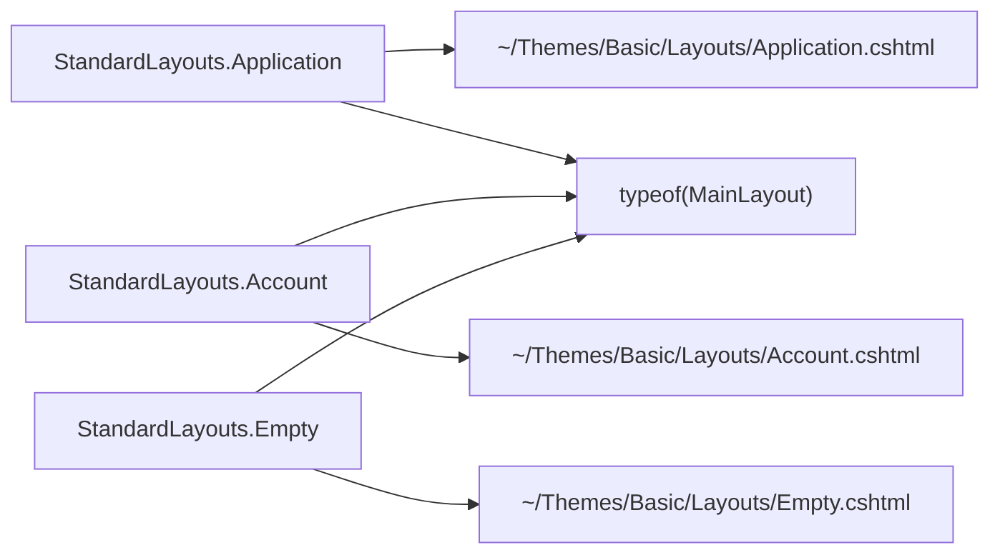

The **Basic Theme** module is ABP's deliberately neutral, unbranded reference theme. It ships an `ITheme` implementation, a small set of layouts, the global style/script bundles, and a top-toolbar contributor; nothing else. It is the theme starter solutions ship with by default, and it is the reference you fork when building your own theme on top of [`Volo.Abp.AspNetCore.Mvc.UI.Theme.Shared`](/aspnetcore/mvc-ui-bundling).

This page walks every project under `modules/basic-theme/src/` — the MVC theme, the three Blazor packages (Web, Server, WebAssembly), and the WebAssembly bundling helper. Source: [`modules/basic-theme/src`](https://github.com/abpframework/abp/tree/dev/modules/basic-theme/src).

<Info>
**MauiBlazor host:** there is **no** `Volo.Abp.AspNetCore.Components.MauiBlazor.BasicTheme` project in the repository. The same `BasicTheme` class from `Volo.Abp.AspNetCore.Components.Web.BasicTheme` is reused by MAUI Blazor hosts via the shared MAUI hosting module — there is no theme-specific MAUI assembly to import.
</Info>

## Project layout

```mermaid
flowchart TB
    subgraph MVC["Volo.Abp.AspNetCore.Mvc.UI.Theme.Basic"]
        MTheme["BasicTheme : ITheme<br/>(MVC, returns .cshtml paths)"]
        MBundles["BasicThemeBundles<br/>Bundling/BasicThemeGlobalStyleContributor<br/>Bundling/BasicThemeGlobalScriptContributor"]
        MToolbar["Toolbars/BasicThemeMainTopToolbarContributor"]
        MModule["AbpAspNetCoreMvcUiBasicThemeModule"]
        Layouts["Themes/Basic/Layouts/{Application,Account,Empty}.cshtml"]
        VCs["Themes/Basic/Components/<br/>MainNavbar, Brand, Menu, Toolbar, ..."]
    end

    subgraph BWeb["Volo.Abp.AspNetCore.Components.Web.BasicTheme"]
        BTheme["BasicTheme : ITheme<br/>(Blazor, returns Type)"]
        BLayouts["Themes/Basic/MainLayout.razor<br/>NavMenu / NavToolbar / Branding"]
        BModule["AbpAspNetCoreComponentsWebBasicThemeModule"]
    end

    subgraph BServer["Volo.Abp.AspNetCore.Components.Server.BasicTheme"]
        SBundles["BlazorBasicThemeBundles + style/script contributors"]
        STool["Server BasicThemeToolbarContributor"]
        SModule["AbpAspNetCoreComponentsServerBasicThemeModule"]
    end

    subgraph BWasm["Volo.Abp.AspNetCore.Components.WebAssembly.BasicTheme"]
        WTool["WebAssembly BasicThemeToolbarContributor"]
        WModule["AbpAspNetCoreComponentsWebAssemblyBasicThemeModule"]
        WBundles["BasicThemeBundleContributor<br/>(Obsolete)"]
    end

    subgraph WBundling["Volo.Abp.AspNetCore.Components.WebAssembly.BasicTheme.Bundling"]
        WMod["AbpAspNetCoreComponentsWebAssemblyBasicThemeBundlingModule"]
        WStyle["BasicThemeBundleStyleContributor"]
    end

    MModule -.depends on.-> SharedMvc["AbpAspNetCoreMvcUiThemeSharedModule"]
    BModule -.depends on.-> SharedBlazor["AbpAspNetCoreComponentsWebThemingModule"]
    SModule -.depends on.-> BModule
    WModule -.depends on.-> BModule
    WModule -.depends on.-> WMod
```



Each rectangle in the diagram maps 1-to-1 to a folder under `modules/basic-theme/src/`. The MVC and Blazor families share nothing at runtime — picking a Blazor host module pulls only the Blazor side; picking the MVC theme pulls only the MVC side.

## MVC theme — `Volo.Abp.AspNetCore.Mvc.UI.Theme.Basic`

Lives at `modules/basic-theme/src/Volo.Abp.AspNetCore.Mvc.UI.Theme.Basic/`. This is the project Razor Pages / MVC starter solutions pick up; the entry points are `BasicTheme.cs`, `BasicThemeBundles.cs`, and the module class.

### BasicTheme (ITheme, MVC)

`BasicTheme.cs` returns *string layout paths* (Razor Pages and MVC drive layouts by virtual path). The `[ThemeName("Basic")]` attribute registers the theme name that [`IThemeSelector`](/aspnetcore/mvc-module) matches at request time.

```csharp modules/basic-theme/src/Volo.Abp.AspNetCore.Mvc.UI.Theme.Basic/BasicTheme.cs
using Volo.Abp.AspNetCore.Mvc.UI.Theming;
using Volo.Abp.DependencyInjection;

namespace Volo.Abp.AspNetCore.Mvc.UI.Theme.Basic;

[ThemeName(Name)]
public class BasicTheme : ITheme, ITransientDependency
{
    public const string Name = "Basic";

    public virtual string GetLayout(string name, bool fallbackToDefault = true)
    {
        switch (name)
        {
            case StandardLayouts.Application:
                return "~/Themes/Basic/Layouts/Application.cshtml";
            case StandardLayouts.Account:
                return "~/Themes/Basic/Layouts/Account.cshtml";
            case StandardLayouts.Empty:
                return "~/Themes/Basic/Layouts/Empty.cshtml";
            default:
                return fallbackToDefault ? "~/Themes/Basic/Layouts/Application.cshtml" : null;
        }
    }
}
```

The three `StandardLayouts` constants (`Application`, `Account`, `Empty`) come from `Volo.Abp.AspNetCore.Mvc.UI.Theming`. The corresponding Razor files live in:

- `modules/basic-theme/src/Volo.Abp.AspNetCore.Mvc.UI.Theme.Basic/Themes/Basic/Layouts/Application.cshtml`
- `modules/basic-theme/src/Volo.Abp.AspNetCore.Mvc.UI.Theme.Basic/Themes/Basic/Layouts/Account.cshtml`
- `modules/basic-theme/src/Volo.Abp.AspNetCore.Mvc.UI.Theme.Basic/Themes/Basic/Layouts/Empty.cshtml`

These layouts are loaded out of the embedded virtual file set declared in the module (see below) — you can override them by dropping files with the *same* virtual path under your app's `Pages/Themes/Basic/Layouts/` folder.

### View components

The theme exposes a small fleet of view components under `modules/basic-theme/src/Volo.Abp.AspNetCore.Mvc.UI.Theme.Basic/Themes/Basic/Components/`:

| Folder | View component class |
| --- | --- |
| `Brand/` | `MainNavbarBrandViewComponent` |
| `ContentTitle/` | `ContentTitleViewComponent` |
| `MainNavbar/` | `MainNavbarViewComponent` |
| `Menu/` | `MainNavbarMenuViewComponent` |
| `PageAlerts/` | `PageAlertsViewComponent` |
| `Toolbar/` | `MainNavbarToolbarViewComponent` |
| `Toolbar/LanguageSwitch/` | `LanguageSwitchViewComponent` (+ `LanguageSwitchViewComponentModel`) |
| `Toolbar/UserMenu/` | `UserMenuViewComponent` |

The `MainNavbarToolbar` view component renders whatever the toolbar contributors registered into `AbpToolbarOptions` (see below). The `LanguageSwitch` and `UserMenu` items only appear when there is more than one configured language or the user is authenticated, respectively.

### BasicThemeBundles

`BasicThemeBundles.cs` defines the two well-known bundle names the layouts pull in.

```csharp modules/basic-theme/src/Volo.Abp.AspNetCore.Mvc.UI.Theme.Basic/Bundling/BasicThemeBundles.cs
namespace Volo.Abp.AspNetCore.Mvc.UI.Theme.Basic.Bundling;

public static class BasicThemeBundles
{
    public static class Styles
    {
        public const string Global = "Basic.Global";
    }

    public static class Scripts
    {
        public const string Global = "Basic.Global";
    }
}
```

These two names (`"Basic.Global"`) are what the Razor layouts reference via [`<abp-style-bundle>` and `<abp-script-bundle>` tag helpers](/aspnetcore/mvc-ui-bundling), so the bundle registry resolves them at runtime.

### Style and script contributors

The two bundle contributors append theme-specific assets onto the shared `StandardBundles` chain. They live alongside `BasicThemeBundles` in `modules/basic-theme/src/Volo.Abp.AspNetCore.Mvc.UI.Theme.Basic/Bundling/`.

```csharp modules/basic-theme/src/Volo.Abp.AspNetCore.Mvc.UI.Theme.Basic/Bundling/BasicThemeGlobalStyleContributor.cs
using Volo.Abp.AspNetCore.Mvc.UI.Bundling;

namespace Volo.Abp.AspNetCore.Mvc.UI.Theme.Basic.Bundling;

public class BasicThemeGlobalStyleContributor : BundleContributor
{
    public override void ConfigureBundle(BundleConfigurationContext context)
    {
        context.Files.Add(new BundleFile("/themes/basic/googlefonts.css", true));
        context.Files.Add("/themes/basic/layout.css");
    }
}
```

```csharp modules/basic-theme/src/Volo.Abp.AspNetCore.Mvc.UI.Theme.Basic/Bundling/BasicThemeGlobalScriptContributor.cs
using Volo.Abp.AspNetCore.Mvc.UI.Bundling;

namespace Volo.Abp.AspNetCore.Mvc.UI.Theme.Basic.Bundling;

public class BasicThemeGlobalScriptContributor : BundleContributor
{
    public override void ConfigureBundle(BundleConfigurationContext context)
    {
        context.Files.Add("/themes/basic/layout.js");
    }
}
```

The `googlefonts.css` `BundleFile(..., true)` second argument flips the "external" flag — the file is referenced by URL rather than concatenated into the bundle output. The other two paths (`/themes/basic/layout.css`, `/themes/basic/layout.js`) come from the embedded virtual file set declared by the module class.

### BasicThemeMainTopToolbarContributor

`BasicThemeMainTopToolbarContributor.cs` populates the top toolbar with the language switch (when there are 2+ languages) and the user menu (when the request is authenticated).

```csharp modules/basic-theme/src/Volo.Abp.AspNetCore.Mvc.UI.Theme.Basic/Toolbars/BasicThemeMainTopToolbarContributor.cs
public class BasicThemeMainTopToolbarContributor : IToolbarContributor
{
    public async Task ConfigureToolbarAsync(IToolbarConfigurationContext context)
    {
        if (context.Toolbar.Name != StandardToolbars.Main)
        {
            return;
        }

        if (!(context.Theme is BasicTheme))
        {
            return;
        }

        var languageProvider = context.ServiceProvider.GetService<ILanguageProvider>();

        //TODO: This duplicates GetLanguages() usage. Can we eleminate this?
        var languages = await languageProvider.GetLanguagesAsync();
        if (languages.Count > 1)
        {
            context.Toolbar.Items.Add(new ToolbarItem(typeof(LanguageSwitchViewComponent)));
        }

        if (context.ServiceProvider.GetRequiredService<ICurrentUser>().IsAuthenticated)
        {
            context.Toolbar.Items.Add(new ToolbarItem(typeof(UserMenuViewComponent)));
        }
    }
}
```

The `if (!(context.Theme is BasicTheme)) return;` guard is important — every toolbar contributor is invoked for every theme, so each contributor must filter to the theme it cares about.

### AbpAspNetCoreMvcUiBasicThemeModule

```csharp modules/basic-theme/src/Volo.Abp.AspNetCore.Mvc.UI.Theme.Basic/AbpAspNetCoreMvcUIBasicThemeModule.cs
[DependsOn(
    typeof(AbpAspNetCoreMvcUiThemeSharedModule),
    typeof(AbpAspNetCoreMvcUiMultiTenancyModule)
    )]
public class AbpAspNetCoreMvcUiBasicThemeModule : AbpModule
{
    public override void PreConfigureServices(ServiceConfigurationContext context)
    {
        PreConfigure<IMvcBuilder>(mvcBuilder =>
        {
            mvcBuilder.AddApplicationPartIfNotExists(typeof(AbpAspNetCoreMvcUiBasicThemeModule).Assembly);
        });
    }

    public override void ConfigureServices(ServiceConfigurationContext context)
    {
        Configure<AbpThemingOptions>(options =>
        {
            options.Themes.Add<BasicTheme>();

            if (options.DefaultThemeName == null)
            {
                options.DefaultThemeName = BasicTheme.Name;
            }
        });

        Configure<AbpVirtualFileSystemOptions>(options =>
        {
            options.FileSets.AddEmbedded<AbpAspNetCoreMvcUiBasicThemeModule>("Volo.Abp.AspNetCore.Mvc.UI.Theme.Basic");
        });

        Configure<AbpToolbarOptions>(options =>
        {
            options.Contributors.Add(new BasicThemeMainTopToolbarContributor());
        });

        Configure<AbpBundlingOptions>(options =>
        {
            options
                .StyleBundles
                .Add(BasicThemeBundles.Styles.Global, bundle =>
                {
                    bundle
                        .AddBaseBundles(StandardBundles.Styles.Global)
                        .AddContributors(typeof(BasicThemeGlobalStyleContributor));
                });

            options
                .ScriptBundles
                .Add(BasicThemeBundles.Scripts.Global, bundle =>
                {
                    bundle
                        .AddBaseBundles(StandardBundles.Scripts.Global)
                        .AddContributors(typeof(BasicThemeGlobalScriptContributor));
                });
        });
    }
}
```

Four `Configure<...>` calls — themes, virtual files (embedded `.cshtml`/`.css`/`.js`), toolbar contributor, and bundle definitions — define the entire surface the MVC theme exposes. `options.DefaultThemeName = BasicTheme.Name` only fires if no other theme has claimed the default, which is what makes Basic Theme a fall-through default rather than an override.

## Blazor Web base — `Volo.Abp.AspNetCore.Components.Web.BasicTheme`

`modules/basic-theme/src/Volo.Abp.AspNetCore.Components.Web.BasicTheme/` is the Blazor equivalent of the MVC theme: it provides the `ITheme` implementation, the Blazor layouts as `.razor` components, and the shared theming module dependency. Both the Blazor Server and Blazor WebAssembly host modules depend on this package.

### BasicTheme (ITheme, Blazor)

The Blazor variant returns **`Type` references** (Blazor uses component types as layouts, not string paths).

```csharp modules/basic-theme/src/Volo.Abp.AspNetCore.Components.Web.BasicTheme/BasicTheme.cs
[ThemeName(Name)]
public class BasicTheme : ITheme, ITransientDependency
{
    public const string Name = "Basic";

    public virtual Type GetLayout(string name, bool fallbackToDefault = true)
    {
        switch (name)
        {
            case StandardLayouts.Application:
            case StandardLayouts.Account:
            case StandardLayouts.Empty:
                return typeof(MainLayout);
            default:
                return fallbackToDefault ? typeof(MainLayout) : typeof(NullLayout);
        }
    }
}
```

All three standard layouts map to the same `MainLayout.razor`. The Blazor side does not split per standard layout the way MVC does — instead it relies on `MainLayout.razor` adapting its rendering based on `RenderFragment` slots.

### Razor components

The folder `modules/basic-theme/src/Volo.Abp.AspNetCore.Components.Web.BasicTheme/Themes/Basic/` ships the following components:

- `App.razor`, `AppWithoutAuth.razor` — root components used by hosts (the second is the "no AuthorizeView" variant).
- `MainLayout.razor` (+ `.razor.cs`) — the main layout returned by `BasicTheme.GetLayout`.
- `NullLayout.razor` — empty fall-through layout.
- `Branding.razor` — the navbar brand block.
- `NavMenu.razor` (+ `.razor.cs`) — main left/top navigation pulling [`ApplicationMenu`](/aspnetcore/mvc-module) entries from `IMenuManager`.
- `NavToolbar.razor` (+ `.razor.cs`) — host for toolbar items registered via `AbpToolbarOptions`.
- `FirstLevelNavMenuItem.razor` / `SecondLevelNavMenuItem.razor` — the recursive menu item components.
- `RedirectToLogin.razor` — used by the `[Authorize]` pipeline to bounce unauthenticated users.

These types live under the namespace `Volo.Abp.AspNetCore.Components.Web.BasicTheme.Themes.Basic` (imported via `_Imports.razor`).

### AbpAspNetCoreComponentsWebBasicThemeModule

```csharp modules/basic-theme/src/Volo.Abp.AspNetCore.Components.Web.BasicTheme/AbpAspNetCoreComponentsWebBasicThemeModule.cs
[DependsOn(
    typeof(AbpAspNetCoreComponentsWebThemingModule)
)]
public class AbpAspNetCoreComponentsWebBasicThemeModule : AbpModule
{
    public override void ConfigureServices(ServiceConfigurationContext context)
    {
        Configure<AbpThemingOptions>(options =>
        {
            options.Themes.Add<BasicTheme>();

            if (options.DefaultThemeName == null)
            {
                options.DefaultThemeName = BasicTheme.Name;
            }
        });
    }
}
```

Compared with the MVC module, this one is much smaller — it only registers the theme. Bundle configuration is delegated to the Server and WebAssembly host modules below because they target different bundle pipelines.

## Blazor Server host — `Volo.Abp.AspNetCore.Components.Server.BasicTheme`

`modules/basic-theme/src/Volo.Abp.AspNetCore.Components.Server.BasicTheme/AbpAspNetCoreComponentsServerBasicThemeModule.cs` is the Blazor Server-side wiring: it pulls the Web Basic theme, the Server theming module, and adds a server-only toolbar contributor and the `BlazorBasicThemeBundles` style/script bundles.

```csharp modules/basic-theme/src/Volo.Abp.AspNetCore.Components.Server.BasicTheme/AbpAspNetCoreComponentsServerBasicThemeModule.cs
[DependsOn(
    typeof(AbpAspNetCoreComponentsWebBasicThemeModule),
    typeof(AbpAspNetCoreComponentsServerThemingModule)
    )]
public class AbpAspNetCoreComponentsServerBasicThemeModule : AbpModule
{
    public override void ConfigureServices(ServiceConfigurationContext context)
    {
        Configure<AbpToolbarOptions>(options =>
        {
            options.Contributors.Add(new BasicThemeToolbarContributor());
        });

        Configure<AbpBundlingOptions>(options =>
        {
            options
                .StyleBundles
                .Add(BlazorBasicThemeBundles.Styles.Global, bundle =>
                {
                    bundle
                        .AddBaseBundles(BlazorStandardBundles.Styles.Global)
                        .AddContributors(typeof(BlazorBasicThemeStyleContributor));
                });

            options
                .ScriptBundles
                .Add(BlazorBasicThemeBundles.Scripts.Global, bundle =>
                {
                    bundle
                        .AddBaseBundles(BlazorStandardBundles.Scripts.Global)
                        .AddContributors(typeof(BlazorBasicThemeScriptContributor));
                });
        });
    }
}
```

Note the **separate** `BlazorBasicThemeBundles` symbol — the Blazor Server bundle pipeline uses its own bundle names (registered via `Blazor.Bundling`), distinct from the MVC `BasicThemeBundles`. The two pipelines don't share bundle definitions because Blazor Server's layouts emit `<link>`/`<script>` differently from `_Layout.cshtml`.

## Blazor WebAssembly host — `Volo.Abp.AspNetCore.Components.WebAssembly.BasicTheme`

`modules/basic-theme/src/Volo.Abp.AspNetCore.Components.WebAssembly.BasicTheme/AbpAspNetCoreComponentsWebAssemblyBasicThemeModule.cs` is the WASM variant. It chains the standalone bundling module, the Web Basic module, the WebAssembly theming module, and `AbpHttpClientIdentityModelWebAssemblyModule`.

```csharp modules/basic-theme/src/Volo.Abp.AspNetCore.Components.WebAssembly.BasicTheme/AbpAspNetCoreComponentsWebAssemblyBasicThemeModule.cs
[DependsOn(
    typeof(AbpAspNetCoreComponentsWebAssemblyBasicThemeBundlingModule),
    typeof(AbpAspNetCoreComponentsWebBasicThemeModule),
    typeof(AbpAspNetCoreComponentsWebAssemblyThemingModule),
    typeof(AbpHttpClientIdentityModelWebAssemblyModule)
    )]
public class AbpAspNetCoreComponentsWebAssemblyBasicThemeModule : AbpModule
{
    public override void ConfigureServices(ServiceConfigurationContext context)
    {
        Configure<AbpRouterOptions>(options =>
        {
            options.AdditionalAssemblies.Add(typeof(AbpAspNetCoreComponentsWebAssemblyBasicThemeModule).Assembly);
        });

        Configure<AbpToolbarOptions>(options =>
        {
            options.Contributors.Add(new BasicThemeToolbarContributor());
        });

        if (context.Services.ExecutePreConfiguredActions<AbpAspNetCoreComponentsWebOptions>().IsBlazorWebApp)
        {
            Configure<AuthenticationOptions>(options =>
            {
                options.LoginUrl = "Account/Login";
                options.LogoutUrl = "Account/Logout";
            });
        }
    }
}
```

Three things to note:

- The WASM module adds itself to `AbpRouterOptions.AdditionalAssemblies` so the WASM router scans this assembly for `[Route(...)]` components.
- The toolbar contributor is a *separate* `BasicThemeToolbarContributor` class living in the WebAssembly assembly — the Server and WASM hosts each have their own implementation so they can DI-inject from the correct service scope.
- The `IsBlazorWebApp` guard sets login/logout URLs only when the WASM module is hosted inside a Blazor Web App (the unified host introduced with .NET 8). Pure WASM standalone apps don't get this override.

### BasicThemeBundleContributor (obsolete)

The WASM project still exposes a legacy bundle hook for backwards compatibility:

```csharp modules/basic-theme/src/Volo.Abp.AspNetCore.Components.WebAssembly.BasicTheme/BasicThemeBundleContributor.cs
[Obsolete("This class is obsolete and will be removed in the future versions. Use GlobalAssets instead.")]
public class BasicThemeBundleContributor : IBundleContributor
{
    public void AddScripts(BundleContext context)
    {

    }

    public void AddStyles(BundleContext context)
    {
        context.Add("_content/Volo.Abp.AspNetCore.Components.Web.BasicTheme/libs/abp/css/theme.css");
    }
}
```

New code should use `GlobalAssets` (see [`AbpAspNetCoreComponentsWebAssemblyBasicThemeBundlingModule`](#abpaspnetcorecomponentswebassemblybasicthemebundlingmodule) below) instead of `IBundleContributor`.

## WebAssembly bundling — `Volo.Abp.AspNetCore.Components.WebAssembly.BasicTheme.Bundling`

`modules/basic-theme/src/Volo.Abp.AspNetCore.Components.WebAssembly.BasicTheme.Bundling/` is split out so consumers that only want the WASM bundling pipeline (without the theme runtime types) can reference a smaller assembly.

```csharp modules/basic-theme/src/Volo.Abp.AspNetCore.Components.WebAssembly.BasicTheme.Bundling/AbpAspNetCoreComponentsWebAssemblyBasicThemeBundlingModule.cs
[DependsOn(
    typeof(AbpAspNetCoreComponentsWebAssemblyThemingBundlingModule)
)]
public class AbpAspNetCoreComponentsWebAssemblyBasicThemeBundlingModule : AbpModule
{
    public override void ConfigureServices(ServiceConfigurationContext context)
    {
        Configure<AbpBundlingOptions>(options =>
        {
            var globalStyles = options.StyleBundles.Get(BlazorWebAssemblyStandardBundles.Styles.Global);
            globalStyles.AddContributors(typeof(BasicThemeBundleStyleContributor));
        });
    }
}
```

It hooks the `BasicThemeBundleStyleContributor` onto the standard WASM global style bundle — that's how the theme's CSS ends up in the static `index.html` of a published WASM build without any runtime middleware involved.

## Standard layouts mapping



The MVC theme keeps three distinct layout files because Razor Pages are accustomed to swapping `_Layout`. The Blazor theme funnels everything into `MainLayout.razor`, which itself decides whether to render `Branding`/`NavMenu` based on cascaded parameters from the host.

## Authoring your own theme

The Basic Theme is the smallest possible reference theme. To build a custom theme:

1. Copy `BasicTheme.cs` (MVC and/or Blazor variants) and rename the class plus the `[ThemeName("...")]` value.
2. Copy the `Themes/Basic/Layouts/*.cshtml` (MVC) or `Themes/Basic/MainLayout.razor` (Blazor) files into a new theme folder under `Themes/<YourName>/`.
3. Mirror `BasicThemeBundles`, the global bundle contributors, and the toolbar contributor.
4. Register your theme via `options.Themes.Add<YourTheme>()` in your own module, and optionally `options.DefaultThemeName = YourTheme.Name;` to take over the default.

The [LeptonX](https://abp.io/themes) and [Lepton](https://abp.io/themes) commercial themes follow this exact playbook; their entry classes are essentially the same shape as the ones documented here.

## Related pages

<CardGroup cols={2}>
  <Card title="ABP UI Bundling" icon="layer-group" href="/aspnetcore/mvc-ui-bundling">
    `AbpBundlingOptions`, `BundleContributor`, and the `<abp-style-bundle>`/`<abp-script-bundle>` tag helpers.
  </Card>
  <Card title="MVC module" icon="window-maximize" href="/aspnetcore/mvc-module">
    `IThemeSelector`, `AbpThemingOptions`, and the MVC pipeline that picks the theme per request.
  </Card>
  <Card title="Virtual File System" icon="folder-open" href="/core/volo-abp-core">
    How `options.FileSets.AddEmbedded<...>("Volo.Abp.AspNetCore.Mvc.UI.Theme.Basic")` exposes embedded `.cshtml` to the Razor view engine.
  </Card>
  <Card title="ABP packages — UI / Basic" icon="box" href="/ui/basic-theme">
    The published package page for the Basic Theme NuGet bundle (consumer perspective).
  </Card>
</CardGroup>
