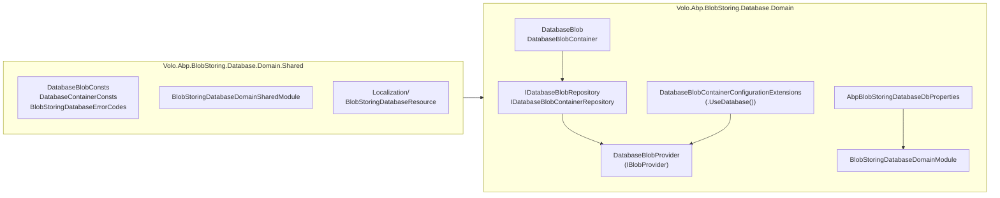
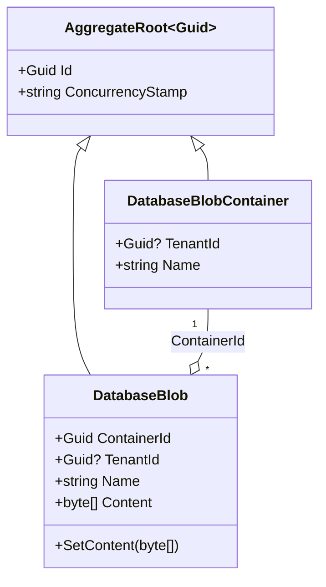
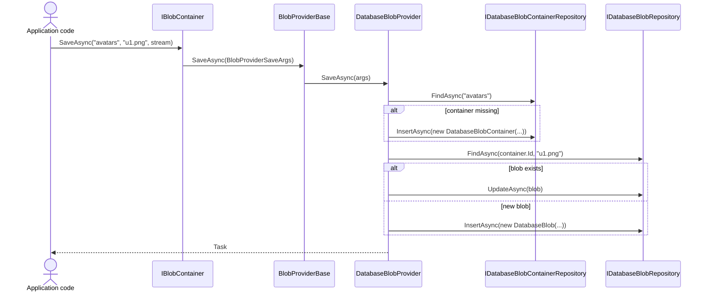

The **domain layer** of ABP's Blob Storing Database module is where the rows-as-BLOBs strategy is actually defined. It ships two aggregate roots — `DatabaseBlobContainer` and `DatabaseBlob` — their repository contracts (`IDatabaseBlobContainerRepository`, `IDatabaseBlobRepository`), and the `DatabaseBlobProvider` that implements [`IBlobProvider`](/blob/abstractions) on top of them. This page walks every type in [`modules/blob-storing-database/src/Volo.Abp.BlobStoring.Database.Domain/`](https://github.com/abpframework/abp/tree/dev/modules/blob-storing-database/src/Volo.Abp.BlobStoring.Database.Domain) and its `Domain.Shared` companion.

The persistence flavours (EF Core, MongoDB) are covered in the sibling [EF Core & MongoDB providers](/modules/blob-storing-database/efcore-mongodb) page; the module's place inside the wider BLOB Storing system is described in [BLOB Storing system overview](/blob/overview) and the [Blob Storing Database provider howto](/blob/blob-storing-database-module).

<Info>
**Source roots.**
- `modules/blob-storing-database/src/Volo.Abp.BlobStoring.Database.Domain/Volo/Abp/BlobStoring/Database/`
- `modules/blob-storing-database/src/Volo.Abp.BlobStoring.Database.Domain.Shared/Volo/Abp/BlobStoring/Database/`

Every type referenced below maps directly to one file under those two folders.
</Info>

## Package layout



The diagram mirrors the on-disk layout under `modules/blob-storing-database/src/`. The `Domain.Shared` project is the contract-only assembly that consumers (HTTP clients, microservices, even Blazor WASM) can reference without dragging EF Core or MongoDB in; the `Domain` project depends on it via `BlobStoringDatabaseDomainSharedModule` declared in [`Volo/Abp/BlobStoring/Database/BlobStoringDatabaseDomainSharedModule.cs`](https://github.com/abpframework/abp/blob/dev/modules/blob-storing-database/src/Volo.Abp.BlobStoring.Database.Domain.Shared/Volo/Abp/BlobStoring/Database/BlobStoringDatabaseDomainSharedModule.cs).

## Domain.Shared: constants & DB properties

The Domain.Shared assembly carries only static values that both the domain and the persistence projects must agree on. They live in `modules/blob-storing-database/src/Volo.Abp.BlobStoring.Database.Domain.Shared/Volo/Abp/BlobStoring/Database/`.

### DatabaseBlobConsts

`DatabaseBlobConsts.cs` controls the per-blob row limits — `MaxNameLength` is also used by EF Core column mapping (see [EF Core & MongoDB](/modules/blob-storing-database/efcore-mongodb)).

```csharp modules/blob-storing-database/src/Volo.Abp.BlobStoring.Database.Domain.Shared/Volo/Abp/BlobStoring/Database/DatabaseBlobConsts.cs
namespace Volo.Abp.BlobStoring.Database;

public static class DatabaseBlobConsts
{
    /// <summary>
    /// Default value: 256.
    /// </summary>
    public static int MaxNameLength { get; set; } = 256;

    /// <summary>
    /// Default value: <see cref="int.MaxValue"/> (2GB).
    /// </summary>
    public static int MaxContentLength { get; set; } = int.MaxValue;
}
```

Both members are mutable `static` properties on purpose: applications can override them once at startup (e.g. in `PreConfigureServices`) before EF Core builds its model, so the underlying `nvarchar(256)` / `varbinary(MAX)` columns can be widened or narrowed without touching the module.

### DatabaseContainerConsts

`DatabaseContainerConsts.cs` does the same for container names; the default is much smaller because container names are short, slug-like identifiers.

```csharp modules/blob-storing-database/src/Volo.Abp.BlobStoring.Database.Domain.Shared/Volo/Abp/BlobStoring/Database/DatabaseContainerConsts.cs
namespace Volo.Abp.BlobStoring.Database;

public static class DatabaseContainerConsts
{
    /// <summary>
    /// Default value: 128.
    /// </summary>
    public static int MaxNameLength { get; set; } = 128;
}
```

### AbpBlobStoringDatabaseDbProperties

`AbpBlobStoringDatabaseDbProperties.cs` actually lives in the **Domain** project (not Domain.Shared) at `modules/blob-storing-database/src/Volo.Abp.BlobStoring.Database.Domain/Volo/Abp/BlobStoring/Database/AbpBlobStoringDatabaseDbProperties.cs`, because the connection-string constant and table prefix are shared by both EF Core and MongoDB persistence projects.

```csharp modules/blob-storing-database/src/Volo.Abp.BlobStoring.Database.Domain/Volo/Abp/BlobStoring/Database/AbpBlobStoringDatabaseDbProperties.cs
using Volo.Abp.Data;

namespace Volo.Abp.BlobStoring.Database;

public static class AbpBlobStoringDatabaseDbProperties
{
    public static string DbTablePrefix { get; set; } = AbpCommonDbProperties.DbTablePrefix;

    public static string DbSchema { get; set; } = AbpCommonDbProperties.DbSchema;

    public const string ConnectionStringName = "AbpBlobStoring";
}
```

The `ConnectionStringName = "AbpBlobStoring"` value is what [`[ConnectionStringName(...)]`](/data/connection-strings) reads on `BlobStoringDbContext` and `BlobStoringMongoDbContext`, so you can isolate blob storage onto a separate physical database without touching code.

## Aggregates

The two aggregates live side-by-side in `modules/blob-storing-database/src/Volo.Abp.BlobStoring.Database.Domain/Volo/Abp/BlobStoring/Database/`. They are deliberately tiny — the module's job is plumbing, not domain modelling.

### DatabaseBlobContainer

`DatabaseBlobContainer.cs` is the aggregate root for a "container" (the logical bucket a [`BlobContainer<T>`](/blob/abstractions#blobcontainer) maps to). The same `Name` may exist once per tenant; tenant isolation is enforced by `IMultiTenant`.

```csharp modules/blob-storing-database/src/Volo.Abp.BlobStoring.Database.Domain/Volo/Abp/BlobStoring/Database/DatabaseBlobContainer.cs
using System;
using JetBrains.Annotations;
using Volo.Abp.Domain.Entities;
using Volo.Abp.MultiTenancy;

namespace Volo.Abp.BlobStoring.Database;

public class DatabaseBlobContainer : AggregateRoot<Guid>, IMultiTenant
{
    public virtual Guid? TenantId { get; protected set; }

    public virtual string Name { get; protected set; }

    protected DatabaseBlobContainer()
    {
    }

    public DatabaseBlobContainer(Guid id, [NotNull] string name, Guid? tenantId = null)
        : base(id)
    {
        Name = Check.NotNullOrWhiteSpace(name, nameof(name), DatabaseContainerConsts.MaxNameLength);
        TenantId = tenantId;
    }
}
```

Key design notes from `DatabaseBlobContainer.cs`:

- Inherits from [`AggregateRoot<Guid>`](/ddd/entities-and-aggregates#aggregate-roots), so it gets `ConcurrencyStamp` and the standard ABP domain-event plumbing for free.
- `Name` length is enforced through `Check.NotNullOrWhiteSpace(..., DatabaseContainerConsts.MaxNameLength)` so the same limit is honoured at construction time and at the EF Core column level (see [`BlobStoringDbContextModelCreatingExtensions.ConfigureBlobStoring()`](/modules/blob-storing-database/efcore-mongodb#blobstoringdbcontextmodelcreatingextensions)).
- The protected parameterless constructor exists for EF Core / MongoDB materialization — both providers in `modules/blob-storing-database/src/Volo.Abp.BlobStoring.Database.EntityFrameworkCore/` and `.MongoDB/` rely on it.

### DatabaseBlob

`DatabaseBlob.cs` is the aggregate root for a single BLOB. It carries the raw byte payload (`Content`) and a foreign key to its container.

```csharp modules/blob-storing-database/src/Volo.Abp.BlobStoring.Database.Domain/Volo/Abp/BlobStoring/Database/DatabaseBlob.cs
using JetBrains.Annotations;
using System;
using Volo.Abp.Auditing;
using Volo.Abp.Domain.Entities;
using Volo.Abp.MultiTenancy;

namespace Volo.Abp.BlobStoring.Database;

public class DatabaseBlob : AggregateRoot<Guid>, IMultiTenant
{
    public virtual Guid ContainerId { get; protected set; }

    public virtual Guid? TenantId { get; protected set; }

    public virtual string Name { get; protected set; }

    [DisableAuditing]
    public virtual byte[] Content { get; protected set; }

    protected DatabaseBlob()
    {
    }

    public DatabaseBlob(Guid id, Guid containerId, [NotNull] string name, [NotNull] byte[] content, Guid? tenantId = null)
        : base(id)
    {
        Name = Check.NotNullOrWhiteSpace(name, nameof(name), DatabaseBlobConsts.MaxNameLength);
        ContainerId = containerId;
        Content = CheckContentLength(content);
        TenantId = tenantId;
    }

    public virtual void SetContent(byte[] content)
    {
        Content = CheckContentLength(content);
    }

    protected virtual byte[] CheckContentLength(byte[] content)
    {
        Check.NotNull(content, nameof(content));

        if (content.Length >= DatabaseBlobConsts.MaxContentLength)
        {
            throw new AbpException($"Blob content size cannot be more than {DatabaseBlobConsts.MaxContentLength} Bytes.");
        }

        return content;
    }
}
```

Things worth calling out from `DatabaseBlob.cs`:

- **`[DisableAuditing]` on `Content`** — the auditing module ([Auditing](/auditing/overview)) won't snapshot the byte payload when an audit log entry is created. Without this attribute, every save would clone the entire BLOB into the audit table.
- **`CheckContentLength` raises `AbpException`**, not a domain validation exception, because exceeding `DatabaseBlobConsts.MaxContentLength` is a misconfiguration, not user input.
- **`ContainerId`** is a plain FK (no navigation property). The relationship is configured in `ConfigureBlobStoring()` with `b.HasOne<DatabaseBlobContainer>().WithMany().HasForeignKey(p => p.ContainerId)` — see [EF Core & MongoDB providers](/modules/blob-storing-database/efcore-mongodb#blobstoringdbcontextmodelcreatingextensions).



## Repository contracts

Both repository interfaces live in the Domain project (`modules/blob-storing-database/src/Volo.Abp.BlobStoring.Database.Domain/Volo/Abp/BlobStoring/Database/`) so that callers in the Domain layer (notably `DatabaseBlobProvider`) can depend on them without taking an EF Core or MongoDB reference.

### IDatabaseBlobContainerRepository

`IDatabaseBlobContainerRepository.cs` extends [`IBasicRepository<DatabaseBlobContainer, Guid>`](/ddd/repositories#ibasicrepository) with a single lookup by name.

```csharp modules/blob-storing-database/src/Volo.Abp.BlobStoring.Database.Domain/Volo/Abp/BlobStoring/Database/IDatabaseBlobContainerRepository.cs
using System;
using System.Threading;
using System.Threading.Tasks;
using JetBrains.Annotations;
using Volo.Abp.Domain.Repositories;

namespace Volo.Abp.BlobStoring.Database;

public interface IDatabaseBlobContainerRepository : IBasicRepository<DatabaseBlobContainer, Guid>
{
    Task<DatabaseBlobContainer> FindAsync([NotNull] string name, CancellationToken cancellationToken = default);
}
```

It deliberately extends `IBasicRepository` (not `IRepository`) — there is no `IQueryable` exposure, because both backends (relational + Mongo) need to lookup by name through their own indexed paths.

### IDatabaseBlobRepository

`IDatabaseBlobRepository.cs` adds the BLOB-specific composite-key operations (`containerId` + `name`).

```csharp modules/blob-storing-database/src/Volo.Abp.BlobStoring.Database.Domain/Volo/Abp/BlobStoring/Database/IDatabaseBlobRepository.cs
using System;
using System.Threading;
using System.Threading.Tasks;
using JetBrains.Annotations;
using Volo.Abp.Domain.Repositories;

namespace Volo.Abp.BlobStoring.Database;

public interface IDatabaseBlobRepository : IBasicRepository<DatabaseBlob, Guid>
{
    Task<DatabaseBlob> FindAsync(Guid containerId, [NotNull] string name, CancellationToken cancellationToken = default);

    Task<bool> ExistsAsync(Guid containerId, [NotNull] string name, CancellationToken cancellationToken = default);

    Task<bool> DeleteAsync(Guid containerId, [NotNull] string name, bool autoSave = false, CancellationToken cancellationToken = default);
}
```

The `DeleteAsync(containerId, name, ...)` overload is a convenience that fetches-then-deletes; the EF Core implementation in `EfCoreDatabaseBlobRepository` and the Mongo one in `MongoDbDatabaseBlobRepository` both implement it as "find then delete" rather than "delete by predicate". The TODO comment in the EF Core file (`//TODO: Should extract this logic to out of the repository and remove this method completely`) flags this as a candidate for refactoring out of the repository.

## DatabaseBlobProvider — the IBlobProvider implementation

`DatabaseBlobProvider.cs` lives at `modules/blob-storing-database/src/Volo.Abp.BlobStoring.Database.Domain/Volo/Abp/BlobStoring/Database/DatabaseBlobProvider.cs` and is the entire reason this module exists: it adapts the two repositories to the [`IBlobProvider` contract](/blob/abstractions) that the [BLOB Storing system](/blob/overview) drives.

It inherits from `BlobProviderBase`, which lives in `framework/src/Volo.Abp.BlobStoring/Volo/Abp/BlobStoring/BlobProviderBase.cs`. `BlobProviderBase` supplies the `BlobProviderArgs` plumbing and forces subclasses to override the four async hooks below.

```csharp modules/blob-storing-database/src/Volo.Abp.BlobStoring.Database.Domain/Volo/Abp/BlobStoring/Database/DatabaseBlobProvider.cs
public class DatabaseBlobProvider : BlobProviderBase, ITransientDependency
{
    protected IDatabaseBlobRepository DatabaseBlobRepository { get; }
    protected IDatabaseBlobContainerRepository DatabaseBlobContainerRepository { get; }
    protected IGuidGenerator GuidGenerator { get; }
    protected ICurrentTenant CurrentTenant { get; }

    public DatabaseBlobProvider(
        IDatabaseBlobRepository databaseBlobRepository,
        IDatabaseBlobContainerRepository databaseBlobContainerRepository,
        IGuidGenerator guidGenerator,
        ICurrentTenant currentTenant)
    {
        DatabaseBlobRepository = databaseBlobRepository;
        DatabaseBlobContainerRepository = databaseBlobContainerRepository;
        GuidGenerator = guidGenerator;
        CurrentTenant = currentTenant;
    }
```

The four dependencies all come from ABP core: [`IGuidGenerator`](/core/guids) for sequential Guids, [`ICurrentTenant`](/tenancy/multi-tenancy-core) so newly created blobs and containers carry the right `TenantId`, and the two repositories injected through ABP's standard EF Core or Mongo repository registration.

### SaveAsync — write or replace

```csharp modules/blob-storing-database/src/Volo.Abp.BlobStoring.Database.Domain/Volo/Abp/BlobStoring/Database/DatabaseBlobProvider.cs
public async override Task SaveAsync(BlobProviderSaveArgs args)
{
    var container = await GetOrCreateContainerAsync(args.ContainerName, args.CancellationToken);

    var blob = await DatabaseBlobRepository.FindAsync(
        container.Id,
        args.BlobName,
        args.CancellationToken
    );

    var content = await args.BlobStream.GetAllBytesAsync(args.CancellationToken);

    if (blob != null)
    {
        if (!args.OverrideExisting)
        {
            throw new BlobAlreadyExistsException(
                $"Saving BLOB '{args.BlobName}' does already exists in the container '{args.ContainerName}'! Set {nameof(args.OverrideExisting)} if it should be overwritten.");
        }

        blob.SetContent(content);

        await DatabaseBlobRepository.UpdateAsync(blob, autoSave: true);
    }
    else
    {
        blob = new DatabaseBlob(GuidGenerator.Create(), container.Id, args.BlobName, content, CurrentTenant.Id);
        await DatabaseBlobRepository.InsertAsync(blob, autoSave: true);
    }
}
```

Notes:

- The whole stream is buffered with `GetAllBytesAsync` — fine for small/medium BLOBs, but worth knowing if you're planning to store gigabyte files. Use a different provider (e.g. [Azure](/blob/azure), [AWS](/blob/aws), [Bunny](/blob/bunny), or the [Filesystem](/blob/filesystem) provider) for very large objects.
- `args.OverrideExisting == false` paired with an existing row throws `BlobAlreadyExistsException` (defined in `framework/src/Volo.Abp.BlobStoring/Volo/Abp/BlobStoring/`).
- `autoSave: true` flushes the change inside the same UoW the [Unit of Work](/data/unit-of-work) infrastructure begins around the call.

### DeleteAsync, ExistsAsync, GetOrNullAsync

```csharp modules/blob-storing-database/src/Volo.Abp.BlobStoring.Database.Domain/Volo/Abp/BlobStoring/Database/DatabaseBlobProvider.cs
public async override Task<bool> DeleteAsync(BlobProviderDeleteArgs args)
{
    var container = await DatabaseBlobContainerRepository.FindAsync(
        args.ContainerName,
        args.CancellationToken
    );

    if (container == null)
    {
        return false;
    }

    return await DatabaseBlobRepository.DeleteAsync(
        container.Id,
        args.BlobName,
        autoSave: true,
        cancellationToken: args.CancellationToken
    );
}

public async override Task<bool> ExistsAsync(BlobProviderExistsArgs args)
{
    var container = await DatabaseBlobContainerRepository.FindAsync(
        args.ContainerName,
        args.CancellationToken
    );

    if (container == null)
    {
        return false;
    }

    return await DatabaseBlobRepository.ExistsAsync(
        container.Id,
        args.BlobName,
        args.CancellationToken
    );
}

public async override Task<Stream> GetOrNullAsync(BlobProviderGetArgs args)
{
    var container = await DatabaseBlobContainerRepository.FindAsync(
        args.ContainerName,
        args.CancellationToken
    );

    if (container == null)
    {
        return null;
    }

    var blob = await DatabaseBlobRepository.FindAsync(
        container.Id,
        args.BlobName,
        args.CancellationToken
    );

    if (blob == null)
    {
        return null;
    }

    return new MemoryStream(blob.Content);
}
```

These three overrides all share the same shape: resolve the container by name, then defer the actual work to `IDatabaseBlobRepository`. If the container does not exist, `Exists` and `Delete` return `false` without throwing — this matches the contract that the [`IBlobContainer.ExistsAsync`](/blob/abstractions) helper expects.

### GetOrCreateContainerAsync

```csharp modules/blob-storing-database/src/Volo.Abp.BlobStoring.Database.Domain/Volo/Abp/BlobStoring/Database/DatabaseBlobProvider.cs
protected virtual async Task<DatabaseBlobContainer> GetOrCreateContainerAsync(
    string name,
    CancellationToken cancellationToken = default)
{
    var container = await DatabaseBlobContainerRepository.FindAsync(name, cancellationToken);
    if (container != null)
    {
        return container;
    }

    container = new DatabaseBlobContainer(GuidGenerator.Create(), name, CurrentTenant.Id);
    await DatabaseBlobContainerRepository.InsertAsync(container, cancellationToken: cancellationToken);

    return container;
}
```

`SaveAsync` lazily creates the container row on first write — you never need to provision containers up-front. The method is `protected virtual` so you can override it to, say, pre-validate the container name against a whitelist.



## Wiring the provider into BlobContainerConfiguration

`DatabaseBlobContainerConfigurationExtensions.cs` is the fluent helper that lets you opt a container into the database provider from the [`AbpBlobStoringOptions`](/blob/abstractions#abpblobstoringoptions) configuration. It lives at `modules/blob-storing-database/src/Volo.Abp.BlobStoring.Database.Domain/Volo/Abp/BlobStoring/Database/DatabaseBlobContainerConfigurationExtensions.cs` and is the one extension point you usually call from application code.

```csharp Usage in your application module
Configure<AbpBlobStoringOptions>(options =>
{
    options.Containers.Configure<MyAvatarsContainer>(container =>
    {
        container.UseDatabase();
    });
});
```

The extension simply sets `container.ProviderType = typeof(DatabaseBlobProvider)` and returns the `BlobContainerConfiguration` for chaining, so it composes with any other provider-specific configuration (see how the [filesystem provider](/blob/filesystem) does it for comparison).

## Module registration

`BlobStoringDatabaseDomainModule.cs` is the [`AbpModule`](/core/modularity#abpmodule) wiring everything together.

```csharp modules/blob-storing-database/src/Volo.Abp.BlobStoring.Database.Domain/Volo/Abp/BlobStoring/Database/BlobStoringDatabaseDomainModule.cs
using Volo.Abp.Domain;
using Volo.Abp.Modularity;

namespace Volo.Abp.BlobStoring.Database;

[DependsOn(
    typeof(AbpDddDomainModule),
    typeof(AbpBlobStoringModule),
    typeof(BlobStoringDatabaseDomainSharedModule)
    )]
public class BlobStoringDatabaseDomainModule : AbpModule
{
    public override void ConfigureServices(ServiceConfigurationContext context)
    {
        Configure<AbpBlobStoringOptions>(options =>
        {
            options.Containers.ConfigureDefault(container =>
            {
                if (container.ProviderType == null)
                {
                    container.UseDatabase();
                }
            });
        });
    }
}
```

A subtle but important detail: `options.Containers.ConfigureDefault(...)` sets a fallback provider for *any* container that does not pick one explicitly. The `if (container.ProviderType == null)` guard means the Database module **never overrides** a container that already chose a provider via `Configure<TContainer>(c => c.UseAzure())` or similar.

This is why simply adding `BlobStoringDatabaseDomainModule` to your `[DependsOn(...)]` graph — for example through the `BlobStoringDatabaseEntityFrameworkCoreModule` covered in [EF Core & MongoDB providers](/modules/blob-storing-database/efcore-mongodb#module-registration) — is enough to make every previously-unconfigured `BlobContainer<T>` start round-tripping through SQL or Mongo. No code in user containers needs to change.

## Error codes & localization

`BlobStoringDatabaseErrorCodes.cs` and `Localization/BlobStoringDatabaseResource.cs` live in Domain.Shared. They are referenced from `BlobStoringDatabaseDomainSharedModule` in `modules/blob-storing-database/src/Volo.Abp.BlobStoring.Database.Domain.Shared/Volo/Abp/BlobStoring/Database/BlobStoringDatabaseDomainSharedModule.cs`, which registers the resource and its virtual file set so the [Localization](/localization/overview) pipeline can pick the JSON files up.

Today the error-code set is intentionally tiny: the provider's only domain error path is `BlobAlreadyExistsException` from the BLOB Storing framework itself, plus the misconfiguration `AbpException` raised by `CheckContentLength` in `DatabaseBlob.cs`.

## Where to go next

<CardGroup cols={2}>
  <Card title="EF Core & MongoDB providers" icon="database" href="/modules/blob-storing-database/efcore-mongodb">
    `BlobStoringDbContext`, `BlobStoringMongoDbContext`, and the `EfCoreDatabaseBlobRepository` / `MongoDbDatabaseBlobRepository` implementations of the contracts on this page.
  </Card>
  <Card title="Module overview" icon="cube" href="/modules/blob-storing-database/overview">
    When to use the database provider vs the filesystem / cloud providers, and how it fits in the wider module catalogue.
  </Card>
  <Card title="BLOB Storing system" icon="box" href="/blob/overview">
    The `IBlobProvider` / `IBlobContainer` abstractions this provider plugs into, and the alternate providers shipped with ABP.
  </Card>
  <Card title="Connection strings" icon="plug" href="/data/connection-strings">
    How `[ConnectionStringName("AbpBlobStoring")]` resolves through `IConnectionStringResolver` so you can split BLOBs onto a dedicated database.
  </Card>
</CardGroup>
