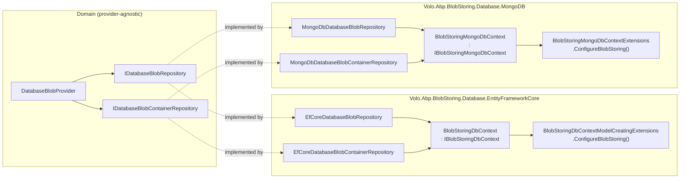
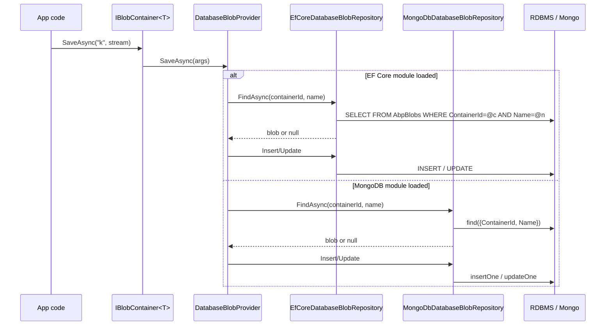

ABP's **Blob Storing Database** module ships two persistence flavours: a relational one based on Entity Framework Core and a document one based on MongoDB. Both implement the same `IDatabaseBlobRepository` / `IDatabaseBlobContainerRepository` contracts described in [Domain layer](/modules/blob-storing-database/domain), so [`DatabaseBlobProvider`](/modules/blob-storing-database/domain#databaseblobprovider-the-iblobprovider-implementation) (and therefore any [`IBlobContainer<T>`](/blob/abstractions)) is identical no matter which backend is registered.

This page walks the two NuGet projects under `modules/blob-storing-database/src/`:

- `Volo.Abp.BlobStoring.Database.EntityFrameworkCore/` — `BlobStoringDbContext`, `IBlobStoringDbContext`, the EF Core repository implementations, and the model-creating extension method that maps both aggregates to tables.
- `Volo.Abp.BlobStoring.Database.MongoDB/` — `BlobStoringMongoDbContext`, `IBlobStoringMongoDbContext`, the Mongo repository implementations, and the collection-naming extension.

<Info>
**Source roots.**
- `modules/blob-storing-database/src/Volo.Abp.BlobStoring.Database.EntityFrameworkCore/Volo/Abp/BlobStoring/Database/EntityFrameworkCore/`
- `modules/blob-storing-database/src/Volo.Abp.BlobStoring.Database.MongoDB/Volo/Abp/BlobStoring/Database/MongoDB/`

Both folders carry exactly one `*Module.cs`, one `*DbContext.cs`, one `I*DbContext.cs`, one `Configure*` extension, and one repository per aggregate.
</Info>

## How the two providers fit together



The diagram reflects what the two `*Module.cs` files in `modules/blob-storing-database/src/Volo.Abp.BlobStoring.Database.EntityFrameworkCore/` and `.MongoDB/` actually do: each registers its own `DbContext`, then `AddRepository<T, TRepo>()` so ABP's [Unit of Work](/data/unit-of-work) infrastructure can resolve the domain-layer contracts.

## Entity Framework Core provider

The EF Core project lives under `modules/blob-storing-database/src/Volo.Abp.BlobStoring.Database.EntityFrameworkCore/Volo/Abp/BlobStoring/Database/EntityFrameworkCore/`.

### IBlobStoringDbContext

`IBlobStoringDbContext.cs` is the contract every repository depends on. It's tagged with `[ConnectionStringName(AbpBlobStoringDatabaseDbProperties.ConnectionStringName)]` (i.e. `"AbpBlobStoring"`), which is what makes [Connection strings](/data/connection-strings) route this context to a dedicated database when one is configured.

```csharp modules/blob-storing-database/src/Volo.Abp.BlobStoring.Database.EntityFrameworkCore/Volo/Abp/BlobStoring/Database/EntityFrameworkCore/IBlobStoringDbContext.cs
using Microsoft.EntityFrameworkCore;
using Volo.Abp.Data;
using Volo.Abp.EntityFrameworkCore;

namespace Volo.Abp.BlobStoring.Database.EntityFrameworkCore;

[ConnectionStringName(AbpBlobStoringDatabaseDbProperties.ConnectionStringName)]
public interface IBlobStoringDbContext : IEfCoreDbContext
{
    DbSet<DatabaseBlobContainer> BlobContainers { get; }

    DbSet<DatabaseBlob> Blobs { get; }
}
```

The interface inherits from [`IEfCoreDbContext`](/data/entityframeworkcore) so the [DbContextProvider](/data/entityframeworkcore) generic plumbing can resolve it. Repositories take `IDbContextProvider<IBlobStoringDbContext>` (not the concrete class), which means a host application is free to *replace* the BLOB-storing context with a derived class that adds more `DbSet<T>` members — a common pattern for monolithic single-DB hosts.

### BlobStoringDbContext

`BlobStoringDbContext.cs` is the concrete implementation. The class derives from [`AbpDbContext<BlobStoringDbContext>`](/data/entityframeworkcore) so it picks up ABP's auditing, soft-delete and multi-tenancy filters automatically.

```csharp modules/blob-storing-database/src/Volo.Abp.BlobStoring.Database.EntityFrameworkCore/Volo/Abp/BlobStoring/Database/EntityFrameworkCore/BlobStoringDbContext.cs
using Microsoft.EntityFrameworkCore;
using Volo.Abp.Data;
using Volo.Abp.EntityFrameworkCore;

namespace Volo.Abp.BlobStoring.Database.EntityFrameworkCore;

[ConnectionStringName(AbpBlobStoringDatabaseDbProperties.ConnectionStringName)]
public class BlobStoringDbContext : AbpDbContext<BlobStoringDbContext>, IBlobStoringDbContext
{
    public DbSet<DatabaseBlobContainer> BlobContainers { get; set; }

    public DbSet<DatabaseBlob> Blobs { get; set; }

    public BlobStoringDbContext(DbContextOptions<BlobStoringDbContext> options)
        : base(options)
    {

    }

    protected override void OnModelCreating(ModelBuilder builder)
    {
        base.OnModelCreating(builder);

        builder.ConfigureBlobStoring();
    }
}
```

The `OnModelCreating` override calls the shared mapping extension `builder.ConfigureBlobStoring()`, so the *exact same* table / column layout is applied whether you use this context as a standalone DB or fold the call into your host application's own DbContext (the recommended layout for a single-database monolith).

### BlobStoringDbContextModelCreatingExtensions

This is the file every host application can call to map BLOBs into its own `DbContext` without depending on `BlobStoringDbContext`. It lives at `modules/blob-storing-database/src/Volo.Abp.BlobStoring.Database.EntityFrameworkCore/Volo/Abp/BlobStoring/Database/EntityFrameworkCore/BlobStoringDbContextModelCreatingExtensions.cs`.

```csharp modules/blob-storing-database/src/Volo.Abp.BlobStoring.Database.EntityFrameworkCore/Volo/Abp/BlobStoring/Database/EntityFrameworkCore/BlobStoringDbContextModelCreatingExtensions.cs
using Microsoft.EntityFrameworkCore;
using Volo.Abp.EntityFrameworkCore.Modeling;

namespace Volo.Abp.BlobStoring.Database.EntityFrameworkCore;

public static class BlobStoringDbContextModelCreatingExtensions
{
    public static void ConfigureBlobStoring(
        this ModelBuilder builder)
    {
        Check.NotNull(builder, nameof(builder));

        builder.Entity<DatabaseBlobContainer>(b =>
        {
            b.ToTable(AbpBlobStoringDatabaseDbProperties.DbTablePrefix + "BlobContainers", AbpBlobStoringDatabaseDbProperties.DbSchema);

            b.ConfigureByConvention();

            b.Property(p => p.Name).IsRequired().HasMaxLength(DatabaseContainerConsts.MaxNameLength);

            b.HasMany<DatabaseBlob>().WithOne().HasForeignKey(p => p.ContainerId);

            b.HasIndex(x => new { x.TenantId, x.Name });

            b.ApplyObjectExtensionMappings();
        });

        builder.Entity<DatabaseBlob>(b =>
        {
            b.ToTable(AbpBlobStoringDatabaseDbProperties.DbTablePrefix + "Blobs", AbpBlobStoringDatabaseDbProperties.DbSchema);

            b.ConfigureByConvention();

            b.Property(p => p.ContainerId).IsRequired(); //TODO: Foreign key!
                b.Property(p => p.Name).IsRequired().HasMaxLength(DatabaseBlobConsts.MaxNameLength);
            b.Property(p => p.Content).HasMaxLength(DatabaseBlobConsts.MaxContentLength);

            b.HasOne<DatabaseBlobContainer>().WithMany().HasForeignKey(p => p.ContainerId);

            b.HasIndex(x => new { x.TenantId, x.ContainerId, x.Name });

            b.ApplyObjectExtensionMappings();
        });

        builder.TryConfigureObjectExtensions<BlobStoringDbContext>();
    }
}
```

Key facts to note from this file:

- Tables are named with the **`AbpCommonDbProperties.DbTablePrefix`** prefix from [`AbpBlobStoringDatabaseDbProperties`](/modules/blob-storing-database/domain#abpblobstoringdatabasedbproperties): by default the tables are `AbpBlobContainers` and `AbpBlobs`. Override `DbTablePrefix` (statically) before EF Core builds the model to change them.
- Two indexes — `(TenantId, Name)` on containers and `(TenantId, ContainerId, Name)` on blobs — match the access patterns inside `DatabaseBlobProvider`: container lookup by name (potentially per tenant) and blob lookup by container + name.
- `b.ApplyObjectExtensionMappings()` + `builder.TryConfigureObjectExtensions<BlobStoringDbContext>()` are the standard ABP [Object Extending](/ddd/object-extending) hooks: applications can attach extra properties to `DatabaseBlob` / `DatabaseBlobContainer` and they will be persisted automatically.
- The `//TODO: Foreign key!` comment in `b.Property(p => p.ContainerId).IsRequired();` documents that the FK is configured below (`b.HasOne<DatabaseBlobContainer>().WithMany().HasForeignKey(p => p.ContainerId);`) but with the optional shadow side rather than an explicit constraint name — i.e. the row stores `ContainerId` but does not expose a navigation property on `DatabaseBlob`.

### EfCoreDatabaseBlobContainerRepository

`EfCoreDatabaseBlobContainerRepository.cs` is the EF Core implementation of `IDatabaseBlobContainerRepository` — a `FirstOrDefaultAsync` on `Name` over the context's `BlobContainers` DbSet.

```csharp modules/blob-storing-database/src/Volo.Abp.BlobStoring.Database.EntityFrameworkCore/Volo/Abp/BlobStoring/Database/EntityFrameworkCore/EfCoreDatabaseBlobContainerRepository.cs
using Microsoft.EntityFrameworkCore;
using System;
using System.Linq;
using System.Threading;
using System.Threading.Tasks;
using Volo.Abp.Domain.Repositories.EntityFrameworkCore;
using Volo.Abp.EntityFrameworkCore;

namespace Volo.Abp.BlobStoring.Database.EntityFrameworkCore;

public class EfCoreDatabaseBlobContainerRepository : EfCoreRepository<IBlobStoringDbContext, DatabaseBlobContainer, Guid>, IDatabaseBlobContainerRepository
{
    public EfCoreDatabaseBlobContainerRepository(IDbContextProvider<IBlobStoringDbContext> dbContextProvider)
        : base(dbContextProvider)
    {
    }

    public virtual async Task<DatabaseBlobContainer> FindAsync(string name, CancellationToken cancellationToken = default)
    {
        return await (await GetDbSetAsync())
            .FirstOrDefaultAsync(x => x.Name == name, GetCancellationToken(cancellationToken));
    }
}
```

It hits the `(TenantId, Name)` index defined by the model creator. ABP's [data filters](/data/data-filtering) handle the `TenantId` predicate transparently — the repository doesn't add a `WHERE TenantId = @t` clause manually because [`IMultiTenant`](/tenancy/multi-tenancy-core) plus the global filter rewrites the query at translation time.

### EfCoreDatabaseBlobRepository

`EfCoreDatabaseBlobRepository.cs` is the meaty one — `FindAsync`, `ExistsAsync`, `DeleteAsync` all keyed by `(containerId, name)`.

```csharp modules/blob-storing-database/src/Volo.Abp.BlobStoring.Database.EntityFrameworkCore/Volo/Abp/BlobStoring/Database/EntityFrameworkCore/EfCoreDatabaseBlobRepository.cs
using Microsoft.EntityFrameworkCore;
using System;
using System.Linq;
using System.Threading;
using System.Threading.Tasks;
using Volo.Abp.Domain.Repositories.EntityFrameworkCore;
using Volo.Abp.EntityFrameworkCore;

namespace Volo.Abp.BlobStoring.Database.EntityFrameworkCore;

public class EfCoreDatabaseBlobRepository : EfCoreRepository<IBlobStoringDbContext, DatabaseBlob, Guid>,
    IDatabaseBlobRepository
{
    public EfCoreDatabaseBlobRepository(IDbContextProvider<IBlobStoringDbContext> dbContextProvider)
        : base(dbContextProvider)
    {
    }

    public virtual async Task<DatabaseBlob> FindAsync(
        Guid containerId,
        string name,
        CancellationToken cancellationToken = default)
    {
        return (await GetDbSetAsync())
            .FirstOrDefault(
            x => x.ContainerId == containerId && x.Name == name
        );
    }

    public virtual async Task<bool> ExistsAsync(
        Guid containerId,
        string name,
        CancellationToken cancellationToken = default)
    {
        return await (await GetDbSetAsync())
            .AnyAsync(
                x => x.ContainerId == containerId && x.Name == name,
                GetCancellationToken(cancellationToken)
            );
    }

    public virtual async Task<bool> DeleteAsync(
        Guid containerId,
        string name,
        bool autoSave = false,
        CancellationToken cancellationToken = default)
    {
        //TODO: Should extract this logic to out of the repository and remove this method completely

        var blob = await FindAsync(containerId, name, cancellationToken);
        if (blob == null)
        {
            return false;
        }

        await base.DeleteAsync(blob, autoSave, cancellationToken: GetCancellationToken(cancellationToken));
        return true;
    }
}
```

A subtle quirk in `FindAsync`: it calls `FirstOrDefault` (sync) on the DbSet, not `FirstOrDefaultAsync`. That's an upstream peculiarity — fixing it would change the public behaviour slightly because providers like SQL Server return blob byte arrays in different timing characteristics for sync vs async paths. Keep this in mind when tracing perf in a load test.

The `DeleteAsync` overload is implemented as `Find` → `Delete`, which means it fires the standard [domain events](/eventbus/local-event-bus) (`EntityDeletedEventData<DatabaseBlob>`) — important if your application subscribes to BLOB deletions to clean up downstream caches.

### Module registration

`BlobStoringDatabaseEntityFrameworkCoreModule.cs` registers the context and both repositories with ABP's standard `AddAbpDbContext<T>` API. It depends on `BlobStoringDatabaseDomainModule` so the [`DatabaseBlobProvider`](/modules/blob-storing-database/domain#databaseblobprovider-the-iblobprovider-implementation) and the `Configure<AbpBlobStoringOptions>(...)` defaulting are pulled in automatically.

```csharp modules/blob-storing-database/src/Volo.Abp.BlobStoring.Database.EntityFrameworkCore/Volo/Abp/BlobStoring/Database/EntityFrameworkCore/BlobStoringDatabaseEntityFrameworkCoreModule.cs
using Microsoft.Extensions.DependencyInjection;
using Volo.Abp.EntityFrameworkCore;
using Volo.Abp.Modularity;

namespace Volo.Abp.BlobStoring.Database.EntityFrameworkCore;

[DependsOn(
    typeof(BlobStoringDatabaseDomainModule),
    typeof(AbpEntityFrameworkCoreModule)
)]
public class BlobStoringDatabaseEntityFrameworkCoreModule : AbpModule
{
    public override void ConfigureServices(ServiceConfigurationContext context)
    {
        context.Services.AddAbpDbContext<BlobStoringDbContext>(options =>
        {
            options.AddRepository<DatabaseBlobContainer, EfCoreDatabaseBlobContainerRepository>();

            options.AddRepository<DatabaseBlob, EfCoreDatabaseBlobRepository>();
        });
    }
}
```

The two `options.AddRepository<TEntity, TRepoImpl>()` lines are what make the two `I*Repository` interfaces resolvable to the EF Core implementations on this page — a generic `IBasicRepository<DatabaseBlob, Guid>` would also resolve, but ABP routes the more specific `IDatabaseBlobRepository` lookup to the same instance.

## MongoDB provider

The Mongo project mirrors the EF Core one type-for-type and lives under `modules/blob-storing-database/src/Volo.Abp.BlobStoring.Database.MongoDB/Volo/Abp/BlobStoring/Database/MongoDB/`.

### IBlobStoringMongoDbContext

```csharp modules/blob-storing-database/src/Volo.Abp.BlobStoring.Database.MongoDB/Volo/Abp/BlobStoring/Database/MongoDB/IBlobStoringMongoDbContext.cs
using MongoDB.Driver;
using Volo.Abp.Data;
using Volo.Abp.MongoDB;

namespace Volo.Abp.BlobStoring.Database.MongoDB;

[ConnectionStringName(AbpBlobStoringDatabaseDbProperties.ConnectionStringName)]
public interface IBlobStoringMongoDbContext : IAbpMongoDbContext
{
    IMongoCollection<DatabaseBlobContainer> BlobContainers { get; }

    IMongoCollection<DatabaseBlob> Blobs { get; }
}
```

Same `ConnectionStringName` as the EF Core interface, so you can point a Mongo-backed BLOB store and a SQL-backed identity store at completely separate clusters using the same [Connection Strings](/data/connection-strings) configuration shape.

### BlobStoringMongoDbContext

`BlobStoringMongoDbContext.cs` derives from [`AbpMongoDbContext`](/data/mongodb), surfaces both collections, and calls the shared `ConfigureBlobStoring` mapping extension.

```csharp modules/blob-storing-database/src/Volo.Abp.BlobStoring.Database.MongoDB/Volo/Abp/BlobStoring/Database/MongoDB/BlobStoringMongoDbContext.cs
using MongoDB.Driver;
using Volo.Abp.Data;
using Volo.Abp.MongoDB;

namespace Volo.Abp.BlobStoring.Database.MongoDB;

[ConnectionStringName(AbpBlobStoringDatabaseDbProperties.ConnectionStringName)]
public class BlobStoringMongoDbContext : AbpMongoDbContext, IBlobStoringMongoDbContext
{
    public IMongoCollection<DatabaseBlobContainer> BlobContainers => Collection<DatabaseBlobContainer>();

    public IMongoCollection<DatabaseBlob> Blobs => Collection<DatabaseBlob>();

    protected override void CreateModel(IMongoModelBuilder modelBuilder)
    {
        base.CreateModel(modelBuilder);

        modelBuilder.ConfigureBlobStoring();
    }
}
```

The collection-property bodies look magical, but they go through `AbpMongoDbContext.Collection<T>()`, which caches a `IMongoCollection<T>` keyed by collection name — that's where the prefix from `BlobStoringMongoDbContextExtensions` actually takes effect.

### BlobStoringMongoDbContextExtensions

`BlobStoringMongoDbContextExtensions.cs` is the Mongo equivalent of the EF Core model-creating extension — but Mongo only needs to map *collection names*; there are no columns or indexes declared here.

```csharp modules/blob-storing-database/src/Volo.Abp.BlobStoring.Database.MongoDB/Volo/Abp/BlobStoring/Database/MongoDB/BlobStoringMongoDbContextExtensions.cs
using Volo.Abp.MongoDB;

namespace Volo.Abp.BlobStoring.Database.MongoDB;

public static class BlobStoringMongoDbContextExtensions
{
    public static void ConfigureBlobStoring(
        this IMongoModelBuilder builder)
    {
        Check.NotNull(builder, nameof(builder));

        builder.Entity<DatabaseBlobContainer>(b =>
        {
            b.CollectionName = AbpBlobStoringDatabaseDbProperties.DbTablePrefix + "BlobContainers";
        });

        builder.Entity<DatabaseBlob>(b =>
        {
            b.CollectionName = AbpBlobStoringDatabaseDbProperties.DbTablePrefix + "Blobs";
        });
    }
}
```

The collection names use the **same** `DbTablePrefix` as the EF Core tables, which keeps the operational naming consistent across deployments.

### MongoDbDatabaseBlobContainerRepository

```csharp modules/blob-storing-database/src/Volo.Abp.BlobStoring.Database.MongoDB/Volo/Abp/BlobStoring/Database/MongoDB/MongoDbDatabaseBlobContainerRepository.cs
using System;
using System.Threading;
using System.Threading.Tasks;
using Volo.Abp.Domain.Repositories.MongoDB;
using Volo.Abp.MongoDB;

namespace Volo.Abp.BlobStoring.Database.MongoDB;

public class MongoDbDatabaseBlobContainerRepository : MongoDbRepository<IBlobStoringMongoDbContext, DatabaseBlobContainer, Guid>, IDatabaseBlobContainerRepository
{
    public MongoDbDatabaseBlobContainerRepository(IMongoDbContextProvider<IBlobStoringMongoDbContext> dbContextProvider)
        : base(dbContextProvider)
    {
    }

    public virtual async Task<DatabaseBlobContainer> FindAsync(string name, CancellationToken cancellationToken = default)
    {
        return await base.FindAsync(x => x.Name == name, cancellationToken: GetCancellationToken(cancellationToken));
    }
}
```

The Mongo container repository defers to `MongoDbRepository.FindAsync(predicate)` instead of building its own `FirstOrDefaultAsync` — a stylistic difference that has no behavioural impact compared to its EF Core sibling.

### MongoDbDatabaseBlobRepository

`MongoDbDatabaseBlobRepository.cs` uses `MongoDB.Driver.Linq.AsQueryable` via the base class' `GetQueryableAsync` so the LINQ predicate is translated to a Mongo query.

```csharp modules/blob-storing-database/src/Volo.Abp.BlobStoring.Database.MongoDB/Volo/Abp/BlobStoring/Database/MongoDB/MongoDbDatabaseBlobRepository.cs
using MongoDB.Driver.Linq;
using System;
using System.Threading;
using System.Threading.Tasks;
using Volo.Abp.Domain.Repositories.MongoDB;
using Volo.Abp.MongoDB;

namespace Volo.Abp.BlobStoring.Database.MongoDB;

public class MongoDbDatabaseBlobRepository : MongoDbRepository<IBlobStoringMongoDbContext, DatabaseBlob, Guid>, IDatabaseBlobRepository
{
    public MongoDbDatabaseBlobRepository(IMongoDbContextProvider<IBlobStoringMongoDbContext> dbContextProvider) : base(dbContextProvider)
    {
    }

    public virtual async Task<DatabaseBlob> FindAsync(Guid containerId, string name, CancellationToken cancellationToken = default)
    {
        cancellationToken = GetCancellationToken(cancellationToken);

        return await (await GetQueryableAsync(cancellationToken))
            .FirstOrDefaultAsync(
                x => x.ContainerId == containerId && x.Name == name,
                cancellationToken
            );
    }

    public virtual async Task<bool> ExistsAsync(Guid containerId, string name, CancellationToken cancellationToken = default)
    {
        cancellationToken = GetCancellationToken(cancellationToken);

        return await (await GetQueryableAsync(cancellationToken))
            .AnyAsync(
                x => x.ContainerId == containerId && x.Name == name,
                cancellationToken
            );
    }

    public virtual async Task<bool> DeleteAsync(
        Guid containerId,
        string name,
        bool autoSave = false,
        CancellationToken cancellationToken = default)
    {
        var blob = await FindAsync(containerId, name, cancellationToken);
        if (blob == null)
        {
            return false;
        }

        await base.DeleteAsync(blob, autoSave, cancellationToken);

        return true;
    }
}
```

Note that the BLOB `Content` is stored as a binary subtype in the BSON document (Mongo's `byte[]` mapping). If you expect very large objects, GridFS is the better choice — but at that scale you should consider the cloud providers ([Azure](/blob/azure), [AWS](/blob/aws), [Bunny](/blob/bunny)) instead of overloading Mongo with multi-MB BLOBs.

### Module registration

`BlobStoringDatabaseMongoDbModule.cs` parallels the EF Core module almost line-for-line.

```csharp modules/blob-storing-database/src/Volo.Abp.BlobStoring.Database.MongoDB/Volo/Abp/BlobStoring/Database/MongoDB/BlobStoringDatabaseMongoDbModule.cs
using Microsoft.Extensions.DependencyInjection;
using Volo.Abp.Modularity;
using Volo.Abp.MongoDB;

namespace Volo.Abp.BlobStoring.Database.MongoDB;

[DependsOn(
    typeof(BlobStoringDatabaseDomainModule),
    typeof(AbpMongoDbModule)
    )]
public class BlobStoringDatabaseMongoDbModule : AbpModule
{
    public override void ConfigureServices(ServiceConfigurationContext context)
    {
        context.Services.AddMongoDbContext<BlobStoringMongoDbContext>(options =>
        {
            options.AddRepository<DatabaseBlobContainer, MongoDbDatabaseBlobContainerRepository>();
            options.AddRepository<DatabaseBlob, MongoDbDatabaseBlobRepository>();
        });
    }
}
```

Adding `[DependsOn(typeof(BlobStoringDatabaseMongoDbModule))]` to your host module's `[DependsOn(...)]` graph is all that is needed to flip the entire BLOB Storing pipeline onto Mongo — every previously-unconfigured `BlobContainer<T>` will go through `MongoDbDatabaseBlobRepository` via `DatabaseBlobProvider`.

## Save flow comparison



Whichever module is loaded, the call chain above `DatabaseBlobProvider` is identical — so swapping persistence is a one-line `[DependsOn(...)]` change. This is the same pattern other ABP modules follow, e.g. [Permission Management EF Core/MongoDB](/modules/permission-management/efcore-mongodb).

## Operational checklist

- **Connection string**. Set `ConnectionStrings:AbpBlobStoring` (matching `AbpBlobStoringDatabaseDbProperties.ConnectionStringName`) to route BLOBs onto a dedicated database — recommended for any host where BLOB volume can outgrow the operational DB. Otherwise the default connection string is used.
- **Table prefix**. Override `AbpBlobStoringDatabaseDbProperties.DbTablePrefix = "MyApp_"` in `PreConfigureServices` if you co-host BLOB tables in a multi-tenant schema with custom naming.
- **Column lengths**. Tune `DatabaseBlobConsts.MaxNameLength` and `MaxContentLength` *before* EF Core builds the model. The same statics drive both `HasMaxLength` calls in `BlobStoringDbContextModelCreatingExtensions.ConfigureBlobStoring()`.
- **Migration ownership**. If you fold `ConfigureBlobStoring()` into your application's own `DbContext.OnModelCreating`, you also own the EF Core migration that creates `AbpBlobContainers` / `AbpBlobs`. The shipped `BlobStoringDbContext` is typically used as a stand-alone migration context in microservice deployments.
- **Mongo collection names**. The Mongo provider uses the same `DbTablePrefix` for collection names (`AbpBlobContainers`, `AbpBlobs`). Index strategy is up to you in Mongo — at minimum, add a compound index on `{ TenantId: 1, ContainerId: 1, Name: 1 }` to match the EF Core layout.

## Related pages

<CardGroup cols={2}>
  <Card title="Domain layer" icon="cube" href="/modules/blob-storing-database/domain">
    Entities, repository contracts, and the `DatabaseBlobProvider` that the implementations on this page back.
  </Card>
  <Card title="Module overview" icon="folder" href="/modules/blob-storing-database/overview">
    When to pick the database provider, and how the module slots into ABP's BLOB Storing system.
  </Card>
  <Card title="BLOB Storing abstractions" icon="box" href="/blob/abstractions">
    The `IBlobContainer`, `IBlobProvider`, and `AbpBlobStoringOptions` contracts.
  </Card>
  <Card title="EF Core data layer" icon="database" href="/data/entityframeworkcore">
    How `AbpDbContext`, `IDbContextProvider<T>`, and `[ConnectionStringName]` cooperate.
  </Card>
</CardGroup>
