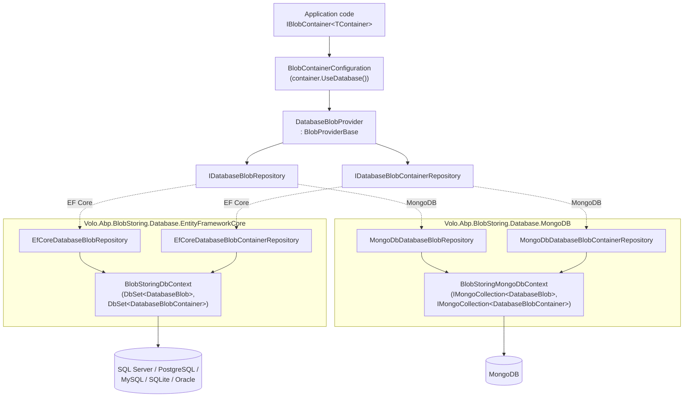

The **Blob Storing Database** module ships a concrete [`IBlobProvider`](/blob/overview) implementation —
[`DatabaseBlobProvider`](/modules/blob-storing-database/domain#databaseblobprovider) — that persists BLOB
content directly into your relational or document database. It is the simplest provider to enable
(no extra infrastructure required) and is well suited to multi-tenant SaaS apps where blob bytes
should be partitioned per tenant by the same data layer that owns the rest of the domain.

Source: [`modules/blob-storing-database/src/`](https://github.com/abpframework/abp/tree/dev/modules/blob-storing-database/src)

<CardGroup cols={2}>
  <Card title="Domain layer" icon="cube" href="/modules/blob-storing-database/domain">
    `DatabaseBlob`, `DatabaseBlobContainer`, repositories, and the `DatabaseBlobProvider`
    that implements `IBlobProvider` on top of them.
  </Card>
  <Card title="EF Core & MongoDB" icon="database" href="/modules/blob-storing-database/efcore-mongodb">
    `BlobStoringDbContext`, `BlobStoringMongoDbContext`, and the repository
    implementations registered for each ORM.
  </Card>
  <Card title="BLOB Storing system" icon="box" href="/blob/overview">
    The provider-agnostic BLOB Storing abstraction this module plugs into via
    `BlobProviderBase`.
  </Card>
  <Card title="BlobContainerConfiguration" icon="gear" href="/blob/blob-storing-database-module">
    How to wire the provider with `container.UseDatabase()` from the BLOB
    Storing configuration API.
  </Card>
</CardGroup>

## When to choose database storage

<Info>
The Database provider is the **default fallback provider** when no other provider is configured on
a container. The domain module's `ConfigureServices` sets it via
`options.Containers.ConfigureDefault(container => container.UseDatabase())` — see
[Domain layer](/modules/blob-storing-database/domain#module-registration).
</Info>

Reach for the Database provider when:

- you want zero additional infrastructure (no Azure account, no S3 bucket, no file share);
- BLOBs are **small** (icons, thumbnails, exported reports, signatures, generated PDFs) and the per-
  container row count stays manageable;
- backups, multi-tenant isolation, and transactional consistency with other domain data outweigh
  the bandwidth cost of streaming bytes through your DB connection;
- you are building a demo / proof-of-concept and intend to swap to a file / Azure / S3 provider
  later — the provider is interchangeable, application code keeps using `IBlobContainer`.

Avoid it for very large objects (multi-MB video, raw images, dataset dumps). Even though
`DatabaseBlobConsts.MaxContentLength` defaults to `int.MaxValue` (~2 GB), pushing megabytes through
EF Core change tracking or Mongo BSON documents will pressure the database.

## Pipeline at a glance



Notice that the domain layer only knows about `IDatabaseBlobRepository` and
`IDatabaseBlobContainerRepository`. EF Core and MongoDB live behind those interfaces; you can mix
and match providers per container and per ORM without touching domain code.

## Package layout

| Project | Folder | What it contributes |
| --- | --- | --- |
| `Volo.Abp.BlobStoring.Database.Domain.Shared` | `modules/blob-storing-database/src/Volo.Abp.BlobStoring.Database.Domain.Shared/` | Constants (`DatabaseBlobConsts`, `DatabaseContainerConsts`), localization resource, error codes. |
| `Volo.Abp.BlobStoring.Database.Domain` | `modules/blob-storing-database/src/Volo.Abp.BlobStoring.Database.Domain/` | `DatabaseBlob`, `DatabaseBlobContainer`, repository interfaces, `DatabaseBlobProvider`, the module class. |
| `Volo.Abp.BlobStoring.Database.EntityFrameworkCore` | `modules/blob-storing-database/src/Volo.Abp.BlobStoring.Database.EntityFrameworkCore/` | `BlobStoringDbContext`, `IBlobStoringDbContext`, model-creating extensions, `EfCore*Repository` implementations. |
| `Volo.Abp.BlobStoring.Database.MongoDB` | `modules/blob-storing-database/src/Volo.Abp.BlobStoring.Database.MongoDB/` | `BlobStoringMongoDbContext`, `IBlobStoringMongoDbContext`, `MongoDb*Repository` implementations. |
| `Volo.Abp.BlobStoring.Database.Installer` | `modules/blob-storing-database/src/Volo.Abp.BlobStoring.Database.Installer/` | NuGet packaging helper, not consumed at runtime. |

The shared module exposes table-naming and length tuning constants that downstream modules can
mutate at startup:

```csharp
// Volo.Abp.BlobStoring.Database.Domain.Shared/.../DatabaseBlobConsts.cs
public static class DatabaseBlobConsts
{
    /// <summary>
    /// Default value: 256.
    /// </summary>
    public static int MaxNameLength { get; set; } = 256;

    /// <summary>
    /// Default value: <see cref="int.MaxValue"/> (2GB).
    /// </summary>
    public static int MaxContentLength { get; set; } = int.MaxValue;
}
```

```csharp
// Volo.Abp.BlobStoring.Database.Domain.Shared/.../DatabaseContainerConsts.cs
public static class DatabaseContainerConsts
{
    /// <summary>
    /// Default value: 128.
    /// </summary>
    public static int MaxNameLength { get; set; } = 128;
}
```

Both values feed the EF Core model-creating extensions when computing column lengths — increase
them **before** generating a migration if your domain demands longer blob names.

## Connection string

All persistence packages use a dedicated connection-string name so blob bytes can be routed to a
side database without polluting your primary `Default` connection:

```csharp
// Volo.Abp.BlobStoring.Database.Domain/.../AbpBlobStoringDatabaseDbProperties.cs
public static class AbpBlobStoringDatabaseDbProperties
{
    public static string DbTablePrefix { get; set; } = AbpCommonDbProperties.DbTablePrefix;

    public static string DbSchema { get; set; } = AbpCommonDbProperties.DbSchema;

    public const string ConnectionStringName = "AbpBlobStoring";
}
```

Add an `AbpBlobStoring` entry to `appsettings.json` to opt out of the default connection:

```json
{
  "ConnectionStrings": {
    "Default": "Server=.;Database=MainDb;Trusted_Connection=True;TrustServerCertificate=True",
    "AbpBlobStoring": "Server=.;Database=BlobsDb;Trusted_Connection=True;TrustServerCertificate=True"
  }
}
```

Both `BlobStoringDbContext` and `BlobStoringMongoDbContext` are decorated with
`[ConnectionStringName(AbpBlobStoringDatabaseDbProperties.ConnectionStringName)]`, so ABP's
connection-string resolution will pick the right one automatically when present and fall back to
`Default` otherwise.

## End-to-end example

```csharp
// Domain
[BlobContainerName("avatars")]
public class AvatarContainer { }

// Application service
public class UserAvatarAppService : ApplicationService
{
    private readonly IBlobContainer<AvatarContainer> _avatars;

    public UserAvatarAppService(IBlobContainer<AvatarContainer> avatars)
    {
        _avatars = avatars;
    }

    public async Task SetAvatarAsync(Guid userId, byte[] png)
    {
        await _avatars.SaveAsync(userId.ToString(), png, overrideExisting: true);
    }

    public Task<byte[]> GetAvatarAsync(Guid userId)
    {
        return _avatars.GetAllBytesOrNullAsync(userId.ToString());
    }
}

// Web/Host module ConfigureServices
Configure<AbpBlobStoringOptions>(options =>
{
    options.Containers.Configure<AvatarContainer>(c => c.UseDatabase());
});
```

What happens on the first `SaveAsync`:

1. The host resolves `IBlobContainer<AvatarContainer>` from DI.
2. Because the container is configured with `UseDatabase()`, the BLOB Storing framework dispatches
   the save to `DatabaseBlobProvider`.
3. The provider asks `IDatabaseBlobContainerRepository.FindAsync("avatars", ...)`. If the container
   row doesn't yet exist, it inserts a new `DatabaseBlobContainer` aggregate.
4. It reads `args.BlobStream`, converts to `byte[]`, instantiates `DatabaseBlob`, and persists it
   via `IDatabaseBlobRepository`.
5. Either the EF Core or the Mongo implementation handles the actual write depending on which
   persistence module you depend on.

## Module dependencies

```csharp
// Volo.Abp.BlobStoring.Database.Domain/.../BlobStoringDatabaseDomainModule.cs
[DependsOn(
    typeof(AbpDddDomainModule),
    typeof(AbpBlobStoringModule),
    typeof(BlobStoringDatabaseDomainSharedModule)
    )]
public class BlobStoringDatabaseDomainModule : AbpModule
{
    public override void ConfigureServices(ServiceConfigurationContext context)
    {
        Configure<AbpBlobStoringOptions>(options =>
        {
            options.Containers.ConfigureDefault(container =>
            {
                if (container.ProviderType == null)
                {
                    container.UseDatabase();
                }
            });
        });
    }
}
```

The DDD domain module is the foundation; `AbpBlobStoringModule` provides the
`IBlobProvider`/`IBlobContainer` abstractions; the shared module supplies constants. Note the
`ConfigureDefault` block — it automatically claims any container that has not been wired to another
provider.

To use this module from a host:

<CodeGroup>
```csharp EF Core host
[DependsOn(
    typeof(AbpBlobStoringDatabaseEntityFrameworkCoreModule)
)]
public class MyAppEntityFrameworkCoreModule : AbpModule
{
    public override void ConfigureServices(ServiceConfigurationContext context)
    {
        context.Services.AddAbpDbContext<BlobStoringDbContext>(options =>
        {
            options.AddDefaultRepositories();
        });
    }
}
```

```csharp MongoDB host
[DependsOn(
    typeof(AbpBlobStoringDatabaseMongoDbModule)
)]
public class MyAppMongoDbModule : AbpModule
{
    public override void ConfigureServices(ServiceConfigurationContext context)
    {
        context.Services.AddMongoDbContext<BlobStoringMongoDbContext>(options =>
        {
            options.AddDefaultRepositories();
        });
    }
}
```
</CodeGroup>

## Migrations and schema

For EF Core, after adding `AbpBlobStoringDatabaseEntityFrameworkCoreModule` to your host module you
need to either:

1. Apply ABP's prebuilt migrations to a dedicated `BlobsDb`, **or**
2. Include `builder.ConfigureBlobStoring();` in your shared DbContext's `OnModelCreating` so the
   tables (`AbpBlobContainers`, `AbpBlobs`) live in the same database as your domain.

For MongoDB no schema management is required — the `AbpBlobContainers` and `AbpBlobs` collections
are created on demand by the driver.

## Next steps

<CardGroup cols={2}>
  <Card title="Domain entities & provider" icon="cube" href="/modules/blob-storing-database/domain">
    Read how `DatabaseBlob`, `DatabaseBlobContainer`, and `DatabaseBlobProvider` are implemented.
  </Card>
  <Card title="EF Core & MongoDB internals" icon="database" href="/modules/blob-storing-database/efcore-mongodb">
    See the DbContext, model-creating extensions, and repository code for both ORMs.
  </Card>
  <Card title="BLOB Storing system" icon="box" href="/blob/overview">
    The container/provider abstraction at the heart of BLOB Storing.
  </Card>
  <Card title="Database provider configuration" icon="gear" href="/blob/blob-storing-database-module">
    Configuration walkthrough for the Database provider — connection strings, multi-tenancy, and
    advanced options.
  </Card>
</CardGroup>
