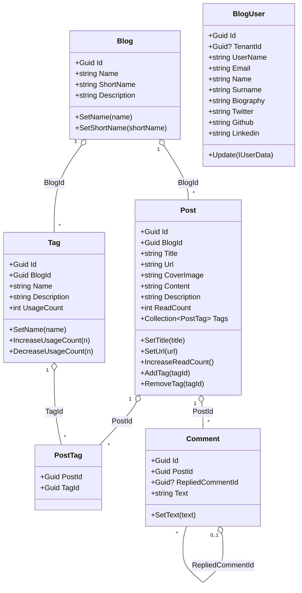

The domain layer of the Blogging module lives in two packages:

- **`Volo.Blogging.Domain.Shared`** – constants (`BlogConsts`, `PostConsts`, `CommentConsts`), ETOs (`BlogEto`, `PostEto`, `CommentEto`), and the `BloggingResource` localization key class. Safe to depend on from any tier, including HTTP clients.
- **`Volo.Blogging.Domain`** – the aggregate roots (`Blog`, `Post`, `Tag`, `Comment`, `BlogUser`) and their repository interfaces, plus the `PostCacheInvalidator` local-event handler and the `BlogUserSynchronizer` distributed-event handler.

```text modules/blogging/src/Volo.Blogging.Domain/Volo/Blogging/
Blogs/
  Blog.cs
  IBlogRepository.cs
Posts/
  Post.cs
  PostTag.cs
  PostCacheItem.cs
  PostCacheInvalidator.cs
  PostChangedEvent.cs
  IPostRepository.cs
Comments/
  Comment.cs
  ICommentRepository.cs
Tagging/
  Tag.cs
  ITagRepository.cs
Users/
  BlogUser.cs
  IBlogUserRepository.cs
  IBlogUserLookupService.cs
  BlogUserLookupService.cs
  BlogUserSynchronizer.cs
AbpBloggingDbProperties.cs
BloggingDomainModule.cs
BloggingDomainMappers.cs
```

<Info>
There is intentionally **no `BlogManager` or `PostManager` domain service** in the Blogging module. Domain rules — URL uniqueness checks, tag normalization, comment threading, read-count increments, cache invalidation — are coordinated directly by the application services (`PostAppService`, `BlogAppService`, `CommentAppService`, etc.) using the repository interfaces below. The closest thing to a "manager" is the pair `PostCacheInvalidator` + `BlogUserSynchronizer` plus the auth handlers in the application layer.
</Info>

## Object map



All five roots derive from `FullAuditedAggregateRoot<Guid>` (or `AggregateRoot<Guid>` for `BlogUser`), so creation/modification/deletion timestamps and soft delete are wired automatically through ABP's auditing infrastructure.

## `Blog`

`Volo.Blogging.Domain/Volo/Blogging/Blogs/Blog.cs` — the root of a blog space. Tenant-scoped (via `FullAuditedAggregateRoot`'s `IMultiTenant` projection in the EF mapping) and uniquely identified to users by its `ShortName`.

```csharp Blog.cs
public class Blog : FullAuditedAggregateRoot<Guid>
{
    [NotNull] public virtual string Name      { get; protected set; }
    [NotNull] public virtual string ShortName { get; protected set; }
    [CanBeNull] public virtual string Description { get; set; }

    protected Blog() { }

    public Blog(Guid id, [NotNull] string name, [NotNull] string shortName)
    {
        Id        = id;
        Name      = Check.NotNullOrWhiteSpace(name,      nameof(name));
        ShortName = Check.NotNullOrWhiteSpace(shortName, nameof(shortName));
    }

    public virtual Blog SetName([NotNull] string name) { /* ... */ }
    public virtual Blog SetShortName(string shortName) { /* ... */ }
}
```

Length limits (`BlogConsts.MaxNameLength = 256`, `MaxShortNameLength = 32`, `MaxDescriptionLength = 1024`) come from `Volo.Blogging.Domain.Shared/Volo/Blogging/Blogs/BlogConsts.cs` and are applied as `DynamicStringLength` attributes on the corresponding DTOs (`CreateBlogDto`, `UpdateBlogDto`).

### `IBlogRepository`

```csharp Blogs/IBlogRepository.cs
public interface IBlogRepository : IBasicRepository<Blog, Guid>
{
    Task<Blog> FindByShortNameAsync(string shortName, CancellationToken cancellationToken = default);
}
```

`BlogAppService.GetByShortNameAsync(shortName)` is the only public consumer; the admin `BlogManagementAppService` only needs the inherited CRUD methods.

## `Post` and `PostTag`

`Post` is the core aggregate. It owns a `Collection<PostTag>` value-object link table to express tag membership and tracks a `ReadCount` that is bumped by `PostAppService.GetForReadingAsync(...)`.

```csharp Posts/Post.cs
public class Post : FullAuditedAggregateRoot<Guid>
{
    public virtual Guid BlogId      { get; protected set; }
    [NotNull] public virtual string Url        { get; protected set; }
    [NotNull] public virtual string CoverImage { get; set; }
    [NotNull] public virtual string Title      { get; protected set; }
    [CanBeNull] public virtual string Content     { get; set; }
    [CanBeNull] public virtual string Description { get; set; }
    public virtual int ReadCount { get; protected set; }
    public virtual Collection<PostTag> Tags { get; protected set; }

    public Post(Guid id, Guid blogId, [NotNull] string title,
                [NotNull] string coverImage, [NotNull] string url)
    {
        Id         = id;
        BlogId     = blogId;
        Title      = Check.NotNullOrWhiteSpace(title,      nameof(title));
        Url        = Check.NotNullOrWhiteSpace(url,        nameof(url));
        CoverImage = Check.NotNullOrWhiteSpace(coverImage, nameof(coverImage));
        Tags       = new Collection<PostTag>();
    }

    public virtual Post IncreaseReadCount() { ReadCount++; return this; }
    public virtual Post SetTitle([NotNull] string title) { /* ... */ }
    public virtual Post SetUrl([NotNull] string url)     { /* ... */ }

    public virtual void AddTag(Guid tagId)    => Tags.Add(new PostTag(Id, tagId));
    public virtual void RemoveTag(Guid tagId) => Tags.RemoveAll(t => t.TagId == tagId);
}
```

The join entity is a creation-audited composite-key entity:

```csharp Posts/PostTag.cs
public class PostTag : CreationAuditedEntity
{
    public virtual Guid PostId { get; protected set; }
    public virtual Guid TagId  { get; protected set; }

    public PostTag(Guid postId, Guid tagId) { PostId = postId; TagId = tagId; }

    public override object[] GetKeys() => new object[] { PostId, TagId };
}
```

`PostConsts` (in `Volo.Blogging.Domain.Shared/Volo/Blogging/Posts/PostConsts.cs`) caps the columns:

| Constant | Default |
| --- | --- |
| `MaxTitleLength` | `512` |
| `MaxUrlLength` | `64` |
| `MaxContentLength` | `1_048_576` (1 MB) |
| `MaxDescriptionLength` | `1000` |
| `MaxTitleLengthToBeSeoFriendly` | `60` (informational, surfaced in the editor UI) |
| `MaxSeoFriendlyDescriptionLength` | `200` (informational) |

### `IPostRepository`

```csharp Posts/IPostRepository.cs
public interface IPostRepository : IBasicRepository<Post, Guid>
{
    Task<List<Post>> GetPostsByBlogId(Guid id,
        CancellationToken cancellationToken = default);

    Task<bool> IsPostUrlInUseAsync(Guid blogId, string url,
        Guid? excludingPostId = null,
        CancellationToken cancellationToken = default);

    Task<Post> GetPostByUrl(Guid blogId, string url,
        CancellationToken cancellationToken = default);

    Task<List<Post>> GetOrderedList(Guid blogId, bool descending = false,
        CancellationToken cancellationToken = default);

    Task<List<Post>> GetListByUserIdAsync(Guid userId,
        CancellationToken cancellationToken = default);

    Task<List<Post>> GetLatestBlogPostsAsync(Guid blogId, int count,
        CancellationToken cancellationToken = default);
}
```

These methods drive every public endpoint:

- `GetListByBlogIdAndTagNameAsync` → `GetPostsByBlogId` (then in-memory tag filter).
- `GetTimeOrderedListAsync` → `GetOrderedList`.
- `GetForReadingAsync` → `GetPostByUrl` followed by `IncreaseReadCount`.
- `CreateAsync` / `UpdateAsync` → `IsPostUrlInUseAsync` to enforce unique slugs per blog.
- The member page → `GetListByUserIdAsync`.
- The "latest posts" sidebar on the detail page → `GetLatestBlogPostsAsync`.

### Post cache & `PostChangedEvent`

`PostAppService` caches the per-blog post list (with details) as `IDistributedCache<List<PostCacheItem>>`. Cache busting is event-driven:

```csharp Posts/PostChangedEvent.cs
namespace Volo.Blogging.Posts
{
    public class PostChangedEvent
    {
        public Guid BlogId { get; set; }
    }
}
```

```csharp Posts/PostCacheInvalidator.cs
public class PostCacheInvalidator
    : ILocalEventHandler<PostChangedEvent>, ITransientDependency
{
    protected IDistributedCache<List<PostCacheItem>> Cache { get; }

    public PostCacheInvalidator(IDistributedCache<List<PostCacheItem>> cache)
        => Cache = cache;

    public virtual async Task HandleEventAsync(PostChangedEvent post)
    {
        await Cache.RemoveAsync(post.BlogId.ToString(), considerUow: true);
    }
}
```

`PostCacheItem` is the serializable shape stored in the bucket — it mirrors `PostWithDetailsDto` but without the writer projection — and is what `PostAppService` rehydrates on a cache hit.

```mermaid
sequenceDiagram
    autonumber
    participant Caller
    participant PAS as PostAppService
    participant Repo as IPostRepository
    participant Cache as IDistributedCache&lt;List&lt;PostCacheItem&gt;&gt;
    participant Bus as ILocalEventBus
    participant Inv as PostCacheInvalidator

    Caller->>PAS: CreateAsync / UpdateAsync / DeleteAsync
    PAS->>Repo: Insert / Update / Delete
    PAS->>Bus: PublishAsync(new PostChangedEvent { BlogId })
    Bus-->>Inv: HandleEventAsync(PostChangedEvent)
    Inv->>Cache: RemoveAsync(BlogId.ToString(), considerUow: true)
    Note over Cache: next read repopulates from IPostRepository
```

The admin `BlogManagementAppService.ClearCacheAsync(blogId)` provides a manual override that calls `Cache.RemoveAsync(id.ToString())` directly — useful when seed data is inserted out-of-band.

## `Tag`

`Tag` aggregates per blog. `UsageCount` is maintained transactionally by `PostAppService` whenever tags are added/removed from a post.

```csharp Tagging/Tag.cs
public class Tag : FullAuditedAggregateRoot<Guid>
{
    public virtual Guid   BlogId      { get; protected set; }
    public virtual string Name        { get; protected set; }
    public virtual string Description { get; protected set; }
    public virtual int    UsageCount  { get; protected internal set; }

    public Tag(Guid id, Guid blogId, [NotNull] string name,
               int usageCount = 0, string description = null)
    {
        Id          = id;
        Name        = Check.NotNullOrWhiteSpace(name, nameof(name));
        BlogId      = blogId;
        Description = description;
        UsageCount  = usageCount;
    }

    public virtual void SetName(string name) { /* ... */ }
    public virtual void IncreaseUsageCount(int number = 1) => UsageCount += number;

    public virtual void DecreaseUsageCount(int number = 1)
    {
        if (UsageCount <= 0) return;
        if (UsageCount - number <= 0) { UsageCount = 0; return; }
        UsageCount -= number;
    }

    public virtual void SetDescription(string description) => Description = description;
}
```

### `ITagRepository`

```csharp Tagging/ITagRepository.cs
public interface ITagRepository : IBasicRepository<Tag, Guid>
{
    Task<List<Tag>> GetListAsync(Guid blogId,
        CancellationToken cancellationToken = default);

    Task<Tag> GetByNameAsync(Guid blogId, string name,
        CancellationToken cancellationToken = default);

    Task<Tag> FindByNameAsync(Guid blogId, string name,
        CancellationToken cancellationToken = default);

    Task<List<Tag>> GetListAsync(IEnumerable<Guid> ids,
        CancellationToken cancellationToken = default);

    Task DecreaseUsageCountOfTagsAsync(List<Guid> id,
        CancellationToken cancellationToken = default);
}
```

`TagAppService.GetPopularTagsAsync` calls `GetListAsync(blogId)`, sorts by `UsageCount` and applies `MinimumPostCount` + `ResultCount` from `GetPopularTagsInput`. `DecreaseUsageCountOfTagsAsync` is used by `PostAppService` when a post (and therefore all its `PostTag` rows) is deleted.

## `Comment`

Threaded comments with a self-referential `RepliedCommentId`. Tree assembly happens in the application layer (`CommentAppService.GetHierarchicalListOfPostAsync`).

```csharp Comments/Comment.cs
public class Comment : FullAuditedAggregateRoot<Guid>
{
    public virtual Guid  PostId           { get; protected set; }
    public virtual Guid? RepliedCommentId { get; protected set; }
    public virtual string Text            { get; protected set; }

    public Comment(Guid id, Guid postId, Guid? repliedCommentId, [NotNull] string text)
    {
        Id               = id;
        PostId           = postId;
        RepliedCommentId = repliedCommentId;
        Text             = Check.NotNullOrWhiteSpace(text, nameof(text));
    }

    public void SetText(string text)
        => Text = Check.NotNullOrWhiteSpace(text, nameof(text));
}
```

### `ICommentRepository`

```csharp Comments/ICommentRepository.cs
public interface ICommentRepository : IBasicRepository<Comment, Guid>
{
    Task<List<Comment>> GetListOfPostAsync(Guid postId,
        CancellationToken cancellationToken = default);

    Task<int> GetCommentCountOfPostAsync(Guid postId,
        CancellationToken cancellationToken = default);

    Task<List<Comment>> GetRepliesOfComment(Guid id,
        CancellationToken cancellationToken = default);

    Task DeleteOfPost(Guid id,
        CancellationToken cancellationToken = default);
}
```

`GetListOfPostAsync` feeds the detail page comment list; `GetCommentCountOfPostAsync` populates the badge on the post listing; `GetRepliesOfComment` walks a reply branch; `DeleteOfPost` is invoked when a `Post` is removed.

Authorization for update/delete is handled by `CommentAuthorizationHandler` in the application layer (it allows the author or any user with the matching permission to mutate the row) — see the [application layer page](/modules/blogging/application#authorization-handlers).

## Blog users and synchronizer

The Blogging module keeps a **local copy** of each contributing user. This decouples the module from the host's identity provider, lets posts/comments be queried without round-tripping the identity store, and surfaces blog-specific profile fields (Twitter, GitHub, LinkedIn, biography, etc.) that aren't part of `IdentityUser`.

```csharp Users/BlogUser.cs
public class BlogUser : AggregateRoot<Guid>, IUser, IUpdateUserData
{
    public virtual Guid?  TenantId             { get; protected set; }
    public virtual string UserName             { get; protected set; }
    public virtual string Email                { get; protected set; }
    public virtual string Name                 { get; set; }
    public virtual string Surname              { get; set; }
    public virtual bool   IsActive             { get; set; }
    public virtual bool   EmailConfirmed       { get; protected set; }
    public virtual string PhoneNumber          { get; protected set; }
    public virtual bool   PhoneNumberConfirmed { get; protected set; }

    [CanBeNull] public virtual string WebSite   { get; set; }
    [CanBeNull] public virtual string Twitter   { get; set; }
    [CanBeNull] public virtual string Github    { get; set; }
    [CanBeNull] public virtual string Linkedin  { get; set; }
    [CanBeNull] public virtual string Company   { get; set; }
    [CanBeNull] public virtual string JobTitle  { get; set; }
    [CanBeNull] public virtual string Biography { get; set; }

    public BlogUser(IUserData user) : base(user.Id)
    {
        TenantId = user.TenantId;
        UpdateInternal(user);
    }

    public virtual bool Update(IUserData user)
    {
        if (Id       != user.Id)       throw new ArgumentException(/* ... */);
        if (TenantId != user.TenantId) throw new ArgumentException(/* ... */);
        if (Equals(user)) return false;
        UpdateInternal(user);
        return true;
    }

    protected virtual void UpdateInternal(IUserData user) { /* copy fields */ }
}
```

### Lookup service

`BlogUserLookupService : UserLookupService<BlogUser, IBlogUserRepository>` is the standard ABP lookup-service pattern. The first time the module sees a remote user ID it calls the inherited base to fetch the user, calls the protected factory and persists a row:

```csharp Users/BlogUserLookupService.cs
public class BlogUserLookupService
    : UserLookupService<BlogUser, IBlogUserRepository>, IBlogUserLookupService
{
    public BlogUserLookupService(
        IBlogUserRepository userRepository,
        IUnitOfWorkManager unitOfWorkManager)
        : base(userRepository, unitOfWorkManager) { }

    protected override BlogUser CreateUser(IUserData externalUser)
        => new BlogUser(externalUser);
}
```

`PostAppService`, `CommentAppService` and `MemberAppService` all depend on `IBlogUserLookupService` (`UserLookupService.FindByIdAsync`) to populate `BlogUserDto` projections.

### `BlogUserSynchronizer`

Whenever the host updates an identity user, the Blogging module receives the standard `EntityUpdatedEto<UserEto>` distributed event and refreshes the local projection:

```csharp Users/BlogUserSynchronizer.cs
public class BlogUserSynchronizer :
    IDistributedEventHandler<EntityUpdatedEto<UserEto>>, ITransientDependency
{
    protected IBlogUserRepository      UserRepository    { get; }
    protected IBlogUserLookupService   UserLookupService { get; }

    public BlogUserSynchronizer(
        IBlogUserRepository userRepository,
        IBlogUserLookupService userLookupService)
    {
        UserRepository    = userRepository;
        UserLookupService = userLookupService;
    }

    public async Task HandleEventAsync(EntityUpdatedEto<UserEto> eventData)
    {
        var user = await UserRepository.FindAsync(eventData.Entity.Id);
        if (user == null)
        {
            user = await UserLookupService.FindByIdAsync(eventData.Entity.Id);
            if (user == null) { return; }
        }

        if (user.Update(eventData.Entity))
        {
            await UserRepository.UpdateAsync(user);
        }
    }
}
```

The flow end-to-end:

```mermaid
sequenceDiagram
    autonumber
    participant Identity as Identity host
    participant Bus as IDistributedEventBus
    participant Sync as BlogUserSynchronizer
    participant Repo as IBlogUserRepository
    participant Lookup as IBlogUserLookupService

    Identity->>Bus: publish EntityUpdatedEto&lt;UserEto&gt;
    Bus-->>Sync: HandleEventAsync(eto)
    Sync->>Repo: FindAsync(userId)
    alt projection exists
        Sync->>Repo: UpdateAsync(blogUser.Update(eto.Entity))
    else first-time encounter
        Sync->>Lookup: FindByIdAsync(userId)
        Lookup-->>Sync: BlogUser (newly created)
        Sync->>Repo: UpdateAsync(blogUser)
    end
```

## ETOs and distributed contracts

`Volo.Blogging.Domain.Shared/Volo/Blogging/Posts/PostEto.cs` and `BlogEto.cs` / `CommentEto.cs` provide the on-the-wire shapes used when the Blogging module participates in distributed eventing. They are intentionally trimmed projections (no tags, no comments, no writer) suitable for cross-microservice notification payloads.

```csharp Posts/PostEto.cs
[Serializable]
public class PostEto
{
    public Guid Id { get; set; }
    public Guid BlogId { get; set; }
    [NotNull] public string Url { get; set; }
    [NotNull] public string CoverImage { get; set; }
    [NotNull] public string Title { get; set; }
    [CanBeNull] public string Content { get; set; }
    public int ReadCount { get; set; }
}
```

## Module registration & DB properties

The domain module wires Mapperly mapping profiles and declares dependencies on `AbpDddDomainModule`, `AbpUsersDomainModule` and `BloggingDomainSharedModule`:

```text Volo/Blogging/AbpBloggingDbProperties.cs
public static class AbpBloggingDbProperties
{
    public const string DbTablePrefix = "Blg";   // EF Core table prefix
    public const string DbSchema      = null;    // default schema
    public const string ConnectionStringName = "AbpBlogging";
}
```

`Volo.Blogging.EntityFrameworkCore.BloggingDbContext` exposes `DbSet<Blog>`, `DbSet<Post>`, `DbSet<PostTag>`, `DbSet<Tag>`, `DbSet<Comment>` and `DbSet<BlogUser>`, all named `Blg{Entity}` by default. The MongoDB provider uses the same names for its collection mappings.

## Where the domain is consumed

<CardGroup cols={2}>
  <Card title="Application layer" icon="layer-group" href="/modules/blogging/application">
    Public services orchestrate repositories + `PostChangedEvent` + `IBlogUserLookupService`; the admin service calls `IBlogRepository` and the cache directly.
  </Card>
  <Card title="HTTP API" icon="cloud" href="/modules/blogging/http-api">
    Controllers expose every method on `IBlogAppService`, `IPostAppService`, `ICommentAppService`, `ITagAppService`, `IBlogManagementAppService` and `IFileAppService`.
  </Card>
  <Card title="Module overview" icon="circle-info" href="/modules/blogging/overview">
    Module landing, layered diagram and Blogging-vs-CMS-Kit guidance.
  </Card>
  <Card title="CMS Kit Blogs" icon="newspaper" href="/modules/cms-kit/blogs">
    The actively-evolving alternative — different aggregates (`Blog`, `BlogPost`), different repository contracts, shared CMS Kit services.
  </Card>
</CardGroup>
