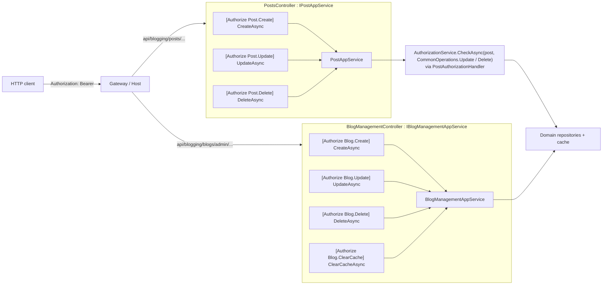

The Blogging module ships **two** HTTP surfaces:

- **`Volo.Blogging.HttpApi`** — the public read/write API mounted under `api/blogging/*`. Used by anonymous readers, authenticated commenters and authors.
- **`Volo.Blogging.Admin.HttpApi`** — the management API mounted under `api/blogging/blogs/admin`. Used only by the admin Razor Pages and by code holding the `Blogging.Blog.Management` permission.

Each one has a matching `*.HttpApi.Client` companion that wires up ABP's static HTTP client proxies (`AddStaticHttpClientProxies`) so consumers can inject `IPostAppService`, `IBlogAppService`, `ICommentAppService`, `ITagAppService`, `IFileAppService`, `IMemberAppService` and `IBlogManagementAppService` over the wire transparently — same interface, no controller required on the consumer side.

```text modules/blogging/src/
Volo.Blogging.HttpApi/Volo/Blogging/
  BloggingHttpApiModule.cs
  BlogsController.cs
  PostsController.cs
  CommentsController.cs
  TagsController.cs
  BlogFilesController.cs
Volo.Blogging.HttpApi.Client/Volo/Blogging/
  BloggingHttpApiClientModule.cs
Volo.Blogging.Admin.HttpApi/Volo/Blogging/Admin/
  BloggingAdminHttpApiModule.cs
  BlogManagementController.cs
Volo.Blogging.Admin.HttpApi.Client/Volo/Blogging/Admin/
  BloggingAdminHttpApiClientModule.cs
```

## Remote service identity

Both API packages declare a remote service name and an area name that becomes part of the dynamic JS proxy namespace and the Swagger group:

```csharp Volo.Blogging.Application.Contracts/Volo/Blogging/BloggingRemoteServiceConsts.cs
public static class BloggingRemoteServiceConsts
{
    public const string RemoteServiceName = "Blogging";
    public const string ModuleName        = "blogging";
}
```

```csharp Volo.Blogging.Admin.Application.Contracts/Volo/Blogging/Admin/BloggingAdminRemoteServiceConsts.cs
public static class BloggingAdminRemoteServiceConsts
{
    public const string RemoteServiceName = "BloggingAdmin";
    public const string ModuleName        = "bloggingAdmin";
}
```

Every controller in this module is decorated with the matching `[RemoteService]` + `[Area]` attributes, e.g.:

```csharp
[RemoteService(Name = BloggingRemoteServiceConsts.RemoteServiceName)]
[Area(BloggingRemoteServiceConsts.ModuleName)]
[Route("api/blogging/posts")]
public class PostsController : AbpControllerBase, IPostAppService { /* ... */ }
```

This gives hosts a clean toggle: setting `RemoteServices:Blogging:BaseUrl` and `RemoteServices:BloggingAdmin:BaseUrl` independently lets you mount the two halves on different services or skip the admin half entirely.

## Route map (public)

All routes below are prefixed by the host's `api/` base path (or the BFF / API gateway equivalent). They map 1:1 to the methods on the public application services documented at [Application layer](/modules/blogging/application).

### `BlogsController` — `api/blogging/blogs`

| Method | Route | App service call | Permission |
| --- | --- | --- | --- |
| `GET` | `api/blogging/blogs` | `IBlogAppService.GetListAsync()` | _anonymous_ |
| `GET` | `api/blogging/blogs/by-shortname/{shortName}` | `IBlogAppService.GetByShortNameAsync(shortName)` | _anonymous_ |
| `GET` | `api/blogging/blogs/{id}` | `IBlogAppService.GetAsync(id)` | _anonymous_ |

```csharp BlogsController.cs
[RemoteService(Name = BloggingRemoteServiceConsts.RemoteServiceName)]
[Area(BloggingRemoteServiceConsts.ModuleName)]
[Route("api/blogging/blogs")]
public class BlogsController : AbpControllerBase, IBlogAppService
{
    private readonly IBlogAppService _blogAppService;
    public BlogsController(IBlogAppService blogAppService)
        => _blogAppService = blogAppService;

    [HttpGet]
    public virtual Task<ListResultDto<BlogDto>> GetListAsync()
        => _blogAppService.GetListAsync();

    [HttpGet, Route("by-shortname/{shortName}")]
    public virtual Task<BlogDto> GetByShortNameAsync(string shortName)
        => _blogAppService.GetByShortNameAsync(shortName);

    [HttpGet, Route("{id}")]
    public virtual Task<BlogDto> GetAsync(Guid id)
        => _blogAppService.GetAsync(id);
}
```

### `PostsController` — `api/blogging/posts`

| Method | Route | App service call | Auth |
| --- | --- | --- | --- |
| `GET` | `api/blogging/posts/{blogId}/all?tagName=...` | `GetListByBlogIdAndTagNameAsync(blogId, tagName)` | _anonymous_ |
| `GET` | `api/blogging/posts/{blogId}/all/by-time` | `GetTimeOrderedListAsync(blogId)` | _anonymous_ (cached) |
| `GET` | `api/blogging/posts/read?BlogId=...&Url=...` | `GetForReadingAsync(GetPostInput)` | _anonymous_, bumps `ReadCount` |
| `GET` | `api/blogging/posts/{id}` | `GetAsync(id)` | _anonymous_ |
| `GET` | `api/blogging/posts/user/{userId}` | `GetListByUserIdAsync(userId)` | _anonymous_ |
| `GET` | `api/blogging/posts/{blogId}/latest/{count}` | `GetLatestBlogPostsAsync(blogId, count)` | _anonymous_ |
| `POST` | `api/blogging/posts` | `CreateAsync(CreatePostDto)` | `Blogging.Post.Create` |
| `PUT` | `api/blogging/posts/{id}` | `UpdateAsync(id, UpdatePostDto)` | `Blogging.Post.Update` *or* author |
| `DELETE` | `api/blogging/posts/{id}` | `DeleteAsync(id)` | `Blogging.Post.Delete` *or* author |

```csharp PostsController.cs
[RemoteService(Name = BloggingRemoteServiceConsts.RemoteServiceName)]
[Area(BloggingRemoteServiceConsts.ModuleName)]
[Route("api/blogging/posts")]
public class PostsController : AbpControllerBase, IPostAppService
{
    private readonly IPostAppService _postAppService;
    public PostsController(IPostAppService postAppService)
        => _postAppService = postAppService;

    [HttpGet, Route("{blogId}/all")]
    public Task<ListResultDto<PostWithDetailsDto>>
        GetListByBlogIdAndTagNameAsync(Guid blogId, string tagName)
        => _postAppService.GetListByBlogIdAndTagNameAsync(blogId, tagName);

    [HttpGet, Route("{blogId}/all/by-time")]
    public Task<ListResultDto<PostWithDetailsDto>>
        GetTimeOrderedListAsync(Guid blogId)
        => _postAppService.GetTimeOrderedListAsync(blogId);

    [HttpGet, Route("read")]
    public Task<PostWithDetailsDto> GetForReadingAsync(GetPostInput input)
        => _postAppService.GetForReadingAsync(input);

    [HttpGet, Route("{id}")]
    public Task<PostWithDetailsDto> GetAsync(Guid id)
        => _postAppService.GetAsync(id);

    [HttpPost]
    public Task<PostWithDetailsDto> CreateAsync(CreatePostDto input)
        => _postAppService.CreateAsync(input);

    [HttpPut, Route("{id}")]
    public Task<PostWithDetailsDto> UpdateAsync(Guid id, UpdatePostDto input)
        => _postAppService.UpdateAsync(id, input);

    [HttpGet, Route("user/{userId}")]
    public Task<List<PostWithDetailsDto>> GetListByUserIdAsync(Guid userId)
        => _postAppService.GetListByUserIdAsync(userId);

    [HttpGet, Route("{blogId}/latest/{count}")]
    public Task<List<PostWithDetailsDto>>
        GetLatestBlogPostsAsync(Guid blogId, int count)
        => _postAppService.GetLatestBlogPostsAsync(blogId, count);

    [HttpDelete, Route("{id}")]
    public Task DeleteAsync(Guid id)
        => _postAppService.DeleteAsync(id);
}
```

`GetPostInput` is a query DTO, so `GET api/blogging/posts/read?BlogId={guid}&Url={slug}` is the canonical reader call:

```csharp Posts/GetPostInput.cs
public class GetPostInput
{
    [Required] public string Url { get; set; }
    public Guid BlogId { get; set; }
}
```

### `CommentsController` — `api/blogging/comments`

| Method | Route | App service call | Auth |
| --- | --- | --- | --- |
| `GET` | `api/blogging/comments/hierarchical/{postId}` | `GetHierarchicalListOfPostAsync(postId)` | _anonymous_ |
| `POST` | `api/blogging/comments` | `CreateAsync(CreateCommentDto)` | authenticated |
| `PUT` | `api/blogging/comments/{id}` | `UpdateAsync(id, UpdateCommentDto)` | author *or* `Blogging.Comment.Update` |
| `DELETE` | `api/blogging/comments/{id}` | `DeleteAsync(id)` | author *or* `Blogging.Comment.Delete` |

```csharp CommentsController.cs
[Route("api/blogging/comments")]
public class CommentsController : AbpControllerBase, ICommentAppService
{
    private readonly ICommentAppService _commentAppService;
    public CommentsController(ICommentAppService commentAppService)
        => _commentAppService = commentAppService;

    [HttpGet, Route("hierarchical/{postId}")]
    public Task<List<CommentWithRepliesDto>>
        GetHierarchicalListOfPostAsync(Guid postId)
        => _commentAppService.GetHierarchicalListOfPostAsync(postId);

    [HttpPost]
    public Task<CommentWithDetailsDto> CreateAsync(CreateCommentDto input)
        => _commentAppService.CreateAsync(input);

    [HttpPut, Route("{id}")]
    public Task<CommentWithDetailsDto> UpdateAsync(Guid id, UpdateCommentDto input)
        => _commentAppService.UpdateAsync(id, input);

    [HttpDelete, Route("{id}")]
    public Task DeleteAsync(Guid id)
        => _commentAppService.DeleteAsync(id);
}
```

### `TagsController` — `api/blogging/tags`

A deliberately narrow surface: only the popular-tags sidebar query is exposed.

| Method | Route | App service call |
| --- | --- | --- |
| `GET` | `api/blogging/tags/popular/{blogId}?ResultCount=10&MinimumPostCount=2` | `GetPopularTagsAsync(blogId, GetPopularTagsInput)` |

```csharp TagsController.cs
[Route("api/blogging/tags")]
public class TagsController : AbpControllerBase, ITagAppService
{
    private readonly ITagAppService _tagAppService;
    public TagsController(ITagAppService tagAppService)
        => _tagAppService = tagAppService;

    [HttpGet, Route("popular/{blogId}")]
    public Task<List<TagDto>> GetPopularTagsAsync(
        Guid blogId, GetPopularTagsInput input)
        => _tagAppService.GetPopularTagsAsync(blogId, input);
}
```

```csharp Tagging/Dtos/GetPopularTagsInput.cs
public class GetPopularTagsInput
{
    public int  ResultCount     { get; set; } = 10;
    public int? MinimumPostCount { get; set; }
}
```

### `BlogFilesController` — `api/blogging/files`

Backs the editor's image upload widget and serves cover images / inline images by name.

| Method | Route | App service call | Notes |
| --- | --- | --- | --- |
| `GET` | `api/blogging/files/{name}` | `IFileAppService.GetAsync(name)` | returns `RawFileDto` (byte[] + metadata) |
| `GET` | `api/blogging/files/www/{name}` | `IFileAppService.GetFileAsync(name)` | streams the file (`IRemoteStreamContent`) |
| `POST` | `api/blogging/files/images/upload` | `IFileAppService.CreateAsync(FileUploadInputDto)` | multipart upload |

```csharp BlogFilesController.cs
[Route("api/blogging/files")]
public class BlogFilesController : AbpControllerBase, IFileAppService
{
    private readonly IFileAppService _fileAppService;
    public BlogFilesController(IFileAppService fileAppService)
        => _fileAppService = fileAppService;

    [HttpGet, Route("{name}")]
    public Task<RawFileDto> GetAsync(string name)
        => _fileAppService.GetAsync(name);

    [HttpGet, Route("www/{name}")]
    public virtual async Task<IRemoteStreamContent> GetFileAsync(string name)
        => await _fileAppService.GetFileAsync(name);

    [HttpPost, Route("images/upload")]
    public Task<FileUploadOutputDto> CreateAsync(FileUploadInputDto input)
        => _fileAppService.CreateAsync(input);
}
```

```csharp Files/FileUploadInputDto.cs
public class FileUploadInputDto
{
    [Required] public IRemoteStreamContent File { get; set; }
    [Required] public string Name { get; set; }
}
```

The `[Area("blogging")]` + `[Route("api/blogging/...")]` pair means a Swagger UI configured to include the `Blogging` group will expose exactly these endpoints under one document.

## Route map (admin)

The admin HTTP API has a single controller dedicated to blog CRUD + cache management.

### `BlogManagementController` — `api/blogging/blogs/admin`

| Method | Route | App service call | Permission |
| --- | --- | --- | --- |
| `GET` | `api/blogging/blogs/admin` | `IBlogManagementAppService.GetListAsync()` | `Blogging.Blog.Management` (via menu) |
| `GET` | `api/blogging/blogs/admin/{id}` | `GetAsync(id)` | `Blogging.Blog.Management` |
| `POST` | `api/blogging/blogs/admin` | `CreateAsync(CreateBlogDto)` | `Blogging.Blog.Create` |
| `PUT` | `api/blogging/blogs/admin/{id}` | `UpdateAsync(id, UpdateBlogDto)` | `Blogging.Blog.Update` |
| `DELETE` | `api/blogging/blogs/admin/{id}` | `DeleteAsync(id)` | `Blogging.Blog.Delete` |
| `GET` | `api/blogging/blogs/admin/clear-cache/{id}` | `ClearCacheAsync(id)` | `Blogging.Blog.ClearCache` |

```csharp BlogManagementController.cs
[RemoteService(Name = BloggingAdminRemoteServiceConsts.RemoteServiceName)]
[Area(BloggingAdminRemoteServiceConsts.ModuleName)]
[Route("api/blogging/blogs/admin")]
public class BlogManagementController
    : AbpControllerBase, IBlogManagementAppService
{
    private readonly IBlogManagementAppService _blogManagementAppService;

    public BlogManagementController(IBlogManagementAppService blogManagementAppService)
        => _blogManagementAppService = blogManagementAppService;

    [HttpGet]
    public virtual Task<ListResultDto<BlogDto>> GetListAsync()
        => _blogManagementAppService.GetListAsync();

    [HttpGet, Route("{id}")]
    public virtual Task<BlogDto> GetAsync(Guid id)
        => _blogManagementAppService.GetAsync(id);

    [HttpPost]
    public virtual Task<BlogDto> CreateAsync(CreateBlogDto input)
        => _blogManagementAppService.CreateAsync(input);

    [HttpPut, Route("{id}")]
    public virtual Task<BlogDto> UpdateAsync(Guid id, UpdateBlogDto input)
        => _blogManagementAppService.UpdateAsync(id, input);

    [HttpDelete, Route("{id}")]
    public virtual Task DeleteAsync(Guid id)
        => _blogManagementAppService.DeleteAsync(id);

    [HttpGet, Route("clear-cache/{id}")]
    public virtual Task ClearCacheAsync(Guid id)
        => _blogManagementAppService.ClearCacheAsync(id);
}
```

<Info>
Note that `ClearCacheAsync` is exposed as `HttpGet` rather than `HttpPost`/`HttpDelete`. This is intentional in the existing source — it's invoked from a sidebar button in the admin page that already authenticates with the standard antiforgery flow. If you place this controller behind a public gateway, treat the route as cache-mutating and apply your own rate limiting.
</Info>

## HTTP client proxies

Both `.HttpApi.Client` packages register **static** HTTP client proxies — these are compiled-time class implementations of `IBlogAppService` / `IPostAppService` / … `IBlogManagementAppService` that delegate to `IHttpClientFactory` under the hood. Consumers depend on `Volo.Blogging.HttpApi.Client` (or `Volo.Blogging.Admin.HttpApi.Client`) and inject the service interface — they don't need the controllers in their composition root.

```csharp Volo.Blogging.HttpApi.Client/Volo/Blogging/BloggingHttpApiClientModule.cs
[DependsOn(
    typeof(BloggingApplicationContractsModule),
    typeof(AbpHttpClientModule))]
public class BloggingHttpApiClientModule : AbpModule
{
    public override void ConfigureServices(ServiceConfigurationContext context)
    {
        context.Services.AddStaticHttpClientProxies(
            typeof(BloggingApplicationContractsModule).Assembly,
            BloggingRemoteServiceConsts.RemoteServiceName);

        Configure<AbpVirtualFileSystemOptions>(options =>
        {
            options.FileSets.AddEmbedded<BloggingHttpApiClientModule>();
        });
    }
}
```

```csharp Volo.Blogging.Admin.HttpApi.Client/Volo/Blogging/Admin/BloggingAdminHttpApiClientModule.cs
[DependsOn(
    typeof(BloggingAdminApplicationContractsModule),
    typeof(AbpHttpClientModule))]
public class BloggingAdminHttpApiClientModule : AbpModule
{
    public override void ConfigureServices(ServiceConfigurationContext context)
    {
        context.Services.AddStaticHttpClientProxies(
            typeof(BloggingAdminApplicationContractsModule).Assembly,
            BloggingAdminRemoteServiceConsts.RemoteServiceName);

        Configure<AbpVirtualFileSystemOptions>(options =>
        {
            options.FileSets.AddEmbedded<BloggingAdminHttpApiClientModule>();
        });
    }
}
```

The `RemoteServiceName` second argument (`"Blogging"` / `"BloggingAdmin"`) is the key that ABP's `RemoteServiceConfigurationProvider` uses to resolve the `BaseUrl` from configuration — for example:

```json appsettings.json
{
  "RemoteServices": {
    "Default":      { "BaseUrl": "https://api.example.com/" },
    "Blogging":     { "BaseUrl": "https://blog-api.example.com/" },
    "BloggingAdmin":{ "BaseUrl": "https://blog-admin.example.com/" }
  }
}
```

If a specific entry is missing, ABP falls back to `Default`.

### Dynamic JS proxy

For browser callers, the dynamic JavaScript proxy is **disabled** by default for the public area because the Razor UI uses server-side rendering and the static proxies cover the auth flows that need it. The relevant block in `BloggingWebModule` is:

```csharp Volo.Blogging.Web/BloggingWebModule.cs
Configure<DynamicJavaScriptProxyOptions>(options =>
{
    options.DisableModule(BloggingRemoteServiceConsts.ModuleName);
});
```

If you do want browser-side access, remove the `DisableModule` call and the proxy under `abp.services.blogging.*` will start being generated.

## End-to-end auth flow



Three gates work together for the public POST/PUT/DELETE calls:

1. **Authentication** — the host's auth pipeline rejects requests without a valid principal.
2. **Class-level permission** — `[Authorize(BloggingPermissions.Posts.*)]` on `PostAppService` rejects calls whose user lacks the constant.
3. **Resource-level handler** — `PostAuthorizationHandler` (described in [Application layer → Authorization handlers](/modules/blogging/application#authorization-handlers)) succeeds for the post's author **or** for any user holding the permission, so an author can edit their own post without holding the global `Blogging.Post.Update` permission.

The admin controller only needs gates (1) and (2) because there is no per-resource concept of ownership for a blog.

## Hosting & area routing

In an ABP host, registering `BloggingHttpApiModule` and `BloggingAdminHttpApiModule` in your `DependsOn` chain is all that's needed — the controllers are picked up automatically because the modules embed their assembly into the application part list and call `AddApplicationPartIfNotExists(...)` in `PreConfigureServices`.

The two HTTP modules' `*Module.cs` files declare:

```csharp BloggingHttpApiModule.cs (excerpt)
[DependsOn(
    typeof(BloggingApplicationContractsModule),
    typeof(AbpAspNetCoreMvcModule)
)]
public class BloggingHttpApiModule : AbpModule
{
    public override void PreConfigureServices(ServiceConfigurationContext context)
    {
        PreConfigure<IMvcBuilder>(mvcBuilder =>
        {
            mvcBuilder.AddApplicationPartIfNotExists(typeof(BloggingHttpApiModule).Assembly);
        });
    }
}
```

`BloggingAdminHttpApiModule` is structurally identical, swapping in `BloggingAdminApplicationContractsModule`.

## Where to go next

<CardGroup cols={2}>
  <Card title="Application layer" icon="layer-group" href="/modules/blogging/application">
    Method-by-method documentation of every endpoint above, including the resource-based authorization handlers.
  </Card>
  <Card title="Domain layer" icon="cube" href="/modules/blogging/domain">
    Aggregates and the `PostChangedEvent` that drives cache invalidation behind `POST` / `PUT` / `DELETE` on posts.
  </Card>
  <Card title="Web & Admin UI" icon="window" href="/modules/blogging/web-and-admin">
    How the Razor Pages call these endpoints, the route prefix and the admin pages that drive `BlogManagementController`.
  </Card>
  <Card title="CMS Kit Blogs" icon="newspaper" href="/modules/cms-kit/blogs">
    The CMS Kit alternative exposes its own controllers under `api/cms-kit/blogs/*` — different URLs, different DTOs, different remote service group.
  </Card>
</CardGroup>
