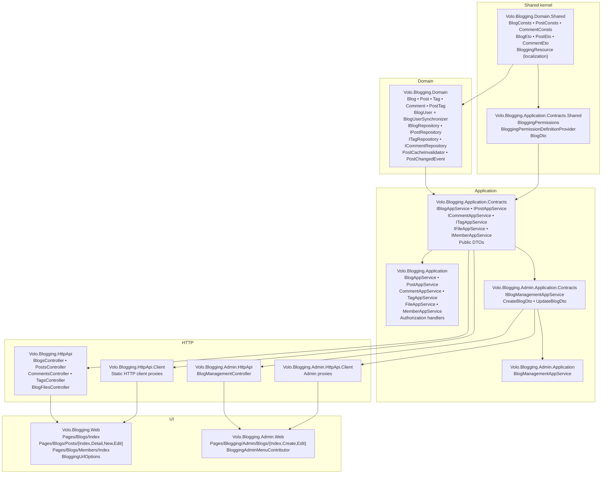

The **Blogging module** (`Volo.Blogging.*`) is a self-contained, opinionated blogging engine that ships with ABP Commercial. It models classic blog concepts — **multiple blogs**, **posts** with cover image and tags, **threaded comments**, **per-author profile pages**, **popular tags** — and exposes them through:

- A full domain layer (`Blog`, `Post`, `Tag`, `Comment`, `BlogUser` aggregate roots, repositories, and a `BlogUserSynchronizer` distributed event handler).
- An application layer split into a **public** surface (`IPostAppService`, `IBlogAppService`, `ICommentAppService`, `ITagAppService`, `IFileAppService`, `IMemberAppService`) and an **admin** surface (`IBlogManagementAppService`).
- REST controllers under `api/blogging/*` and `api/blogging/blogs/admin/*`.
- A complete Razor Pages UI mounted under the configurable `/blog` route, plus an admin UI mounted under `/Blogging/Admin/Blogs`.

<Warning>
This is the **legacy / standalone Blogging module** (`Volo.Blogging`, root namespace `Volo.Blogging`). It predates and is **distinct from** the blogs feature inside the [CMS Kit module](/modules/cms-kit/overview), which lives under `Volo.CmsKit.*` and is documented at [/modules/cms-kit/blogs](/modules/cms-kit/blogs).

If you are starting a new application today, prefer [CMS Kit Blogs](/modules/cms-kit/blogs) — it integrates with the rest of CMS Kit (comments, reactions, tags, ratings, pages, menus, global resources) and is the actively-evolving option. The Blogging module described here remains supported for existing applications and for scenarios where a fully self-contained, multi-blog engine with its own author profile pages is preferred.
</Warning>

## What's in the box

<CardGroup cols={2}>
  <Card title="Domain layer" icon="cube" href="/modules/blogging/domain">
    `Blog`, `Post`, `Tag`, `Comment`, `BlogUser` aggregate roots. `IBlogRepository`, `IPostRepository`, `ITagRepository`, `ICommentRepository`, `IBlogUserRepository`. `BlogUserSynchronizer`, `PostCacheInvalidator`, `PostChangedEvent`.
  </Card>
  <Card title="Application layer" icon="layer-group" href="/modules/blogging/application">
    Public `PostAppService` / `BlogAppService` / `CommentAppService` / `TagAppService` / `FileAppService` / `MemberAppService`. Admin `BlogManagementAppService` with permission-protected create/update/delete and cache-clearing.
  </Card>
  <Card title="HTTP API" icon="cloud" href="/modules/blogging/http-api">
    `BlogsController`, `PostsController`, `CommentsController`, `TagsController`, `BlogFilesController` under `api/blogging/*`. `BlogManagementController` under `api/blogging/blogs/admin`. Static and dynamic HTTP client proxies.
  </Card>
  <Card title="Web & Admin UI" icon="window" href="/modules/blogging/web-and-admin">
    End-user `/blog`, `/blog/{shortName}`, `/blog/{shortName}/{postUrl}`, `/blog/members/{userName}` pages. Admin Razor Pages under `/Blogging/Admin/Blogs` (list / create / edit) wired into the Administration menu.
  </Card>
</CardGroup>

<Info>
Looking for the per-page service catalogue, list of permissions, or DTO shapes? Each layer page below documents the real source — namespaces, file paths, method signatures, route templates and permission constants are pulled directly from `modules/blogging/src/*`.
</Info>

## Layered structure



The layout follows the canonical ABP layered-module shape: a `Domain.Shared` kernel (constants, ETOs, localization, permission names), a `Domain` layer with aggregate roots and repository interfaces, an `Application.Contracts` layer with DTOs and `IXxxAppService` interfaces, an `Application` layer with the concrete services, then `HttpApi` controllers and Razor Pages UI on top. The `Admin.*` packages parallel the public packages and live alongside them.

## Package map

```text modules/blogging/src/
Volo.Blogging.Domain.Shared/
  Volo/Blogging/Blogs/BlogConsts.cs
  Volo/Blogging/Blogs/BlogEto.cs
  Volo/Blogging/Comments/CommentConsts.cs
  Volo/Blogging/Comments/CommentEto.cs
  Volo/Blogging/Posts/PostConsts.cs
  Volo/Blogging/Posts/PostEto.cs
  Volo/Blogging/Tagging/*.cs
  Volo/Blogging/Users/*.cs
  Volo/Blogging/Localization/BloggingResource.cs
  Volo/Blogging/Localization/Resources/*.json
Volo.Blogging.Domain/
  Volo/Blogging/Blogs/{Blog, IBlogRepository}.cs
  Volo/Blogging/Posts/{Post, PostTag, IPostRepository,
                       PostCacheItem, PostCacheInvalidator,
                       PostChangedEvent}.cs
  Volo/Blogging/Comments/{Comment, ICommentRepository}.cs
  Volo/Blogging/Tagging/{Tag, ITagRepository}.cs
  Volo/Blogging/Users/{BlogUser, IBlogUserRepository,
                       IBlogUserLookupService,
                       BlogUserLookupService,
                       BlogUserSynchronizer}.cs
Volo.Blogging.Application.Contracts.Shared/
  Volo/Blogging/BloggingPermissions.cs
  Volo/Blogging/BloggingPermissionDefinitionProvider.cs
  Volo/Blogging/Blogs/Dtos/BlogDto.cs
Volo.Blogging.Application.Contracts/
  Volo/Blogging/Blogs/IBlogAppService.cs
  Volo/Blogging/Posts/IPostAppService.cs
  Volo/Blogging/Posts/{CreatePostDto, UpdatePostDto,
                       PostWithDetailsDto, GetPostInput,
                       BlogUserDto}.cs
  Volo/Blogging/Comments/ICommentAppService.cs
  Volo/Blogging/Comments/Dtos/{Create,Update,
                               CommentWithDetails,
                               CommentWithReplies}Dto.cs
  Volo/Blogging/Tagging/ITagAppService.cs
  Volo/Blogging/Tagging/Dtos/*.cs
  Volo/Blogging/Files/IFileAppService.cs
  Volo/Blogging/Members/IMemberAppService.cs
Volo.Blogging.Application/
  Volo/Blogging/Blogs/BlogAppService.cs
  Volo/Blogging/Posts/{PostAppService, PostAuthorizationHandler}.cs
  Volo/Blogging/Comments/{CommentAppService, CommentAuthorizationHandler}.cs
  Volo/Blogging/Tagging/TagAppService.cs
  Volo/Blogging/Files/FileAppService.cs
  Volo/Blogging/Members/MemberAppService.cs
Volo.Blogging.Admin.Application.Contracts/
  Volo/Blogging/Admin/Blogs/{IBlogManagementAppService,
                             CreateBlogDto, UpdateBlogDto}.cs
Volo.Blogging.Admin.Application/
  Volo/Blogging/Admin/Blogs/BlogManagementAppService.cs
Volo.Blogging.HttpApi/
  Volo/Blogging/{Blogs,Posts,Comments,Tags,BlogFiles}Controller.cs
Volo.Blogging.HttpApi.Client/
  Volo/Blogging/BloggingHttpApiClientModule.cs
Volo.Blogging.Admin.HttpApi/
  Volo/Blogging/Admin/BlogManagementController.cs
Volo.Blogging.Admin.HttpApi.Client/
  Volo/Blogging/Admin/BloggingAdminHttpApiClientModule.cs
Volo.Blogging.Web/
  Pages/Blogs/{Index, Members/Index, Posts/{Index,Detail,New,Edit}}.cshtml(.cs)
  BloggingUrlOptions.cs
  BloggingRouteConstraint.cs
Volo.Blogging.Admin.Web/
  Pages/Blogging/Admin/Blogs/{Index,Create,Edit}.cshtml(.cs)
  Navigation/BloggingAdminMenuContributor.cs
Volo.Blogging.EntityFrameworkCore/
  EF Core mappings + repository implementations
Volo.Blogging.MongoDB/
  MongoDB collection mappings + repositories
Volo.Blogging.Installer/
  Installer package for ABP CLI / Suite
```

## Key concepts

### Multi-blog by default

Every `Post`, `Tag` and `Comment` is rooted at a `Blog` aggregate (`Blog : FullAuditedAggregateRoot<Guid>`) identified by a `Guid` **Id** and addressed by a unique `ShortName`. The Razor Pages UI inspects `BloggingUrlOptions.SingleBlogMode` and `IBlogAppService.GetListAsync()`:

- If `SingleBlogMode.Enabled` is `true` — or only one blog exists — `Pages/Blogs/Index` redirects straight to `Pages/Blogs/Posts/Index` and posts live under `/blog/{postUrl}`.
- Otherwise the index lists blogs and posts live under `/blog/{blogShortName}/{postUrl}`.

This is enforced through route conventions registered in `BloggingWebModule.ConfigureServices`:

```csharp Volo.Blogging.Web/BloggingWebModule.cs
Configure<RazorPagesOptions>(options =>
{
    var urlOptions = context.Services
        .GetRequiredServiceLazy<IOptions<BloggingUrlOptions>>()
        .Value.Value;

    var routePrefix = urlOptions.RoutePrefix;

    if (urlOptions.SingleBlogMode.Enabled)
    {
        options.Conventions.AddPageRoute("/Blogs/Posts/Index", routePrefix);
        options.Conventions.AddPageRoute("/Blogs/Posts/Detail", routePrefix + "{postUrl}");
        options.Conventions.AddPageRoute("/Blogs/Posts/Edit",   routePrefix + "posts/{postId}/edit");
        options.Conventions.AddPageRoute("/Blogs/Posts/New",    routePrefix + "posts/new");
    }
    else
    {
        if (!routePrefix.IsNullOrWhiteSpace())
        {
            options.Conventions.AddPageRoute("/Blogs/Index", routePrefix);
        }
        options.Conventions.AddPageRoute("/Blogs/Posts/Index",  routePrefix + "{blogShortName:blogNameConstraint}");
        options.Conventions.AddPageRoute("/Blogs/Posts/Detail", routePrefix + "{blogShortName:blogNameConstraint}/{postUrl}");
        options.Conventions.AddPageRoute("/Blogs/Posts/Edit",   routePrefix + "{blogShortName}/posts/{postId}/edit");
        options.Conventions.AddPageRoute("/Blogs/Posts/New",    routePrefix + "{blogShortName}/posts/new");
    }

    options.Conventions.AddPageRoute("/Blogs/Members/Index", routePrefix + "members/{userName}");
});
```

### Mirrored user store

Blogging stores its own `BlogUser` projection of the host's identity. `BlogUser` implements `IUser` and `IUpdateUserData`, and `BlogUserSynchronizer` listens for `EntityUpdatedEto<UserEto>` distributed events to keep the projection in sync. See [Domain layer → Users](/modules/blogging/domain#blog-users-and-synchronizer).

### Post cache

`PostAppService` caches the per-blog post list in `IDistributedCache<List<PostCacheItem>>`. `PostCacheInvalidator` subscribes to the local `PostChangedEvent` so any insert/update/delete clears the bucket for the affected `BlogId`. The admin `BlogManagementAppService.ClearCacheAsync(id)` can also evict it manually (permission `Blogging.Blog.ClearCache`).

### Permissions

Defined in `Volo.Blogging.Application.Contracts.Shared/Volo/Blogging/BloggingPermissions.cs` and registered by `BloggingPermissionDefinitionProvider`:

| Constant | Value |
| --- | --- |
| `BloggingPermissions.GroupName` | `Blogging` |
| `BloggingPermissions.Blogs.Default` | `Blogging.Blog` |
| `BloggingPermissions.Blogs.Management` | `Blogging.Blog.Management` |
| `BloggingPermissions.Blogs.Create` | `Blogging.Blog.Create` |
| `BloggingPermissions.Blogs.Update` | `Blogging.Blog.Update` |
| `BloggingPermissions.Blogs.Delete` | `Blogging.Blog.Delete` |
| `BloggingPermissions.Blogs.ClearCache` | `Blogging.Blog.ClearCache` |
| `BloggingPermissions.Posts.Create/Update/Delete` | `Blogging.Post.Create` / `.Update` / `.Delete` |
| `BloggingPermissions.Tags.Create/Update/Delete` | `Blogging.Tag.Create` / `.Update` / `.Delete` |
| `BloggingPermissions.Comments.Create/Update/Delete` | `Blogging.Comment.Create` / `.Update` / `.Delete` |

The admin menu (`BloggingAdminMenuContributor`) requires `Blogging.Blog.Management`; `BlogManagementAppService` decorates each write method with the matching child permission.

## Remote service identity

The public and admin HTTP surfaces register under two different remote-service names so a host can mount them in separate Swagger documents or expose only one of them:

```csharp Volo.Blogging.Application.Contracts/Volo/Blogging/BloggingRemoteServiceConsts.cs
namespace Volo.Blogging
{
    public static class BloggingRemoteServiceConsts
    {
        public const string RemoteServiceName = "Blogging";
        public const string ModuleName        = "blogging";
    }
}
```

```csharp Volo.Blogging.Admin.Application.Contracts/Volo/Blogging/Admin/BloggingAdminRemoteServiceConsts.cs
namespace Volo.Blogging.Admin
{
    public static class BloggingAdminRemoteServiceConsts
    {
        public const string RemoteServiceName = "BloggingAdmin";
        public const string ModuleName        = "bloggingAdmin";
    }
}
```

Both HTTP API client modules call `AddStaticHttpClientProxies(...)` against their respective `*.Application.Contracts` assembly, so the same `IPostAppService` / `IBlogManagementAppService` interfaces work transparently in monolith, BFF and tiered deployments.

## Persistence providers

Two persistence providers ship in the box and implement the repository interfaces declared in `Volo.Blogging.Domain`:

- **`Volo.Blogging.EntityFrameworkCore`** – `BloggingDbContext` with `DbSet<Blog>`, `DbSet<Post>`, `DbSet<PostTag>`, `DbSet<Tag>`, `DbSet<Comment>`, `DbSet<BlogUser>`. Table prefix and schema come from `AbpBloggingDbProperties.DbTablePrefix` / `DbSchema`.
- **`Volo.Blogging.MongoDB`** – `BloggingMongoDbContext` mapping each aggregate to a collection.

Either provider is registered through the standard `DependsOn` chain in the host module.

## When to use Blogging vs CMS Kit Blogs

<CardGroup cols={2}>
  <Card title="Pick the Blogging module" icon="newspaper">
    - You want a **dedicated** blogging app — multi-blog, with author profiles, popular tags, comment threading and a complete pre-built UI.
    - You want a self-contained admin (`/Blogging/Admin/Blogs`) that doesn't pull in the whole CMS Kit feature surface.
    - You need the `BlogUserSynchronizer`-based author projection and member profile pages out of the box.
  </Card>
  <Card title="Pick CMS Kit Blogs" icon="grid-2" href="/modules/cms-kit/blogs">
    - You already use [CMS Kit](/modules/cms-kit/overview) for pages, menus, comments, reactions, ratings, tags or global resources — the [CMS Kit Blogs feature](/modules/cms-kit/blogs) plugs into those shared services.
    - You want blogs to participate in the CMS Kit global feature toggles, URL forwarding and the unified CMS admin UI.
    - You are starting a new application and don't need the Blogging module's specific multi-blog member-profile UX.
  </Card>
</CardGroup>

<Info>
The two modules can technically coexist in the same host (their namespaces, EF/Mongo prefixes, route prefixes, controller areas and permission groups don't collide), but they don't share data. A `Post` written through `IPostAppService` (Blogging) is not visible through CMS Kit's `IBlogPostAdminAppService`, and vice versa.
</Info>

## Where to go next

<CardGroup cols={2}>
  <Card title="Domain layer" icon="cube" href="/modules/blogging/domain">
    Aggregate roots, repositories, the `BlogUser` projection and the post-cache invalidation flow.
  </Card>
  <Card title="Application layer" icon="layer-group" href="/modules/blogging/application">
    Public + admin app services, the permission map, the `PostAuthorizationHandler` and `CommentAuthorizationHandler`.
  </Card>
  <Card title="HTTP API" icon="cloud" href="/modules/blogging/http-api">
    Every route under `api/blogging/*` and `api/blogging/blogs/admin/*`, plus the static HTTP client proxy setup.
  </Card>
  <Card title="Web & Admin UI" icon="window" href="/modules/blogging/web-and-admin">
    Razor pages, URL options, the `blogNameConstraint`, and the admin pages under `/Blogging/Admin/Blogs`.
  </Card>
  <Card title="CMS Kit overview" icon="grid-2" href="/modules/cms-kit/overview">
    The recommended modern alternative for new applications.
  </Card>
  <Card title="CMS Kit Blogs" icon="newspaper" href="/modules/cms-kit/blogs">
    Side-by-side comparison: the CMS Kit blogs feature.
  </Card>
</CardGroup>
