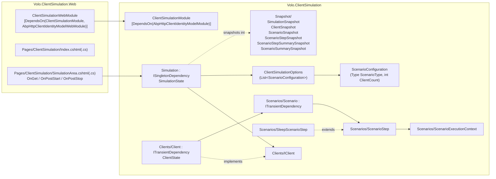
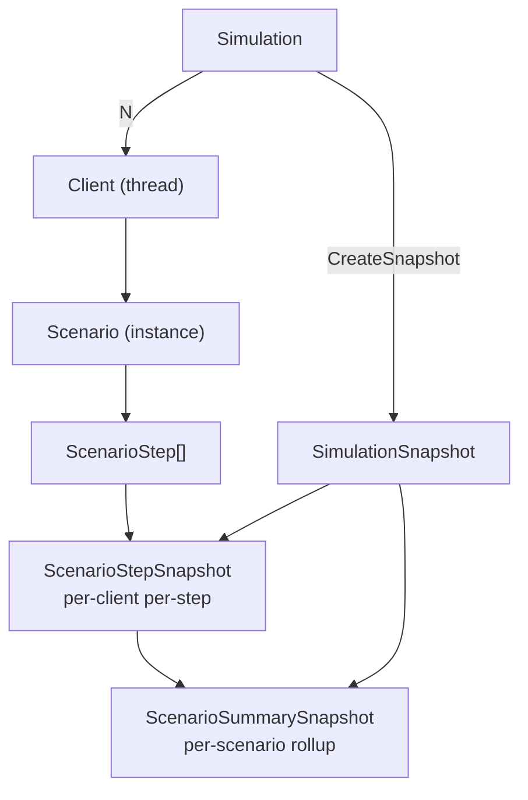

The **Client Simulation** module (`Volo.ClientSimulation`) is ABP's in-process synthetic load harness. It runs a configurable number of *clients*, each in its own `Thread`, each cycling through a *scenario* composed of *steps* (HTTP calls, sleeps, custom logic), and surfaces real-time per-step metrics — execution count, success/fail count, min/max/avg duration — through a snapshot API. A companion Razor Pages web project (`Volo.ClientSimulation.Web`) renders that snapshot as an HTML control panel with Start/Stop POST handlers.

Source: [`modules/client-simulation/src`](https://github.com/abpframework/abp/tree/dev/modules/client-simulation/src).

<Info>
**No SignalR transport.** This module is an **HTTP-only** load harness. There is no SignalR `HubConnection`, `IClientProxy`, or hub-specific step type in the codebase. Scenario steps make HTTP calls via the standard ABP HTTP client stack (the module depends on `AbpHttpClientIdentityModelModule`); a SignalR scenario would have to be a step you write yourself using `Microsoft.AspNetCore.SignalR.Client`.
</Info>

## What the module is and is not

- **It is** a synchronous thread-per-client harness that drives an arbitrary number of `IClient` instances through a `Scenario` of `ScenarioStep`s, collects per-step stats, and exposes them as a `SimulationSnapshot`.
- **It is** designed to live *in your host process* — typically a developer-tool web app — so steps can dependency-inject IdentityModel HTTP clients, `IServiceScope`-scoped services, and ABP options.
- **It is not** a distributed load generator. Clients are threads, not processes; one host = one machine's worth of throughput.
- **It is not** a benchmark micro-runner. Each step records latency via `Stopwatch`, but there are no percentiles, no histograms, and no warm-up phase — only running totals and min/max/avg.
- **It is not** a SignalR or message-broker tester. Adding such transports is your responsibility inside a custom `ScenarioStep`.

## Project layout



Every file in the diagram lives under `modules/client-simulation/src/Volo.ClientSimulation/Volo/ClientSimulation/` or `modules/client-simulation/src/Volo.ClientSimulation.Web/`.

## Configuration: ClientSimulationOptions + ScenarioConfiguration

`ClientSimulationOptions.cs` is the options object you populate in your host module's `ConfigureServices`. It just carries a list of `ScenarioConfiguration` entries — one entry per scenario type, with the number of concurrent clients to spawn.

```csharp modules/client-simulation/src/Volo.ClientSimulation/Volo/ClientSimulation/ClientSimulationOptions.cs
using System.Collections.Generic;

namespace Volo.ClientSimulation;

public class ClientSimulationOptions
{
    public List<ScenarioConfiguration> Scenarios { get; }

    public ClientSimulationOptions()
    {
        Scenarios = new List<ScenarioConfiguration>();
    }
}
```

```csharp modules/client-simulation/src/Volo.ClientSimulation/Volo/ClientSimulation/ScenarioConfiguration.cs
using System;

namespace Volo.ClientSimulation;

public class ScenarioConfiguration
{
    public Type ScenarioType { get; }

    public int ClientCount { get; }

    public ScenarioConfiguration(
        Type scenarioType,
        int clientCount = 1)
    {
        ScenarioType = scenarioType;
        ClientCount = clientCount;
    }
}
```

A host registers scenarios like this:

```csharp Host module ConfigureServices
Configure<ClientSimulationOptions>(options =>
{
    options.Scenarios.Add(new ScenarioConfiguration(typeof(MyApiScenario), clientCount: 20));
    options.Scenarios.Add(new ScenarioConfiguration(typeof(WarmCacheScenario), clientCount: 5));
});
```

The two scenario types must be DI-resolvable; because `Scenario` is `ITransientDependency`, simply having the class in a referenced assembly is enough.

## The Simulation engine

`Simulation.cs` is the root orchestrator and lives at `modules/client-simulation/src/Volo.ClientSimulation/Volo/ClientSimulation/Simulation.cs`. It is a singleton (`ISingletonDependency`) — there is exactly one of them per host.

### State machine

```csharp modules/client-simulation/src/Volo.ClientSimulation/Volo/ClientSimulation/SimulationState.cs
public enum SimulationState
{
    Stopped,
    Starting,
    Started,
    Stopping
}
```

The four-state machine prevents double starts and races between `Stop` and `Client_OnStopped` — see how the public methods guard on the current state below.

### Start

```csharp modules/client-simulation/src/Volo.ClientSimulation/Volo/ClientSimulation/Simulation.cs
public virtual void Start()
{
    lock (SyncObj)
    {
        if (State != SimulationState.Stopped)
            throw new UserFriendlyException($"Simulation should be stopped to be able to start. Current state is '{State}'.");

        State = SimulationState.Starting;
        try
        {
            DisposeResources();
            ServiceScope = ServiceScopeFactory.CreateScope();

            foreach (var scenarioConfiguration in Options.Scenarios)
            {
                for (int i = 0; i < scenarioConfiguration.ClientCount; i++)
                {
                    var scenario = (Scenario)ServiceScope.ServiceProvider.GetRequiredService(
                        scenarioConfiguration.ScenarioType);

                    var client = ServiceScope.ServiceProvider.GetRequiredService<IClient>();
                    client.Stopped += Client_OnStopped;
                    client.Initialize(scenario);
                    Clients.Add(client);
                }
            }

            foreach (var client in Clients) { client.Start(); }

            State = SimulationState.Started;
        }
        catch (Exception ex)
        {
            Logger.LogException(ex);
            State = SimulationState.Stopped;
        }
    }
}
```

A few things worth understanding here:

- **Per-`Start` `IServiceScope`**. The whole run shares a single DI scope created in `Start()` and disposed in `DisposeResources()`. Anything you register as `Scoped` in the host (HTTP clients, EF Core contexts) lives for the entire simulation run.
- **`scenarioConfiguration.ClientCount` clients per scenario type, each with its own scenario instance**. The `Scenario` class is `[ITransientDependency]`, so each `GetRequiredService` call returns a fresh one; the engine never shares mutable scenario state across clients.
- **Catastrophic failure resets state.** If any exception escapes the loop (DI failure, etc.), state goes back to `Stopped` rather than getting stuck in `Starting`.

### Stop and CreateSnapshot

```csharp modules/client-simulation/src/Volo.ClientSimulation/Volo/ClientSimulation/Simulation.cs
public virtual void Stop()
{
    lock (SyncObj)
    {
        if (State != SimulationState.Started)
            throw new UserFriendlyException($"Simulation should be started to be able to stop. Current state is '{State}'.");

        State = SimulationState.Stopping;
        foreach (var client in Clients) { client.Stop(); }
    }
}

public virtual SimulationSnapshot CreateSnapshot()
{
    SimulationSnapshot snapshot;
    lock (SyncObj)
    {
        snapshot = new SimulationSnapshot
        {
            State = State,
            Clients = Clients.Select(c => c.CreateSnapshot()).ToList()
        };
    }
    snapshot.CreateSummaries();
    return snapshot;
}
```

`Stop()` is non-blocking — it signals every client to stop and returns immediately. The actual transition to `SimulationState.Stopped` happens inside `Client_OnStopped`, once every client has observed the stop flag and exited its loop. `CreateSnapshot()` is safe to call at any state (`Stopped`, `Starting`, `Started`, `Stopping`) and is the only way the Web project polls progress.

## Clients

### IClient + ClientState

```csharp modules/client-simulation/src/Volo.ClientSimulation/Volo/ClientSimulation/Clients/IClient.cs
public interface IClient
{
    event EventHandler Stopped;

    ClientState State { get; }

    void Initialize(Scenario scenario);

    void Start();

    void Stop();

    ClientSnapshot CreateSnapshot();
}
```

```csharp modules/client-simulation/src/Volo.ClientSimulation/Volo/ClientSimulation/Clients/ClientState.cs
public enum ClientState
{
    Stopped,
    Running,
    Stopping
}
```

### Client implementation

`Client.cs` lives at `modules/client-simulation/src/Volo.ClientSimulation/Volo/ClientSimulation/Clients/Client.cs`. Each client owns one `Thread` and runs `AsyncHelper.RunSync(() => Scenario.ProceedAsync())` in a tight loop.

```csharp modules/client-simulation/src/Volo.ClientSimulation/Volo/ClientSimulation/Clients/Client.cs
public class Client : IClient, ITransientDependency
{
    public event EventHandler Stopped;

    public ClientState State {
        get => _state;
        private set => _state = value;
    }
    private volatile ClientState _state;

    protected Scenario Scenario { get; private set; }
    protected object SyncLock { get; } = new object();
    protected Thread ClientThread;

    public void Initialize(Scenario scenario)
    {
        lock (SyncLock)
        {
            if (State != ClientState.Stopped)
                throw new UserFriendlyException($"Client should be stopped to be able to initialize it. Current state is '{State}'.");
            Scenario = scenario;
        }
    }

    public void Start()
    {
        lock (SyncLock)
        {
            if (State != ClientState.Stopped)
                throw new UserFriendlyException($"Client should be stopped to be able to start it. Current state is '{State}'.");
            State = ClientState.Running;
            Scenario.Reset();
            ClientThread = new Thread(Run);
            ClientThread.Start();
        }
    }

    public void Stop()
    {
        lock (SyncLock)
        {
            if (State != ClientState.Running) return;
            State = ClientState.Stopping;
        }
    }

    public ClientSnapshot CreateSnapshot()
    {
        lock (SyncLock)
        {
            return new ClientSnapshot { State = State, Scenario = Scenario.CreateSnapshot() };
        }
    }

    private void Run()
    {
        while (true)
        {
            lock (SyncLock)
            {
                if (State != ClientState.Running)
                {
                    State = ClientState.Stopped;
                    ClientThread = null;
                    Stopped.InvokeSafely(this);
                    break;
                }
            }
            AsyncHelper.RunSync(() => Scenario.ProceedAsync());
        }
    }
}
```

Important nuances:

- **`new Thread(Run)`, not `Task.Run`.** Each client uses an OS thread; this is deliberate because the scenario steps may use `AsyncHelper.RunSync` and you do not want to starve the thread pool when scaling to hundreds of clients. Plan your `ClientCount` accordingly — every client is a thread.
- **`volatile ClientState _state`** plus the `SyncLock` around the loop check. The state can be flipped from any thread; the `volatile` guarantees visibility without a full lock when read.
- **The loop holds `SyncLock` only across the state check, not across `ProceedAsync`.** This means `CreateSnapshot` can return slightly stale (mid-step) numbers while a step is mid-flight — by design, since blocking the loop on a UI poll would be a worse trade-off.

## Scenarios and steps

### Scenario base class

```csharp modules/client-simulation/src/Volo.ClientSimulation/Volo/ClientSimulation/Scenarios/Scenario.cs
public abstract class Scenario : ITransientDependency
{
    protected List<ScenarioStep> Steps { get; }
    protected int CurrentStepIndex { get; set; }
    protected ScenarioExecutionContext ExecutionContext { get; }

    protected Scenario(IServiceProvider serviceProvider)
    {
        ExecutionContext = new ScenarioExecutionContext(serviceProvider);
        Steps = new List<ScenarioStep>();
    }

    public virtual async Task ProceedAsync()
    {
        CheckStepCount();
        await Steps[CurrentStepIndex].RunAsync(ExecutionContext);
        CurrentStepIndex++;
        if (CurrentStepIndex >= Steps.Count)
        {
            CurrentStepIndex = 0;
        }
    }

    public void Reset()
    {
        CurrentStepIndex = 0;
        foreach (var step in Steps) { step.Reset(); }
        ExecutionContext.Reset();
    }

    public ScenarioSnapshot CreateSnapshot() => new ScenarioSnapshot
    {
        DisplayText = GetDisplayText(),
        Steps = Steps.Select(s => s.CreateSnapshot()).ToList(),
        CurrentStep = CurrentStep.CreateSnapshot()
    };

    protected void AddStep(ScenarioStep step) => Steps.Add(step);

    // GetDisplayText() reads [DisplayName(...)] or falls back to "FooScenario" -> "Foo".
    // CheckStepCount() throws ApplicationException when no steps are registered.
}
```

The base class is `ITransientDependency` so every `Simulation.Start()` resolves fresh scenario instances per client. `ProceedAsync` is the per-loop tick: run the current step, then advance (wrapping to step 0 at the end). The full source — including `CheckStepCount`, `CurrentStep`, `GetDisplayText`, and the `[DisplayName]` attribute parsing — is in [`Scenarios/Scenario.cs`](https://github.com/abpframework/abp/blob/dev/modules/client-simulation/src/Volo.ClientSimulation/Volo/ClientSimulation/Scenarios/Scenario.cs).

Implementation pattern for a custom scenario:

```csharp Example custom scenario
[DisplayName("Browse + checkout API")]
public class CheckoutScenario : Scenario
{
    public CheckoutScenario(IServiceProvider sp) : base(sp)
    {
        AddStep(new SleepScenarioStep("Ramp-up", duration: 500));
        AddStep(new ListProductsStep());
        AddStep(new AddToCartStep());
        AddStep(new CheckoutStep());
    }
}
```

You typically declare 1–N custom `ScenarioStep` subclasses for the HTTP calls and one `SleepScenarioStep` for the "user think time" between them.

### ScenarioStep base class

`ScenarioStep.cs` wraps every call with a `Stopwatch` and maintains per-step metrics. Failures are caught and counted, never propagated up to the loop.

```csharp modules/client-simulation/src/Volo.ClientSimulation/Volo/ClientSimulation/Scenarios/ScenarioStep.cs
public abstract class ScenarioStep
{
    protected int ExecutionCount;
    protected int SuccessCount;
    protected int FailCount;
    protected double TotalExecutionDuration;
    protected double MinExecutionDuration;
    protected double MaxExecutionDuration;
    protected double LastExecutionDuration;

    public async Task RunAsync(ScenarioExecutionContext context)
    {
        await BeforeExecuteAsync(context);

        var stopwatch = Stopwatch.StartNew();

        try
        {
            await ExecuteAsync(context);

            SuccessCount++;

            LastExecutionDuration = stopwatch.Elapsed.TotalMilliseconds;

            TotalExecutionDuration += LastExecutionDuration;

            if (MinExecutionDuration > LastExecutionDuration)
            {
                MinExecutionDuration = LastExecutionDuration;
            }

            if (MaxExecutionDuration < LastExecutionDuration)
            {
                MaxExecutionDuration = LastExecutionDuration;
            }
        }
        catch (Exception ex)
        {
            FailCount++;

            context
                .ServiceProvider
                .GetService<ILogger<ScenarioStep>>()
                .LogException(ex);
        }
        finally
        {
            stopwatch.Stop();

            ExecutionCount++;
        }

        await AfterExecuteAsync(context);
    }

    protected virtual Task BeforeExecuteAsync(ScenarioExecutionContext context) => Task.CompletedTask;

    protected abstract Task ExecuteAsync(ScenarioExecutionContext context);

    protected virtual Task AfterExecuteAsync(ScenarioExecutionContext context) => Task.CompletedTask;
}
```

Three hooks (`BeforeExecuteAsync`, `ExecuteAsync`, `AfterExecuteAsync`) let you split "auth header refresh" from "actual HTTP call" from "verify response" without rolling separate steps.

### Built-in SleepScenarioStep

```csharp modules/client-simulation/src/Volo.ClientSimulation/Volo/ClientSimulation/Scenarios/SleepScenarioStep.cs
public class SleepScenarioStep : ScenarioStep
{
    public string Name { get; }

    public int Duration { get; }

    public SleepScenarioStep(
        string name,
        int duration = 1000)
    {
        Name = name;
        Duration = duration;
    }

    protected override Task ExecuteAsync(ScenarioExecutionContext context)
    {
        return Task.Delay(Duration);
    }

    public override string GetDisplayText()
    {
        return base.GetDisplayText() + $" ({Name})";
    }
}
```

The only step type shipped in-box. Custom steps invariably use [HTTP clients](/http/overview) — typically the IdentityModel-enabled flavour pulled in via the `ClientSimulationModule`'s `[DependsOn(typeof(AbpHttpClientIdentityModelModule))]`.

### ScenarioExecutionContext

```csharp modules/client-simulation/src/Volo.ClientSimulation/Volo/ClientSimulation/Scenarios/ScenarioExecutionContext.cs
public class ScenarioExecutionContext
{
    public IServiceProvider ServiceProvider { get; }

    public Dictionary<string, object> Properties { get; }

    public ScenarioExecutionContext(IServiceProvider serviceProvider)
    {
        ServiceProvider = serviceProvider;
        Properties = new Dictionary<string, object>();
    }

    public virtual void Reset()
    {
        Properties.Clear();
    }
}
```

The context is the *per-scenario, per-client* state bag. `ExecuteAsync` writes things like `context.Properties["cartId"] = ...` so subsequent steps can read them. The dictionary is cleared on every `Scenario.Reset()` call (i.e. every `Start`).

## Snapshots and aggregation

`SimulationSnapshot.cs` is the wire-shape returned by `Simulation.CreateSnapshot()`. The `Web` project deserialises this in the SimulationArea page.

```csharp modules/client-simulation/src/Volo.ClientSimulation/Volo/ClientSimulation/Snapshot/SimulationSnapshot.cs
[Serializable]
public class SimulationSnapshot
{
    public SimulationState State { get; set; }

    public List<ClientSnapshot> Clients { get; set; }

    public List<ScenarioSummarySnapshot> Scenarios { get; set; }

    public void CreateSummaries()
    {
        // groups every step across every client by Scenario.DisplayText + Step.DisplayText,
        // sums ExecutionCount / SuccessCount / FailCount / TotalExecutionDuration,
        // tracks min/max, and recomputes Avg = Total/Success.
    }
}
```

The summary computation deliberately rolls up *across all clients of the same scenario* — so 50 clients of the same scenario give you one row per step, with execution counts summed across the whole fleet.



The hierarchy is what the UI uses to render two tables: one showing every client's progress, and one with the per-scenario summary.

## Module wiring

```csharp modules/client-simulation/src/Volo.ClientSimulation/Volo/ClientSimulation/ClientSimulationModule.cs
using Volo.Abp.Http.Client.IdentityModel;
using Volo.Abp.Modularity;

namespace Volo.ClientSimulation;

[DependsOn(
    typeof(AbpHttpClientIdentityModelModule)
    )]
public class ClientSimulationModule : AbpModule
{

}
```

The single dependency on `AbpHttpClientIdentityModelModule` means OAuth-bearer-token HTTP clients are available out of the box — you typically register a typed `HttpApi.Client` proxy in your host and inject it into steps.

## Web project: Razor Pages control panel

`Volo.ClientSimulation.Web/` ships a two-page admin UI:

- `Pages/ClientSimulation/Index.cshtml(.cs)` — the wrapper page (its `OnGetAsync` just returns `Page()`).
- `Pages/ClientSimulation/SimulationArea.cshtml(.cs)` — the polled "live" area with start/stop POST handlers.

```csharp modules/client-simulation/src/Volo.ClientSimulation.Web/Pages/ClientSimulation/SimulationArea.cshtml.cs
public class SimulationAreaModel : PageModel
{
    public SimulationSnapshot Snapshot { get; private set; }

    protected Simulation Simulation { get; }

    public SimulationAreaModel(Simulation simulation)
    {
        Simulation = simulation;
    }

    public virtual Task<IActionResult> OnGetAsync()
    {
        Snapshot = Simulation.CreateSnapshot();
        return Task.FromResult<IActionResult>(Page());
    }

    public virtual async Task<IActionResult> OnPostStartAsync()
    {
        Simulation.Start();
        return new NoContentResult();
    }

    public virtual async Task<IActionResult> OnPostStopAsync()
    {
        Simulation.Stop();
        return new NoContentResult();
    }
}
```

```csharp modules/client-simulation/src/Volo.ClientSimulation.Web/ClientSimulationWebModule.cs
[DependsOn(
    typeof(ClientSimulationModule),
    typeof(AbpHttpClientIdentityModelWebModule),
    typeof(AbpAspNetCoreMvcUiThemeSharedModule)
    )]
public class ClientSimulationWebModule : AbpModule
{
    public override void ConfigureServices(ServiceConfigurationContext context)
    {
        Configure<AbpVirtualFileSystemOptions>(options =>
        {
            options.FileSets.AddEmbedded<ClientSimulationWebModule>("Volo.ClientSimulation");
        });
    }
}
```

The Web module pulls the core simulation, the IdentityModel HTTP client *Web* variant (which uses cookies / authentication state), and the shared MVC UI theme so the Razor pages render inside whatever theme the host runs.

## End-to-end request flow

```mermaid
sequenceDiagram
    actor Op as Operator (browser)
    participant SAM as SimulationAreaModel
    participant Sim as Simulation
    participant CL as Client (thread)
    participant SC as Scenario
    participant ST as ScenarioStep

    Op->>SAM: POST /ClientSimulation/SimulationArea?handler=Start
    SAM->>Sim: Start()
    Sim->>CL: Initialize(scenario); Start()
    activate CL
    CL->>SC: Reset()
    loop while Running
        CL->>SC: ProceedAsync()
        SC->>ST: RunAsync(ctx)
        ST-->>SC: metrics updated
    end
    deactivate CL

    Op->>SAM: GET /ClientSimulation/SimulationArea
    SAM->>Sim: CreateSnapshot()
    Sim-->>SAM: SimulationSnapshot (Clients + Scenarios)
    SAM-->>Op: HTML metrics table

    Op->>SAM: POST /ClientSimulation/SimulationArea?handler=Stop
    SAM->>Sim: Stop()
    Sim->>CL: state = Stopping
    CL-->>Sim: Stopped event
    Sim-->>Sim: state = Stopped (when all clients stopped)
```

## Operational notes

- **Threads, not tasks.** Each client owns a `Thread`. 200 clients = 200 threads. For very large client counts you are bottlenecked by thread-pool / OS scheduling — switch to a multi-process harness instead.
- **Stop is asynchronous.** Calling `Simulation.Stop()` *signals* every client to stop; the transition to `SimulationState.Stopped` happens after the last `Client_OnStopped` event fires. If you start a fresh run too quickly you'll get the "should be stopped to be able to start" `UserFriendlyException`.
- **Failures are absorbed.** Every step's `try/catch` logs and counts failures via `FailCount`, then continues. There is no circuit breaker — a misbehaving step keeps firing until you `Stop`.
- **No persistence.** Snapshots are computed on each call and not stored. If you need historical traces, scrape `CreateSnapshot()` from a background hosted service into your metrics store.
- **Authentication.** Steps usually inject the IdentityModel `HttpClient` registered by `AbpHttpClientIdentityModelModule` — that handles client credentials/password grants and surfaces a bearer token your step can attach.

## Related pages

<CardGroup cols={2}>
  <Card title="HTTP module" icon="plug" href="/http/overview">
    `IHttpClientFactory`, the IdentityModel HTTP client wrapper, and the typed proxy clients you usually wire into scenario steps.
  </Card>
  <Card title="MVC module" icon="window-maximize" href="/aspnetcore/mvc-module">
    Razor Pages / `PageModel` plumbing the web project uses.
  </Card>
  <Card title="Modularity" icon="cube" href="/core/modularity">
    `[DependsOn]`, `ConfigureServices`, and how `ClientSimulationModule` slots into a host application.
  </Card>
  <Card title="Threading & async" icon="rotate" href="/core/threading-and-async">
    `AsyncHelper.RunSync` and the thread/scope model the client loop relies on.
  </Card>
</CardGroup>
