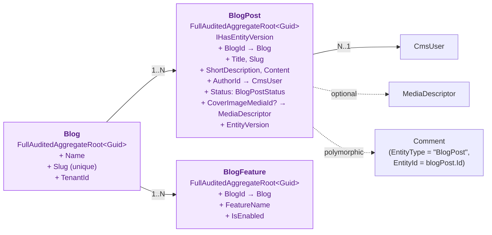
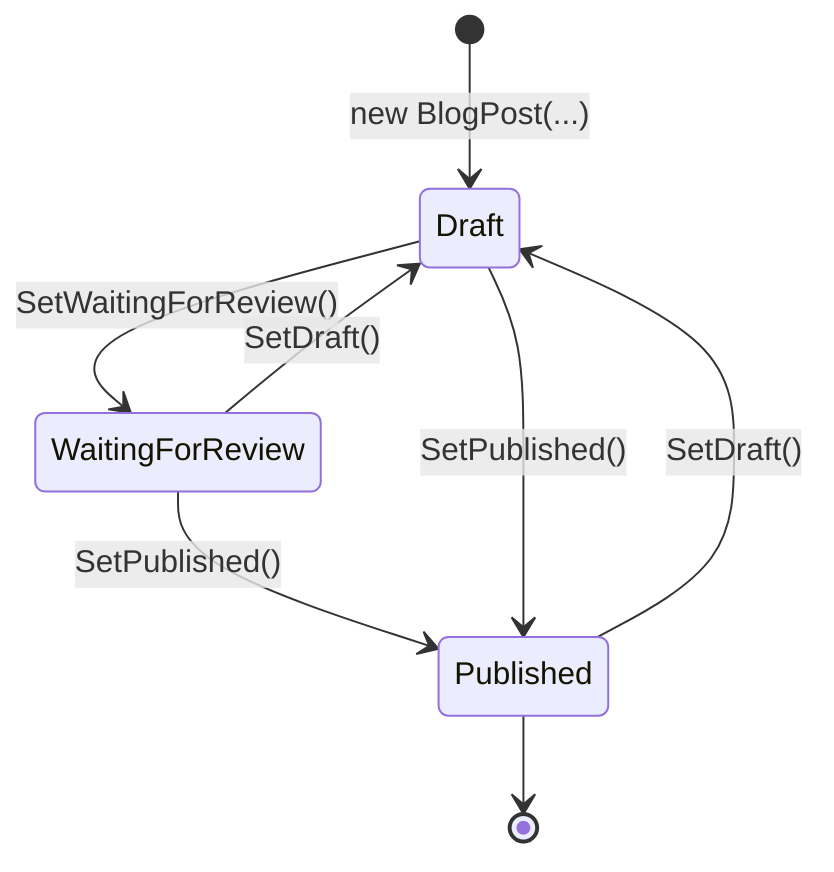

The blogs capability supports multiple independent blogs in a single host, each with its own slug, posts, authors, and per-blog feature toggles. The whole capability lives under [`modules/cms-kit/src/Volo.CmsKit.Domain/Volo/CmsKit/Blogs/`](https://github.com/abpframework/abp/tree/dev/modules/cms-kit/src/Volo.CmsKit.Domain/Volo/CmsKit/Blogs).

## Folder contents

```
Blogs/
├── Blog.cs                              # aggregate root: Name, Slug
├── BlogPost.cs                          # aggregate root: Title, Slug, Content, Status, AuthorId
├── BlogFeature.cs                       # per-blog feature toggle row
├── BlogManager.cs                       # creates/updates Blog, slug check
├── BlogPostManager.cs                   # creates BlogPost, cascades delete to comments
├── BlogFeatureManager.cs                # toggle features on a blog
├── BlogFeatureDataSeedContributor.cs    # seeds default features for a new blog
├── DefaultBlogFeatureProvider.cs        # registers built-in features
├── IBlogRepository.cs
├── IBlogPostRepository.cs
├── IBlogFeatureRepository.cs
├── IDefaultBlogFeatureProvider.cs
├── BlogSlugAlreadyExistException.cs
├── BlogPostSlugAlreadyExistException.cs
└── BlogWithBlogPostCount.cs             # query result: Blog + post count
```

## Domain model



A `BlogPost` belongs to exactly one `Blog` (via `BlogId`). Comments, tags, ratings, and reactions are *polymorphic* — they reference blog posts by the string `("BlogPost", blogPostId.ToString())` rather than a foreign key.

## `Blog` aggregate

```csharp
// modules/cms-kit/src/Volo.CmsKit.Domain/Volo/CmsKit/Blogs/Blog.cs
public class Blog : FullAuditedAggregateRoot<Guid>, IMultiTenant
{
    [NotNull] public virtual string Name { get; protected set; }
    [NotNull] public virtual string Slug { get; protected set; }
    public virtual Guid? TenantId { get; protected set; }

    protected Blog() { }

    protected internal Blog(
        Guid id,
        [NotNull] string name,
        [NotNull] string slug,
        [CanBeNull] Guid? tenantId = null) : base(id)
    {
        SetName(name);
        SetSlug(slug);
        TenantId = tenantId;
    }

    public virtual void SetName(string name)
    {
        Name = Check.NotNullOrWhiteSpace(name, nameof(name), BlogConsts.MaxNameLength);
    }

    public virtual void SetSlug(string slug)
    {
        Check.NotNullOrWhiteSpace(slug, nameof(slug), BlogConsts.MaxNameLength);
        Slug = SlugNormalizer.Normalize(slug);
    }
}
```

Three notes:

1. The constructor is `protected internal` so callers must go through `BlogManager.CreateAsync`. This is how slug uniqueness is enforced — there is no way to construct a `Blog` outside the domain service that does the check.
2. `SetSlug` runs the input through [`SlugNormalizer`](/modules/cms-kit/domain#slugnormalizer), which transliterates unicode and trims slashes. So `"Über Awesome / Blog"` becomes `"uber-awesome/blog"`.
3. The whole aggregate is `IMultiTenant`, so blogs are isolated per tenant.

## `BlogPost` aggregate

```csharp
// modules/cms-kit/src/Volo.CmsKit.Domain/Volo/CmsKit/Blogs/BlogPost.cs
public class BlogPost : FullAuditedAggregateRoot<Guid>, IMultiTenant, IHasEntityVersion
{
    public virtual Guid BlogId { get; protected set; }
    [NotNull] public virtual string Title { get; protected set; }
    [NotNull] public virtual string Slug { get; protected set; }
    [NotNull] public virtual string ShortDescription { get; protected set; }
    public virtual string Content { get; protected set; }
    public Guid? CoverImageMediaId { get; set; }
    public virtual Guid? TenantId { get; protected set; }
    public Guid AuthorId { get; set; }
    public virtual CmsUser Author { get; set; }
    public virtual BlogPostStatus Status { get; set; }
    public virtual int EntityVersion { get; protected set; }

    internal BlogPost(
        Guid id,
        Guid blogId,
        Guid authorId,
        [NotNull] string title,
        [NotNull] string slug,
        [CanBeNull] string shortDescription = null,
        [CanBeNull] string content = null,
        [CanBeNull] Guid? coverImageMediaId = null,
        [CanBeNull] Guid? tenantId = null,
        [CanBeNull] BlogPostStatus? state = null) : base(id)
    {
        TenantId = tenantId;
        SetBlogId(blogId);
        AuthorId = authorId;
        SetTitle(title);
        SetSlug(slug);
        SetShortDescription(shortDescription);
        SetContent(content);
        CoverImageMediaId = coverImageMediaId;
        Status = state ?? BlogPostStatus.Draft;
    }

    public virtual void SetDraft()            => Status = BlogPostStatus.Draft;
    public virtual void SetPublished()        => Status = BlogPostStatus.Published;
    public virtual void SetWaitingForReview() => Status = BlogPostStatus.WaitingForReview;
}
```

### Status lifecycle



`BlogPostStatus` is an enum in `Volo.CmsKit.Domain.Shared` with the values `Draft = 0`, `Published = 1`, `WaitingForReview = 2`. There is no validation on transitions — any state can move to any other. The public `BlogPostPublicAppService` only returns `Published` posts; drafts and review-pending posts are admin-only.

### `IHasEntityVersion`

`BlogPost` implements `IHasEntityVersion`, an ABP interface that bumps `EntityVersion` on every save. Combined with the [Multi-lingual objects](/localization/multi-lingual-objects) pattern, this lets translation tables track which post version they correspond to and detect "the original was edited since I translated it".

### Setter validation

Every `Set…` method runs through `Volo.Abp.Check`:

```csharp
public virtual void SetTitle(string title)
{
    Title = Check.NotNullOrWhiteSpace(title, nameof(title), BlogPostConsts.MaxTitleLength);
}

internal void SetSlug(string slug)
{
    Check.NotNullOrWhiteSpace(slug, nameof(slug), BlogPostConsts.MaxSlugLength, BlogPostConsts.MinSlugLength);
    Slug = SlugNormalizer.Normalize(slug);
}

public virtual void SetShortDescription(string shortDescription)
{
    ShortDescription = Check.Length(shortDescription, nameof(shortDescription), BlogPostConsts.MaxShortDescriptionLength);
}

public virtual void SetContent(string content)
{
    Content = Check.Length(content, nameof(content), BlogPostConsts.MaxContentLength);
}
```

Constants come from `BlogPostConsts` in `Volo.CmsKit.Domain.Shared`. `SetSlug` is `internal` because slug changes must go through `BlogPostManager.SetSlugUrlAsync`, which checks uniqueness within the blog.

## `BlogFeature` aggregate

```csharp
// modules/cms-kit/src/Volo.CmsKit.Domain/Volo/CmsKit/Blogs/BlogFeature.cs
public class BlogFeature : FullAuditedAggregateRoot<Guid>
{
    public virtual Guid BlogId { get; protected set; }
    public virtual string FeatureName { get; protected set; }
    public virtual bool IsEnabled { get; protected internal set; }

    public BlogFeature(Guid blogId, [NotNull] string featureName, bool isEnabled = true)
    {
        BlogId = blogId;
        FeatureName = Check.NotNullOrWhiteSpace(featureName, nameof(featureName));
        IsEnabled = isEnabled;
    }
}
```

`BlogFeature` is *per-blog* — a row exists for each (blog, feature) pair. It is *not* `IMultiTenant` because the parent `Blog` already is. Built-in feature names live in `Volo.CmsKit.Blogs.BlogFeatureConstants` (e.g. `"Reactions"`, `"Comments"`, `"Tags"`, `"Ratings"`).

`DefaultBlogFeatureProvider` registers what features exist; `BlogFeatureDataSeedContributor` inserts default `BlogFeature` rows for each new blog at creation time. `BlogFeatureManager` flips individual rows.

## `BlogManager`

```csharp
// modules/cms-kit/src/Volo.CmsKit.Domain/Volo/CmsKit/Blogs/BlogManager.cs
public class BlogManager : DomainService
{
    protected IBlogRepository BlogRepository { get; }

    public BlogManager(IBlogRepository blogRepository)
    {
        BlogRepository = blogRepository;
    }

    public virtual async Task<Blog> CreateAsync([NotNull] string name, [NotNull] string slug)
    {
        await CheckSlugAsync(slug);
        return new Blog(GuidGenerator.Create(), name, slug, CurrentTenant.Id);
    }

    public virtual async Task<Blog> UpdateAsync([NotNull] Blog blog, [NotNull] string name, [NotNull] string slug)
    {
        if (slug != blog.Slug)
        {
            await CheckSlugAsync(slug);
        }
        blog.SetName(name);
        blog.SetSlug(slug);
        return blog;
    }

    protected virtual async Task CheckSlugAsync([NotNull] string slug)
    {
        if (await BlogRepository.SlugExistsAsync(slug))
        {
            throw new BlogSlugAlreadyExistException(slug);
        }
    }
}
```

A very small service — its only real job is "do not create two blogs with the same slug per tenant". `IBlogRepository.SlugExistsAsync` runs within the current tenant filter.

## `BlogPostManager`

```csharp
// modules/cms-kit/src/Volo.CmsKit.Domain/Volo/CmsKit/Blogs/BlogPostManager.cs
public class BlogPostManager : DomainService
{
    protected IBlogPostRepository BlogPostRepository { get; }
    protected IBlogRepository BlogRepository { get; }
    protected ICommentRepository CommentRepository { get; }
    protected IDefaultBlogFeatureProvider BlogFeatureProvider { get; }

    public BlogPostManager(
        IBlogPostRepository blogPostRepository,
        IBlogRepository blogRepository,
        IDefaultBlogFeatureProvider blogFeatureProvider,
        ICommentRepository commentRepository)
    {
        BlogPostRepository = blogPostRepository;
        BlogRepository = blogRepository;
        BlogFeatureProvider = blogFeatureProvider;
        CommentRepository = commentRepository;
    }

    public virtual async Task<BlogPost> CreateAsync(
        [NotNull] CmsUser author,
        [NotNull] Blog blog,
        [NotNull] string title,
        [NotNull] string slug,
        [NotNull] BlogPostStatus status,
        [CanBeNull] string shortDescription = null,
        [CanBeNull] string content = null,
        [CanBeNull] Guid? coverImageMediaId = null)
    {
        Check.NotNull(author, nameof(author));
        Check.NotNull(blog, nameof(blog));
        Check.NotNullOrEmpty(title, nameof(title));
        Check.NotNullOrEmpty(slug, nameof(slug));

        var blogPost = new BlogPost(
            GuidGenerator.Create(),
            blog.Id,
            author.Id,
            title, slug,
            shortDescription, content,
            coverImageMediaId,
            CurrentTenant.Id,
            status);

        await CheckSlugExistenceAsync(blog.Id, blogPost.Slug);

        return blogPost;
    }

    public virtual async Task SetSlugUrlAsync(BlogPost blogPost, [NotNull] string newSlug)
    {
        Check.NotNullOrWhiteSpace(newSlug, nameof(newSlug));
        await CheckSlugExistenceAsync(blogPost.BlogId, newSlug);
        blogPost.SetSlug(newSlug);
    }

    public virtual async Task DeleteAsync(Guid blogId)
    {
        await BlogPostRepository.DeleteAsync(blogId);
        await CommentRepository.DeleteByEntityTypeAndIdAsync(BlogPostConsts.EntityType, blogId.ToString());
    }

    protected virtual async Task CheckSlugExistenceAsync(Guid blogId, string slug)
    {
        if (await BlogPostRepository.SlugExistsAsync(blogId, slug))
        {
            throw new BlogPostSlugAlreadyExistException(blogId, slug);
        }
    }

    protected virtual async Task CheckBlogExistenceAsync(Guid blogId)
    {
        if (!await BlogRepository.ExistsAsync(blogId))
        {
            throw new EntityNotFoundException(typeof(Blog), blogId);
        }
    }
}
```

Three responsibilities:

1. **Slug uniqueness per blog** — two posts in different blogs *can* share a slug; the check is scoped to `blogId`.
2. **Cascade delete of comments** — when a blog post is deleted, every comment referencing `("BlogPost", id)` is also removed via `CommentRepository.DeleteByEntityTypeAndIdAsync`. Tags, ratings, and reactions on the post are *not* cascaded — they are cleaned up by separate background jobs in the host.
3. **Slug rename** — `SetSlugUrlAsync` is the only way to change a post's slug after creation. It re-checks uniqueness.

## Repository contracts

`IBlogRepository` extends `IRepository<Blog, Guid>` with:

- `Task<Blog> GetBySlugAsync(string slug, CancellationToken)`
- `Task<bool> SlugExistsAsync(string slug, CancellationToken)`
- `Task<bool> ExistsAsync(Guid id, CancellationToken)`
- `Task<List<BlogWithBlogPostCount>> GetListWithBlogPostCountAsync(...)` — for admin list views

`IBlogPostRepository` extends `IRepository<BlogPost, Guid>` with:

- `Task<BlogPost> GetBySlugAsync(Guid blogId, string slug, CancellationToken)`
- `Task<bool> SlugExistsAsync(Guid blogId, string slug, CancellationToken)`
- `Task<List<BlogPost>> GetListAsync(string filter, Guid? blogId, Guid? authorId, Guid? tagId, Guid? favoriteUserId, BlogPostStatus? statusFilter, int maxResultCount, int skipCount, string sorting, CancellationToken)`
- `Task<int> GetCountAsync(string filter = null, Guid? blogId = null, Guid? tagId = null, Guid? favoriteUserId = null, BlogPostStatus? statusFilter = null, Guid? authorId = null, CancellationToken cancellationToken = default)`
- `Task DeleteAsync(Guid blogId, CancellationToken)` — bulk delete by blog

## Exceptions

```csharp
public class BlogSlugAlreadyExistException : BusinessException
{
    public BlogSlugAlreadyExistException(string slug)
        : base(CmsKitDomainErrorCodes.BlogSlugAlreadyExist)
    {
        WithData(nameof(slug), slug);
    }
}

public class BlogPostSlugAlreadyExistException : BusinessException
{
    public BlogPostSlugAlreadyExistException(Guid blogId, string slug)
        : base(CmsKitDomainErrorCodes.BlogPostSlugAlreadyExist)
    {
        WithData(nameof(blogId), blogId);
        WithData(nameof(slug), slug);
    }
}
```

Both surface as HTTP 400 with the error code in `error.code` and the slug in `error.data` — see [HTTP API](/modules/cms-kit/http-api).

## Cross-references

- Blog posts are commented on via [Comments](/modules/cms-kit/comments) (`EntityType = "BlogPost"`).
- Tagged via [Tags & Ratings](/modules/cms-kit/tags-and-ratings) (`Tag.EntityType = "BlogPost"`).
- Rated and reacted to via the same patterns.
- Cover images come from [Menus & Media](/modules/cms-kit/menus-and-media) → `MediaDescriptor`.
- Admin endpoints in [Admin Application](/modules/cms-kit/admin-application).
- Public endpoints in [Public Application](/modules/cms-kit/public-application).
- Migrating from the older [Blogging module](/modules/blogging/overview): the data model is broadly compatible (Blog/BlogPost/Comment), but CMS Kit splits everything across the Admin/Public/Common audiences and uses polymorphic tags/ratings/reactions.
- Translation: use [Multi-lingual objects](/localization/multi-lingual-objects) to translate `Title`, `ShortDescription`, `Content`. `EntityVersion` makes this safe.
