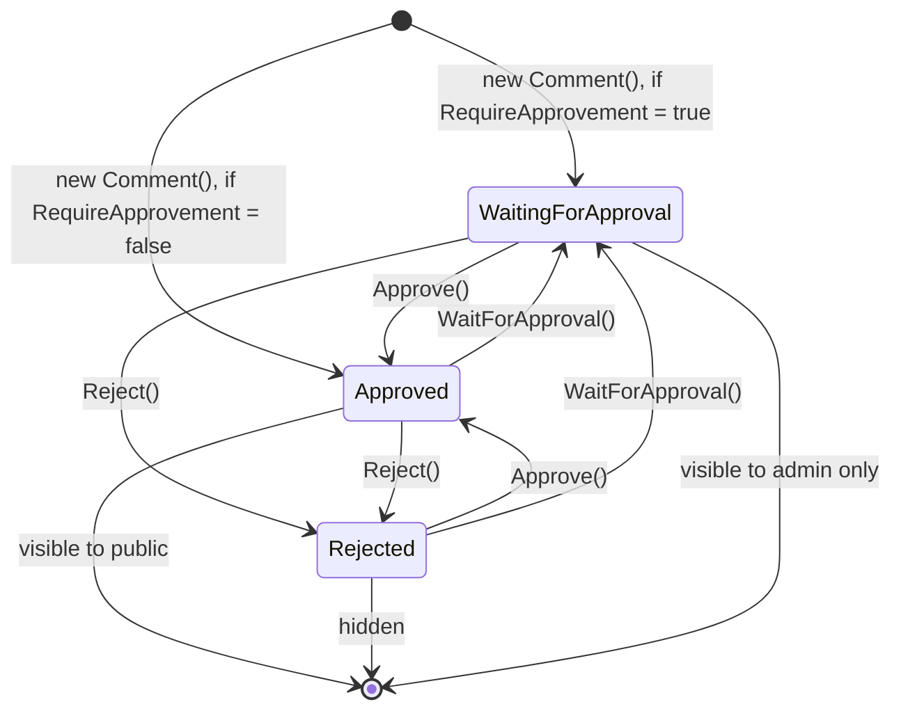

CMS Kit's commenting capability is *polymorphic*: a single `Comment` table can hold comments against any entity type your host registers — blog posts, pages, products, support tickets, anything. The whole capability lives under [`modules/cms-kit/src/Volo.CmsKit.Domain/Volo/CmsKit/Comments/`](https://github.com/abpframework/abp/tree/dev/modules/cms-kit/src/Volo.CmsKit.Domain/Volo/CmsKit/Comments).

## Folder contents

```
Comments/
├── Comment.cs                                  # aggregate root
├── CommentManager.cs                           # domain service
├── ICommentRepository.cs
├── ICommentEntityTypeDefinitionStore.cs        # which types can be commented
├── DefaultCommentEntityTypeDefinitionStore.cs
├── CommentWithAuthorQueryResultItem.cs         # projection for admin list
└── EntityNotCommentableException.cs
```

## `Comment` aggregate

```csharp
// modules/cms-kit/src/Volo.CmsKit.Domain/Volo/CmsKit/Comments/Comment.cs
public class Comment : AggregateRoot<Guid>, IHasCreationTime, IMustHaveCreator, IMultiTenant
{
    public virtual Guid? TenantId { get; protected set; }
    public virtual string EntityType { get; protected set; }
    public virtual string EntityId { get; protected set; }
    public virtual string Text { get; protected set; }
    public virtual Guid? RepliedCommentId { get; protected set; }
    public virtual Guid CreatorId { get; set; }
    public virtual DateTime CreationTime { get; set; }
    public virtual string Url { get; set; }
    public virtual string IdempotencyToken { get; set; }
    public virtual bool? IsApproved { get; private set; }

    internal Comment(
        Guid id,
        [NotNull] string entityType,
        [NotNull] string entityId,
        [NotNull] string text,
        Guid? repliedCommentId,
        Guid creatorId,
        [CanBeNull] string url = null,
        Guid? tenantId = null) : base(id)
    {
        EntityType = Check.NotNullOrWhiteSpace(entityType, nameof(entityType), CommentConsts.MaxEntityTypeLength);
        EntityId = Check.NotNullOrWhiteSpace(entityId, nameof(entityId), CommentConsts.MaxEntityIdLength);
        RepliedCommentId = repliedCommentId;
        CreatorId = creatorId;
        Url = url;
        TenantId = tenantId;
        SetTextInternal(text);
    }

    public virtual void SetText(string text) => SetTextInternal(text);

    protected virtual void SetTextInternal(string text)
    {
        Text = Check.NotNullOrWhiteSpace(text, nameof(text), CommentConsts.MaxTextLength);
    }

    public virtual Comment Approve()
    {
        IsApproved = true;
        return this;
    }

    public virtual Comment Reject()
    {
        IsApproved = false;
        return this;
    }

    public virtual Comment WaitForApproval()
    {
        IsApproved = null;
        return this;
    }
}
```

### Field semantics

| Field | Type | Meaning |
| --- | --- | --- |
| `EntityType` | `string` | The CLR-type-as-string of what is being commented on, e.g. `"BlogPost"`, `"Page"`, `"Product"`. Must be registered with `ICommentEntityTypeDefinitionStore`. |
| `EntityId` | `string` | The id (usually a `Guid.ToString()`) of the target entity. String, not Guid, so non-Guid keys are supported. |
| `Text` | `string` | The comment body. Max `CommentConsts.MaxTextLength`. |
| `RepliedCommentId` | `Guid?` | Parent comment id for threaded replies. Null for top-level comments. Only one level of nesting is rendered in the default UI, but the data model supports arbitrary depth. |
| `CreatorId` | `Guid` | The `CmsUser.Id` of who wrote it. |
| `Url` | `string` | Stored at write time so the admin moderation queue can link directly to the page where the comment was made. |
| `IdempotencyToken` | `string` | Client-supplied token to deduplicate double-submits. `ICommentRepository.ExistsAsync(token)` lets the app service short-circuit. |
| `IsApproved` | `bool?` | `null` = waiting, `true` = approved, `false` = rejected. Settable only through `Approve()` / `Reject()` / `WaitForApproval()` (private setter). |

### Moderation state machine



The setter is `private` so the only legal transitions are the three named methods. The public app service only returns `IsApproved == true` comments (or `null` if moderation is off — see below); the admin app service can filter by `CommentApproveState.All | Approved | Disapproved | Waiting`.

### Why `string EntityType` instead of an enum?

Because *any* host-defined type can become commentable. CMS Kit doesn't know about your `Product` entity, so it uses a string. Convention: use the simple CLR type name (`nameof(Product)`) and surface a constant on the entity itself:

```csharp
public class Product
{
    public const string CommentEntityType = "Product";
    // ...
}
```

CMS Kit's own constants follow the same pattern: `BlogPostConsts.EntityType = "BlogPost"`, `PageConsts.EntityType = "Page"`.

## `CommentManager`

```csharp
// modules/cms-kit/src/Volo.CmsKit.Domain/Volo/CmsKit/Comments/CommentManager.cs
public class CommentManager : DomainService
{
    protected ICommentEntityTypeDefinitionStore DefinitionStore { get; }
    protected ISettingManager SettingManager { get; }

    public CommentManager(
        ICommentEntityTypeDefinitionStore definitionStore,
        ISettingManager settingManager)
    {
        DefinitionStore = definitionStore;
        SettingManager = settingManager;
    }

    public virtual async Task<Comment> CreateAsync(
        [NotNull] CmsUser creator,
        [NotNull] string entityType,
        [NotNull] string entityId,
        [NotNull] string text,
        [CanBeNull] string url = null,
        [CanBeNull] Guid? repliedCommentId = null)
    {
        Check.NotNull(creator, nameof(creator));
        Check.NotNullOrWhiteSpace(entityType, nameof(entityType), CommentConsts.MaxEntityTypeLength);
        Check.NotNullOrWhiteSpace(entityId, nameof(entityId), CommentConsts.MaxEntityIdLength);
        Check.NotNullOrWhiteSpace(text, nameof(text), CommentConsts.MaxTextLength);

        if (!await DefinitionStore.IsDefinedAsync(entityType))
        {
            throw new EntityNotCommentableException(entityType);
        }

        var comment = new Comment(
            GuidGenerator.Create(),
            entityType,
            entityId,
            text,
            repliedCommentId,
            creator.Id,
            url,
            CurrentTenant.Id);

        var isRequireApprovementEnabled = bool.Parse(
            await SettingManager.GetOrNullGlobalAsync(CmsKitSettings.Comments.RequireApprovement));

        if (isRequireApprovementEnabled)
        {
            comment.WaitForApproval();
        }
        else
        {
            comment.Approve();
        }

        return comment;
    }
}
```

Three things to notice:

**1. Definition check before construction.** `DefinitionStore.IsDefinedAsync(entityType)` throws `EntityNotCommentableException` if the host hasn't registered the type. This prevents callers from creating comments against `EntityType = "AnythingAtAll"`.

**2. Moderation decision at creation time, not at read time.** The setting `CmsKitSettings.Comments.RequireApprovement` is consulted once when the comment is created. New comments are either `Approved` or `WaitingForApproval` from the start — there is no "implicit moderation" by query filter. This means flipping the setting after the fact does not retroactively change existing comments.

**3. The manager does not persist.** It returns the constructed aggregate; the calling app service inserts it into `ICommentRepository`. This is standard ABP domain-service practice — manager assembles, app service transacts.

## Registering a type as commentable

Hosts wire commentable entity types via `CmsKitCommentOptions`:

```csharp
[DependsOn(typeof(CmsKitDomainModule))]
public class MyAppModule : AbpModule
{
    public override void ConfigureServices(ServiceConfigurationContext context)
    {
        Configure<CmsKitCommentOptions>(options =>
        {
            options.EntityTypes.Add(new CommentEntityTypeDefinition("Product"));
            options.EntityTypes.Add(new CommentEntityTypeDefinition("BlogPost"));
            options.EntityTypes.Add(new CommentEntityTypeDefinition("Page"));
        });
    }
}
```

`DefaultCommentEntityTypeDefinitionStore` reads from these options:

```csharp
public interface ICommentEntityTypeDefinitionStore
    : IEntityTypeDefinitionStore<CommentEntityTypeDefinition>
{
}
```

The contract is identical to the generic [`IEntityTypeDefinitionStore<T>`](/modules/cms-kit/domain#ientitytypedefinitionstore-tpolicydefinition) — `GetAsync` and `IsDefinedAsync`.

## Repository contract

```csharp
// modules/cms-kit/src/Volo.CmsKit.Domain/Volo/CmsKit/Comments/ICommentRepository.cs
public interface ICommentRepository : IBasicRepository<Comment, Guid>
{
    Task<CommentWithAuthorQueryResultItem> GetWithAuthorAsync(
        Guid id, CancellationToken cancellationToken = default);

    Task<List<CommentWithAuthorQueryResultItem>> GetListAsync(
        string filter = null,
        string entityType = null,
        Guid? repliedCommentId = null,
        string authorUsername = null,
        DateTime? creationStartDate = null,
        DateTime? creationEndDate = null,
        string sorting = null,
        int maxResultCount = int.MaxValue,
        int skipCount = 0,
        CommentApproveState commentApproveState = CommentApproveState.All,
        CancellationToken cancellationToken = default);

    Task<long> GetCountAsync(
        string text = null,
        string entityType = null,
        Guid? repliedCommentId = null,
        string authorUsername = null,
        DateTime? creationStartDate = null,
        DateTime? creationEndDate = null,
        CommentApproveState commentApproveState = CommentApproveState.All,
        CancellationToken cancellationToken = default);

    Task<List<CommentWithAuthorQueryResultItem>> GetListWithAuthorsAsync(
        [NotNull] string entityType,
        [NotNull] string entityId,
        CommentApproveState commentApproveState = CommentApproveState.All,
        CancellationToken cancellationToken = default);

    Task DeleteWithRepliesAsync(Comment comment, CancellationToken cancellationToken = default);

    Task<bool> ExistsAsync(string idempotencyToken, CancellationToken cancellationToken = default);

    Task DeleteByEntityTypeAndIdAsync(
        [NotNull] string entityType,
        [NotNull] string entityId,
        CancellationToken cancellationToken = default);
}
```

Key methods:

- **`GetWithAuthorAsync` / `GetListWithAuthorsAsync`** — joins to `CmsUser` so the admin UI can show author username/avatar without an N+1 query.
- **`GetListAsync` / `GetCountAsync`** — admin moderation list, with rich filters (text, entity type, author username, date range, approval state).
- **`GetListWithAuthorsAsync(entityType, entityId)`** — the *public* read path. Used by `CommentPublicAppService.GetListAsync` to render a thread on a blog post or page.
- **`DeleteWithRepliesAsync`** — cascade-deletes a comment and everything that has it as `RepliedCommentId`.
- **`DeleteByEntityTypeAndIdAsync`** — cascade-cleanup when the parent entity (blog post, page) is deleted. Called by `BlogPostManager.DeleteAsync` and `PageAdminAppService.DeleteAsync`.
- **`ExistsAsync(idempotencyToken)`** — the public app service calls this before insert to detect double-submits from the comment form.

## `CommentApproveState`

```csharp
public enum CommentApproveState
{
    All = 0,
    Approved = 1,
    Disapproved = 2,
    Waiting = 3,
}
```

This enum is in `Volo.CmsKit.Domain.Shared`. It maps to a `WHERE`:

| State | Predicate |
| --- | --- |
| `All` | (no filter) |
| `Approved` | `IsApproved == true` |
| `Disapproved` | `IsApproved == false` |
| `Waiting` | `IsApproved IS NULL` |

The public app service forces `Approved` (with a fall-through to `All` when moderation is disabled). The admin app service exposes the filter to admins.

## Settings

Single setting: `CmsKitSettings.Comments.RequireApprovement` — a `bool` (stored as `"true"`/`"false"` string) read in `CommentManager.CreateAsync`. Definition lives in `CmsKitSettingDefinitionProvider`.

## Idempotency

The public comment form sends a UUID `idempotencyToken` with each submission:

```csharp
// CommentPublicAppService.CreateAsync (simplified)
if (await CommentRepository.ExistsAsync(input.IdempotencyToken))
{
    return; // already accepted this submission
}
var comment = await CommentManager.CreateAsync(...);
comment.IdempotencyToken = input.IdempotencyToken;
await CommentRepository.InsertAsync(comment);
```

If the user double-clicks Submit, only the first request creates a row.

## Exceptions

```csharp
// modules/cms-kit/src/Volo.CmsKit.Domain/Volo/CmsKit/Comments/EntityNotCommentableException.cs
public class EntityNotCommentableException : BusinessException
{
    public EntityNotCommentableException(string entityType)
    {
        Code = CmsKitErrorCodes.Comments.EntityNotCommentable;
        EntityType = entityType;
        WithData(nameof(EntityType), EntityType);
    }

    public string EntityType { get; }
}
```

Thrown by `CommentManager.CreateAsync` when the entity type is not registered.

## Cross-references

- Comments are most often used against blog posts ([Blogs](/modules/cms-kit/blogs)) and pages ([Pages](/modules/cms-kit/pages)). The blog post manager's `DeleteAsync` cascades comment deletion.
- The same polymorphic pattern (string `EntityType` + `EntityId` + a definition store) underpins [Tags & Ratings](/modules/cms-kit/tags-and-ratings) and reactions/marked items.
- Admin moderation UI: `CommentAdminAppService` in [Admin Application](/modules/cms-kit/admin-application).
- Public submission UI: `CommentPublicAppService` in [Public Application](/modules/cms-kit/public-application).
- The `Commenting` view component (rendered on blog posts and pages) lives in [Web UI](/modules/cms-kit/web-ui).
- Migrating from the [Blogging module](/modules/blogging/overview)? Its `Comment` aggregate has the same field layout — switching to CMS Kit is mostly a `EntityType` registration and a UI swap.
