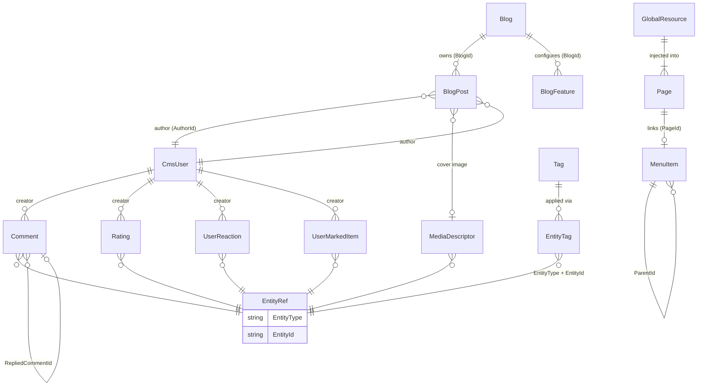

`Volo.CmsKit.Domain` is the heart of CMS Kit. Every aggregate root, every domain service, every repository interface, and every business rule lives here. The Application, HTTP API, and Web layers are thin wrappers around what this project exposes.

**Source root:** [`modules/cms-kit/src/Volo.CmsKit.Domain/Volo/CmsKit/`](https://github.com/abpframework/abp/tree/dev/modules/cms-kit/src/Volo.CmsKit.Domain/Volo/CmsKit)

## Folder map

```
Volo.CmsKit.Domain/Volo/CmsKit/
├── AbpCmsKitDbProperties.cs            # connection-string name + table prefix
├── CmsKitDomainModule.cs               # AbpModule wire-up
├── CmsKitDomainServiceBase.cs          # base for all domain services
├── IEntityTypeDefinitionStore.cs       # generic store contract
├── PolicySpecifiedDefinition.cs        # entity-type def with CRUD policies
├── SlugNormalizer.cs                   # unicode → ascii slug helper
│
├── Blogs/                              # Blog, BlogPost, BlogFeature
├── Comments/                           # Comment + polymorphic moderation
├── GlobalResources/                    # site-wide CSS / JS
├── MarkedItems/                        # bookmarks / likes (UserMarkedItem)
├── MediaDescriptors/                   # uploaded-file metadata
├── Menus/                              # MenuItem tree
├── Pages/                              # static Page aggregate
├── Ratings/                            # 1–5 star Rating aggregate
├── Reactions/                          # 👍 / ❤ / 😂 user reactions
├── Settings/                           # CmsKitSettings + provider
├── Tags/                               # Tag + EntityTag many-to-many
└── Users/                              # CmsUser projection of identity
```

Each folder is a vertical slice. It typically contains: one or more aggregate root entities (`Foo.cs`), a domain service (`FooManager.cs`), repository interfaces (`IFooRepository.cs`), entity-type definitions (`FooEntityTypeDefinition.cs`), a definition store (`IFooDefinitionStore.cs` + default impl), and typed exceptions (`EntityCantHaveFooException.cs`).

## Entity relationships



`EntityRef` is not a real table — it is the `(EntityType, EntityId)` string pair that every polymorphic aggregate (`Comment`, `Tag`, `Rating`, `UserReaction`, `UserMarkedItem`, `MediaDescriptor`) carries. It's how a single comment table can hold comments against blog posts, pages, products, or anything else a host registers.

## The twelve folders

### `Blogs/` — multi-blog publishing

Three aggregates: `Blog`, `BlogPost`, `BlogFeature`. Two domain services: `BlogManager` (slug uniqueness), `BlogPostManager` (post creation, slug uniqueness, cascade delete of comments).

```
Blogs/
├── Blog.cs                          # FullAuditedAggregateRoot<Guid>, IMultiTenant
├── BlogPost.cs                      # has Status (Draft/WaitingForReview/Published)
├── BlogFeature.cs                   # per-blog feature toggle
├── BlogManager.cs                   # DomainService
├── BlogPostManager.cs               # DomainService
├── BlogFeatureManager.cs
├── BlogFeatureDataSeedContributor.cs
├── DefaultBlogFeatureProvider.cs
├── IBlogRepository.cs
├── IBlogPostRepository.cs
├── IBlogFeatureRepository.cs
├── IDefaultBlogFeatureProvider.cs
├── BlogSlugAlreadyExistException.cs
├── BlogPostSlugAlreadyExistException.cs
└── BlogWithBlogPostCount.cs         # query result projection
```

Detailed walkthrough: [Blogs](/modules/cms-kit/blogs).

### `Pages/` — static pages

```
Pages/
├── Page.cs                          # title, slug, content, script, style, IsHomePage
├── PageManager.cs                   # slug check + home-page invariant
├── IPageRepository.cs
├── PageSlugAlreadyExistsException.cs
└── MultipleHomePageException.cs
```

`Page.IsHomePage` is protected and only flipped through `PageManager.SetHomePageAsync`, which atomically demotes any existing home page. See [Pages](/modules/cms-kit/pages).

### `Comments/` — polymorphic moderation

```
Comments/
├── Comment.cs                       # EntityType + EntityId + Text + RepliedCommentId
├── CommentManager.cs                # checks ICommentEntityTypeDefinitionStore
├── ICommentRepository.cs
├── ICommentEntityTypeDefinitionStore.cs
├── DefaultCommentEntityTypeDefinitionStore.cs
├── CommentWithAuthorQueryResultItem.cs
└── EntityNotCommentableException.cs
```

A `Comment` has an `IsApproved` nullable bool — `null` means *waiting*, `true` means *approved*, `false` means *rejected*. `CommentManager` reads `CmsKitSettings.Comments.RequireApprovement` and chooses between `Approve()` and `WaitForApproval()` at creation time. See [Comments](/modules/cms-kit/comments).

### `Tags/` — polymorphic many-to-many tagging

```
Tags/
├── Tag.cs                           # FullAuditedAggregateRoot, has EntityType
├── EntityTag.cs                     # join: TagId + EntityId
├── TagManager.cs                    # GetOrAddAsync + uniqueness checks
├── EntityTagManager.cs              # AddTagToEntity, SetEntityTags
├── ITagRepository.cs
├── IEntityTagRepository.cs
├── ITagDefinitionStore.cs
├── DefaultTagDefinitionStore.cs
├── TagEntityTypeDefiniton.cs        # extends PolicySpecifiedDefinition
├── TagEntityTypeDefinitions.cs
├── CmsKitTagOptions.cs
├── PopularTag.cs                    # query projection
├── TagAlreadyExistException.cs
└── EntityNotTaggableException.cs
```

`Tag` is *per entity type* — there are separate `BlogPost` tags and `Product` tags even if both are named "summer". See [Tags & Ratings](/modules/cms-kit/tags-and-ratings).

### `Ratings/` — 1–5 stars per (entity, user)

```
Ratings/
├── Rating.cs                        # BasicAggregateRoot, has StarCount: short
├── RatingManager.cs                 # upserts; one rating per (entity, user)
├── IRatingRepository.cs
├── IRatingEntityTypeDefinitionStore.cs
├── DefaultRatingEntityTypeDefinitionStore.cs
├── RatingEntityTypeDefinition.cs
├── CmsKitRatingOptions.cs
├── RatingWithStarCountQueryResultItem.cs
└── EntityCantHaveRatingException.cs
```

### `Reactions/` — emoji-style user reactions

```
Reactions/
├── UserReaction.cs                  # EntityType + EntityId + ReactionName + CreatorId
├── ReactionManager.cs               # toggle/replace per user
├── ReactionDefinition.cs            # describes a reaction (name, icon, etc.)
├── ReactionEntityTypeDefinition.cs  # which types can be reacted to
├── ReactionSummary.cs               # (ReactionName, Count)
├── ReactionSummaryQueryResultItem.cs
├── IReactionDefinitionStore.cs
├── DefaultReactionDefinitionStore.cs
├── IUserReactionRepository.cs
├── CmsKitReactionOptions.cs
└── EntityCantHaveReactionException.cs
```

Default reactions are configured via `CmsKitReactionOptions` (smile, thumbs-up, thumbs-down, heart, wink, eyes, pout, confused). A user can hold one reaction per entity; reacting again replaces the previous one.

### `Menus/` — hierarchical site navigation

```
Menus/
├── MenuItem.cs                      # ParentId + DisplayName + Url + Order + Icon
├── MenuItemManager.cs               # tree reorder, page-url binding
├── IMenuItemRepository.cs
└── PageChangedHandler.cs            # syncs MenuItem.Url when Page.Slug changes
```

`MenuItem` carries an optional `PageId` and `RequiredPermissionName`. `PageChangedHandler` is a `ILocalEventHandler<EntityChangedEventData<Page>>` that keeps `MenuItem.Url` in sync with `Page.Slug`. See [Menus & Media](/modules/cms-kit/menus-and-media).

### `MediaDescriptors/` — file metadata, blob bytes elsewhere

```
MediaDescriptors/
├── MediaDescriptor.cs               # name, mime, size, entity type
├── MediaDescriptorManager.cs
├── MediaContainer.cs                # the IBlobContainer marker type
├── MediaDescriptorDefinition.cs
├── MediaDescriptorChecks.cs         # filename validation
├── IMediaDescriptorRepository.cs
├── IMediaDescriptorDefinitionStore.cs
├── DefaultMediaDescriptorDefinitionStore.cs
├── CmsKitMediaOptions.cs
├── EntityCantHaveMediaException.cs
└── InvalidMediaDescriptorNameException.cs
```

The actual file bytes are streamed to/from an `IBlobContainer<MediaContainer>` — configurable per host via the [Blob Storing](/modules/blob-storing-database/overview) module. The descriptor knows only metadata.

### `MarkedItems/` — bookmarks / likes / favorites

```
MarkedItems/
├── UserMarkedItem.cs                # CreatorId + EntityType + EntityId
├── MarkedItemManager.cs
├── MarkedItemEntityTypeDefinition.cs
├── IMarkedItemDefinitionStore.cs
├── DefaultMarkedItemDefinitionStore.cs
├── IUserMarkedItemRepository.cs
├── CmsKitMarkedItemOptions.cs
├── DuplicateMarkedItemDefinitionException.cs
├── MarkedItemDefinitionNotFoundException.cs
└── EntityCannotBeMarkedException.cs
```

A marked item is a *named* relationship (e.g. `Favorite`, `WatchLater`). The definition store lets a host register multiple semantics on the same entity type.

### `GlobalResources/` — site-wide CSS & JS

```
GlobalResources/
├── GlobalResource.cs                # Value + ResourceType (Script/Style)
├── GlobalResourceManager.cs
└── IGlobalResourceRepository.cs
```

Holds one CSS blob and one JS blob, both inserted into every layout via the Public.Web `GlobalResources/Script` and `GlobalResources/Style` view components.

### `Users/` — CmsUser projection

```
Users/
├── CmsUser.cs                       # AggregateRoot — duplicated identity fields
├── CmsUserLookupService.cs          # ICmsUserLookupService impl
├── ICmsUserLookupService.cs
├── ICmsUserRepository.cs
└── CmsUserSynchronizer.cs           # distributed-event listener
```

`CmsUser` is a *projection*, not a foreign key. `CmsUserSynchronizer` listens for `EntityCreatedEto<IdentityUser>` and `EntityUpdatedEto<IdentityUser>` events and upserts a `CmsUser` row. This lets CMS Kit avoid a hard dependency on the [Identity module](/modules/identity/overview) — a host using a different user store can publish equivalent events.

### `Settings/` — configuration knobs

```
Settings/
├── CmsKitSettings.cs                # constants for setting names
└── CmsKitSettingDefinitionProvider.cs
```

Notable settings (constants under `CmsKitSettings`):

- `CmsKitSettings.Comments.RequireApprovement` — `bool`, flips moderation on.
- `CmsKitSettings.MarkedItem.*` — per-definition enable/disable flags.

## Cross-cutting primitives

### `IEntityTypeDefinitionStore<TPolicyDefinition>`

```csharp
// modules/cms-kit/src/Volo.CmsKit.Domain/Volo/CmsKit/IEntityTypeDefinitionStore.cs
using JetBrains.Annotations;
using System.Threading.Tasks;
using Volo.Abp.DependencyInjection;

namespace Volo.CmsKit;

public interface IEntityTypeDefinitionStore<TPolicyDefinition> : ITransientDependency
    where TPolicyDefinition : EntityTypeDefinition
{
    Task<TPolicyDefinition> GetAsync([NotNull] string entityType);
    Task<bool> IsDefinedAsync([NotNull] string entityType);
}
```

Every capability that does polymorphic dispatch implements a closed generic of this interface. Specialized contracts (`ITagDefinitionStore`, `IRatingEntityTypeDefinitionStore`, etc.) extend it with capability-specific lookup helpers.

The default implementations (`DefaultTagDefinitionStore`, `DefaultRatingEntityTypeDefinitionStore`, etc.) read from the corresponding `Cms*Options` configured at startup:

```csharp
Configure<CmsKitTagOptions>(options =>
{
    options.EntityTypes.Add(new TagEntityTypeDefiniton("BlogPost"));
    options.EntityTypes.Add(new TagEntityTypeDefiniton("Product",
        createPolicies: new[] { "MyApp.Products.Tag" }));
});
```

### `PolicySpecifiedDefinition`

```csharp
// modules/cms-kit/src/Volo.CmsKit.Domain/Volo/CmsKit/PolicySpecifiedDefinition.cs
public abstract class PolicySpecifiedDefinition
    : EntityTypeDefinition, IEquatable<PolicySpecifiedDefinition>
{
    public PolicySpecifiedDefinition(
        [NotNull] string entityType,
        IEnumerable<string> createPolicies = null,
        IEnumerable<string> updatePolicies = null,
        IEnumerable<string> deletePolicies = null) : base(entityType)
    {
        if (createPolicies != null)
            CreatePolicies = CreatePolicies.Concat(createPolicies).ToList();
        if (updatePolicies != null)
            UpdatePolicies = UpdatePolicies.Concat(updatePolicies).ToList();
        if (deletePolicies != null)
            DeletePolicies = DeletePolicies.Concat(deletePolicies).ToList();
    }

    public ICollection<string> CreatePolicies { get; } = new List<string>();
    public ICollection<string> UpdatePolicies { get; } = new List<string>();
    public ICollection<string> DeletePolicies { get; } = new List<string>();
}
```

Subclasses: `TagEntityTypeDefiniton`, `RatingEntityTypeDefinition`, `MarkedItemEntityTypeDefinition`, `MediaDescriptorDefinition`. The Application layer checks these policies with `IAuthorizationService.AuthorizeAsync(policy)` before mutating.

### `SlugNormalizer`

```csharp
// modules/cms-kit/src/Volo.CmsKit.Domain/Volo/CmsKit/SlugNormalizer.cs
using Slugify;
using Unidecode.NET;

namespace Volo.CmsKit;

public static class SlugNormalizer
{
    static readonly SlugHelper SlugHelper = new(new SlugHelperConfiguration
    {
        AllowedCharacters = { '/' }
    });

    public static string Normalize(string value)
    {
        return SlugHelper.GenerateSlug(value?.Unidecode()).Trim('/');
    }
}
```

Used by `Blog.SetSlug`, `BlogPost.SetSlug`, and `Page.SetSlug`. The `Unidecode()` call transliterates non-ASCII (e.g. "Über" → "uber", "東京" → "dong-jing"). The `'/'` allowance lets pages have nested slugs like `docs/getting-started`.

### `CmsKitDomainServiceBase`

```csharp
// modules/cms-kit/src/Volo.CmsKit.Domain/Volo/CmsKit/CmsKitDomainServiceBase.cs
using Volo.Abp.Domain.Services;

namespace Volo.CmsKit;

public abstract class CmsKitDomainServiceBase : DomainService
{
}
```

A trivial base class so all CMS Kit domain services share an inheritance root. Only `MenuItemManager` uses it directly today; the rest derive from `DomainService` for historical reasons. New domain services should prefer `CmsKitDomainServiceBase`.

## How a typical capability folder is structured

Almost every capability folder follows the same template (Comments is shown, but Tags, Ratings, Reactions, MediaDescriptors, MarkedItems all match):

| File | Role |
| --- | --- |
| `{Capability}.cs` | Aggregate root. `FullAuditedAggregateRoot<Guid>` for owner-managed things; `BasicAggregateRoot<Guid>` for high-volume user actions (Rating, UserReaction). |
| `{Capability}Manager.cs` | Domain service. Owns invariants, calls the definition store, throws typed exceptions. |
| `I{Capability}Repository.cs` | Capability-specific repository contract (e.g. `GetCountByEntityTypeAsync`, `GetBySlugAsync`). |
| `I{Capability}EntityTypeDefinitionStore.cs` + `Default…Store.cs` | Polymorphic dispatch. |
| `{Capability}EntityTypeDefinition.cs` | Per-entity-type metadata. Often a `PolicySpecifiedDefinition`. |
| `CmsKit{Capability}Options.cs` | Startup configuration entry point. |
| `EntityCantHave{Capability}Exception.cs` (or similar) | Typed business exception for "this entity type is not registered". |

Knowing this template makes onboarding fast: open any folder and you already know which file does what.

## Module wire-up

`CmsKitDomainModule` depends on:

- `AbpDomainModule` — for `DomainService`, `AggregateRoot`, repositories.
- `AbpAuditingModule` — for `FullAuditedAggregateRoot`.
- `AbpAuthorizationModule` — for `IAuthorizationService` (policy checks).
- `AbpBlobStoringModule` — for `IBlobContainer<MediaContainer>`.
- `AbpFeaturesModule` — for `[RequiresFeature]`.
- `AbpGlobalFeaturesModule` — for `[RequiresGlobalFeature]`.
- `AbpSettingManagementModule` — for `ISettingManager` (read by `CommentManager`).
- `AbpDistributedEventBusModule` — for `EntityCreatedEto<IdentityUser>` subscription in `CmsUserSynchronizer`.
- `CmsKitDomainSharedModule` — sibling project with consts, enums, permissions, features.

## Related reading

- [Blogging module](/modules/blogging/overview) — the older alternative.
- [Blob Storing Database](/modules/blob-storing-database/overview) — backs `MediaContainer`.
- [Multi-lingual objects](/localization/multi-lingual-objects) — translation strategy for `BlogPost` and `Page`.
- Per-capability deep dives: [Blogs](/modules/cms-kit/blogs), [Pages](/modules/cms-kit/pages), [Comments](/modules/cms-kit/comments), [Tags & Ratings](/modules/cms-kit/tags-and-ratings), [Menus & Media](/modules/cms-kit/menus-and-media).
