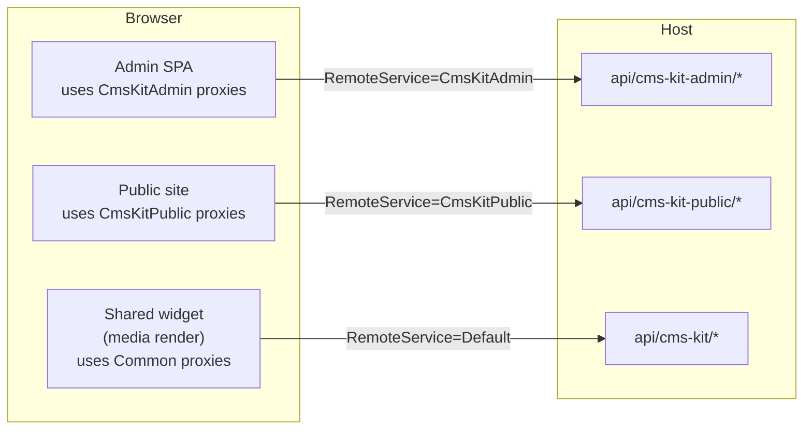

CMS Kit ships **three** REST surfaces, plus matching `*HttpApi.Client` projects that generate strongly-typed C# proxies via ABP's dynamic-client infrastructure. A single host registers all three; a consuming SPA or microservice can target whichever subset it needs.

| Project | Route prefix | Controllers in folder |
| --- | --- | --- |
| `Volo.CmsKit.Admin.HttpApi` | `api/cms-kit-admin/*` | [`Volo/CmsKit/Admin/`](https://github.com/abpframework/abp/tree/dev/modules/cms-kit/src/Volo.CmsKit.Admin.HttpApi/Volo/CmsKit/Admin) |
| `Volo.CmsKit.Public.HttpApi` | `api/cms-kit-public/*` | [`Volo/CmsKit/Public/`](https://github.com/abpframework/abp/tree/dev/modules/cms-kit/src/Volo.CmsKit.Public.HttpApi/Volo/CmsKit/Public) |
| `Volo.CmsKit.Common.HttpApi` | `api/cms-kit/*` | [`Volo/CmsKit/`](https://github.com/abpframework/abp/tree/dev/modules/cms-kit/src/Volo.CmsKit.Common.HttpApi/Volo/CmsKit) |
| `Volo.CmsKit.Admin.HttpApi.Client` | — | dynamic proxies for `CmsKitAdmin` remote service |
| `Volo.CmsKit.Public.HttpApi.Client` | — | dynamic proxies for `CmsKitPublic` |
| `Volo.CmsKit.Common.HttpApi.Client` | — | dynamic proxies for `Default` (Common) |
| `Volo.CmsKit.HttpApi`, `.HttpApi.Client` | — | meta-bundles depending on all three |

Each controller implements the corresponding `I*AppService` and forwards every call straight to the app-service field. The controller exists only to give MVC a routing surface — there is no extra logic.

## Anatomy of a CMS Kit controller

```csharp
// modules/cms-kit/src/Volo.CmsKit.Admin.HttpApi/Volo/CmsKit/Admin/Blogs/BlogPostAdminController.cs
[RequiresFeature(CmsKitFeatures.BlogEnable)]
[RequiresGlobalFeature(typeof(BlogsFeature))]
[RemoteService(Name = CmsKitAdminRemoteServiceConsts.RemoteServiceName)]
[Area(CmsKitAdminRemoteServiceConsts.ModuleName)]
[Authorize(CmsKitAdminPermissions.BlogPosts.Default)]
[Route("api/cms-kit-admin/blogs/blog-posts")]
public class BlogPostAdminController : CmsKitAdminController, IBlogPostAdminAppService
{
    protected readonly IBlogPostAdminAppService BlogPostAdminAppService;

    public BlogPostAdminController(IBlogPostAdminAppService blogPostAdminAppService)
    {
        BlogPostAdminAppService = blogPostAdminAppService;
    }

    [HttpPost]
    [Authorize(CmsKitAdminPermissions.BlogPosts.Create)]
    public virtual Task<BlogPostDto> CreateAsync(CreateBlogPostDto input)
        => BlogPostAdminAppService.CreateAsync(input);

    [HttpDelete]
    [Route("{id}")]
    [Authorize(CmsKitAdminPermissions.BlogPosts.Delete)]
    public virtual Task DeleteAsync(Guid id)
        => BlogPostAdminAppService.DeleteAsync(id);

    [HttpGet]
    [Route("{id:Guid}")]
    [Authorize(CmsKitAdminPermissions.BlogPosts.Default)]
    public virtual Task<BlogPostDto> GetAsync(Guid id)
        => BlogPostAdminAppService.GetAsync(id);

    // ... and so on for every IBlogPostAdminAppService method
}
```

Four attributes do the work:

- **`[RemoteService(Name = "CmsKitAdmin")]`** — groups the controller in ABP's dynamic client. Consumers configure a single base URL for `CmsKitAdmin`.
- **`[Area("cms-kit-admin")]`** — ASP.NET Core MVC area, used for URL conventions and Swagger grouping.
- **`[Route("api/cms-kit-admin/...")]`** — the route prefix shared by every method on the controller.
- **`[Authorize(...)]`** + **`[RequiresFeature/[RequiresGlobalFeature]`** — class-level gates, with per-method `[Authorize]` for granular permissions.

## Admin route table — `api/cms-kit-admin/*`

### Blogs

```
POST   /api/cms-kit-admin/blogs                                # CreateAsync(CreateBlogDto)
GET    /api/cms-kit-admin/blogs                                # GetListAsync(BlogGetListInput)
GET    /api/cms-kit-admin/blogs/{id}                           # GetAsync
PUT    /api/cms-kit-admin/blogs/{id}                           # UpdateAsync(UpdateBlogDto)
DELETE /api/cms-kit-admin/blogs/{id}                           # DeleteAsync
GET    /api/cms-kit-admin/blogs/all                            # GetAllListAsync (no paging)
PUT    /api/cms-kit-admin/blogs/{id}/move-all-blog-posts       # MoveAllBlogPostsAsync(assignToBlogId?)
```

### Blog posts

```
POST   /api/cms-kit-admin/blogs/blog-posts                     # CreateAsync(CreateBlogPostDto)
GET    /api/cms-kit-admin/blogs/blog-posts                     # GetListAsync(BlogPostGetListInput) → BlogPostListDto
GET    /api/cms-kit-admin/blogs/blog-posts/{id:Guid}           # GetAsync → BlogPostDto
PUT    /api/cms-kit-admin/blogs/blog-posts/{id}                # UpdateAsync(UpdateBlogPostDto)
DELETE /api/cms-kit-admin/blogs/blog-posts/{id}                # DeleteAsync
POST   /api/cms-kit-admin/blogs/blog-posts/{id}/publish        # PublishAsync
POST   /api/cms-kit-admin/blogs/blog-posts/{id}/draft          # DraftAsync
POST   /api/cms-kit-admin/blogs/blog-posts/{id}/send-to-review # SendToReviewAsync
POST   /api/cms-kit-admin/blogs/blog-posts/create-and-publish  # CreateAndPublishAsync
POST   /api/cms-kit-admin/blogs/blog-posts/create-and-send-to-review
GET    /api/cms-kit-admin/blogs/blog-posts/has-blogpost-waiting-for-review
```

### Blog features

```
GET    /api/cms-kit-admin/blogs/{blogId}/features              # GetListAsync(blogId)
PUT    /api/cms-kit-admin/blogs/{blogId}/features              # SetAsync(blogId, BlogFeatureInputDto)
```

### Pages

```
GET    /api/cms-kit-admin/pages                                # GetListAsync(GetPagesInputDto)
GET    /api/cms-kit-admin/pages/{id}                           # GetAsync
POST   /api/cms-kit-admin/pages                                # CreateAsync(CreatePageInputDto)
PUT    /api/cms-kit-admin/pages/{id}                           # UpdateAsync(UpdatePageInputDto)
DELETE /api/cms-kit-admin/pages/{id}                           # DeleteAsync
PUT    /api/cms-kit-admin/pages/setashomepage/{id}             # SetAsHomePageAsync
```

### Comments

```
GET    /api/cms-kit-admin/comments                             # GetListAsync(CommentGetListInput)
GET    /api/cms-kit-admin/comments/{id}                        # GetAsync → CommentWithAuthorDto
DELETE /api/cms-kit-admin/comments/{id}                        # DeleteAsync
PUT    /api/cms-kit-admin/comments/{id}/approval-status        # UpdateApprovalStatusAsync(CommentApprovalDto)
POST   /api/cms-kit-admin/comments/settings                    # UpdateSettingsAsync(CommentSettingsDto)
GET    /api/cms-kit-admin/comments/waiting-count               # GetWaitingCountAsync → int
```

### Tags

```
POST   /api/cms-kit-admin/tags                                 # CreateAsync(TagCreateDto)
GET    /api/cms-kit-admin/tags                                 # GetListAsync(TagGetListInput)
GET    /api/cms-kit-admin/tags/tag-definitions                 # GetTagDefinitionsAsync → List<TagDefinitionDto>
PUT    /api/cms-kit-admin/tags/{id}                            # UpdateAsync(TagUpdateDto)
DELETE /api/cms-kit-admin/tags/{id}                            # DeleteAsync
```

### Entity tags (the join)

```
POST   /api/cms-kit-admin/entity-tags                          # AddTagToEntityAsync(EntityTagCreateDto)
DELETE /api/cms-kit-admin/entity-tags                          # RemoveTagFromEntityAsync(EntityTagRemoveDto)
PUT    /api/cms-kit-admin/entity-tags                          # SetEntityTagsAsync(EntityTagSetDto)
```

### Menu items

```
GET    /api/cms-kit-admin/menu-items                           # GetListAsync → ListResultDto<MenuItemDto>
GET    /api/cms-kit-admin/menu-items/{id}                      # GetAsync → MenuItemWithDetailsDto
POST   /api/cms-kit-admin/menu-items                           # CreateAsync(MenuItemCreateInput)
PUT    /api/cms-kit-admin/menu-items/{id}                      # UpdateAsync(MenuItemUpdateInput)
DELETE /api/cms-kit-admin/menu-items/{id}                      # DeleteAsync
PUT    /api/cms-kit-admin/menu-items/{id}/move                 # MoveMenuItemAsync(MenuItemMoveInput)
GET    /api/cms-kit-admin/menu-items/lookup/pages              # GetPageLookupAsync(PageLookupInputDto)
GET    /api/cms-kit-admin/menu-items/lookup/permissions        # GetPermissionLookupAsync
GET    /api/cms-kit-admin/menu-items/available-order           # GetAvailableMenuOrderAsync(parentId?)
```

### Media descriptors

```
POST   /api/cms-kit-admin/media/{entityType}                   # CreateAsync(entityType, multipart) → MediaDescriptorDto
DELETE /api/cms-kit-admin/media/{id}                           # DeleteAsync
```

The `POST` accepts `multipart/form-data` (an `IRemoteStreamContent` parameter).

### Global resources

```
GET    /api/cms-kit-admin/global-resources                     # GetAsync → GlobalResourcesDto
POST   /api/cms-kit-admin/global-resources                     # SetGlobalResourcesAsync(GlobalResourcesUpdateDto)
```

## Public route table — `api/cms-kit-public/*`

### Blog posts

```
GET    /api/cms-kit-public/blog-posts/{blogSlug}/{blogPostSlug}  # GetAsync → BlogPostCommonDto
GET    /api/cms-kit-public/blog-posts/{blogSlug}                 # GetListAsync(blogSlug, BlogPostGetListInput)
GET    /api/cms-kit-public/blog-posts/authors                    # GetAuthorsHasBlogPostsAsync
GET    /api/cms-kit-public/blog-posts/authors/{id}               # GetAuthorHasBlogPostAsync
DELETE /api/cms-kit-public/blog-posts/{id}                       # DeleteAsync (author only)
GET    /api/cms-kit-public/blog-posts/tags/{id}                  # GetTagNameAsync(tagId) → string
```

### Comments

```
GET    /api/cms-kit-public/comments/{entityType}/{entityId}    # GetListAsync → ListResultDto<CommentWithDetailsDto>
POST   /api/cms-kit-public/comments/{entityType}/{entityId}    # CreateAsync(CreateCommentInput)
PUT    /api/cms-kit-public/comments/{id}                       # UpdateAsync(UpdateCommentInput) (owner only)
DELETE /api/cms-kit-public/comments/{id}                       # DeleteAsync (owner or admin)
```

### Pages

```
GET    /api/cms-kit-public/pages/by-slug?slug={slug}           # FindBySlugAsync
GET    /api/cms-kit-public/pages/home                          # FindDefaultHomePageAsync
GET    /api/cms-kit-public/pages/exist?slug={slug}             # DoesSlugExistAsync → bool
```

### Ratings

```
PUT    /api/cms-kit-public/ratings/{entityType}/{entityId}     # CreateAsync(CreateUpdateRatingInput) → RatingDto
DELETE /api/cms-kit-public/ratings/{entityType}/{entityId}     # DeleteAsync
GET    /api/cms-kit-public/ratings/{entityType}/{entityId}     # GetGroupedStarCountsAsync → List<RatingWithStarCountDto>
```

`PUT` for upsert is a deliberate choice — the user has at most one rating per entity, so the semantics are idempotent.

### Reactions

```
GET    /api/cms-kit-public/reactions/{entityType}/{entityId}              # GetForSelectionAsync
PUT    /api/cms-kit-public/reactions/{entityType}/{entityId}/{reaction}   # CreateAsync
DELETE /api/cms-kit-public/reactions/{entityType}/{entityId}/{reaction}   # DeleteAsync
```

### Tags (public, read-only)

```
GET    /api/cms-kit-public/tags/{entityType}/{entityId}              # tags on a given entity
GET    /api/cms-kit-public/tags/popular/{entityType}/{maxCount:int}  # popular tags histogram
```

No public mutation of tags; only authors via the admin endpoints.

### Marked items

```
GET    /api/cms-kit-public/marked-items/{entityType}/{entityId}    # GetForUserAsync → MarkedItemWithToggleDto
PUT    /api/cms-kit-public/marked-items/{entityType}/{entityId}    # ToggleAsync → bool
```

### Menu items

```
GET    /api/cms-kit-public/menu-items                              # GetListAsync → List<MenuItemDto>
```

### Global resources

```
GET    /api/cms-kit-public/global-resources/script                 # GetGlobalScriptAsync → GlobalResourceDto
GET    /api/cms-kit-public/global-resources/style                  # GetGlobalStyleAsync → GlobalResourceDto
```

## Common route table — `api/cms-kit/*`

The Common HTTP API hosts routes that are shared between admin and public clients. It is small — currently just two controllers.

### Media (download)

```
GET    /api/cms-kit/media/{id}                                # stream the blob bytes
```

Returns the raw bytes with `Content-Type` from `MediaDescriptor.MimeType` and `Content-Disposition: inline` so browsers render images directly. The actual byte source is whatever `IBlobContainer<MediaContainer>` is configured — see [Blob Storing Database](/modules/blob-storing-database/overview).

### Blog feature lookup

```
GET    /api/cms-kit/blogs/{blogId}/features/{featureName}     # check whether a blog feature is enabled
```

Used by both admin UI (to grey out disabled options) and public widgets (e.g. the reactions row only renders if the blog has reactions enabled).

## Why three remote services?



Each remote-service name maps to a base URL in `appsettings.json`:

```json
{
  "RemoteServices": {
    "CmsKitAdmin":  { "BaseUrl": "https://admin.contoso.com/" },
    "CmsKitPublic": { "BaseUrl": "https://www.contoso.com/"   },
    "Default":      { "BaseUrl": "https://media.contoso.com/" }
  }
}
```

A consuming app can split its admin and public APIs across different hosts (or microservices) without recompiling.

## HttpApi.Client projects

Each of the three controller projects has a sibling `*HttpApi.Client` project that consists of one module class:

```csharp
[DependsOn(
    typeof(CmsKitAdminApplicationContractsModule),
    typeof(AbpHttpClientModule))]
public class CmsKitAdminHttpApiClientModule : AbpModule
{
    public const string RemoteServiceName = CmsKitAdminRemoteServiceConsts.RemoteServiceName;

    public override void ConfigureServices(ServiceConfigurationContext context)
    {
        context.Services.AddHttpClientProxies(
            typeof(CmsKitAdminApplicationContractsModule).Assembly,
            RemoteServiceName);
    }
}
```

`AddHttpClientProxies` scans the contracts assembly for `I*AppService` interfaces and registers dynamically generated `HttpClient` proxies. A consuming microservice depends on this module and injects `IBlogPostAdminAppService` — every call becomes an HTTP request.

## Error responses

All controllers use ABP's standard error envelope. A `BusinessException` (e.g. `BlogSlugAlreadyExistException`) becomes:

```http
HTTP/1.1 400 Bad Request
Content-Type: application/json

{
  "error": {
    "code": "Volo.CmsKit:00007",
    "message": "Slug already exists.",
    "data": { "slug": "my-existing-slug" }
  }
}
```

The `code` matches what's in `CmsKitDomainErrorCodes` / `CmsKitErrorCodes`, and `data` carries the bag set via `WithData(...)` on the exception.

## Cross-references

- Each controller wraps one app service — see [Admin Application](/modules/cms-kit/admin-application) and [Public Application](/modules/cms-kit/public-application).
- The Common route `GET /api/cms-kit/media/{id}` is how the [Web UI](/modules/cms-kit/web-ui) renders images. The bytes themselves come from [Blob Storing Database](/modules/blob-storing-database/overview).
- Comparison with the older [Blogging module](/modules/blogging/overview): routes there are flat under `/api/blogs/*` and not split admin/public. Migration generally means rewriting client URLs to the new prefixes.
- For multi-language responses, see [Multi-lingual objects](/localization/multi-lingual-objects).
