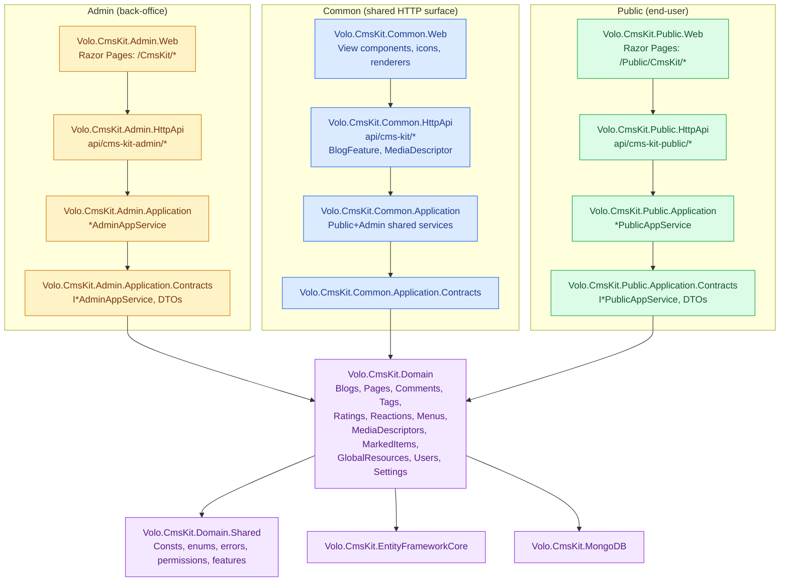

The **CMS Kit module** (`Volo.CmsKit.*`) is a *toolkit*, not a monolithic CMS. Each capability — blogs, static pages, comments, tags, ratings, reactions, menus, media descriptors, marked items (bookmarks/likes), global resources — is a self-contained vertical that you opt into. It is wired together by a shared **Domain** layer and exposed through three application surfaces: **Admin** (back-office management), **Common** (capabilities used by both sides, e.g. media streaming), and **Public** (anonymous and authenticated end-user reads/writes).

The module ships as 25 projects under [`modules/cms-kit/src/`](https://github.com/abpframework/abp/tree/dev/modules/cms-kit/src). Every type referenced on these pages lives in that tree.

<Info>
**CMS Kit vs. Blogging.** The older [Blogging module](/modules/blogging/overview) is a complete, opinionated multi-blog application. CMS Kit is a *kit*: you pick the parts you need (just comments? just pages? blogs + tags + reactions?) and disable the rest via global features. New projects should prefer CMS Kit.
</Info>

## What's inside

<CardGroup cols={2}>
  <Card title="Domain" icon="cube" href="/modules/cms-kit/domain">
    Aggregates and domain services for every capability. Lives in `Volo.CmsKit.Domain` under twelve top-level folders: `Blogs/`, `Comments/`, `GlobalResources/`, `MarkedItems/`, `MediaDescriptors/`, `Menus/`, `Pages/`, `Ratings/`, `Reactions/`, `Settings/`, `Tags/`, `Users/`.
  </Card>
  <Card title="Blogs" icon="newspaper" href="/modules/cms-kit/blogs">
    `Blog`, `BlogPost`, `BlogFeature` aggregates. `BlogManager` and `BlogPostManager` enforce slug uniqueness and post lifecycle (Draft → WaitingForReview → Published).
  </Card>
  <Card title="Pages" icon="file-lines" href="/modules/cms-kit/pages">
    `Page` aggregate with title, slug, content, script, style, layout, and home-page toggle. `PageManager` ensures slug uniqueness and at-most-one home page.
  </Card>
  <Card title="Comments" icon="comments" href="/modules/cms-kit/comments">
    Generic, polymorphic comment system. Any `IEntity` can be made commentable via `ICommentEntityTypeDefinitionStore`. Optional moderation queue (`Approve` / `Reject` / `WaitForApproval`).
  </Card>
  <Card title="Tags & Ratings" icon="tags" href="/modules/cms-kit/tags-and-ratings">
    `Tag` + `EntityTag` for many-to-many tagging on any entity type; `Rating` for 1–5 star reviews. Both use entity-type definition stores so you pick which types are taggable/rateable.
  </Card>
  <Card title="Menus & Media" icon="bars" href="/modules/cms-kit/menus-and-media">
    Hierarchical `MenuItem` tree for site navigation (with permission gating). `MediaDescriptor` + `MediaContainer` for file uploads backed by the [Blob Storing](/modules/blob-storing-database/overview) module.
  </Card>
  <Card title="Admin Application" icon="user-shield" href="/modules/cms-kit/admin-application">
    Back-office app services: `BlogAdminAppService`, `BlogPostAdminAppService`, `PageAdminAppService`, `CommentAdminAppService`, `TagAdminAppService`, `MenuItemAdminAppService`, `MediaDescriptorAdminAppService`, `GlobalResourceAdminAppService`.
  </Card>
  <Card title="Public Application" icon="globe" href="/modules/cms-kit/public-application">
    End-user app services: `BlogPostPublicAppService`, `PagePublicAppService`, `CommentPublicAppService`, `RatingPublicAppService`, `ReactionPublicAppService`, `MarkedItemPublicAppService`, `MenuItemPublicAppService`, `GlobalResourcePublicAppService`.
  </Card>
  <Card title="HTTP API" icon="cloud" href="/modules/cms-kit/http-api">
    Three controller surfaces — `api/cms-kit-admin/*`, `api/cms-kit-public/*`, `api/cms-kit/*` — plus matching `HttpApi.Client` projects that generate proxies via ABP's dynamic C# client.
  </Card>
  <Card title="Web UI" icon="display" href="/modules/cms-kit/web-ui">
    Razor Pages: Admin CRUD screens under `/CmsKit/*`, public reading views under `/Public/CmsKit/*`, and shared view components (`Commenting`, `Rating`, `ReactionSelection`, `MarkedItemToggle`, `Tags`).
  </Card>
</CardGroup>

## Project layout

The kit splits along two axes: **layer** (Domain → Application → HttpApi → Web) and **audience** (Admin / Common / Public). Domain is shared; everything above it forks.



### Why three audiences?

| Audience | Authentication | Authorization | Example service | Example route |
| --- | --- | --- | --- | --- |
| **Admin** | Required (admin user) | Permission-gated (`CmsKitAdminPermissions.*`) | `BlogPostAdminAppService.CreateAsync` | `POST /api/cms-kit-admin/blogs/blog-posts` |
| **Common** | Optional | Often anonymous (media download) | `MediaDescriptorPublicAppService.GetAsync` | `GET /api/cms-kit/media/{id}` |
| **Public** | Optional / authenticated user | Mostly anonymous reads, authenticated writes | `BlogPostPublicAppService.GetListAsync` | `GET /api/cms-kit-public/blog-posts` |

The Admin and Public DTOs are deliberately separate. An admin endpoint that lists blog posts returns `BlogPostListDto` with status, audit fields, and tenant id; the public endpoint returns `BlogPostCommonDto` with only the fields a reader cares about. This split shows up everywhere — for `Page`, `Comment`, `Tag`, `MenuItem`, `MediaDescriptor`.

## The 25 projects

```
modules/cms-kit/src/
├── Volo.CmsKit.Domain                          # Aggregates + domain services
├── Volo.CmsKit.Domain.Shared                   # Consts, enums, exceptions
├── Volo.CmsKit.EntityFrameworkCore             # EF Core mapping
├── Volo.CmsKit.MongoDB                         # MongoDB mapping
├── Volo.CmsKit.Installer                       # Module install/setup
│
├── Volo.CmsKit.Admin.Application               # *AdminAppService impls
├── Volo.CmsKit.Admin.Application.Contracts     # I*AdminAppService, DTOs
├── Volo.CmsKit.Admin.HttpApi                   # *AdminController
├── Volo.CmsKit.Admin.HttpApi.Client            # Dynamic C# proxies
├── Volo.CmsKit.Admin.Web                       # Razor Pages: /CmsKit/*
│
├── Volo.CmsKit.Common.Application              # Shared app services
├── Volo.CmsKit.Common.Application.Contracts
├── Volo.CmsKit.Common.HttpApi                  # api/cms-kit/* controllers
├── Volo.CmsKit.Common.HttpApi.Client
├── Volo.CmsKit.Common.Web                      # Shared view components
│
├── Volo.CmsKit.Public.Application              # *PublicAppService impls
├── Volo.CmsKit.Public.Application.Contracts
├── Volo.CmsKit.Public.HttpApi                  # *PublicController
├── Volo.CmsKit.Public.HttpApi.Client
├── Volo.CmsKit.Public.Web                      # Razor Pages: /Public/CmsKit/*
│
├── Volo.CmsKit.Application                     # Convenience meta-bundle
├── Volo.CmsKit.Application.Contracts
├── Volo.CmsKit.HttpApi
├── Volo.CmsKit.HttpApi.Client
└── Volo.CmsKit.Web
```

The trailing five "umbrella" projects (`Volo.CmsKit.Application`, `Volo.CmsKit.HttpApi`, etc., without `Admin`/`Public`/`Common`) are convenience aggregators that depend on all three audience-specific modules so a small app can take a single dependency.

## Capability matrix

Each capability has a feature flag (`CmsKitFeatures.*`) and a global feature (`Volo.CmsKit.GlobalFeatures.*`). Services are decorated with `[RequiresFeature(...)]` and `[RequiresGlobalFeature(...)]`, so disabling a global feature compiles the capability out entirely.

| Capability | Domain folder | Global feature | Admin AppService | Public AppService |
| --- | --- | --- | --- | --- |
| Blogs | `Blogs/` | `BlogsFeature` | `BlogAdminAppService`, `BlogPostAdminAppService`, `BlogFeatureAdminAppService` | `BlogPostPublicAppService` |
| Pages | `Pages/` | `PagesFeature` | `PageAdminAppService` | `PagePublicAppService` |
| Comments | `Comments/` | `CommentsFeature` | `CommentAdminAppService` | `CommentPublicAppService` |
| Tags | `Tags/` | `TagsFeature` | `TagAdminAppService`, `EntityTagAdminAppService` | `TagPublicController` (no app service; controller-only) |
| Ratings | `Ratings/` | `RatingsFeature` | — | `RatingPublicAppService` |
| Reactions | `Reactions/` | `ReactionsFeature` | — | `ReactionPublicAppService` |
| Menus | `Menus/` | `MenusFeature` | `MenuItemAdminAppService` | `MenuItemPublicAppService` |
| Media | `MediaDescriptors/` | (none — always on) | `MediaDescriptorAdminAppService` | (Common: `MediaDescriptorController`) |
| Marked items | `MarkedItems/` | `MarkedItemsFeature` | — | `MarkedItemPublicAppService` |
| Global resources | `GlobalResources/` | `GlobalResourcesFeature` | `GlobalResourceAdminAppService` | `GlobalResourcePublicAppService` |

A capability with no admin app service (Ratings, Reactions, Marked Items) is a user-driven action — there is nothing for an admin to manage beyond querying audit data.

## Cross-cutting domain concepts

Two patterns recur across every capability and live at the root of `Volo.CmsKit.Domain/Volo/CmsKit/`:

### Entity-type definition stores

Tags, ratings, reactions, comments, media, and marked items are all *polymorphic*: any entity in your application can become taggable, rateable, commentable, etc. by registering its CLR type via an entity-type definition. The contract is uniform:

```csharp
// modules/cms-kit/src/Volo.CmsKit.Domain/Volo/CmsKit/IEntityTypeDefinitionStore.cs
public interface IEntityTypeDefinitionStore<TPolicyDefinition> : ITransientDependency
    where TPolicyDefinition : EntityTypeDefinition
{
    Task<TPolicyDefinition> GetAsync([NotNull] string entityType);
    Task<bool> IsDefinedAsync([NotNull] string entityType);
}
```

Concrete stores per capability:

- `ICommentEntityTypeDefinitionStore` — registers commentable types.
- `ITagDefinitionStore` — registers taggable types (uses `TagEntityTypeDefiniton`).
- `IRatingEntityTypeDefinitionStore` — registers rateable types.
- `IReactionDefinitionStore` — registers types that can receive reactions.
- `IMediaDescriptorDefinitionStore` — registers types that can own media.
- `IMarkedItemDefinitionStore` — registers types that can be bookmarked/liked.

Each manager checks the store before mutating state and throws a typed exception (`EntityNotCommentableException`, `EntityNotTaggableException`, etc.) when an unregistered type is used.

### Policy-specified definitions

Some definitions also carry create/update/delete permission policies:

```csharp
// modules/cms-kit/src/Volo.CmsKit.Domain/Volo/CmsKit/PolicySpecifiedDefinition.cs
public abstract class PolicySpecifiedDefinition : EntityTypeDefinition, IEquatable<PolicySpecifiedDefinition>
{
    public ICollection<string> CreatePolicies { get; } = new List<string>();
    public ICollection<string> UpdatePolicies { get; } = new List<string>();
    public ICollection<string> DeletePolicies { get; } = new List<string>();
}
```

`TagEntityTypeDefiniton`, `RatingEntityTypeDefinition`, `MarkedItemEntityTypeDefinition`, and `MediaDescriptorDefinition` extend it so a host app can say "only users with the `MyApp.Products.Tag` permission can attach tags to `Product`".

## Multi-tenancy

Every aggregate that should be tenant-scoped implements `IMultiTenant` — `Blog`, `BlogPost`, `Page`, `Comment`, `Tag`, `Rating`, `MediaDescriptor`, `MenuItem`, `CmsUser`. Domain services capture `CurrentTenant.Id` on create:

```csharp
public virtual async Task<Blog> CreateAsync([NotNull] string name, [NotNull] string slug)
{
    await CheckSlugAsync(slug);
    return new Blog(GuidGenerator.Create(), name, slug, CurrentTenant.Id);
}
```

`BlogFeature` (the per-blog feature toggle) is intentionally *not* tenant-scoped because it lives under a `Blog` aggregate, which already is.

## Integration points

- **[Blogging module](/modules/blogging/overview)** — the older, full-stack blog app. Don't mix the two; CMS Kit's `Blogs/` folder replaces it.
- **[Blob Storing Database](/modules/blob-storing-database/overview)** — `MediaDescriptor` only stores metadata; the bytes go to whichever `IBlobContainer` you configure (filesystem, Azure, S3, database). Host apps typically map the CMS Kit media container to `BlobStoring.Database.BlobStoreProvider`.
- **[Multi-lingual objects](/localization/multi-lingual-objects)** — the kit itself ships single-language `BlogPost` / `Page` entities, but they are `IHasEntityVersion` and the recommended path for translation is the multi-lingual extension pattern.
- **Settings** — `CmsKitSettings` exposes per-capability switches (e.g. `CmsKitSettings.Comments.RequireApprovement` flips the moderation queue on).
- **CmsUser** — `Volo.CmsKit.Users.CmsUser` is a lightweight projection of the identity user, populated by `CmsUserSynchronizer` listening to distributed `EntityUpdatedEto<UserEto>` events. CMS Kit deliberately does *not* take a hard dependency on the [Identity module](/modules/identity/overview) — any user store that publishes the standard ABP `UserEto` event will keep `CmsUser` in sync.

## Global features

CMS Kit's capabilities can be toggled off at *compile time* — not just at runtime — via ABP's global-feature system. The flags live in `Volo.CmsKit.GlobalFeatures`:

```csharp
public static class CmsKitGlobalFeatureExtensions
{
    public static CmsKitGlobalFeatures CmsKit(this GlobalFeatureManager.GlobalFeaturesWrapper wrapper)
        => wrapper.Get<CmsKitGlobalFeatures>();
}

public class CmsKitGlobalFeatures
{
    public BlogsFeature Blogs { get; }
    public PagesFeature Pages { get; }
    public CommentsFeature Comments { get; }
    public TagsFeature Tags { get; }
    public RatingsFeature Ratings { get; }
    public ReactionsFeature Reactions { get; }
    public MenuFeature Menus { get; }
    public MarkedItemsFeature MarkedItems { get; }
    public GlobalResourcesFeature GlobalResources { get; }
}
```

Enabling them is typically done in the host's `Program.cs`:

```csharp
GlobalFeatureManager.Instance.Modules.CmsKit(cmsKit =>
{
    cmsKit.Blogs.Enable();
    cmsKit.Pages.Enable();
    cmsKit.Comments.Enable();
    cmsKit.Tags.Enable();
    cmsKit.Reactions.Enable();
    // intentionally omitting MarkedItems, Ratings — won't be compiled in
});
```

Services decorated with `[RequiresGlobalFeature(typeof(BlogsFeature))]` are skipped during DI scanning when the feature is off, and their controllers don't get registered with MVC. This is *not* a runtime feature flag (use `[RequiresFeature(...)]` and `IFeatureChecker` for that, scoped per-tenant) — it's a wholesale compile-time exclusion that reduces surface area in a host that only wants comments-on-products and nothing else.

## Tenant features

In addition to global features, CMS Kit defines per-tenant feature flags via `CmsKitFeatures`:

| Feature constant | Default | What it gates |
| --- | --- | --- |
| `CmsKitFeatures.BlogEnable` | on | All `Blog*` services and controllers |
| `CmsKitFeatures.PageEnable` | on | All `Page*` services |
| `CmsKitFeatures.CommentEnable` | on | `Comment*` services and the public widget |
| `CmsKitFeatures.TagEnable` | on | Tag CRUD and entity-tag editing |
| `CmsKitFeatures.RatingEnable` | on | Star widget |
| `CmsKitFeatures.ReactionEnable` | on | Reaction picker |
| `CmsKitFeatures.MarkedItemEnable` | on | Bookmark/like toggle |
| `CmsKitFeatures.MenuEnable` | on | `MenuItem*` services and the navbar component |

Tenants can have any subset enabled. A SaaS host can sell "Blog add-on" or "Comments add-on" as separately-billed features per tenant by gating these from the feature management UI.

## Getting around the docs

If you are looking for…

- **An aggregate or domain service** → [Domain layer](/modules/cms-kit/domain).
- **How blog posts move from draft to published** → [Blogs](/modules/cms-kit/blogs).
- **The home-page mechanic** → [Pages](/modules/cms-kit/pages).
- **How to make `Product` commentable** → [Comments](/modules/cms-kit/comments).
- **How to attach tags or stars to any entity** → [Tags & Ratings](/modules/cms-kit/tags-and-ratings).
- **Building a site navigation tree** → [Menus & Media](/modules/cms-kit/menus-and-media).
- **The exact REST routes** → [HTTP API](/modules/cms-kit/http-api).
- **A Razor Page or view component** → [Web UI](/modules/cms-kit/web-ui).

## Quick install checklist

For a brand-new ABP host that wants CMS Kit fully wired:

1. Add NuGet references to the umbrella packages: `Volo.CmsKit.Web`, `Volo.CmsKit.Application`, `Volo.CmsKit.HttpApi`, `Volo.CmsKit.EntityFrameworkCore` (or `.MongoDB`).
2. Add `[DependsOn(typeof(CmsKitWebModule), typeof(CmsKitApplicationModule), typeof(CmsKitHttpApiModule), typeof(CmsKitEntityFrameworkCoreModule))]` to your `AppModule`.
3. In `ConfigureServices`, enable the capabilities you want via `GlobalFeatureManager.Instance.Modules.CmsKit(...)`.
4. Register taggable/rateable/commentable entity types via the `Cms*Options` configure-actions shown in [Domain layer](/modules/cms-kit/domain).
5. Configure `IBlobContainer<MediaContainer>` storage — see [Blob Storing Database](/modules/blob-storing-database/overview).
6. In `Startup.Configure`, map the dynamic page routes:
   ```csharp
   endpoints.MapDynamicPageRoute<CmsKitPageRouteValueTransformer>("/{slug:minlength(1)}");
   endpoints.MapDynamicPageRoute<CmsKitHomePageRouteValueTransformer>("/");
   ```
7. Run the `CmsKitDbMigrationService` (or your EF Core migrations) to create the database schema.

The admin UI lights up under `/CmsKit/*`; the public widgets are available as Razor view components — see [Web UI](/modules/cms-kit/web-ui).
