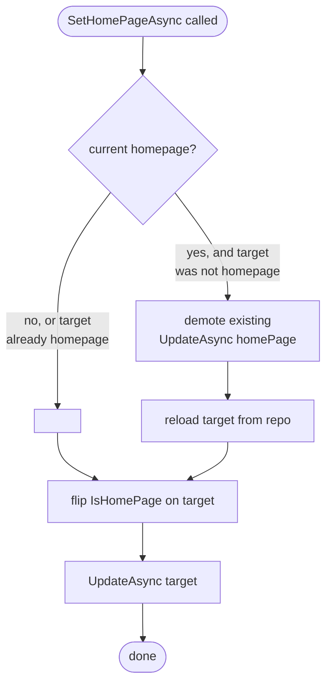

CMS Kit's pages capability is a tiny static-page system: title, slug, an HTML content blob, optional inline `<script>` and `<style>`, and a chosen layout. One page per tenant can be flagged as the home page. The whole capability lives under [`modules/cms-kit/src/Volo.CmsKit.Domain/Volo/CmsKit/Pages/`](https://github.com/abpframework/abp/tree/dev/modules/cms-kit/src/Volo.CmsKit.Domain/Volo/CmsKit/Pages).

## Folder contents

```
Pages/
├── Page.cs                              # the aggregate root
├── PageManager.cs                       # creation, slug check, home-page invariant
├── IPageRepository.cs                   # extends IBasicRepository<Page, Guid>
├── PageSlugAlreadyExistsException.cs    # business exception
└── MultipleHomePageException.cs         # business exception
```

That's it — pages are deliberately simple. Anything you'd expect to find here as a separate concept (comments, tags, ratings, reactions) is *polymorphic* and reuses the same generic aggregates.

## `Page` aggregate

```csharp
// modules/cms-kit/src/Volo.CmsKit.Domain/Volo/CmsKit/Pages/Page.cs
public class Page : FullAuditedAggregateRoot<Guid>, IMultiTenant, IHasEntityVersion
{
    public virtual Guid? TenantId { get; protected set; }
    public virtual string Title { get; protected set; }
    public virtual string Slug { get; protected set; }
    public virtual string Content { get; protected set; }
    public virtual string Script { get; protected set; }
    public virtual string Style { get; protected set; }
    public virtual bool IsHomePage { get; protected set; }
    public virtual int EntityVersion { get; protected set; }
    public virtual string LayoutName { get; protected set; }

    protected Page() { }

    internal Page(
        Guid id,
        [NotNull] string title,
        [NotNull] string slug,
        string content = null,
        string script = null,
        string style = null,
        string layoutName = null,
        Guid? tenantId = null) : base(id)
    {
        TenantId = tenantId;
        SetTitle(title);
        SetSlug(slug);
        SetContent(content);
        SetScript(script);
        SetStyle(style);
        SetLayoutName(layoutName);
    }

    public virtual void SetTitle(string title)
        => Title = Check.NotNullOrEmpty(title, nameof(title), PageConsts.MaxTitleLength);

    internal virtual void SetSlug(string slug)
        => Slug = SlugNormalizer.Normalize(Check.NotNullOrEmpty(slug, nameof(slug), PageConsts.MaxSlugLength));

    public virtual void SetContent(string content)
        => Content = Check.Length(content, nameof(content), PageConsts.MaxContentLength);

    public virtual void SetScript(string script)
        => Script = Check.Length(script, nameof(script), PageConsts.MaxScriptLength);

    public virtual void SetStyle(string style)
        => Style = Check.Length(style, nameof(style), PageConsts.MaxStyleLength);

    public virtual void SetLayoutName(string layoutName)
        => LayoutName = Check.Length(layoutName, nameof(layoutName), PageConsts.MaxLayoutNameLength);

    internal void SetIsHomePage(bool isHomePage)
    {
        IsHomePage = isHomePage;
    }
}
```

### Field semantics

| Field | Type | Notes |
| --- | --- | --- |
| `Title` | `string` | Displayed in `<title>` and as the page heading. Required. Max `PageConsts.MaxTitleLength`. |
| `Slug` | `string` | URL path. Run through [`SlugNormalizer`](/modules/cms-kit/domain#slugnormalizer), so `/` is allowed for nested paths like `docs/getting-started`. Required, unique per tenant. |
| `Content` | `string` | HTML body. Rendered as-is, so it is the host's responsibility to sanitize WYSIWYG input. |
| `Script` | `string` | Optional inline JS, emitted in a `<script>` block at the bottom of the layout. |
| `Style` | `string` | Optional inline CSS, emitted in a `<style>` block in `<head>`. |
| `LayoutName` | `string` | Optional Razor layout key (e.g. `"_PageLayout"`). Empty → host default. |
| `IsHomePage` | `bool` | Only one page per tenant can be `true`. Flipped through `PageManager.SetHomePageAsync`. Setter is `internal`. |
| `EntityVersion` | `int` | Bumped on every save (via `IHasEntityVersion`) for translation cache invalidation. |

### Why `internal` constructors and setters?

- The constructor is `internal`, so callers must go through `PageManager.CreateAsync` — that's how slug uniqueness is enforced.
- `SetSlug` is `internal`, so slug changes must go through `PageManager.SetSlugAsync`, which re-checks uniqueness.
- `SetIsHomePage` is `internal`, so home-page changes must go through `PageManager.SetHomePageAsync`, which atomically demotes the previous home page.

The public `SetTitle` / `SetContent` / `SetScript` / `SetStyle` / `SetLayoutName` are safe to call directly because they don't affect any invariants.

## `PageManager`

```csharp
// modules/cms-kit/src/Volo.CmsKit.Domain/Volo/CmsKit/Pages/PageManager.cs
public class PageManager : DomainService
{
    protected IPageRepository PageRepository { get; }

    public PageManager(IPageRepository pageRepository)
    {
        PageRepository = pageRepository;
    }

    public virtual async Task<Page> CreateAsync(
        [NotNull] string title,
        [NotNull] string slug,
        [CanBeNull] string content = null,
        [CanBeNull] string script = null,
        [CanBeNull] string style = null,
        [CanBeNull] string layoutName = null)
    {
        Check.NotNullOrEmpty(title, nameof(title));
        Check.NotNullOrEmpty(slug, nameof(slug));

        await CheckPageSlugAsync(slug);

        return new Page(
            GuidGenerator.Create(),
            title, slug,
            content, script, style, layoutName,
            CurrentTenant.Id);
    }

    public virtual async Task SetSlugAsync(Page page, [NotNull] string newSlug)
    {
        if (page.Slug != newSlug)
        {
            await CheckPageSlugAsync(newSlug);
            page.SetSlug(newSlug);
        }
    }

    public virtual async Task SetHomePageAsync(Page page)
    {
        var homePage = await GetHomePageAsync();

        if (!page.IsHomePage)
        {
            if (homePage != null)
            {
                homePage.SetIsHomePage(false);
                await PageRepository.UpdateAsync(homePage);
            }
            homePage = await PageRepository.GetAsync(page.Id);
        }

        homePage.SetIsHomePage(!page.IsHomePage);
        await PageRepository.UpdateAsync(homePage);
    }

    public virtual async Task<Page> GetHomePageAsync()
    {
        var currentHomePages = await PageRepository.GetListOfHomePagesAsync();

        if (currentHomePages.Count > 1)
        {
            throw new BusinessException("There can be only one home page.");
        }

        return currentHomePages.FirstOrDefault();
    }

    protected virtual async Task CheckPageSlugAsync(string slug)
    {
        if (await PageRepository.ExistsAsync(slug))
        {
            throw new PageSlugAlreadyExistsException(slug);
        }
    }
}
```

### Three behaviors worth highlighting

**1. Slug uniqueness on create and rename.** `CheckPageSlugAsync` calls `IPageRepository.ExistsAsync(slug)`, which runs through the current tenant filter. `SetSlugAsync` only re-checks if the slug actually changed.

**2. Home-page invariant.** `SetHomePageAsync` is a toggle. The flow:



Note the subtle re-fetch (`homePage = await PageRepository.GetAsync(page.Id)`) after demotion — it ensures the target is loaded fresh in case the demoted page and the target are different rows. The final `homePage.SetIsHomePage(!page.IsHomePage)` flips based on the *original* state, so the method behaves as a toggle.

**3. Defensive `GetHomePageAsync`.** If the database somehow contains more than one home page (race condition during migration, etc.), `GetHomePageAsync` throws `BusinessException("There can be only one home page.")` rather than silently picking one. `MultipleHomePageException` exists in the folder for higher layers to throw with a typed error code, though the manager itself uses a generic `BusinessException`.

## Repository contract

```csharp
// modules/cms-kit/src/Volo.CmsKit.Domain/Volo/CmsKit/Pages/IPageRepository.cs
public interface IPageRepository : IBasicRepository<Page, Guid>
{
    Task<int> GetCountAsync(string filter = null, CancellationToken cancellationToken = default);

    Task<List<Page>> GetListAsync(
        string filter = null,
        int maxResultCount = int.MaxValue,
        int skipCount = 0,
        string sorting = null,
        CancellationToken cancellationToken = default);

    Task<Page> GetBySlugAsync(string slug, CancellationToken cancellationToken = default);
    Task<Page> FindBySlugAsync(string slug, CancellationToken cancellationToken = default);
    Task<bool> ExistsAsync(string slug, CancellationToken cancellationToken = default);
    Task<List<Page>> GetListOfHomePagesAsync(CancellationToken cancellationToken = default);
    Task<string?> FindTitleAsync(Guid pageId, CancellationToken cancellationToken = default);
}
```

Notes:

- `IBasicRepository<Page, Guid>` (not `IRepository`) — pages don't need the full IQueryable surface; explicit query methods suffice.
- `GetBySlugAsync` throws if missing; `FindBySlugAsync` returns null. This is the standard ABP pattern.
- `GetListOfHomePagesAsync` returns a *list* — the manager treats `count > 1` as a bug.
- `FindTitleAsync` is a tiny projection used by the admin menu-item screen, which needs the page title when binding a menu item to a page id.

## Caching

The public side ([Public Application](/modules/cms-kit/public-application)) wraps page reads in an `IDistributedCache<PageCacheItem>`:

```csharp
public virtual async Task<PageDto> FindBySlugAsync(string slug)
{
    var cachedPage = await FindAndCacheBySlugAsync(slug);
    if (cachedPage == null) return null;
    return ObjectMapper.Map<PageCacheItem, PageDto>(cachedPage);
}
```

The cache key is `PageCacheItem.GetKey(slug)`. Admin mutations invalidate it through `PageCache.RemoveAsync(...)` in `PageAdminAppService`.

The default home page is cached separately under the key `PageConsts.DefaultHomePageCacheKey` so anonymous root-URL requests don't hit the database.

## Exceptions

```csharp
// modules/cms-kit/src/Volo.CmsKit.Domain/Volo/CmsKit/Pages/PageSlugAlreadyExistsException.cs
public class PageSlugAlreadyExistsException : BusinessException
{
    public PageSlugAlreadyExistsException([NotNull] string slug)
    {
        Code = CmsKitErrorCodes.Pages.SlugAlreadyExist;
        WithData(nameof(Page.Slug), slug);
    }
}
```

```csharp
// modules/cms-kit/src/Volo.CmsKit.Domain/Volo/CmsKit/Pages/MultipleHomePageException.cs
public class MultipleHomePageException : BusinessException
{
    public MultipleHomePageException()
    {
        Code = CmsKitErrorCodes.Pages.MultipleHomePage;
    }
}
```

Both error codes are defined in `Volo.CmsKit.Domain.Shared/CmsKitErrorCodes.cs`.

## URL routing

The host wires page slugs to a public Razor Page at `/Public/CmsKit/Pages/Index` — see [Web UI](/modules/cms-kit/web-ui). A typical `Startup` adds:

```csharp
app.UseEndpoints(endpoints =>
{
    endpoints.MapRazorPages();
    endpoints.MapFallback("/{*slug}", async ctx =>
    {
        // delegate to PagePublicAppService.FindBySlugAsync(ctx.Request.Path)
    });
});
```

Because `SlugNormalizer` allows `/` in slugs, the fallback can capture multi-segment slugs like `/docs/getting-started`.

## Related capabilities

- **Pages are commentable** by registering `"Page"` with `ICommentEntityTypeDefinitionStore`. See [Comments](/modules/cms-kit/comments).
- **Pages can carry tags / ratings / reactions** by registering `"Page"` with the corresponding definition store. See [Tags & Ratings](/modules/cms-kit/tags-and-ratings).
- **Pages can be linked from a menu** — `MenuItem.PageId` references a `Page.Id`, and `PageChangedHandler` keeps `MenuItem.Url` in sync. See [Menus & Media](/modules/cms-kit/menus-and-media).
- **Translating pages** — `Page` is `IHasEntityVersion`. Use the [Multi-lingual objects](/localization/multi-lingual-objects) pattern to translate `Title`, `Content`, `Script`, `Style`.
- **Admin endpoints** in [Admin Application](/modules/cms-kit/admin-application).
- **Public endpoints** in [Public Application](/modules/cms-kit/public-application).
