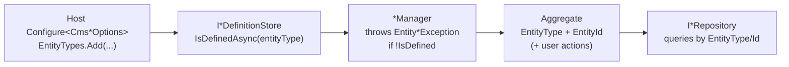

Tags and ratings are two independent CMS Kit capabilities that share the same architectural shape: a string `EntityType` + `EntityId` plus a definition store that controls which CLR types participate. Hosts register a type once; thereafter any of its rows can be tagged or rated.

**Source:** [`modules/cms-kit/src/Volo.CmsKit.Domain/Volo/CmsKit/Tags/`](https://github.com/abpframework/abp/tree/dev/modules/cms-kit/src/Volo.CmsKit.Domain/Volo/CmsKit/Tags) and [`Ratings/`](https://github.com/abpframework/abp/tree/dev/modules/cms-kit/src/Volo.CmsKit.Domain/Volo/CmsKit/Ratings).

## Tags

### Folder contents

```
Tags/
├── Tag.cs                              # aggregate: EntityType + Name
├── EntityTag.cs                        # join: TagId + EntityId
├── TagManager.cs                       # CRUD + GetOrAddAsync
├── EntityTagManager.cs                 # attach/detach to entities, SetEntityTags
├── ITagRepository.cs
├── IEntityTagRepository.cs
├── ITagDefinitionStore.cs
├── DefaultTagDefinitionStore.cs
├── TagEntityTypeDefiniton.cs           # PolicySpecifiedDefinition subclass
├── TagEntityTypeDefinitions.cs         # collection wrapper
├── CmsKitTagOptions.cs                 # options bag
├── PopularTag.cs                       # query projection (Name, Count)
├── TagAlreadyExistException.cs
└── EntityNotTaggableException.cs
```

### `Tag` aggregate

```csharp
// modules/cms-kit/src/Volo.CmsKit.Domain/Volo/CmsKit/Tags/Tag.cs
public class Tag : FullAuditedAggregateRoot<Guid>, IMultiTenant
{
    public virtual Guid? TenantId { get; protected set; }
    [NotNull] public virtual string EntityType { get; protected set; }
    [NotNull] public virtual string Name { get; protected set; }

    public Tag(
        Guid id,
        [NotNull] string entityType,
        [NotNull] string name,
        Guid? tenantId = null) : base(id)
    {
        EntityType = Check.NotNullOrEmpty(entityType, nameof(entityType), TagConsts.MaxEntityTypeLength);
        Name = Check.NotNullOrEmpty(name, nameof(name), TagConsts.MaxNameLength);
        TenantId = tenantId;
    }

    public virtual void SetName([NotNull] string name)
        => Name = Check.NotNullOrEmpty(name, nameof(name), TagConsts.MaxNameLength);

    public virtual void SetEntityType(string entityType)
        => EntityType = Check.NotNullOrEmpty(entityType, nameof(entityType), TagConsts.MaxEntityTypeLength);
}
```

A `Tag` is **scoped by `EntityType`**. The pair `(EntityType, Name)` is unique per tenant. This means:

- "summer" as a `BlogPost` tag and "summer" as a `Product` tag are *different rows*.
- A `Tag` is never shared across entity types — the host never wonders "is this tag for blog posts or for products?".

### `EntityTag` (the join)

```csharp
// modules/cms-kit/src/Volo.CmsKit.Domain/Volo/CmsKit/Tags/EntityTag.cs
public class EntityTag : Entity, IMultiTenant
{
    public virtual Guid TagId { get; set; }
    public virtual string EntityId { get; set; }
    public virtual Guid? TenantId { get; set; }

    internal EntityTag(Guid tagId, [NotNull] string entityId, Guid? tenantId = null)
    {
        TagId = tagId;
        EntityId = Check.NotNullOrEmpty(entityId, nameof(entityId));
        TenantId = tenantId;
    }

    public override object[] GetKeys()
    {
        return new object[] { TagId, EntityId };
    }
}
```

Composite key `(TagId, EntityId)`. `EntityType` is *not* on the join — it's already on the `Tag`.

### `TagManager`

```csharp
// modules/cms-kit/src/Volo.CmsKit.Domain/Volo/CmsKit/Tags/TagManager.cs
public class TagManager : DomainService
{
    protected ITagRepository TagRepository { get; }
    protected ITagDefinitionStore TagDefinitionStore { get; }

    public virtual async Task<Tag> GetOrAddAsync([NotNull] string entityType, [NotNull] string name)
    {
        var tag = await TagRepository.FindAsync(entityType, name);
        if (tag == null)
        {
            tag = await CreateAsync(GuidGenerator.Create(), entityType, name);
            await TagRepository.InsertAsync(tag);
        }
        return tag;
    }

    public virtual async Task<Tag> CreateAsync(Guid id, [NotNull] string entityType, [NotNull] string name)
    {
        if (!await TagDefinitionStore.IsDefinedAsync(entityType))
            throw new EntityNotTaggableException(entityType);

        if (await TagRepository.AnyAsync(entityType, name))
            throw new TagAlreadyExistException(entityType, name);

        return new Tag(id, entityType, name, CurrentTenant.Id);
    }

    public virtual async Task<Tag> UpdateAsync(Guid id, [NotNull] string name)
    {
        Check.NotNullOrEmpty(name, nameof(name));
        var tag = await TagRepository.GetAsync(id);
        if (name != tag.Name && await TagRepository.AnyAsync(tag.EntityType, name))
            throw new TagAlreadyExistException(tag.EntityType, name);
        tag.SetName(name);
        return tag;
    }
}
```

`GetOrAddAsync` is the "tag-on-the-fly" path used by the public side — a reader types a new tag in the input box, the manager creates the `Tag` row if needed, and then `EntityTagManager` attaches it. `CreateAsync` is the explicit admin path that errors on duplicates.

### `EntityTagManager`

```csharp
// modules/cms-kit/src/Volo.CmsKit.Domain/Volo/CmsKit/Tags/EntityTagManager.cs
public class EntityTagManager : DomainService
{
    protected IEntityTagRepository EntityTagRepository { get; }
    protected ITagRepository TagRepository { get; }
    protected ITagDefinitionStore TagDefinitionStore { get; }
    protected TagManager TagManager { get; }

    public virtual async Task<EntityTag> AddTagToEntityAsync(
        [NotNull] Guid tagId,
        [NotNull] string entityType,
        [NotNull] string entityId,
        [CanBeNull] Guid? tenantId = null,
        CancellationToken cancellationToken = default)
    {
        if (!await TagDefinitionStore.IsDefinedAsync(entityType))
            throw new EntityNotTaggableException(entityType);

        var entityTag = new EntityTag(tagId, entityId, tenantId);
        return await EntityTagRepository.InsertAsync(entityTag, cancellationToken: cancellationToken);
    }

    public virtual async Task RemoveTagFromEntityAsync(
        [NotNull] Guid tagId,
        [NotNull] string entityType,
        [NotNull] string entityId,
        [CanBeNull] Guid? tenantId = null,
        CancellationToken cancellationToken = default)
    {
        var entityTag = await EntityTagRepository.FindAsync(tagId, entityId, tenantId, cancellationToken);
        await EntityTagRepository.DeleteAsync(entityTag, cancellationToken: cancellationToken);
    }

    public async Task SetEntityTagsAsync(string entityType, string entityId, List<string> tags)
    {
        var existingTags = await TagRepository.GetAllRelatedTagsAsync(entityType, entityId);

        var deletedTags = existingTags.Where(x => !tags.Contains(x.Name)).ToList();
        var addedTags   = tags.Where(x => !existingTags.Any(a => a.Name == x));

        await EntityTagRepository.DeleteManyAsync(deletedTags.Select(s => s.Id).ToArray(), entityId);

        foreach (var addedTag in addedTags)
        {
            var tag = await TagManager.GetOrAddAsync(entityType, addedTag);
            await AddTagToEntityAsync(tag.Id, entityType, entityId, CurrentTenant?.Id);
        }
    }

    public async Task<List<string>> GetEntityIdsFilteredByTagAsync(
        [NotNull] Guid tagId,
        [CanBeNull] Guid? tenantId,
        CancellationToken cancellationToken = default)
        => await EntityTagRepository.GetEntityIdsFilteredByTagAsync(tagId, tenantId, cancellationToken);

    public async Task<List<string>> GetEntityIdsFilteredByTagNameAsync(
        [NotNull] string tagName,
        [NotNull] string entityType,
        [CanBeNull] Guid? tenantId,
        CancellationToken cancellationToken = default)
        => await EntityTagRepository.GetEntityIdsFilteredByTagNameAsync(tagName, entityType, tenantId, cancellationToken);
}
```

`SetEntityTagsAsync` is the **diff-apply** method called by both Admin and Public app services: pass the new list of tag names and the manager works out which to add (creating tag rows as needed) and which to remove.

`GetEntityIdsFilteredByTagAsync` powers the reverse lookup — "give me every blog post tagged 'summer'", which is what the public blog list page uses when the URL contains `?tagId=...`.

### Registering taggable types

```csharp
Configure<CmsKitTagOptions>(options =>
{
    options.EntityTypes.Add(new TagEntityTypeDefiniton(
        entityType: "BlogPost",
        createPolicies: new[] { CmsKitAdminPermissions.BlogPosts.Update }));

    options.EntityTypes.Add(new TagEntityTypeDefiniton(
        entityType: "Product",
        createPolicies: new[] { "MyApp.Products.Tag" }));
});
```

`TagEntityTypeDefiniton` (note the spelling — preserved for backward compatibility) extends [`PolicySpecifiedDefinition`](/modules/cms-kit/domain#policyspecifieddefinition), so each registration can carry permission policies. The Application layer checks these via `IAuthorizationService` before mutating.

### Repository

```csharp
// modules/cms-kit/src/Volo.CmsKit.Domain/Volo/CmsKit/Tags/ITagRepository.cs
public interface ITagRepository : IBasicRepository<Tag, Guid>
{
    Task<Tag> GetAsync(string entityType, string name, CancellationToken = default);
    Task<bool> AnyAsync(string entityType, string name, CancellationToken = default);
    Task<Tag> FindAsync(string entityType, string name, CancellationToken = default);
    Task<List<Tag>> GetListAsync(string filter, int max, int skip, string sorting, CancellationToken = default);
    Task<int> GetCountAsync(string filter, CancellationToken = default);
    Task<List<Tag>> GetAllRelatedTagsAsync(string entityType, string entityId, CancellationToken = default);
    Task<List<PopularTag>> GetPopularTagsAsync(string entityType, int maxCount, CancellationToken = default);
}
```

`GetPopularTagsAsync` returns a `(Name, Count)` projection used by the public `PopularTags` view component.

`IEntityTagRepository` exposes `GetEntityIdsFilteredByTagAsync` and `GetEntityIdsFilteredByTagNameAsync`, which is what `BlogPostPublicAppService.GetListAsync` uses to filter posts by tag.

---

## Ratings

### Folder contents

```
Ratings/
├── Rating.cs                                   # aggregate: 1–5 stars per (entity, user)
├── RatingManager.cs                            # upsert logic
├── IRatingRepository.cs
├── IRatingEntityTypeDefinitionStore.cs
├── DefaultRatingEntityTypeDefinitionStore.cs
├── RatingEntityTypeDefinition.cs               # PolicySpecifiedDefinition subclass
├── CmsKitRatingOptions.cs
├── RatingWithStarCountQueryResultItem.cs       # (StarCount, Count) projection
└── EntityCantHaveRatingException.cs
```

### `Rating` aggregate

```csharp
// modules/cms-kit/src/Volo.CmsKit.Domain/Volo/CmsKit/Ratings/Rating.cs
public class Rating : BasicAggregateRoot<Guid>, IHasCreationTime, IMustHaveCreator
{
    public virtual Guid? TenantId { get; protected set; }
    public virtual string EntityType { get; protected set; }
    public virtual string EntityId { get; protected set; }
    public virtual short StarCount { get; protected set; }
    public virtual Guid CreatorId { get; set; }
    public virtual DateTime CreationTime { get; set; }

    internal Rating(
        Guid id,
        [NotNull] string entityType,
        [NotNull] string entityId,
        short starCount,
        Guid creatorId,
        Guid? tenantId = null) : base(id)
    {
        EntityType = Check.NotNullOrWhiteSpace(entityType, nameof(entityType), RatingConsts.MaxEntityTypeLength);
        EntityId = Check.NotNullOrWhiteSpace(entityId, nameof(entityId), RatingConsts.MaxEntityIdLength);
        SetStarCount(starCount);
        CreatorId = creatorId;
        TenantId = tenantId;
    }

    public virtual void SetStarCount(short starCount)
    {
        if (starCount <= RatingConsts.MaxStarCount && starCount >= RatingConsts.MinStarCount)
        {
            StarCount = starCount;
        }
        else
        {
            throw new ArgumentOutOfRangeException(
                $"Choosen star must between {RatingConsts.MinStarCount} and {RatingConsts.MaxStarCount}");
        }
    }
}
```

Key differences from `Tag`:

- `BasicAggregateRoot` (no audit fields) — ratings are high-volume and don't need `LastModifierId`/`LastModificationTime`.
- `StarCount` is `short`. Range is `RatingConsts.MinStarCount` (1) to `MaxStarCount` (5). Out-of-range throws `ArgumentOutOfRangeException`.
- One row *per (EntityType, EntityId, CreatorId)* — enforced by the manager, not by a DB unique constraint.

### `RatingManager`

```csharp
// modules/cms-kit/src/Volo.CmsKit.Domain/Volo/CmsKit/Ratings/RatingManager.cs
public class RatingManager : DomainService
{
    protected IRatingRepository RatingRepository { get; }
    protected IRatingEntityTypeDefinitionStore RatingDefinitionStore { get; }

    public async Task<Rating> SetStarAsync(CmsUser user, string entityType, string entityId, short starCount)
    {
        var currentUserRating = await RatingRepository.GetCurrentUserRatingAsync(entityType, entityId, user.Id);

        if (currentUserRating != null)
        {
            currentUserRating.SetStarCount(starCount);
            return await RatingRepository.UpdateAsync(currentUserRating);
        }

        if (!await RatingDefinitionStore.IsDefinedAsync(entityType))
            throw new EntityCantHaveRatingException(entityType);

        return await RatingRepository.InsertAsync(
            new Rating(
                GuidGenerator.Create(),
                entityType, entityId,
                starCount,
                user.Id,
                CurrentTenant.Id));
    }
}
```

`SetStarAsync` is an **upsert**: if the user has rated this entity before, update the star count; otherwise insert. This is the *only* method on `RatingManager` — there is no separate "create" or "update". The user always sees their previous rating (if any) and can change it.

Notice that `RatingManager` *persists directly* (`UpdateAsync`/`InsertAsync` are inline). Most other managers in CMS Kit return the aggregate and leave persistence to the app service. The rating manager is an exception because the upsert pattern reads + writes in a single logical step.

The definition store is only checked on the *insert* path. Updates skip it — once a rating exists, the entity type was definitionally valid at insert time and we don't re-validate.

### Registering rateable types

```csharp
Configure<CmsKitRatingOptions>(options =>
{
    options.EntityTypes.Add(new RatingEntityTypeDefinition("BlogPost"));
    options.EntityTypes.Add(new RatingEntityTypeDefinition("Product"));
});
```

### Repository

```csharp
// IRatingRepository
public interface IRatingRepository : IBasicRepository<Rating, Guid>
{
    Task<Rating> GetCurrentUserRatingAsync(string entityType, string entityId, Guid userId, CancellationToken = default);
    Task<List<RatingWithStarCountQueryResultItem>> GetGroupedStarCountsAsync(string entityType, string entityId, CancellationToken = default);
    // ...
}
```

`GetGroupedStarCountsAsync` returns histogram data — five rows of `(StarCount, Count)` — which the public `Rating` view component renders as bar charts under the average.

## How the polymorphic pattern shows up

Both Tags and Ratings (and Comments, Reactions, Marked Items, Media Descriptors) follow the same skeleton:



Once you've seen one capability (tags), the others (ratings, reactions, marked items, comments, media) look almost identical — same definition store, same `EntityType` string, same definition-not-found exception, same registration pattern.

## Cross-references

- The same string-based `(EntityType, EntityId)` is used by [Comments](/modules/cms-kit/comments) and the reactions/marked-items in [Menus & Media](/modules/cms-kit/menus-and-media)'s sibling sections.
- Most often used to tag/rate blog posts ([Blogs](/modules/cms-kit/blogs)) and pages ([Pages](/modules/cms-kit/pages)).
- Admin endpoints: `TagAdminAppService`, `EntityTagAdminAppService` in [Admin Application](/modules/cms-kit/admin-application). There is no `RatingAdminAppService` — ratings are user-driven and admins only read them through aggregate queries.
- Public endpoints: `RatingPublicAppService` and the tag-related `TagPublicController` in [Public Application](/modules/cms-kit/public-application).
- View components: `Tags`, `PopularTags`, `Rating` in [Web UI](/modules/cms-kit/web-ui).
- Translating tag names: use [Multi-lingual objects](/localization/multi-lingual-objects). The [Blogging module](/modules/blogging/overview)'s legacy tag table is different — don't try to share data directly.
