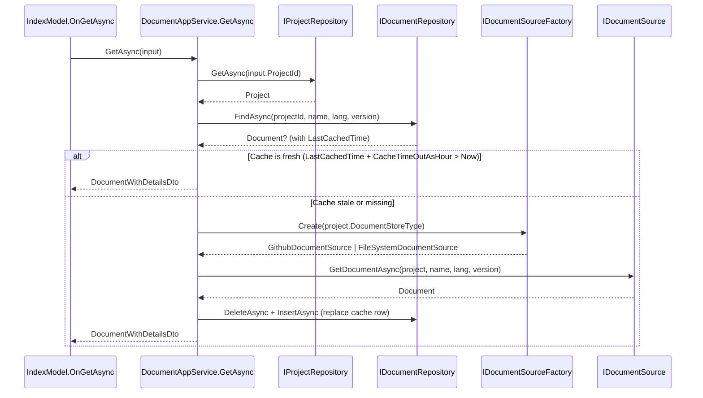
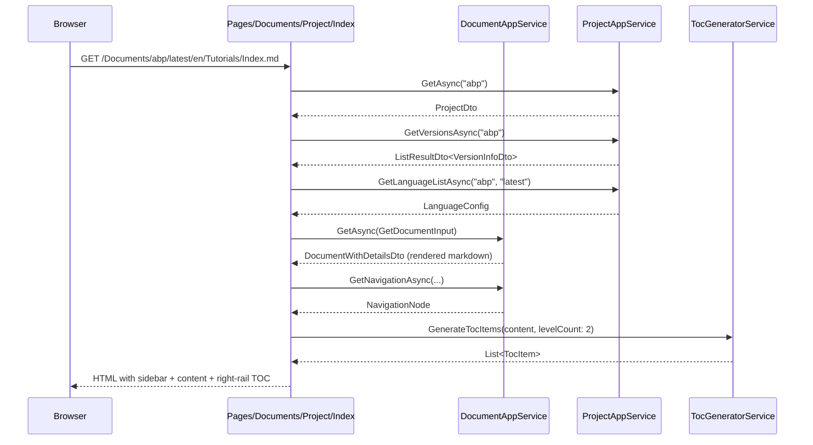

The Docs **Application** layer turns the domain ([`Project`](/modules/docs/domain#project-aggregate) + [`Document`](/modules/docs/domain#document-aggregate) + [`IDocumentSource`](/modules/docs/domain#idocumentsource-strategy)) into something a controller or Razor page can call. It is split into four projects so that the *reader* surface, the *admin* surface, and the *common-to-both* surface (project metadata, version lists, language config, PDF generation) can be referenced independently and protected by different permission sets.

The four projects covered here all live under [`modules/docs/src/`](https://github.com/abpframework/abp/tree/dev/modules/docs/src):

| Project | Purpose |
| --- | --- |
| `Volo.Docs.Application` | Public read-side document services (`DocumentAppService`, TOC). |
| `Volo.Docs.Application.Contracts` | DTOs + service interfaces for the public read side. |
| `Volo.Docs.Common.Application` | Cross-cutting read-side services used by both public and admin (`ProjectAppService`, `DocumentPdfAppService`). |
| `Volo.Docs.Admin.Application` | Authorized admin services for project CRUD + cache management. |
| `Volo.Docs.Admin.Application.Contracts` | Admin DTOs + permission definitions + service interfaces. |

## Service map

| Service | Project | Contract | Auth |
| --- | --- | --- | --- |
| [`DocumentAppService`](#documentappservice) | `Volo.Docs.Application` | `IDocumentAppService` | Anonymous (public reader) |
| [`ProjectAppService`](#projectappservice) | `Volo.Docs.Common.Application` | `IProjectAppService` | Anonymous (public reader) |
| [`DocumentPdfAppService`](#pdf-services) | `Volo.Docs.Common.Application` | `IDocumentPdfAppService` | Anonymous |
| [`TocGeneratorService`](#tocgeneratorservice) | `Volo.Docs.Application` | `ITocGeneratorService` | n/a (consumed in-process) |
| [`DocumentAdminAppService`](#documentadminappservice) | `Volo.Docs.Admin.Application` | `IDocumentAdminAppService` | `[Authorize(DocsAdminPermissions.Documents.Default)]` |
| [`ProjectAdminAppService`](#projectadminappservice) | `Volo.Docs.Admin.Application` | `IProjectAdminAppService` | `[Authorize(DocsAdminPermissions.Projects.Default)]` |
| [`DocumentPdfAdminAppService`](#pdf-services) | `Volo.Docs.Admin.Application` | `IDocumentPdfAdminAppService` | Admin |

## DocumentAppService

The headline reader service. File: [`Volo.Docs.Application/Volo/Docs/Documents/DocumentAppService.cs`](https://github.com/abpframework/abp/blob/dev/modules/docs/src/Volo.Docs.Application/Volo/Docs/Documents/DocumentAppService.cs). It owns the *read-through cache* pattern: when a reader asks for `(project, name, language, version)`, the service first looks in `IDocumentRepository`, falls back to the appropriate [`IDocumentSource`](/modules/docs/domain#idocumentsource-strategy), then persists the freshly fetched `Document` back into the repository.

```csharp
public class DocumentAppService : DocsAppServiceBase, IDocumentAppService
{
    public INavigationTreePostProcessor NavigationTreePostProcessor { get; set; }

    private readonly IProjectRepository      _projectRepository;
    private readonly IDocumentRepository     _documentRepository;
    private readonly IDocumentSourceFactory  _documentStoreFactory;
    protected IDistributedCache<DocumentResource>     ResourceCache       { get; }
    protected IDistributedCache<DocumentUpdateInfo>   DocumentUpdateCache { get; }
    protected IHostEnvironment                        HostEnvironment     { get; }
    private readonly IDocumentFullSearch    _documentFullSearch;
    private readonly DocsElasticSearchOptions _docsElasticSearchOptions;
    private readonly IConfiguration         _configuration;
    private readonly TimeSpan               _cacheTimeout;
    private readonly TimeSpan               _documentResourceAbsoluteExpiration;
    private readonly TimeSpan               _documentResourceSlidingExpiration;
}
```

The contract (`IDocumentAppService`) is small:

```csharp
public interface IDocumentAppService : IApplicationService
{
    Task<DocumentWithDetailsDto> GetAsync(GetDocumentInput input);
    Task<DocumentWithDetailsDto> GetDefaultAsync(GetDefaultDocumentInput input);
    Task<NavigationNode>         GetNavigationAsync(GetNavigationDocumentInput input);
    Task<DocumentParametersDto>  GetParametersAsync(GetParametersDocumentInput input);
    Task<DocumentResourceDto>    GetResourceAsync(GetDocumentResourceInput input);
    Task<PagedResultDto<DocumentSearchOutput>> SearchAsync(DocumentSearchInput input);
    Task<bool>                   FullSearchEnabledAsync();
    Task<List<string>>           GetUrlsAsync(string prefix);
}
```

### GetAsync — the hot path

```csharp
public virtual async Task<DocumentWithDetailsDto> GetAsync(GetDocumentInput input)
{
    var project = await _projectRepository.GetAsync(input.ProjectId);

    var inputVersionStringBuilder = new StringBuilder();
    input.Version = inputVersionStringBuilder
        .Append(GetProjectVersionPrefixIfExist(project))
        .Append(input.Version)
        .ToString();

    return await GetDocumentWithDetailsDtoAsync(
        project,
        input.Name,
        input.LanguageCode,
        input.Version
    );
}
```

`GetProjectVersionPrefixIfExist` reads `VersionBranchPrefix` from the project's extra properties when the GitHub version provider is set to `Branches` — see [Project.GetFullVersion](/modules/docs/domain#version-prefix-helper). Internally, `GetDocumentWithDetailsDtoAsync` does the cache lookup + factory dispatch:



### GetDefaultAsync

Reader hit the project root, no document name in the URL. The service synthesises the default name from the project's metadata:

```csharp
public virtual async Task<DocumentWithDetailsDto> GetDefaultAsync(GetDefaultDocumentInput input)
{
    var project = await _projectRepository.GetAsync(input.ProjectId);

    var sb = new StringBuilder();
    input.Version = sb.Append(GetProjectVersionPrefixIfExist(project)).Append(input.Version).ToString();
    sb.Clear();

    return await GetDocumentWithDetailsDtoAsync(
        project,
        sb.Append(project.DefaultDocumentName).Append(".").Append(project.Format).ToString(),
        input.LanguageCode,
        input.Version
    );
}
```

For a project where `DefaultDocumentName = "Index"` and `Format = "md"` this resolves to `Index.md`.

### GetNavigationAsync

The sidebar comes from `docs-nav.json` at the project root. The service:

1. Calls `GetDocumentWithDetailsDtoAsync(project, project.NavigationDocumentName, ...)` — the navigation file is itself a `Document` and goes through the same cache pipeline.
2. Deserialises into a `NavigationNode` tree.
3. Walks every leaf, looks up `DocumentUpdateInfo` from `IDistributedCache<DocumentUpdateInfo>`, and decorates each node with `CreationTime` / `LastUpdatedTime` so the UI can render "new" / "updated" badges.
4. Calls the pluggable `INavigationTreePostProcessor` (defaults to `NullNavigationTreePostProcessor.Instance`) — a seam for hosts that want to filter nodes by permission, A/B flags, etc.

```csharp
foreach (var leaf in leafs)
{
    var key = CacheKeyGenerator.GenerateDocumentUpdateInfoCacheKey(
        project, leaf.Path, input.LanguageCode, input.Version);
    var (_, documentUpdateInfo) = documentUpdateInfos.FirstOrDefault(x => x.Key == key);

    if (documentUpdateInfo == null) continue;

    leaf.CreationTime = documentUpdateInfo.CreationTime;
    leaf.LastUpdatedTime = documentUpdateInfo.LastUpdatedTime;
    leaf.LastSignificantUpdateTime = documentUpdateInfo.LastSignificantUpdateTime;
}
```

### GetResourceAsync

Binary resources (`?name=images/diagram.png`) cache as `IDistributedCache<DocumentResource>`:

```csharp
public virtual async Task<DocumentResourceDto> GetResourceAsync(GetDocumentResourceInput input)
{
    // ... factory + cache lookup, key = project + version + language + resourceName ...
    return new DocumentResourceDto { Content = bytes };
}
```

### SearchAsync & FullSearchEnabledAsync

Backed by `IDocumentFullSearch`. The default implementation in `Volo.Docs.Documents.FullSearch.Elastic.ElasticDocumentFullSearch` talks to Elasticsearch when `DocsElasticSearchOptions.Enable = true`; otherwise `FullSearchEnabledAsync()` returns `false` and the UI hides the search box. Indexing happens on document insert/update events fired by `DocumentAdminAppService`.

### Cache TTLs

```csharp
private TimeSpan GetCacheTimeout() => TimeSpan.FromHours(
    _configuration.GetValue("Volo.Docs:CacheTimeOutAsHour", 2.0));

private TimeSpan GetDocumentResourceAbsoluteExpirationTimeout() => TimeSpan.FromHours(
    _configuration.GetValue("Volo.Docs:DocumentResource.AbsoluteExpirationAsHour", 6.0));

private TimeSpan GetDocumentResourceSlidingExpirationTimeout() => TimeSpan.FromHours(
    _configuration.GetValue("Volo.Docs:DocumentResource.SlidingExpirationAsHour", 1.0));
```

All three are tunable per environment without recompiling.

## ProjectAppService

The "list / lookup projects, enumerate versions, enumerate languages" service. File: [`Volo.Docs.Common.Application/Volo/Docs/Common/Projects/ProjectAppService.cs`](https://github.com/abpframework/abp/blob/dev/modules/docs/src/Volo.Docs.Common.Application/Volo/Docs/Common/Projects/ProjectAppService.cs).

```csharp
public class ProjectAppService : DocsCommonAppServiceBase, IProjectAppService
{
    private readonly IProjectRepository                _projectRepository;
    private readonly IDistributedCache<List<VersionInfo>> _versionCache;
    private readonly IDocumentSourceFactory            _documentSource;
    protected IDistributedCache<LanguageConfig>        LanguageCache { get; }

    private readonly SemaphoreSlim _syncSemaphore = new SemaphoreSlim(1, 1);
}
```

`IProjectAppService` is the contract:

```csharp
public interface IProjectAppService : IApplicationService
{
    Task<ListResultDto<ProjectDto>>     GetListAsync();
    Task<ProjectDto>                    GetAsync(string shortName);
    Task<ListResultDto<VersionInfoDto>> GetVersionsAsync(string shortName);
    Task<LanguageConfig>                GetLanguageListAsync(string shortName, string version);
    Task<string>                        GetDefaultLanguageCodeAsync(string shortName, string version);
}
```

### Versions — fetched once, cached for 12 hours

```csharp
public virtual async Task<ListResultDto<VersionInfoDto>> GetVersionsAsync(string shortName)
{
    var project = await _projectRepository.GetByShortNameAsync(shortName);
    using (await _syncSemaphore.LockAsync())
    {
        var versions = await _versionCache.GetAsync(
            CacheKeyGenerator.GenerateProjectVersionsCacheKey(project));
        if (versions.IsNullOrEmpty())
        {
            versions = await GetVersionsAsync(project);   // -> IDocumentSource.GetVersionsAsync
            if (!versions.IsNullOrEmpty())
            {
                await _versionCache.SetAsync(
                    CacheKeyGenerator.GenerateProjectVersionsCacheKey(project),
                    versions,
                    new DistributedCacheEntryOptions
                    {
                        AbsoluteExpirationRelativeToNow = TimeSpan.FromHours(12),
                        SlidingExpiration               = TimeSpan.FromMinutes(60)
                    }
                );
            }
        }
        return new ListResultDto<VersionInfoDto>(
            ObjectMapper.Map<List<VersionInfo>, List<VersionInfoDto>>(versions));
    }
}
```

The `SemaphoreSlim` guards against thundering-herd refresh: when 100 readers hit a cold cache simultaneously, only one of them hits the GitHub API. The internal overload also trims the list at `Project.MinimumVersion` so historical, EOL releases never appear in the switcher.

### Languages — once-per-version, default detection

```csharp
public virtual async Task<string> GetDefaultLanguageCodeAsync(string shortName, string version)
{
    var languageList = await GetLanguageListInternalAsync(shortName, version);
    return (languageList.Languages.FirstOrDefault(l => l.IsDefault)
            ?? languageList.Languages.First()).Code;
}
```

Reads from `IDistributedCache<LanguageConfig>` keyed by project + version. If no language is flagged `IsDefault: true` in `docs-langs.json`, the first one wins. See [Multi-lingual objects](/localization/multi-lingual-objects) for ABP's broader per-property translation model — Docs uses this simpler whole-document approach.

### Hiding private properties

`GetListAsync` calls `HidePrivateProperties(projectDto)` before returning to anonymous callers — that strips secrets (PAT, internal paths) from the DTO even if they were persisted in `ExtraProperties`.

## TocGeneratorService

Per-page right-hand "in this page" table of contents, generated from the rendered Markdown. File: [`Volo.Docs.Application/Volo/Docs/TableOfContents/TocGeneratorService.cs`](https://github.com/abpframework/abp/blob/dev/modules/docs/src/Volo.Docs.Application/Volo/Docs/TableOfContents/TocGeneratorService.cs).

```csharp
public class TocGeneratorService : ITocGeneratorService, ITransientDependency
{
    private const int MinHeadingLevel = 1;
    private const int MaxHeadingLevel = 6;

    public virtual List<TocHeading> GenerateTocHeadings(string markdownContent)
    {
        if (markdownContent.IsNullOrWhiteSpace()) return new List<TocHeading>();

        var markdownPipeline = CreateMarkdownPipeline();
        var document = Markdig.Markdown.Parse(markdownContent, markdownPipeline);
        var headingBlocks = document.Descendants<HeadingBlock>();

        return headingBlocks.Select(CreateTocHeading).ToList();
    }

    public virtual List<TocItem> GenerateTocItems(string markdownContent, int levelCount, int? topLevel = null)
    {
        var headings = GenerateTocHeadings(markdownContent);
        if (headings.Count == 0) return new List<TocItem>();

        var resolvedTopLevel = topLevel ?? GetTopLevel(headings);
        return GenerateTocItems(headings, resolvedTopLevel, levelCount);
    }

    protected virtual MarkdownPipeline CreateMarkdownPipeline()
        => new MarkdownPipelineBuilder()
            .UseAutoIdentifiers(AutoIdentifierOptions.GitHub)
            .UseAdvancedExtensions()
            .Build();
}
```

A few subtleties worth highlighting:

<CardGroup cols={2}>
  <Card title="Auto-identifiers, GitHub style" icon="hashtag">
    `UseAutoIdentifiers(AutoIdentifierOptions.GitHub)` makes `## Project Aggregate` → `#project-aggregate`, matching the slug rules GitHub itself uses — so anchor links on the rendered page survive a copy/paste from the source file.
  </Card>
  <Card title="Smart top level" icon="layer-group">
    `GetTopLevel` finds the *shallowest* heading level that occurs more than once. Sentence: if a doc starts with one `#` and the rest of the structure is `##`/`###`, the TOC roots at `##`, not at the unique title.
  </Card>
  <Card title="Level count" icon="arrow-down-1-9">
    `levelCount` clamps depth. The Web layer passes `TocLevelCount = 2`, so the in-page TOC never goes more than two levels deep, keeping the right rail readable.
  </Card>
  <Card title="Recursion in Razor" icon="code">
    The output `List<TocItem>` is rendered by `Pages/Documents/Project/TableOfContents.cshtml` — see the [Web page](/modules/docs/web#tableofcontents-component) for the recursive `<ul>`.
  </Card>
</CardGroup>

## Admin services

The admin surface lives in `Volo.Docs.Admin.Application`. It is *not* a CMS — admins manage projects and bust caches; they do not edit document content (that lives in Git or on disk).

### Permissions

`DocsAdminPermissions` (`Volo.Docs.Admin.Application.Contracts`) declares two trees:

```csharp
public static class DocsAdminPermissions
{
    public const string GroupName = "Docs";

    public static class Projects
    {
        public const string Default = GroupName + ".Projects";
        public const string Create  = Default + ".Create";
        public const string Edit    = Default + ".Edit";
        public const string Delete  = Default + ".Delete";
    }

    public static class Documents
    {
        public const string Default = GroupName + ".Documents";
        public const string Delete  = Default + ".Delete";
        public const string Pull    = Default + ".Pull";
    }
}
```

### ProjectAdminAppService

File: [`Volo.Docs.Admin.Application/Volo/Docs/Admin/Projects/ProjectAdminAppService.cs`](https://github.com/abpframework/abp/blob/dev/modules/docs/src/Volo.Docs.Admin.Application/Volo/Docs/Admin/Projects/ProjectAdminAppService.cs). Full CRUD + reindex.

```csharp
[Authorize(DocsAdminPermissions.Projects.Default)]
public class ProjectAdminAppService : ApplicationService, IProjectAdminAppService
{
    private readonly IProjectRepository    _projectRepository;
    private readonly IDocumentRepository   _documentRepository;
    private readonly IDocumentFullSearch   _elasticSearchService;
    private readonly IGuidGenerator        _guidGenerator;
    private readonly IProjectPdfFileStore  _projectPdfFileStore;

    public virtual async Task<PagedResultDto<ProjectDto>> GetListAsync(
        PagedAndSortedResultRequestDto input)
    {
        var projects = await _projectRepository.GetListAsync(
            input.Sorting, input.MaxResultCount, input.SkipCount);
        var totalCount = await _projectRepository.GetCountAsync();

        return new PagedResultDto<ProjectDto>(
            totalCount,
            ObjectMapper.Map<List<Project>, List<ProjectDto>>(projects));
    }
}
```

The contract:

```csharp
public interface IProjectAdminAppService : IApplicationService
{
    Task<PagedResultDto<ProjectDto>>    GetListAsync(PagedAndSortedResultRequestDto input);
    Task<ProjectDto>                    GetAsync(Guid id);
    Task<ProjectDto>                    CreateAsync(CreateProjectDto input);
    Task<ProjectDto>                    UpdateAsync(Guid id, UpdateProjectDto input);
    Task                                DeleteAsync(Guid id);
    Task                                ReindexAsync(ReindexInput input);
    Task                                ReindexAllAsync();
    Task<List<ProjectWithoutDetailsDto>> GetListWithoutDetailsAsync();
}
```

<Note>
**ReindexAllAsync** walks every project, every cached document, and pushes them into `IDocumentFullSearch.AddOrUpdateAsync`. Use it after upgrading Elasticsearch mappings or after restoring a database snapshot without Elastic state.
</Note>

### DocumentAdminAppService

File: [`Volo.Docs.Admin.Application/Volo/Docs/Admin/Documents/DocumentAdminAppService.cs`](https://github.com/abpframework/abp/blob/dev/modules/docs/src/Volo.Docs.Admin.Application/Volo/Docs/Admin/Documents/DocumentAdminAppService.cs). This is where the **Pull** and **Clear cache** admin buttons live.

```csharp
[Authorize(DocsAdminPermissions.Documents.Default)]
public class DocumentAdminAppService : ApplicationService, IDocumentAdminAppService
{
    private readonly IProjectRepository    _projectRepository;
    private readonly IDocumentRepository   _documentRepository;
    private readonly IDocumentSourceFactory _documentStoreFactory;
    private readonly IDistributedCache<DocumentUpdateInfo> _documentUpdateCache;
    private readonly IDistributedCache<List<VersionInfo>>  _versionCache;
    private readonly IDistributedCache<LanguageConfig>     _languageCache;
    private readonly IDocumentFullSearch _elasticSearchService;
}
```

**ClearCacheAsync** wipes both *distributed* caches (versions, languages, per-document update info) and forces the database-side cache to look stale by setting `LastCachedTime = DateTime.MinValue`:

```csharp
public virtual async Task ClearCacheAsync(ClearCacheInput input)
{
    var project = await _projectRepository.GetAsync(input.ProjectId);

    await _languageCache.RemoveAsync(CacheKeyGenerator.GenerateProjectLanguageCacheKey(project), true);
    await _versionCache.RemoveAsync(CacheKeyGenerator.GenerateProjectVersionsCacheKey(project), true);

    var documents = await _documentRepository.GetListWithoutDetailsByProjectId(project.Id);
    var keys = documents.Select(d =>
        CacheKeyGenerator.GenerateDocumentUpdateInfoCacheKey(project, d.Name, d.LanguageCode, d.Version));
    await _documentUpdateCache.RemoveManyAsync(keys);

    await _documentRepository.UpdateProjectLastCachedTimeAsync(project.Id, DateTime.MinValue);
}
```

**PullAllAsync** reads the project's navigation document, walks every leaf, and forces a re-fetch of each one via the source:

```csharp
public virtual async Task PullAllAsync(PullAllDocumentInput input)
{
    var project = await _projectRepository.GetAsync(input.ProjectId);

    var navigationDocument = await GetDocumentAsync(
        project, project.NavigationDocumentName, input.LanguageCode, input.Version);

    if (!DocsJsonSerializerHelper.TryDeserialize<NavigationNode>(
            navigationDocument.Content, out var navigation))
    {
        throw new UserFriendlyException(
            $"Cannot validate navigation file '{project.NavigationDocumentName}' for the project {project.Name}.");
    }

    var leafs = navigation.Items
        .GetAllNodes(x => x.Items)
        .Where(x => x.IsLeaf && !x.Path.IsNullOrWhiteSpace())
        .ToList();

    var source = _documentStoreFactory.Create(project.DocumentStoreType);

    foreach (var leaf in leafs)
    {
        // Skip external links and placeholders like {{templates}}
        if (leaf.Path.StartsWith("http://", StringComparison.OrdinalIgnoreCase) ||
            leaf.Path.StartsWith("https://", StringComparison.OrdinalIgnoreCase) ||
            (leaf.Path.StartsWith("{{") && leaf.Path.EndsWith("}}")))
        {
            continue;
        }

        try
        {
            var sourceDocument = await source.GetDocumentAsync(
                project, leaf.Path, input.LanguageCode, input.Version);

            await _documentRepository.DeleteAsync(sourceDocument.ProjectId,
                sourceDocument.Name, sourceDocument.LanguageCode, sourceDocument.Version);
            await _documentRepository.InsertAsync(sourceDocument, true);
            await UpdateDocumentUpdateInfoCache(sourceDocument);
        }
        catch (Exception e)
        {
            Logger.LogException(e);
        }
    }
}
```

<Warning>
**Pull all is expensive.** Each leaf triggers an Octokit call (`GithubDocumentSource`) or a disk read (`FileSystemDocumentSource`). For a large project + multiple languages this can take minutes and burns GitHub API quota. The admin UI's "Pull" page calls a `Volo.Docs.Admin.BackgroundJobs.DocumentPullBackgroundJob` to run the work off-thread.
</Warning>

The full contract:

```csharp
public interface IDocumentAdminAppService : IApplicationService
{
    Task ClearCacheAsync(ClearCacheInput input);
    Task PullAllAsync(PullAllDocumentInput input);
    Task PullAsync(PullDocumentInput input);
    Task<PagedResultDto<DocumentDto>> GetAllAsync(GetAllInput input);
    Task RemoveFromCacheAsync(Guid documentId);
    Task ReindexAsync(Guid documentId);
    Task<List<DocumentInfoDto>>            GetFilterItemsAsync();
    Task<List<ProjectWithoutDetailsDto>>   GetProjectsAsync();
}
```

`GetAllAsync` fronts the admin "Documents" grid — its `GetAllInput` carries every filter you saw on `IDocumentRepository.GetAllAsync`. `GetFilterItemsAsync` returns distinct `(Name, LanguageCode, Version)` triples that populate the filter drop-downs.

<Note>
**There is no `DocsAdminAppService` god-service.** Project admin and document admin are two distinct services with two distinct permission roots (`Docs.Projects` and `Docs.Documents`). A user can be granted "pull docs" without being granted "delete projects".
</Note>

## PDF services

A pair of services handles the optional "download PDF" feature:

| Service | Project | Responsibility |
| --- | --- | --- |
| `DocumentPdfAppService` | `Volo.Docs.Common.Application` | Reader-side: streams a previously generated PDF file via `IProjectPdfFileStore`. |
| `DocumentPdfAdminAppService` | `Volo.Docs.Admin.Application` | Admin-side: schedules `DocumentPdfGenerateBackgroundJob` to render a project version into a PDF, lists generated files, removes them. |

The actual HTML→PDF conversion is done by an `IDocumentToHtmlConverter` whose name starts with `DocsDomainConsts.PdfDocumentToHtmlConverterPrefix` (`pdf-`) — a separate converter from the on-screen one, because the PDF needs absolute-URL assets and tighter CSS.

## DTO catalogue

The application contracts projects publish a small zoo of DTOs. The most important ones:

<Accordion title="Document DTOs (Volo.Docs.Application.Contracts/Documents)">
- `GetDocumentInput { Guid ProjectId; string Name; string LanguageCode; string Version; }`
- `GetDefaultDocumentInput { Guid ProjectId; string LanguageCode; string Version; }`
- `GetNavigationDocumentInput`, `GetParametersDocumentInput`, `GetDocumentResourceInput`
- `DocumentWithDetailsDto` — full payload returned to the renderer (content + metadata + contributors).
- `DocumentResourceDto { byte[] Content; }`
- `DocumentSearchInput / DocumentSearchOutput` — Elastic-powered full-text search.
- `DocumentContributorDto`, `DocumentParameterDto`, `DocumentParametersDto`.
</Accordion>

<Accordion title="Project DTOs (Volo.Docs.Common.Application.Contracts/Projects)">
- `ProjectDto` — public-safe projection of `Project` (no PAT, no internal path).
- `VersionInfoDto { string Name; string DisplayName; }`
- `LanguageConfig` is reused directly from `Volo.Docs.Domain.Shared`.
</Accordion>

<Accordion title="Admin DTOs (Volo.Docs.Admin.Application.Contracts)">
- `CreateProjectDto`, `UpdateProjectDto` — full property set including extra-property fields.
- `GetAllInput` — every filter on the admin Documents grid.
- `PullDocumentInput`, `PullAllDocumentInput`, `ClearCacheInput`.
- `ReindexInput { Guid ProjectId; }`
- `DocumentInfoDto`, `DocumentDto`, `ProjectWithoutDetailsDto`.
</Accordion>

## End-to-end: a single reader request



## Related reading

<CardGroup cols={2}>
  <Card title="Docs Domain layer" icon="cube" href="/modules/docs/domain">
    The `Project`, `Document`, and `IDocumentSource` types every service on this page depends on.
  </Card>
  <Card title="Docs Web UI" icon="window-maximize" href="/modules/docs/web">
    Razor Pages that call these services — reader pages and the admin back office.
  </Card>
  <Card title="CMS Kit overview" icon="newspaper" href="/modules/cms-kit/overview">
    Editable-content sister module — shows what an in-app content-editing admin surface looks like instead.
  </Card>
  <Card title="Multi-lingual objects" icon="language" href="/localization/multi-lingual-objects">
    Per-property translation primitives — useful when your custom `IDocumentSource` is backed by a database rather than files.
  </Card>
</CardGroup>
