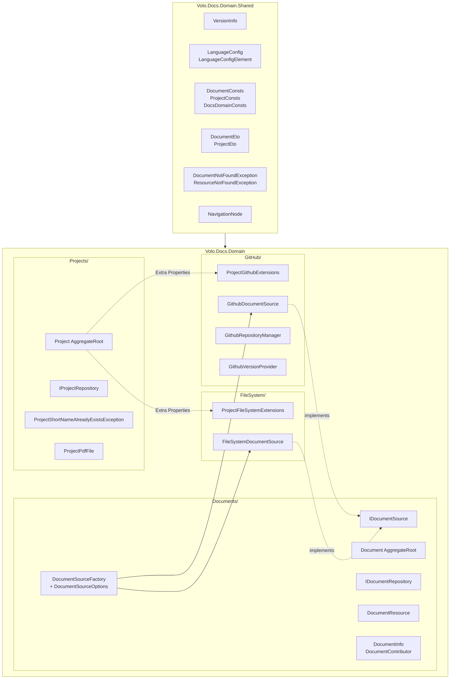
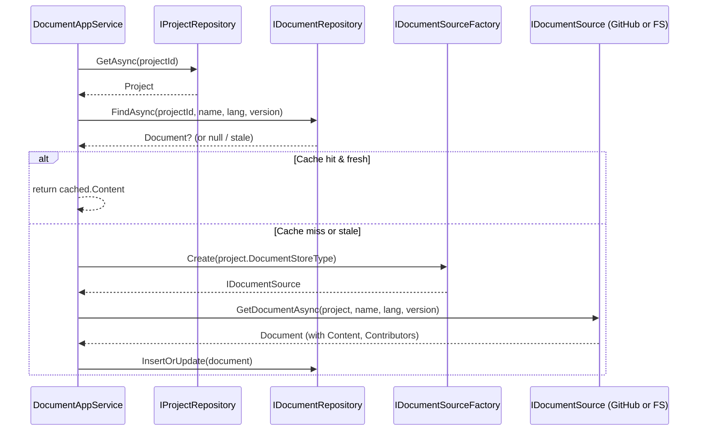

The Docs **Domain** layer is the heart of ABP's documentation engine. It defines two aggregate roots — `Project` and `Document` — and a single strategy interface, `IDocumentSource`, whose implementations know how to talk to a real document store. The domain knows nothing about HTTP, Markdown rendering, or UI; it only models *projects, documents, versions, languages,* and *how to fetch a document by name*.

All types on this page live under [`modules/docs/src/Volo.Docs.Domain/Volo/Docs/`](https://github.com/abpframework/abp/tree/dev/modules/docs/src/Volo.Docs.Domain/Volo/Docs) and [`modules/docs/src/Volo.Docs.Domain.Shared/Volo/Docs/`](https://github.com/abpframework/abp/tree/dev/modules/docs/src/Volo.Docs.Domain.Shared/Volo/Docs).

## Layer map



## Project aggregate

`Volo.Docs.Projects.Project` is an `AggregateRoot<Guid>` describing one documentation set. File: [`Volo.Docs.Domain/Volo/Docs/Projects/Project.cs`](https://github.com/abpframework/abp/blob/dev/modules/docs/src/Volo.Docs.Domain/Volo/Docs/Projects/Project.cs).

```csharp
public class Project : AggregateRoot<Guid>
{
    public virtual string Name { get; protected set; }
    public virtual string ShortName { get; protected set; }            // lower-cased, used in URLs
    public virtual string Format { get; protected set; }               // "md" or "html"
    public virtual string DefaultDocumentName { get; protected set; }  // default "Index"
    public virtual string NavigationDocumentName { get; protected set; } // default "docs-nav.json"
    public virtual string ParametersDocumentName { get; protected set; } // default "docs-params.json"
    public virtual string MinimumVersion { get; set; }
    public virtual string DocumentStoreType { get; protected set; }    // "GitHub" | "FileSystem" | custom
    public virtual string MainWebsiteUrl { get; set; }
    public virtual string LatestVersionBranchName { get; set; }
    public virtual List<ProjectPdfFile> PdfFiles { get; set; }

    public Project(
        Guid id,
        [NotNull] string name,
        [NotNull] string shortName,
        [NotNull] string documentStoreType,
        [NotNull] string format,
        [NotNull] string defaultDocumentName = "Index",
        [NotNull] string navigationDocumentName = "docs-nav.json",
        [NotNull] string parametersDocumentName = "docs-params.json")
        : base(id)
    { /* Check.NotNullOrWhiteSpace on every required arg, then NormalizeShortName() */ }
}
```

A few things to notice:

- `ShortName` is the URL slug. The constructor calls `NormalizeShortName()` which lower-cases it. `IProjectRepository.ShortNameExistsAsync` is consulted before creation so that two projects can't collide.
- `DocumentStoreType` is a string, not an enum. It is the lookup key into `DocumentSourceOptions.Sources` — the strategy plug-in table.
- `Format` doubles as the file extension (`Index.md` vs `Index.html`) and the renderer selector on the Web side.
- `NavigationDocumentName` / `ParametersDocumentName` point at JSON files inside the source. The first describes the sidebar, the second carries UI parameters.

### Extra properties

Source-specific configuration is stashed in `IHasExtraProperties` rather than the schema. The GitHub and file-system extension classes encapsulate the keys.

<Tabs>
  <Tab title="GitHub keys">
    `Volo.Docs.GitHub.Projects.ProjectGithubExtensions`:

    ```csharp
    public static string GetGitHubUrl(this Project project)
        => project.GetProperty<string>("GitHubRootUrl");

    public static string GetGitHubUrl(this Project project, string version)
        => project.GetGitHubUrl().Replace("{version}", version);

    public static string GetGitHubAccessTokenOrNull(this Project project)
        => project.GetProperty<string>("GitHubAccessToken");

    public static string GetGithubUserAgentOrNull(this Project project)
        => project.GetProperty<string>("GitHubUserAgent");
    ```

    Plus `"GithubVersionProviderSource"` (`Releases` / `Branches`) and `"VersionBranchPrefix"` read by `Project.GetFullVersion` / `GetProjectVersionPrefixIfExist`.
  </Tab>
  <Tab title="File-system keys">
    `Volo.Docs.FileSystem.Projects.ProjectFileSystemExtensions` exposes a single property:

    ```csharp
    public static string GetFileSystemPath(this Project project)
        => project.GetProperty<string>("Path");
    ```

    The folder must contain `docs-langs.json` at its root and per-language subfolders (`en/`, `tr/`, ...). Each language folder holds the actual documents and `docs-nav.json`.
  </Tab>
</Tabs>

### Version prefix helper

`Project.GetFullVersion(string version)` prepends `VersionBranchPrefix` when the GitHub provider is set to `Branches`. This lets editors enter clean version numbers (`8.0.0`) in the UI while the GitHub URL points at `rel-8.0.0`.

```csharp
public virtual string GetFullVersion(string version)
{
    var prefix = GetProjectVersionPrefixIfExist(this);
    if (string.IsNullOrWhiteSpace(prefix) ||
        version.StartsWith(prefix, StringComparison.OrdinalIgnoreCase))
    {
        return version;
    }
    return new StringBuilder().Append(prefix).Append(version).ToString();
}
```

### Domain exception

```csharp
public class ProjectShortNameAlreadyExistsException : BusinessException
{
    public ProjectShortNameAlreadyExistsException(string shortName)
        : base("Volo.Docs.Domain:010002")
    {
        WithData("ShortName", shortName);
    }
}
```

Localized via the `Volo.Docs.Domain` localization resource.

## Document aggregate

`Volo.Docs.Documents.Document` is also `AggregateRoot<Guid>`. It stores one *rendered-source* document, keyed implicitly by `(ProjectId, Name, LanguageCode, Version)`. File: [`Volo.Docs.Domain/Volo/Docs/Documents/Document.cs`](https://github.com/abpframework/abp/blob/dev/modules/docs/src/Volo.Docs.Domain/Volo/Docs/Documents/Document.cs).

```csharp
public class Document : AggregateRoot<Guid>
{
    public virtual Guid ProjectId { get; protected set; }
    public virtual string Name { get; protected set; }        // e.g. "Tutorials/Index.md"
    public virtual string Version { get; protected set; }
    public virtual string LanguageCode { get; protected set; }

    public virtual string FileName { get; set; }              // "Index.md"
    public virtual string Content { get; set; }               // raw markdown / html
    public virtual string Format { get; set; }                // "md" / "html"
    public virtual string EditLink { get; set; }              // "edit on GitHub" target
    public virtual string RootUrl { get; set; }
    public virtual string RawRootUrl { get; set; }
    public virtual string LocalDirectory { get; set; }

    public virtual DateTime CreationTime { get; set; }
    public virtual DateTime LastUpdatedTime { get; set; }
    public virtual DateTime? LastSignificantUpdateTime { get; set; }
    public virtual DateTime LastCachedTime { get; set; }

    public virtual List<DocumentContributor> Contributors { get; set; }

    public virtual void AddContributor(string username, string userProfileUrl,
                                       string avatarUrl, int commitCount = 1)
        => Contributors.AddIfNotContains(
            new DocumentContributor(Id, username, userProfileUrl, avatarUrl, commitCount));

    public virtual void RemoveAllContributors() => Contributors.Clear();
}
```

The aggregate is intentionally anaemic — the heavy lifting (fetching, parsing, committer aggregation) lives in the source classes that *populate* `Document` instances.

<Note>
**Why `LastCachedTime`?** `Document` rows are a server-side cache, not the system of record. `DocumentAppService` compares `LastCachedTime + CacheTimeOutAsHour` to `Clock.Now` to decide whether to re-fetch from the source. The cache TTL is configurable through `IConfiguration["Volo.Docs:CacheTimeOutAsHour"]` (default `2`).
</Note>

### Document-side value objects

| Type | Purpose |
| --- | --- |
| `DocumentContributor` | Username + profile URL + avatar + commit count. Populated by `GithubDocumentSource` from Octokit commit metadata. |
| `DocumentResource` | `byte[] Content` wrapper for binary resources (images, archives) returned by `IDocumentSource.GetResource`. |
| `DocumentInfo` | Distinct `(Name, LanguageCode, Version)` projection used by admin listings. |
| `DocumentWithoutDetails` / `DocumentWithoutContent` | Lightweight projections returned by `IDocumentRepository` for indexes that don't need the full `Content` blob. |
| `DocumentEto` | Distributed-event-bus payload (`Volo.Docs.Domain.Shared`). |

## IDocumentSource strategy

This is the seam between "where docs live" and "how the engine reads them". File: [`Documents/IDocumentSource.cs`](https://github.com/abpframework/abp/blob/dev/modules/docs/src/Volo.Docs.Domain/Volo/Docs/Documents/IDocumentSource.cs).

```csharp
public interface IDocumentSource : IDomainService
{
    Task<Document> GetDocumentAsync(
        Project project, string documentName,
        string languageCode, string version,
        DateTime? lastKnownSignificantUpdateTime = null);

    Task<List<VersionInfo>> GetVersionsAsync(Project project);

    Task<DocumentResource> GetResource(
        Project project, string resourceName,
        string languageCode, string version);

    Task<LanguageConfig> GetLanguageListAsync(Project project, string version);
}
```

Four responsibilities — fetch a document, enumerate versions, fetch a binary resource, enumerate languages. Every implementation answers the same questions in its own way.

### DocumentSourceFactory

`Volo.Docs.Documents.DocumentSourceFactory` resolves the right implementation by looking up `Project.DocumentStoreType` in `DocumentSourceOptions.Sources`:

```csharp
public class DocumentSourceFactory : IDocumentSourceFactory, ITransientDependency
{
    protected DocumentSourceOptions Options { get; }
    protected IServiceProvider ServiceProvider { get; }

    public virtual IDocumentSource Create(string sourceType)
    {
        var serviceType = Options.Sources.GetOrDefault(sourceType);
        if (serviceType == null)
        {
            throw new ApplicationException($"Unknown document store: {sourceType}");
        }
        return (IDocumentSource) ServiceProvider.GetRequiredService(serviceType);
    }
}
```

```csharp
public class DocumentSourceOptions
{
    public Dictionary<string, Type> Sources { get; set; } = new();
}
```

The two built-in entries are added by `DocsDomainModule`:

```csharp
Configure<DocumentSourceOptions>(options =>
{
    options.Sources[GithubDocumentSource.Type]     = typeof(GithubDocumentSource);
    options.Sources[FileSystemDocumentSource.Type] = typeof(FileSystemDocumentSource);
});
```

Plugging in a third source is purely additive — register the service, then add the dictionary entry.

## GithubDocumentSource

File: [`GitHub/Documents/GithubDocumentSource.cs`](https://github.com/abpframework/abp/blob/dev/modules/docs/src/Volo.Docs.Domain/Volo/Docs/GitHub/Documents/GithubDocumentSource.cs).

```csharp
public class GithubDocumentSource : DomainService, IDocumentSource
{
    public const string Type = "GitHub";

    private readonly IGithubRepositoryManager _githubRepositoryManager;
    private readonly IGithubPatchAnalyzer _githubPatchAnalyzer;
    private readonly IDocumentRepository _documentRepository;
    private readonly DocsGithubLanguageOptions _docsGithubLanguageOptions;

    public virtual async Task<Document> GetDocumentAsync(
        Project project, string documentName, string languageCode, string version,
        DateTime? lastKnownSignificantUpdateTime = null)
    {
        var rootUrl     = project.GetGitHubUrl(version);
        var rawRootUrl  = CalculateRawRootUrlWithLanguageCode(rootUrl, languageCode);
        var editLink    = rootUrl.ReplaceFirst("/tree/", "/blob/")
                                 .EnsureEndsWith('/') + languageCode + "/" + documentName;

        var content = await DownloadWebContentAsStringAsync(project, documentName, languageCode, version);
        var commits = await GetGitHubCommitsOrNull(project, documentName, languageCode, version);

        var document = new Document(
            GuidGenerator.Create(),
            project.Id,
            documentName, version, languageCode,
            fileName: documentName.Contains("/")
                ? documentName.Substring(documentName.LastIndexOf('/') + 1)
                : documentName,
            content,
            project.Format,
            editLink,
            rootUrl,
            rawRootUrl,
            localDirectory: documentName.Contains("/")
                ? documentName.Substring(0, documentName.LastIndexOf('/'))
                : "",
            creationTime:  GetFirstCommitDate(commits),
            lastUpdatedTime: GetLastCommitDate(commits),
            lastCachedTime: DateTime.Now,
            lastSignificantUpdateTime: /* computed via _githubPatchAnalyzer */);

        foreach (var author in GetAuthors(commits))
        {
            document.AddContributor(author.Login, author.HtmlUrl, author.AvatarUrl, author.CommitCount);
        }
        return document;
    }
}
```

### Supporting collaborators

<CardGroup cols={2}>
  <Card title="IGithubRepositoryManager" icon="github">
    Wraps Octokit. Exposes `GetFileContentsAsStringAsync` (uses `raw.githubusercontent.com`), `GetReleasesAsync`, `GetBranchesAsync`, `GetCommitsAsync`. Authenticates with the optional PAT from `project.GetGitHubAccessTokenOrNull()`.
  </Card>
  <Card title="IGithubPatchAnalyzer" icon="diff">
    Walks the patch of each commit touching the document and decides whether the change was *significant* (non-trivial diff) — that drives `LastSignificantUpdateTime`, which is what the UI surfaces as "last meaningful update".
  </Card>
  <Card title="GithubVersionProvider" icon="code-branch">
    Under `GitHub/Documents/Version/`. Picks `repository.releases` or `repository.branches` based on `project.GetProperty("GithubVersionProviderSource")` and projects them into `VersionInfo` rows.
  </Card>
  <Card title="DocsGithubLanguageOptions" icon="language">
    Options object listing supported language codes for GitHub-backed projects, used when `docs-langs.json` is missing.
  </Card>
</CardGroup>

```csharp
public virtual async Task<DocumentResource> GetResource(
    Project project, string resourceName, string languageCode, string version)
{
    var content = await _githubRepositoryManager
        .GetFileContentsAsByteArrayAsync(project, version, resourceName);
    return new DocumentResource(content);
}
```

<Warning>
**Rate limits matter.** Anonymous GitHub API calls are capped at 60/hour. Always set `"GitHubAccessToken"` on production projects — `IGithubRepositoryManager` injects it as a PAT, lifting the cap to 5 000/hour and letting you read private repos.
</Warning>

## FileSystemDocumentSource

File: [`FileSystem/Documents/FileSystemDocumentSource.cs`](https://github.com/abpframework/abp/blob/dev/modules/docs/src/Volo.Docs.Domain/Volo/Docs/FileSystem/Documents/FileSystemDocumentSource.cs).

```csharp
public class FileSystemDocumentSource : DomainService, IDocumentSource
{
    public const string Type = "FileSystem";

    public async Task<Document> GetDocumentAsync(
        Project project, string documentName, string languageCode, string version,
        DateTime? lastKnownSignificantUpdateTime = null)
    {
        var projectFolder = project.GetFileSystemPath();
        var path          = Path.Combine(projectFolder, languageCode, documentName);

        CheckDirectorySecurity(projectFolder, path);

        var content = await FileHelper.ReadAllTextAsync(path);
        var localDirectory = documentName.Contains("/")
            ? documentName.Substring(0, documentName.LastIndexOf('/'))
            : "";

        // File-system docs are single-version by design.
        version = "1.0.0";

        return new Document(GuidGenerator.Create(),
            project.Id, documentName, version, languageCode,
            Path.GetFileName(path), content, project.Format,
            editLink: null,
            rootUrl:  "/",
            rawRootUrl: $"/document-resources?projectId={project.Id}&version={version}&languageCode={languageCode}&name=",
            localDirectory,
            File.GetCreationTime(path),
            File.GetLastWriteTime(path),
            DateTime.Now);
    }

    public Task<List<VersionInfo>> GetVersionsAsync(Project project)
        => Task.FromResult(new List<VersionInfo>());

    public async Task<LanguageConfig> GetLanguageListAsync(Project project, string version)
    {
        var path = Path.Combine(project.GetFileSystemPath(), DocsDomainConsts.LanguageConfigFileName);
        var configJson = await FileHelper.ReadAllTextAsync(path);

        if (!DocsJsonSerializerHelper.TryDeserialize<LanguageConfig>(configJson, out var languageConfig))
        {
            throw new UserFriendlyException(
                $"Cannot validate language config file '{DocsDomainConsts.LanguageConfigFileName}' for the project {project.Name}.");
        }
        return languageConfig;
    }
}
```

### Directory-traversal guard

`CheckDirectorySecurity` rejects any path that escapes the configured project folder:

```csharp
private static void CheckDirectorySecurity(string projectFolder, string path)
{
    if (!DirectoryHelper.IsSubDirectoryOf(projectFolder, path))
    {
        throw new SecurityException("Can not get a resource file out of the project folder!");
    }
    if (!File.Exists(path))
    {
        throw new DocumentNotFoundException(path);
    }
}
```

Combined with the same check inside `GetResource`, an attacker can't trick the file-system source into serving `/etc/passwd` via `?name=../../etc/passwd`.

<Note>
**Authentication-aware sources.** There is no built-in "AbpAuth-protected" `IDocumentSource` in the box. The pattern, however, is straightforward: a custom `IDocumentSource` can inject `ICurrentUser` / `IPermissionChecker` and gate its `GetDocumentAsync` on a permission such as `MyDocs.PrivateProjects`. The strategy is closed for *modification* (the engine never changes) but open for *extension* via `DocumentSourceOptions.Sources`.
</Note>

## Repositories

Two repository contracts complete the domain. File: [`Documents/IDocumentRepository.cs`](https://github.com/abpframework/abp/blob/dev/modules/docs/src/Volo.Docs.Domain/Volo/Docs/Documents/IDocumentRepository.cs) and [`Projects/IProjectRepository.cs`](https://github.com/abpframework/abp/blob/dev/modules/docs/src/Volo.Docs.Domain/Volo/Docs/Projects/IProjectRepository.cs).

### IProjectRepository

```csharp
public interface IProjectRepository : IBasicRepository<Project, Guid>
{
    Task<List<Project>> GetListAsync(string sorting, int maxResultCount,
        int skipCount, bool includeDetails = false, CancellationToken ct = default);

    Task<List<ProjectWithoutDetails>> GetListWithoutDetailsAsync(CancellationToken ct = default);

    Task<Project> GetByShortNameAsync(string shortName, CancellationToken ct = default);

    Task<bool>    ShortNameExistsAsync(string shortName, CancellationToken ct = default);
}
```

`GetByShortNameAsync` is the URL-routing primitive: `/Documents/{shortName}` resolves the aggregate. `ShortNameExistsAsync` underpins admin-side uniqueness validation, which surfaces `ProjectShortNameAlreadyExistsException` on conflict.

### IDocumentRepository

```csharp
public interface IDocumentRepository : IBasicRepository<Document>
{
    Task<Document> FindAsync(Guid projectId,
        string name, string languageCode, string version,
        bool includeDetails = true, CancellationToken ct = default);

    Task<Document> FindAsync(Guid projectId,
        List<string> possibleNames, string languageCode, string version,
        bool includeDetails = true, CancellationToken ct = default);

    Task DeleteAsync(Guid projectId,
        string name, string languageCode, string version,
        bool autoSave = false, CancellationToken ct = default);

    Task<List<Document>> GetListByProjectId(Guid projectId, CancellationToken ct = default);
    Task<List<DocumentWithoutDetails>> GetListWithoutDetailsByProjectId(Guid projectId, CancellationToken ct = default);

    Task<List<DocumentWithoutContent>> GetAllAsync(
        Guid? projectId, string name, string version, string languageCode,
        string fileName, string format,
        DateTime? creationTimeMin, DateTime? creationTimeMax,
        DateTime? lastUpdatedTimeMin, DateTime? lastUpdatedTimeMax,
        DateTime? lastSignificantUpdateTimeMin, DateTime? lastSignificantUpdateTimeMax,
        DateTime? lastCachedTimeMin, DateTime? lastCachedTimeMax,
        string sorting = null, int maxResultCount = int.MaxValue, int skipCount = 0,
        CancellationToken ct = default);

    Task UpdateProjectLastCachedTimeAsync(Guid projectId, DateTime cachedTime,
        CancellationToken ct = default);
}
```

A few patterns worth calling out:

- **Composite natural key** — `FindAsync(projectId, name, languageCode, version)` is the workhorse. There is no `Get` by `Guid Id`; you always look up by the natural quadruple.
- **`possibleNames` overload** — handles "default document" resolution. When the URL says `/abp/latest/en/Tutorials/`, the app service tries `["Tutorials/Index.md", "Tutorials.md"]`.
- **`GetAllAsync` filter explosion** — feeds the admin Documents index page with filterable, sortable rows. `DocumentWithoutContent` excludes the giant `Content` blob from the projection.
- **`UpdateProjectLastCachedTimeAsync`** — one-shot bulk update used after `DocumentAdminAppService.PullAllAsync` to refresh every row without loading aggregates.

Implementations live in `Volo.Docs.EntityFrameworkCore.EFCoreDocumentRepository` and `Volo.Docs.MongoDB.MongoDocumentRepository`.

## Manager classes — what's *not* here

<Accordion title="Why no DocumentManager / ProjectManager?">
The Docs domain deliberately avoids the "manager" pattern you'll see in [CMS Kit](/modules/cms-kit/overview). Two reasons:

1. The mutable state is trivial — set name, set format, set default document name — none of which crosses aggregates or needs invariant orchestration. The aggregate methods themselves are sufficient.
2. The interesting *behaviour* is "fetch this document from somewhere external", which is precisely the `IDocumentSource` strategy. That strategy *is* the domain service for this module.

When you implement a custom source you're effectively writing the domain service for your store type.
</Accordion>

## Shared constants & exceptions

`Volo.Docs.Domain.Shared` carries the boundary types both ends of the module agree on.

```csharp
// DocsDomainConsts.cs
public class DocsDomainConsts
{
    public static string LanguageConfigFileName = "docs-langs.json";
    public static string PdfDocumentToHtmlConverterPrefix = "pdf-";
}

// DocumentConsts.cs - column-length tuning knobs
public static class DocumentConsts
{
    public static int MaxNameLength          { get; set; } = 255;
    public static int MaxVersionNameLength   { get; set; } = 128;
    public static int MaxLanguageCodeNameLength { get; set; } = 128;
    public static int MaxFileNameNameLength  { get; set; } = 128;
    public static int MaxFormatNameLength    { get; set; } = 128;
    public static int MaxEditLinkLength      { get; set; } = 2048;
    public static int MaxRootUrlLength       { get; set; } = 2048;
    public static int MaxRawRootUrlLength    { get; set; } = 2048;
    public static int MaxLocalDirectoryLength{ get; set; } = 512;
}

// DocumentNotFoundException.cs
public class DocumentNotFoundException : BusinessException
{
    public string DocumentUrl { get; set; }
    public DocumentNotFoundException(string documentUrl) { DocumentUrl = documentUrl; }
}
```

`VersionInfo` and `LanguageConfig` complete the shared vocabulary — see them populated by both sources above.

## Putting it together



## Related reading

<CardGroup cols={2}>
  <Card title="Docs Application layer" icon="layer-group" href="/modules/docs/application">
    How `DocumentAppService` orchestrates the repositories + factory above into a public API.
  </Card>
  <Card title="Docs Web UI" icon="window-maximize" href="/modules/docs/web">
    Where the rendered `Document.Content` is turned into HTML, TOC, sidebar, and switchers.
  </Card>
  <Card title="CMS Kit overview" icon="newspaper" href="/modules/cms-kit/overview">
    For *editable* content with managers, slugs and lifecycle states — the complementary module.
  </Card>
  <Card title="Multi-lingual objects" icon="language" href="/localization/multi-lingual-objects">
    ABP's general translation primitive — interesting contrast with the per-document `LanguageCode` used here.
  </Card>
</CardGroup>
