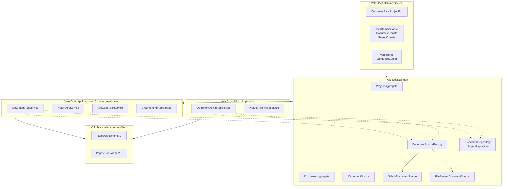

The **Docs module** (`Volo.Docs.*`) is ABP's documentation hosting platform — the same engine that powers `docs.abp.io`. Each documentation set is modelled as a **Project** whose `Document`s live in an external source (a GitHub repository or a local folder), are pulled on demand, cached in the database, rendered as HTML/PDF, and navigated through a versioned table of contents with language switching.

The module ships as 19 projects under [`modules/docs/src/`](https://github.com/abpframework/abp/tree/dev/modules/docs/src). Every type referenced on these pages lives in that tree.

<Note>
**Docs vs. CMS Kit.** The [CMS Kit module](/modules/cms-kit/overview) is for *editable* CMS content (blogs, pages, comments) authored in the admin UI. The Docs module is for *externally authored* developer documentation — Markdown/HTML files committed to Git or dropped in a folder. They coexist happily and target different content lifecycles.
</Note>

## What's inside

<CardGroup cols={2}>
  <Card title="Domain" icon="cube" href="/modules/docs/domain">
    `Project` and `Document` aggregate roots, `IDocumentSource` strategy (`GithubDocumentSource`, `FileSystemDocumentSource`), repositories, and the `DocumentSourceFactory`. Lives in `Volo.Docs.Domain` + `.Domain.Shared`.
  </Card>
  <Card title="Application" icon="layer-group" href="/modules/docs/application">
    Public + admin application services. `DocumentAppService`, `ProjectAppService`, navigation, TOC generation, and the `Volo.Docs.Admin.*` services that manage projects and pull/clear cached documents.
  </Card>
  <Card title="Web UI" icon="window-maximize" href="/modules/docs/web">
    Razor Pages for end-users (`/Documents/{project}/{version}/{lang}/{doc}`) plus the admin back office. Includes the version/language switcher, sidebar navigation, TOC component, and search box.
  </Card>
  <Card title="Project model" icon="folder-tree" href="/modules/docs/domain#project-aggregate">
    A `Project` declares its `DocumentStoreType` (`"GitHub"` or `"FileSystem"`), `Format` (`md` / `html`), default/navigation/parameter document names, and per-version extra-properties (branch prefix, language config).
  </Card>
  <Card title="Document model" icon="file-lines" href="/modules/docs/domain#document-aggregate">
    `Document` is keyed by `(ProjectId, Name, LanguageCode, Version)` and stores raw content + commit metadata + contributors. Cached in the DB, refreshed on TTL or admin "Pull".
  </Card>
  <Card title="Sources" icon="diagram-project" href="/modules/docs/domain#document-sources">
    `IDocumentSource` strategy: `GithubDocumentSource` (Octokit + raw.githubusercontent), `FileSystemDocumentSource` (local folder). New sources plug in via `DocumentSourceOptions.Sources`.
  </Card>
</CardGroup>

## End-to-end pipeline

A request like `/Documents/abp/latest/en/Tutorials/Index.md` flows through the layers below. Every box is a real type in `modules/docs/src/`.

```mermaid
flowchart LR
    Browser[Browser GET<br/>/Documents/{project}/{ver}/{lang}/{doc}] --> Page[Pages/Documents/Project/<br/>Index.cshtml.cs]
    Page --> DocApp[DocumentAppService<br/>GetAsync]
    Page --> ProjApp[ProjectAppService<br/>GetAsync/GetVersionsAsync]
    DocApp --> ProjRepo[(IProjectRepository)]
    DocApp --> DocRepo[(IDocumentRepository)]
    DocApp --> Factory{DocumentSourceFactory<br/>Create sourceType}
    Factory -->|"GitHub"| Github[GithubDocumentSource]
    Factory -->|"FileSystem"| Fs[FileSystemDocumentSource]
    Factory -->|custom| Custom[Your IDocumentSource]
    Github --> GH[(api.github.com<br/>+ raw.githubusercontent.com)]
    Fs --> Disk[(Local folder<br/>project.GetFileSystemPath)]
    DocApp --> Cache[(IDistributedCache<br/>DocumentResource)]
    DocApp --> Toc[ITocGeneratorService]
    DocApp --> Search[IDocumentFullSearch<br/>Elastic optional]
    DocApp --> Render[IDocumentToHtmlConverterFactory<br/>Markdig / Html]
    Render --> Page
    Page --> Browser
```

The same `IDocumentSource` strategy answers three questions for every project: *give me this document*, *list the versions*, *list the supported languages*. The factory picks the right implementation based on `Project.DocumentStoreType`.

## Where each capability lives

| Concern | Project | Key types |
| --- | --- | --- |
| Aggregates, repos, sources | `Volo.Docs.Domain` | `Project`, `Document`, `IDocumentSource`, `DocumentSourceFactory`, `GithubDocumentSource`, `FileSystemDocumentSource` |
| Cross-cutting consts, ETOs | `Volo.Docs.Domain.Shared` | `DocsDomainConsts`, `DocumentConsts`, `ProjectConsts`, `VersionInfo`, `LanguageConfig`, `DocumentNotFoundException` |
| Public read-side services | `Volo.Docs.Application` + `.Application.Contracts` | `DocumentAppService`, `IDocumentAppService`, `TocGeneratorService`, `ITocGeneratorService` |
| Shared read-side services | `Volo.Docs.Common.Application` + `.Common.Application.Contracts` | `ProjectAppService`, `IProjectAppService`, `DocumentPdfAppService` |
| Admin write-side services | `Volo.Docs.Admin.Application` + `.Admin.Application.Contracts` | `ProjectAdminAppService`, `DocumentAdminAppService`, `DocumentPdfAdminAppService` |
| HTTP APIs | `Volo.Docs.HttpApi`, `.Common.HttpApi`, `.Admin.HttpApi` | Auto-mapped controllers |
| Persistence | `Volo.Docs.EntityFrameworkCore`, `Volo.Docs.MongoDB` | `DocsDbContext`, `EFCoreDocumentRepository`, `MongoDocumentRepository` |
| End-user UI | `Volo.Docs.Web` | `Pages/Documents/...`, TOC component, Markdig renderer |
| Admin UI | `Volo.Docs.Admin.Web` | `Pages/Docs/Admin/Projects`, `Pages/Docs/Admin/Documents` |
| Installer | `Volo.Docs.Installer` | NuGet/CLI metadata |

## Document lifecycle

<Steps>
  <Step title="An admin creates a Project">
    Via `Pages/Docs/Admin/Projects/Create.cshtml`, calling `ProjectAdminAppService.CreateAsync`. The form captures `ShortName` (used in URLs), `DocumentStoreType`, `Format`, `DefaultDocumentName` (default `"Index"`), `NavigationDocumentName` (default `"docs-nav.json"`), `ParametersDocumentName` (default `"docs-params.json"`), and source-specific extra properties (GitHub URL/token, file-system path, version branch prefix).
  </Step>
  <Step title="A reader hits the project URL">
    `Volo.Docs.Web/Pages/Documents/Project/Index.cshtml.cs` binds `ProjectName`, `Version`, `LanguageCode`, `DocumentName` from the route and asks `DocumentAppService.GetAsync` for the rendered document.
  </Step>
  <Step title="The app service resolves the source">
    `DocumentAppService` loads the `Project` via `IProjectRepository`, checks `IDocumentRepository` for a cached copy that is still within `CacheTimeout`, and otherwise calls `IDocumentSourceFactory.Create(project.DocumentStoreType)`.
  </Step>
  <Step title="The source fetches and stores the Document">
    `GithubDocumentSource` downloads raw content via `IGithubRepositoryManager` and enriches it with commit history. `FileSystemDocumentSource` reads from `project.GetFileSystemPath() + languageCode + documentName`. The result is a `Document` entity persisted via `IDocumentRepository`.
  </Step>
  <Step title="Render + ship to the browser">
    The Razor page runs the content through `IDocumentToHtmlConverterFactory` (Markdig for `md`, passthrough for `html`), produces the right-hand TOC via `ITocGeneratorService.GenerateTocItems`, builds the left-hand `NavigationNode` from `docs-nav.json`, and renders the version/language switcher.
  </Step>
  <Step title="Optional: admin refresh">
    `DocumentAdminAppService.PullAllAsync` and `ClearCacheAsync` force a re-fetch from the source and bust the `IDistributedCache<DocumentResource>` / `IDistributedCache<LanguageConfig>` entries.
  </Step>
</Steps>

## Source resolution at a glance

<Tabs>
  <Tab title="GitHub-backed project">
    ```csharp
    // Project row
    new Project(
        id: Guid.NewGuid(),
        name: "ABP",
        shortName: "abp",
        documentStoreType: GithubDocumentSource.Type,   // "GitHub"
        format: "md",
        defaultDocumentName: "Index",
        navigationDocumentName: "docs-nav.json",
        parametersDocumentName: "docs-params.json"
    );

    // Extra properties read by GithubDocumentSource:
    //   "GitHubRootUrl"            -> https://github.com/abpframework/abp/tree/{version}/docs
    //   "GitHubAccessToken"        -> optional PAT for private repos / rate limits
    //   "GitHubUserAgent"          -> Octokit User-Agent
    //   "GithubVersionProviderSource" -> Releases | Branches
    //   "VersionBranchPrefix"      -> e.g. "rel-" when using Branches
    ```
  </Tab>
  <Tab title="File-system-backed project">
    ```csharp
    new Project(
        id: Guid.NewGuid(),
        name: "Internal Docs",
        shortName: "internal",
        documentStoreType: FileSystemDocumentSource.Type,   // "FileSystem"
        format: "md"
    );

    // Extra property: "Path" -> absolute or relative folder on the web server.
    // Layout expected by FileSystemDocumentSource:
    //   {Path}/docs-langs.json          (language config)
    //   {Path}/{languageCode}/Index.md
    //   {Path}/{languageCode}/docs-nav.json
    //   {Path}/{languageCode}/...
    // Version is hard-coded to "1.0.0" - file-system sources have a single version.
    ```
  </Tab>
  <Tab title="Custom source">
    ```csharp
    public class S3DocumentSource : DomainService, IDocumentSource
    {
        public const string Type = "S3";

        public Task<Document>      GetDocumentAsync(...)    { /* ... */ }
        public Task<List<VersionInfo>> GetVersionsAsync(Project p) { /* ... */ }
        public Task<DocumentResource>  GetResource(...)     { /* ... */ }
        public Task<LanguageConfig>    GetLanguageListAsync(...) { /* ... */ }
    }

    // Register in your DocsDomainModule extension:
    Configure<DocumentSourceOptions>(options =>
    {
        options.Sources.Add(S3DocumentSource.Type, typeof(S3DocumentSource));
    });
    ```
  </Tab>
</Tabs>

## Versioning & language model

<CardGroup cols={2}>
  <Card title="Versions" icon="code-branch">
    `IDocumentSource.GetVersionsAsync` returns `List<VersionInfo>`. GitHub queries Octokit `repository.releases` or `repository.branches` (per `GithubVersionProviderSource`); the file-system source returns an empty list (single version). `latest` is resolved by `ProjectAppService.GetVersionsAsync` and cached in `IDistributedCache<List<VersionInfo>>`.
  </Card>
  <Card title="Languages" icon="language">
    Each project ships a `docs-langs.json` whose schema is `LanguageConfig { List<LanguageConfigElement> Languages }`. Loaded by `IDocumentSource.GetLanguageListAsync`, cached as `IDistributedCache<LanguageConfig>`, surfaced as the language `<select>` in the UI. See [Multi-lingual objects](/localization/multi-lingual-objects) for ABP's broader translation primitives.
  </Card>
  <Card title="Cache" icon="bolt">
    `Document` rows have `LastCachedTime`. `DocumentAppService` reads `Volo.Docs:CacheTimeOutAsHour` from configuration (default 2 hours). Past that, the source is re-queried. Admin "Pull" / "Clear cache" buttons force eviction via `DocumentAdminAppService`.
  </Card>
  <Card title="Resources" icon="image">
    Non-document files (images, code samples) flow through `DocumentAppService.GetResourceAsync` → `IDocumentSource.GetResource` → `IDistributedCache<DocumentResource>`. The cache key includes project, version, language, and resource name.
  </Card>
</CardGroup>

## How the pieces wire up



## Quick links

<CardGroup cols={3}>
  <Card title="Project aggregate" icon="folder" href="/modules/docs/domain#project-aggregate" />
  <Card title="Document aggregate" icon="file" href="/modules/docs/domain#document-aggregate" />
  <Card title="GithubDocumentSource" icon="github" href="/modules/docs/domain#githubdocumentsource" />
  <Card title="FileSystemDocumentSource" icon="hard-drive" href="/modules/docs/domain#filesystemdocumentsource" />
  <Card title="DocumentAppService" icon="layer-group" href="/modules/docs/application#documentappservice" />
  <Card title="ProjectAppService" icon="diagram-project" href="/modules/docs/application#projectappservice" />
  <Card title="Admin services" icon="lock" href="/modules/docs/application#admin-services" />
  <Card title="Reader pages" icon="window-maximize" href="/modules/docs/web#reader-pages" />
  <Card title="Admin pages" icon="screwdriver-wrench" href="/modules/docs/web#admin-pages" />
</CardGroup>

<Warning>
**No editing in the back office.** The Docs admin UI manages *projects* and refreshes caches; it does **not** edit document content. Authors edit Markdown in Git (or on disk for file-system projects). If you need an in-app authoring workflow for content, use [CMS Kit pages](/modules/cms-kit/pages) instead.
</Warning>

## Configuration cheatsheet

The module reads a handful of keys from `IConfiguration` (`appsettings.json` section: `"Volo.Docs"`) and from strongly-typed options. The defaults are tuned for `docs.abp.io`; tweak per environment.

<Tabs>
  <Tab title="appsettings.json">
    ```json
    {
      "Volo.Docs": {
        "CacheTimeOutAsHour": 2,
        "DocumentResource": {
          "AbsoluteExpirationAsHour": 6,
          "SlidingExpirationAsHour": 1
        },
        "ElasticSearch": {
          "Enable": false,
          "Url": "http://elastic:9200",
          "IndexName": "abp-docs"
        }
      }
    }
    ```
    `CacheTimeOutAsHour` controls how stale a row in `IDocumentRepository` may become before `DocumentAppService` re-queries the source. The two `DocumentResource.*` keys govern the binary-resource distributed cache (images, archives).
  </Tab>
  <Tab title="DocsUiOptions">
    ```csharp
    Configure<DocsUiOptions>(options =>
    {
        options.RoutePrefix          = "documents";   // /documents/...
        options.MultiLanguageMode    = true;          // show language switcher
        options.ShowProjectsCombobox = true;          // top-nav project picker
        options.SectionRendering     = true;          // Scriban-powered per-section tabs
        options.EnableEnlargeImage   = true;          // click image to zoom
    });
    ```
    Single-site mode is a single setter:
    ```csharp
    options.SingleProjectMode.Enable      = true;
    options.SingleProjectMode.ProjectName = "myproject";
    ```
  </Tab>
  <Tab title="DocsElasticSearchOptions">
    ```csharp
    Configure<DocsElasticSearchOptions>(options =>
    {
        options.Enable    = true;
        options.Url       = "http://elastic:9200";
        options.IndexName = "abp-docs";
    });
    ```
    Lights up `IDocumentAppService.SearchAsync` + the search box in the reader pages. With `Enable = false` the box hides and `FullSearchEnabledAsync()` returns `false`.
  </Tab>
</Tabs>

## Extension surfaces

The Docs module is a *framework* — most teams need to extend at least one of these seams:

<CardGroup cols={2}>
  <Card title="Custom IDocumentSource" icon="diagram-project" href="/modules/docs/domain#idocumentsource-strategy">
    Implement `IDocumentSource`, register it in `DocumentSourceOptions.Sources`, and your projects can declare `DocumentStoreType = "MyStore"`. Use this for private S3 buckets, Confluence exports, database-stored Markdown, or auth-gated sources.
  </Card>
  <Card title="INavigationTreePostProcessor" icon="filter">
    Implement to filter or rewrite the sidebar tree after it is loaded. Common uses: hide nodes behind a permission, A/B-test new docs, swap titles per culture without editing the JSON.
  </Card>
  <Card title="IDocumentToHtmlConverter" icon="code">
    Plug in alternate renderers — for example a `pdf-md` converter that targets the print stylesheet, or an `asciidoc` converter if your docs aren't Markdown.
  </Card>
  <Card title="IWebDocumentSectionRenderer" icon="puzzle-piece">
    Replace `ScribanWebDocumentSectionRenderer` to ship your own per-section templating language. Or compose with the default to add custom helpers.
  </Card>
</CardGroup>

## Module dependencies

```text
Volo.Docs.Installer
Volo.Docs.Domain.Shared      <-- ETOs, consts, exceptions, VersionInfo
   └── Volo.Docs.Domain      <-- aggregates, sources, repos
        ├── Volo.Docs.EntityFrameworkCore
        ├── Volo.Docs.MongoDB
        ├── Volo.Docs.Common.Application.Contracts
        │    └── Volo.Docs.Common.Application
        ├── Volo.Docs.Application.Contracts
        │    └── Volo.Docs.Application
        └── Volo.Docs.Admin.Application.Contracts
             └── Volo.Docs.Admin.Application
                  └── Volo.Docs.Admin.HttpApi
                       └── Volo.Docs.Admin.HttpApi.Client
Volo.Docs.HttpApi
Volo.Docs.HttpApi.Client
Volo.Docs.Common.HttpApi
Volo.Docs.Common.HttpApi.Client
Volo.Docs.Web                <-- public Razor Pages
Volo.Docs.Admin.Web          <-- admin Razor Pages
```

Compose the projects you actually need: a tiered solution typically references `Domain` + `EntityFrameworkCore` on the server, the relevant `.Application` projects on the app host, and `.Web` + `.Admin.Web` on the UI tier. Microservice solutions can reach in via `.HttpApi.Client`.

## When to choose the Docs module

<CardGroup cols={2}>
  <Card title="Yes, use Docs" icon="check">
    - Your docs already live in a Git repo and authors PR them.
    - You need version + language switching out of the box.
    - You want "edit on GitHub" links and contributor avatars for free.
    - You need a public reader site and a small back office (refresh / PDF), not a CMS.
  </Card>
  <Card title="Look elsewhere" icon="circle-info">
    - Authors expect an in-app WYSIWYG editor → use [CMS Kit pages](/modules/cms-kit/pages).
    - Each "doc" is a richly structured database entity with workflow → custom module.
    - You need multi-tenant docs with per-tenant content authoring → CMS Kit + tenants.
    - You only want a single static page → a Razor page is simpler than this module.
  </Card>
</CardGroup>

## Related reading

<CardGroup cols={2}>
  <Card title="CMS Kit overview" icon="newspaper" href="/modules/cms-kit/overview">
    Sister module for editable content (blogs, pages, comments). Different lifecycle, complementary scope.
  </Card>
  <Card title="Multi-lingual objects" icon="language" href="/localization/multi-lingual-objects">
    ABP's general primitive for storing translations on entities. The Docs module uses a simpler per-document `LanguageCode` model — this guide explains the richer alternative.
  </Card>
</CardGroup>
